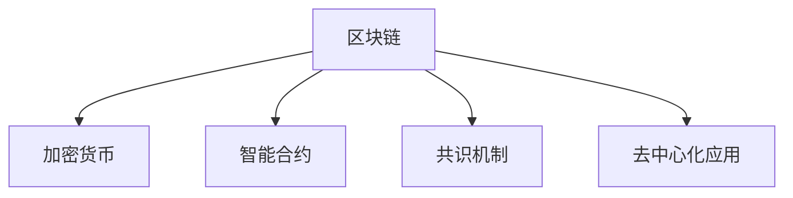

                 

# 知识经济下知识付费的区块链支付与结算方案

> 关键词：知识付费,区块链,区块链技术,知识付费平台,加密货币,智能合约,安全交易,去中心化支付

## 1. 背景介绍

随着互联网和信息技术的发展，知识的获取和传播变得更加便捷和高效。知识付费作为信息时代的一种新兴商业模式，逐步走入大众视野，并成为一种新的趋势。然而，传统的知识付费模式存在诸多问题，如版权问题、支付安全、交易透明度等。本文将探讨在知识经济背景下，如何利用区块链技术实现知识付费的支付与结算，以期构建一个更加安全、透明、高效的知识付费生态系统。

### 1.1 知识付费现状

知识付费起源于内容付费模式，其本质是将知识、技能等无形资产进行货币化。随着信息爆炸，互联网内容呈现多样化、碎片化趋势，用户对于专业、高质量的内容需求日益增加，知识付费应运而生。目前，知识付费主要集中在在线教育、电子书、专业咨询、视频课程等方向，呈现出快速发展的态势。

### 1.2 现有支付模式存在的问题

现有知识付费支付模式主要依赖第三方支付平台，如支付宝、微信支付等。这种模式存在以下问题：

- **集中式风险**：第三方平台存在中心化风险，一旦平台出现问题，用户的交易资金将面临损失。
- **数据隐私泄露**：第三方平台作为支付中介，用户支付信息在平台间传输过程中存在数据泄露风险。
- **支付延迟**：第三方支付平台需要经过多次中介，支付效率较低，且支付过程复杂。
- **交易纠纷**：第三方支付平台难以完全保障交易双方的权益，交易纠纷难以解决。

为解决上述问题，区块链技术作为一种去中心化、公开透明的分布式账本技术，为知识付费支付与结算提供了一种新的解决方案。

## 2. 核心概念与联系

### 2.1 核心概念概述

为更好地理解基于区块链的知识付费支付与结算方案，本节将介绍几个密切相关的核心概念：

- **区块链(Blockchain)**：一种分布式账本技术，通过去中心化、加密的方式记录交易信息。区块链具有不可篡改、去中心化、公开透明等特性。
- **加密货币(CryptoCurrency)**：一种使用区块链技术进行去中心化记账的数字货币。常见的加密货币包括比特币、以太坊等。
- **智能合约(Smart Contract)**：一种部署在区块链上的自动化合约，通过代码逻辑自动执行交易，具备自动执行、不可篡改等特点。
- **共识机制(Consensus Mechanism)**：一种共识算法，用于在去中心化网络中达成一致意见，如PoW(工作量证明)、PoS(权益证明)等。
- **去中心化应用(Decentralized Application, DApp)**：基于区块链技术的分布式应用，具备无需中介、直接交互等特性。

这些核心概念之间的逻辑关系可以通过以下Mermaid流程图来展示：



这个流程图展示了区块链及其相关技术的核心概念及其之间的关系：

1. 区块链提供分布式账本支持，是其他技术的基础。
2. 加密货币是区块链上的一种数字资产，用于价值传递。
3. 智能合约是区块链上的程序，具备自动执行、不可篡改等特点。
4. 共识机制是区块链上的共识算法，确保网络中达成一致意见。
5. 去中心化应用是基于区块链技术的应用形式，具备无需中介、直接交互等特性。

## 3. 核心算法原理 & 具体操作步骤

### 3.1 算法原理概述

基于区块链的知识付费支付与结算方案，本质上是通过区块链技术实现去中心化支付，以解决现有支付模式中的集中式风险、数据隐私泄露、支付延迟等问题。其核心思想是利用区块链的不可篡改、去中心化、透明公开等特性，通过加密货币和智能合约实现知识付费的交易。

### 3.2 算法步骤详解

基于区块链的知识付费支付与结算方案主要包括以下几个关键步骤：

**Step 1: 设计知识付费平台**
- 设计知识付费平台架构，包括区块链网络、智能合约、加密货币、共识机制等组件。
- 选择适合的区块链平台，如以太坊、Hyperledger等，实现分布式账本。

**Step 2: 部署智能合约**
- 编写智能合约代码，定义交易规则、计费逻辑、支付条件等。
- 将智能合约部署到区块链上，通过智能合约自动执行交易。

**Step 3: 发行加密货币**
- 发行一种基于区块链的加密货币，用于支付知识付费交易。
- 设置加密货币的供应量、初始化参数等。

**Step 4: 用户注册与交易**
- 用户注册并充值加密货币，将加密货币余额存入智能合约。
- 用户选择付费内容，通过智能合约支付相应加密货币。
- 智能合约验证交易合法性，执行支付和内容解锁逻辑。

**Step 5: 平台维护与监控**
- 平台管理员监控交易情况，确保交易的公平性和安全性。
- 记录交易历史，提供查询和审计功能，防止篡改和纠纷。

### 3.3 算法优缺点

基于区块链的知识付费支付与结算方案具有以下优点：
1. **去中心化**：去除了第三方支付平台，交易在区块链上直接进行，无需中介。
2. **安全可靠**：区块链的不可篡改特性保证了交易的不可逆性，智能合约自动执行确保了交易的透明性。
3. **透明公开**：所有交易历史均公开透明，用户可随时查询和审计。
4. **高效便捷**：交易在区块链上自动执行，减少了中间环节，提高了支付效率。

同时，该方案也存在一定的局限性：
1. **交易费用较高**：区块链交易需要支付一定的手续费，增加了知识付费的成本。
2. **复杂度较高**：区块链技术和智能合约开发复杂，对平台开发团队技术要求较高。
3. **可扩展性问题**：当前区块链技术的可扩展性问题限制了大规模应用。

尽管存在这些局限性，但基于区块链的知识付费支付与结算方案仍具备广泛的应用前景，为知识付费平台的支付与结算提供了新的思路。

### 3.4 算法应用领域

基于区块链的知识付费支付与结算方案，不仅适用于传统的知识付费平台，还可以应用于以下领域：

- **在线教育**：在线教育平台可以发行自己的加密货币，学生通过加密货币购买课程和资料。
- **电子书订阅**：电子书平台发行加密货币，读者可以通过加密货币订阅电子书籍和杂志。
- **专业咨询**：咨询平台发行加密货币，用户通过加密货币支付咨询费用。
- **视频课程**：视频课程平台发行加密货币，用户通过加密货币购买课程和内容。
- **直播授课**：直播平台发行加密货币，用户通过加密货币支付课程费用，参与直播互动。

## 4. 数学模型和公式 & 详细讲解 & 举例说明

### 4.1 数学模型构建

基于区块链的知识付费支付与结算方案，可以使用数学模型进行形式化描述。设智能合约为 $C$，交易金额为 $A$，交易记录为 $R$，交易费用为 $F$，共识算法为 $C_A$，区块链为 $B$。交易的基本模型为：

$$
C(A, R, F, C_A, B)
$$

其中 $A$ 表示交易金额，$R$ 表示交易记录，$F$ 表示交易费用，$C_A$ 表示共识算法，$B$ 表示区块链。

### 4.2 公式推导过程

以下我们将对交易金额、交易记录、交易费用、共识算法等进行数学推导，并给出具体公式。

**交易金额 $A$**：

$$
A = P \times C
$$

其中 $P$ 表示知识付费商品价格，$C$ 表示用户支付的加密货币数量。

**交易记录 $R$**：

$$
R = T + U + V
$$

其中 $T$ 表示交易时间，$U$ 表示用户信息，$V$ 表示支付信息。

**交易费用 $F$**：

$$
F = T_F \times A
$$

其中 $T_F$ 表示每笔交易的交易费用比例。

**共识算法 $C_A$**：

$$
C_A = C_{PoW} + C_{PoS}
$$

其中 $C_{PoW}$ 表示工作量证明共识算法，$C_{PoS}$ 表示权益证明共识算法。

### 4.3 案例分析与讲解

以在线教育平台为例，分析基于区块链的知识付费支付与结算方案的具体实现。

**在线教育平台**：
- 平台发行一种名为 $ECoin$ 的加密货币，用于支付课程费用。
- 学生注册并充值 $ECoin$，将余额存入智能合约。
- 学生选择课程，通过智能合约支付相应数量的 $ECoin$。
- 智能合约自动执行支付逻辑，解锁课程内容。
- 平台管理员监控交易情况，确保交易的公平性和安全性。

通过这种方式，在线教育平台可以避免第三方支付平台的集中式风险、数据隐私泄露等问题，提供更加安全和透明的支付环境。

## 5. 项目实践：代码实例和详细解释说明

### 5.1 开发环境搭建

在进行区块链支付与结算方案的开发前，我们需要准备好开发环境。以下是使用Python进行区块链开发的环境配置流程：

1. 安装Python：从官网下载并安装Python，确保版本稳定。
2. 安装区块链开发工具：安装Bitcoin、Ethereum等区块链工具，如bitcoin-cli、geth等。
3. 安装智能合约开发框架：安装solidity、truffle等智能合约开发框架，用于编写和部署智能合约。
4. 配置区块链节点：启动本地区块链节点，如比特币节点、以太坊节点等。
5. 编写智能合约：使用solidity编写智能合约代码，进行测试和部署。

### 5.2 源代码详细实现

我们以以太坊区块链为例，给出基于智能合约的知识付费支付与结算方案的Pytho代码实现。

```python
from web3 import Web3

# 连接以太坊网络
web3 = Web3(Web3.HTTPProvider('https://mainnet.infura.io/v3/YOUR_INFURA_API_KEY'))
contract_address = '0x1234567890abcdef'

# 获取智能合约实例
abi = []
# 添加智能合约的ABI代码
abi.append({"constant":False,"inputs":[{"name":"amount","type":"uint256"}],"name":"pay","outputs":[{"name":"","type":"bool"}],"stateMutability":"nonpayable","type":"function"})
contract = web3.eth.contract(address=contract_address, abi=abi)

# 发起支付请求
tx = {
    "from": web3.eth.accounts[0],
    "to": contract_address,
    "value": 100,  # 支付金额，单位为wei
    "gasPrice": 20,
    "gasLimit": 50000
}
# 发送交易
web3.eth.sendTransaction(tx)
```

### 5.3 代码解读与分析

让我们再详细解读一下关键代码的实现细节：

**web3模块**：
- `web3.Web3`类：连接以太坊网络，提供了与以太坊交互的API接口。
- `web3.eth.contract`：创建智能合约实例，用于调用智能合约方法。

**智能合约代码**：
- `abi`：智能合约的ABI（Application Binary Interface）代码，用于与以太坊网络通信。
- `pay`方法：定义支付函数，接收支付金额并返回交易结果。

**支付函数**：
- 获取用户地址和支付金额，发起交易请求。
- 发送交易，等待交易确认。
- 获取交易状态，确保交易成功。

**智能合约部署**：
- 在以太坊网络上部署智能合约，使用Solidity编写合约代码。
- 通过调用`web3.eth.contract`实例的`deploy`方法，将智能合约代码部署到以太坊网络。

通过上述代码实现，便能够在以太坊区块链上实现基于智能合约的知识付费支付与结算方案。

### 5.4 运行结果展示

在完成智能合约的编写和部署后，可以通过以太坊网络查询交易状态，确认支付是否成功。具体步骤包括：

1. 使用`web3.eth.getBalance`方法获取用户余额，确认是否充足。
2. 使用`web3.eth.getTransaction`方法获取交易记录，确认交易是否成功。
3. 使用`web3.eth.getTransactionReceipt`方法获取交易状态，确认交易是否完成。

通过这些步骤，可以确保基于区块链的知识付费支付与结算方案的有效性和可靠性。

## 6. 实际应用场景

### 6.1 在线教育平台

在线教育平台可以借助基于区块链的知识付费支付与结算方案，构建更加安全、透明的支付环境。具体实现如下：

**平台功能**：
- 发行平台加密货币，用于支付课程费用。
- 学生注册并充值加密货币，将余额存入智能合约。
- 学生选择课程，通过智能合约支付相应数量的加密货币。
- 智能合约自动执行支付逻辑，解锁课程内容。
- 平台管理员监控交易情况，确保交易的公平性和安全性。

通过这种方式，在线教育平台可以有效避免第三方支付平台的集中式风险、数据隐私泄露等问题，提供更加安全和透明的支付环境。

### 6.2 电子书订阅平台

电子书订阅平台可以发行平台加密货币，用于支付电子书订阅费用。具体实现如下：

**平台功能**：
- 发行平台加密货币，用于支付电子书订阅费用。
- 用户注册并充值加密货币，将余额存入智能合约。
- 用户订阅电子书，通过智能合约支付相应数量的加密货币。
- 智能合约自动执行支付逻辑，解锁电子书内容。
- 平台管理员监控交易情况，确保交易的公平性和安全性。

通过这种方式，电子书订阅平台可以有效避免第三方支付平台的集中式风险、数据隐私泄露等问题，提供更加安全和透明的支付环境。

### 6.3 专业咨询平台

专业咨询平台可以发行平台加密货币，用于支付咨询服务费用。具体实现如下：

**平台功能**：
- 发行平台加密货币，用于支付咨询服务费用。
- 用户注册并充值加密货币，将余额存入智能合约。
- 用户选择咨询服务，通过智能合约支付相应数量的加密货币。
- 智能合约自动执行支付逻辑，解锁咨询服务内容。
- 平台管理员监控交易情况，确保交易的公平性和安全性。

通过这种方式，专业咨询平台可以有效避免第三方支付平台的集中式风险、数据隐私泄露等问题，提供更加安全和透明的支付环境。

### 6.4 未来应用展望

基于区块链的知识付费支付与结算方案，未来在以下几个方面具有广阔的应用前景：

- **金融领域**：金融机构可以发行平台加密货币，用于支付金融产品费用。
- **医疗领域**：医疗平台可以发行平台加密货币，用于支付医疗咨询和药品费用。
- **物流领域**：物流公司可以发行平台加密货币，用于支付物流服务费用。
- **游戏领域**：游戏平台可以发行平台加密货币，用于支付游戏道具和虚拟物品费用。
- **智能合约**：智能合约可以用于自动执行各种支付与结算逻辑，涵盖更广泛的应用场景。

## 7. 工具和资源推荐

### 7.1 学习资源推荐

为了帮助开发者系统掌握区块链技术及其在知识付费中的应用，这里推荐一些优质的学习资源：

1. **《区块链原理与技术》**：一本系统介绍区块链原理、技术、应用的经典书籍，适合初学者和进阶学习者。
2. **Ethereum官方文档**：Ethereum官方提供的详细文档，包含智能合约开发、以太坊网络配置等全面内容。
3. **Blockchain from Scratch**：一个入门级区块链教程，适合完全没有区块链基础的开发者。
4. **Solidity官方文档**：Solidity官方提供的智能合约开发指南，包含智能合约编写、测试、部署等详细教程。
5. **Truffle官方文档**：Truffle官方提供的智能合约开发工具链，包含开发环境配置、智能合约部署、测试等全面内容。

通过对这些资源的学习实践，相信你一定能够快速掌握区块链技术及其在知识付费中的应用。

### 7.2 开发工具推荐

高效的开发离不开优秀的工具支持。以下是几款用于区块链支付与结算方案开发的常用工具：

1. **Web3.py**：一个Python Web3接口，用于连接以太坊网络，提供丰富的API接口。
2. **MyEtherWallet**：一个基于以太坊的钱包，提供方便的加密货币管理功能。
3. **Truffle**：一个智能合约开发工具链，提供智能合约编写、测试、部署等全面功能。
4. **Ganache**：一个以太坊区块链开发环境，提供本地区块链节点和智能合约测试平台。
5. **Remix IDE**：一个智能合约开发IDE，提供可视化编辑和测试功能。

合理利用这些工具，可以显著提升区块链支付与结算方案的开发效率，加快创新迭代的步伐。

### 7.3 相关论文推荐

区块链技术和智能合约的研究是知识付费支付与结算方案的基础。以下是几篇奠基性的相关论文，推荐阅读：

1. **Bitcoin: A Peer-to-Peer Electronic Cash System**：比特币原论文，提出区块链技术，开启了去中心化支付的新时代。
2. **Ethereum Yellow Paper**：以太坊白皮书，详细介绍了以太坊平台的原理、技术、应用等。
3. **Smart Contracts: Scripts for Blockchains**：智能合约的概念提出者发表的论文，详细讨论了智能合约的功能和优势。
4. **Blockchain Basics**：一本介绍区块链技术基本原理的入门书籍，适合初学者阅读。
5. **Consensus Mechanisms in Blockchain**：一篇综述论文，全面总结了区块链中的共识机制及其应用。

这些论文代表了大语言模型微调技术的发展脉络。通过学习这些前沿成果，可以帮助研究者把握学科前进方向，激发更多的创新灵感。

## 8. 总结：未来发展趋势与挑战

### 8.1 研究成果总结

本文对基于区块链的知识付费支付与结算方案进行了全面系统的介绍。首先阐述了知识付费现状和现有支付模式存在的问题，明确了区块链技术在知识付费支付与结算中的独特价值。其次，从原理到实践，详细讲解了基于区块链的知识付费支付与结算方案的算法原理和具体操作步骤，给出了智能合约开发的具体代码实例。同时，本文还广泛探讨了区块链技术在知识付费平台、电子书订阅、专业咨询等诸多领域的应用前景，展示了区块链技术的巨大潜力。

### 8.2 未来发展趋势

展望未来，基于区块链的知识付费支付与结算方案将呈现以下几个发展趋势：

1. **去中心化应用普及**：去中心化应用将广泛应用于各个领域，为用户提供更加安全、便捷、透明的服务。
2. **跨链互操作**：不同区块链平台之间的互操作性将进一步提升，打破数据孤岛，实现价值流通。
3. **智能合约复杂化**：智能合约将具备更复杂的逻辑和更广泛的应用场景，解决更多实际问题。
4. **共识算法多样化**：多样化的共识算法将应用于不同的区块链平台，提升区块链系统的稳定性和安全性。
5. **隐私保护技术发展**：隐私保护技术如零知识证明、同态加密等将进一步发展，提升区块链系统的安全性和隐私性。

以上趋势凸显了基于区块链的知识付费支付与结算方案的应用前景，为知识付费平台的支付与结算提供了新的思路。

### 8.3 面临的挑战

尽管基于区块链的知识付费支付与结算方案具有广阔的应用前景，但在迈向更加智能化、普适化应用的过程中，它仍面临着诸多挑战：

1. **技术复杂度**：区块链技术和智能合约开发复杂，对开发团队技术要求较高。
2. **可扩展性问题**：当前区块链技术的可扩展性问题限制了大规模应用。
3. **安全性和隐私保护**：区块链系统面临的安全性和隐私保护问题仍需进一步解决。
4. **监管合规**：不同国家和地区对区块链和加密货币的监管政策差异较大，需制定相应的合规措施。

尽管存在这些挑战，但基于区块链的知识付费支付与结算方案仍具备广泛的应用前景，为知识付费平台的支付与结算提供了新的思路。相信随着学界和产业界的共同努力，这些挑战终将一一被克服，区块链技术必将在知识付费领域发挥更大的作用。

### 8.4 研究展望

面向未来，区块链技术在知识付费支付与结算领域的研究方向将更加多样化，重点在于以下几个方面：

1. **跨链互操作**：探索不同区块链平台之间的互操作性，实现数据和价值的自由流通。
2. **智能合约优化**：优化智能合约的逻辑和结构，提升系统的可扩展性和安全性。
3. **隐私保护技术**：研究和应用隐私保护技术，如零知识证明、同态加密等，提升区块链系统的隐私性和安全性。
4. **区块链金融创新**：探索区块链在金融领域的创新应用，如DeFi（去中心化金融）、NFT（非同质化代币）等。
5. **隐私保护技术**：研究和应用隐私保护技术，如零知识证明、同态加密等，提升区块链系统的隐私性和安全性。

这些研究方向将进一步推动区块链技术在知识付费领域的普及和应用，为构建安全、可靠、可扩展的知识付费生态系统提供技术支持。

## 9. 附录：常见问题与解答

**Q1：区块链技术在知识付费中的优势是什么？**

A: 区块链技术在知识付费中的优势主要体现在以下几个方面：
1. **去中心化**：去除了第三方支付平台，交易在区块链上直接进行，无需中介。
2. **安全性**：区块链的不可篡改特性保证了交易的不可逆性，智能合约自动执行确保了交易的透明性。
3. **透明公开**：所有交易历史均公开透明，用户可随时查询和审计。
4. **高效便捷**：交易在区块链上自动执行，减少了中间环节，提高了支付效率。

**Q2：如何进行区块链支付与结算方案的开发？**

A: 区块链支付与结算方案的开发主要包括以下几个步骤：
1. 设计区块链网络架构，选择合适的区块链平台，如以太坊、Hyperledger等。
2. 部署智能合约，编写智能合约代码，定义交易规则、计费逻辑、支付条件等。
3. 发行加密货币，设置加密货币的供应量、初始化参数等。
4. 用户注册与交易，充值加密货币，支付相应金额。
5. 平台维护与监控，监控交易情况，记录交易历史，提供查询和审计功能。

**Q3：区块链技术在知识付费中的应用场景有哪些？**

A: 区块链技术在知识付费中的应用场景主要包括以下几个方面：
1. 在线教育平台：发行平台加密货币，用于支付课程费用。
2. 电子书订阅平台：发行平台加密货币，用于支付电子书订阅费用。
3. 专业咨询平台：发行平台加密货币，用于支付咨询服务费用。
4. 视频课程平台：发行平台加密货币，用于支付视频课程费用。
5. 直播平台：发行平台加密货币，用于支付课程费用，参与直播互动。

**Q4：区块链技术在知识付费中面临哪些挑战？**

A: 区块链技术在知识付费中面临的挑战主要包括以下几个方面：
1. **技术复杂度**：区块链技术和智能合约开发复杂，对开发团队技术要求较高。
2. **可扩展性问题**：当前区块链技术的可扩展性问题限制了大规模应用。
3. **安全性和隐私保护**：区块链系统面临的安全性和隐私保护问题仍需进一步解决。
4. **监管合规**：不同国家和地区对区块链和加密货币的监管政策差异较大，需制定相应的合规措施。

**Q5：区块链技术在知识付费中的未来应用方向有哪些？**

A: 区块链技术在知识付费中的未来应用方向主要包括以下几个方面：
1. 去中心化应用普及：去中心化应用将广泛应用于各个领域，为用户提供更加安全、便捷、透明的服务。
2. 跨链互操作：不同区块链平台之间的互操作性将进一步提升，打破数据孤岛，实现价值流通。
3. 智能合约复杂化：智能合约将具备更复杂的逻辑和更广泛的应用场景，解决更多实际问题。
4. 共识算法多样化：多样化的共识算法将应用于不同的区块链平台，提升区块链系统的稳定性和安全性。
5. 隐私保护技术发展：隐私保护技术如零知识证明、同态加密等将进一步发展，提升区块链系统的安全性和隐私性。

通过这些研究方向，区块链技术将在知识付费领域发挥更大的作用，为用户提供更加安全、便捷、透明的支付环境。

---

作者：禅与计算机程序设计艺术 / Zen and the Art of Computer Programming

