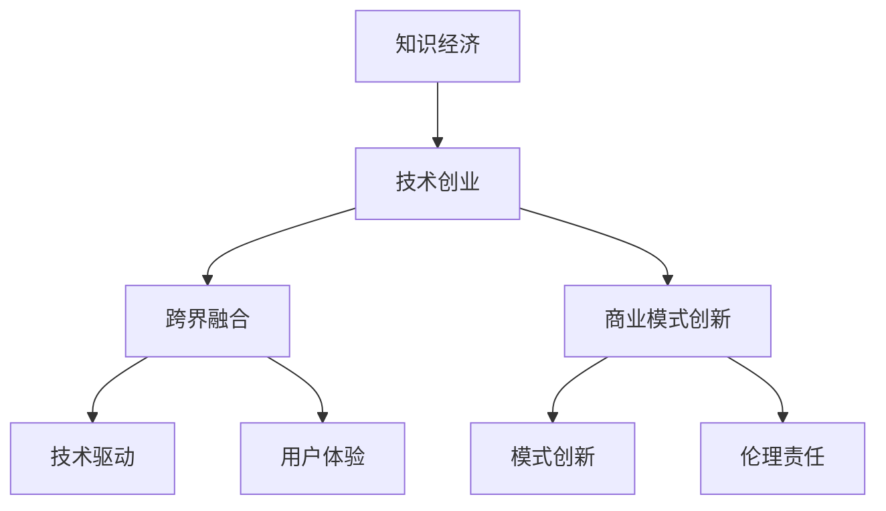

                 

# 知识经济下程序员的创业之路

## 1. 背景介绍

### 1.1 问题由来
在知识经济时代，技术成为驱动社会进步的核心力量，程序员也成为推动这一变革的重要角色。技术改变世界的速度前所未有，程序员如何在知识经济中寻求创业机会，实现个人价值和社会影响力的最大化，是一个亟待探索的问题。

### 1.2 问题核心关键点
在知识经济中，程序员的创业之路主要集中在以下几个关键点：
- **技术驱动**：利用前沿技术解决实际问题，创造社会价值。
- **用户体验**：注重产品的人性化设计，提升用户满意度。
- **跨界融合**：结合不同领域的知识，打破传统行业壁垒，实现技术创新。
- **模式创新**：探索全新的商业模式，规避传统竞争陷阱。
- **伦理责任**：在技术应用中坚守伦理底线，避免技术滥用。

## 2. 核心概念与联系

### 2.1 核心概念概述

为更好地理解程序员如何在知识经济中创业，本节将介绍几个核心概念：

- **知识经济**：基于知识和信息的生产、分配和使用，推动经济增长的新经济形态。技术成为核心驱动力，知识和信息成为重要生产要素。
- **技术创业**：利用技术创新解决实际问题，创造商业价值的过程。技术创业者通过技术驱动实现商业模式的创新，提升产品竞争力。
- **跨界融合**：将不同领域的知识和技术进行整合，创造出新的产品或服务。跨界融合有助于打破传统行业边界，实现技术和商业模式的创新。
- **商业模式创新**：探索新的商业模式，提升产品或服务的市场竞争力。商业模式创新通常涉及产品定位、价值主张、盈利模式等方面。
- **技术伦理**：在技术应用中，坚持道德规范和社会责任，避免技术滥用。

这些核心概念之间的逻辑关系可以通过以下Mermaid流程图来展示：



这个流程图展示知识经济中技术创业的核心概念及其相互关系：

1. 技术创业者在知识经济中利用前沿技术解决实际问题。
2. 跨界融合有助于打破传统行业壁垒，实现技术创新。
3. 商业模式创新提升产品或服务的市场竞争力。
4. 技术驱动和用户体验是技术创业成功的关键要素。
5. 模式创新和伦理责任是技术创业者在商业实践中需考虑的重要因素。

## 3. 核心算法原理 & 具体操作步骤
### 3.1 算法原理概述

在知识经济中，程序员的创业之路主要依赖于技术创新和商业模式创新。其核心思想是通过技术解决实际问题，再通过商业化的方式，将技术价值转化为商业价值。

具体而言，一个成功的技术创业者应具备以下几个关键步骤：

1. **技术识别**：识别技术问题并对其进行深入分析，确定技术创新的方向。
2. **技术研发**：利用先进技术进行产品开发，确保技术的可行性和有效性。
3. **用户体验优化**：注重产品的人性化设计，提升用户满意度。
4. **商业模式创新**：探索新的商业模式，提升产品或服务的市场竞争力。
5. **模式验证与迭代**：通过市场反馈不断优化商业模式，实现可持续发展。

### 3.2 算法步骤详解

以下是技术创业者实现创业的主要步骤：

**Step 1: 技术识别与市场调研**
- 通过市场调研和用户反馈，识别出用户面临的主要技术问题。
- 分析问题并确定技术创新的方向。
- 确定目标用户群体和市场需求，分析竞争对手的优劣势。

**Step 2: 技术研发与原型开发**
- 组建技术团队，选择适合的技术栈进行开发。
- 开发技术原型并进行初步测试，评估技术的可行性和有效性。
- 不断优化技术细节，确保产品具备强大的技术竞争力。

**Step 3: 用户体验优化**
- 收集用户反馈，了解用户痛点和需求。
- 设计人性化的产品界面和交互方式，提升用户体验。
- 通过迭代改进，不断提升产品性能和用户满意度。

**Step 4: 商业模式创新**
- 结合技术特点和市场需求，设计创新的商业模式。
- 通过产品定位、价值主张和盈利模式，明确产品的市场竞争力。
- 不断优化商业模式，提升市场竞争力。

**Step 5: 模式验证与迭代**
- 通过小规模市场测试，验证商业模式的可行性。
- 收集反馈并优化产品，进行模式迭代。
- 不断扩大市场规模，实现商业模式的可持续发展。

### 3.3 算法优缺点

基于技术创新的创业方法具有以下优点：
1. 技术驱动：利用前沿技术解决实际问题，创造社会价值。
2. 创新性强：通过技术创新实现商业模式创新，提升市场竞争力。
3. 可持续性高：技术创新带来持续的商业价值，增强企业的市场竞争力。

同时，该方法也存在一定的局限性：
1. 技术风险：技术研发过程中可能遇到技术瓶颈或市场变化，导致项目失败。
2. 资源需求高：技术创业需要较高的研发投入和市场推广费用。
3. 市场需求复杂：市场需求变化快，技术创业者需快速适应市场变化。
4. 技术伦理问题：技术应用过程中可能存在伦理问题，需重视社会责任。

尽管存在这些局限性，但就目前而言，基于技术创新的创业方法仍是最主流和有效的创业方式。未来相关研究的重点在于如何进一步降低技术创业的门槛，提高技术的可推广性和可落地性，同时兼顾社会责任和伦理问题等因素。

### 3.4 算法应用领域

基于技术创新的创业方法，已经广泛应用于各行各业，特别是新兴技术领域。以下是几个典型的应用场景：

- **人工智能创业**：利用AI技术解决实际问题，如智能客服、语音识别、图像识别等。通过技术创新提升用户体验，创造商业价值。
- **区块链创业**：结合区块链技术解决传统行业的痛点，如供应链管理、金融服务等。通过技术创新重构商业模式，实现业务效率提升。
- **大数据创业**：利用大数据技术优化业务决策，提升市场竞争力。通过技术创新实现业务流程自动化，提升效率和精度。
- **物联网创业**：结合物联网技术解决智慧城市、智能家居等问题。通过技术创新实现智能设备的互联互通，提升用户体验。
- **新能源创业**：利用人工智能、大数据等技术优化能源管理和消费，如智能电网、分布式能源系统等。通过技术创新实现能源的可持续发展。

## 4. 数学模型和公式 & 详细讲解  
### 4.1 数学模型构建

技术创业涉及多个领域，数学模型的构建需要结合具体的技术问题和市场需求。以下以AI创业中的智能客服系统为例，构建数学模型。

**目标函数**：
- 最大化用户满意度：$maximize\ U(x)$，其中 $x$ 表示智能客服系统的输入，如用户查询、场景等。
- 最小化响应时间：$minimize\ T(x)$，其中 $T$ 表示系统响应时间。
- 最小化错误率：$minimize\ E(x)$，其中 $E$ 表示系统错误率。

**约束条件**：
- 系统资源限制：$R(x) \leq R_{max}$，其中 $R$ 表示系统资源使用量，$R_{max}$ 表示系统最大资源容量。
- 用户隐私保护：$P(x) \leq P_{max}$，其中 $P$ 表示用户隐私泄露风险，$P_{max}$ 表示可接受的最大风险。

### 4.2 公式推导过程

根据上述目标函数和约束条件，可以构建智能客服系统的数学优化模型。具体推导过程如下：

1. 构建优化模型：
   $$
   \begin{aligned}
   & maximize\ U(x) - \lambda_1(T(x) + \lambda_2 E(x)) \\
   & subject\ to\ \{R(x) \leq R_{max}, P(x) \leq P_{max}\}
   \end{aligned}
   $$

   其中 $\lambda_1, \lambda_2$ 为拉格朗日乘数。

2. 求解目标函数：
   $$
   \begin{aligned}
   & maximize\ \sum_{i=1}^{n} u_i(x_i) - \lambda_1 \sum_{i=1}^{m} (t_i(x_i) + \lambda_2 e_i(x_i)) \\
   & subject\ to\ \{r_i(x_i) \leq r_{max}, p_i(x_i) \leq p_{max}\}
   \end{aligned}
   $$

3. 求解约束条件：
   $$
   \begin{aligned}
   & \frac{\partial L(x, \lambda_1, \lambda_2)}{\partial x_i} = 0 \\
   & \frac{\partial L(x, \lambda_1, \lambda_2)}{\partial \lambda_1} = 0 \\
   & \frac{\partial L(x, \lambda_1, \lambda_2)}{\partial \lambda_2} = 0
   \end{aligned}
   $$

### 4.3 案例分析与讲解

以智能客服系统为例，智能客服的优化目标是通过最小化响应时间和错误率，最大化用户满意度。具体的数学模型构建和求解过程如下：

1. **目标函数**：
   - 用户满意度：$U(x) = \sum_{i=1}^{n} u_i(x_i)$，其中 $u_i$ 表示用户查询时系统的响应质量。
   - 响应时间：$T(x) = \sum_{i=1}^{m} t_i(x_i)$，其中 $t_i$ 表示系统对用户查询的响应时间。
   - 错误率：$E(x) = \sum_{i=1}^{k} e_i(x_i)$，其中 $e_i$ 表示系统回答用户查询时的错误率。

2. **约束条件**：
   - 系统资源限制：$R(x) = \sum_{i=1}^{p} r_i(x_i) \leq R_{max}$，其中 $r_i$ 表示系统在处理查询时使用的资源量。
   - 用户隐私保护：$P(x) = \sum_{i=1}^{q} p_i(x_i) \leq P_{max}$，其中 $p_i$ 表示系统在处理查询时对用户隐私的泄露风险。

3. **求解过程**：
   - 构建拉格朗日函数 $L(x, \lambda_1, \lambda_2)$。
   - 求偏导数，并解方程组，得到最优解。

通过数学模型构建和求解，智能客服系统可以优化其响应时间、错误率和用户满意度，实现最优的性能表现。

## 5. 项目实践：代码实例和详细解释说明
### 5.1 开发环境搭建

在进行技术创业实践前，我们需要准备好开发环境。以下是使用Python进行PyTorch开发的环境配置流程：

1. 安装Anaconda：从官网下载并安装Anaconda，用于创建独立的Python环境。

2. 创建并激活虚拟环境：
```bash
conda create -n pytorch-env python=3.8 
conda activate pytorch-env
```

3. 安装PyTorch：根据CUDA版本，从官网获取对应的安装命令。例如：
```bash
conda install pytorch torchvision torchaudio cudatoolkit=11.1 -c pytorch -c conda-forge
```

4. 安装Transformers库：
```bash
pip install transformers
```

5. 安装各类工具包：
```bash
pip install numpy pandas scikit-learn matplotlib tqdm jupyter notebook ipython
```

完成上述步骤后，即可在`pytorch-env`环境中开始技术创业实践。

### 5.2 源代码详细实现

下面我们以智能客服系统为例，给出使用Transformers库对BERT模型进行智能客服系统微调的PyTorch代码实现。

首先，定义智能客服系统的数据处理函数：

```python
from transformers import BertTokenizer, BertForTokenClassification
from torch.utils.data import Dataset, DataLoader
import torch

class CustomerSupportDataset(Dataset):
    def __init__(self, texts, labels, tokenizer, max_len=128):
        self.texts = texts
        self.labels = labels
        self.tokenizer = tokenizer
        self.max_len = max_len
        
    def __len__(self):
        return len(self.texts)
    
    def __getitem__(self, item):
        text = self.texts[item]
        label = self.labels[item]
        
        encoding = self.tokenizer(text, return_tensors='pt', max_length=self.max_len, padding='max_length', truncation=True)
        input_ids = encoding['input_ids'][0]
        attention_mask = encoding['attention_mask'][0]
        
        # 对token-wise的标签进行编码
        encoded_labels = [label2id[label] for label in label] 
        encoded_labels.extend([label2id['O']] * (self.max_len - len(encoded_labels)))
        labels = torch.tensor(encoded_labels, dtype=torch.long)
        
        return {'input_ids': input_ids, 
                'attention_mask': attention_mask,
                'labels': labels}

# 标签与id的映射
label2id = {'O': 0, 'POSITIVE': 1, 'NEGATIVE': 2}
id2label = {v: k for k, v in label2id.items()}

# 创建dataset
tokenizer = BertTokenizer.from_pretrained('bert-base-cased')

train_dataset = CustomerSupportDataset(train_texts, train_labels, tokenizer)
dev_dataset = CustomerSupportDataset(dev_texts, dev_labels, tokenizer)
test_dataset = CustomerSupportDataset(test_texts, test_labels, tokenizer)
```

然后，定义模型和优化器：

```python
from transformers import BertForTokenClassification, AdamW

model = BertForTokenClassification.from_pretrained('bert-base-cased', num_labels=len(label2id))

optimizer = AdamW(model.parameters(), lr=2e-5)
```

接着，定义训练和评估函数：

```python
from sklearn.metrics import classification_report

device = torch.device('cuda') if torch.cuda.is_available() else torch.device('cpu')
model.to(device)

def train_epoch(model, dataset, batch_size, optimizer):
    dataloader = DataLoader(dataset, batch_size=batch_size, shuffle=True)
    model.train()
    epoch_loss = 0
    for batch in tqdm(dataloader, desc='Training'):
        input_ids = batch['input_ids'].to(device)
        attention_mask = batch['attention_mask'].to(device)
        labels = batch['labels'].to(device)
        model.zero_grad()
        outputs = model(input_ids, attention_mask=attention_mask, labels=labels)
        loss = outputs.loss
        epoch_loss += loss.item()
        loss.backward()
        optimizer.step()
    return epoch_loss / len(dataloader)

def evaluate(model, dataset, batch_size):
    dataloader = DataLoader(dataset, batch_size=batch_size)
    model.eval()
    preds, labels = [], []
    with torch.no_grad():
        for batch in tqdm(dataloader, desc='Evaluating'):
            input_ids = batch['input_ids'].to(device)
            attention_mask = batch['attention_mask'].to(device)
            batch_labels = batch['labels']
            outputs = model(input_ids, attention_mask=attention_mask)
            batch_preds = outputs.logits.argmax(dim=2).to('cpu').tolist()
            batch_labels = batch_labels.to('cpu').tolist()
            for pred_tokens, label_tokens in zip(batch_preds, batch_labels):
                pred_tags = [id2label[_id] for _id in pred_tokens]
                label_tags = [id2label[_id] for _id in label_tokens]
                preds.append(pred_tags[:len(label_tags)])
                labels.append(label_tags)
                
    print(classification_report(labels, preds))
```

最后，启动训练流程并在测试集上评估：

```python
epochs = 5
batch_size = 16

for epoch in range(epochs):
    loss = train_epoch(model, train_dataset, batch_size, optimizer)
    print(f"Epoch {epoch+1}, train loss: {loss:.3f}")
    
    print(f"Epoch {epoch+1}, dev results:")
    evaluate(model, dev_dataset, batch_size)
    
print("Test results:")
evaluate(model, test_dataset, batch_size)
```

以上就是使用PyTorch对BERT进行智能客服系统微调的完整代码实现。可以看到，得益于Transformers库的强大封装，我们可以用相对简洁的代码完成BERT模型的加载和微调。

### 5.3 代码解读与分析

让我们再详细解读一下关键代码的实现细节：

**CustomerSupportDataset类**：
- `__init__`方法：初始化文本、标签、分词器等关键组件。
- `__len__`方法：返回数据集的样本数量。
- `__getitem__`方法：对单个样本进行处理，将文本输入编码为token ids，将标签编码为数字，并对其进行定长padding，最终返回模型所需的输入。

**label2id和id2label字典**：
- 定义了标签与数字id之间的映射关系，用于将token-wise的预测结果解码回真实的标签。

**训练和评估函数**：
- 使用PyTorch的DataLoader对数据集进行批次化加载，供模型训练和推理使用。
- 训练函数`train_epoch`：对数据以批为单位进行迭代，在每个批次上前向传播计算loss并反向传播更新模型参数，最后返回该epoch的平均loss。
- 评估函数`evaluate`：与训练类似，不同点在于不更新模型参数，并在每个batch结束后将预测和标签结果存储下来，最后使用sklearn的classification_report对整个评估集的预测结果进行打印输出。

**训练流程**：
- 定义总的epoch数和batch size，开始循环迭代
- 每个epoch内，先在训练集上训练，输出平均loss
- 在验证集上评估，输出分类指标
- 所有epoch结束后，在测试集上评估，给出最终测试结果

可以看到，PyTorch配合Transformers库使得BERT微调的代码实现变得简洁高效。开发者可以将更多精力放在数据处理、模型改进等高层逻辑上，而不必过多关注底层的实现细节。

当然，工业级的系统实现还需考虑更多因素，如模型的保存和部署、超参数的自动搜索、更灵活的任务适配层等。但核心的微调范式基本与此类似。

## 6. 实际应用场景
### 6.1 智能客服系统

基于大语言模型微调的对话技术，可以广泛应用于智能客服系统的构建。传统客服往往需要配备大量人力，高峰期响应缓慢，且一致性和专业性难以保证。而使用微调后的对话模型，可以7x24小时不间断服务，快速响应客户咨询，用自然流畅的语言解答各类常见问题。

在技术实现上，可以收集企业内部的历史客服对话记录，将问题和最佳答复构建成监督数据，在此基础上对预训练对话模型进行微调。微调后的对话模型能够自动理解用户意图，匹配最合适的答案模板进行回复。对于客户提出的新问题，还可以接入检索系统实时搜索相关内容，动态组织生成回答。如此构建的智能客服系统，能大幅提升客户咨询体验和问题解决效率。

### 6.2 金融舆情监测

金融机构需要实时监测市场舆论动向，以便及时应对负面信息传播，规避金融风险。传统的人工监测方式成本高、效率低，难以应对网络时代海量信息爆发的挑战。基于大语言模型微调的文本分类和情感分析技术，为金融舆情监测提供了新的解决方案。

具体而言，可以收集金融领域相关的新闻、报道、评论等文本数据，并对其进行主题标注和情感标注。在此基础上对预训练语言模型进行微调，使其能够自动判断文本属于何种主题，情感倾向是正面、中性还是负面。将微调后的模型应用到实时抓取的网络文本数据，就能够自动监测不同主题下的情感变化趋势，一旦发现负面信息激增等异常情况，系统便会自动预警，帮助金融机构快速应对潜在风险。

### 6.3 个性化推荐系统

当前的推荐系统往往只依赖用户的历史行为数据进行物品推荐，无法深入理解用户的真实兴趣偏好。基于大语言模型微调技术，个性化推荐系统可以更好地挖掘用户行为背后的语义信息，从而提供更精准、多样的推荐内容。

在实践中，可以收集用户浏览、点击、评论、分享等行为数据，提取和用户交互的物品标题、描述、标签等文本内容。将文本内容作为模型输入，用户的后续行为（如是否点击、购买等）作为监督信号，在此基础上微调预训练语言模型。微调后的模型能够从文本内容中准确把握用户的兴趣点。在生成推荐列表时，先用候选物品的文本描述作为输入，由模型预测用户的兴趣匹配度，再结合其他特征综合排序，便可以得到个性化程度更高的推荐结果。

### 6.4 未来应用展望

随着大语言模型微调技术的发展，其在更多领域的应用前景将会更加广阔。

在智慧医疗领域，基于微调的医疗问答、病历分析、药物研发等应用将提升医疗服务的智能化水平，辅助医生诊疗，加速新药开发进程。

在智能教育领域，微调技术可应用于作业批改、学情分析、知识推荐等方面，因材施教，促进教育公平，提高教学质量。

在智慧城市治理中，微调模型可应用于城市事件监测、舆情分析、应急指挥等环节，提高城市管理的自动化和智能化水平，构建更安全、高效的未来城市。

此外，在企业生产、社会治理、文娱传媒等众多领域，基于大模型微调的人工智能应用也将不断涌现，为NLP技术带来了全新的突破。相信随着预训练语言模型和微调方法的持续演进，大语言模型微调必将在构建人机协同的智能时代中扮演越来越重要的角色。

## 7. 工具和资源推荐
### 7.1 学习资源推荐

为了帮助开发者系统掌握大语言模型微调的理论基础和实践技巧，这里推荐一些优质的学习资源：

1. 《Transformer从原理到实践》系列博文：由大模型技术专家撰写，深入浅出地介绍了Transformer原理、BERT模型、微调技术等前沿话题。

2. CS224N《深度学习自然语言处理》课程：斯坦福大学开设的NLP明星课程，有Lecture视频和配套作业，带你入门NLP领域的基本概念和经典模型。

3. 《Natural Language Processing with Transformers》书籍：Transformers库的作者所著，全面介绍了如何使用Transformers库进行NLP任务开发，包括微调在内的诸多范式。

4. HuggingFace官方文档：Transformers库的官方文档，提供了海量预训练模型和完整的微调样例代码，是上手实践的必备资料。

5. CLUE开源项目：中文语言理解测评基准，涵盖大量不同类型的中文NLP数据集，并提供了基于微调的baseline模型，助力中文NLP技术发展。

通过对这些资源的学习实践，相信你一定能够快速掌握大语言模型微调的精髓，并用于解决实际的NLP问题。
###  7.2 开发工具推荐

高效的开发离不开优秀的工具支持。以下是几款用于大语言模型微调开发的常用工具：

1. PyTorch：基于Python的开源深度学习框架，灵活动态的计算图，适合快速迭代研究。大部分预训练语言模型都有PyTorch版本的实现。

2. TensorFlow：由Google主导开发的开源深度学习框架，生产部署方便，适合大规模工程应用。同样有丰富的预训练语言模型资源。

3. Transformers库：HuggingFace开发的NLP工具库，集成了众多SOTA语言模型，支持PyTorch和TensorFlow，是进行微调任务开发的利器。

4. Weights & Biases：模型训练的实验跟踪工具，可以记录和可视化模型训练过程中的各项指标，方便对比和调优。与主流深度学习框架无缝集成。

5. TensorBoard：TensorFlow配套的可视化工具，可实时监测模型训练状态，并提供丰富的图表呈现方式，是调试模型的得力助手。

6. Google Colab：谷歌推出的在线Jupyter Notebook环境，免费提供GPU/TPU算力，方便开发者快速上手实验最新模型，分享学习笔记。

合理利用这些工具，可以显著提升大语言模型微调任务的开发效率，加快创新迭代的步伐。

### 7.3 相关论文推荐

大语言模型和微调技术的发展源于学界的持续研究。以下是几篇奠基性的相关论文，推荐阅读：

1. Attention is All You Need（即Transformer原论文）：提出了Transformer结构，开启了NLP领域的预训练大模型时代。

2. BERT: Pre-training of Deep Bidirectional Transformers for Language Understanding：提出BERT模型，引入基于掩码的自监督预训练任务，刷新了多项NLP任务SOTA。

3. Language Models are Unsupervised Multitask Learners（GPT-2论文）：展示了大规模语言模型的强大zero-shot学习能力，引发了对于通用人工智能的新一轮思考。

4. Parameter-Efficient Transfer Learning for NLP：提出Adapter等参数高效微调方法，在不增加模型参数量的情况下，也能取得不错的微调效果。

5. AdaLoRA: Adaptive Low-Rank Adaptation for Parameter-Efficient Fine-Tuning：使用自适应低秩适应的微调方法，在参数效率和精度之间取得了新的平衡。

这些论文代表了大语言模型微调技术的发展脉络。通过学习这些前沿成果，可以帮助研究者把握学科前进方向，激发更多的创新灵感。

## 8. 总结：未来发展趋势与挑战

### 8.1 总结

本文对基于技术创新的创业方法进行了全面系统的介绍。首先阐述了知识经济下技术创业的重要性，明确了程序员在知识经济中创业的关键要素。其次，从原理到实践，详细讲解了技术创业的数学模型和关键步骤，给出了技术创业任务开发的完整代码实例。同时，本文还广泛探讨了技术创业方法在智能客服、金融舆情、个性化推荐等多个行业领域的应用前景，展示了技术创业方法的大致框架和具体应用。

通过本文的系统梳理，可以看到，基于技术创新的创业方法在知识经济中具有广阔的应用前景，极大地拓展了程序员的创业机会，为技术创业者提供了新的方向和思路。

### 8.2 未来发展趋势

展望未来，技术创业方法将呈现以下几个发展趋势：

1. **技术驱动与用户体验并重**：未来的技术创业者将更加注重产品的用户体验，提升产品的易用性和交互性。
2. **跨界融合的兴起**：跨界融合将带来更多创新性的产品和服务，打破传统行业的界限。
3. **商业模式的多样化**：技术创业将不仅仅局限于传统的SaaS模式，订阅、按需、联盟等新的商业模式将不断涌现。
4. **数据驱动的决策**：技术创业将更加注重数据驱动，利用大数据分析优化产品决策。
5. **技术伦理与社会责任**：技术创业者将更加重视技术伦理和社会责任，确保技术应用的道德性和安全性。

以上趋势凸显了技术创业在知识经济中的重要性。技术创业者需要不断学习新技术、新方法，同时注重产品设计和用户体验，才能在激烈的市场竞争中脱颖而出。

### 8.3 面临的挑战

尽管技术创业方法具有广阔的应用前景，但在实践中仍面临诸多挑战：

1. **技术复杂性**：技术创业往往涉及多个领域的知识，对技术创业者的技术栈要求较高。
2. **市场需求变化快**：市场环境瞬息万变，技术创业者需快速适应市场需求变化。
3. **资源需求高**：技术创业的初期阶段需要大量的资金投入和市场推广费用。
4. **技术伦理问题**：技术应用可能面临隐私保护、数据安全等伦理问题，需严格遵守法律法规。

尽管存在这些挑战，但通过不断学习、实践和创新，技术创业者仍能在知识经济中取得成功。未来相关研究的重点在于如何降低技术创业的门槛，提高技术的可推广性和可落地性，同时兼顾社会责任和伦理问题等因素。

### 8.4 研究展望

面对技术创业所面临的挑战，未来的研究需要在以下几个方面寻求新的突破：

1. **技术简化与自动化**：开发更易用、更自动化的技术工具，降低技术创业的门槛。
2. **数据共享与平台化**：建立数据共享平台，促进技术创业的数据获取与使用。
3. **模式创新与商业化**：探索新的商业模式，提升技术创业的市场竞争力。
4. **伦理规范与法律保障**：制定技术伦理规范，建立技术创业的法律保障体系。

这些研究方向的探索，必将引领技术创业走向更加成熟和可持续的发展路径，为知识经济中的技术创业者提供更广阔的舞台。总之，技术创业需要开发者不断学习和实践，同时注重产品设计和社会责任，才能在知识经济中获得成功。

## 9. 附录：常见问题与解答

**Q1：技术创业与传统创业的区别是什么？**

A: 技术创业与传统创业的主要区别在于驱动因素和创新方式。传统创业往往依赖于实体资源和传统行业经验，通过管理、销售等方式实现盈利。而技术创业则依赖于技术创新和产品创新，通过技术驱动实现商业模式的创新，提升产品竞争力和市场价值。

**Q2：技术创业的商业模式有哪些？**

A: 技术创业的商业模式多种多样，主要包括以下几种：
1. **SaaS模式**：通过订阅方式提供软件服务，实现持续收入。
2. **按需服务**：根据用户需求提供定制化服务，按服务量收费。
3. **联盟模式**：通过建立合作伙伴关系，实现资源共享和利益共赢。
4. **按交易量收费**：根据交易量收取费用，适用于B2B、B2C等场景。
5. **广告收入**：通过平台流量和广告展示实现收入。

**Q3：如何进行技术创业的市场调研？**

A: 技术创业的市场调研是创业成功的关键步骤。主要包括以下几个方面：
1. **市场需求分析**：通过问卷调查、访谈等方式了解目标用户的需求和痛点。
2. **竞争对手分析**：分析竞争对手的产品特点和市场策略，找到差异化的创新点。
3. **行业趋势研究**：关注行业动态和趋势，了解未来的发展方向。
4. **用户反馈收集**：通过用户调研、产品测试等方式收集用户反馈，不断优化产品设计。

**Q4：如何应对技术创业的市场变化？**

A: 技术创业者应具备快速应变的能力，及时调整市场策略。主要包括以下几个方面：
1. **灵活调整产品功能**：根据市场需求变化，及时调整产品功能，提升用户体验。
2. **优化商业模式**：根据市场反馈，优化商业模式，提升盈利能力。
3. **持续创新**：不断研发新技术和新产品，保持竞争力。
4. **灵活融资**：通过多种融资方式，应对资金需求。

**Q5：技术创业的伦理问题有哪些？**

A: 技术创业中可能面临的伦理问题包括：
1. **数据隐私**：保护用户数据隐私，避免数据泄露。
2. **算法偏见**：避免算法中的偏见，确保公平性。
3. **安全性**：确保系统的安全性和稳定性，避免被黑客攻击。
4. **社会责任**：确保技术应用符合社会道德和法律法规，避免有害影响。

---

作者：禅与计算机程序设计艺术 / Zen and the Art of Computer Programming

