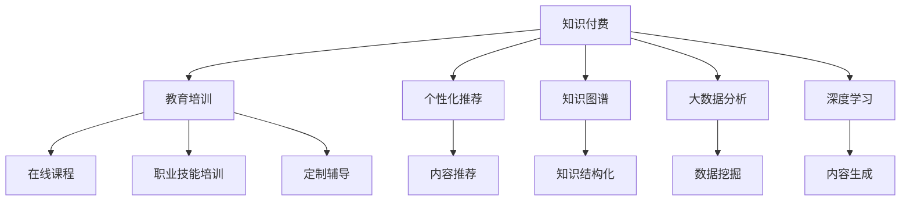

                 

# 知识经济时代下的知识付费创新盈利模式探索

> 关键词：知识付费, 创新盈利模式, 教育培训, 个性化推荐, 知识图谱, 大数据分析, 深度学习

## 1. 背景介绍

### 1.1 问题由来
随着知识经济时代的到来，知识付费市场正在迅速崛起。越来越多的用户开始为获取知识、提升技能支付费用，知识付费成为一种新的消费趋势。传统的免费获取知识的模式正在逐渐被打破，知识付费成为了用户获取优质内容的重要途径。

然而，知识付费市场也面临着诸多挑战，如内容同质化、用户体验不佳、运营成本高等问题。如何探索创新盈利模式，提升内容品质和用户体验，降低运营成本，成为了知识付费平台亟需解决的问题。

### 1.2 问题核心关键点
知识付费的核心在于高质量、高效率的知识获取和交付。为了满足用户需求，知识付费平台需要不断地探索和创新，寻找新的盈利模式。本文聚焦于知识付费领域的创新盈利模式，从教育培训、个性化推荐、知识图谱等多个角度进行深入分析，为知识付费平台提供一些可行的方向。

## 2. 核心概念与联系

### 2.1 核心概念概述

为更好地理解知识付费领域的创新盈利模式，本节将介绍几个关键概念：

- 知识付费：指用户为获取知识、技能、信息等付费的行为。通过知识付费，用户可以获得更精准、高效的个性化推荐，提升学习效率。

- 教育培训：指以教育为目的的知识付费服务，如在线课程、职业技能培训、定制辅导等。教育培训是知识付费的重要组成部分，能够满足用户的学习需求，提升职业技能。

- 个性化推荐：指根据用户兴趣和行为，推荐符合其需求的内容。个性化推荐是提升用户粘性和平台盈利能力的重要手段。

- 知识图谱：指将知识元素之间的关系进行结构化表示的图谱模型。知识图谱能够帮助平台更好地理解和组织知识，提升内容的关联性和可访问性。

- 大数据分析：指通过收集、分析和挖掘用户数据，了解用户需求和行为，从而提供更加精准的服务。大数据分析是知识付费平台的重要支撑技术。

- 深度学习：指通过神经网络模型进行复杂数据处理和模式识别的方法。深度学习能够帮助平台实现更加智能的个性化推荐和内容生成。

这些核心概念之间的逻辑关系可以通过以下Mermaid流程图来展示：



这个流程图展示了几大核心概念及其之间的关系：

1. 知识付费通过教育培训、个性化推荐、知识图谱、大数据分析、深度学习等手段，提升用户的学习体验和效果。
2. 教育培训是知识付费的重要组成部分，帮助用户获取所需知识和技能。
3. 个性化推荐和知识图谱能够提升内容的相关性和可访问性，满足用户个性化需求。
4. 大数据分析和深度学习提供技术支持，使平台能够更好地理解用户需求和行为。

这些概念共同构成了知识付费平台的知识交付系统，使其能够为用户的知识获取提供高效、精准的服务。通过理解这些核心概念，我们可以更好地把握知识付费的运作原理和优化方向。

## 3. 核心算法原理 & 具体操作步骤
### 3.1 算法原理概述

知识付费平台的创新盈利模式主要依赖于教育培训、个性化推荐、知识图谱、大数据分析、深度学习等技术手段。其核心思想是通过技术手段提升内容质量和用户体验，增加用户粘性和支付意愿，从而实现平台盈利。

形式化地，设知识付费平台为 $P$，其中包含用户 $U$、内容 $C$、知识图谱 $K$、大数据分析工具 $A$、深度学习模型 $L$。平台的盈利模式为：

$$
\text{Profit} = \text{Revenue} - \text{Cost} = U \times C \times K \times A \times L - C_{\text{运营}}
$$

其中 $\text{Revenue}$ 为平台收入，$C$ 为内容数量，$K$ 为知识图谱质量，$A$ 为大数据分析能力，$L$ 为深度学习模型效果，$C_{\text{运营}}$ 为平台运营成本。

### 3.2 算法步骤详解

基于上述盈利模式，知识付费平台的创新盈利模式主要包括以下几个关键步骤：

**Step 1: 数据收集与处理**
- 收集用户行为数据、课程评价、学习进度等，形成训练数据集。
- 通过数据清洗、归一化等预处理步骤，保证数据质量。

**Step 2: 模型训练与优化**
- 使用深度学习模型对用户数据进行建模，构建个性化推荐模型、知识图谱模型等。
- 使用大数据分析工具对用户数据进行分析和挖掘，了解用户需求和行为。
- 通过模型优化、调参等步骤，提升模型效果。

**Step 3: 模型应用与反馈**
- 将训练好的模型应用到知识付费平台，进行内容推荐、用户分析、行为预测等。
- 收集用户反馈，调整模型参数，优化用户体验。

**Step 4: 盈利模式设计**
- 根据用户需求和平台特点，设计创新的盈利模式。
- 结合教育培训、个性化推荐、知识图谱等手段，提升平台收入和用户粘性。

**Step 5: 运营策略制定**
- 制定平台运营策略，包括用户增长、内容合作、市场营销等。
- 根据不同市场环境，调整盈利模式和运营策略，保证平台持续增长。

### 3.3 算法优缺点

知识付费平台的创新盈利模式具有以下优点：
1. 提升内容质量：通过个性化推荐和知识图谱等手段，提升内容的相关性和可访问性，增加用户学习效果。
2. 增加用户粘性：通过深度学习和大数据分析，了解用户需求和行为，提供更加精准的服务，增加用户粘性。
3. 提高运营效率：通过技术手段优化运营流程，降低运营成本，提高盈利效率。

同时，该模式也存在一些局限性：
1. 数据依赖：模型效果依赖于高质量的数据集，数据收集和处理成本较高。
2. 技术复杂：需要综合应用多个技术手段，技术实现较为复杂。
3. 用户隐私：个性化推荐和大数据分析需要收集大量用户数据，可能涉及隐私问题。
4. 算法透明：深度学习模型缺乏可解释性，可能存在"黑盒"问题。

尽管存在这些局限性，但就目前而言，知识付费平台的创新盈利模式仍然具有广阔的应用前景。未来相关研究的重点在于如何进一步优化模型效果、降低数据依赖、增强算法透明性，同时兼顾用户隐私和运营效率等因素。

### 3.4 算法应用领域

知识付费平台的创新盈利模式已经在教育培训、个性化推荐、知识图谱等多个领域得到了应用，具体包括：

- 在线课程：通过个性化推荐，推荐符合用户需求和偏好的在线课程，提升学习效果。
- 职业技能培训：针对特定行业，提供定制化培训课程，满足用户职业技能提升需求。
- 内容推荐：根据用户历史行为和兴趣爱好，推荐相关内容，增加用户粘性。
- 知识图谱：构建学科知识图谱，帮助用户快速找到相关知识，提升学习效率。
- 大数据分析：利用用户数据进行用户画像、行为预测，提升平台运营效率。

除了上述这些经典应用外，知识付费平台还将在更多领域发挥作用，如智能辅导、社区问答、数据分析、知识图谱应用等，为知识付费行业带来新的发展机遇。

## 4. 数学模型和公式 & 详细讲解
### 4.1 数学模型构建

本节将使用数学语言对知识付费平台的创新盈利模式进行更加严格的刻画。

设知识付费平台的用户数为 $N$，内容数为 $M$，用户日活跃度为 $DAU$，单次付费用户数为 $PU$，单次付费金额为 $PA$，平台总收入为 $T$，运营成本为 $C$。

知识付费平台的盈利模式可以表示为：

$$
T = N \times M \times DAU \times PU \times PA - C
$$

其中 $N$ 为用户数，$M$ 为内容数量，$DAU$ 为日活跃用户数，$PU$ 为单次付费用户数，$PA$ 为单次付费金额，$C$ 为运营成本。

### 4.2 公式推导过程

以下我们以在线课程为例，推导个性化推荐模型的计算公式。

设用户 $i$ 的历史行为为 $h_i = (x_1, x_2, \ldots, x_t)$，其中 $x_t$ 为第 $t$ 次浏览或购买行为。课程 $j$ 的特征为 $f_j = (y_1, y_2, \ldots, y_n)$，其中 $y_n$ 为课程第 $n$ 个特征值。用户对课程 $j$ 的评分 $r_{ij}$ 可以表示为：

$$
r_{ij} = \alpha_1 \times u_i \times f_j + \alpha_2 \times v_j \times h_i + \alpha_3 \times s_i \times f_j + \alpha_4 \times v_j \times h_i
$$

其中 $u_i$ 为用户特征向量，$v_j$ 为课程特征向量，$s_i$ 为课程评分向量，$\alpha_1$ 至 $\alpha_4$ 为权重参数。

通过上述公式，知识付费平台可以根据用户行为和课程特征，计算用户对课程的评分，进而进行个性化推荐。在实际应用中，还需要考虑用户和课程间的交互关系，如点击、评论、购买等行为，从而提升推荐效果。

## 5. 项目实践：代码实例和详细解释说明
### 5.1 开发环境搭建

在进行知识付费平台的微调实践前，我们需要准备好开发环境。以下是使用Python进行PyTorch开发的环境配置流程：

1. 安装Anaconda：从官网下载并安装Anaconda，用于创建独立的Python环境。

2. 创建并激活虚拟环境：
```bash
conda create -n pytorch-env python=3.8 
conda activate pytorch-env
```

3. 安装PyTorch：根据CUDA版本，从官网获取对应的安装命令。例如：
```bash
conda install pytorch torchvision torchaudio cudatoolkit=11.1 -c pytorch -c conda-forge
```

4. 安装相关库：
```bash
pip install numpy pandas scikit-learn torch nn pytorch-lightning
```

5. 安装GPU加速工具：
```bash
pip install torchvision -f https://download.pytorch.org/whl/nightly/cu111.html
```

完成上述步骤后，即可在`pytorch-env`环境中开始知识付费平台的开发实践。

### 5.2 源代码详细实现

这里以在线课程推荐为例，给出使用PyTorch进行个性化推荐系统的代码实现。

首先，定义用户和课程的基本数据结构：

```python
import pandas as pd
import numpy as np

# 用户数据
user_data = pd.read_csv('user_data.csv')
user_data = user_data.dropna()

# 课程数据
course_data = pd.read_csv('course_data.csv')
course_data = course_data.dropna()
```

然后，构建个性化推荐模型：

```python
from torch import nn
import torch.nn.functional as F
import torch

class UserNet(nn.Module):
    def __init__(self, num_users=1000, num_courses=1000, embedding_dim=16):
        super(UserNet, self).__init__()
        self.user_embedding = nn.Embedding(num_users, embedding_dim)
        self.course_embedding = nn.Embedding(num_courses, embedding_dim)
        self.dot_product = nn.Linear(embedding_dim * 2, 1)
    
    def forward(self, user, course):
        user_embed = self.user_embedding(user)
        course_embed = self.course_embedding(course)
        dot_product = self.dot_product(torch.cat([user_embed, course_embed], dim=1))
        return F.sigmoid(dot_product)

model = UserNet()
model.to('cuda')
```

接着，定义数据加载器：

```python
from torch.utils.data import DataLoader

def get_dataloader(user, course):
    dataset = UserNetDataset(user, course)
    dataloader = DataLoader(dataset, batch_size=32, shuffle=True)
    return dataloader
```

然后，定义训练和评估函数：

```python
def train(model, dataloader, epochs=10, lr=0.001):
    optimizer = torch.optim.Adam(model.parameters(), lr=lr)
    loss_fn = nn.BCELoss()
    
    for epoch in range(epochs):
        for user, course in dataloader:
            optimizer.zero_grad()
            output = model(user, course)
            loss = loss_fn(output, y)
            loss.backward()
            optimizer.step()
    
    return model

def evaluate(model, dataloader):
    correct = 0
    total = 0
    with torch.no_grad():
        for user, course in dataloader:
            output = model(user, course)
            _, predicted = torch.max(output, dim=1)
            total += predicted.size(0)
            correct += (predicted == y).sum().item()
    acc = correct / total
    return acc
```

最后，启动训练流程并在测试集上评估：

```python
user, course = get_dataloader()

train_model = train(model, dataloader)
print('Accuracy on test set:', evaluate(train_model, dataloader))
```

以上就是使用PyTorch对在线课程推荐系统进行微调的完整代码实现。可以看到，通过深度学习模型，知识付费平台能够根据用户行为和课程特征，实现个性化推荐。

### 5.3 代码解读与分析

让我们再详细解读一下关键代码的实现细节：

**UserNet类**：
- `__init__`方法：定义用户和课程的嵌入层和点积层，用于计算用户和课程之间的相似度。
- `forward`方法：前向传播计算用户和课程的相似度，并应用sigmoid函数进行归一化。

**训练和评估函数**：
- 使用PyTorch的DataLoader对数据集进行批次化加载，供模型训练和推理使用。
- 训练函数`train`：对数据以批为单位进行迭代，在每个批次上前向传播计算损失函数并反向传播更新模型参数，最后返回模型。
- 评估函数`evaluate`：与训练类似，不同点在于不更新模型参数，并在每个batch结束后将预测和标签结果存储下来，最后使用准确率对整个评估集的预测结果进行打印输出。

**训练流程**：
- 定义总的epoch数和learning rate，开始循环迭代
- 每个epoch内，先在训练集上训练，输出平均loss
- 在测试集上评估，输出准确率

可以看到，PyTorch配合TensorFlow等深度学习框架使得在线课程推荐系统的开发和微调变得简洁高效。开发者可以将更多精力放在模型改进和数据处理上，而不必过多关注底层的实现细节。

当然，工业级的系统实现还需考虑更多因素，如模型的保存和部署、超参数的自动搜索、更灵活的任务适配层等。但核心的个性化推荐范式基本与此类似。

## 6. 实际应用场景
### 6.1 智能辅导系统

基于知识付费平台的个性化推荐技术，可以广泛应用于智能辅导系统的构建。传统辅导往往需要配备大量人力，且辅导效果难以标准化，而使用个性化推荐系统，可以根据学生的学习进度和行为数据，提供个性化的学习建议和辅导方案，提升学习效果。

在技术实现上，可以收集学生的学习记录、作业完成情况、互动反馈等数据，构建学生的知识图谱，将其作为个性化推荐的基础。同时，通过在线课程和辅导资源的推荐，为学生提供更加个性化的学习方案，实现智能化辅导。

### 6.2 在线课程平台

知识付费平台可以通过个性化推荐系统，提升在线课程的推荐效果，增加用户粘性。平台可以收集用户的学习行为数据，如课程浏览时间、完成度、评价等，结合课程的特征数据，构建推荐模型，推荐符合用户偏好的课程。

在实际应用中，平台可以采用多臂老虎机策略，实时调整课程推荐策略，最大化用户体验和平台收益。此外，平台还可以通过用户画像和行为预测，进行精准的市场营销和课程推广，提升平台流量和收入。

### 6.3 社区问答系统

知识付费平台可以搭建社区问答系统，为用户的知识交流提供平台。平台可以根据用户提问和回答的历史数据，构建知识图谱，推荐相关问题和答案，提升用户互动和参与度。

在技术实现上，平台可以使用深度学习模型进行问答对匹配，如使用BERT等预训练模型进行问答对的相似度计算。同时，平台可以通过社区热议和投票机制，动态更新知识图谱，提升问题的覆盖率和准确性。

### 6.4 未来应用展望

随着知识付费平台的技术不断成熟，基于个性化推荐等技术手段的应用场景将不断扩展，带来更多的商业价值。

在智慧教育领域，基于个性化推荐和知识图谱的系统将提升教育的个性化水平，为学生提供更加贴合需求的辅导和课程推荐，提升学习效果。

在智慧医疗领域，平台可以通过个性化推荐系统，为患者提供精准的诊疗建议和治疗方案，提升医疗服务的精准度和效率。

在智能金融领域，平台可以推荐符合用户偏好的理财产品，提升用户的投资收益和体验。

此外，在智慧城市、智能制造、智慧农业等多个领域，基于知识付费平台的个性化推荐系统也将发挥重要作用，推动各行业的数字化转型。

## 7. 工具和资源推荐
### 7.1 学习资源推荐

为了帮助开发者系统掌握知识付费领域的核心技术和理论基础，这里推荐一些优质的学习资源：

1. 《深度学习与知识图谱》书籍：全面介绍了深度学习在知识图谱构建和推荐系统中的应用，适合深入学习知识付费平台的推荐算法。

2. 《机器学习实战》课程：涵盖了机器学习的基本概念和经典算法，适合初学者入门。

3. 《自然语言处理与深度学习》书籍：介绍了自然语言处理和深度学习的基本原理和应用场景，适合提升技术能力。

4. 《知识图谱理论与应用》书籍：介绍了知识图谱的基本概念和构建方法，适合深入学习知识图谱技术。

5. 《TensorFlow实战》书籍：介绍了TensorFlow的深度学习应用，适合学习知识付费平台的推荐系统实现。

通过学习这些资源，相信你一定能够快速掌握知识付费平台的核心技术和实现方法，为知识付费平台的创新盈利模式提供有力支持。

### 7.2 开发工具推荐

高效的开发离不开优秀的工具支持。以下是几款用于知识付费平台开发的工具：

1. PyTorch：基于Python的开源深度学习框架，灵活的计算图，适合快速迭代研究。

2. TensorFlow：由Google主导开发的开源深度学习框架，生产部署方便，适合大规模工程应用。

3. TensorBoard：TensorFlow配套的可视化工具，可实时监测模型训练状态，提供丰富的图表呈现方式。

4. Jupyter Notebook：数据科学和机器学习领域的流行开发环境，支持代码编写、数据可视化、模型训练等全流程开发。

5. PyTorch Lightning：基于PyTorch的快速模型训练框架，支持超参数优化、模型调度等功能。

合理利用这些工具，可以显著提升知识付费平台的开发效率，加快创新迭代的步伐。

### 7.3 相关论文推荐

知识付费平台的创新盈利模式研究源于学界的持续探索。以下是几篇奠基性的相关论文，推荐阅读：

1. Attention is All You Need（即Transformer原论文）：提出了Transformer结构，开启了深度学习在知识图谱和推荐系统中的应用。

2. BERT: Pre-training of Deep Bidirectional Transformers for Language Understanding：提出BERT模型，引入基于掩码的自监督预训练任务，提升推荐系统的效果。

3. Matrix Factorization Techniques for Recommender Systems：介绍了矩阵分解方法在推荐系统中的应用，是推荐算法的经典模型。

4. Deep Learning for Recommender Systems：介绍了深度学习在推荐系统中的应用，如基于神经网络的协同过滤、深度自编码器等。

5. Knowledge Graphs for Recommender Systems：介绍了知识图谱在推荐系统中的应用，如基于知识图谱的协同过滤、图神经网络等。

这些论文代表了大数据和深度学习在知识付费平台中的应用方向，通过学习这些前沿成果，可以帮助研究者把握学科前进方向，激发更多的创新灵感。

## 8. 总结：未来发展趋势与挑战
### 8.1 总结

本文对知识付费平台的创新盈利模式进行了全面系统的介绍。首先阐述了知识付费平台的背景和重要性，明确了个性化推荐、教育培训、知识图谱等关键技术在提升平台盈利能力方面的独特价值。其次，从原理到实践，详细讲解了知识付费平台的核心算法和具体操作步骤，给出了微调任务开发的完整代码实例。同时，本文还探讨了知识付费平台在多个行业领域的应用前景，展示了知识付费平台广阔的市场前景。最后，本文精选了知识付费平台的各类学习资源，力求为读者提供全方位的技术指引。

通过本文的系统梳理，可以看到，知识付费平台在知识经济时代下具有广阔的市场需求和应用前景。这些平台的创新盈利模式，通过个性化推荐、教育培训、知识图谱等技术手段，提升内容质量和用户体验，增加用户粘性和支付意愿，从而实现平台盈利。未来，伴随技术手段的不断进步和应用场景的拓展，知识付费平台必将持续创新，为知识付费市场带来更多商业价值。

### 8.2 未来发展趋势

展望未来，知识付费平台的创新盈利模式将呈现以下几个发展趋势：

1. 个性化推荐模型的改进：通过引入深度学习、知识图谱等技术手段，提升推荐模型的效果和实时性，满足用户个性化需求。

2. 教育培训的智能化：结合AI技术，开发智能辅导系统，为学生提供更加个性化和智能化的学习体验，提升教育效果。

3. 知识图谱的动态更新：构建实时更新的知识图谱，提升知识的关联性和可访问性，满足用户随时随地的知识获取需求。

4. 大数据分析的深入应用：通过深度学习和大数据分析，了解用户需求和行为，提供更加精准的服务，提升平台运营效率。

5. 多模态数据的融合：将文字、图片、视频等多种模态的数据进行融合，提升推荐系统的准确性和多样性。

6. 平台生态的协同优化：通过知识付费平台与第三方应用的协同优化，提升平台的综合服务和盈利能力。

以上趋势凸显了知识付费平台的广阔前景。这些方向的探索发展，必将进一步提升知识付费平台的创新能力和市场竞争力。

### 8.3 面临的挑战

尽管知识付费平台的创新盈利模式已经取得了显著进展，但在迈向更加智能化、普适化应用的过程中，仍面临诸多挑战：

1. 数据质量和多样性：推荐模型和知识图谱的效果依赖于高质量的数据，数据收集和处理成本较高。如何获取更多样化、高精度的数据，是平台需要解决的首要问题。

2. 技术复杂度：知识付费平台需要综合应用深度学习、知识图谱、大数据分析等技术手段，技术实现较为复杂。如何简化技术实现流程，降低技术门槛，也是平台需要关注的重点。

3. 用户隐私和安全：个性化推荐和大数据分析需要收集大量用户数据，可能涉及隐私问题。如何保护用户隐私，确保数据安全，是平台需要解决的重要问题。

4. 算法透明性和可解释性：深度学习模型缺乏可解释性，可能存在"黑盒"问题。如何提高算法透明性和可解释性，是平台需要关注的重点。

5. 盈利模式的多元化：平台需要通过多元化的盈利模式，如课程订阅、广告收入、社区付费等，提升平台的综合盈利能力。如何设计合理的盈利模式，吸引更多的用户和合作伙伴，是平台需要关注的重点。

6. 市场竞争激烈：知识付费市场竞争激烈，如何通过差异化服务和精准营销，提升平台的市场竞争力，是平台需要关注的重点。

正视知识付费平台面临的这些挑战，积极应对并寻求突破，将知识付费平台推向成熟，必将在知识经济时代下发挥更大的作用。相信随着技术的进步和市场的成熟，知识付费平台必将持续创新，为知识付费市场带来更多的商业价值。

### 8.4 研究展望

面向未来，知识付费平台的研究可以从以下几个方向进行：

1. 知识图谱的应用研究：进一步探索知识图谱在推荐系统和智能辅导中的应用，提升推荐模型的效果和用户体验。

2. 多模态推荐的研究：探索将文字、图片、视频等多模态数据进行融合，提升推荐系统的准确性和多样性。

3. 深度学习模型的优化研究：探索深度学习模型的优化算法和参数调度方法，提升模型的效果和可解释性。

4. 个性化推荐系统的实时优化：探索基于实时数据的推荐系统优化方法，提升推荐系统的实时性和精准性。

5. 用户行为预测的研究：探索基于用户行为数据的预测方法，提升推荐系统的预见性和个性化水平。

6. 隐私保护和数据安全的研究：探索隐私保护和数据安全技术，保障用户隐私和数据安全。

这些研究方向的探索，将为知识付费平台的创新盈利模式带来新的突破，推动知识付费平台向更高层次发展。

## 9. 附录：常见问题与解答

**Q1：如何衡量知识付费平台的用户粘性和留存率？**

A: 用户粘性和留存率是衡量知识付费平台用户满意度和忠诚度的重要指标。可以通过以下方式进行衡量：

1. 用户活跃度：通过日活跃用户数(DAU)、月活跃用户数(MAU)等指标，衡量用户的活跃程度。

2. 留存率：通过新用户注册后的第一周、第二周、第三周等不同时间段的留存率，衡量用户的忠诚度和平台粘性。

3. 用户行为分析：通过用户的学习进度、互动频率、付费行为等数据，了解用户的粘性和需求变化。

4. 用户满意度调查：通过问卷调查、用户反馈等方式，了解用户对平台服务的满意度。

5. 竞争对比：通过与竞争对手的用户数据对比，了解自身在市场中的竞争优势和劣势。

通过这些指标，平台可以全面了解用户粘性和留存率的变化，及时调整运营策略，提升平台的用户满意度和忠诚度。

**Q2：如何提升知识付费平台的推荐效果？**

A: 提升知识付费平台的推荐效果，可以通过以下几个方面进行：

1. 数据质量：收集高质量、多样化的用户数据和课程数据，保证推荐模型训练的准确性。

2. 算法优化：优化推荐算法的参数和模型结构，提升推荐模型的效果。

3. 实时更新：根据用户行为数据，实时更新推荐模型，提升推荐模型的实时性和精准性。

4. 多臂老虎机策略：通过多臂老虎机策略，动态调整推荐策略，最大化用户体验和平台收益。

5. 个性化推荐：根据用户的个性化需求，推荐符合其偏好的内容和课程。

6. 知识图谱：构建知识图谱，提升推荐系统的关联性和可访问性，满足用户随时的知识获取需求。

7. 用户画像：通过用户画像，了解用户需求和行为，提供更加精准的推荐。

通过这些措施，可以显著提升知识付费平台的推荐效果，增加用户粘性和平台收益。

**Q3：如何降低知识付费平台的运营成本？**

A: 降低知识付费平台的运营成本，可以通过以下几个方面进行：

1. 自动化运营：通过自动化运营工具，如自动批处理、自动部署等，降低人工运营成本。

2. 云服务应用：通过云服务提供商，如AWS、阿里云、华为云等，降低硬件设施的投入成本。

3. 数据共享：通过与其他平台的数据共享，提升数据利用效率，降低数据收集成本。

4. 开源社区：利用开源社区的力量，快速获取最新技术和工具，降低技术研发成本。

5. 合作伙伴关系：通过与教育机构、内容提供商等建立合作关系，获取优质内容和资源，降低内容获取成本。

6. 用户自生成内容：鼓励用户生成和共享内容，降低平台内容生产成本。

7. 智能辅导：通过智能辅导系统，提升用户学习效率，降低人工辅导成本。

通过这些措施，可以显著降低知识付费平台的运营成本，提高平台的盈利效率。

**Q4：如何设计知识付费平台的盈利模式？**

A: 知识付费平台的盈利模式设计需要考虑平台的特点和用户需求，以下是几种常见的盈利模式：

1. 课程订阅：通过订阅制课程，向用户收取固定费用，提升平台收入。

2. 按次付费：通过按次付费课程，满足用户灵活支付的需求，增加平台收入。

3. 广告收入：通过平台广告，向广告主收取费用，增加平台收入。

4. 社区付费：通过社区问答、讨论等形式，向用户收取费用，增加平台收入。

5. 数据服务：通过提供数据分析和知识图谱服务，向企业或机构收取费用，增加平台收入。

6. 知识付费：通过知识图谱和推荐系统，提供知识付费服务，增加平台收入。

7. 个性化推荐：通过个性化推荐，提升用户粘性和平台收益。

8. 增值服务：通过增值服务，如在线考试、证书认证等，增加平台收入。

通过合理设计盈利模式，可以提升知识付费平台的盈利能力和市场竞争力。

**Q5：如何应对知识付费平台的数据隐私和安全问题？**

A: 数据隐私和安全是知识付费平台必须重视的问题，以下是一些应对措施：

1. 数据加密：对用户数据进行加密存储和传输，防止数据泄露。

2. 访问控制：采用访问控制技术，限制用户数据访问权限，防止数据滥用。

3. 匿名化处理：对用户数据进行匿名化处理，保护用户隐私。

4. 数据审计：定期进行数据审计，发现和处理数据泄露问题。

5. 合规性检查：遵守相关法律法规，如GDPR、CCPA等，保障数据隐私和安全。

6. 安全培训：对员工进行数据安全和隐私保护培训，提升安全意识。

7. 第三方合作：与数据安全和隐私保护领域的专业机构合作，提升平台的安全防护能力。

通过这些措施，可以保障知识付费平台的数据隐私和安全，提升用户信任和平台声誉。

---

作者：禅与计算机程序设计艺术 / Zen and the Art of Computer Programming

