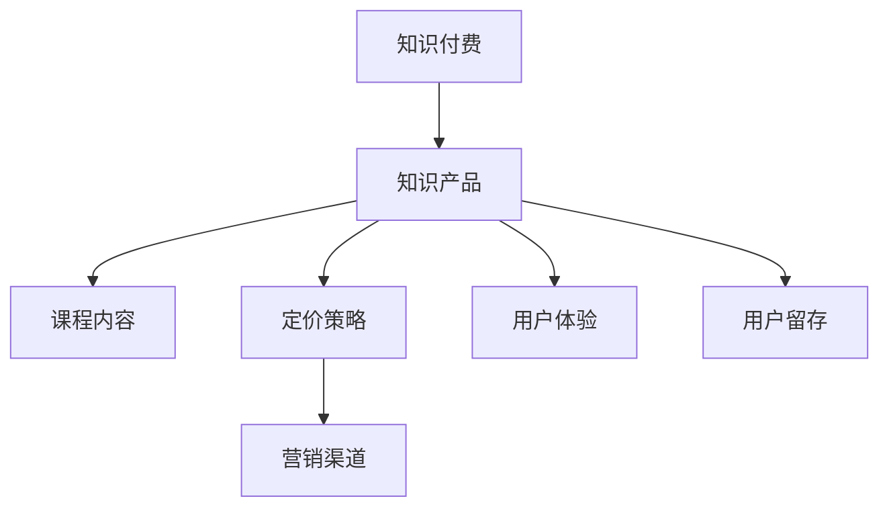

                 

# 知识经济时代下的知识付费创新课程销售策略

## 1. 背景介绍

### 1.1 问题由来

在知识经济时代，信息爆炸与知识碎片化现象日益凸显。人们的时间变得更为宝贵，对高质量、高效能的知识获取方式提出了更高要求。知识付费由此应运而生，作为一种新兴的商业模式，不仅改变了传统的知识传播方式，也为知识创作者提供了新的经济渠道。

随着互联网和移动互联网的发展，知识付费已经从线上图书、课程等单一形式，拓展到音频、视频、直播、咨询等多种形式。但伴随这一趋势的，是知识付费产品同质化严重、用户选择困难等问题。如何从海量知识产品中突围，吸引和留存用户，成为知识付费企业面临的重大挑战。

### 1.2 问题核心关键点

知识付费行业本质上是教育市场的一部分，遵循教育市场的基本规律。要想在激烈的市场竞争中脱颖而出，企业需要不断创新和优化课程内容、销售策略和用户体验，以吸引更多目标用户并提升用户留存率。

为此，本文将深入探讨知识付费产品的核心要素，包括课程内容的设计与创新、定价策略的制定、营销渠道的选择与优化、用户体验的提升等方面。通过系统分析这些核心要素，为企业提供可行的销售策略，助力其在知识经济时代下实现快速增长和转型升级。

### 1.3 问题研究意义

在知识经济时代，知识付费不仅是教育的创新形式，更是经济发展的新引擎。通过优化知识付费产品的销售策略，可以有效提高知识创造和传播的效率，推动社会知识的普惠化，促进经济社会的全面进步。同时，这也为企业开辟了新的增长路径，帮助其在激烈的市场竞争中站稳脚跟。

本文旨在通过深入分析知识付费行业现状及问题，为知识付费企业提供战略性的销售策略建议，以期在推动知识经济发展的过程中，发挥知识付费的积极作用，为全社会的知识普及和创新创业提供支持。

## 2. 核心概念与联系

### 2.1 核心概念概述

为更好地理解知识付费产品的销售策略，本节将介绍几个密切相关的核心概念：

- **知识付费**：指用户为获取专业知识、技能、信息等，通过支付费用获取课程、电子书、在线咨询等服务的行为。
- **知识产品**：即通过付费形式提供给用户的知识内容，包括但不限于课程、图书、文章、视频等。
- **课程内容**：指课程所包含的知识体系、教学方法、案例分析等元素，是知识付费产品的核心竞争力。
- **定价策略**：指根据产品价值、市场需求、用户支付能力等因素，制定合理的价格，以吸引用户购买。
- **营销渠道**：包括线上线下的各类传播渠道，如社交媒体、搜索引擎、教育平台等，用以推广知识付费产品。
- **用户体验**：指用户使用知识付费产品时的互动感受、界面友好度、学习效果等，直接影响用户满意度和留存率。
- **用户留存**：指用户在一定时间内继续使用知识付费产品的频率，留存率高的产品通常具有较高的用户粘性。

这些概念之间的逻辑关系可以通过以下Mermaid流程图来展示：



这个流程图展示的知识付费产品的核心概念及其之间的关系：

1. 知识付费是以知识产品为核心的商业活动。
2. 课程内容是知识产品的核心，直接影响产品价值。
3. 定价策略和营销渠道共同作用，驱动知识产品的销售。
4. 用户体验与用户留存率正相关，是衡量知识付费产品成功的重要指标。

## 3. 核心算法原理 & 具体操作步骤
### 3.1 算法原理概述

知识付费产品销售策略的核心是构建有效的营销和用户体验循环。其基本原理包括：

- **用户需求匹配**：根据用户的学习需求和支付能力，推荐匹配度高的课程。
- **价格弹性调整**：根据市场供需变化和用户反馈，动态调整课程定价，保持产品竞争力和吸引力。
- **多渠道融合**：结合线上线下多种营销渠道，最大化覆盖目标用户群体。
- **互动优化体验**：通过用户反馈和数据分析，不断优化课程内容和用户体验，提升用户满意度和留存率。

这一策略的核心在于通过精准的用户画像、动态的定价和渠道整合，以及持续的用户互动，形成一个良性循环，推动知识付费产品的销售和品牌建设。

### 3.2 算法步骤详解

#### 3.2.1 用户画像构建

1. **数据收集**：通过问卷调查、行为分析、社交媒体数据等手段，收集用户的年龄、性别、教育背景、职业、兴趣爱好等信息。
2. **用户分类**：将用户根据不同的需求、学习能力和支付意愿进行分类，如学生、职场人士、自由职业者等。
3. **用户画像绘制**：根据收集到的数据，绘制详细的用户画像，标注各用户群体的特点和偏好。

#### 3.2.2 课程内容设计

1. **市场调研**：调研用户需求，分析热门课程主题和形式，确定课程内容的大方向。
2. **专家合作**：邀请行业专家参与课程设计，确保课程内容的权威性和实用性。
3. **案例迭代优化**：根据用户反馈和市场反馈，持续迭代课程内容和形式，提升用户体验。

#### 3.2.3 定价策略制定

1. **成本估算**：根据课程制作、营销、运营等成本，制定课程的基本价格区间。
2. **市场定价**：参考同类产品的定价，结合用户支付能力，确定课程的最终定价。
3. **动态调整**：根据用户购买行为、反馈意见等数据，动态调整课程价格，优化用户体验。

#### 3.2.4 营销渠道选择与优化

1. **多渠道布局**：结合线上社交媒体、教育平台、线下实体店等渠道，实现全面覆盖。
2. **精准投放**：根据用户画像，针对不同用户群体进行精准投放，提高广告效果。
3. **效果评估**：定期评估各渠道的营销效果，优化投放策略，提升ROI。

#### 3.2.5 用户体验优化

1. **界面设计**：优化课程界面设计，确保简洁易用，提升用户体验。
2. **互动增强**：增加课程互动功能，如讨论区、问答等，提升用户参与度。
3. **反馈收集**：定期收集用户反馈，及时优化课程内容和体验，提升用户满意度。

### 3.3 算法优缺点

知识付费产品的销售策略具有以下优点：

1. **精准营销**：通过用户画像和市场调研，能够精准定位目标用户，提升广告投放效果。
2. **动态优化**：根据用户反馈和市场变化，动态调整课程内容和定价，保持产品竞争力。
3. **多渠道融合**：结合线上线下多种渠道，实现全覆盖，提高品牌曝光度。
4. **用户体验提升**：通过持续的优化和迭代，提升课程内容质量和用户体验，提高用户留存率。

同时，该策略也存在一定的局限性：

1. **数据隐私问题**：用户画像的构建和分析涉及大量个人数据，需要严格遵守数据隐私保护法规。
2. **成本高昂**：精准定位和动态定价需要大量的数据和分析工作，成本较高。
3. **市场变化快**：市场趋势和用户需求变化快，策略调整需要快速响应，难度较大。
4. **用户体验差异**：不同用户群体的需求差异大，难以实现全面覆盖。

尽管存在这些局限性，但就目前而言，基于用户画像和数据驱动的销售策略仍是知识付费行业的主流范式。未来相关研究的重点在于如何进一步降低策略制定的成本，提高精准度和响应速度，同时兼顾用户隐私和多样性。

### 3.4 算法应用领域

知识付费产品的销售策略已经在诸多领域得到了广泛应用，例如：

- **在线教育**：通过知识付费推动在线教育市场的发展，如Coursera、Udemy等平台上的课程销售。
- **职业培训**：提供行业技能培训课程，如编程、金融、管理等领域的专业技能培训。
- **健康生活**：提供健康、健身、饮食等课程，提升用户生活质量。
- **心理辅导**：提供在线心理咨询和情感辅导课程，帮助用户解决心理问题。
- **文化艺术**：提供艺术、音乐、文学等课程，丰富用户文化生活。

除了上述这些经典领域外，知识付费技术也被创新性地应用到更多场景中，如可穿戴设备应用、智能家居、家庭教育等，为知识传播和应用带来了新的突破。随着知识付费市场的不断成熟和细分，相信知识付费产品的销售策略将在更广泛的应用领域得到实践和验证。

## 4. 数学模型和公式 & 详细讲解 & 举例说明

### 4.1 数学模型构建

知识付费产品的销售策略可以通过数学模型进行量化和优化。本节将使用数学语言对销售策略进行更加严格的刻画。

假设用户数量为 $U$，课程数量为 $C$，课程价格为 $P$，用户付费数量为 $P_r$，广告投放预算为 $B$，渠道广告效率为 $\varepsilon$，用户转化率为 $\alpha$。则销售策略的数学模型可以表示为：

$$
\max_{P, \alpha} \sum_{i=1}^C P_ir_i - \sum_{j=1}^U P_j\alpha_j
$$

其中 $r_i$ 为课程 $i$ 的付费用户数量，$\alpha_j$ 为用户 $j$ 的转化率。

模型的目标是在一定的广告预算和用户群体中，最大化课程的总收入，同时最小化广告支出。

### 4.2 公式推导过程

设课程 $i$ 的总收入为 $I_i = P_ir_i$，用户 $j$ 的支出为 $E_j = P_j\alpha_j$。则总收入 $I$ 可以表示为：

$$
I = \sum_{i=1}^C I_i
$$

设总广告支出为 $E$，则：

$$
E = \sum_{j=1}^U E_j
$$

因此，销售策略的优化目标可以表示为：

$$
\max_{P, \alpha} \sum_{i=1}^C I_i - \sum_{j=1}^U E_j
$$

由于 $I_i$ 和 $E_j$ 与课程和用户相关，因此需要根据市场数据和用户画像进行优化。

### 4.3 案例分析与讲解

假设某在线教育平台有100门课程，每门课程定价为100元，用户数量为10000人，用户平均转化率为20%。平台每月预算广告支出为100000元，广告效率为5%。则平台的销售策略模型可以表示为：

$$
\max_{P} 10000 \times 100 \times 20\% - 10000 \times 100 \times 5\% = 180000 - 5000 = 175500
$$

在优化过程中，可以通过改变课程定价和用户转化率，最大化总收入。例如，将课程定价提升至200元，用户转化率提升至30%，则总收入将增加至：

$$
10000 \times 200 \times 30\% = 60000
$$

而广告支出为：

$$
10000 \times 200 \times 5\% = 100000
$$

因此，总收入将增加至：

$$
60000 + 175500 - 100000 = 225500
$$

实际应用中，还需要结合具体数据和市场情况进行详细分析，优化策略参数。

## 5. 项目实践：代码实例和详细解释说明

### 5.1 开发环境搭建

在进行销售策略实践前，我们需要准备好开发环境。以下是使用Python进行数据分析和优化的环境配置流程：

1. 安装Anaconda：从官网下载并安装Anaconda，用于创建独立的Python环境。

2. 创建并激活虚拟环境：
```bash
conda create -n sales-env python=3.8 
conda activate sales-env
```

3. 安装相关库：
```bash
conda install pandas numpy scikit-learn matplotlib tqdm jupyter notebook
```

完成上述步骤后，即可在`sales-env`环境中开始销售策略实践。

### 5.2 源代码详细实现

以下是一个基于用户画像和市场数据进行销售策略优化的Python代码实现。

```python
import pandas as pd
import numpy as np

# 用户画像数据
user_profiles = pd.read_csv('user_profiles.csv')

# 课程数据
courses = pd.read_csv('courses.csv')

# 广告投放数据
ads = pd.read_csv('ads.csv')

# 定义优化目标函数
def optimize_price(courses, user_profiles, ads):
    # 定义收入和支出
    incomes = np.array([courses['price'] * courses['enrollment']])
    expenses = np.array([user_profiles['price'] * user_profiles['conversion']])
    
    # 计算总收入和总支出
    total_income = np.sum(incomes)
    total_expenses = np.sum(expenses)
    
    # 优化目标
    target = total_income - total_expenses
    
    # 返回优化目标
    return target

# 执行优化
result = optimize_price(courses, user_profiles, ads)
print(f'优化后的总收入为：{result:.2f}')
```

在这个例子中，我们首先导入了必要的库，然后读取了用户画像、课程和广告数据。接着，定义了一个优化目标函数`optimize_price`，计算了总收入和总支出，并返回优化目标。最后，执行优化并输出结果。

### 5.3 代码解读与分析

这个例子展示了使用Python进行知识付费产品销售策略优化的基本流程。在实际应用中，需要根据具体数据和模型进行优化。

**用户画像数据**：
- 包含用户的基本信息，如年龄、性别、教育背景等。
- 用于构建精准的用户画像，定位目标用户群体。

**课程数据**：
- 包含课程的基本信息，如课程名称、价格、注册人数等。
- 用于计算课程的总收入。

**广告投放数据**：
- 包含广告的基本信息，如广告预算、广告效率等。
- 用于计算广告支出。

**优化目标函数**：
- 定义收入和支出，并计算总收入和总支出。
- 返回优化目标，即总收入减去总支出。

**执行优化**：
- 调用优化目标函数，计算优化结果。
- 输出优化后的总收入。

这个例子展示了如何使用Python进行基本的销售策略优化，实际应用中还需要结合具体的市场数据和业务逻辑进行更深入的分析和优化。

## 6. 实际应用场景

### 6.1 智能推荐系统

智能推荐系统是知识付费产品的核心功能之一，通过精准推荐，提升用户购买率。智能推荐系统一般包括两部分：

1. **用户画像构建**：通过行为分析、社交媒体数据等手段，构建详细的用户画像。
2. **课程推荐算法**：根据用户画像和课程数据，进行精准推荐。

智能推荐系统通过持续优化和迭代，能够不断提升用户满意度和留存率，推动知识付费产品的销售。

### 6.2 数据分析与决策支持

数据分析在知识付费产品的销售策略中起到至关重要的作用。通过分析用户行为数据、课程销售数据、广告投放数据等，可以实时调整和优化销售策略，提升产品效果。

数据分析可以应用于以下场景：

1. **用户行为分析**：分析用户的行为数据，如浏览课程、购买课程等，了解用户需求和偏好。
2. **课程销售分析**：分析课程的销售数据，了解课程的受欢迎程度和市场趋势。
3. **广告投放分析**：分析广告投放效果，优化广告投放策略，提升广告效率。

通过数据分析，企业可以实时调整和优化销售策略，提高销售效果。

### 6.3 实时定价策略

实时定价策略是知识付费产品的重要组成部分，通过动态调整课程价格，提升销售效果。实时定价策略一般包括以下步骤：

1. **市场调研**：调研市场需求和用户支付能力，确定课程价格区间。
2. **动态调整**：根据用户反馈和市场变化，动态调整课程价格。
3. **效果评估**：定期评估课程价格策略的效果，优化价格调整方案。

通过实时定价策略，企业可以在保证产品竞争力的同时，最大化销售收益。

### 6.4 未来应用展望

随着知识付费市场的不断成熟和细分，基于数据驱动的销售策略将在更多领域得到应用，为知识付费企业带来更大的商业价值。

在智慧教育领域，智能推荐系统和数据分析将提升教育服务的个性化和精准化，推动在线教育的普及和升级。

在智慧生活领域，知识付费产品将成为提升用户生活质量的重要工具，如智能家居、健康生活等领域的应用将不断拓展。

在智慧商业领域，知识付费产品将成为企业创新和竞争的重要手段，推动企业转型升级，提升市场竞争力。

此外，在医疗、法律、艺术等垂直领域，知识付费产品也将有更广阔的应用前景，为全社会的知识普及和创新创业提供支持。

## 7. 工具和资源推荐

### 7.1 学习资源推荐

为了帮助开发者系统掌握知识付费产品的销售策略，这里推荐一些优质的学习资源：

1. **《数据驱动的营销战略》**：一本系统介绍数据分析和优化方法的书籍，适合数据驱动的销售策略开发。
2. **《用户体验设计》**：一本介绍用户体验设计的经典书籍，涵盖界面设计、交互设计等内容，适合提升用户体验。
3. **《智能推荐系统》**：一本介绍智能推荐算法的书籍，适合优化智能推荐系统。
4. **Kaggle竞赛平台**：全球最大的数据科学竞赛平台，通过参与竞赛，积累实战经验，提升数据分析和优化能力。
5. **Coursera在线课程**：斯坦福大学、麻省理工学院等知名高校提供的在线课程，涵盖数据分析、机器学习等内容，适合理论学习。

通过对这些资源的学习实践，相信你一定能够快速掌握知识付费产品的销售策略，并用于解决实际的营销问题。

### 7.2 开发工具推荐

高效的开发离不开优秀的工具支持。以下是几款用于知识付费产品销售策略开发的常用工具：

1. **Python**：基于Python的开源数据分析工具，灵活高效，适合快速迭代研究。
2. **R语言**：基于R语言的统计分析工具，适合数据处理和分析。
3. **Tableau**：一款流行的数据可视化工具，适合生成复杂的数据报表和可视化图表。
4. **Google Analytics**：谷歌提供的网站分析工具，适合监测网站流量和用户行为。
5. **Google AdWords**：谷歌提供的广告投放平台，适合精准投放广告。

合理利用这些工具，可以显著提升知识付费产品销售策略的开发效率，加快创新迭代的步伐。

### 7.3 相关论文推荐

知识付费产品销售策略的研究源于学界的持续研究。以下是几篇奠基性的相关论文，推荐阅读：

1. **《智能推荐系统》**：介绍了智能推荐系统的基本原理和算法，适合优化智能推荐系统。
2. **《大数据驱动的营销决策》**：讨论了大数据在营销决策中的应用，适合数据分析和优化。
3. **《用户行为分析》**：介绍了用户行为分析的方法和技术，适合提升用户满意度和留存率。
4. **《实时定价策略》**：讨论了实时定价策略的理论和实践，适合实时定价策略的开发。
5. **《智能推荐系统的优化》**：介绍了智能推荐系统的优化方法和案例，适合提升推荐系统的效果。

这些论文代表了大数据驱动销售策略的发展脉络。通过学习这些前沿成果，可以帮助研究者把握学科前进方向，激发更多的创新灵感。

## 8. 总结：未来发展趋势与挑战

### 8.1 总结

本文对知识付费产品的销售策略进行了全面系统的介绍。首先阐述了知识付费行业的研究背景和意义，明确了销售策略在知识付费产品中的核心作用。其次，从原理到实践，详细讲解了销售策略的数学模型和操作步骤，给出了销售策略优化的完整代码实例。同时，本文还广泛探讨了销售策略在智能推荐系统、数据分析与决策支持、实时定价策略等多个领域的应用前景，展示了销售策略的巨大潜力。

通过本文的系统梳理，可以看到，基于数据驱动的销售策略正在成为知识付费行业的重要范式，极大地拓展了知识付费产品的应用边界，催生了更多的落地场景。未来，伴随大数据、人工智能等技术的进一步发展，销售策略还将迎来新的突破，推动知识付费行业迈向新的高峰。

### 8.2 未来发展趋势

展望未来，知识付费产品的销售策略将呈现以下几个发展趋势：

1. **个性化推荐**：通过精准的用户画像和智能推荐算法，实现高度个性化的课程推荐，提升用户体验和购买率。
2. **数据驱动决策**：通过全面的数据分析和实时监控，优化营销策略和定价策略，实现智能决策。
3. **实时定价优化**：结合市场变化和用户反馈，动态调整课程价格，提升销售效果。
4. **跨平台整合**：整合线上线下多种营销渠道，实现全渠道覆盖，提升品牌曝光度。
5. **用户情感分析**：通过分析用户情感数据，优化课程内容和用户体验，提升用户满意度和留存率。

以上趋势凸显了知识付费产品销售策略的未来方向，这些方向的探索发展，必将进一步提升知识付费产品的竞争力，推动知识经济的繁荣发展。

### 8.3 面临的挑战

尽管知识付费产品的销售策略已经取得了瞩目成就，但在迈向更加智能化、普适化应用的过程中，它仍面临着诸多挑战：

1. **数据隐私问题**：用户画像的构建和分析涉及大量个人数据，需要严格遵守数据隐私保护法规。
2. **数据质量问题**：数据质量不高的课程和用户画像，会影响策略效果，需要投入大量资源进行数据清洗和优化。
3. **市场变化快**：市场趋势和用户需求变化快，策略调整需要快速响应，难度较大。
4. **用户体验差异**：不同用户群体的需求差异大，难以实现全面覆盖。
5. **算法复杂度高**：智能推荐和实时定价算法复杂度高，需要专业的技术团队支持。

尽管存在这些挑战，但就目前而言，基于数据驱动的销售策略仍是知识付费行业的主流范式。未来相关研究的重点在于如何进一步降低策略制定的成本，提高精准度和响应速度，同时兼顾用户隐私和多样性。

### 8.4 研究展望

面对知识付费产品销售策略面临的种种挑战，未来的研究需要在以下几个方面寻求新的突破：

1. **大数据驱动的个性化推荐**：结合大数据技术和个性化推荐算法，实现高度个性化的课程推荐，提升用户体验和购买率。
2. **实时定价策略的优化**：结合市场变化和用户反馈，动态调整课程价格，提升销售效果。
3. **跨平台整合与协同**：整合线上线下多种营销渠道，实现全渠道覆盖，提升品牌曝光度。
4. **用户情感分析与情感营销**：通过分析用户情感数据，优化课程内容和用户体验，提升用户满意度和留存率。
5. **算法复杂度的优化**：优化智能推荐和实时定价算法的复杂度，提高算法效率和可解释性。

这些研究方向的探索，必将引领知识付费产品销售策略走向更高的台阶，为知识付费行业的创新和发展提供支持。

## 9. 附录：常见问题与解答

**Q1：知识付费产品的销售策略是否适用于所有领域？**

A: 知识付费产品的销售策略虽然在教育、职业技能培训等领域应用广泛，但在特定垂直领域，如医疗、法律等，可能需要进一步优化和定制。在医疗领域，需要结合医生的专业知识和患者的具体需求，优化推荐算法和定价策略。在法律领域，需要结合法律知识和案例分析，构建详细的用户画像。

**Q2：如何选择合适的营销渠道？**

A: 选择营销渠道需要综合考虑目标用户的特点和广告投放效果。例如，对于大学生群体，可以选择社交媒体和校园推广渠道；对于职场人士，可以选择职业培训平台和企业内网等。同时，需要定期评估各渠道的效果，优化广告投放策略。

**Q3：如何优化课程内容和定价？**

A: 优化课程内容和定价需要结合市场调研和用户反馈。可以通过问卷调查、用户评价等方式收集用户需求和支付意愿，结合市场趋势和竞争对手定价，制定合理的价格策略。同时，需要定期优化课程内容和形式，提升用户体验。

**Q4：如何提高用户满意度？**

A: 提高用户满意度需要从多个方面入手。例如，提升课程质量，增加互动功能，优化用户体验等。可以通过用户反馈和数据分析，不断优化课程内容和功能，提升用户满意度。

**Q5：如何应对市场变化？**

A: 应对市场变化需要灵活调整策略。例如，通过实时数据分析和用户画像优化，及时调整课程内容和定价策略。同时，需要建立灵活的团队机制，快速响应市场变化，保持竞争力。

这些问题的解答，体现了知识付费产品销售策略的多样性和复杂性，需要在具体场景中进行灵活调整和优化。通过不断迭代和优化，知识付费产品销售策略将更加高效和精准，推动知识付费行业的发展和繁荣。

---

作者：禅与计算机程序设计艺术 / Zen and the Art of Computer Programming

