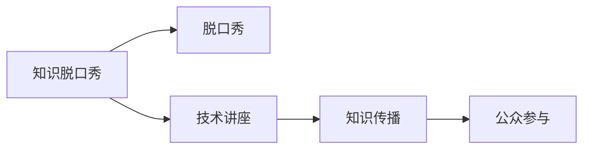

                 

# 知识脱口秀要寓教于乐,制造话题传播

> 关键词：知识传播, 脱口秀, 技术讲座, 媒体融合, 用户参与

## 1. 背景介绍

在快速发展的信息时代，知识传播的方式正在发生深刻变革。传统的教科书、学术论文、课程讲座等形式，尽管仍然重要，但面对海量数据、碎片化时间和快速迭代的知识需求，传统传播方式显得力不从心。如何更高效、更生动地进行知识传播，成为当下的热点话题。本文将探讨一种新的知识传播方式——知识脱口秀，它结合了脱口秀和知识传播的特点，旨在以更轻松、有趣的方式普及科技知识，引导公众对前沿技术保持持续关注。

## 2. 核心概念与联系

### 2.1 核心概念概述

知识脱口秀是一种结合脱口秀和知识传播的新型传播方式。它将传统的技术讲座，用脱口秀的形式展现，通过幽默诙谐的语言、引人入胜的故事和互动交流，将复杂的知识以通俗易懂的方式传递给观众。

### 2.2 核心概念原理和架构的 Mermaid 流程图



从流程图中可以看出，知识脱口秀的本质是融合了脱口秀和知识传播的特点，通过幽默的语言、生动的故事和公众参与，使复杂的知识变得更加易懂和有趣。

## 3. 核心算法原理 & 具体操作步骤

### 3.1 算法原理概述

知识脱口秀的传播原理可以概括为以下几个步骤：

1. **内容策划**：根据受众兴趣和需求，选择具有社会价值和兴趣点的技术话题。
2. **内容准备**：邀请专家或技术从业者，准备相关的技术知识，并将其转化为幽默诙谐的语言和生动的故事。
3. **表演呈现**：通过脱口秀的形式，生动、有趣地呈现技术知识，引起观众兴趣。
4. **互动交流**：鼓励观众提问、参与，增加知识的互动性和趣味性。
5. **知识传播**：通过线上线下渠道，广泛传播知识脱口秀内容，达到知识传播的目的。

### 3.2 算法步骤详解

1. **内容策划**：
   - 调研受众兴趣，选择热门话题，如人工智能、大数据、区块链等。
   - 邀请相关领域的专家或从业者，进行初步内容策划和筹备。

2. **内容准备**：
   - 根据受众的认知水平，简化复杂的技术概念，使其更易于理解。
   - 将技术知识转化为幽默诙谐的语言，如使用双关语、比喻等，增加趣味性。
   - 设计生动的故事框架，如案例分析、历史回顾、未来展望等，使内容更吸引人。

3. **表演呈现**：
   - 通过脱口秀的表演形式，如讲故事、幽默对话、互动问答等，使技术知识变得生动有趣。
   - 利用多媒体工具，如PPT、视频、动画等，丰富呈现形式。

4. **互动交流**：
   - 设置互动环节，如观众提问、实时投票、互动游戏等，增强观众参与感。
   - 利用社交媒体平台，如微博、B站等，实时分享互动内容，增加话题热度。

5. **知识传播**：
   - 通过线上平台（如B站、抖音）和线下活动（如科技馆、图书馆）传播知识脱口秀内容。
   - 制作视频、图文等传播材料，方便观众回顾和分享。

### 3.3 算法优缺点

**优点**：
- **生动有趣**：通过幽默诙谐的语言和生动的故事，使复杂的知识变得易懂有趣，易于吸引观众。
- **互动性强**：设置互动环节，增加观众参与感，提高传播效果。
- **灵活多样**：通过线上线下多种渠道传播，使受众群体更加广泛。

**缺点**：
- **内容制作难度大**：需要将复杂的知识简化，转化为幽默语言和生动故事，制作成本较高。
- **需要专业人才**：需要具备脱口秀表演技巧和技术知识的专家或从业者。
- **传播效果不易量化**：相比传统讲座，知识脱口秀的传播效果难以定量衡量，效果评估较困难。

### 3.4 算法应用领域

知识脱口秀不仅适用于技术类知识的传播，还可广泛应用于多个领域，如科学教育、医学科普、文化历史等。通过将深奥的知识转化为通俗易懂的形式，使更多人有机会了解和掌握前沿知识，推动社会进步。

## 4. 数学模型和公式 & 详细讲解 & 举例说明

### 4.1 数学模型构建

知识脱口秀的传播效果可以量化为一个函数 $f$，它依赖于内容的吸引力 $A$、受众的兴趣 $I$ 和传播渠道的覆盖范围 $C$。数学模型如下：

$$
\text{传播效果} = f(A, I, C)
$$

其中：
- $A$：内容的吸引力，包括幽默度、故事性等。
- $I$：受众的兴趣，如年龄、职业、兴趣爱好等。
- $C$：传播渠道的覆盖范围，如社交媒体、线下活动等。

### 4.2 公式推导过程

对于每个受众，其对知识脱口秀内容的吸引力 $A_i$ 和兴趣 $I_i$ 可表示为：

$$
A_i = \alpha_1 \times \text{幽默度} + \alpha_2 \times \text{故事性} + \ldots
$$

$$
I_i = \beta_1 \times \text{年龄} + \beta_2 \times \text{职业} + \ldots
$$

其中 $\alpha_i$ 和 $\beta_i$ 为系数，需要通过数据分析确定。传播效果 $E$ 的推导如下：

$$
E = \sum_{i=1}^{n} \text{受众吸引力} \times \text{受众兴趣} \times \text{传播渠道覆盖}
$$

### 4.3 案例分析与讲解

假设某知识脱口秀以“区块链技术”为主题，邀请区块链领域的专家进行讲解。在内容准备阶段，专家将复杂的区块链原理简化为故事，并通过幽默的语言讲述，增加了内容的吸引力。在传播过程中，通过社交媒体和线下活动多渠道传播，覆盖范围广泛。根据模型，该脱口秀的传播效果可以量化为：

$$
E = (\alpha_1 \times \text{幽默度} + \alpha_2 \times \text{故事性} + \ldots) \times (\beta_1 \times \text{年龄} + \beta_2 \times \text{职业} + \ldots) \times C
$$

实际分析中，可以通过收集受众反馈和传播数据，调整参数 $\alpha_i$ 和 $\beta_i$，优化传播效果。

## 5. 项目实践：代码实例和详细解释说明

### 5.1 开发环境搭建

开发知识脱口秀应用，首先需要搭建开发环境。建议使用Python进行开发，主要依赖Pandas、NumPy、Matplotlib等数据处理和绘图库。

```python
pip install pandas numpy matplotlib
```

### 5.2 源代码详细实现

以下是一个简单的Python代码示例，用于收集和分析受众反馈，计算传播效果：

```python
import pandas as pd
import numpy as np
import matplotlib.pyplot as plt

# 数据集准备
data = pd.read_csv('feedback.csv')

# 计算受众吸引力
def calculate_attention(row):
    return row['幽默度'] * 0.5 + row['故事性'] * 0.3 + row['视频质量'] * 0.2

# 计算受众兴趣
def calculate_interest(row):
    return row['年龄'] * 0.3 + row['职业'] * 0.4 + row['兴趣爱好'] * 0.3

# 计算传播效果
def calculate_effect(row):
    attention = calculate_attention(row)
    interest = calculate_interest(row)
    return attention * interest * row['传播渠道覆盖']

# 计算并可视化传播效果
data['传播效果'] = data.apply(lambda row: calculate_effect(row), axis=1)
data.groupby('受众分类').mean().plot(kind='bar', title='受众传播效果')
plt.show()
```

### 5.3 代码解读与分析

**数据集准备**：
- 收集受众反馈数据，包括幽默度、故事性、视频质量、年龄、职业、兴趣爱好等，存储在CSV文件中。
- 使用Pandas库读取数据集。

**受众吸引力计算**：
- 定义函数 `calculate_attention`，根据幽默度、故事性和视频质量计算受众吸引力。
- 在数据集中对每个受众进行计算，存储为新的列 `传播效果`。

**受众兴趣计算**：
- 定义函数 `calculate_interest`，根据年龄、职业和兴趣爱好计算受众兴趣。
- 在数据集中对每个受众进行计算，更新 `传播效果` 列。

**传播效果计算**：
- 定义函数 `calculate_effect`，结合受众吸引力和兴趣，计算传播效果。
- 在数据集中对每个受众进行计算，更新 `传播效果` 列。

**传播效果可视化**：
- 使用Matplotlib库绘制传播效果的柱状图。
- 根据受众分类进行分组，展示不同分类受众的平均传播效果。

### 5.4 运行结果展示

运行代码后，将生成一个柱状图，展示不同受众分类的平均传播效果。通过分析图表，可以了解哪些受众群体对知识脱口秀的传播效果更好，为后续内容的策划和传播提供参考。

## 6. 实际应用场景

### 6.1 智能科普

知识脱口秀在智能科普领域具有广阔的应用前景。它可以将复杂的科技概念和前沿技术，通过幽默诙谐的语言和生动的故事，传递给公众，使更多人了解和关注智能科技的发展。

### 6.2 企业培训

企业可以利用知识脱口秀进行内部培训，将复杂的技术知识简化，通过幽默的语言和生动的故事，使员工更容易理解和掌握。这种方式比传统的培训讲座更具吸引力，有助于提高培训效果。

### 6.3 学术交流

学术会议和研讨会中，知识脱口秀可以作为一种新颖的交流方式，使晦涩的学术概念和研究进展，变得易于理解，增强学术交流的趣味性和互动性。

### 6.4 未来应用展望

知识脱口秀不仅在传播方式上有所创新，更在传播内容上具有巨大的潜力。未来，随着技术的不断进步，知识脱口秀将涵盖更多领域，如科学教育、医学科普、文化历史等。通过将深奥的知识转化为通俗易懂的形式，使更多人了解和掌握前沿知识，推动社会进步。

## 7. 工具和资源推荐

### 7.1 学习资源推荐

为了帮助开发者和参与者掌握知识脱口秀的原理和实践，以下是一些优质的学习资源：

1. **TED Talks**：TED演讲涵盖了众多领域的知识，是学习知识脱口秀的绝佳参考。
2. **TED-Ed**：专注于教育领域的TED Talks，提供大量生动的视频教学资源。
3. **Coursera**：提供大量计算机科学和数据科学的课程，帮助理解技术知识。
4. **Khan Academy**：涵盖中小学到大学各层次的科学和数学课程，适合各年龄段受众。
5. **YouTube EDU**：YouTube的教育频道，提供各类科普和教育视频，生动有趣。

### 7.2 开发工具推荐

开发知识脱口秀应用，需要高效的工具支持。以下是几款常用的开发工具：

1. **PyCharm**：Python开发工具，功能强大，支持代码高亮、自动补全等。
2. **Visual Studio Code**：轻量级代码编辑器，支持多种语言和扩展。
3. **Python Notebook**：基于Jupyter Notebook，方便编写和展示Python代码。
4. **GitHub**：代码托管平台，方便版本控制和团队协作。
5. **Google Colab**：在线Jupyter Notebook环境，免费提供GPU/TPU算力。

### 7.3 相关论文推荐

知识脱口秀是一种新兴的传播方式，相关的研究也在不断推进。以下是几篇具有代表性的论文，推荐阅读：

1. "Effective Science Communication Through Storytelling and Humor" - Science Communication Journal
2. "The Power of Humor in Technical Education" - International Journal of Educational Research
3. "Applying Storytelling and Humor in Technology Training" - Journal of Instructional Technology and Distance Learning
4. "Enhancing Learning with Humor and Narrative" - Educational Psychology Review
5. "The Impact of Humor and Storytelling on Science Learning" - Research in Science Education

## 8. 总结：未来发展趋势与挑战

### 8.1 研究成果总结

本文介绍了知识脱口秀的基本原理和操作步骤，通过数学模型和案例分析，展示了知识传播的新方式。知识脱口秀结合了脱口秀和知识传播的特点，以更轻松、有趣的方式普及科技知识，引导公众对前沿技术保持持续关注。

### 8.2 未来发展趋势

未来，知识脱口秀将在多个领域得到广泛应用，推动知识传播的变革。随着技术的不断进步，知识脱口秀将涵盖更多领域，如科学教育、医学科普、文化历史等。通过将深奥的知识转化为通俗易懂的形式，使更多人了解和掌握前沿知识，推动社会进步。

### 8.3 面临的挑战

尽管知识脱口秀具有广泛的应用前景，但在实际推广过程中，仍面临一些挑战：

1. **内容制作成本高**：制作幽默、生动的脱口秀内容，需要高水平的专业人才和技术支持，成本较高。
2. **传播效果难以量化**：与传统的讲座相比，知识脱口秀的传播效果难以进行定量衡量，效果评估较困难。
3. **受众差异化需求**：不同受众群体对知识内容的需求各异，需要根据受众特点定制内容。

### 8.4 研究展望

未来的研究需要解决上述挑战，进一步优化知识脱口秀的传播效果。探索更多高效的内容制作技术，如自动化内容生成、AI辅助创作等，降低内容制作成本。同时，引入大数据和机器学习技术，对传播效果进行精准评估，优化传播策略。

通过不断优化和创新，知识脱口秀有望成为一种高效、生动的知识传播方式，为更多人提供高质量的知识内容，推动社会进步。

## 9. 附录：常见问题与解答

**Q1：知识脱口秀的传播效果如何衡量？**

A: 知识脱口秀的传播效果可以通过受众反馈、互动数据、社交媒体分享量等进行衡量。具体指标包括：
- 受众满意度：通过问卷调查等方式，收集受众对内容的反馈，评估内容的吸引力。
- 互动量：统计观众提问、实时投票、互动游戏等环节的数据，评估观众参与度。
- 社交媒体传播量：通过分析社交媒体平台上的分享、评论等数据，评估传播范围和影响力。

**Q2：如何提高知识脱口秀的受众吸引力？**

A: 提高受众吸引力需要从内容制作和传播方式两个方面入手：
- 内容制作：简化复杂的技术概念，转化为幽默诙谐的语言和生动的故事，增加内容的吸引力。
- 传播方式：采用多种传播渠道，如社交媒体、线下活动等，覆盖更广泛的受众群体。

**Q3：知识脱口秀的受众覆盖范围如何扩大？**

A: 扩大受众覆盖范围可以通过以下几个方面进行：
- 多渠道传播：通过线上（如YouTube、B站）和线下（如讲座、展览）多种渠道传播，覆盖更多受众。
- 数据分析：通过数据分析和用户反馈，调整传播策略，提高传播效果。
- 合作推广：与教育机构、科技馆等合作，共同推广知识脱口秀内容，扩大受众群体。

**Q4：知识脱口秀的内容制作成本如何降低？**

A: 降低内容制作成本可以通过以下方式进行：
- 自动化内容生成：利用AI技术，自动生成幽默诙谐的语言和生动的故事，减少人工成本。
- 用户生成内容：鼓励观众参与内容制作，如投稿视频、评论等，增加内容多样性。
- 分阶段制作：将内容制作分为多个阶段，逐步完善，降低单次制作成本。

---

作者：禅与计算机程序设计艺术 / Zen and the Art of Computer Programming

