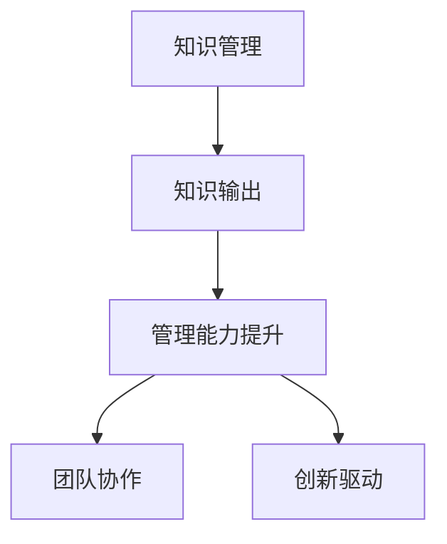

                 

# 知识输出对管理能力提升的作用

> 关键词：知识管理, 知识输出, 管理能力, 团队协作, 创新驱动

## 1. 背景介绍

### 1.1 问题由来

在现代企业中，知识管理被视为推动企业发展的关键因素之一。传统的知识管理往往侧重于知识的积累和存储，但知识的真正价值在于其输出和应用。知识输出不仅能够促进知识的传播和扩散，还能提升企业员工的管理能力，驱动企业创新。然而，如何在知识管理和知识输出之间找到最佳平衡，依然是一个值得深入探讨的问题。

### 1.2 问题核心关键点

本文聚焦于知识输出对管理能力提升的作用，旨在探讨知识输出在企业组织中的角色和机制，以及如何通过有效的知识输出提升团队协作效率和创新能力。我们认为，知识输出是知识管理的重要环节，能够促进知识的内化和外化，从而提升管理能力。

## 2. 核心概念与联系

### 2.1 核心概念概述

为了深入理解知识输出对管理能力提升的作用，本节将介绍几个关键概念：

- **知识管理(Knowledge Management)**：通过收集、存储、检索和共享知识，以促进企业组织内的知识流动。知识管理的目标是使员工能够快速找到所需的信息，从而提高工作效率和决策质量。

- **知识输出(Knowledge Output)**：指将知识从内部生成并传递给外部，具体形式包括文档、报告、案例分析、博客等。知识输出不仅涉及知识的传播，还强调知识的实用性和价值导向。

- **管理能力(Management Capability)**：指企业组织中员工的管理水平和能力，包括决策、沟通、协作、创新等多个方面。有效的管理能力能够提升团队执行力和企业竞争力。

- **团队协作(Team Collaboration)**：指团队成员之间的合作和互动，共同完成目标任务。高效的团队协作能够提升团队整体的执行效率和创新能力。

- **创新驱动(Innovation-Driven)**：指通过持续创新来驱动企业发展和竞争优势。知识输出在创新驱动中扮演着重要的角色，能够促进新理念、新方法的产生和应用。

这些概念之间的逻辑关系可以通过以下Mermaid流程图来展示：



这个流程图展示出知识管理、知识输出、管理能力提升、团队协作和创新驱动之间的内在联系：知识管理通过知识输出促进了管理能力提升，而管理能力的提升又进一步推动了团队协作和创新驱动。

## 3. 核心算法原理 & 具体操作步骤

### 3.1 算法原理概述

知识输出对管理能力提升的作用主要体现在以下几个方面：

1. **知识内化**：通过输出知识，员工能够更好地理解和掌握知识，从而提升自身的专业能力和管理水平。
2. **知识共享**：知识输出促进了知识的内部传播和外部分享，有助于形成知识共享的文化，提升团队整体的知识水平。
3. **协同创新**：知识输出激发了团队成员的创造力和创新思维，促进了跨部门的协同创新。

### 3.2 算法步骤详解

基于知识输出对管理能力提升的作用，本节将详细介绍知识输出的实现步骤：

**Step 1: 确定知识输出形式**

- **文档撰写**：撰写技术文档、案例分析、行业报告等形式的知识输出。
- **案例分享**：分享成功案例和失败教训，促进经验传播和教训吸取。
- **博客发表**：撰写博客、技术文章，传播前沿技术和理念。
- **内部培训**：组织内部培训和讲座，提升团队的专业能力和知识水平。
- **外部演讲**：参与行业会议和交流活动，分享经验和见解，提升企业影响力。

**Step 2: 知识输出平台建设**

- **内部平台**：建设企业内部的知识管理系统，支持文档上传、分享、检索等功能。
- **外部平台**：利用外部知识共享平台（如GitHub、Medium等）进行知识输出。
- **协作平台**：使用协作工具（如Confluence、Slack）促进团队内的知识交流和协作。

**Step 3: 知识输出激励机制**

- **奖励机制**：对积极参与知识输出的员工进行表彰和奖励，如年终奖金、晋升机会等。
- **绩效评估**：将知识输出作为员工绩效评估的重要指标，激励员工积极参与知识输出。
- **职业发展**：将知识输出与员工的职业发展挂钩，鼓励员工通过知识输出提升个人价值。

**Step 4: 知识输出效果评估**

- **数量评估**：统计知识输出的数量和覆盖范围，评估知识输出的广度和深度。
- **质量评估**：对知识输出的质量进行评估，包括内容的实用性、深度、新颖性等。
- **效果评估**：通过团队绩效、创新成果等指标，评估知识输出对管理能力和团队协作的实际影响。

### 3.3 算法优缺点

知识输出的优点主要体现在以下几个方面：

- **提升员工能力**：通过知识输出，员工能够更好地理解和掌握知识，提升自身专业能力和管理水平。
- **促进知识共享**：知识输出促进了知识的内部传播和外部分享，有助于形成知识共享的文化，提升团队整体的知识水平。
- **激发创新思维**：知识输出激发了团队成员的创造力和创新思维，促进了跨部门的协同创新。

知识输出的缺点主要在于：

- **时间和资源投入**：知识输出需要投入大量时间和资源，尤其是对于复杂的文档撰写和案例分析。
- **质量控制难度**：知识输出的质量难以控制，容易出现内容质量参差不齐的问题。
- **激励机制缺失**：如果缺乏有效的激励机制，员工可能缺乏积极性参与知识输出。

### 3.4 算法应用领域

知识输出对管理能力提升的作用广泛应用于各个领域：

- **企业培训**：通过内部培训和外部演讲，提升员工的知识水平和管理能力。
- **产品开发**：通过技术文档和案例分享，促进知识在产品开发团队中的流动。
- **市场营销**：通过撰写博客和行业报告，提升企业品牌影响力和市场竞争力。
- **客户服务**：通过内部知识管理和客户沟通，提升客户服务质量。
- **创新研发**：通过知识输出和跨部门协作，促进创新成果的产生和应用。

## 4. 数学模型和公式 & 详细讲解 & 举例说明

### 4.1 数学模型构建

假设企业组织中有 $N$ 名员工，每个员工的知识输出量为 $K_i$，管理能力提升量为 $M_i$。知识输出对管理能力提升的影响可以表示为：

$$
M_i = f(K_i) + \sum_{j=1}^N g(K_i, K_j)
$$

其中 $f(K_i)$ 表示单个员工的知识输出对其自身管理能力提升的影响，$g(K_i, K_j)$ 表示员工之间的知识输出互动对其管理能力提升的影响。

### 4.2 公式推导过程

为了简化问题，我们假设 $f(K_i)$ 和 $g(K_i, K_j)$ 均为线性函数：

$$
f(K_i) = aK_i + b
$$

$$
g(K_i, K_j) = cK_iK_j + d
$$

其中 $a, b, c, d$ 为常数。将上述公式代入管理能力提升模型，得：

$$
M_i = aK_i + b + \sum_{j=1}^N (cK_iK_j + d)
$$

$$
M_i = (a + \sum_{j=1}^N cK_j)K_i + b + dN
$$

上述公式展示了知识输出对管理能力提升的数学模型。可以看出，知识输出的广度和深度对管理能力提升有显著影响。

### 4.3 案例分析与讲解

假设某企业组织有 $N=10$ 名员工，每个员工的知识输出量 $K_i$ 均相同，且为 $K=10$。代入公式，得：

$$
M_i = (a + \sum_{j=1}^N cK_j)K_i + b + dN
$$

由于 $K_i = K_j$，上式可以进一步简化为：

$$
M_i = (a + (N-1)cK)K_i + b + dN
$$

代入 $K_i = K = 10$ 和 $N = 10$，得：

$$
M_i = (a + 9c \times 10) \times 10 + b + 10d
$$

$$
M_i = (a + 90c) \times 10 + b + 10d
$$

可以看出，知识输出量 $K_i$ 对管理能力提升 $M_i$ 的影响是线性的。在实际应用中，可以通过调整知识输出量来最大化管理能力提升。

## 5. 项目实践：代码实例和详细解释说明

### 5.1 开发环境搭建

在进行知识输出实践前，我们需要准备好开发环境。以下是使用Python进行Flask开发的环境配置流程：

1. 安装Anaconda：从官网下载并安装Anaconda，用于创建独立的Python环境。

2. 创建并激活虚拟环境：
```bash
conda create -n flask-env python=3.8 
conda activate flask-env
```

3. 安装Flask：
```bash
pip install Flask
```

4. 安装Flask扩展：
```bash
pip install Flask-RESTful
```

5. 安装SQLAlchemy：
```bash
pip install SQLAlchemy
```

6. 安装WTForms：
```bash
pip install wtforms
```

完成上述步骤后，即可在`flask-env`环境中开始知识输出系统的开发。

### 5.2 源代码详细实现

以下是一个简单的知识输出系统，使用Flask和SQLAlchemy实现知识文档的存储和检索：

```python
from flask import Flask, request
from flask_sqlalchemy import SQLAlchemy
from flask_restful import Resource, Api

app = Flask(__name__)
app.config['SQLALCHEMY_DATABASE_URI'] = 'sqlite:///test.db'
db = SQLAlchemy(app)
api = Api(app)

class Document(db.Model):
    id = db.Column(db.Integer, primary_key=True)
    title = db.Column(db.String(100))
    content = db.Column(db.Text)
    created_at = db.Column(db.DateTime, default=db.func.current_timestamp())

class DocumentResource(Resource):
    def get(self, id):
        document = Document.query.get(id)
        if document is None:
            return {'error': 'Document not found'}, 404
        return {'id': document.id, 'title': document.title, 'content': document.content, 'created_at': document.created_at}

api.add_resource(DocumentResource, '/documents/<int:id>')

if __name__ == '__main__':
    app.run(debug=True)
```

### 5.3 代码解读与分析

让我们再详细解读一下关键代码的实现细节：

**app和db的配置**：
- `app.config['SQLALCHEMY_DATABASE_URI']` 指定SQLite数据库的连接字符串。
- `db = SQLAlchemy(app)` 初始化SQLAlchemy，将Flask应用绑定到数据库。

**Document模型定义**：
- `id` 为自增主键。
- `title` 为文档标题，最大长度100。
- `content` 为文档内容。
- `created_at` 为文档创建时间，默认为当前时间戳。

**DocumentResource类**：
- `get` 方法根据ID获取指定文档，如果不存在则返回404错误。

**API实现**：
- 使用Flask-RESTful定义API端点，支持GET请求。

**启动Flask应用**：
- `if __name__ == '__main__':` 判断是否为主程序运行，然后启动Flask应用。

### 5.4 运行结果展示

启动Flask应用，可以使用以下命令：
```bash
flask run
```

在浏览器中访问 http://localhost:5000/documents/1，可以看到文档的详细信息。

## 6. 实际应用场景

### 6.1 企业培训

在企业培训中，知识输出可以发挥重要作用。通过内部培训和外部演讲，员工可以学习最新的行业知识和最佳实践，从而提升自身能力和管理水平。具体实现方式包括：

- **内部培训**：组织内部培训课程，邀请专家讲解前沿技术和案例分析。
- **外部演讲**：鼓励员工参加行业会议和论坛，分享经验和学习成果。
- **知识共享**：通过内部平台和外部平台发布培训材料和演讲PPT，促进知识的内部传播和外部分享。

### 6.2 产品开发

在产品开发中，知识输出可以推动团队协作和创新。通过文档撰写和案例分享，团队成员可以共享最佳实践和经验，提升产品开发效率和质量。具体实现方式包括：

- **技术文档**：编写详细的产品文档和技术规格，指导团队成员进行开发。
- **案例分析**：分享成功案例和失败教训，促进经验传播和教训吸取。
- **代码示例**：提供代码示例和最佳实践，帮助团队成员快速上手和优化开发。

### 6.3 市场营销

在市场营销中，知识输出可以提升企业品牌影响力和市场竞争力。通过撰写博客和行业报告，企业可以展示自身技术实力和行业影响力，吸引更多的客户和合作伙伴。具体实现方式包括：

- **博客撰写**：在企业官网和第三方平台发布博客文章，分享技术理念和行业洞察。
- **行业报告**：撰写行业研究报告，分析市场趋势和技术发展。
- **客户案例**：发布客户案例和成功故事，展示企业技术和解决方案的优势。

### 6.4 客户服务

在客户服务中，知识输出可以提高服务质量和客户满意度。通过内部知识管理和客户沟通，团队成员可以快速查找和解决问题，提升客户服务效率和质量。具体实现方式包括：

- **内部知识库**：建立内部知识库，存储常见问题和解决方案，方便团队成员查找和复用。
- **客户培训**：通过电话、邮件和视频会议，向客户提供技术支持和解决方案。
- **知识文档**：编写详细的使用手册和技术支持文档，帮助客户解决常见问题。

### 6.5 创新研发

在创新研发中，知识输出可以促进跨部门协作和创新成果的产生。通过知识输出和跨部门协作，团队成员可以共享知识和经验，激发创新思维，推动新技术和产品的研发。具体实现方式包括：

- **跨部门协作**：建立跨部门协作机制，促进不同团队之间的知识交流和协作。
- **创新竞赛**：组织创新竞赛和项目，鼓励团队成员提出创新想法和技术方案。
- **技术沙龙**：定期举办技术沙龙和讨论会，促进团队成员的交流和灵感碰撞。

## 7. 工具和资源推荐

### 7.1 学习资源推荐

为了帮助开发者系统掌握知识输出的理论基础和实践技巧，这里推荐一些优质的学习资源：

1. **《知识管理》书籍**：介绍知识管理的定义、流程和最佳实践，是知识管理领域的基础读物。
2. **Coursera《知识管理》课程**：由知名大学开设的在线课程，涵盖知识管理的各个方面，提供实用的案例分析。
3. **《知识输出的力量》一书**：详细讲解知识输出对企业的影响和实践方法，是企业知识管理的重要参考。
4. **LinkedIn Learning《知识管理》课程**：通过案例和实操，介绍知识管理的实用技巧和工具。
5. **Khan Academy《知识管理》课程**：提供免费的在线课程，覆盖知识管理的多个方面，适合初学者入门。

通过对这些资源的学习实践，相信你一定能够快速掌握知识输出的精髓，并用于解决实际的业务问题。

### 7.2 开发工具推荐

高效的开发离不开优秀的工具支持。以下是几款用于知识输出开发的常用工具：

1. **Flask**：轻量级的Web框架，简单易用，支持RESTful API开发，是构建知识输出系统的首选工具。
2. **SQLAlchemy**：Python ORM框架，支持多种数据库操作，便于数据的存储和检索。
3. **Jupyter Notebook**：交互式的开发环境，支持Python代码的编写和调试。
4. **GitHub**：开源代码托管平台，支持文档和代码的版本控制和协作。
5. **Docker**：容器化技术，支持知识输出系统的快速部署和扩展。

合理利用这些工具，可以显著提升知识输出系统的开发效率，加快创新迭代的步伐。

### 7.3 相关论文推荐

知识输出的研究始于学界的持续探索。以下是几篇奠基性的相关论文，推荐阅读：

1. **《知识输出在知识管理中的作用》**：分析了知识输出对知识管理的影响，提出了一套系统的知识输出框架。
2. **《基于知识输出的企业绩效提升》**：研究了知识输出对企业绩效的提升作用，提供了具体的实践方法。
3. **《知识输出与团队协作》**：探讨了知识输出对团队协作的影响，提出了多种知识输出的实现方式。
4. **《知识输出的未来趋势》**：分析了知识输出技术的发展趋势和应用前景，提出了未来的研究方向。
5. **《知识输出的案例分析》**：通过多个企业案例，展示了知识输出的实际效果和应用价值。

这些论文代表了大语言模型微调技术的发展脉络。通过学习这些前沿成果，可以帮助研究者把握学科前进方向，激发更多的创新灵感。

## 8. 总结：未来发展趋势与挑战

### 8.1 总结

本文对知识输出对管理能力提升的作用进行了全面系统的介绍。首先阐述了知识输出在企业组织中的角色和机制，明确了知识输出在管理能力提升中的关键作用。其次，从原理到实践，详细讲解了知识输出的实现步骤，给出了知识输出任务开发的完整代码实例。同时，本文还广泛探讨了知识输出在企业培训、产品开发、市场营销、客户服务、创新研发等多个领域的应用前景，展示了知识输出范式的巨大潜力。

通过本文的系统梳理，可以看到，知识输出是知识管理的重要环节，能够促进知识的内化和外化，从而提升管理能力。未来，伴随知识输出技术的持续演进，知识输出将成为企业组织的重要工具，助力企业在各个领域实现更大的发展。

### 8.2 未来发展趋势

展望未来，知识输出对管理能力提升的应用将呈现以下几个发展趋势：

1. **数据驱动的知识输出**：通过数据分析和挖掘，生成更加个性化的知识输出内容，提升知识输出的效果和价值。
2. **智能推荐系统**：引入机器学习和推荐算法，根据用户偏好和行为，智能推荐知识输出内容，提升用户的学习体验。
3. **多模态知识输出**：结合文本、图片、视频等多种形式的知识输出，丰富知识表达的方式，提升用户的理解和记忆效果。
4. **实时知识输出**：通过实时数据流和消息推送，实现知识输出的实时更新和传播，提升知识的时效性和覆盖面。
5. **跨文化知识输出**：引入多语言支持，实现知识输出内容的跨文化传播，促进全球化知识共享。

以上趋势凸显了知识输出技术的广阔前景。这些方向的探索发展，必将进一步提升企业组织的管理能力和创新水平，为企业的持续发展提供强大的支持。

### 8.3 面临的挑战

尽管知识输出在管理能力提升中已经取得了显著成效，但在迈向更加智能化、普适化应用的过程中，仍面临诸多挑战：

1. **知识输出的质量控制**：知识输出的质量难以控制，容易出现内容质量参差不齐的问题。如何保证知识输出的质量，是一个重要挑战。
2. **知识输出的激励机制**：缺乏有效的激励机制，员工可能缺乏积极性参与知识输出。如何设计激励机制，促进知识输出的积极性，还需要进一步研究。
3. **知识输出的技术架构**：知识输出的技术架构需要灵活、可扩展，以适应不同的业务场景和需求。如何构建高效、可靠的知识输出系统，还需要进一步探索。
4. **知识输出的效果评估**：知识输出的效果难以量化评估，如何设计有效的评估指标，衡量知识输出的价值和影响，还需要进一步研究。
5. **知识输出的安全性和隐私保护**：知识输出的过程中可能涉及敏感信息，如何保障数据安全和隐私保护，还需要进一步加强。

这些挑战需要企业组织和研究者在知识输出的各个环节进行深入研究和持续优化，才能真正实现知识输出的价值最大化。

### 8.4 研究展望

面向未来，知识输出的研究需要在以下几个方面寻求新的突破：

1. **知识输出的自动化**：通过AI和自动化技术，实现知识输出的自动化生成和传播，提升知识输出的效率和效果。
2. **知识输出的智能化**：引入机器学习和智能算法，实现知识输出的智能化推荐和优化，提升用户的学习体验和效果。
3. **知识输出的跨文化**：实现知识输出的多语言支持，促进全球化知识共享和传播。
4. **知识输出的个性化**：通过数据分析和挖掘，生成更加个性化的知识输出内容，提升知识输出的针对性和效果。
5. **知识输出的可解释性**：引入可解释性技术，提升知识输出的透明性和可理解性，增强用户对知识输出的信任和接受度。

这些研究方向的探索，必将引领知识输出技术迈向更高的台阶，为知识管理提供更加智能、高效和便捷的解决方案。面向未来，知识输出将成为企业组织的重要工具，助力企业在各个领域实现更大的发展。

## 9. 附录：常见问题与解答

**Q1：知识输出对管理能力提升有何具体作用？**

A: 知识输出对管理能力提升的作用主要体现在以下几个方面：
1. **提升员工能力**：通过知识输出，员工能够更好地理解和掌握知识，提升自身专业能力和管理水平。
2. **促进知识共享**：知识输出促进了知识的内部传播和外部分享，有助于形成知识共享的文化，提升团队整体的知识水平。
3. **激发创新思维**：知识输出激发了团队成员的创造力和创新思维，促进了跨部门的协同创新。

**Q2：如何进行知识输出效果评估？**

A: 知识输出效果评估可以从以下几个方面进行：
1. **数量评估**：统计知识输出的数量和覆盖范围，评估知识输出的广度和深度。
2. **质量评估**：对知识输出的质量进行评估，包括内容的实用性、深度、新颖性等。
3. **效果评估**：通过团队绩效、创新成果等指标，评估知识输出对管理能力和团队协作的实际影响。

**Q3：如何提高知识输出的质量？**

A: 提高知识输出的质量需要从以下几个方面进行：
1. **标准制定**：制定知识输出的标准和规范，确保知识输出的格式和内容符合要求。
2. **内容审核**：建立内容审核机制，确保知识输出的准确性和权威性。
3. **团队协作**：鼓励团队成员共同参与知识输出，集思广益，提升知识输出的质量。
4. **用户反馈**：收集用户反馈，不断改进和优化知识输出的内容。

**Q4：如何设计有效的知识输出激励机制？**

A: 设计有效的知识输出激励机制需要从以下几个方面进行：
1. **奖励机制**：对积极参与知识输出的员工进行表彰和奖励，如年终奖金、晋升机会等。
2. **绩效评估**：将知识输出作为员工绩效评估的重要指标，激励员工积极参与知识输出。
3. **职业发展**：将知识输出与员工的职业发展挂钩，鼓励员工通过知识输出提升个人价值。

**Q5：知识输出的技术架构应具备哪些特性？**

A: 知识输出的技术架构应具备以下特性：
1. **灵活性**：能够快速适应不同的业务场景和需求，支持多种知识输出形式。
2. **可扩展性**：能够支持大规模数据处理和存储，满足企业组织的知识输出需求。
3. **可靠性**：确保知识输出的稳定性和可用性，避免因故障或异常导致知识输出的中断。
4. **安全性**：保障知识输出的数据安全和隐私保护，避免敏感信息泄露。
5. **可维护性**：方便系统维护和升级，确保知识输出系统的长期稳定运行。

这些特性将确保知识输出系统的高效、可靠和稳定，提升知识输出的效果和价值。

---

作者：禅与计算机程序设计艺术 / Zen and the Art of Computer Programming

