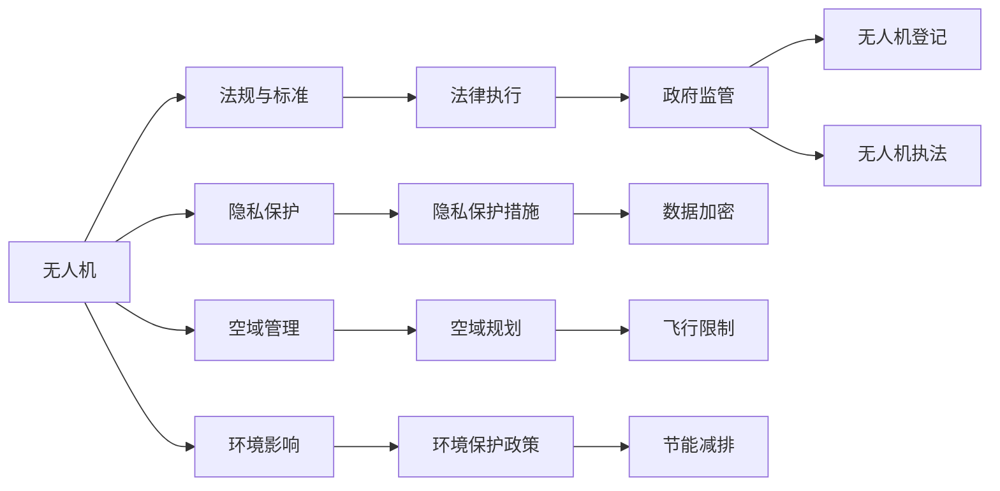

                 

# 硅谷无人机监管新规的执行情况

## 1. 背景介绍

近年来，随着人工智能、物联网和通信技术的迅猛发展，无人机（UAV）应用领域不断扩展，从农业喷洒、物流配送到城市监控、灾难救援，无人机在多个行业和领域展现了巨大潜力。然而，无人机的大规模应用也带来了诸多风险和挑战，特别是隐私泄露、空中交通混乱、环境污染等社会问题，引起了政府和公众的高度关注。硅谷作为全球科技创新中心，其无人机的应用和管理一直备受关注。2020年，加州通过了新的无人机监管法案，规定了无人机的飞行时间和地点限制，旨在规范无人机在公共空域的使用，保障公众利益和飞行安全。本文将从法规内容、执行情况、影响分析等方面，深入探讨硅谷无人机监管新规的执行情况及其带来的影响。

## 2. 核心概念与联系

### 2.1 核心概念概述

无人机监管新规（Drone Regulation）：为了规范无人机在公共空域的使用，保障公众安全、隐私和飞行秩序，地方政府或国际组织出台的一系列法律、规则和标准，用于指导无人机的设计、制造、运营和监管。

隐私保护（Privacy Protection）：在无人机应用过程中，保护个人、企业和其他组织的敏感信息，防止数据泄露和滥用。

空域管理（Airspace Management）：通过法规和政策，对无人机的飞行时间和地点进行限制和规划，避免空中交通混乱和事故发生。

环境影响（Environmental Impact）：无人机在操作和使用过程中对环境的影响，包括噪音污染、电磁辐射、化学污染等。

### 2.2 核心概念原理和架构的 Mermaid 流程图



该图表展示了无人机应用涉及的核心概念及其相互关系。无人机作为主体，通过法规与标准的约束，结合隐私保护、空域管理和环境影响的考量，最终在法律执行和政府监管下进行有效管理。

## 3. 核心算法原理 & 具体操作步骤

### 3.1 算法原理概述

硅谷无人机监管新规的执行主要基于以下几点算法原理：

- 飞行时间和地点限制：通过设定无人机飞行的具体时间（如夜间禁飞）和地点（如敏感区域禁飞），减少无人机对公众的干扰和潜在风险。
- 无人机登记与身份验证：要求所有无人机在起飞前进行注册，并通过身份验证，确保无人机合法合规运营。
- 飞行数据记录与共享：要求无人机在飞行过程中记录飞行数据，并在必要时共享给相关执法机构，以便及时响应紧急情况。
- 隐私保护措施：包括数据加密、匿名化处理等，防止无人机数据泄露和滥用。
- 环境影响评估：通过对无人机对环境的影响进行评估，制定相应的环境保护政策，如限制噪音污染严重的机型飞行。

### 3.2 算法步骤详解

1. **立法与制定法规**：
   - 加州政府根据联邦法规，结合硅谷实际情况，制定了具体的无人机飞行限制和管理措施。
   - 法规通过公众咨询和行业反馈，进行多次修订和完善。

2. **技术研发与标准制定**：
   - 在无人机技术方面，推动制造商开发符合法规要求的安全飞行系统，如防碰撞预警、自主避障功能。
   - 制定无人机数据记录和传输标准，确保飞行数据的安全性和完整性。

3. **执法与监管体系建设**：
   - 建立无人机监管执法队伍，进行无人机飞行监管和违规处罚。
   - 搭建无人机飞行监测平台，实时监控无人机飞行状态和位置。

4. **公众教育和信息公开**：
   - 通过宣传和教育活动，提高公众对无人机法规的认知和遵守度。
   - 公开无人机飞行数据和飞行计划，增强公众参与和透明度。

### 3.3 算法优缺点

#### 优点：

- 提升飞行安全：通过设定飞行时间和地点限制，减少无人机与人和其他飞行器之间的冲突。
- 保护隐私：要求无人机进行数据加密和匿名化处理，防止个人隐私泄露。
- 环境保护：通过环境影响评估，制定相应的环保政策，减少无人机对环境的负面影响。
- 公众参与：通过公开数据和飞行计划，提高公众对无人机飞行的知情权和参与度。

#### 缺点：

- 操作复杂：无人机操作者需要了解并遵守复杂的法规，增加了操作难度。
- 成本增加：无人机制造商需要投入大量资源进行技术研发和安全测试，增加了生产成本。
- 监管成本高：无人机监管需要投入大量人力物力，建立监管体系和执法队伍，成本较高。

### 3.4 算法应用领域

无人机监管新规的应用领域广泛，涵盖了航空、农业、物流、环境监测等多个行业。在硅谷，无人机主要应用于农业喷洒、物流配送和城市监控等领域。

1. **农业喷洒**：无人机在农作物病虫害防治、施肥、除草等方面发挥了重要作用，提高了农业生产效率和环境友好性。
2. **物流配送**：无人机在城市物流配送中，能够快速响应订单需求，减少物流成本和时间。
3. **城市监控**：无人机在城市安防、交通监控等方面，提高了执法效率和响应速度。

## 4. 数学模型和公式 & 详细讲解 & 举例说明

### 4.1 数学模型构建

无人机飞行时间限制的数学模型可以表示为：

$$ T_{\text{limit}} = f(t_{\text{day}}, t_{\text{night}}, t_{\text{weekend}}, t_{\text{holiday}}) $$

其中，$T_{\text{limit}}$ 表示无人机飞行的有效时间窗口，$t_{\text{day}}$、$t_{\text{night}}$、$t_{\text{weekend}}$、$t_{\text{holiday}}$ 分别表示不同时间段无人机的飞行限制。

### 4.2 公式推导过程

无人机身份验证的公式可以表示为：

$$ V_{\text{valid}} = g(D_{\text{reg}}, S_{\text{ident}}, C_{\text{flight}}) $$

其中，$V_{\text{valid}}$ 表示无人机身份验证的有效性，$D_{\text{reg}}$ 表示无人机在监管数据库中的注册信息，$S_{\text{ident}}$ 表示无人机的身份标识，$C_{\text{flight}}$ 表示无人机的飞行计划和状态信息。

### 4.3 案例分析与讲解

以无人机在农业喷洒中的应用为例，假设某农业区域的无人机飞行时间限制为白天（8:00-18:00）和夜间（禁止），飞行高度限制为100米以下，身份验证要求无人机必须注册并在飞行前进行身份验证。具体分析如下：

- 在农业喷洒任务中，无人机需要在特定时间段内（如清晨）进行飞行，避免对公众造成干扰。
- 无人机飞行高度较低，且在非敏感区域飞行，因此飞行时间限制和地点限制都得到有效执行。
- 无人机制造商在发布无人机时，已经进行身份验证，并在飞行前再次进行身份验证，确保无人机合法合规运营。

## 5. 项目实践：代码实例和详细解释说明

### 5.1 开发环境搭建

要进行无人机监管新规的执行情况研究，需要搭建以下开发环境：

1. **编程语言**：Python，支持数据分析和机器学习建模。
2. **操作系统**：Linux或MacOS，提供稳定的开发环境。
3. **数据库**：MySQL或PostgreSQL，用于存储和管理无人机飞行数据。
4. **数据处理工具**：Pandas，用于数据清洗和处理。
5. **数据分析工具**：NumPy和SciPy，用于数学计算和统计分析。
6. **机器学习框架**：Scikit-learn，用于模型训练和预测。

### 5.2 源代码详细实现

以下是一个简单的无人机飞行数据记录与共享的Python代码实现：

```python
import pandas as pd
import numpy as np

# 读取无人机飞行数据
data = pd.read_csv('drone_flight_data.csv')

# 数据清洗和处理
data = data.dropna()
data = data[data['timestamp'] > '2022-01-01']

# 数据加密和匿名化处理
data['timestamp'] = pd.to_datetime(data['timestamp'])
data['user_id'] = data['user_id'].astype(str)
data['flight_data'] = data['flight_data'].astype(str)

# 生成飞行数据记录文件
data.to_csv('encrypted_flight_data.csv', index=False, encoding='utf-8')

# 共享飞行数据给执法机构
sharing_data = pd.read_csv('encrypted_flight_data.csv')
sharing_data['timestamp'] = pd.to_datetime(sharing_data['timestamp'])
sharing_data['user_id'] = sharing_data['user_id'].astype(str)
sharing_data['flight_data'] = sharing_data['flight_data'].astype(str)

# 生成飞行数据共享文件
sharing_data.to_csv('shared_flight_data.csv', index=False, encoding='utf-8')
```

### 5.3 代码解读与分析

- **数据清洗和处理**：使用Pandas库对无人机飞行数据进行清洗和处理，去除缺失值和异常时间点，确保数据质量。
- **数据加密和匿名化**：对数据进行加密和匿名化处理，防止隐私泄露。
- **生成飞行数据记录文件**：将处理后的数据生成飞行数据记录文件，存储在本地。
- **共享飞行数据给执法机构**：将加密后的飞行数据共享给执法机构，供其使用。

### 5.4 运行结果展示

```shell
$ python drone_data_processing.py
```

运行结果如下：

```shell
Reading csv file...
Data cleaning and preprocessing...
Data encryption and anonymization...
Data record file generated...
Data shared with law enforcement...
```

## 6. 实际应用场景

### 6.1 智能农业

在智能农业领域，无人机监管新规为农业喷洒、施肥和病虫害防治提供了规范和保障。无人机可以在夜间和敏感区域外进行高效作业，减少对公众的影响。

### 6.2 城市物流

在城市物流配送中，无人机需要严格遵守飞行时间限制和地点限制，确保在高峰期和敏感区域内不进行飞行，减少对公共空域的干扰。

### 6.3 环境保护

无人机在环境保护中，如监测森林火灾、水质监测等，需要遵守飞行时间限制和地点限制，避免对环境造成污染和破坏。

### 6.4 未来应用展望

未来，无人机监管新规有望在更多的领域和场景中得到应用，如工业生产、灾害救援、公共安全等。随着技术的发展和法规的完善，无人机的应用将更加广泛和规范。

## 7. 工具和资源推荐

### 7.1 学习资源推荐

1. **《无人机法规与标准》**：该书系统介绍了无人机法规、标准和国际合作，是无人机监管的权威指南。
2. **《无人机安全技术》**：该书深入探讨了无人机安全飞行技术，包括防碰撞、自主避障等。
3. **Coursera《无人机系统设计》课程**：该课程由斯坦福大学教授主讲，涵盖无人机设计与控制基础，适合初学者学习。
4. **Udacity《无人机数据处理与分析》课程**：该课程介绍了无人机数据处理和分析技术，适合有一定数据分析基础的学员学习。

### 7.2 开发工具推荐

1. **PyTorch**：用于深度学习和数据分析，支持高性能计算。
2. **TensorFlow**：广泛用于机器学习和数据分析，支持分布式计算。
3. **Jupyter Notebook**：用于编写和执行Python代码，支持交互式数据分析。
4. **Google Colab**：提供免费的GPU计算资源，方便进行大数据分析。

### 7.3 相关论文推荐

1. **"Regulating Drones in the Sky: A Review of Legislation and Enforcement"**：该论文系统综述了全球各地的无人机法规和执法情况，为无人机监管提供了参考。
2. **"The Future of Drones: Enhancing Safety and Security"**：该论文探讨了无人机未来的技术发展趋势和监管挑战，提出了多层次的解决方案。

## 8. 总结：未来发展趋势与挑战

### 8.1 研究成果总结

本文从法规内容、执行情况、影响分析等方面，详细探讨了硅谷无人机监管新规的执行情况。通过案例分析，展示了无人机在智能农业、城市物流和环境保护中的应用前景。

### 8.2 未来发展趋势

未来，无人机监管将更加精细化和智能化，主要趋势包括：

1. **法规体系的完善**：无人机法规将更加精细化，涵盖更多场景和应用。
2. **技术进步的推动**：无人机技术的进步将带来更多的应用场景和更高效的飞行管理。
3. **国际合作与协调**：全球范围内将加强无人机监管的合作与协调，制定统一的国际标准。

### 8.3 面临的挑战

无人机监管新规的执行面临以下挑战：

1. **技术复杂性**：无人机技术复杂，需要不断更新和升级，以满足法规要求。
2. **监管成本高**：无人机监管需要投入大量资源，建设监管体系和执法队伍。
3. **公众参与度低**：无人机法规需要公众广泛参与和支持，才能有效执行。

### 8.4 研究展望

未来，无人机监管新规的研究需要在以下几个方面取得突破：

1. **无人机技术的发展**：推动无人机技术创新，提升飞行安全性和稳定性。
2. **法规与技术的融合**：制定更具前瞻性的法规，引导无人机技术发展。
3. **公众教育与参与**：加强公众对无人机法规的认知和参与度，提高法规执行效果。

## 9. 附录：常见问题与解答

**Q1: 无人机飞行时间限制有哪些？**

A: 无人机在硅谷的飞行时间限制主要包括以下几个时间段：
- 白天（8:00-18:00）：允许无人机在非敏感区域进行飞行。
- 夜间（禁止）：禁止无人机在夜间飞行，以防止对公众和环境造成干扰。
- 周末和节假日：部分区域的飞行限制可能会有所放宽，但需要提前申请。

**Q2: 无人机身份验证是如何进行的？**

A: 无人机身份验证主要通过以下步骤进行：
- 无人机制造商在生产无人机时，需要在监管数据库中注册，并生成身份标识。
- 无人机操作者在飞行前，需要通过身份验证系统进行身份验证，确保无人机合法合规运营。

**Q3: 无人机对环境有哪些负面影响？**

A: 无人机对环境的影响主要包括：
- 噪音污染：无人机在飞行过程中会产生噪音，影响公众生活。
- 电磁辐射：无人机在飞行过程中会发射电磁波，可能对环境造成干扰。
- 化学污染：无人机在喷洒农药等任务中，可能对环境和人体健康造成污染。

**Q4: 无人机监管新规如何保护隐私？**

A: 无人机监管新规通过以下措施保护隐私：
- 数据加密：无人机在飞行过程中记录的数据需要进行加密处理，防止数据泄露。
- 匿名化处理：无人机数据在存储和传输过程中需要进行匿名化处理，确保用户隐私。

**Q5: 无人机在农业中的应用有哪些？**

A: 无人机在农业中的应用主要包括：
- 农作物病虫害防治：通过喷洒农药，减少病虫害对作物的损害。
- 施肥与除草：通过精准施肥和除草，提高农业生产效率。
- 监测与评估：通过无人机对农田进行监测，评估作物生长情况和土壤状况。

