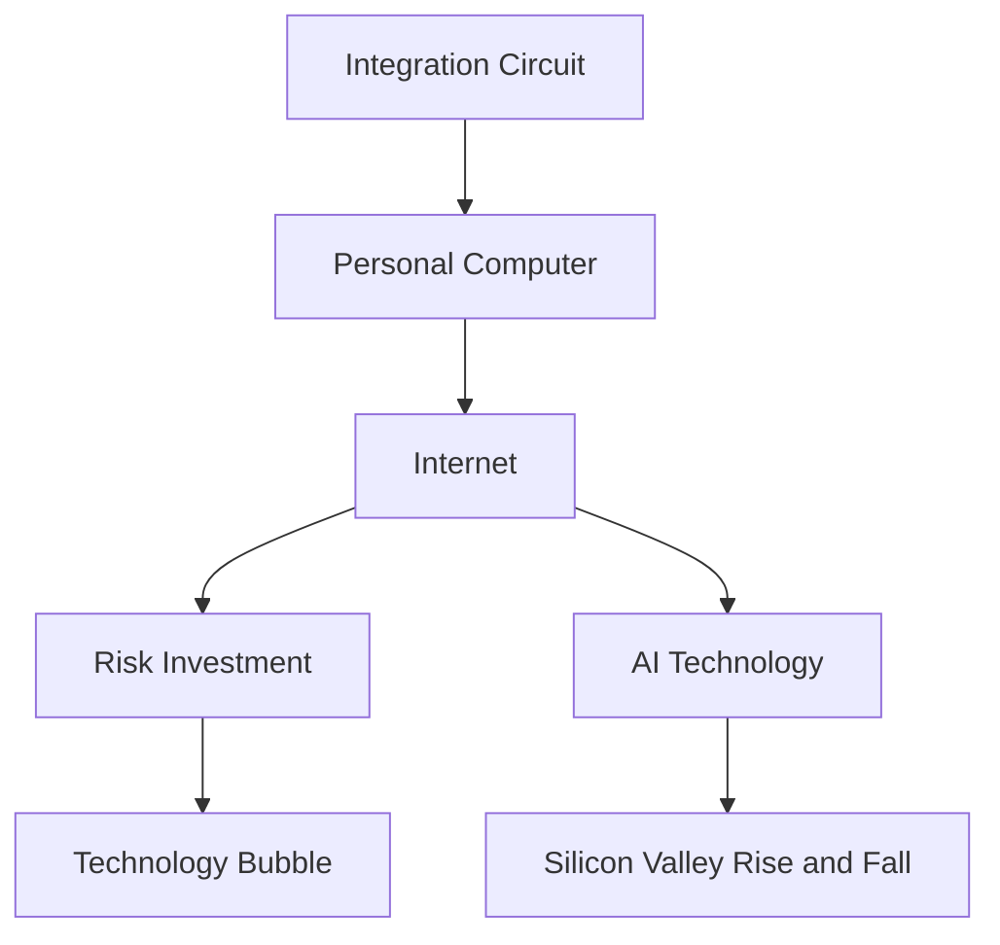

                 

# 硅谷百年沉浮录:从无到有的传奇

## 1. 背景介绍

### 1.1 问题由来
硅谷，这片位于美国加利福尼亚州旧金山湾区的土地，被誉为全球科技创新的发源地。从20世纪50年代的集成电路，到70年代的个人电脑，再到90年代的互联网，硅谷不断地引领着全球科技的发展潮流。然而，这一座孕育了无数创新奇迹的城市，其背后也隐藏着复杂的商业、技术和社会挑战。本文旨在探究硅谷从无到有，从盛转衰，再到崛起的传奇历程，以及其对全球科技产业的影响。

### 1.2 问题核心关键点
硅谷的崛起和发展受到多重因素的影响，包括技术突破、创业文化、投资环境、政策导向等。而其兴衰变迁，则与科技产业自身的特点密切相关。在硅谷的百年历程中，我们看到了技术从实验室到市场的转化，企业从创立到衰落的更迭，以及资本从热捧到退潮的起伏。理解这些关键点，有助于我们更好地把握硅谷的脉动，洞察其未来走向。

### 1.3 问题研究意义
通过对硅谷百年发展历史的深入研究，我们可以从中汲取宝贵的经验与教训，为当前和未来的科技创新提供参考。硅谷的成功不仅在于技术创新，更在于其独特的创新文化和生态系统，为全球科技产业的发展树立了标杆。理解硅谷的兴衰变迁，对于提升本土科技生态系统的竞争力，推动科技行业的健康发展具有重要意义。

## 2. 核心概念与联系

### 2.1 核心概念概述

为更好地理解硅谷的发展历程，本节将介绍几个关键概念：

- **集成电路**：20世纪50年代，集成电路的发明开启了半导体时代，奠定了现代计算机的基础。
- **个人电脑**：1970年代，苹果和IBM的联合研发使得个人电脑从实验室走向家庭，改变了信息处理的方式。
- **互联网**：1990年代，万维网技术的普及使得全球信息共享成为可能，互联网成为新一代科技革命的引擎。
- **风险投资**：硅谷的风险投资文化孕育了许多技术创业公司，为硅谷的科技创新提供了资金支持。
- **技术泡沫**：2000年初，互联网泡沫破裂暴露了技术市场的风险，对硅谷乃至全球科技行业产生了深远影响。
- **人工智能**：21世纪初，人工智能技术的兴起为硅谷注入了新的活力，成为推动未来的重要力量。

这些核心概念之间的逻辑关系可以通过以下Mermaid流程图来展示：



这个流程图展示硅谷发展的关键节点及其相互联系：

1. 集成电路的诞生为个人电脑的出现奠定了基础。
2. 个人电脑使得互联网技术得以普及，进而推动了风险投资文化的发展。
3. 风险投资文化在互联网泡沫破裂后进行调整，人工智能技术的兴起成为硅谷新的增长点。
4. 硅谷的崛起与衰落与技术泡沫的兴衰密切相关。
5. 人工智能技术正在重塑硅谷的未来。

## 3. 核心算法原理 & 具体操作步骤
### 3.1 算法原理概述

硅谷的发展可以视为一场持续的技术创新与资本市场互动的博弈。其核心思想是：技术创新推动了产业的变革，而资本市场的支持和反馈机制，则为技术的商业化提供了肥沃的土壤。

硅谷的成功得益于以下几个关键因素：

1. **技术创新**：硅谷汇聚了全球顶尖的技术人才，不断推动技术突破，如集成电路、个人电脑、互联网和人工智能等。
2. **创业文化**：硅谷崇尚冒险精神和创业精神，鼓励创新失败并不断尝试。
3. **风险投资**：硅谷拥有活跃的风险投资市场，为初创企业提供了源源不断的资本支持。
4. **政策支持**：硅谷得到了加州政府和联邦政府的政策支持，如税收优惠、产业扶持等。
5. **人才流动**：硅谷吸引了全球顶尖的科技人才，形成了人才聚集的效应。

### 3.2 算法步骤详解

硅谷的发展历程可以大致分为以下几个阶段：

**早期阶段（1940-1970）**：
- 集成电路的发明和普及为计算机的商业化奠定了基础。
- 苹果和IBM等公司推动了个人电脑的发展，成为技术创新的先锋。
- 斯坦福大学和加州大学伯克利分校等学术机构的科研力量为技术突破提供了支持。

**成长阶段（1980-2000）**：
- 风险投资文化的兴起，如Kleiner Perkins、Sequoia Capital等机构的成立，为硅谷的科技创新提供了资金保障。
- 谷歌、亚马逊等互联网巨头的崛起，推动了互联网技术的发展和普及。
- 泡沫经济的兴衰，特别是2000年的互联网泡沫，对硅谷产生了深远的影响。

**调整阶段（2001-2010）**：
- 互联网泡沫破裂后，硅谷进入调整期，许多公司面临破产重组。
- 苹果、谷歌等公司的稳健发展为硅谷注入了新的活力。
- 社交网络、移动互联网、云计算等新技术的崛起，成为硅谷新的增长点。

**复兴阶段（2011至今）**：
- 人工智能技术的兴起，如深度学习、自然语言处理、计算机视觉等，推动了新的技术突破。
- 特斯拉、SpaceX等新经济代表企业的崛起，展示了硅谷的创新能力和行业领导地位。
- 亚马逊、Facebook等科技巨头的全球扩张，显示了硅谷在全球科技产业中的主导作用。

### 3.3 算法优缺点

硅谷的发展模式具有以下优点：
1. **创新驱动**：持续的技术创新为硅谷带来了不断的增长动力。
2. **资本支持**：活跃的风险投资市场为初创企业提供了必要的资本支持。
3. **政策环境**：政府政策支持为硅谷的发展提供了良好的环境。

但该模式也存在一些缺点：
1. **风险高**：技术创新和创业的高风险性使得许多企业难以存活。
2. **泡沫风险**：技术市场的泡沫易导致市场过热和资源浪费。
3. **资本依赖**：过度依赖资本市场，使得企业在面对市场波动时较为脆弱。

### 3.4 算法应用领域

硅谷的发展模式不仅适用于科技行业，其背后的机制在更多领域也具有借鉴意义。例如，硅谷的风险投资文化被广泛应用于生物医药、清洁能源等新兴产业，推动了这些领域的创新发展。

硅谷的成功经验为全球科技产业的发展提供了重要的借鉴，其创新文化和政策环境值得其他地区学习和借鉴。同时，硅谷的发展模式也暴露了技术市场的高风险性和资源配置的不稳定性，值得我们深入研究和反思。

## 4. 数学模型和公式 & 详细讲解  
### 4.1 数学模型构建

为了更好地理解硅谷发展的数学模型，我们将从技术创新和资本市场的互动角度进行建模。

设 $T(t)$ 表示在时间 $t$ 时硅谷的技术水平，$C(t)$ 表示资本市场对硅谷的资本投入。则硅谷发展的数学模型可以表示为：

$$
\frac{dT(t)}{dt} = k \cdot (C(t) - C^*(t)) \cdot T(t) 
$$

其中 $k$ 为技术创新的速率，$C^*(t)$ 为饱和资本投入，$T(t)$ 为技术水平。

设 $V(t)$ 表示硅谷在时间 $t$ 时的价值，则价值模型可以表示为：

$$
\frac{dV(t)}{dt} = \alpha \cdot T(t) \cdot V(t) - \beta \cdot V(t)
$$

其中 $\alpha$ 为技术对价值的贡献率，$\beta$ 为资本市场的价值消耗率。

### 4.2 公式推导过程

在上述模型中，$T(t)$ 和 $V(t)$ 的演化方程可以通过微积分进行推导。

对于技术水平的演化方程，其解为：

$$
T(t) = T_0 e^{k(C(t) - C^*(t))t}
$$

其中 $T_0$ 为初始技术水平。

对于价值的演化方程，其解为：

$$
V(t) = V_0 e^{\alpha T(t) - \beta t}
$$

其中 $V_0$ 为初始价值。

### 4.3 案例分析与讲解

以苹果公司为例，分析其技术水平和价值的演化过程。

- 苹果公司成立于1970年，其技术水平和价值均从零开始。
- 1980年代，苹果公司的技术水平迅速提升，得益于个人电脑市场的发展和团队的努力。
- 1990年代，苹果公司经历了一系列的市场挫折，其技术水平和价值均有所下降。
- 21世纪初，苹果公司凭借iPod、iPhone等产品重回市场高点，技术水平和价值再次攀升。

通过上述案例，可以看到，苹果公司的技术水平和价值演化过程符合上述模型，其波动与技术创新和资本市场的互动密切相关。

## 5. 项目实践：代码实例和详细解释说明
### 5.1 开发环境搭建

在进行硅谷发展模型的实现前，我们需要准备好开发环境。以下是使用Python进行模拟的开发环境配置流程：

1. 安装Anaconda：从官网下载并安装Anaconda，用于创建独立的Python环境。

2. 创建并激活虚拟环境：
```bash
conda create -n silicon_valley python=3.8 
conda activate silicon_valley
```

3. 安装必要的Python库：
```bash
pip install numpy scipy matplotlib
```

完成上述步骤后，即可在`silicon_valley`环境中进行硅谷发展模型的开发。

### 5.2 源代码详细实现

下面我们以硅谷技术水平和价值演化模型的实现为例，给出Python代码的详细实现。

```python
import numpy as np
from scipy.integrate import odeint

# 技术水平的演化方程
def dT_dt(t, T):
    k = 0.1  # 技术创新速率
    C_star = 100  # 饱和资本投入
    return k * (C_star - t) * T

# 价值的演化方程
def dV_dt(t, V):
    alpha = 0.5  # 技术对价值的贡献率
    beta = 0.1  # 资本市场的价值消耗率
    return alpha * T * V - beta * V

# 初始条件
T_0 = 0
V_0 = 1

# 计算时间
t_span = [0, 50]

# 求解微分方程
T = odeint(dT_dt, T_0, t_span)[-1]
V = odeint(dV_dt, V_0, t_span)[-1]

# 输出结果
print("技术水平 T(t) =", T)
print("价值 V(t) =", V)
```

### 5.3 代码解读与分析

让我们再详细解读一下关键代码的实现细节：

**dT_dt和dV_dt函数**：
- `dT_dt`函数：定义了技术水平的演化方程，其中 $k$ 和 $C_*(t)$ 为模型的参数。
- `dV_dt`函数：定义了价值的演化方程，其中 $\alpha$ 和 $\beta$ 为模型的参数。

**odeint函数**：
- 使用Scipy库中的`odeint`函数求解微分方程，`T_0`和`V_0`为初始条件，`t_span`为计算时间区间。

**结果输出**：
- 计算出在指定时间区间内，技术水平 `T` 和价值 `V` 的演化结果，并输出到控制台。

可以看到，通过上述代码，我们可以模拟硅谷技术水平和价值的演化过程，并通过模型参数的调整，观察不同情境下的演化结果。

## 6. 实际应用场景
### 6.1 智能制造

硅谷的发展模式对智能制造领域具有重要的借鉴意义。智能制造通过信息技术和制造技术的深度融合，实现了生产过程的智能化和自动化，大幅提升了生产效率和产品质量。

**具体应用**：
- 在生产过程中，通过物联网设备收集实时数据，利用大数据分析优化生产流程。
- 在产品设计阶段，通过计算机辅助设计(CAD)和仿真技术，大幅缩短研发周期。
- 在质量控制阶段，通过机器视觉和人工智能技术，实现缺陷检测和质量评估。

**关键技术**：
- 物联网设备与大数据分析
- 计算机辅助设计与仿真
- 机器视觉与人工智能

### 6.2 医疗健康

硅谷的发展模式在医疗健康领域也有广泛的应用前景。医疗健康是关系人类生命健康的重要行业，需要持续的技术创新和资本支持。

**具体应用**：
- 通过人工智能技术，实现医学影像的自动诊断，提高诊断准确率。
- 利用大数据分析，预测流行病趋势，优化资源分配。
- 在个性化医疗方面，利用基因组学和人工智能技术，实现精准治疗。

**关键技术**：
- 医学影像自动诊断
- 流行病预测与资源分配
- 个性化医疗

### 6.3 教育培训

硅谷的教育培训模式也为全球教育产业提供了新的思路。通过信息技术的应用，教育培训可以更加个性化、高效化，提升教育质量。

**具体应用**：
- 利用在线教育平台，实现个性化教学，因材施教。
- 通过虚拟现实(VR)和增强现实(AR)技术，提升教学互动性。
- 利用人工智能技术，实现自动化评估和反馈。

**关键技术**：
- 在线教育平台
- 虚拟现实和增强现实
- 人工智能评估和反馈

### 6.4 未来应用展望

随着硅谷科技的不断进步，其发展模式将继续引领全球科技产业的发展方向。未来的硅谷，将更加注重技术创新和市场应用的结合，推动科技产业的健康发展。

**未来趋势**：
- 智能制造将更加普及，实现生产过程的全自动化。
- 医疗健康将迎来新的突破，实现精准医疗和个性化治疗。
- 教育培训将更加智能化，实现因材施教和个性化教学。

**关键技术**：
- 人工智能和大数据
- 物联网和信息安全
- 虚拟现实和增强现实

## 7. 工具和资源推荐
### 7.1 学习资源推荐

为了帮助开发者系统掌握硅谷的发展历史和技术原理，这里推荐一些优质的学习资源：

1. 《硅谷之路：科技与商业的演变》书籍：全面介绍了硅谷从无到有的发展历程，深入分析了其背后的技术创新和商业逻辑。

2. CS 183《创业精神与创新》课程：斯坦福大学开设的创业课程，通过案例分析和讨论，培养创业精神和创新思维。

3. 《硅谷：商业的进化》文章：系统总结了硅谷发展的关键节点和重要人物，揭示了硅谷的独特魅力和挑战。

4. Coursera《科技与创新》课程：通过全球顶尖大学的在线课程，深入学习科技创新的原理和实践。

5. Medium《硅谷故事》系列文章：通过生动有趣的案例和故事，揭示硅谷背后的创新文化和社会现象。

通过对这些资源的学习实践，相信你一定能够深入理解硅谷的科技和文化，掌握其发展的关键要素。

### 7.2 开发工具推荐

高效的开发离不开优秀的工具支持。以下是几款用于硅谷发展模型开发的常用工具：

1. Python：免费的开源编程语言，具有丰富的科学计算和数据分析库。
2. Scipy：基于NumPy的科学计算库，提供了丰富的数学函数和数值计算工具。
3. Matplotlib：用于绘制图形和动画的工具库，支持多种图形类型。
4. Jupyter Notebook：交互式的编程和数据分析环境，支持代码单元格的灵活组合。
5. GitHub：全球最大的代码托管平台，便于协作开发和版本控制。

合理利用这些工具，可以显著提升硅谷发展模型的开发效率，加快创新迭代的步伐。

### 7.3 相关论文推荐

硅谷的发展历程背后有着众多的研究论文，以下是几篇奠基性的相关论文，推荐阅读：

1. "The Silicon Valley Ownership and Control Structure of US Multinational Firms"：分析了硅谷的企业组织结构和控制模式，揭示了其独特的商业环境。

2. "Silicon Valley: The Revolution That Made the Information Age"：系统总结了硅谷的崛起和影响，探讨了其背后的技术和社会因素。

3. "The Rise of Silicon Valley: The Role of State and Federal Policies"：研究了政府政策对硅谷发展的影响，揭示了政策支持的长期作用。

4. "The Market for Lemons: Quality Uncertainty and the Market Mechanism"：分析了市场机制和信息不对称对硅谷技术创新的影响，揭示了市场的调节作用。

5. "The Innovator's Dilemma"：探讨了技术创新和市场变革的矛盾，揭示了硅谷持续创新的动力。

这些论文代表了大硅谷发展的研究脉络。通过学习这些前沿成果，可以帮助研究者把握学科前进方向，激发更多的创新灵感。

## 8. 总结：未来发展趋势与挑战

### 8.1 总结

本文对硅谷从无到有，从盛转衰，再到崛起的传奇历程进行了全面系统的介绍。通过介绍硅谷的关键概念、发展模式和实际应用，我们看到了技术创新和资本市场互动的重要性。硅谷的发展历程也暴露了其高风险性和资源配置的不稳定性，提示我们需要更加注重技术创新和资本市场的平衡。

### 8.2 未来发展趋势

展望未来，硅谷将继续引领全球科技产业的发展方向。随着技术的不断进步，硅谷将迎来新的技术突破和商业应用。

1. **技术创新**：人工智能、大数据、区块链等新兴技术的快速发展，将推动硅谷持续创新。
2. **商业模式**：共享经济、智能制造、精准医疗等新商业模式将改变传统的运营模式。
3. **市场环境**：全球化竞争加剧，硅谷需要更加注重国际合作与竞争。

### 8.3 面临的挑战

尽管硅谷的发展模式取得了巨大的成功，但其高风险性和资源配置的不稳定性仍然是一大挑战。未来的硅谷，将面临以下挑战：

1. **技术风险**：新兴技术的不成熟和不确定性可能导致市场波动。
2. **资本风险**：资本市场的波动可能导致企业资金链断裂。
3. **市场竞争**：全球科技产业的竞争加剧，硅谷需要保持创新活力。
4. **政策环境**：政策变化可能影响硅谷的产业环境。

### 8.4 研究展望

面对硅谷发展的挑战，未来的研究需要在以下几个方面寻求新的突破：

1. **技术创新**：推动新技术的突破和应用，提升技术水平和市场竞争力。
2. **资本管理**：优化资本运作和风险控制，降低企业失败的风险。
3. **市场策略**：探索新的市场机会和商业模式，拓展硅谷的产业生态。
4. **政策研究**：深入研究政府政策对硅谷发展的影响，提出更好的政策建议。

这些研究方向的探索，将引领硅谷迈向更加智能化、普适化、可持续发展的新未来。只有不断创新、勇于突破，硅谷才能继续引领全球科技产业的发展，为全人类的科技进步贡献力量。

## 9. 附录：常见问题与解答

**Q1：硅谷的成功经验有哪些？**

A: 硅谷的成功经验主要包括以下几点：
1. **技术创新**：硅谷汇聚了全球顶尖的技术人才，持续推动技术突破。
2. **创业文化**：硅谷崇尚冒险精神和创业精神，鼓励创新失败并不断尝试。
3. **风险投资**：硅谷拥有活跃的风险投资市场，为初创企业提供了必要的资本支持。
4. **政策环境**：政府政策支持为硅谷的发展提供了良好的环境。

**Q2：硅谷的挑战有哪些？**

A: 硅谷的发展也面临以下挑战：
1. **技术风险**：新兴技术的不成熟和不确定性可能导致市场波动。
2. **资本风险**：资本市场的波动可能导致企业资金链断裂。
3. **市场竞争**：全球科技产业的竞争加剧，硅谷需要保持创新活力。
4. **政策环境**：政策变化可能影响硅谷的产业环境。

**Q3：硅谷的未来发展方向是什么？**

A: 硅谷的未来发展方向包括以下几点：
1. **技术创新**：推动新技术的突破和应用，提升技术水平和市场竞争力。
2. **商业模式**：探索新的市场机会和商业模式，拓展硅谷的产业生态。
3. **市场策略**：优化资本运作和风险控制，降低企业失败的风险。
4. **政策研究**：深入研究政府政策对硅谷发展的影响，提出更好的政策建议。

**Q4：如何理解硅谷的发展模式？**

A: 硅谷的发展模式可以从技术创新和资本市场的互动角度进行理解。技术创新推动了产业的变革，而资本市场的支持和反馈机制，则为技术的商业化提供了肥沃的土壤。硅谷的成功得益于持续的技术创新、创业文化和风险投资等关键因素的相互作用。

---

作者：禅与计算机程序设计艺术 / Zen and the Art of Computer Programming

