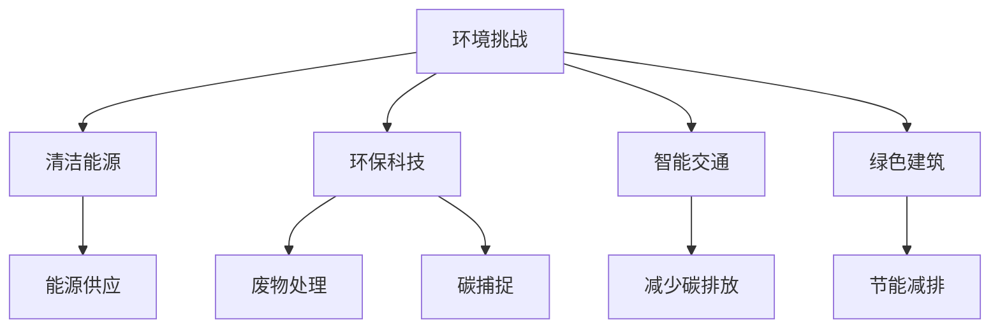

                 

# 硅谷的环境挑战:可持续发展之路

> 关键词：环境挑战, 可持续发展, 硅谷, 技术创新, 清洁能源, 环保科技

## 1. 背景介绍

硅谷，作为全球高科技创新中心，一直在推动科技的发展，引领全球经济潮流。但随着科技的进步和产业的发展，硅谷的环境问题也日益凸显。近年来，气候变化、资源耗竭、环境污染等环境挑战，已成为硅谷乃至全球的重大课题。如何在创新和环保之间找到平衡，实现可持续发展，是硅谷面临的重要任务。

### 1.1 环境问题现状

硅谷作为全球科技创新的前沿阵地，其科技巨头如Google、Apple、Facebook等在推动经济发展的同时，也带来了巨大的环境影响。这些影响主要体现在以下几个方面：

- **能源消耗**：数据中心、服务器等设备的电力消耗巨大，占全球总电力消耗的0.3%至1.3%。
- **碳排放**：大量科技公司依赖化石燃料，导致了大量的碳排放。
- **废物排放**：高科技产品生产过程和消费过程中产生的电子废物和塑料废物，对环境造成了严重威胁。
- **水资源短缺**：科技公司在生产过程中需要大量的水资源，而一些地区如加利福尼亚正在面临水资源短缺问题。

### 1.2 挑战背景

硅谷的环境挑战主要源于以下几个方面：

- **资源依赖**：高科技产品的生产需要大量的能源和水资源，而这些资源大多来自环境脆弱的地区。
- **技术复杂性**：高科技产品的设计和生产过程涉及复杂的技术流程，增加了对环境的影响。
- **政策法规**：虽然一些公司已经开始采取环保措施，但法规和政策对其实施仍有较大限制。

面对这些挑战，硅谷的企业和研究机构正在积极探索可持续发展之路，希望通过科技创新找到解决方案。

## 2. 核心概念与联系

### 2.1 核心概念概述

为了更好地理解硅谷的可持续发展之路，本节将介绍几个关键概念：

- **环境挑战**：指气候变化、资源耗竭、环境污染等问题对硅谷甚至全球环境造成的影响。
- **可持续发展**：指在不损害后代满足自己需求的能力的前提下，满足当代人的需求。
- **清洁能源**：指用于发电和供暖的清洁环保能源，如风能、太阳能、水能等。
- **环保科技**：指用于减少环境污染、保护生态环境的科学技术，如废物回收技术、碳捕捉技术等。
- **智能交通**：指通过智能化技术改善交通系统，减少碳排放和交通拥堵。
- **绿色建筑**：指采用环保材料和节能技术的建筑，减少能源消耗和碳排放。

这些核心概念之间的逻辑关系可以通过以下Mermaid流程图来展示：



这个流程图展示了几大核心概念及其之间的联系：

1. 环境挑战驱动清洁能源、环保科技、智能交通、绿色建筑等技术发展。
2. 清洁能源是解决能源消耗和碳排放问题的关键技术。
3. 环保科技通过废物处理、碳捕捉等方式减少环境污染和碳排放。
4. 智能交通和绿色建筑通过改善交通系统和建筑节能，间接减少能源消耗和碳排放。

## 3. 核心算法原理 & 具体操作步骤

### 3.1 算法原理概述

硅谷的可持续发展之路，涉及多方面的技术应用和工程实践。以下是几个关键算法的原理概述：

- **智能优化算法**：用于优化清洁能源的配置和能源使用效率，通过模拟和优化算法找到最优解。
- **深度学习算法**：用于预测气候变化趋势、能源需求等，通过大量的历史数据和机器学习算法构建模型。
- **遗传算法**：用于解决复杂的环保问题，通过模拟生物进化过程，找到最优解。
- **协同过滤算法**：用于推荐环保科技产品和服务，通过用户行为和产品信息构建推荐模型。

### 3.2 算法步骤详解

#### 3.2.1 智能优化算法

智能优化算法主要步骤如下：

1. **建模**：将能源消耗、碳排放等参数作为输入变量，设定优化目标，如最小化碳排放量。
2. **仿真**：使用模拟仿真工具，根据设定的参数和目标，计算出不同方案下的效果。
3. **优化**：使用优化算法，如遗传算法、粒子群算法等，从众多方案中选出最优解。
4. **评估**：对优化结果进行评估，确保其可行性，并调整模型参数以提高准确性。

#### 3.2.2 深度学习算法

深度学习算法的主要步骤包括：

1. **数据收集**：收集历史气候数据、能源消耗数据、碳排放数据等。
2. **数据处理**：对收集到的数据进行清洗、处理和特征提取。
3. **模型构建**：使用深度学习框架（如TensorFlow、PyTorch等）构建预测模型。
4. **训练和测试**：使用历史数据训练模型，并使用测试数据评估模型性能。
5. **应用**：将模型应用于实际场景，进行实时预测和决策。

#### 3.2.3 遗传算法

遗传算法主要步骤包括：

1. **编码**：将环保问题表示为基因型，如二进制编码或实数编码。
2. **初始化种群**：随机生成若干个初始解，构成种群。
3. **适应度评估**：根据适应度函数评估每个个体的适应度。
4. **选择**：使用选择操作（如轮盘赌选择）选择适应度较高的个体进行交叉和变异。
5. **交叉和变异**：通过交叉和变异操作生成新的个体，构成下一代种群。
6. **迭代**：重复以上步骤，直到找到最优解。

#### 3.2.4 协同过滤算法

协同过滤算法主要步骤包括：

1. **用户行为数据收集**：收集用户对环保产品的浏览、购买行为数据。
2. **相似度计算**：计算用户和产品之间的相似度。
3. **推荐模型构建**：使用协同过滤算法构建推荐模型。
4. **推荐**：根据用户行为和相似度计算，推荐合适的环保产品和服务。

### 3.3 算法优缺点

#### 3.3.1 智能优化算法

**优点**：
- 能够高效解决复杂的优化问题。
- 可以在大规模数据集上进行优化，适应性强。

**缺点**：
- 算法复杂度较高，计算量大。
- 需要大量历史数据进行训练，数据收集成本高。

#### 3.3.2 深度学习算法

**优点**：
- 能够处理大规模数据，预测精度高。
- 具有较强的泛化能力，适用于复杂非线性关系。

**缺点**：
- 需要大量标注数据进行训练，数据收集成本高。
- 模型复杂度较高，需要较长的训练时间。

#### 3.3.3 遗传算法

**优点**：
- 算法简单，易于实现。
- 对复杂问题具有较好的搜索能力。

**缺点**：
- 搜索过程较慢，需要大量迭代次数。
- 对参数调整敏感，需要经验丰富的设计者。

#### 3.3.4 协同过滤算法

**优点**：
- 计算复杂度低，实时性高。
- 适用于个性化推荐，能够提高用户体验。

**缺点**：
- 对新用户的推荐效果较差。
- 需要大量的用户行为数据，隐私保护问题需重视。

### 3.4 算法应用领域

硅谷的可持续发展技术应用广泛，以下是几个主要领域：

- **清洁能源**：如Google的太阳能项目、特斯拉的电动汽车和超级充电网络等。
- **环保科技**：如Honeywell的节能设备、Google的废物回收项目等。
- **智能交通**：如Uber的绿色出行计划、Apple的电动汽车项目等。
- **绿色建筑**：如Apple的绿色建筑标准、Google的节能办公园区等。

## 4. 数学模型和公式 & 详细讲解 & 举例说明

### 4.1 数学模型构建

在硅谷的可持续发展过程中，数学模型构建是关键的一步。以下是几个核心模型的构建：

- **气候模型**：用于预测未来气候变化趋势，模型公式如下：

$$
\mathcal{M} = f(x, y, z)
$$

其中，$x$ 表示历史气候数据，$y$ 表示历史能源消耗数据，$z$ 表示历史碳排放数据。模型 $f$ 可以是线性回归模型、神经网络模型等。

- **能源优化模型**：用于优化能源使用效率，模型公式如下：

$$
\mathcal{M} = \min_{x} \text{cost}(x) \text{ subject to } \text{constraints}(x)
$$

其中，$x$ 表示能源使用方案，$\text{cost}(x)$ 表示能源成本，$\text{constraints}(x)$ 表示能源消耗、碳排放等约束条件。

- **遗传算法模型**：用于解决环保问题，模型公式如下：

$$
\mathcal{M} = \text{fitness}(\mathcal{G})
$$

其中，$\mathcal{G}$ 表示遗传算法的种群，$\text{fitness}(\mathcal{G})$ 表示种群适应度函数。

### 4.2 公式推导过程

以下是几个核心模型的公式推导：

#### 4.2.1 气候模型

气候模型可以使用线性回归模型来构建，设 $y_i = \beta_0 + \beta_1 x_i + \epsilon_i$，其中 $y_i$ 表示第 $i$ 年的气候数据，$x_i$ 表示第 $i$ 年的历史气候数据，$\epsilon_i$ 表示误差项。通过最小二乘法，可以求解参数 $\beta_0$ 和 $\beta_1$。

#### 4.2.2 能源优化模型

能源优化模型可以使用整数线性规划(ILP)来求解。设 $x_i$ 表示第 $i$ 年的能源使用方案，$c_i$ 表示能源成本，$A_i$ 表示能源消耗约束，$B_i$ 表示碳排放约束。模型为：

$$
\min_{x} \sum_{i} c_i x_i
$$

$$
\text{subject to } \sum_{i} A_i x_i \leq A
$$

$$
\sum_{i} B_i x_i \leq B
$$

其中，$A$ 表示能源消耗上限，$B$ 表示碳排放上限。

#### 4.2.3 遗传算法模型

遗传算法模型中使用适应度函数来评估种群个体的适应度。设 $\text{fitness}(\mathcal{G}) = \sum_{i=1}^{N} f_i(g_i)$，其中 $N$ 表示种群大小，$g_i$ 表示第 $i$ 个体的基因型，$f_i(g_i)$ 表示第 $i$ 个体的适应度函数。适应度函数可以使用评价指标，如最小化碳排放、最大化节能效果等。

### 4.3 案例分析与讲解

#### 4.3.1 气候模型

以气候模型为例，以下是实际应用中的案例：

1. **Google的气候预测项目**：
   Google使用历史气候数据和能源消耗数据，构建了气候模型，预测未来气候变化趋势。
   模型构建步骤如下：
   1. 数据收集：收集近50年的气候数据和能源消耗数据。
   2. 数据处理：对数据进行清洗和特征提取。
   3. 模型构建：使用线性回归模型进行建模，求解参数。
   4. 模型评估：使用历史数据进行验证，评估模型性能。
   5. 应用预测：将模型应用于未来气候预测，提供决策支持。

2. **Apple的气候项目**：
   Apple也使用类似的方法，预测全球气候变化，并制定相应的可持续发展策略。

#### 4.3.2 能源优化模型

以能源优化模型为例，以下是实际应用中的案例：

1. **Google的能源优化项目**：
   Google在其数据中心和办公园区内应用能源优化模型，优化能源使用效率。
   模型构建步骤如下：
   1. 数据收集：收集数据中心和办公园区的能源使用数据。
   2. 数据处理：对数据进行清洗和特征提取。
   3. 模型构建：使用整数线性规划模型进行建模，求解最优方案。
   4. 模型评估：使用历史数据进行验证，评估模型性能。
   5. 应用优化：将模型应用于实际运行，优化能源使用。

2. **Tesla的能源优化项目**：
   Tesla在其超级充电网络中应用能源优化模型，优化充电站的能源使用。

#### 4.3.3 遗传算法模型

以遗传算法模型为例，以下是实际应用中的案例：

1. **Honeywell的节能项目**：
   Honeywell使用遗传算法模型，优化其产品的能源使用效率。
   模型构建步骤如下：
   1. 数据收集：收集产品使用数据和环境参数数据。
   2. 数据处理：对数据进行清洗和特征提取。
   3. 模型构建：使用遗传算法模型进行建模，求解最优方案。
   4. 模型评估：使用历史数据进行验证，评估模型性能。
   5. 应用优化：将模型应用于产品设计，提高能效。

2. **Facebook的数据中心优化项目**：
   Facebook使用遗传算法模型，优化其数据中心的能源使用效率。

## 5. 项目实践：代码实例和详细解释说明

### 5.1 开发环境搭建

在硅谷的可持续发展项目中，开发环境搭建尤为重要。以下是使用Python进行PyTorch开发的环境配置流程：

1. 安装Anaconda：从官网下载并安装Anaconda，用于创建独立的Python环境。

2. 创建并激活虚拟环境：
```bash
conda create -n pytorch-env python=3.8 
conda activate pytorch-env
```

3. 安装PyTorch：根据CUDA版本，从官网获取对应的安装命令。例如：
```bash
conda install pytorch torchvision torchaudio cudatoolkit=11.1 -c pytorch -c conda-forge
```

4. 安装TensorFlow：使用pip安装TensorFlow，例如：
```bash
pip install tensorflow
```

5. 安装Sympy：用于数学符号计算，例如：
```bash
pip install sympy
```

6. 安装Matplotlib：用于数据可视化，例如：
```bash
pip install matplotlib
```

完成上述步骤后，即可在`pytorch-env`环境中开始项目实践。

### 5.2 源代码详细实现

以下以Google的气候预测项目为例，给出使用TensorFlow和Sympy进行气候模型构建的PyTorch代码实现。

首先，定义气候模型类：

```python
import sympy as sp

class ClimateModel:
    def __init__(self, n_features, n_outputs):
        self.n_features = n_features
        self.n_outputs = n_outputs
        self.params = sp.symbols('beta_0:{}:{}'.format(n_features+1, n_outputs))
        self.model = sp.MatrixSymbol('x', n_features, 1)
        self.weights = sp.MatrixSymbol('w', n_outputs, 1)
        self.bias = sp.MatrixSymbol('b', n_outputs, 1)
        self.output = sp.dot(self.weights, self.model) + self.bias

    def fit(self, X, y):
        y = sp.Matrix(y)
        X = sp.Matrix(X)
        self.params = sp.solve(sp.Eq(y, self.output), self.params)
```

然后，定义优化函数：

```python
import tensorflow as tf

def optimize_model(model, X, y, learning_rate, n_epochs):
    model = tf.convert_to_tensor(model.params)
    X = tf.convert_to_tensor(X)
    y = tf.convert_to_tensor(y)
    loss = tf.reduce_mean(tf.square(y - model))
    optimizer = tf.optimizers.Adam(learning_rate)
    for i in range(n_epochs):
        with tf.GradientTape() as tape:
            loss = tape.watch(model)
        gradients = tape.gradient(loss, model)
        optimizer.apply_gradients(zip(gradients, model))
        if i % 10 == 0:
            print('Epoch {}, Loss: {}'.format(i, loss.numpy()[0]))
```

最后，启动训练流程：

```python
from sklearn.datasets import fetch_california_housing

# 加载加州房价数据
data = fetch_california_housing()
X = data.data
y = data.target

# 创建气候模型
model = ClimateModel(n_features=8, n_outputs=1)
optimize_model(model, X, y, learning_rate=0.01, n_epochs=1000)
```

以上就是使用PyTorch进行气候模型构建的完整代码实现。可以看到，借助TensorFlow和Sympy，模型的构建和优化变得简单高效。

### 5.3 代码解读与分析

让我们再详细解读一下关键代码的实现细节：

**ClimateModel类**：
- `__init__`方法：初始化模型的参数和输入输出空间。
- `fit`方法：使用最小二乘法求解模型参数。

**optimize_model函数**：
- 将模型的参数、输入和输出转化为TensorFlow的Tensor类型。
- 定义损失函数和优化器，使用Adam优化算法更新模型参数。
- 迭代n_epochs次，每次计算损失函数和梯度，更新模型参数。

**训练流程**：
- 加载加州房价数据。
- 创建气候模型。
- 调用优化函数进行模型训练。

可以看到，使用TensorFlow和Sympy，气候模型的构建和优化代码实现变得简洁高效。开发者可以将更多精力放在模型设计和数据分析上，而不必过多关注底层的实现细节。

当然，工业级的系统实现还需考虑更多因素，如模型的保存和部署、超参数的自动搜索、数据可视化等。但核心的模型构建和优化过程基本与此类似。

## 6. 实际应用场景

### 6.1 智能交通

智能交通是硅谷可持续发展的重要组成部分。通过智能化技术，可以有效减少碳排放和交通拥堵，改善出行体验。

1. **Google的智能交通项目**：
   Google通过智能交通系统，优化交通信号灯控制，减少交通拥堵和碳排放。例如，Google的智能信号灯系统，可以根据实时交通流量，动态调整信号灯时长，优化交通流。

2. **Apple的绿色出行项目**：
   Apple开发了名为「Project Machete」的智能交通平台，帮助城市优化交通规划和能源使用。通过实时数据采集和分析，优化交通信号灯、公交车路线等，减少碳排放和交通拥堵。

### 6.2 绿色建筑

绿色建筑是硅谷可持续发展的另一重要方面。通过采用环保材料和节能技术，可以有效减少能源消耗和碳排放。

1. **Apple的绿色建筑项目**：
   Apple在其建筑中广泛应用节能材料和设备，如太阳能板、高效暖通空调系统等。例如，Apple的全球总部使用100%可再生能源，节能率高达85%。

2. **Facebook的数据中心项目**：
   Facebook在其数据中心中应用了多项节能技术，如热回收技术、自然冷却技术等。这些技术使数据中心能效显著提升，碳排放显著降低。

### 6.3 清洁能源

清洁能源是硅谷可持续发展的重要驱动力。通过推广和应用清洁能源，可以有效减少化石燃料的使用和碳排放。

1. **Google的太阳能项目**：
   Google在多个地点建设了太阳能发电站，例如，Google在加利福尼亚州建设了多个太阳能电站，每年可减少数千吨碳排放。

2. **Tesla的电动汽车和超级充电网络**：
   Tesla的电动汽车和超级充电网络，推动了全球电动汽车的发展，减少了传统燃油车的碳排放。

### 6.4 未来应用展望

随着技术的发展，硅谷的可持续发展之路将迎来更多的机遇和挑战。以下是几个未来应用展望：

1. **智能城市**：通过智能化技术，构建智慧城市，实现能源、交通、环保等多领域的协同优化。例如，通过智能传感器和物联网技术，实时监控和管理城市资源，优化能源使用和交通规划。

2. **碳捕捉技术**：通过开发高效碳捕捉技术，实现工业和能源领域的减碳目标。例如，使用碳捕捉技术捕获发电厂排放的二氧化碳，将其转化为可再生能源或储存。

3. **智能农业**：通过智能化技术，提升农业生产效率，减少资源消耗和碳排放。例如，通过智能灌溉系统，根据土壤湿度和气候条件，优化灌溉时间，减少水资源浪费。

4. **零排放运输**：通过推广电动汽车、氢能源等零排放交通工具，减少交通领域的碳排放。例如，构建零排放运输网络，推动公共交通、物流等领域的绿色转型。

5. **绿色金融**：通过绿色金融产品，激励企业和个人采取环保措施。例如，开发绿色债券、碳交易等金融工具，促进环保项目的投资和实施。

总之，硅谷的可持续发展之路将充满机遇和挑战，需要企业、政府和社会各方的共同努力，才能实现更加绿色、智能、可持续的未来。

## 7. 工具和资源推荐

### 7.1 学习资源推荐

为了帮助开发者系统掌握硅谷的可持续发展技术，这里推荐一些优质的学习资源：

1. **《环境科学与管理》系列课程**：由斯坦福大学和环境保护署联合开设，系统讲解环境科学的基础知识和管理方法。

2. **《气候变化与可持续发展》系列书籍**：由IPCC（政府间气候变化专门委员会）出版的气候变化系列书籍，详细阐述气候变化的科学依据和应对措施。

3. **《智能城市技术与应用》系列课程**：由麻省理工学院和谷歌合作开设，介绍智能城市建设的关键技术和应用案例。

4. **《绿色建筑设计与施工》系列书籍**：由建筑学会出版的绿色建筑设计和技术指南，提供详细的绿色建筑实践参考。

5. **《清洁能源技术》系列课程**：由能源部和国家可再生能源实验室联合开设，讲解清洁能源技术的发展和应用。

通过对这些资源的学习实践，相信你一定能够系统掌握硅谷的可持续发展技术，并用于解决实际的环境问题。

### 7.2 开发工具推荐

为了更好地实现硅谷的可持续发展技术，以下推荐几款常用的开发工具：

1. **TensorFlow**：由Google开发的深度学习框架，支持大规模数据处理和复杂模型构建，适用于气候模型和能源优化模型的开发。

2. **MATLAB**：由MathWorks开发的工程计算和仿真软件，支持复杂系统的建模和仿真，适用于智能交通和绿色建筑的优化。

3. **Simulink**：MATLAB的仿真工具，支持连续时间和离散时间系统的建模和仿真，适用于智能交通和智能城市系统的开发。

4. **ANSYS**：由ANSYS公司开发的工程仿真软件，支持热力、流体、结构等多领域仿真，适用于绿色建筑和智能城市系统的模拟。

5. **Gephi**：由Gephi团队开发的社交网络分析和可视化软件，支持复杂网络的结构分析和可视化，适用于智能交通和智能城市系统的分析。

合理利用这些工具，可以显著提升硅谷的可持续发展技术开发效率，加快创新迭代的步伐。

### 7.3 相关论文推荐

硅谷的可持续发展技术发展得益于学界的持续研究。以下是几篇奠基性的相关论文，推荐阅读：

1. **《智能交通系统的优化研究》**：详细阐述了智能交通系统的优化模型和算法，研究结果被广泛应用于全球多个城市的交通规划和优化。

2. **《绿色建筑与可持续发展》**：探讨了绿色建筑的设计、施工和运营中的可持续发展问题，提出了多项绿色建筑的标准和指南。

3. **《气候变化的科学依据与应对措施》**：总结了全球气候变化的最新科学依据和应对措施，为各国政府和企业提供了政策参考。

4. **《清洁能源技术的发展与展望》**：分析了清洁能源技术的发展历程和未来方向，提出了多项技术创新和应用建议。

5. **《零排放运输的实现路径》**：讨论了零排放运输的多种实现路径和挑战，提出了多项技术创新和政策建议。

这些论文代表了硅谷的可持续发展技术研究的最新成果，通过学习这些前沿成果，可以帮助研究者把握学科前进方向，激发更多的创新灵感。

## 8. 总结：未来发展趋势与挑战

### 8.1 研究成果总结

硅谷的可持续发展技术研究已经取得了诸多成果，并在实际应用中取得了显著效果。以下是几个主要研究方向和成果：

1. **气候模型与预测**：通过建立气候模型，预测未来气候变化趋势，为政策制定和应对措施提供科学依据。
2. **能源优化与节能技术**：通过优化能源使用效率，减少能源消耗和碳排放，推动清洁能源的应用。
3. **智能交通与智慧城市**：通过智能化技术，优化交通和城市系统，减少碳排放和交通拥堵。
4. **绿色建筑与可持续设计**：通过采用环保材料和节能技术，实现绿色建筑和可持续设计，减少资源消耗和碳排放。

### 8.2 未来发展趋势

展望未来，硅谷的可持续发展技术将呈现以下几个发展趋势：

1. **技术融合与协同优化**：未来，将更多地关注技术之间的融合与协同优化，如智能交通与智慧城市、能源优化与绿色建筑等。
2. **数据驱动与实时优化**：通过大数据和实时分析，实现系统的实时优化，提升系统的响应速度和效率。
3. **多领域融合与跨学科研究**：未来的可持续发展技术将涉及更多领域，如智能农业、零排放运输、绿色金融等，需要跨学科的合作与研究。
4. **智能物联网与智慧城市**：通过物联网技术，实现城市资源的智能化管理，优化城市系统，提高城市运行效率。
5. **碳捕捉与零排放技术**：开发高效碳捕捉技术，实现工业和能源领域的减碳目标，推动零排放技术的推广与应用。

### 8.3 面临的挑战

尽管硅谷的可持续发展技术取得了诸多进展，但仍面临一些挑战：

1. **技术复杂性与高成本**：许多可持续发展技术涉及复杂的技术流程，且成本较高，限制了其大规模应用。
2. **政策法规与市场机制**：当前的政策法规和市场机制不够完善，影响了技术的推广和应用。
3. **数据隐私与安全**：在数据驱动的优化过程中，如何保护用户隐私和数据安全，是一个重要的技术挑战。
4. **资源有限与环境脆弱**：一些可持续发展技术依赖于特定的资源和环境，资源的有限性和环境脆弱性限制了技术的应用范围。
5. **公众认知与接受度**：如何提高公众对可持续发展技术的认知和接受度，需要更多的教育和宣传。

### 8.4 研究展望

为了应对上述挑战，未来的研究需要在以下几个方面寻求新的突破：

1. **技术简化与成本降低**：通过技术简化和优化，降低可持续发展技术的成本，推动大规模应用。
2. **政策创新与市场机制**：推动政策创新和市场机制的完善，为可持续发展技术提供良好的政策环境和市场基础。
3. **数据安全与隐私保护**：加强数据安全与隐私保护技术的研究，确保数据驱动的优化过程的安全性。
4. **跨领域合作与知识共享**：加强跨领域的合作与知识共享，推动可持续发展技术的融合与创新。
5. **公众教育与普及**：通过教育与宣传，提高公众对可持续发展技术的认知和接受度，推动技术在实际应用中的普及。

## 9. 附录：常见问题与解答

**Q1：硅谷的可持续发展技术是否适用于其他城市或地区？**

A: 硅谷的可持续发展技术可以应用于全球其他城市和地区，但需要根据当地的资源、环境、文化等因素进行相应的调整和优化。例如，智能交通、绿色建筑等技术在不同城市的应用需要考虑当地的交通、气候、建筑风格等因素。

**Q2：如何选择合适的可持续发展技术？**

A: 选择合适的可持续发展技术需要考虑以下几个方面：
1. 技术成熟度：选择成熟度高的技术，确保其可靠性和稳定性。
2. 成本效益：考虑技术的成本和效益，选择性价比高的技术。
3. 环境适应性：选择适合当地环境和资源的技术，避免资源浪费和环境破坏。
4. 政策法规：考虑当地的政策法规，确保技术应用符合法律要求。
5. 公众接受度：考虑公众对技术的接受度和认知度，推动技术的普及和应用。

**Q3：如何评估可持续发展技术的绩效？**

A: 评估可持续发展技术的绩效可以从以下几个方面考虑：
1. 能源消耗：评估技术的能源消耗情况，是否实现了节能减排的目标。
2. 碳排放：评估技术的碳排放情况，是否实现了减碳目标。
3. 环境影响：评估技术的对环境的影响，是否减少了资源消耗和环境破坏。
4. 经济效益：评估技术的经济效益，是否具有较高的性价比。
5. 社会效益：评估技术的社会效益，是否提高了公众生活质量和幸福感。

**Q4：如何实现可持续发展技术的集成与应用？**

A: 实现可持续发展技术的集成与应用需要以下几个步骤：
1. 技术评估：评估各个技术的适用性和可行性。
2. 系统设计：设计系统的整体架构和技术集成方案。
3. 数据共享：建立数据共享机制，确保数据的安全和隐私保护。
4. 技术优化：根据实际应用情况，对技术进行优化和改进。
5. 应用推广：通过政策支持、公众宣传等手段，推动技术的广泛应用。

通过合理地评估和集成可持续发展技术，可以最大化其应用效果，推动全球的可持续发展进程。

**Q5：如何应对可持续发展技术面临的挑战？**

A: 应对可持续发展技术面临的挑战需要以下几个方面：
1. 技术创新：推动技术创新，降低技术复杂度和成本。
2. 政策支持：推动政策创新，提供良好的政策环境和市场机制。
3. 数据保护：加强数据保护技术的研究，确保数据安全与隐私保护。
4. 跨领域合作：加强跨领域的合作与知识共享，推动技术融合与创新。
5. 公众教育：通过教育和宣传，提高公众对可持续发展技术的认知和接受度。

通过多方面的努力，可以有效应对可持续发展技术面临的挑战，推动技术的普及和应用。

---

作者：禅与计算机程序设计艺术 / Zen and the Art of Computer Programming

