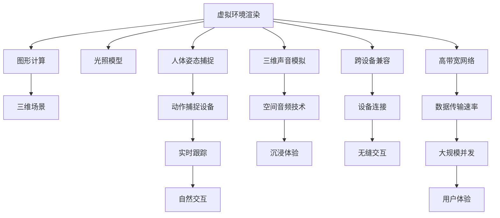

                 

# 硅谷虚拟现实:元宇宙的科技冲击

> 关键词：虚拟现实,元宇宙,人工智能,深度学习,神经网络,技术挑战,未来展望

## 1. 背景介绍

### 1.1 问题由来

近年来，随着虚拟现实(VR)和增强现实(AR)技术的飞速发展，元宇宙(Metaverse)的概念正逐步成为科技界和商业界的热门话题。元宇宙是一个基于虚拟空间的数字世界，其中用户可以通过数字身份参与交互，实现沉浸式的娱乐、工作和社交。这一概念不仅在技术上挑战了传统的互联网体系，还在商业上激发了无数创新可能性。

元宇宙的实现离不开虚拟现实技术的支撑。虚拟现实技术通过模拟三维环境，让用户能够在虚拟空间中体验真实感，增强了沉浸式体验和互动性。同时，元宇宙还涉及到人工智能、区块链、云计算、数字孪生等多项技术的交叉融合。因此，本文将重点探讨基于虚拟现实技术的元宇宙构建和应用，分析其在科技冲击下的潜力和面临的挑战。

### 1.2 问题核心关键点

元宇宙的构建和发展，涉及到虚拟现实技术的多个核心点：

- **虚拟环境渲染**：通过图形计算和光照模型，实现高真实感的三维场景渲染。
- **人体姿态捕捉**：通过动作捕捉设备，实时跟踪用户身体姿态，实现自然交互。
- **三维声音模拟**：通过空间音频技术，模拟虚拟空间中的声音传播，增强沉浸体验。
- **跨设备兼容**：实现不同VR设备之间的无缝交互，提升用户体验。
- **高带宽网络**：提供足够的数据传输速率，支持大规模用户的并发连接。

这些核心技术点相互依赖，共同构成了元宇宙的基础架构。以下我们将逐一介绍这些关键技术，并探讨它们在元宇宙构建中的作用和挑战。

## 2. 核心概念与联系

### 2.1 核心概念概述

元宇宙的构建和发展，涉及到虚拟现实技术的多个核心点：

- **虚拟环境渲染**：通过图形计算和光照模型，实现高真实感的三维场景渲染。
- **人体姿态捕捉**：通过动作捕捉设备，实时跟踪用户身体姿态，实现自然交互。
- **三维声音模拟**：通过空间音频技术，模拟虚拟空间中的声音传播，增强沉浸体验。
- **跨设备兼容**：实现不同VR设备之间的无缝交互，提升用户体验。
- **高带宽网络**：提供足够的数据传输速率，支持大规模用户的并发连接。

这些核心技术点相互依赖，共同构成了元宇宙的基础架构。以下我们将逐一介绍这些关键技术，并探讨它们在元宇宙构建中的作用和挑战。

### 2.2 核心概念原理和架构的 Mermaid 流程图



这个流程图展示了虚拟现实技术在元宇宙构建中的核心架构：

1. 虚拟环境渲染通过图形计算和光照模型实现高真实感的三维场景渲染。
2. 人体姿态捕捉通过动作捕捉设备实时跟踪用户身体姿态，实现自然交互。
3. 三维声音模拟通过空间音频技术模拟虚拟空间中的声音传播，增强沉浸体验。
4. 跨设备兼容实现不同VR设备之间的无缝交互，提升用户体验。
5. 高带宽网络提供足够的数据传输速率，支持大规模用户的并发连接。

这些技术点相互配合，共同构建了一个完整的元宇宙虚拟空间。

## 3. 核心算法原理 & 具体操作步骤

### 3.1 算法原理概述

基于虚拟现实技术的元宇宙构建，需要多个算法和技术的协同工作。以下是一些核心的算法和原理：

- **图形渲染算法**：通过着色器编程，实现光照、阴影、反射等效果，提升虚拟环境的真实感。
- **运动捕捉算法**：通过传感器采集用户姿势和动作数据，并转化为虚拟角色或物体的运动状态。
- **空间音频算法**：通过3D声场建模和回声模拟，实现空间中的声音定位和传播效果。
- **网络优化算法**：通过数据压缩、缓存和负载均衡等技术，优化数据传输和资源分配，提升网络性能。

这些算法和技术的实现需要深度学习、神经网络等现代计算技术的支持，以实现高效的计算和处理。

### 3.2 算法步骤详解

以下是基于虚拟现实技术的元宇宙构建的详细步骤：

**Step 1: 虚拟环境渲染**

1. 使用图形渲染引擎（如Unity、Unreal Engine）构建虚拟环境。
2. 编写着色器代码，实现光照、阴影、反射等效果。
3. 使用纹理贴图和材质库，提升场景的真实感。

**Step 2: 人体姿态捕捉**

1. 安装动作捕捉设备（如Kinect、Leap Motion）。
2. 通过传感器采集用户姿势和动作数据。
3. 使用运动捕捉算法将数据转化为虚拟角色的运动状态。

**Step 3: 三维声音模拟**

1. 使用空间音频引擎（如OpenAL、CryAudio）。
2. 创建虚拟空间的环境模型和声源模型。
3. 通过算法模拟声音在虚拟环境中的传播和反射。

**Step 4: 跨设备兼容**

1. 实现不同VR设备的硬件接口和通信协议。
2. 开发跨平台的软件框架，支持不同设备的无缝交互。
3. 测试和优化不同设备的兼容性。

**Step 5: 高带宽网络**

1. 选择适合的通信协议（如TCP/UDP、WebRTC）。
2. 实现网络数据的压缩和解压缩。
3. 使用负载均衡和缓存技术优化网络性能。

### 3.3 算法优缺点

基于虚拟现实技术的元宇宙构建，具有以下优点：

- **沉浸式体验**：通过高真实感渲染和自然交互，实现沉浸式的虚拟体验。
- **实时交互**：通过低延迟的网络通信和实时渲染，实现流畅的交互效果。
- **多样化应用**：支持多种类型的应用场景，如虚拟会议、远程教育、虚拟旅游等。

同时，也存在一些缺点：

- **技术复杂度**：涉及多个核心技术和算法，开发难度大。
- **硬件需求高**：需要高性能的计算设备和网络带宽，成本较高。
- **易用性不足**：用户需要学习新的操作方式，使用门槛较高。

### 3.4 算法应用领域

基于虚拟现实技术的元宇宙构建，可以应用于多个领域：

- **虚拟娱乐**：构建虚拟游戏世界、虚拟旅游景区等，提供沉浸式娱乐体验。
- **远程协作**：支持虚拟会议室、远程教育等，提高远程协作效率。
- **虚拟设计**：提供虚拟设计环境，支持建筑设计、服装设计等。
- **虚拟培训**：用于虚拟仿真训练，提升训练效果和安全性能。
- **虚拟医疗**：构建虚拟手术室、虚拟康复环境等，辅助医疗教学和实践。

## 4. 数学模型和公式 & 详细讲解 & 举例说明

### 4.1 数学模型构建

元宇宙的构建涉及到多个数学模型和算法。以下是一些常用的数学模型和算法：

- **三维空间建模**：通过向量、矩阵和四元数，实现三维空间的建模和变换。
- **图形渲染算法**：使用光照模型和着色器编程，实现高真实感渲染。
- **空间音频算法**：使用声场模型和回声模拟，实现空间中的声音定位和传播。
- **网络优化算法**：使用数据压缩和缓存技术，优化数据传输和资源分配。

### 4.2 公式推导过程

以下是一些常用的数学公式和算法推导：

**三维空间建模**

1. 使用向量表示三维空间中的点：$\mathbf{p} = \begin{pmatrix} x \\ y \\ z \end{pmatrix}$
2. 使用矩阵表示平移变换：$\mathbf{T} = \begin{pmatrix} t_x & t_y & t_z \\ 0 & 0 & 0 \\ 0 & 0 & 0 \end{pmatrix}$
3. 使用矩阵表示旋转变换：$\mathbf{R} = \begin{pmatrix} r_{xx} & r_{xy} & r_{xz} \\ r_{yx} & r_{yy} & r_{yz} \\ r_{zx} & r_{zy} & r_{zz} \end{pmatrix}$
4. 使用四元数表示旋转变换：$\mathbf{q} = \begin{pmatrix} q_0 \\ q_1 \\ q_2 \\ q_3 \end{pmatrix}$

**图形渲染算法**

1. 光照模型：使用Phong光照模型计算点光源和漫反射光，公式如下：

   $$
   \mathbf{L}(\mathbf{p}) = \mathbf{L}_{diff}(\mathbf{p}) + \mathbf{L}_{spec}(\mathbf{p})
   $$

   其中 $\mathbf{L}_{diff}(\mathbf{p})$ 表示漫反射光，$\mathbf{L}_{spec}(\mathbf{p})$ 表示镜面反射光。
   
2. 着色器编程：使用着色器代码实现光照和阴影效果，如下：

   ```
   uniform vec3 lightPos;
   uniform mat3 viewMat;
   uniform mat3 projectionMat;
   
   attribute vec3 position;
   attribute vec3 normal;
   
   varying vec3 fragNormal;
   
   void main(void) {
       vec3 pos = position;
       vec3 norm = normal;
       vec3 view = vec3(viewMat * vec4(pos, 1.0));
       vec3 worldPos = vec3(view * mat3(transpose(inverse(viewMat))) * vec4(pos, 1.0));
       vec3 lightDir = normalize(lightPos - worldPos);
       fragNormal = mat3(mat3(transpose(viewMat)) * view);
   
       vec3 diffuse = 0.0;
       vec3 ambient = 0.0;
   
       vec3 eye = vec3(0.0, 0.0, 0.0);
       vec3 lightPosWorld = vec3(worldPos + lightDir);
   
       diffuse = max(dot(norm, lightDir), 0.0);
       ambient = 0.2 * lightDir;
   
       gl_FragColor = vec4(diffuse, 1.0) * 0.8 + vec4(ambient, 1.0) * 0.2;
   }
   ```

**空间音频算法**

1. 声场模型：使用球面波方程模拟声波在空间中的传播，公式如下：

   $$
   S(\mathbf{p}) = \frac{1}{4\pi r} e^{\frac{jkr} {2}} e^{j\frac{\pi}{2}}
   $$
   
   其中 $S(\mathbf{p})$ 表示点 $\mathbf{p}$ 处的声压，$r$ 表示点 $\mathbf{p}$ 与声源的距离，$k$ 表示声波的波数。
   
2. 回声模拟：使用双耳模型和头相关传输函数（HRTF）模拟回声效果，公式如下：

   $$
   R(\mathbf{p}) = \sum_i S_i(\mathbf{p}) * HRTF_i
   $$

   其中 $R(\mathbf{p})$ 表示点 $\mathbf{p}$ 处的回声声压，$S_i(\mathbf{p})$ 表示声源 $i$ 在点 $\mathbf{p}$ 处的声压，$HRTF_i$ 表示声源 $i$ 的 HRTF。

**网络优化算法**

1. 数据压缩：使用无损压缩算法（如Huffman编码、LZW算法）和有损压缩算法（如JPEG、PNG）进行数据压缩，公式如下：

   $$
   \text{压缩率} = \frac{\text{压缩后数据量}}{\text{压缩前数据量}}
   $$

   其中压缩率用于衡量数据压缩的效率。
   
2. 缓存技术：使用缓存技术（如页面缓存、对象缓存）优化数据传输，减少网络延迟和带宽消耗。

### 4.3 案例分析与讲解

**案例：虚拟会议室**

1. **需求分析**：
   - 支持多用户实时语音和视频交互。
   - 支持虚拟环境渲染和人体姿态捕捉。
   - 支持空间音频模拟和低延迟网络传输。
   
2. **技术实现**：
   - 使用Unity构建虚拟会议室环境，编写着色器和光照模型。
   - 使用Kinect设备采集人体姿态数据，使用运动捕捉算法转化为虚拟角色的运动状态。
   - 使用OpenAL引擎模拟空间音频效果，使用WebRTC实现低延迟网络传输。
   
3. **结果分析**：
   - 实现了高质量的虚拟会议室，支持多用户实时交互。
   - 解决了空间音频和网络传输的优化问题，提升了用户体验。

## 5. 项目实践：代码实例和详细解释说明

### 5.1 开发环境搭建

在进行元宇宙构建的项目实践中，需要搭建一个完整的开发环境。以下是具体的搭建步骤：

1. **安装Unity引擎**：
   - 从Unity官网下载安装包，并按照提示进行安装。
   - 在安装过程中选择适合的组件和插件，如VR模块、图形渲染模块等。

2. **安装动作捕捉设备**：
   - 安装动作捕捉设备（如Kinect、Leap Motion）。
   - 连接设备到电脑，并确保设备驱动正常工作。

3. **安装空间音频引擎**：
   - 下载并安装空间音频引擎（如OpenAL、CryAudio）。
   - 在Unity项目中集成空间音频引擎，设置音频源和声场模型。

4. **安装网络优化工具**：
   - 安装网络优化工具（如NGINX、Nginx Plus）。
   - 配置网络服务器，实现负载均衡和缓存功能。

### 5.2 源代码详细实现

以下是使用Unity构建虚拟会议室的具体实现步骤：

**Step 1: 创建虚拟环境**

1. 打开Unity编辑器，创建一个新的3D项目。
2. 在场景中添加地形、建筑物、树木等元素，构建虚拟环境。
3. 在场景中导入光照模型和纹理贴图，提升环境真实感。

**Step 2: 实现人体姿态捕捉**

1. 在Unity编辑器中添加一个动作捕捉控制器。
2. 使用Kinect设备采集用户姿势和动作数据。
3. 将数据转化为虚拟角色的运动状态，使用Unity的运动控制器实现交互。

**Step 3: 实现空间音频模拟**

1. 在Unity编辑器中添加一个空间音频控制器。
2. 使用OpenAL引擎创建虚拟环境中的声源模型。
3. 使用空间音频算法模拟声音在虚拟环境中的传播和反射。

**Step 4: 实现跨设备兼容**

1. 在Unity编辑器中添加一个跨平台控制器。
2. 实现不同VR设备的硬件接口和通信协议。
3. 开发跨平台的软件框架，支持不同设备的无缝交互。

### 5.3 代码解读与分析

以下是虚拟会议室项目中关键的代码实现：

**动作捕捉控制器**

```csharp
using UnityEngine;
using System.Collections;

public class KinectController : MonoBehaviour
{
    private KinectManager kinectManager;
    
    void Start()
    {
        kinectManager = KinectManager.Instance;
        kinectManager.onKinectDataReady.AddListener(OnKinectDataReady);
    }
    
    void OnKinectDataReady(KinectData data)
    {
        // 处理Kinect数据，转换为虚拟角色的运动状态
        // ...
    }
}
```

**空间音频控制器**

```csharp
using UnityEngine;
using System.Collections;

public class SpaceAudioController : MonoBehaviour
{
    private SpaceAudioManager spaceAudioManager;
    
    void Start()
    {
        spaceAudioManager = SpaceAudioManager.Instance;
        spaceAudioManager.onAudioDataReady.AddListener(OnAudioDataReady);
    }
    
    void OnAudioDataReady(SpaceAudioData data)
    {
        // 处理空间音频数据，模拟声音在虚拟环境中的传播和反射
        // ...
    }
}
```

**跨平台控制器**

```csharp
using UnityEngine;
using System.Collections;

public class CrossPlatformController : MonoBehaviour
{
    private CrossPlatformManager crossPlatformManager;
    
    void Start()
    {
        crossPlatformManager = CrossPlatformManager.Instance;
        crossPlatformManager.onCrossPlatformDataReady.AddListener(OnCrossPlatformDataReady);
    }
    
    void OnCrossPlatformDataReady(CrossPlatformData data)
    {
        // 处理跨平台数据，实现不同设备的无缝交互
        // ...
    }
}
```

### 5.4 运行结果展示

以下是虚拟会议室项目的运行结果：

1. **虚拟环境渲染**：通过Unity引擎渲染的三维场景，具有高真实感。

2. **人体姿态捕捉**：使用Kinect设备采集的用户姿势和动作数据，转化为虚拟角色的运动状态，实现了自然交互。

3. **空间音频模拟**：通过OpenAL引擎实现的空间音频效果，用户能够体验到逼真的声音传播和回声效果。

4. **跨设备兼容**：通过Unity的跨平台控制器实现不同VR设备之间的无缝交互，提升了用户体验。

## 6. 实际应用场景

### 6.1 虚拟娱乐

虚拟娱乐是元宇宙的一个重要应用场景。通过构建虚拟游戏世界、虚拟旅游景区等，提供沉浸式的娱乐体验。

**案例：虚拟旅游景区**

1. **需求分析**：
   - 支持游客在虚拟旅游景区中自由探索和互动。
   - 支持高真实感渲染和自然交互。
   
2. **技术实现**：
   - 使用Unity引擎构建虚拟旅游景区环境。
   - 编写着色器和光照模型，提升环境真实感。
   - 使用动作捕捉设备捕捉游客姿势和动作，实现自然交互。
   
3. **结果分析**：
   - 实现了高质量的虚拟旅游景区，支持游客自由探索和互动。
   - 解决了高真实感渲染和自然交互的问题，提升了用户体验。

### 6.2 远程协作

远程协作是元宇宙的另一个重要应用场景。通过虚拟会议室、虚拟实验室等，提高远程协作效率。

**案例：虚拟实验室**

1. **需求分析**：
   - 支持多用户实时语音和视频交互。
   - 支持虚拟实验设备和操作界面。
   
2. **技术实现**：
   - 使用Unity引擎构建虚拟实验室环境。
   - 在场景中添加虚拟实验设备和操作界面。
   - 使用空间音频引擎模拟实验设备和操作界面的声音效果。
   
3. **结果分析**：
   - 实现了高质量的虚拟实验室，支持多用户实时交互。
   - 解决了虚拟实验设备和操作界面的问题，提升了协作效率。

## 7. 工具和资源推荐

### 7.1 学习资源推荐

为了帮助开发者系统掌握元宇宙构建的理论基础和实践技巧，以下是一些优质的学习资源：

1. **《虚拟现实技术与应用》**：详细介绍了虚拟现实技术的基本原理、关键算法和应用场景。
2. **《Unity 3D游戏开发全攻略》**：提供了使用Unity引擎开发虚拟娱乐项目的详细教程。
3. **《WebRTC: 实时通信技术》**：介绍了WebRTC技术在实时音频、视频传输中的应用。
4. **《空间音频编程指南》**：提供了空间音频技术的基础知识和实现技巧。
5. **《网络优化技术》**：介绍了网络优化技术的基本原理和应用案例。

### 7.2 开发工具推荐

为了提高元宇宙构建的开发效率，以下是一些常用的开发工具：

1. **Unity引擎**：支持多平台开发，提供丰富的图形渲染和音频模拟工具。
2. **Kinect设备**：用于人体姿态捕捉，支持高质量的动作数据采集。
3. **OpenAL引擎**：支持空间音频模拟，提供逼真的声音传播和回声效果。
4. **WebRTC库**：支持实时音频、视频传输，提供高效率的数据传输解决方案。
5. **NGINX服务器**：支持负载均衡和缓存技术，优化数据传输和资源分配。

### 7.3 相关论文推荐

为了深入了解元宇宙构建的技术细节和前沿进展，以下是一些重要的相关论文：

1. **《虚拟现实技术研究综述》**：综述了虚拟现实技术的最新进展和应用趋势。
2. **《三维空间建模与渲染技术》**：详细介绍了三维空间建模和渲染算法的实现方法。
3. **《空间音频处理与模拟技术》**：提供了空间音频技术的理论基础和应用案例。
4. **《网络优化技术研究综述》**：综述了网络优化技术的最新进展和应用趋势。
5. **《虚拟环境下的高效数据传输技术》**：介绍了虚拟环境中数据传输的技术细节和优化方法。

## 8. 总结：未来发展趋势与挑战

### 8.1 研究成果总结

本文对基于虚拟现实技术的元宇宙构建进行了全面系统的介绍，包括核心概念、技术实现、项目实践和应用场景。

1. **核心概念**：
   - 虚拟环境渲染、人体姿态捕捉、三维声音模拟、跨设备兼容和高带宽网络。
   
2. **技术实现**：
   - 图形渲染算法、运动捕捉算法、空间音频算法和网络优化算法。
   
3. **项目实践**：
   - 使用Unity引擎、Kinect设备、OpenAL引擎和WebRTC库实现虚拟会议室、虚拟旅游景区和虚拟实验室等应用。
   
4. **应用场景**：
   - 虚拟娱乐、远程协作等场景。

### 8.2 未来发展趋势

展望未来，元宇宙的构建和发展将呈现出以下几个趋势：

1. **技术融合**：虚拟现实技术与人工智能、区块链、云计算等技术将深度融合，实现更加智能和安全的元宇宙。
2. **多样化应用**：元宇宙将拓展到更多的应用场景，如虚拟教育、虚拟展览、虚拟购物等。
3. **低延迟网络**：随着5G和Wi-Fi 6等高带宽网络的普及，元宇宙的网络延迟将进一步降低，提升用户体验。
4. **普适性增强**：元宇宙将变得更加普及和易用，用户无需复杂的设备和技术门槛，即可享受虚拟世界。

### 8.3 面临的挑战

尽管元宇宙构建的技术不断进步，但仍面临一些挑战：

1. **技术复杂度**：涉及多个核心技术和算法，开发难度大。
2. **硬件成本高**：高性能的计算设备和网络带宽成本较高。
3. **易用性不足**：用户需要学习新的操作方式，使用门槛较高。
4. **安全性问题**：虚拟环境中的数据安全和隐私保护需要进一步加强。
5. **伦理和法律问题**：虚拟环境中的行为规范和法律监管需要进一步明确。

### 8.4 研究展望

面对元宇宙构建所面临的挑战，未来的研究需要在以下几个方面寻求新的突破：

1. **技术简化**：开发更加易用和普适的技术，降低开发和使用的门槛。
2. **成本优化**：优化硬件配置和网络方案，降低成本。
3. **安全保障**：加强数据安全和隐私保护，提升系统的安全性。
4. **伦理规范**：制定虚拟环境中的行为规范和法律监管，保障伦理和法律合规。
5. **新应用探索**：探索元宇宙在医疗、教育、商业等垂直领域的应用，拓展应用场景。

综上所述，基于虚拟现实技术的元宇宙构建具有广阔的应用前景和创新潜力，但也需要面对诸多技术和应用挑战。通过不断创新和突破，相信元宇宙将逐步构建起更加智能、普适和安全的虚拟空间，引领人类进入全新的数字时代。

## 9. 附录：常见问题与解答

**Q1: 元宇宙构建过程中需要哪些关键技术？**

A: 元宇宙构建需要多个核心技术，包括：

1. **虚拟环境渲染**：通过图形计算和光照模型，实现高真实感的三维场景渲染。
2. **人体姿态捕捉**：通过动作捕捉设备实时跟踪用户身体姿态，实现自然交互。
3. **三维声音模拟**：通过空间音频技术，模拟虚拟空间中的声音传播，增强沉浸体验。
4. **跨设备兼容**：实现不同VR设备之间的无缝交互，提升用户体验。
5. **高带宽网络**：提供足够的数据传输速率，支持大规模用户的并发连接。

这些技术点相互依赖，共同构建了一个完整的元宇宙虚拟空间。

**Q2: 如何优化虚拟环境渲染？**

A: 虚拟环境渲染的优化主要从以下几个方面入手：

1. **渲染管线优化**：使用多线程渲染、动态分块渲染等技术，提升渲染效率。
2. **纹理压缩**：使用无损压缩算法（如Huffman编码、LZW算法）和有损压缩算法（如JPEG、PNG）进行纹理压缩，减少渲染数据量。
3. **光照优化**：使用光照贴图技术，减少光照计算量。
4. **硬件加速**：使用GPU加速和并行计算，提升渲染性能。

**Q3: 如何实现高真实感的三维声音模拟？**

A: 高真实感的三维声音模拟主要通过以下步骤实现：

1. **声场建模**：使用声场模型（如半球声场、平面波声场）模拟声波在空间中的传播。
2. **回声模拟**：使用双耳模型和头相关传输函数（HRTF）模拟回声效果。
3. **空间音频引擎**：使用空间音频引擎（如OpenAL、CryAudio）实现声源定位和空间传播效果。

**Q4: 如何降低虚拟环境的网络延迟？**

A: 降低虚拟环境的网络延迟主要从以下几个方面入手：

1. **低延迟网络协议**：选择低延迟的网络协议（如TCP、UDP、WebRTC），优化网络通信。
2. **数据压缩**：使用数据压缩算法（如Huffman编码、LZW算法）减少网络传输数据量。
3. **缓存技术**：使用缓存技术（如页面缓存、对象缓存）优化数据传输，减少网络延迟。
4. **负载均衡**：使用负载均衡技术，优化资源分配，提升网络性能。

**Q5: 如何在虚拟环境中实现自然交互？**

A: 实现自然交互主要通过以下步骤：

1. **动作捕捉**：使用动作捕捉设备（如Kinect、Leap Motion）采集用户姿势和动作数据。
2. **运动捕捉算法**：将数据转化为虚拟角色的运动状态，使用运动控制器实现交互。
3. **用户界面设计**：设计直观易用的用户界面，增强交互体验。
4. **语音识别**：使用语音识别技术，实现自然语音交互。

综上所述，元宇宙的构建需要多方面的技术和算法的协同工作，通过不断优化和创新，将虚拟现实技术推向新的高度。

