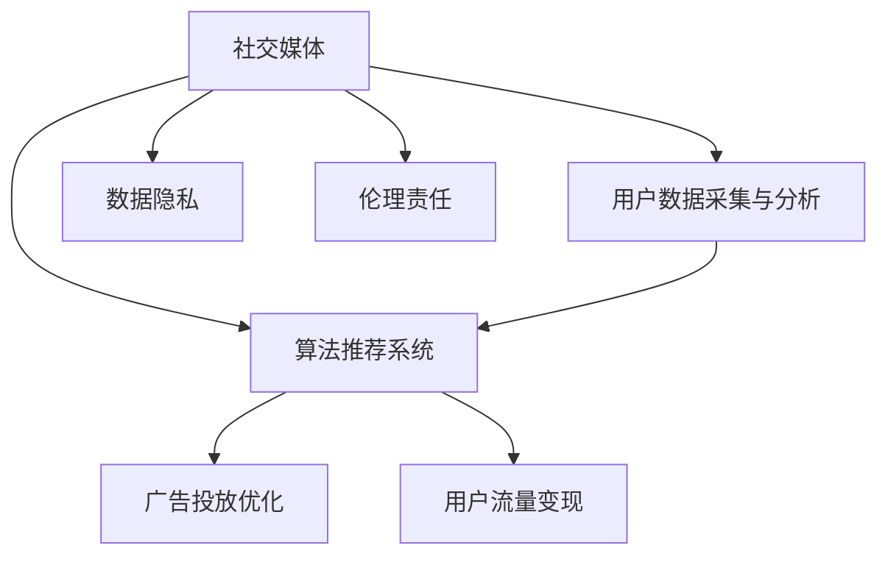

                 

# 社交媒体与注意力经济的崛起

> 关键词：社交媒体, 注意力经济, 用户参与, 广告收入, 算法推荐, 用户行为分析, 流量变现, 数据隐私, 道德责任

## 1. 背景介绍

### 1.1 问题由来
随着移动互联网的普及和智能手机的普及，社交媒体已成为用户获取信息、互动交流的主要渠道。以Facebook、Twitter、Instagram、YouTube等社交平台为代表，社交媒体在全球范围内拥有数十亿用户，构成了庞大的数字文化景观。这些平台不仅改变了人们的信息获取方式，还重塑了消费、娱乐、社交等行为模式。

与此同时，社交媒体平台通过大数据、机器学习和人工智能等先进技术，分析用户行为，优化用户体验，同时也积累了海量的用户数据。这些数据构成了社交媒体平台的竞争优势，成为其主要的资产和盈利来源。

社交媒体平台通过精准的广告投放、个性化的内容推荐等方式，不断提升用户参与度和留存率，最终实现了从用户注意力到商业价值的转化。在这一过程中，社交媒体逐渐形成了独特的注意力经济模式，成为全球互联网经济的重要组成部分。

### 1.2 问题核心关键点
社交媒体与注意力经济的核心在于如何最大化用户注意力价值。这一过程包括以下关键步骤：

1. **用户数据采集与分析**：通过用户行为数据、社交互动数据等，了解用户偏好、兴趣和行为模式。
2. **算法推荐系统**：根据用户数据，设计并优化算法推荐系统，实现个性化内容推荐，提升用户参与度。
3. **广告投放优化**：利用用户数据和算法推荐结果，实现精准广告投放，提升广告收入和转化率。
4. **用户流量变现**：通过会员订阅、付费内容、电商交易等方式，实现用户流量的直接变现和间接变现。
5. **数据隐私与伦理责任**：在数据采集和分析过程中，需确保用户隐私保护，遵守相关法律法规，并履行企业社会责任。

这些关键步骤共同构成了一个完整的社交媒体注意力经济体系，使得平台能够在用户注意力资源的基础上，实现商业价值的最大化。

## 2. 核心概念与联系

### 2.1 核心概念概述

为更好地理解社交媒体与注意力经济的原理和架构，本节将介绍几个密切相关的核心概念：

- **社交媒体(Social Media)**：指通过互联网实现用户互动交流的平台，包括Facebook、Twitter、Instagram、YouTube等。
- **注意力经济(Attention Economy)**：指利用用户注意力资源进行商业变现的经济模式，主要依赖于算法推荐、广告投放等技术手段。
- **用户参与(User Engagement)**：指用户与平台之间的互动行为，包括点赞、评论、分享、观看等，是社交媒体价值的核心。
- **算法推荐系统(Recommender System)**：指通过数据分析和机器学习算法，为用户提供个性化内容推荐的系统。
- **广告投放(Ad Placement)**：指在社交媒体平台上，根据用户特征和行为，精准投放广告以实现商业目标。
- **流量变现(Traffic Monetization)**：指通过用户流量进行商业变现，包括直接变现如广告收入、会员订阅费，间接变现如电商交易、数据分析服务等。
- **数据隐私(Data Privacy)**：指在数据采集和分析过程中，确保用户隐私得到保护，遵守相关法律法规。
- **伦理责任(Ethical Responsibility)**：指社交媒体平台在数据使用、用户隐私保护等方面，需履行社会责任，确保技术应用的道德合规性。

这些核心概念之间的逻辑关系可以通过以下Mermaid流程图来展示：



这个流程图展示了几大核心概念及其之间的关系：

1. 社交媒体平台通过用户数据采集与分析，获得用户信息。
2. 基于用户数据，设计并优化算法推荐系统，提升用户参与度。
3. 利用算法推荐结果，进行广告投放优化，实现精准投放。
4. 通过用户流量进行商业变现，包括直接和间接变现。
5. 在数据采集和分析过程中，确保用户隐私保护，遵守法律法规。
6. 履行企业社会责任，确保技术应用的道德合规性。

这些概念共同构成了社交媒体与注意力经济的框架，使得平台能够在用户注意力的基础上，实现商业价值的最大化。

## 3. 核心算法原理 & 具体操作步骤
### 3.1 算法原理概述

社交媒体与注意力经济的核心算法原理主要围绕算法推荐系统展开。通过分析用户行为数据，设计并优化推荐算法，提升用户参与度和广告投放效果，最终实现用户流量的商业变现。

推荐算法的核心在于理解用户行为和偏好，基于这些信息进行个性化内容推荐。常见的推荐算法包括协同过滤、基于内容的推荐、矩阵分解等。其中，基于协同过滤的推荐算法最为常用，通过分析用户的历史行为数据和物品属性信息，预测用户对未看过物品的兴趣程度。

### 3.2 算法步骤详解

基于协同过滤的推荐算法步骤如下：

1. **用户行为数据采集**：收集用户与物品的交互记录，如浏览、点击、购买等行为。
2. **用户-物品矩阵构建**：将用户行为数据转化为用户-物品矩阵，记录用户对不同物品的兴趣程度。
3. **矩阵分解**：将用户-物品矩阵分解为用户因子矩阵和物品因子矩阵，进行降维处理。
4. **相似度计算**：计算用户和物品之间的相似度，找出兴趣相似的用户和物品。
5. **推荐结果生成**：根据用户和物品的相似度，预测用户对未看过物品的兴趣程度，生成推荐结果。
6. **反馈与优化**：通过用户对推荐结果的反馈，不断调整推荐算法，优化推荐效果。

在实际应用中，还需要根据具体的社交媒体平台特点，对上述步骤进行优化和调整。例如，引入时间、位置、社交网络等信息，提升推荐结果的相关性和时效性。

### 3.3 算法优缺点

基于协同过滤的推荐算法具有以下优点：

1. **个性化高**：能够根据用户行为数据，提供个性化的内容推荐，提升用户参与度。
2. **可扩展性强**：算法原理相对简单，易于实现和扩展，适合大规模应用。
3. **可解释性强**：推荐结果可以根据用户行为数据进行解释，易于理解和调整。

同时，该算法也存在以下局限性：

1. **冷启动问题**：新用户或新物品的推荐效果较差，需要大量历史数据进行训练。
2. **数据稀疏性**：用户行为数据可能存在稀疏性，影响推荐效果。
3. **用户隐私风险**：需要收集和分析大量用户数据，存在隐私泄露风险。
4. **算法复杂度**：矩阵分解等步骤计算复杂度高，对硬件资源要求较高。

尽管存在这些局限性，基于协同过滤的推荐算法仍然在社交媒体平台的推荐系统中广泛应用，并不断改进和优化。

### 3.4 算法应用领域

基于协同过滤的推荐算法在社交媒体平台中的应用领域主要包括：

- **内容推荐**：为用户推荐新闻、文章、视频、图片等内容，提升用户参与度。
- **广告投放**：根据用户行为数据，精准投放广告，提升广告效果和转化率。
- **电商推荐**：为用户推荐商品，提升电商平台的销售转化率。
- **社交网络推荐**：为用户推荐好友、群组、话题等社交网络内容，增强用户互动和社交网络粘性。
- **视频推荐**：为用户推荐视频内容，提升平台用户留存率和观看时长。

这些应用领域涵盖了社交媒体平台的主要业务环节，通过算法推荐提升用户体验和平台收益。

## 4. 数学模型和公式 & 详细讲解  
### 4.1 数学模型构建

本节将使用数学语言对社交媒体与注意力经济的推荐算法进行更加严格的刻画。

设用户集合为 $U$，物品集合为 $I$，用户对物品的评分矩阵为 $\mathbf{R} \in \mathbb{R}^{n \times m}$，其中 $n$ 为用户数，$m$ 为物品数。矩阵 $\mathbf{R}$ 中的元素 $R_{ij}$ 表示用户 $i$ 对物品 $j$ 的评分。

推荐算法的目标是最大化用户 $i$ 对物品 $j$ 的预测评分 $\hat{R}_{ij}$ 与实际评分 $R_{ij}$ 的匹配度，通常使用均方误差(MSE)作为目标函数：

$$
\min_{\mathbf{P},\mathbf{Q}} \frac{1}{N} \sum_{i=1}^N \sum_{j=1}^M (R_{ij} - \hat{R}_{ij})^2
$$

其中 $\mathbf{P} \in \mathbb{R}^{n \times k}$ 和 $\mathbf{Q} \in \mathbb{R}^{k \times m}$ 分别为用户因子和物品因子矩阵，$k$ 为因子矩阵的维度。

### 4.2 公式推导过程

以下我们以矩阵分解算法为例，推导其数学公式及其优化过程。

首先，将用户-物品评分矩阵 $\mathbf{R}$ 分解为两个低秩矩阵 $\mathbf{P}$ 和 $\mathbf{Q}$：

$$
\mathbf{R} \approx \mathbf{PQ}
$$

其中 $\mathbf{P} \in \mathbb{R}^{n \times k}$ 和 $\mathbf{Q} \in \mathbb{R}^{k \times m}$。则推荐评分 $\hat{R}_{ij}$ 可以表示为：

$$
\hat{R}_{ij} = \mathbf{p}_i^T \mathbf{q}_j
$$

其中 $\mathbf{p}_i$ 和 $\mathbf{q}_j$ 分别为用户 $i$ 和物品 $j$ 的因子向量。

为了最小化均方误差，我们构造目标函数：

$$
\min_{\mathbf{P},\mathbf{Q}} \frac{1}{N} \sum_{i=1}^N \sum_{j=1}^M (R_{ij} - \mathbf{p}_i^T \mathbf{q}_j)^2
$$

引入正则化项，防止过拟合：

$$
\min_{\mathbf{P},\mathbf{Q}} \frac{1}{N} \sum_{i=1}^N \sum_{j=1}^M (R_{ij} - \mathbf{p}_i^T \mathbf{q}_j)^2 + \lambda (\|\mathbf{P}\|_F^2 + \|\mathbf{Q}\|_F^2)
$$

其中 $\|\cdot\|_F$ 为矩阵的 Frobenius 范数，$\lambda$ 为正则化系数。

使用梯度下降等优化算法求解上述目标函数，得到用户因子和物品因子矩阵 $\mathbf{P}$ 和 $\mathbf{Q}$：

$$
\mathbf{P} = \mathbf{R} \mathbf{Q}^T (\mathbf{Q} \mathbf{Q}^T + \lambda \mathbf{I})^{-1}
$$

$$
\mathbf{Q} = \mathbf{R}^T \mathbf{P}^T (\mathbf{P} \mathbf{P}^T + \lambda \mathbf{I})^{-1}
$$

其中 $\mathbf{I}$ 为单位矩阵。

在得到因子矩阵后，将 $\mathbf{P}$ 和 $\mathbf{Q}$ 代入推荐评分公式，即可得到用户 $i$ 对物品 $j$ 的预测评分：

$$
\hat{R}_{ij} = \mathbf{p}_i^T \mathbf{q}_j
$$

通过上述过程，社交媒体平台的推荐算法能够通过协同过滤，实现个性化内容推荐，提升用户参与度和广告效果。

## 5. 项目实践：代码实例和详细解释说明
### 5.1 开发环境搭建

在进行社交媒体推荐系统的开发前，我们需要准备好开发环境。以下是使用Python进行推荐系统开发的常见环境配置流程：

1. 安装Anaconda：从官网下载并安装Anaconda，用于创建独立的Python环境。

2. 创建并激活虚拟环境：
```bash
conda create -n recsys python=3.8 
conda activate recsys
```

3. 安装必要的依赖包：
```bash
pip install pandas numpy scipy scikit-learn scipy
```

4. 安装推荐系统相关的库：
```bash
pip install recsys
```

完成上述步骤后，即可在`recsys`环境中开始推荐系统的开发实践。

### 5.2 源代码详细实现

这里我们以协同过滤算法为例，给出一个使用Pandas库对社交媒体推荐系统进行开发的Python代码实现。

```python
import pandas as pd
import numpy as np
import scipy.sparse as sp
from scipy.sparse.linalg import svds
from recsys.utils.matrix import row_norms, col_norms

# 加载用户行为数据
df = pd.read_csv('user_item_ratings.csv', index_col='user_id')

# 构建用户-物品评分矩阵
R = df.pivot(index='user_id', columns='item_id', values='rating').fillna(0)
R = sp.coo_matrix(R)

# 进行矩阵分解
k = 20  # 因子矩阵维度
U, S, V = svds(R, k=k)

# 生成推荐评分矩阵
P = U.dot(V.T)
Q = V.dot(U.T)
R_pred = P.dot(Q)

# 输出推荐结果
user_id = 'user123'
item_id = 'item456'
rating = R_pred[user_id, item_id]
print(f'推荐结果：{rating:.2f}')
```

### 5.3 代码解读与分析

让我们再详细解读一下关键代码的实现细节：

**加载用户行为数据**：
- 使用Pandas库加载用户行为数据文件，用户ID、物品ID和评分分别为`user_id`、`item_id`和`rating`。
- 将数据转换为Pandas DataFrame，方便后续处理。

**构建用户-物品评分矩阵**：
- 使用`pivot`方法将数据从长宽格式转换为稀疏矩阵格式，记录用户对物品的评分。
- 使用`fillna(0)`将缺失值填充为0，便于后续处理。

**矩阵分解**：
- 使用Scipy库中的SVD方法对用户-物品评分矩阵进行降维处理，得到用户因子和物品因子矩阵。
- 参数`k`表示因子矩阵的维度，可以通过交叉验证等方法进行优化。

**生成推荐评分矩阵**：
- 根据用户因子和物品因子矩阵，计算推荐评分矩阵。
- 最终得到的推荐评分矩阵`R_pred`，可以用来预测用户对物品的评分。

**输出推荐结果**：
- 在实际应用中，可以根据推荐评分矩阵计算每个用户对每个物品的评分，并根据评分生成推荐结果。

通过上述代码实现，可以看出协同过滤算法的核心步骤包括数据加载、评分矩阵构建、矩阵分解和推荐评分矩阵生成。实际应用中，还需要结合具体业务场景，进行优化和调整。

## 6. 实际应用场景
### 6.1 社交媒体内容推荐

社交媒体平台通过内容推荐，提升用户参与度和留存率，进而实现流量变现。推荐算法通过分析用户行为数据，为用户推荐新闻、文章、视频、图片等内容，增强用户粘性。

具体实现上，可以使用协同过滤、基于内容的推荐等方法，结合用户兴趣、历史行为和社交网络等信息，生成个性化推荐结果。例如，Facebook使用基于协同过滤的推荐算法，为用户推荐新闻、文章和视频内容，提升用户参与度和留存率。

### 6.2 广告投放优化

社交媒体平台通过精准广告投放，实现商业变现。推荐算法通过分析用户行为数据，实现广告投放优化，提升广告效果和转化率。

具体实现上，可以使用协同过滤、基于内容的推荐等方法，结合用户兴趣、历史行为和社交网络等信息，生成广告投放策略。例如，Google AdWords通过协同过滤算法，分析用户行为数据，生成个性化广告推荐，提升广告效果和转化率。

### 6.3 电商推荐

电商平台通过个性化商品推荐，提升电商平台的销售转化率。推荐算法通过分析用户行为数据，为用户推荐商品，提升电商平台的销售转化率。

具体实现上，可以使用协同过滤、基于内容的推荐等方法，结合用户兴趣、历史行为和社交网络等信息，生成个性化商品推荐结果。例如，Amazon使用基于协同过滤的推荐算法，为用户推荐商品，提升电商平台的销售转化率。

### 6.4 未来应用展望

随着推荐算法的不断发展，社交媒体与注意力经济的应用场景将不断扩展，带来更多创新应用：

1. **智能推荐系统**：通过深度学习等先进技术，提升推荐系统的智能化和个性化程度，实现更精准的推荐结果。
2. **多模态推荐**：结合文本、图片、视频等多模态信息，提升推荐系统的全面性和多样性。
3. **实时推荐**：通过实时数据流处理技术，实现对用户行为的实时分析和推荐，提升推荐的时效性和相关性。
4. **跨平台推荐**：实现跨平台、跨设备的数据和推荐信息整合，提升用户在不同平台上的体验一致性。
5. **个性化内容创作**：结合用户兴趣和行为数据，生成个性化内容，提升用户参与度和粘性。

这些应用场景展示了推荐算法在社交媒体平台中的巨大潜力，未来将为平台带来更多的创新和收益。

## 7. 工具和资源推荐
### 7.1 学习资源推荐

为了帮助开发者系统掌握社交媒体与注意力经济的技术原理和实践技巧，这里推荐一些优质的学习资源：

1. 《推荐系统实践》系列博文：由推荐系统专家撰写，深入浅出地介绍了推荐系统的原理、算法和应用。
2 《深度学习与推荐系统》课程：斯坦福大学开设的推荐系统课程，有Lecture视频和配套作业，带你入门推荐系统领域的基本概念和经典模型。
3 《推荐系统设计与算法》书籍：推荐系统领域的经典著作，详细介绍了推荐系统的设计与算法，包括协同过滤、基于内容的推荐等。
4 《协同过滤推荐系统》书籍：深入介绍协同过滤推荐算法的原理和实现方法，适合进阶学习。
5 《推荐系统实战》书籍：实战型推荐系统教程，包含多个实际项目案例，适合动手实践。

通过对这些资源的学习实践，相信你一定能够快速掌握社交媒体推荐系统的精髓，并用于解决实际的推荐问题。

### 7.2 开发工具推荐

高效的开发离不开优秀的工具支持。以下是几款用于推荐系统开发的常用工具：

1. Python：推荐系统常用的编程语言，灵活便捷，生态丰富。
2. Pandas：数据分析和处理的重要工具，支持大规模数据集操作。
3. Scipy：科学计算和数据处理库，包含矩阵分解等算法实现。
4. TensorFlow：深度学习框架，支持高效神经网络模型训练和推理。
5. PyTorch：深度学习框架，支持动态图和静态图计算。
6. Elasticsearch：大数据搜索引擎，支持大规模数据实时处理和查询。
7. Apache Spark：大数据处理框架，支持大规模数据流处理和分析。

合理利用这些工具，可以显著提升推荐系统的开发效率，加快创新迭代的步伐。

### 7.3 相关论文推荐

社交媒体与注意力经济的发展源于学界的持续研究。以下是几篇奠基性的相关论文，推荐阅读：

1. "Collaborative Filtering for Implicit Feedback Datasets"（协同过滤算法）：提出了协同过滤算法的基本原理和实现方法，是推荐系统的经典之作。
2. "Personalized Top-N Recommendation using Matrix Factorization"（基于矩阵分解的推荐系统）：介绍了基于矩阵分解的推荐算法，适合深度学习领域推荐系统的入门学习。
3. "Adapting Visual Features to Textual Descriptions"（多模态推荐）：介绍了多模态推荐系统的原理和实现方法，适合多模态推荐系统的深入学习。
4. "Real-Time Recommendation Systems"（实时推荐系统）：介绍了实时推荐系统的原理和实现方法，适合实时推荐系统的实践学习。
5. "Recommendation Systems in Big Data"（大数据推荐系统）：介绍了大数据推荐系统的原理和实现方法，适合大规模推荐系统的学习。

这些论文代表了大数据推荐系统的研究脉络，通过学习这些前沿成果，可以帮助研究者把握推荐系统的进展方向，激发更多的创新灵感。

## 8. 总结：未来发展趋势与挑战

### 8.1 总结

本文对社交媒体与注意力经济的推荐算法进行了全面系统的介绍。首先阐述了社交媒体平台通过算法推荐实现流量变现的原理和核心步骤，明确了推荐算法在社交媒体经济中的重要地位。其次，从原理到实践，详细讲解了协同过滤算法的数学原理和实现细节，给出了推荐系统开发的完整代码实例。同时，本文还探讨了推荐算法在社交媒体平台中的应用场景和未来发展趋势，展示了推荐算法在社交媒体经济中的巨大潜力。最后，精选了推荐算法的学习资源、开发工具和相关论文，力求为读者提供全方位的技术指引。

通过本文的系统梳理，可以看到，社交媒体推荐算法通过算法推荐实现流量变现，成为社交媒体平台的主要盈利模式。这一过程涵盖了用户数据采集与分析、算法推荐系统设计、广告投放优化、流量变现等多个环节，构成了一个完整的社交媒体注意力经济体系。未来，伴随推荐算法的不断发展，社交媒体平台将在用户注意力资源的基础上，实现商业价值的最大化。

### 8.2 未来发展趋势

展望未来，社交媒体推荐算法将呈现以下几个发展趋势：

1. **深度学习与推荐系统融合**：深度学习技术将在推荐系统中广泛应用，提升推荐系统的智能化和个性化程度，实现更精准的推荐结果。
2. **多模态推荐**：结合文本、图片、视频等多模态信息，提升推荐系统的全面性和多样性，实现更丰富的推荐内容。
3. **实时推荐**：通过实时数据流处理技术，实现对用户行为的实时分析和推荐，提升推荐的时效性和相关性。
4. **跨平台推荐**：实现跨平台、跨设备的数据和推荐信息整合，提升用户在不同平台上的体验一致性。
5. **个性化内容创作**：结合用户兴趣和行为数据，生成个性化内容，提升用户参与度和粘性。

以上趋势展示了推荐算法在社交媒体平台中的巨大潜力，未来将为平台带来更多的创新和收益。

### 8.3 面临的挑战

尽管社交媒体推荐算法已经取得了瞩目成就，但在迈向更加智能化、普适化应用的过程中，它仍面临着诸多挑战：

1. **冷启动问题**：新用户或新物品的推荐效果较差，需要大量历史数据进行训练。
2. **数据稀疏性**：用户行为数据可能存在稀疏性，影响推荐效果。
3. **隐私保护**：在数据采集和分析过程中，需确保用户隐私得到保护，遵守相关法律法规。
4. **计算资源**：矩阵分解等步骤计算复杂度高，对硬件资源要求较高。
5. **算法鲁棒性**：推荐系统需具备良好的鲁棒性，避免因数据噪声或异常值影响推荐结果。

尽管存在这些挑战，社交媒体推荐算法仍然在不断优化和发展，通过多模态推荐、实时推荐等技术，提升推荐系统的性能和应用效果。

### 8.4 研究展望

面对社交媒体推荐算法所面临的种种挑战，未来的研究需要在以下几个方面寻求新的突破：

1. **无监督学习与推荐系统融合**：摆脱对大规模标注数据的依赖，利用自监督学习、主动学习等无监督学习范式，最大限度利用非结构化数据，实现更加灵活高效的推荐系统。
2. **跨领域推荐系统**：结合不同领域的用户行为数据，提升推荐系统的跨领域迁移能力，实现跨领域的推荐效果。
3. **推荐系统模型压缩**：通过模型压缩、稀疏化存储等技术，降低推荐系统的计算资源消耗，实现更加轻量级、实时性的部署。
4. **推荐系统的可解释性**：研究推荐系统的可解释性，让用户能够理解推荐结果的生成机制，增强用户信任和满意度。
5. **推荐系统的道德合规性**：研究推荐系统的道德合规性，确保技术应用符合伦理标准和社会价值观，避免偏见和歧视。

这些研究方向将引领社交媒体推荐系统向更高的台阶发展，为平台带来更全面、更智能的推荐效果，提升用户体验和平台收益。

## 9. 附录：常见问题与解答

**Q1：推荐系统的冷启动问题如何解决？**

A: 推荐系统的冷启动问题是指新用户或新物品的推荐效果较差，可以通过以下方法解决：
1. 利用用户反馈数据：在用户注册时，收集用户的兴趣偏好，结合物品属性信息，生成推荐结果。
2. 利用热门物品推荐：对于新物品，可以选择热门物品进行推荐，提升用户满意度。
3. 利用协同过滤算法：结合历史用户的行为数据，预测新用户对新物品的兴趣，生成推荐结果。

**Q2：推荐系统的数据稀疏性问题如何解决？**

A: 推荐系统的数据稀疏性问题是指用户行为数据可能存在缺失值，可以通过以下方法解决：
1. 利用矩阵补全技术：通过矩阵补全算法，填补用户行为数据中的缺失值。
2. 利用协同过滤算法：结合用户的行为数据，预测用户对未看过物品的兴趣，生成推荐结果。
3. 利用混合推荐算法：结合协同过滤、基于内容的推荐等方法，提升推荐系统的鲁棒性和准确性。

**Q3：推荐系统的计算资源消耗过高，如何优化？**

A: 推荐系统的计算资源消耗过高，可以通过以下方法进行优化：
1. 采用模型压缩技术：通过剪枝、量化、低秩分解等技术，压缩推荐模型的参数量，降低计算资源消耗。
2. 采用分布式计算技术：通过分布式计算框架，实现大规模数据的高效处理和分析。
3. 采用高效算法：选择合适的算法，如近似矩阵分解算法、增量学习算法等，降低计算资源消耗。

**Q4：推荐系统的可解释性不足，如何改进？**

A: 推荐系统的可解释性不足，可以通过以下方法改进：
1. 利用解释性算法：使用解释性较强的推荐算法，如协同过滤、基于内容的推荐等，提升推荐系统的可解释性。
2. 结合用户反馈数据：通过用户反馈数据，解释推荐结果的生成机制，提升用户理解度。
3. 利用可视化技术：利用可视化工具，展示推荐系统的内部工作机制和推荐过程，增强用户信任和满意度。

这些问题的解答，展示了推荐算法在实际应用中需要考虑的关键问题，并提出了相应的解决策略。通过不断优化和改进，推荐算法将在社交媒体平台中发挥更大的作用，提升用户体验和平台收益。

---

作者：禅与计算机程序设计艺术 / Zen and the Art of Computer Programming

