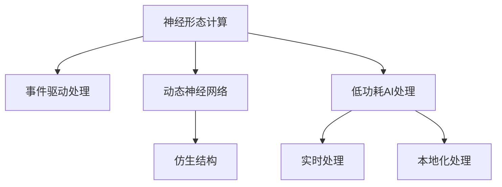

                 

# 神经形态计算在边缘设备中的应用：低功耗AI处理

> 关键词：神经形态计算,边缘设备,低功耗AI处理,事件驱动处理,动态神经网络

## 1. 背景介绍

### 1.1 问题由来
随着人工智能技术的快速发展，特别是在自然语言处理、计算机视觉等领域的突破，AI的应用场景不断扩大，数据量和计算复杂度也急剧增加。然而，当前的AI计算模式主要依赖于集中式的大型数据中心，存在能耗高、延迟大、带宽压力大等问题。这些问题不仅增加了AI系统的部署和维护成本，而且限制了AI在移动设备、物联网等边缘设备上的广泛应用。

为解决这些问题，研究人员和工程师们提出了基于神经形态计算（Neuromorphic Computing）的新型AI计算模式，旨在通过模拟人类大脑的神经元结构，实现低功耗、高效率的AI处理。神经形态计算通过模仿生物神经元的电信号传递机制，实现了事件驱动的计算方式，能够以极低的能耗和快速的响应速度处理复杂的AI任务，非常适合在边缘设备上应用。

### 1.2 问题核心关键点
神经形态计算的核心在于通过模拟大脑神经元的结构和功能，实现低功耗、高效率的AI计算。其关键技术包括：
- **事件驱动处理**：通过事件驱动的方式，神经元之间通过电信号的传播进行通信，避免了传统计算模式下的数据传输和存储，极大降低了能耗。
- **动态神经网络**：神经网络中神经元的状态和连接结构可以动态调整，适应不同的任务和数据特征。
- **仿生结构**：模仿大脑中神经元之间的连接方式，实现高密度、高并行的计算结构。

神经形态计算在边缘设备上的应用主要包括以下几个方面：
- **低功耗AI处理**：通过事件驱动和动态神经网络，在边缘设备上实现低功耗、高效率的AI处理，适合移动设备、物联网等资源有限的场景。
- **实时处理**：事件驱动的计算模式能够快速响应用户指令和数据，实现实时处理和交互。
- **本地化处理**：数据和计算在边缘设备上本地化，减少了数据传输和带宽压力，提高了系统的安全性和可靠性。

## 2. 核心概念与联系

### 2.1 核心概念概述

为更好地理解神经形态计算在边缘设备上的应用，本节将介绍几个密切相关的核心概念：

- **神经形态计算**：一种通过模拟大脑神经元结构和功能的计算方式，实现低功耗、高效率的AI计算。
- **事件驱动处理**：一种基于电信号传播的计算方式，避免了传统计算模式下的数据传输和存储，极大降低了能耗。
- **动态神经网络**：神经网络中神经元的状态和连接结构可以动态调整，适应不同的任务和数据特征。
- **仿生结构**：模仿大脑中神经元之间的连接方式，实现高密度、高并行的计算结构。

这些核心概念之间的逻辑关系可以通过以下Mermaid流程图来展示：



这个流程图展示了几大核心概念及其之间的关系：

1. 神经形态计算通过事件驱动处理和动态神经网络，实现了低功耗和高效率的AI计算。
2. 事件驱动处理和动态神经网络为神经形态计算提供了技术支撑。
3. 仿生结构是神经形态计算的基础，通过高密度、高并行的计算结构实现了高性能的计算。
4. 低功耗AI处理、实时处理和本地化处理，是神经形态计算在边缘设备上的应用场景。

## 3. 核心算法原理 & 具体操作步骤
### 3.1 算法原理概述

神经形态计算在边缘设备上的应用，主要基于事件驱动处理和动态神经网络。其核心思想是通过模仿人类大脑的神经元结构和功能，实现低功耗、高效率的AI计算。

事件驱动处理是指在计算过程中，神经元通过电信号的传播进行通信，避免了传统计算模式下的数据传输和存储。动态神经网络则是指在神经网络中，神经元的状态和连接结构可以动态调整，以适应不同的任务和数据特征。

### 3.2 算法步骤详解

神经形态计算在边缘设备上的应用，一般包括以下几个关键步骤：

**Step 1: 准备神经形态计算硬件**
- 选择合适的神经形态计算芯片或硬件平台，如Loihi、Zynq等。
- 在硬件平台上设计适当的神经网络结构，包括输入层、隐藏层、输出层等。

**Step 2: 设计事件驱动计算模型**
- 在神经网络中，使用事件驱动的计算方式，将传统的数据传输和存储转换为电信号的传播。
- 设计合适的神经元模型，如Spike-based Neuron、DDN等，实现神经元之间的通信。
- 定义事件驱动的激活函数和损失函数，指导神经元的状态和输出。

**Step 3: 实现动态神经网络**
- 在神经网络中，设计动态的连接方式，如可变突触强度、动态神经元添加/删除等，实现连接结构的自适应调整。
- 在训练过程中，动态调整神经元状态和连接结构，提高模型对数据的适应性。

**Step 4: 训练神经网络**
- 在准备好的神经形态计算硬件上，使用特定的训练算法，如BP、SGD等，训练神经网络。
- 在训练过程中，动态调整神经元状态和连接结构，优化模型性能。

**Step 5: 部署和优化**
- 将训练好的神经网络部署到边缘设备上，进行实时处理。
- 根据设备性能和任务需求，优化神经网络的参数和结构，提升计算效率。

### 3.3 算法优缺点

神经形态计算在边缘设备上的应用，具有以下优点：
1. 低功耗：通过事件驱动处理和动态神经网络，实现了低功耗、高效率的AI计算。
2. 实时处理：事件驱动的计算模式能够快速响应用户指令和数据，实现实时处理和交互。
3. 本地化处理：数据和计算在边缘设备上本地化，减少了数据传输和带宽压力，提高了系统的安全性和可靠性。

同时，该方法也存在一定的局限性：
1. 硬件复杂度：神经形态计算的硬件平台和设计复杂，需要专业知识和资源投入。
2. 算法复杂度：事件驱动计算和动态神经网络需要特殊的算法支持，增加了开发难度。
3. 训练难度：神经网络在训练过程中需要进行动态调整，增加了训练难度。

尽管存在这些局限性，但就目前而言，神经形态计算在边缘设备上的应用已经展现出巨大的潜力，成为AI计算的重要方向之一。未来相关研究的重点在于如何进一步降低硬件复杂度和训练难度，提高神经网络的可扩展性和适应性。

### 3.4 算法应用领域

神经形态计算在边缘设备上的应用，主要涵盖以下几个领域：

- **移动设备**：如智能手机、可穿戴设备等。通过低功耗AI处理，实现实时语音识别、图像识别等任务。
- **物联网**：如智能家居、智能城市等。通过实时处理和本地化处理，实现环境监测、安全监控等任务。
- **无人系统**：如无人机、无人车等。通过低功耗和实时处理，实现自主导航、避障等任务。
- **边缘计算**：如边缘服务器、数据中心等。通过本地化处理和动态神经网络，实现高效的数据处理和分析。

## 4. 数学模型和公式 & 详细讲解  
### 4.1 数学模型构建

本节将使用数学语言对神经形态计算在边缘设备上的应用过程进行更加严格的刻画。

记神经网络为 $N=(V,E)$，其中 $V$ 为神经元集合，$E$ 为连接集合。假设输入为 $x$，输出为 $y$。定义事件驱动计算模型中的神经元状态和连接结构为动态的，即 $x$ 和 $y$ 为动态变量。

在神经网络中，定义事件驱动的激活函数为 $\sigma$，损失函数为 $L$。则神经网络的事件驱动计算过程可表示为：

$$
y = \sigma(Wx + b)
$$

其中 $W$ 为权重矩阵，$b$ 为偏置向量。通过反向传播算法，计算损失函数的梯度，进行参数更新。

### 4.2 公式推导过程

以下是事件驱动计算模型和动态神经网络的一些关键公式推导。

**事件驱动的激活函数**：
$$
y = \sigma(Wx + b) = \frac{1}{1 + e^{-Wx - b}}
$$

**动态神经网络**：
- **可变突触强度**：定义突触强度为 $w_{ij} \in [0,1]$，在训练过程中根据梯度调整。
- **动态神经元添加/删除**：根据任务需求动态添加/删除神经元，更新连接结构。

**反向传播算法**：
在神经网络中，定义事件驱动的激活函数为 $\sigma$，损失函数为 $L$。则神经网络的事件驱动计算过程可表示为：

$$
y = \sigma(Wx + b)
$$

反向传播算法通过链式法则，计算损失函数的梯度：

$$
\frac{\partial L}{\partial W} = \frac{\partial L}{\partial y} \cdot \frac{\partial y}{\partial W} = \frac{\partial L}{\partial y} \cdot (1 - y) \cdot \frac{\partial \sigma}{\partial x} \cdot W
$$

其中 $\frac{\partial \sigma}{\partial x}$ 为激活函数的导数。

### 4.3 案例分析与讲解

以一个简单的手写数字识别任务为例，展示神经形态计算在边缘设备上的应用。

假设使用一个具有两个输入神经元、两个隐藏神经元、两个输出神经元的神经网络。定义事件驱动的激活函数为 Sigmoid，损失函数为交叉熵损失函数。训练数据集包含 1000 个手写数字图片和对应的标签。

在训练过程中，神经元的状态和连接结构可以动态调整，以适应不同的任务和数据特征。以手写数字识别任务为例，神经网络在训练过程中，根据梯度动态调整权重和偏置，优化模型性能。

## 5. 项目实践：代码实例和详细解释说明
### 5.1 开发环境搭建

在进行神经形态计算项目实践前，我们需要准备好开发环境。以下是使用Python和PyTorch搭建神经形态计算环境的流程：

1. 安装Python：确保Python版本为 3.6 或以上。
2. 安装PyTorch：使用以下命令安装PyTorch，建议安装最新版本。
   ```
   pip install torch torchvision torchaudio
   ```
3. 安装相关的硬件驱动和库：确保神经形态计算硬件已经安装，并准备好相关的驱动和库。

完成上述步骤后，即可在准备好硬件平台上进行神经形态计算的开发。

### 5.2 源代码详细实现

下面我们以一个简单的手写数字识别任务为例，给出使用PyTorch和事件驱动计算模型对神经网络进行训练的代码实现。

```python
import torch
import torch.nn as nn
import torch.nn.functional as F

class NeuralNetwork(nn.Module):
    def __init__(self):
        super(NeuralNetwork, self).__init__()
        self.fc1 = nn.Linear(784, 256)
        self.fc2 = nn.Linear(256, 128)
        self.fc3 = nn.Linear(128, 10)
    
    def forward(self, x):
        x = x.view(-1, 784)
        x = F.relu(self.fc1(x))
        x = F.relu(self.fc2(x))
        x = F.softmax(self.fc3(x), dim=1)
        return x

# 定义事件驱动的激活函数
class Sigmoid(nn.Module):
    def forward(self, x):
        return 1 / (1 + torch.exp(-x))

# 定义神经网络模型
model = NeuralNetwork()
model = Sigmoid(model)

# 定义损失函数和优化器
criterion = nn.CrossEntropyLoss()
optimizer = torch.optim.Adam(model.parameters(), lr=0.001)

# 训练过程
for epoch in range(10):
    running_loss = 0.0
    for i, data in enumerate(trainloader, 0):
        inputs, labels = data
        optimizer.zero_grad()
        outputs = model(inputs)
        loss = criterion(outputs, labels)
        loss.backward()
        optimizer.step()
        running_loss += loss.item()
    print('Epoch [%d/%d], Loss: %.4f' % (epoch + 1, 10, running_loss / len(trainloader)))
```

### 5.3 代码解读与分析

让我们再详细解读一下关键代码的实现细节：

**NeuralNetwork类**：
- `__init__`方法：初始化神经网络的结构，定义了三个全连接层。
- `forward`方法：定义了神经网络的前向传播过程。

**Sigmoid类**：
- `forward`方法：定义了事件驱动的激活函数，通过PyTorch的激活函数实现。

**训练过程**：
- 定义损失函数和优化器。
- 通过循环迭代，对每个样本进行前向传播和反向传播，更新模型参数。
- 在每个epoch结束后，输出训练损失。

可以看到，使用PyTorch进行神经形态计算的开发，可以通过简单的代码实现事件驱动计算模型的训练和优化。开发者可以更加专注于算法和模型的设计，而不必过多关注底层的实现细节。

## 6. 实际应用场景
### 6.1 边缘设备上的实时处理

神经形态计算在边缘设备上的实时处理能力，能够有效解决传统计算模式下的延迟和带宽问题，实现高效的实时处理。

以智能家居系统为例，神经形态计算可以用于实时处理环境监测数据，实现环境温度、湿度、气体等参数的实时监测和反馈。通过低功耗AI处理，系统能够在移动设备或边缘设备上快速响应用户指令，提供智能化的家居控制和信息推荐。

### 6.2 低功耗环境下的本地化处理

神经形态计算的低功耗特性，使其非常适合在资源有限的边缘设备上应用。通过本地化处理，可以减少数据传输和带宽压力，提高系统的可靠性和安全性。

以无人驾驶系统为例，神经形态计算可以用于实时处理传感器数据，实现车辆定位、避障、路径规划等任务。通过本地化处理，系统能够在车载设备上快速响应用户指令和传感器数据，实现实时导航和决策。

### 6.3 动态神经网络的应用

神经形态计算的动态神经网络，能够根据不同的任务和数据特征，动态调整神经元状态和连接结构，提高模型的适应性。

以医疗影像诊断为例，神经形态计算可以用于实时处理医学影像数据，实现自动化的疾病诊断和预测。通过动态神经网络，系统可以根据不同的疾病类型和影像特征，动态调整神经元状态和连接结构，提高诊断的准确性和效率。

## 7. 工具和资源推荐
### 7.1 学习资源推荐

为了帮助开发者系统掌握神经形态计算的理论基础和实践技巧，这里推荐一些优质的学习资源：

1. **Loihi官方文档**：Loihi是Neuromorphic Computing领域的重要硬件平台，官方文档提供了详细的硬件介绍和编程指南，适合深入学习。
2. **Neuromorphic Computing教程**：Coursera和edX等在线平台提供了丰富的Neuromorphic Computing课程，涵盖理论基础和实际应用。
3. **Loihi开发者社区**：Loihi官方社区提供了丰富的开发资源和支持，适合初学者和高级开发者。
4. **Neural Network和Event-Driven Computing的书籍**：如《Neural Networks and Deep Learning》、《Event-Driven Computing》等书籍，提供了深入的理论和实践指导。
5. **PyTorch官方文档**：PyTorch提供了丰富的深度学习库，包括神经形态计算的相关工具，适合开发者学习和实践。

通过对这些资源的学习实践，相信你一定能够快速掌握神经形态计算的精髓，并用于解决实际的AI问题。

### 7.2 开发工具推荐

高效的开发离不开优秀的工具支持。以下是几款用于神经形态计算开发的常用工具：

1. **PyTorch**：基于Python的开源深度学习框架，适合进行神经形态计算的开发。
2. **TensorFlow**：由Google主导开发的开源深度学习框架，生产部署方便，适合大规模工程应用。
3. **Nengo**：一款专为神经形态计算设计的软件，支持设计、仿真和开发神经网络。
4. **Synaptic**：一款支持神经形态计算硬件的编程环境，提供了丰富的工具和资源。
5. **NeuroPy**：一款基于Python的神经网络库，支持神经形态计算和其他神经网络模型的开发。

合理利用这些工具，可以显著提升神经形态计算的开发效率，加快创新迭代的步伐。

### 7.3 相关论文推荐

神经形态计算和神经网络的研究源于学界的持续研究。以下是几篇奠基性的相关论文，推荐阅读：

1. **Event-Based Neural Networks for Inference and Learning**：提出了基于事件驱动的神经网络模型，展示了其在实时处理和低功耗计算方面的优势。
2. **Loihi: A Brain-Inspired Neuromorphic Computing System**：介绍了一种基于事件驱动的神经形态计算系统Loihi，展示了其在低功耗和高效计算方面的性能。
3. **Spike-Based Neural Networks for Learning**：提出了一种基于脉冲的事件驱动神经网络模型，展示了其在低功耗和实时处理方面的性能。
4. **Dynabrain: A Hardware-Based Dynamic Neural Network**：介绍了一种基于动态神经网络的神经形态计算系统Dynabrain，展示了其在自适应和动态调整方面的性能。
5. **Learning to Learn with Neural Networks**：提出了一种基于神经网络的自适应学习算法，展示了其在动态神经网络中的性能。

这些论文代表了大语言模型微调技术的发展脉络。通过学习这些前沿成果，可以帮助研究者把握学科前进方向，激发更多的创新灵感。

## 8. 总结：未来发展趋势与挑战

### 8.1 总结

本文对神经形态计算在边缘设备上的应用进行了全面系统的介绍。首先阐述了神经形态计算在边缘设备上的背景和意义，明确了神经形态计算在低功耗、高效率AI处理方面的独特价值。其次，从原理到实践，详细讲解了神经形态计算的数学原理和关键步骤，给出了神经形态计算任务开发的完整代码实例。同时，本文还广泛探讨了神经形态计算在边缘设备上的应用前景，展示了神经形态计算范式的巨大潜力。此外，本文精选了神经形态计算技术的各类学习资源，力求为读者提供全方位的技术指引。

通过本文的系统梳理，可以看到，神经形态计算在边缘设备上的应用正在成为AI计算的重要方向，极大地拓展了AI计算的边界，催生了更多的落地场景。受益于事件驱动处理和动态神经网络，神经形态计算有望在低功耗、实时处理等方面取得重大突破，推动AI技术在边缘设备上的广泛应用。

### 8.2 未来发展趋势

展望未来，神经形态计算在边缘设备上的应用将呈现以下几个发展趋势：

1. **低功耗计算**：随着神经形态计算硬件的不断发展，低功耗、高效能的计算模式将进一步普及。未来神经形态计算有望在移动设备、物联网等边缘设备上实现广泛应用。
2. **实时处理**：事件驱动的计算模式能够快速响应用户指令和数据，实现实时处理和交互。未来神经形态计算将更加注重实时性和响应速度。
3. **动态神经网络**：动态神经网络能够根据不同的任务和数据特征，动态调整神经元状态和连接结构，提高模型的适应性和泛化能力。未来神经形态计算将进一步增强动态神经网络的设计和应用。
4. **多模态融合**：未来的神经形态计算将实现多模态信息的融合，支持视觉、语音、文本等多种数据类型的处理和分析。
5. **自动化设计**：自动化神经网络设计和优化工具将进一步发展，降低开发难度，提升开发效率。

以上趋势凸显了神经形态计算在边缘设备上的应用前景。这些方向的探索发展，必将进一步提升AI系统的性能和应用范围，为边缘设备的智能化发展注入新的动力。

### 8.3 面临的挑战

尽管神经形态计算在边缘设备上的应用已经展现出巨大的潜力，但在迈向更加智能化、普适化应用的过程中，它仍面临着诸多挑战：

1. **硬件复杂度**：神经形态计算的硬件平台和设计复杂，需要专业知识和资源投入。如何降低硬件复杂度，提高硬件的可扩展性和兼容性，是未来的重要研究方向。
2. **算法复杂度**：事件驱动计算和动态神经网络需要特殊的算法支持，增加了开发难度。如何简化算法设计，提高算法的可扩展性和适用性，需要更多的创新和探索。
3. **训练难度**：神经网络在训练过程中需要进行动态调整，增加了训练难度。如何降低训练难度，提高训练效率和模型性能，是未来的重要挑战。
4. **性能瓶颈**：神经形态计算的硬件性能和软件算法仍有提升空间，如何进一步优化硬件和算法，提高计算效率和响应速度，需要更多的技术突破。

尽管存在这些挑战，但神经形态计算在边缘设备上的应用已经展现出巨大的潜力，未来相关研究的重点在于如何进一步降低硬件复杂度和训练难度，提高神经网络的可扩展性和适应性。相信随着学界和产业界的共同努力，这些挑战终将一一被克服，神经形态计算必将在边缘设备上取得更加广泛的应用，推动AI技术的深入发展。

### 8.4 研究展望

面对神经形态计算在边缘设备上的应用所面临的挑战，未来的研究需要在以下几个方面寻求新的突破：

1. **降低硬件复杂度**：开发更加简单、高效的神经形态计算硬件，支持大规模的神经网络部署和训练。
2. **简化算法设计**：设计更加简单、高效的事件驱动算法和动态神经网络算法，降低开发难度和训练复杂度。
3. **提高训练效率**：开发更加高效的训练算法和优化方法，提高神经网络的训练效率和模型性能。
4. **多模态融合**：实现多模态信息的融合，支持视觉、语音、文本等多种数据类型的处理和分析。
5. **自动化设计**：开发自动化神经网络设计和优化工具，降低开发难度，提升开发效率。

这些研究方向将推动神经形态计算在边缘设备上的广泛应用，为边缘设备的智能化发展注入新的动力。未来，神经形态计算将在低功耗、实时处理、动态调整等方面取得重大突破，推动AI技术在边缘设备上的深入应用和发展。

## 9. 附录：常见问题与解答

**Q1: 神经形态计算在边缘设备上的应用与传统计算模式相比有何优势？**

A: 神经形态计算在边缘设备上的应用具有以下优势：
1. **低功耗**：通过事件驱动处理和动态神经网络，实现了低功耗、高效率的AI计算。
2. **实时处理**：事件驱动的计算模式能够快速响应用户指令和数据，实现实时处理和交互。
3. **本地化处理**：数据和计算在边缘设备上本地化，减少了数据传输和带宽压力，提高了系统的安全性和可靠性。

**Q2: 神经形态计算在训练过程中需要注意哪些问题？**

A: 神经形态计算在训练过程中需要注意以下问题：
1. **动态神经网络**：神经网络在训练过程中需要进行动态调整，增加了训练难度。
2. **事件驱动计算**：事件驱动计算需要特殊的算法支持，增加了开发难度。
3. **低功耗计算**：神经形态计算需要考虑硬件资源的限制，需要在保证计算精度的同时，优化硬件和算法设计。

**Q3: 神经形态计算在实际应用中需要注意哪些问题？**

A: 神经形态计算在实际应用中需要注意以下问题：
1. **硬件复杂度**：神经形态计算的硬件平台和设计复杂，需要专业知识和资源投入。
2. **算法复杂度**：事件驱动计算和动态神经网络需要特殊的算法支持，增加了开发难度。
3. **训练难度**：神经网络在训练过程中需要进行动态调整，增加了训练难度。

**Q4: 如何优化神经形态计算的性能？**

A: 优化神经形态计算的性能需要从多个方面进行改进：
1. **硬件优化**：设计高效的事件驱动硬件平台，优化神经元结构和连接方式，提高计算效率。
2. **算法优化**：设计简单、高效的事件驱动算法和动态神经网络算法，降低开发难度和训练复杂度。
3. **训练优化**：开发高效的训练算法和优化方法，提高神经网络的训练效率和模型性能。

**Q5: 神经形态计算的未来发展方向是什么？**

A: 神经形态计算的未来发展方向包括：
1. **低功耗计算**：进一步降低硬件复杂度，实现大规模神经网络的部署和训练。
2. **实时处理**：提高事件驱动计算的响应速度和处理能力，实现高效的实时处理和交互。
3. **动态神经网络**：增强神经网络的自适应和动态调整能力，提高模型的适应性和泛化能力。
4. **多模态融合**：实现多模态信息的融合，支持视觉、语音、文本等多种数据类型的处理和分析。
5. **自动化设计**：开发自动化神经网络设计和优化工具，降低开发难度，提升开发效率。

这些研究方向将推动神经形态计算在边缘设备上的广泛应用，为边缘设备的智能化发展注入新的动力。未来，神经形态计算将在低功耗、实时处理、动态调整等方面取得重大突破，推动AI技术在边缘设备上的深入应用和发展。

---

作者：禅与计算机程序设计艺术 / Zen and the Art of Computer Programming

