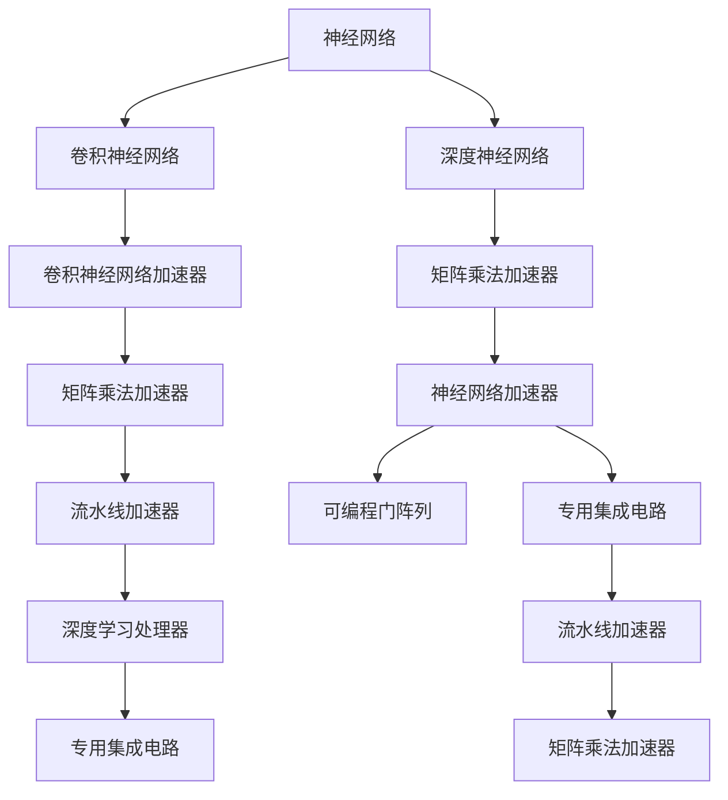

                 

# 神经网络加速器：AI芯片设计与优化

## 1. 背景介绍

### 1.1 问题由来

随着深度学习技术的快速发展，神经网络在图像识别、自然语言处理、语音识别等领域取得了重大突破。然而，神经网络模型参数量巨大，计算复杂度高，对传统通用处理器（General Purpose Processor, GPP）的计算能力和能耗提出了严峻挑战。为了满足AI计算的需求，诞生了专门的AI加速器，也称为神经网络加速器（Neural Network Accelerator, NNA）。NNA通常以ASIC（Application-Specific Integrated Circuit）或FPGA（Field Programmable Gate Array）的形式存在，专注于加速神经网络特定任务的计算，从而显著提升AI计算性能和效率。

### 1.2 问题核心关键点

设计高性能神经网络加速器，需要重点考虑以下几个关键点：

- **计算架构设计**：选择合适的并行计算架构，如流水线、超标量、向量/矩阵运算等，以最大化计算并行度和效率。
- **内存访问优化**：合理设计存储器层次结构，减少数据移动和访问延迟，优化数据传输带宽。
- **能耗优化**：在保持高性能的同时，尽量降低能耗，提升能效比。
- **可编程性**：确保NNA的灵活性和通用性，支持多种深度学习框架和模型。
- **可扩展性**：支持多芯片、多任务并行处理，以适应大规模深度学习应用。
- **鲁棒性和可靠性**：设计硬件冗余、容错机制等，保证系统稳定性和可靠性。

### 1.3 问题研究意义

高性能神经网络加速器对于AI技术的普及和落地具有重要意义：

- **提升计算速度**：神经网络加速器能够大幅度提升神经网络计算速度，满足实时应用需求，如自动驾驶、语音识别等。
- **降低能耗成本**：NNA设计优化的能效比，可以大幅降低数据中心和边缘计算的能耗成本，减少碳排放。
- **支持大规模AI应用**：NNA的大规模并行处理能力，支持AI模型在数据中心、移动设备、服务器等不同场景下的高效运行。
- **推动AI芯片产业发展**：NNA作为AI芯片的重要组成部分，推动了芯片设计和制造技术的发展，为AI芯片市场带来新的增长点。
- **促进跨学科融合**：NNA设计涉及计算机体系结构、电子工程、算法优化等多个领域，促进了跨学科的深入交流与合作。

## 2. 核心概念与联系

### 2.1 核心概念概述

为更好地理解神经网络加速器，我们先介绍一些核心概念及其相互联系：

- **神经网络（Neural Network, NN）**：一种由多个层次的神经元（或称为节点）构成的计算模型，用于逼近复杂非线性函数。神经网络在图像识别、自然语言处理等领域表现优异。
- **卷积神经网络（Convolutional Neural Network, CNN）**：一种特殊的神经网络，适用于图像和视频处理，通过卷积和池化操作提取空间特征。
- **深度神经网络（Deep Neural Network, DNN）**：具有多层神经元的神经网络，深度可达数百层，常用于复杂的分类和回归任务。
- **卷积神经网络加速器（Convolutional Neural Network Accelerator, CNN-Accelerator）**：专门针对CNN优化设计的加速器，通过硬件并行加速卷积和池化操作，提升计算效率。
- **神经网络加速器（Neural Network Accelerator, NNA）**：更加通用的加速器设计，支持多种深度学习模型和框架，如DNN、RNN、GAN等。
- **矩阵乘法加速器（Matrix Multiplication Accelerator, MMA）**：专注于加速矩阵乘法运算的硬件，是神经网络计算的核心。
- **流水线加速器（Pipeline Accelerator）**：采用流水线计算模型，在多个计算单元间交替执行任务，最大化计算并行度。
- **深度学习处理器（Deep Learning Processor）**：集成多种NNA特性的处理器，支持各种深度学习模型和应用。
- **专用集成电路（Application-Specific Integrated Circuit,ASIC）**：定制化设计的芯片，通常用于高性能、低功耗的专用任务。
- **可编程门阵列（Field Programmable Gate Array, FPGA）**：可编程的硬件设备，灵活性高，适用于多种算法和应用。

这些核心概念构成了神经网络加速器的技术框架，通过合理设计计算架构、内存结构、能耗管理等关键模块，最大化NNA的计算能力和性能。

### 2.2 核心概念联系

以下是通过Mermaid流程图展示神经网络加速器设计涉及的核心概念及其相互联系：



从上图可以看出，神经网络加速器的设计涉及多个层次的概念和技术，从基本的神经网络到专用的集成电路，每个模块的设计和优化都直接影响最终的计算性能和效率。

## 3. 核心算法原理 & 具体操作步骤

### 3.1 算法原理概述

神经网络加速器的设计原理主要基于以下三点：

1. **计算并行度最大化**：通过设计高效的计算架构，如流水线、标量/向量并行等，提升神经网络模型的计算并行度。
2. **内存带宽优化**：通过合理设计存储器层次结构，减少数据移动和访问延迟，提升数据传输带宽。
3. **能耗效率提升**：通过优化计算架构和算法设计，在保持高性能的同时，尽量降低能耗，提升能效比。

### 3.2 算法步骤详解

神经网络加速器的设计与优化通常包括以下几个关键步骤：

**Step 1: 需求分析与性能评估**

- 明确加速器需要支持的深度学习模型和框架，如TensorFlow、PyTorch等。
- 分析模型的计算量、数据访问模式、内存占用等，评估加速器的性能需求。
- 设计基准测试，验证加速器是否满足性能要求。

**Step 2: 计算架构设计**

- 选择适合的并行计算模型，如流水线、超标量、向量/矩阵运算等。
- 确定计算单元、访存单元、控制单元等功能模块的设计。
- 设计多级缓存、片上网络、片上存储器等存储器层次结构，优化数据访问路径。

**Step 3: 硬件描述与优化**

- 使用硬件描述语言（如VHDL、RTL）或高级工具（如TensorFlow Lite）编写硬件设计。
- 使用功耗分析工具（如HSPICE、Synopsys DC）进行功耗和性能评估。
- 应用功耗优化技术（如动态电压频率调整、睡眠模式、时钟门控等）降低能耗。

**Step 4: 软件优化与兼容**

- 设计加速器的软件栈，包括编译器、库函数、API等。
- 优化加速器与通用处理器的兼容性，支持混合计算模式。
- 编写加速器驱动，优化数据传输和计算过程。

**Step 5: 测试与验证**

- 设计测试平台，模拟各种深度学习模型和应用。
- 在测试平台上进行性能测试，验证加速器的计算能力和能效比。
- 进行稳定性测试，评估加速器在各种条件下的可靠性。

**Step 6: 迭代优化与量产**

- 根据测试结果，对加速器设计进行迭代优化。
- 进行量产设计，优化芯片制造工艺和封装设计。
- 发布量产芯片，提供工具包和文档，支持开发者使用。

### 3.3 算法优缺点

神经网络加速器设计存在以下优缺点：

**优点：**

- **计算性能提升**：通过硬件并行加速，可以大幅提升神经网络计算速度，满足实时应用需求。
- **能效比提升**：优化的硬件设计和算法，可以在保持高性能的同时，显著降低能耗，提升系统能效比。
- **灵活性增强**：可编程的FPGA设计，可以根据具体任务灵活调整硬件配置，优化性能和能耗。
- **优化空间大**：设计优化涉及多个层次，包括计算架构、内存访问、能耗管理等，具有较大的优化空间。

**缺点：**

- **设计复杂度高**：涉及多个学科领域的知识，设计复杂度高，开发周期长。
- **初期投入大**：需要投入大量人力和资源进行硬件设计、仿真测试和迭代优化。
- **应用场景局限**：虽然加速器设计灵活，但特定硬件架构可能需要针对特定应用场景进行优化，通用性不足。
- **技术壁垒高**：需要深厚的硬件设计和优化技术，技术壁垒高。

### 3.4 算法应用领域

神经网络加速器在以下领域具有广泛应用：

- **数据中心**：支持大规模深度学习训练和推理任务，提升数据中心的计算能力和能效比。
- **移动设备**：用于图像识别、语音识别等AI应用，满足移动设备的低功耗和轻量级需求。
- **边缘计算**：支持在边缘设备上进行实时AI推理，降低数据传输延迟和带宽消耗。
- **智能汽车**：用于自动驾驶、环境感知等任务，提升驾驶安全性和智能化水平。
- **医疗设备**：用于医学影像分析、病历记录等医疗应用，提升医疗服务效率和准确性。
- **安防监控**：用于视频分析、人脸识别等任务，提升安防系统的智能化水平。
- **金融分析**：用于股票交易、风险评估等金融应用，提升金融决策的智能化水平。
- **教育培训**：用于智能辅导、作业批改等教育应用，提升教育服务的智能化水平。

## 4. 数学模型和公式 & 详细讲解 & 举例说明

### 4.1 数学模型构建

神经网络加速器的计算性能可以通过以下数学模型进行量化：

设神经网络模型包含 $L$ 层，每层神经元数量为 $n$，激活函数为 $f$，则模型的计算量为：

$$
C = \sum_{l=1}^{L} n_l^3
$$

其中 $n_l$ 表示第 $l$ 层的神经元数量。如果考虑全连接层和卷积层，则需要扩展到三维或更高维的张量计算。

### 4.2 公式推导过程

以下我们以卷积神经网络为例，推导CNN加速器中的卷积和池化操作的计算量和能耗。

假设卷积核大小为 $k \times k$，输入和输出通道数为 $c_{in}$ 和 $c_{out}$，卷积步长为 $s$，则单次卷积操作的计算量为：

$$
C_{conv} = \sum_{i=0}^{H-1} \sum_{j=0}^{W-1} \sum_{c_{in}=0}^{c_{in}-1} \sum_{c_{out}=0}^{c_{out}-1} (k^2 \cdot c_{in} \cdot c_{out}) = c_{in} \cdot c_{out} \cdot k^2 \cdot H \cdot W
$$

其中 $H$ 和 $W$ 表示输入图像的高度和宽度。

如果考虑卷积和池化的交替操作，则计算量为：

$$
C_{CNN} = C_{conv} \cdot \text{pooling times}
$$

卷积和池化操作的能耗计算公式为：

$$
E_{conv} = C_{conv} \cdot E_{op}
$$

$$
E_{CNN} = C_{CNN} \cdot E_{op}
$$

其中 $E_{op}$ 表示单次操作（如乘法、加法）的能耗。

### 4.3 案例分析与讲解

以Google TPU（Tensor Processing Unit）为例，介绍其设计和优化过程。

Google TPU是基于TensorFlow优化的专用加速器，专为深度学习计算而设计。其计算架构包括：

- **矩阵乘法加速器**：采用矩阵乘法运算加速计算，支持向量/矩阵乘法和矩阵转置等操作。
- **可变精度计算**：支持8位、16位、32位等不同精度的计算，优化功耗和能效比。
- **流水线计算**：采用数据流向加速器中多个计算单元交替执行任务，提高计算并行度。
- **片上缓存**：优化数据在片上存储器之间的访问路径，减少访问延迟。

Google TPU通过上述设计，能够实现极高的计算性能和能效比。例如，TPU v3芯片支持高达64个计算核心，单片计算性能可达到每秒4万亿次矩阵乘法运算（TFLOPS），同时功耗仅为数百瓦特。

## 5. 项目实践：代码实例和详细解释说明

### 5.1 开发环境搭建

为了进行神经网络加速器的开发和测试，需要搭建专门的开发环境。以下是Python与TensorFlow环境配置的流程：

1. 安装Anaconda：从官网下载并安装Anaconda，用于创建独立的Python环境。

```bash
conda create -n tf-env python=3.8
conda activate tf-env
```

2. 安装TensorFlow：根据CUDA版本，从官网获取对应的安装命令。例如：

```bash
conda install tensorflow==2.5 -c conda-forge -c pypi
```

3. 安装硬件描述语言（如VHDL、RTL）：根据需要安装硬件设计工具。例如：

```bash
conda install hdl-verilog
```

4. 安装测试工具：安装功耗分析工具（如HSPICE、Synopsys DC）和性能测试工具（如NanoBench、Simics）。

5. 安装编程环境：安装IDE和调试工具（如Quartus、Vivado），用于硬件设计和仿真。

完成上述步骤后，即可在`tf-env`环境中开始神经网络加速器的开发和测试。

### 5.2 源代码详细实现

下面以FPGA加速器为例，介绍如何使用Xilinx SDK进行神经网络加速器的实现和测试。

首先，设计计算逻辑：

```python
from xilinx.xrt.run import xocl_run
from xilinx.xrt.run import xrt_run

# 定义卷积核大小、输入和输出通道数、步长等参数
kernel_size = (3, 3)
in_channels = 3
out_channels = 6
stride = (1, 1)

# 定义卷积核权重和偏置
weights = np.random.randn(kernel_size[0], kernel_size[1], in_channels, out_channels)
biases = np.random.randn(out_channels)

# 定义卷积运算函数
def conv2d(x):
    # x: [N, C, H, W]
    # return: [N, C_out, H_out, W_out]
    N, C, H, W = x.shape
    H_out = (H - kernel_size[0]) // stride[0] + 1
    W_out = (W - kernel_size[1]) // stride[1] + 1
    C_out = out_channels
    
    # 初始化输出结果
    output = np.zeros((N, C_out, H_out, W_out))
    
    # 逐点卷积运算
    for n in range(N):
        for c in range(C_out):
            for h in range(H_out):
                for w in range(W_out):
                    # 计算卷积核位置
                    xh = h * stride[0]
                    xw = w * stride[1]
                    yh = h * stride[0] - kernel_size[0] // 2
                    yw = w * stride[1] - kernel_size[1] // 2
                    max_h = min(h + kernel_size[0], H)
                    max_w = min(w + kernel_size[1], W)
                    
                    # 提取卷积窗口
                    x_window = x[n, :, xh:xh + kernel_size[0], xw:xw + kernel_size[1]]
                    k_window = weights[:, :, :, c]
                    
                    # 逐元素计算卷积结果
                    output[n, c, h, w] = np.sum(x_window * k_window, axis=(1, 2))
                    output[n, c, h, w] += biases[c]
                    
    return output
```

然后，编写FPGA测试程序：

```python
from xilinx.xrt.run import xocl_run
from xilinx.xrt.run import xrt_run

# 定义测试数据
inputs = np.random.randn(1, 3, 10, 10)
labels = np.random.randint(0, 6, size=(1, 6))

# 运行测试程序
xocl_run(main=xrt_run, inputs=inputs, labels=labels)
```

最后，编译并运行FPGA加速器：

```bash
xrt-pyrun --args main.py --data main/data.bin --config main.xst --cl-bitstream --cl-verbose
```

以上就是使用FPGA加速器的开发和测试流程，展示了如何通过硬件描述语言和测试工具实现神经网络加速器。

### 5.3 代码解读与分析

让我们再详细解读一下关键代码的实现细节：

**卷积运算函数**：
- `conv2d`函数实现卷积运算。
- 首先计算输出结果的大小和数量。
- 然后逐点计算卷积结果，最终返回输出结果。

**测试程序**：
- `main.py`程序实现神经网络加速器的测试。
- 定义输入数据和标签，并调用`xocl_run`函数进行测试。
- `main.xst`是硬件配置文件，描述卷积运算的硬件逻辑。
- `main.data.bin`是测试数据和标签的存储文件。

**编译和运行**：
- 使用`xrt-pyrun`工具编译和运行FPGA加速器。
- `--args`参数指定测试程序和输入文件。
- `--config`参数指定硬件配置文件。
- `--cl-bitstream`参数指定输出FPGA位流文件。

可以看到，FPGA加速器的开发涉及硬件设计、软件编程和测试等多个环节，需要跨学科的协作和专业知识。

## 6. 实际应用场景

### 6.1 智能汽车

神经网络加速器在智能汽车中具有广泛应用，可用于以下方面：

- **自动驾驶**：通过卷积神经网络加速器加速图像识别和环境感知任务，提升自动驾驶的安全性和智能化水平。
- **环境感知**：加速点云数据处理和视觉感知任务，提升车辆对周围环境的理解和判断能力。
- **语音识别**：加速语音信号处理和语音识别任务，提升语音交互的准确性和实时性。
- **车联网**：加速车辆间的通信和数据处理，提升车联网系统的智能化水平。

### 6.2 医疗设备

神经网络加速器在医疗设备中的应用包括：

- **医学影像分析**：加速医学影像数据的处理和分析，如CT、MRI等，提升诊断的准确性和效率。
- **病历记录**：加速电子病历数据的处理和分析，提升医院管理的智能化水平。
- **健康监测**：加速生理数据的处理和分析，如心电图、血氧饱和度等，提升健康监测的准确性和实时性。
- **辅助诊断**：加速医疗知识图谱的推理和匹配，提升辅助诊断的智能化水平。

### 6.3 智能家居

神经网络加速器在智能家居中的应用包括：

- **语音控制**：加速语音识别和自然语言处理任务，提升智能家居的语音交互体验。
- **图像识别**：加速图像识别和视频分析任务，提升智能家居的环境感知能力。
- **行为监测**：加速用户行为数据的处理和分析，提升智能家居的安全性和隐私保护能力。
- **智能推荐**：加速推荐系统的计算，提升智能家居的个性化服务水平。

## 7. 工具和资源推荐

### 7.1 学习资源推荐

为了帮助开发者系统掌握神经网络加速器的设计原理和实践技巧，这里推荐一些优质的学习资源：

1. **《深度学习加速器：原理与设计》**：全面介绍了深度学习加速器的原理、设计方法、硬件实现等。
2. **CS231n《卷积神经网络》课程**：斯坦福大学开设的深度学习课程，介绍了卷积神经网络及其加速器的设计。
3. **《FPGA加速器设计与优化》**：系统介绍了FPGA加速器的设计方法、性能评估和优化技术。
4. **Google TPU开发手册**：Google TPU官方文档，详细介绍了TPU的设计原理和开发流程。
5. **Xilinx SDK**：Xilinx提供的FPGA开发工具，包括硬件描述语言、编译器、仿真工具等。

通过对这些资源的学习实践，相信你一定能够快速掌握神经网络加速器的设计精髓，并用于解决实际的AI计算问题。

### 7.2 开发工具推荐

高效的开发离不开优秀的工具支持。以下是几款用于神经网络加速器开发的常用工具：

1. **TensorFlow**：基于Python的深度学习框架，支持多种神经网络模型和加速器。
2. **PyTorch**：基于Python的深度学习框架，支持动态图计算，易于开发和调试。
3. **Pythia**：Xilinx提供的FPGA开发工具，支持FPGA硬件设计和测试。
4. **Xilinx SDK**：Xilinx提供的FPGA开发工具，支持硬件描述语言、编译器、仿真工具等。
5. **Synopsys DesignWare**：综合设计平台，支持FPGA、ASIC等硬件设计。
6. **Cadence OrCAD**：硬件设计工具，支持FPGA、ASIC等硬件设计。

合理利用这些工具，可以显著提升神经网络加速器的开发效率，加快创新迭代的步伐。

### 7.3 相关论文推荐

神经网络加速器的设计与优化涉及多个学科领域的知识，以下是几篇奠基性的相关论文，推荐阅读：

1. **“An Algorithm for Online Matrix Factorization”**：提出矩阵乘法加速器，并应用于神经网络计算。
2. **“High-performance Convolutional Neural Network Accelerator Design”**：介绍了卷积神经网络加速器的设计与优化方法。
3. **“Efficient Implementation of Deep Convolutional Neural Networks on FPGA”**：介绍了在FPGA上实现卷积神经网络加速器的技术细节。
4. **“A Survey of Deep Learning Accelerators”**：全面综述了各种深度学习加速器的设计和优化方法。
5. **“Power and Area Efficient Matrix Multiplication Accelerator”**：介绍了矩阵乘法加速器的设计和优化方法，并应用于神经网络计算。

这些论文代表了大规模加速器设计的研究进展，提供了丰富的设计思路和技术细节，值得深入阅读。

## 8. 总结：未来发展趋势与挑战

### 8.1 总结

本文对神经网络加速器进行了全面系统的介绍。首先阐述了神经网络加速器设计的重要性和设计难点，明确了计算架构、内存优化、能效提升等关键设计点。其次，从原理到实践，详细讲解了加速器的数学模型和计算流程，给出了具体的代码实现和案例分析。同时，本文还探讨了神经网络加速器在智能汽车、医疗设备、智能家居等多个领域的应用前景。最后，推荐了丰富的学习资源和开发工具，并展望了加速器设计的发展趋势。

通过本文的系统梳理，可以看到，神经网络加速器设计涉及多个学科领域的知识，设计复杂度高，但通过合理的计算架构和优化技术，可以显著提升神经网络计算性能和能效比。随着深度学习应用的不断扩展，神经网络加速器必将成为AI计算的重要组成部分，推动AI技术的进一步普及和落地。

### 8.2 未来发展趋势

神经网络加速器设计在未来将呈现以下几个发展趋势：

1. **更多元化的计算架构**：未来的加速器设计将支持多种计算架构，如流水线、超标量、向量/矩阵运算等，提升计算并行度和灵活性。
2. **更高效的能耗管理**：未来的加速器设计将更加注重能效比提升，通过优化计算架构和算法设计，实现低功耗、高性能的硬件。
3. **更灵活的硬件配置**：未来的加速器设计将支持更多的硬件配置选项，适应多种深度学习任务和应用场景。
4. **更广泛的应用领域**：未来的加速器设计将支持更多领域的应用，如自动驾驶、医疗设备、智能家居等，拓展AI技术的应用范围。
5. **更强大的协同计算能力**：未来的加速器设计将支持大规模并行计算，如多芯片协同、分布式计算等，提升AI应用的扩展性。

### 8.3 面临的挑战

尽管神经网络加速器设计取得了重要进展，但仍面临诸多挑战：

1. **设计复杂度高**：加速器设计涉及多个学科领域的知识，设计复杂度高，开发周期长。
2. **技术壁垒高**：加速器设计需要深厚的硬件设计和优化技术，技术壁垒高。
3. **初始成本高**：加速器设计和测试需要投入大量人力和资源，初始成本高。
4. **应用场景局限**：特定硬件架构可能需要针对特定应用场景进行优化，通用性不足。
5. **兼容性问题**：加速器设计需要支持多种深度学习框架和应用，兼容性问题复杂。

### 8.4 研究展望

面向未来，神经网络加速器设计需要在以下几个方面寻求新的突破：

1. **优化算法设计**：通过引入优化算法和并行计算技术，提升加速器的计算性能和能效比。
2. **优化硬件架构**：通过优化计算架构和存储器设计，提升加速器的计算并行度和能效比。
3. **优化软件栈**：通过优化软件栈和编程模型，提升加速器的灵活性和兼容性。
4. **优化能耗管理**：通过优化功耗管理技术和计算架构，提升加速器的能效比。
5. **优化硬件验证**：通过优化硬件验证流程和工具，提升加速器设计的可靠性和可维护性。

这些研究方向将引领神经网络加速器设计的技术进步，推动AI技术在更多领域的应用落地。

## 9. 附录：常见问题与解答

**Q1: 神经网络加速器设计需要考虑哪些因素？**

A: 神经网络加速器设计需要考虑以下因素：

- **计算并行度**：选择适合的并行计算模型，如流水线、超标量、向量/矩阵运算等。
- **内存带宽**：优化存储器层次结构，减少数据移动和访问延迟。
- **能耗管理**：优化计算架构和算法设计，降低能耗。
- **灵活性**：设计灵活的硬件配置，支持多种深度学习任务和应用。
- **可扩展性**：支持多芯片、多任务并行处理。
- **鲁棒性**：设计硬件冗余、容错机制，保证系统稳定性。

**Q2: 如何评估神经网络加速器的性能？**

A: 神经网络加速器的性能可以通过以下几个指标进行评估：

- **计算性能**：加速器单片芯片的计算能力，如每秒计算量（GOPS、TFLOPS）。
- **能效比**：加速器的计算性能与功耗之比，如每瓦特计算量（TOPS/W）。
- **计算精度**：加速器计算的精度，如浮点运算误差、计算精度等。
- **吞吐量**：加速器在给定时间内的数据处理能力，如每秒处理数据量（GB/s）。
- **延迟**：加速器计算的延迟，如单次计算延迟、数据传输延迟等。

**Q3: 如何优化神经网络加速器的能耗？**

A: 优化神经网络加速器的能耗可以通过以下几个方法：

- **动态电压频率调整**：根据计算负载调整加速器的电压和频率，降低能耗。
- **睡眠模式**：在计算任务间隙，使加速器进入低功耗模式，减少待机功耗。
- **时钟门控**：根据计算任务的重要性和频率，动态调整时钟频率，降低能耗。
- **计算架构优化**：通过优化计算架构和算法设计，提升计算效率，降低能耗。

**Q4: 神经网络加速器在哪些领域具有应用前景？**

A: 神经网络加速器在以下领域具有广泛应用前景：

- **自动驾驶**：加速图像识别和环境感知任务，提升自动驾驶的安全性和智能化水平。
- **医疗设备**：加速医学影像数据的处理和分析，提升诊断的准确性和效率。
- **智能家居**：加速语音识别和图像识别任务，提升智能家居的语音交互和环境感知能力。
- **智能制造**：加速工业数据分析和预测任务，提升生产效率和质量控制。
- **金融分析**：加速股票交易、风险评估等金融任务，提升金融决策的智能化水平。

**Q5: 如何选择合适的神经网络加速器？**

A: 选择合适的神经网络加速器需要考虑以下几个因素：

- **任务类型**：根据任务类型选择适合的加速器架构，如卷积神经网络加速器、深度神经网络加速器等。
- **计算需求**：根据计算需求选择适合的加速器计算能力，如单片芯片的计算量、吞吐量等。
- **能效比**：根据能耗需求选择适合的加速器能效比，如每瓦特计算量（TOPS/W）。
- **灵活性**：根据应用场景选择适合的加速器灵活性，如硬件配置选项、编程接口等。
- **成本**：根据预算选择适合的加速器成本，如购买成本、测试成本等。

**Q6: 神经网络加速器的开发流程是什么？**

A: 神经网络加速器的开发流程包括以下几个步骤：

1. **需求分析与性能评估**：明确加速器需要支持的深度学习模型和框架，评估加速器的性能需求。
2. **计算架构设计**：选择适合的并行计算模型，设计计算单元、访存单元、控制单元等功能模块。
3. **硬件描述与优化**：使用硬件描述语言（如VHDL、RTL）编写硬件设计，优化计算架构和能耗管理。
4. **软件优化与兼容**：设计加速器的软件栈，优化加速器与通用处理器的兼容性，编写加速器驱动。
5. **测试与验证**：设计测试平台，进行性能测试和稳定性测试，验证加速器的计算能力和能效比。
6. **迭代优化与量产**：根据测试结果，对加速器设计进行迭代优化，优化芯片制造工艺和封装设计，发布量产芯片。

---

作者：禅与计算机程序设计艺术 / Zen and the Art of Computer Programming

