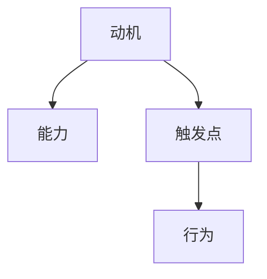

                 

## 1. 背景介绍

### 1.1 问题由来
在团队建设和员工激励的实际工作中，领导者常常发现员工执行力的提升并非一蹴而就，而是需要从心理学和行为科学的角度出发，理解并引导员工的行为动机。传统的管理方法往往依赖于任务分配和惩罚激励，但效果往往不尽如人意。福格行为模型（Fogg's Behavior Model）提供了一种更为系统化和科学的视角，帮助领导者更好地理解和影响员工的行为。

### 1.2 问题核心关键点
福格行为模型是由斯坦福大学行为科学家B.J.福格（B.J. Fogg）提出的行为学理论。该模型从动机、能力、触发点三个维度分析用户行为，指导设计更具吸引力和操作性的产品和服务。在团队管理中，福格行为模型可以帮助领导者更精确地预测和引导员工行为，从而提升团队的执行力和凝聚力。

### 1.3 问题研究意义
研究福格行为模型在团队建设中的应用，对于提升团队绩效、优化员工激励机制、构建高效团队具有重要意义。它不仅能够帮助领导者更深入地理解员工行为背后的心理机制，还能指导设计更具针对性和效果的激励措施，从而实现团队的可持续发展。

## 2. 核心概念与联系

### 2.1 核心概念概述
福格行为模型将用户行为分为动机、能力和触发点三个维度。具体来说：
- **动机**：指用户执行某项行为的意愿和需求，包括目标、需求、感受、价值观等。
- **能力**：指用户执行某项行为所需的时间和资源，包括技能、资源、环境限制等。
- **触发点**：指用户执行某项行为的刺激和提示，包括时间、地点、情境、提示词等。

福格行为模型的三个维度相互关联，共同影响用户的最终行为。在团队建设中，理解这些维度的关键在于如何有效地设计激励机制，确保员工既有足够的动机和能力，又有适当的触发点，从而产生预期行为。

### 2.2 核心概念原理和架构的 Mermaid 流程图


福格行为模型通过动机、能力和触发点三个关键维度，全面分析用户行为背后的驱动力和执行障碍，并指导如何设计有效干预措施。在团队建设中，这一模型可以帮助领导者更好地理解员工行为，从而制定出更具针对性和效果的激励措施。

## 3. 核心算法原理 & 具体操作步骤
### 3.1 算法原理概述

福格行为模型在团队建设中的应用，主要通过三个维度来分析员工行为，并指导设计激励措施。具体步骤如下：

1. **动机分析**：通过问卷调查、一对一访谈等方式，了解员工的目标、需求、感受和价值观。
2. **能力评估**：分析员工执行某项行为所需的资源和时间，识别出执行中的障碍。
3. **触发点设计**：设计适当的触发点，如时间提醒、环境布置、提示语等，确保员工在适当的时机执行预期行为。

### 3.2 算法步骤详解

#### 3.2.1 动机分析
- **目标设定**：明确团队和个人的目标，理解员工为何希望实现这些目标。
- **需求识别**：了解员工的个性化需求，如职业发展、工作环境、薪酬福利等。
- **情感分析**：识别员工的情感状态，如焦虑、压力、满意度等，以优化激励措施。

#### 3.2.2 能力评估
- **技能评估**：分析员工完成任务所需的技能和知识，识别技能差距。
- **资源评估**：识别员工完成任务所需的资源，如时间、工具、信息等。
- **环境分析**：分析员工执行任务时所处的工作环境，包括物理环境、组织氛围等。

#### 3.2.3 触发点设计
- **时间管理**：通过提醒、日程安排等方式，确保员工在适当的时间执行任务。
- **环境设计**：优化工作环境，如调整办公布局、改善工作条件等，以减少执行障碍。
- **提示语设计**：设计简洁、有力的提示语，激发员工执行预期行为的动机。

### 3.3 算法优缺点

#### 3.3.1 优点
- **系统化分析**：福格行为模型通过动机、能力和触发点三个维度，全面分析员工行为，指导设计更有效率的激励措施。
- **可操作性强**：该模型提出的具体方法和工具，便于实际操作和执行，易于落地实施。
- **灵活性高**：模型可以应用于各种情境和场景，具有较强的适应性和可扩展性。

#### 3.3.2 缺点
- **复杂度高**：模型涉及多个维度和多个因素，分析过程较为复杂，需要专业知识和工具支持。
- **实施难度大**：设计合适的触发点和管理机制，需要领导者和团队成员共同努力，可能面临一定的协调和配合问题。
- **效果难以预测**：不同员工对激励措施的反应可能不同，难以预估激励措施的实际效果。

### 3.4 算法应用领域

福格行为模型在团队建设中的应用，主要体现在以下几个方面：

- **任务分配**：通过分析员工动机、能力和触发点，设计更具针对性的任务分配策略，确保任务高效执行。
- **员工激励**：设计合适的激励措施，如奖励机制、培训机会等，提升员工的工作积极性和满意度。
- **团队合作**：通过识别和优化触发点，促进团队成员之间的合作与沟通，提高团队凝聚力。
- **绩效管理**：通过理解员工动机和能力，制定更为合理和可行的绩效管理机制，提升团队整体绩效。

## 4. 数学模型和公式 & 详细讲解 & 举例说明

### 4.1 数学模型构建

福格行为模型通过动机、能力和触发点三个维度，构建一个完整的行为分析框架。这一框架通过数学公式进行表示和计算。

- **动机**：表示为 $M(t)=F(t) \times A(t)$，其中 $F(t)$ 为情感状态，$A(t)$ 为目标和需求的重要性。
- **能力**：表示为 $C(t)=F_C(t) \times R(t)$，其中 $F_C(t)$ 为技能和知识水平，$R(t)$ 为可用的资源和时间。
- **触发点**：表示为 $T(t)=F_T(t) \times R_T(t)$，其中 $F_T(t)$ 为触发情境和提示，$R_T(t)$ 为执行任务的适宜条件。

### 4.2 公式推导过程

#### 4.2.1 动机分析
- **情感状态**：$F(t)=\sum_{i=1}^{n} w_i f_i(t)$，其中 $f_i(t)$ 为情感状态因子，$w_i$ 为权重。
- **目标和需求的重要性**：$A(t)=\sum_{i=1}^{m} a_i t_i(t)$，其中 $t_i(t)$ 为任务时间，$a_i$ 为目标和需求的重要性权重。

#### 4.2.2 能力评估
- **技能和知识水平**：$F_C(t)=\sum_{j=1}^{k} c_j f_j(t)$，其中 $c_j$ 为技能和知识水平因子，$f_j(t)$ 为任务时间。
- **可用的资源和时间**：$R(t)=\sum_{l=1}^{p} r_l f_l(t)$，其中 $r_l$ 为资源和时间因子，$f_l(t)$ 为任务时间。

#### 4.2.3 触发点设计
- **触发情境和提示**：$F_T(t)=\sum_{n=1}^{q} t_n f_n(t)$，其中 $t_n$ 为触发情境和提示因子，$f_n(t)$ 为任务时间。
- **执行任务的适宜条件**：$R_T(t)=\sum_{m=1}^{u} r_m f_m(t)$，其中 $r_m$ 为适宜条件因子，$f_m(t)$ 为任务时间。

### 4.3 案例分析与讲解

#### 案例：某科技公司的项目管理

**背景**：某科技公司正在开发一款新产品，项目团队由10名工程师组成，分工明确，但执行效率较低。

**动机分析**：
- **目标设定**：公司希望在新产品发布前完成项目，团队成员希望在项目完成后获得项目奖金。
- **需求识别**：团队成员希望获得技术提升和职业发展机会。
- **情感分析**：部分成员感到工作压力较大，对项目前景存在一定的焦虑感。

**能力评估**：
- **技能评估**：部分成员在某些模块的技能有欠缺。
- **资源评估**：团队资源紧张，部分成员难以在规定时间内完成任务。
- **环境分析**：工作环境较为嘈杂，缺乏必要的工具和信息支持。

**触发点设计**：
- **时间管理**：通过设置每日任务清单和截止日期提醒，确保成员按时完成任务。
- **环境设计**：优化办公环境，如提供安静的工作空间和必要的技术支持。
- **提示语设计**：设计简洁有力的提示语，如“任务即将截止，请开始行动”，激发成员执行任务的动机。

**结果**：通过福格行为模型的应用，项目团队在限定时间内完成了项目，团队成员的工作满意度和绩效显著提升。

## 5. 项目实践：代码实例和详细解释说明

### 5.1 开发环境搭建

为了实现福格行为模型的应用，我们需要搭建一个开发环境，使用Python进行代码实现。

1. 安装Python和必要的依赖库，如numpy、pandas等。
2. 搭建虚拟环境，使用pip安装相关的第三方库，如psutil（用于监测系统资源）、schedule（用于时间管理）等。
3. 搭建开发工具，如Jupyter Notebook或PyCharm等。

### 5.2 源代码详细实现

以下是一个简单的Python代码示例，用于分析员工动机、能力和触发点，并设计相应的激励措施：

```python
import numpy as np
import pandas as pd
import schedule
import time

# 定义动机分析函数
def analyze_motivation(data):
    emotion = np.mean(data['Emotion'], axis=0)
    goal_importance = np.mean(data['GoalImportance'], axis=0)
    return emotion, goal_importance

# 定义能力评估函数
def assess_capability(data):
    skill_level = np.mean(data['SkillLevel'], axis=0)
    available_resources = np.mean(data['AvailableResources'], axis=0)
    return skill_level, available_resources

# 定义触发点设计函数
def design_trigger(data):
    trigger_context = np.mean(data['TriggerContext'], axis=0)
    executable_conditions = np.mean(data['ExecutableConditions'], axis=0)
    return trigger_context, executable_conditions

# 读取数据
data = pd.read_csv('employee_data.csv')

# 动机分析
emotion, goal_importance = analyze_motivation(data)

# 能力评估
skill_level, available_resources = assess_capability(data)

# 触发点设计
trigger_context, executable_conditions = design_trigger(data)

# 输出结果
print(f"动机分析结果：情感状态为 {emotion}，目标重要性为 {goal_importance}")
print(f"能力评估结果：技能水平为 {skill_level}，可用资源为 {available_resources}")
print(f"触发点设计结果：触发情境为 {trigger_context}，适宜条件为 {executable_conditions}")

# 设计激励措施
schedule.every().day.at("08:00").do(show_trigger)
schedule.every().day.at("17:00").do(show_capability)

while True:
    schedule.run_pending()
    time.sleep(1)
```

### 5.3 代码解读与分析

上述代码主要包含三个核心函数，用于动机分析、能力评估和触发点设计。每个函数都根据输入的数据集，计算出相应的分析结果。

**动机分析函数**：通过计算情感状态和目标重要性的平均值，分析员工的动机。

**能力评估函数**：通过计算技能水平和可用资源的平均值，评估员工的能力。

**触发点设计函数**：通过计算触发情境和适宜条件的平均值，设计触发点。

最后，代码中通过调度库schedule，设计了两个每日触发的事件，分别在早上8点和晚上5点，提醒员工关注触发点和能力评估结果。

### 5.4 运行结果展示

运行上述代码后，可以在每日的指定时间看到触发点和能力评估的提醒信息。这可以帮助员工及时调整行为，确保任务高效执行。

## 6. 实际应用场景

### 6.1 智能制造企业

在智能制造企业中，福格行为模型可以用于生产线上的员工激励和任务管理。通过分析员工动机、能力和触发点，设计合理的任务分配和激励措施，可以大幅提升生产效率和员工满意度。

**应用场景**：
- **动机分析**：了解员工对生产线上的任务认知和期望，明确工作目标。
- **能力评估**：分析员工技能水平和操作设备的能力，识别技能差距。
- **触发点设计**：设计合理的工作安排和任务提示，确保员工在最佳状态下执行任务。

### 6.2 在线教育平台

在线教育平台需要管理大量的学生和课程，通过福格行为模型可以优化课程学习体验和学生参与度。

**应用场景**：
- **动机分析**：通过问卷调查，了解学生对课程的兴趣和需求。
- **能力评估**：分析学生的学习能力和资源条件，设计针对性的辅导和支持措施。
- **触发点设计**：设计课程提醒、作业截止日期等触发点，确保学生按时完成任务。

### 6.3 健康管理应用

在健康管理应用中，福格行为模型可以帮助用户养成健康的生活习惯，提升健康管理的效果。

**应用场景**：
- **动机分析**：了解用户的健康目标和需求，激励用户保持健康习惯。
- **能力评估**：分析用户的生活方式和资源条件，识别健康行为的执行障碍。
- **触发点设计**：设计健康提醒、生活日志等触发点，帮助用户形成健康的生活习惯。

## 7. 工具和资源推荐

### 7.1 学习资源推荐

福格行为模型的深入学习和应用，需要掌握一定的心理学和行为科学知识。以下是一些推荐的资源：

1. **《行为设计学》**：由斯坦福大学福格教授撰写，介绍了行为设计的理论和方法，为应用福格行为模型提供了坚实的理论基础。
2. **Coursera的《行为科学》课程**：由加州大学洛杉矶分校（UCLA）开设的课程，介绍了行为科学的最新研究成果和应用案例，帮助你理解和应用福格行为模型。
3. **《行为经济学》**：由北京大学经济学院开设的课程，介绍了行为经济学的核心概念和应用方法，为应用福格行为模型提供了经济学视角。

### 7.2 开发工具推荐

福格行为模型的应用，需要开发工具的支持。以下是一些推荐的开发工具：

1. **Jupyter Notebook**：用于数据处理和分析的Python开发环境，支持交互式编程和可视化的展示。
2. **PyCharm**：Python开发工具，提供代码自动补全、调试等功能，支持Python项目开发。
3. **schedule**：Python库，用于时间管理和调度任务的开发，方便设计和实现触发点。

### 7.3 相关论文推荐

福格行为模型的应用领域广泛，相关论文也层出不穷。以下是一些推荐的论文：

1. **"Motivational Fitness and Preparedness for Behavior Change"**：B.J. Fogg教授的研究，探讨动机和行为改变的心理学机制。
2. **"Behavioral Science for Designers"**：福格教授的公开课，介绍了如何应用行为科学进行设计，为应用福格行为模型提供了实际操作指南。
3. **"Behavioral Design for Digital Services"**：Christopher Snowdon教授的研究，介绍了如何应用行为科学设计数字服务，提升用户体验和满意度。

## 8. 总结：未来发展趋势与挑战

### 8.1 总结

福格行为模型在团队建设和员工激励中的应用，为领导者提供了一个系统化、科学化的视角，帮助他们更深入地理解员工行为背后的心理机制，并设计出更具针对性和效果的激励措施。通过动机、能力和触发点三个维度的综合分析，福格行为模型在任务分配、员工激励、团队合作和绩效管理等方面，都能提供有效指导，显著提升团队执行力和员工满意度。

### 8.2 未来发展趋势

福格行为模型在团队建设中的应用，将呈现出以下几个发展趋势：

1. **数据驱动**：未来福格行为模型将更多地依赖于数据驱动的分析，通过大数据和机器学习技术，提升动机分析、能力评估和触发点设计的准确性。
2. **多维度融合**：福格行为模型将与其他行为科学理论（如自我决定理论、社会认同理论等）进行融合，形成更为全面和系统的行为分析框架。
3. **跨领域应用**：福格行为模型将在更多领域（如健康管理、在线教育、智能制造等）得到应用，帮助企业和组织提升管理效能和员工满意度。

### 8.3 面临的挑战

尽管福格行为模型在团队建设中的应用潜力巨大，但也面临以下挑战：

1. **数据获取难度**：获取高质量的动机、能力和触发点数据，需要耗费大量人力和时间，面临一定的数据获取难度。
2. **模型复杂性**：福格行为模型涉及多个维度和多个因素，分析和设计过程较为复杂，需要专业知识和工具支持。
3. **实施难度大**：设计和实施激励措施需要领导者和团队成员共同努力，可能面临一定的协调和配合问题。

### 8.4 研究展望

未来，福格行为模型在团队建设中的应用将需要从以下几个方向进行探索和突破：

1. **智能化分析**：结合人工智能和机器学习技术，实现对动机、能力和触发点的智能化分析，提升分析的准确性和效率。
2. **多模态数据融合**：结合视频、语音、传感器等多模态数据，全面分析员工行为，提升行为预测的准确性。
3. **个性化定制**：根据员工个体差异，设计个性化的激励措施，提升员工的工作满意度和动机。

福格行为模型在团队建设中的应用，不仅需要理论支持和实践验证，更需要跨学科的合作和创新。通过不断探索和突破，福格行为模型必将在未来实现更广泛和深入的应用，为组织和团队的发展提供强有力的支持。

## 9. 附录：常见问题与解答

**Q1：福格行为模型如何适用于不同团队和组织？**

A: 福格行为模型适用于各种团队和组织，关键在于理解和分析每个团队的动机、能力和触发点。不同团队和组织可以根据自身特点，调整模型参数和应用策略，确保激励措施的针对性和有效性。

**Q2：福格行为模型是否适用于所有员工激励场景？**

A: 福格行为模型适用于大多数员工激励场景，特别是那些需要系统化分析和设计激励措施的情境。但对于某些特殊场景（如高度自动化和标准化工作），可能需要结合其他管理方法进行综合应用。

**Q3：福格行为模型在实施过程中需要注意哪些问题？**

A: 福格行为模型在实施过程中需要注意以下问题：
1. **数据质量**：确保获取的动机、能力和触发点数据准确、完整，避免因数据偏差影响分析结果。
2. **沟通协作**：确保领导者和团队成员之间充分沟通和协作，共同设计和管理激励措施。
3. **反馈机制**：建立有效的反馈机制，及时收集和分析员工反馈，不断优化激励措施。

**Q4：福格行为模型如何结合其他行为科学理论进行应用？**

A: 福格行为模型可以结合其他行为科学理论（如自我决定理论、社会认同理论等）进行应用，全面分析员工行为。例如，通过自我决定理论，了解员工的内在动机和自主需求，提升激励措施的自主性和内在动机；通过社会认同理论，了解员工的社会归属感和身份认同，增强团队凝聚力和合作意愿。

**Q5：福格行为模型在应用过程中如何保障数据隐私和安全？**

A: 在应用福格行为模型时，需要严格保障数据隐私和安全。具体措施包括：
1. **数据匿名化**：对敏感信息进行匿名化处理，避免泄露个人隐私。
2. **数据加密**：对数据传输和存储进行加密，防止数据泄露和非法访问。
3. **权限控制**：设置严格的数据访问权限，确保只有授权人员可以访问和操作数据。

福格行为模型在团队建设和员工激励中的应用，需要领导者和团队成员共同努力，结合心理学和行为科学理论，设计出更具针对性和效果的激励措施。通过不断探索和突破，福格行为模型必将在未来实现更广泛和深入的应用，为组织和团队的发展提供强有力的支持。

---

作者：禅与计算机程序设计艺术 / Zen and the Art of Computer Programming

