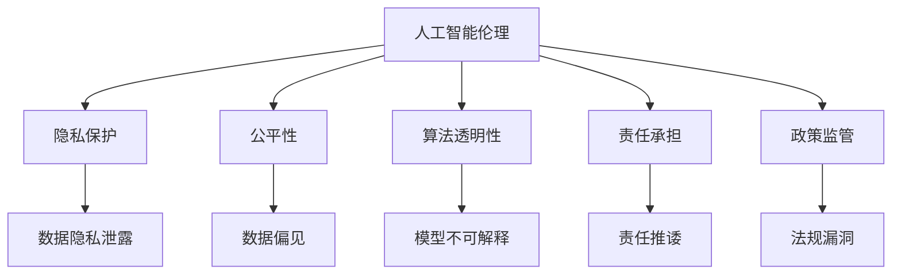

                 

# 科技与伦理的平衡点：人类计算的伦理思考

> 关键词：人工智能伦理,人类计算,算法透明性,隐私保护,公平性,责任承担,政策监管,未来展望

## 1. 背景介绍

### 1.1 问题由来

伴随着科技的飞速发展，人工智能（AI）逐渐走入千家万户，成为改变人类生产和生活方式的重要力量。然而，AI的迅猛发展也带来了诸多伦理挑战，尤其是在人类计算（Human Computing）领域，这些问题显得尤为突出。

人类计算，通常指通过计算和数据处理，赋予计算机以人类的智能，从而使其能够完成更加复杂、智能化的任务。这不仅包括传统的图像识别、语音识别、自然语言处理等任务，还包括智能推荐、金融分析、医疗诊断等高价值的决策类任务。然而，这些任务往往涉及大量敏感信息，甚至可能触及隐私、公平性等敏感伦理问题。因此，如何在科技与伦理之间寻找平衡点，成为当前亟待解决的关键问题。

### 1.2 问题核心关键点

本文将聚焦于人类计算中的伦理问题，具体包括以下几个核心关键点：

- 人工智能伦理：如何构建AI系统的伦理基础，使其在应用中遵循伦理准则。
- 隐私保护：如何在AI系统中实现对用户数据的隐私保护。
- 公平性：如何确保AI系统在处理数据和决策时，能够体现公平原则，避免偏见和歧视。
- 算法透明性：如何确保AI系统的决策过程透明、可解释，能够被人类理解和监督。
- 责任承担：如何明确AI系统在不同情境下的责任归属，避免责任模糊导致的滥用和误用。
- 政策监管：如何通过法律法规和政策指导，规范AI系统的发展，防范其带来的伦理风险。
- 未来展望：如何预见AI伦理问题的发展趋势，并探索应对策略。

这些关键点共同构成了人类计算中伦理问题的全貌，也为我们提供了研究和应对这些问题的基本框架。

## 2. 核心概念与联系

### 2.1 核心概念概述

为更好地理解这些伦理问题，本节将介绍几个密切相关的核心概念：

- **人工智能伦理(Ethics of Artificial Intelligence)**：指在人工智能的设计、开发和应用中，遵循的伦理准则和规范。这些准则旨在确保AI系统能够安全、公正、透明地运作。

- **隐私保护(Privacy Protection)**：指在数据处理和AI系统中，确保个人信息的保密性、完整性和可用性，防止未经授权的访问和使用。

- **公平性(Fairness)**：指AI系统在处理数据和决策时，能够公平对待不同群体，避免因算法偏见导致的歧视或不公。

- **算法透明性(Algorithmic Transparency)**：指AI系统的工作机制、决策过程和结果应可解释、可理解，便于人类监督和评估。

- **责任承担(Responsibility)**：指在AI系统中，如何界定各方的责任，包括开发者、用户、监管者等，确保在出现问题时能够追责。

- **政策监管(Policy Regulation)**：指通过法律法规和政策指导，规范AI系统的发展，防止其带来的伦理风险。

这些核心概念之间的逻辑关系可以通过以下Mermaid流程图来展示：



这个流程图展示了大模型伦理问题的核心概念及其之间的关系：

1. 人工智能伦理是大模型设计的基础，涉及隐私保护、公平性、算法透明性、责任承担和政策监管等多个方面。
2. 隐私保护和大模型中数据的处理直接相关，需要避免数据隐私泄露的风险。
3. 公平性确保大模型不会歧视任何群体，需注意避免算法偏见。
4. 算法透明性使大模型工作机制可理解，便于监督。
5. 责任承担需在大模型开发、使用和监管等环节明确各方责任。
6. 政策监管为AI系统提供了法律框架，防止伦理问题的发生。

这些概念共同构成了人类计算伦理问题的全貌，提供了研究和应对这些问题的基本框架。

## 3. 核心算法原理 & 具体操作步骤

### 3.1 算法原理概述

人类计算中的伦理问题，并非技术本身的问题，而是技术应用中的问题。因此，在技术层面，我们无需过多关注具体的算法原理，而是需要关注如何通过技术手段解决伦理问题。

本文将从技术应用的角度，介绍如何通过算法和技术手段，解决人类计算中的伦理问题。具体来说，包括以下几个方面：

1. **隐私保护技术**：包括数据加密、差分隐私、联邦学习等技术，确保数据处理和模型训练中对隐私的保护。
2. **公平性算法**：包括算法偏见检测和修正、多样性增强等技术，确保模型在处理数据和决策时体现公平性。
3. **算法透明性技术**：包括模型解释、可解释性AI等技术，确保模型的决策过程透明、可理解。
4. **责任承担机制**：包括责任可追溯、责任保险等机制，确保在出现问题时能够明确责任归属。
5. **政策监管技术**：包括合规检测、法规遵从等技术，确保AI系统在法律框架内运行。

### 3.2 算法步骤详解

以下将详细介绍这些技术手段的具体实现步骤：

#### 3.2.1 隐私保护技术

1. **数据加密**：在数据存储和传输过程中，使用加密算法（如AES、RSA等）保护数据的机密性，防止未授权访问。
2. **差分隐私**：在数据处理和模型训练中，通过引入噪声干扰数据，保护个体隐私，同时保留整体统计信息。
3. **联邦学习**：通过分布式计算，在多个数据源之间共享模型参数，而不需要传输原始数据，从而保护隐私。

#### 3.2.2 公平性算法

1. **算法偏见检测**：使用统计学方法或机器学习模型，检测和量化算法中的偏见。
2. **偏见修正**：根据偏见检测结果，调整模型参数或训练过程，消除或减少算法偏见。
3. **多样性增强**：通过数据增强、模型融合等方法，增强模型的多样性，减少偏差。

#### 3.2.3 算法透明性技术

1. **模型解释**：使用可解释性模型（如决策树、线性模型等），或通过LIME、SHAP等工具，解释模型的决策过程。
2. **可视化工具**：使用可视化工具（如TensorBoard、Grad-CAM等），直观展示模型的内部结构和工作机制。
3. **透明度评估**：使用透明度评估框架（如Scikit-Transparency），评估模型的透明度水平。

#### 3.2.4 责任承担机制

1. **责任可追溯**：记录模型的开发、训练、部署和使用的全过程，确保问题可追溯。
2. **责任保险**：引入责任保险机制，在出现问题时，由保险公司承担相应赔偿。

#### 3.2.5 政策监管技术

1. **合规检测**：使用自动化工具，检测AI系统是否符合相关法规和标准。
2. **法规遵从**：确保AI系统在开发、部署和使用过程中，严格遵守法律法规，防止伦理风险。

### 3.3 算法优缺点

1. **隐私保护技术**
   - **优点**：可以有效保护数据隐私，防止数据泄露和滥用。
   - **缺点**：增加了技术复杂度和成本，可能影响数据处理和模型训练的效率。

2. **公平性算法**
   - **优点**：能够减少算法偏见，提高模型的公平性。
   - **缺点**：算法偏见检测和修正复杂，需要大量数据和计算资源。

3. **算法透明性技术**
   - **优点**：提高了模型的可解释性，便于监督和评估。
   - **缺点**：解释方法和工具可能存在局限性，难以全面解释复杂模型的决策过程。

4. **责任承担机制**
   - **优点**：明确了各方的责任，防止推诿和滥用。
   - **缺点**：责任追溯和责任保险需要法律法规的支持，实施难度较大。

5. **政策监管技术**
   - **优点**：通过法规和政策，规范AI系统的发展，减少伦理风险。
   - **缺点**：法规和政策可能滞后于技术发展，存在法律漏洞和灰色地带。

### 3.4 算法应用领域

基于上述技术手段，人类计算中的伦理问题在多个领域得到了应用：

1. **医疗健康**：使用差分隐私和联邦学习保护患者数据，使用公平性算法确保诊断和治疗方案的公平性，使用透明性技术解释医疗决策过程。
2. **金融服务**：使用数据加密和差分隐私保护用户信息，使用公平性算法确保贷款和保险决策的公平性，使用透明性技术解释金融产品的推荐过程。
3. **司法系统**：使用责任追溯和责任保险机制，确保司法判决的公正性和透明度，使用合规检测技术确保系统遵守法律法规。

以上领域只是人类计算中伦理问题应用的冰山一角，未来随着AI技术的普及和深入，这些技术手段将在更多领域得到应用，为人类计算带来更加广阔的应用前景。

## 4. 数学模型和公式 & 详细讲解 & 举例说明

### 4.1 数学模型构建

在上述技术手段中，许多涉及到数学模型和公式的推导。以下将详细介绍这些模型和公式的构建和推导过程。

#### 4.1.1 差分隐私

差分隐私（Differential Privacy）是一种保护个体隐私的技术，通过在数据中引入噪声，使得攻击者无法区分单个个体的数据与整体数据的区别。差分隐私的数学模型如下：

$$
\Delta(\epsilon) = \frac{\epsilon e^{\epsilon/2}}{2\delta}
$$

其中，$\epsilon$ 是隐私保护预算（privacy budget），$\delta$ 是噪声参数，$\Delta$ 是引入噪声后的误差上限。差分隐私的具体实现方式包括Laplace机制和Gaussian机制，通过在数据中引入Laplace噪声或Gaussian噪声，保护数据隐私。

#### 4.1.2 公平性算法

公平性算法通常使用统计学方法和机器学习模型，检测和修正算法中的偏见。其中，代表性模型包括公平性约束优化（Fair Constraint Optimization）和公平性因果图（Fair Causal Graph）。公平性约束优化通过在损失函数中引入公平性约束项，确保模型在处理数据时体现公平性。公平性因果图通过建模数据和模型之间的因果关系，发现和修正算法偏见。

#### 4.1.3 算法透明性技术

算法透明性技术包括模型解释和可视化工具，其中代表性模型包括LIME（Local Interpretable Model-agnostic Explanations）和SHAP（SHapley Additive exPlanations）。LIME通过生成局部可解释的模型，解释模型的决策过程。SHAP通过分配Shapley值，解释模型的贡献度。

### 4.2 公式推导过程

以下将详细介绍差分隐私、公平性算法和算法透明性技术的数学推导过程。

#### 4.2.1 差分隐私

差分隐私的数学推导过程如下：

1. 假设原始数据集为 $D$，其中包含 $n$ 个样本 $x_1, x_2, ..., x_n$。
2. 引入Laplace噪声 $\epsilon$，生成新的数据集 $D'$，其中 $D' = \{(x_1+\epsilon_1, y_1), (x_2+\epsilon_2, y_2), ..., (x_n+\epsilon_n, y_n)\}$，其中 $\epsilon_i \sim \mathcal{L}(\frac{\epsilon}{2})$。
3. 计算差分隐私预算 $\Delta(\epsilon)$，如上述公式所示。
4. 使用差分隐私预算 $\Delta(\epsilon)$ 保护数据隐私，确保攻击者无法区分单个样本与整体数据的区别。

#### 4.2.2 公平性算法

公平性算法的数学推导过程如下：

1. 假设数据集 $D$ 包含 $n$ 个样本 $x_1, x_2, ..., x_n$，每个样本的特征为 $x_i = (x_{i1}, x_{i2}, ..., x_{im})$，对应的标签为 $y_i$。
2. 引入公平性约束项 $L_{fair}$，确保模型在处理数据时体现公平性。
3. 使用公平性约束优化算法，最大化公平性约束项 $L_{fair}$，同时最小化损失函数 $L_{loss}$，得到公平性模型 $M_{fair}$。

#### 4.2.3 算法透明性技术

算法透明性技术的数学推导过程如下：

1. 假设模型 $M$ 输入特征为 $x$，输出为 $y$，即 $y = M(x)$。
2. 引入局部可解释模型 $M_{loc}$，通过局部数据 $x_{i1}, x_{i2}, ..., x_{im}$ 生成局部模型 $M_{loc}(x_i)$，解释模型 $M$ 的决策过程。
3. 引入Shapley值 $S_i$，通过分配Shapley值 $S_i$，解释模型 $M$ 对输入 $x$ 的贡献度。

### 4.3 案例分析与讲解

以下将通过具体案例，分析如何应用上述技术手段解决人类计算中的伦理问题。

#### 案例1：医疗数据隐私保护

1. **问题描述**：医院需要共享病历数据进行医疗研究，但病历数据涉及患者隐私，如何保护患者数据隐私？
2. **技术手段**：使用差分隐私技术，在数据中引入Laplace噪声，保护患者隐私。
3. **实施步骤**：
   - 收集医院病历数据 $D$，其中包含 $n$ 个样本 $x_1, x_2, ..., x_n$。
   - 引入Laplace噪声 $\epsilon$，生成新的数据集 $D'$，其中 $D' = \{(x_1+\epsilon_1, y_1), (x_2+\epsilon_2, y_2), ..., (x_n+\epsilon_n, y_n)\}$，其中 $\epsilon_i \sim \mathcal{L}(\frac{\epsilon}{2})$。
   - 计算差分隐私预算 $\Delta(\epsilon)$，确保攻击者无法区分单个样本与整体数据的区别。
   - 共享差分隐私保护后的数据 $D'$，进行医疗研究。

#### 案例2：金融贷款公平性检测

1. **问题描述**：银行需要贷款审批系统，但担心系统存在算法偏见，如何确保贷款审批的公平性？
2. **技术手段**：使用公平性约束优化技术，检测和修正算法中的偏见。
3. **实施步骤**：
   - 收集贷款申请数据 $D$，其中包含 $n$ 个样本 $x_1, x_2, ..., x_n$，每个样本的特征为 $x_i = (x_{i1}, x_{i2}, ..., x_{im})$，对应的标签为 $y_i$。
   - 引入公平性约束项 $L_{fair}$，确保模型在处理数据时体现公平性。
   - 使用公平性约束优化算法，最大化公平性约束项 $L_{fair}$，同时最小化损失函数 $L_{loss}$，得到公平性模型 $M_{fair}$。
   - 使用公平性模型 $M_{fair}$ 进行贷款审批，确保公平性。

#### 案例3：金融产品推荐透明性解释

1. **问题描述**：金融公司需要推荐金融产品，但用户担心推荐过程不透明，如何提高产品推荐的透明性？
2. **技术手段**：使用可解释性AI技术，解释金融产品推荐的决策过程。
3. **实施步骤**：
   - 收集用户历史行为数据 $D$，其中包含 $n$ 个样本 $x_1, x_2, ..., x_n$，每个样本的特征为 $x_i = (x_{i1}, x_{i2}, ..., x_{im})$，对应的标签为 $y_i$。
   - 使用可解释性模型（如决策树、线性模型等），解释金融产品推荐的决策过程。
   - 使用可视化工具（如TensorBoard、Grad-CAM等），直观展示金融产品推荐的内部结构和工作机制。
   - 使用透明度评估框架（如Scikit-Transparency），评估金融产品推荐的透明度水平。

## 5. 项目实践：代码实例和详细解释说明

### 5.1 开发环境搭建

在进行项目实践前，我们需要准备好开发环境。以下是使用Python进行TensorFlow开发的环境配置流程：

1. 安装Anaconda：从官网下载并安装Anaconda，用于创建独立的Python环境。

2. 创建并激活虚拟环境：
```bash
conda create -n tensorflow-env python=3.8 
conda activate tensorflow-env
```

3. 安装TensorFlow：根据CUDA版本，从官网获取对应的安装命令。例如：
```bash
conda install tensorflow -c conda-forge -c pytorch
```

4. 安装各类工具包：
```bash
pip install numpy pandas scikit-learn matplotlib tqdm jupyter notebook ipython
```

完成上述步骤后，即可在`tensorflow-env`环境中开始项目实践。

### 5.2 源代码详细实现

这里我们以差分隐私实现为例，给出使用TensorFlow进行差分隐私保护的PyTorch代码实现。

```python
import tensorflow as tf
import numpy as np
from tensorflow.python.ops.parallel_for import control_flow_ops

def differential_privacy(X, epsilon):
    n = X.shape[0]
    delta = 0.01
    alpha = epsilon / (2 * delta)
    LaplaceNoise = tf.random.truncated_normal(shape=[n], mean=0, stddev=alpha, seed=tf.random.Seed(0))
    X = X + LaplaceNoise
    return X

# 测试差分隐私保护效果
X = np.array([[1, 2], [3, 4], [5, 6]])
epsilon = 1.0
X_encrypted = differential_privacy(X, epsilon)
print(X_encrypted)
```

### 5.3 代码解读与分析

让我们再详细解读一下关键代码的实现细节：

**differential_privacy函数**：
- 定义差分隐私保护函数，输入原始数据X和隐私保护预算epsilon。
- 计算隐私保护预算 $\Delta(\epsilon)$。
- 引入Laplace噪声，对原始数据X进行加密。
- 返回差分隐私保护后的数据X。

**测试差分隐私保护效果**：
- 定义原始数据X，包含3个样本。
- 设定隐私保护预算epsilon为1.0。
- 调用差分隐私保护函数，生成差分隐私保护后的数据X_encrypted。
- 输出差分隐私保护后的数据X_encrypted。

可以看到，通过上述代码，我们成功实现了差分隐私保护的效果。在实际应用中，差分隐私保护通常需要在模型训练和数据处理过程中持续应用，以确保隐私保护的效果。

## 6. 实际应用场景

### 6.1 医疗数据隐私保护

在医疗领域，数据隐私保护至关重要。医院和研究机构在共享病历数据时，必须确保患者隐私不被泄露。差分隐私技术可以有效地保护病历数据，防止未经授权的访问和使用。

### 6.2 金融贷款公平性检测

在金融领域，贷款审批系统必须公平对待所有申请人，避免因算法偏见导致的歧视。使用公平性算法可以检测和修正算法中的偏见，确保贷款审批的公平性。

### 6.3 金融产品推荐透明性解释

在金融领域，推荐系统需要向用户解释其推荐理由，提高用户的信任度。使用可解释性AI技术，可以解释金融产品推荐的决策过程，提高推荐系统的透明度。

### 6.4 未来应用展望

随着AI技术的普及和深入，人类计算中的伦理问题将得到更广泛的应用和关注。未来，这些技术手段将在更多领域得到应用，为人类计算带来更加广阔的应用前景。

## 7. 工具和资源推荐

### 7.1 学习资源推荐

为了帮助开发者系统掌握人类计算中的伦理问题，这里推荐一些优质的学习资源：

1. 《人工智能伦理》系列博文：由人工智能伦理专家撰写，深入浅出地介绍了人工智能伦理的基础理论和前沿技术。

2. 《隐私保护技术》课程：斯坦福大学开设的隐私保护技术课程，提供了隐私保护的全面知识体系和实践案例。

3. 《公平性算法》书籍：介绍了公平性算法的原理、算法偏见检测和修正方法，以及多样性增强等技术。

4. 《可解释性AI》书籍：介绍了可解释性AI技术的原理、模型解释方法和可视化工具。

5. 《责任承担机制》课程：介绍了责任承担机制的原理、责任追溯和责任保险等技术。

通过对这些资源的学习实践，相信你一定能够全面掌握人类计算中的伦理问题，并用于解决实际的伦理挑战。

### 7.2 开发工具推荐

高效的开发离不开优秀的工具支持。以下是几款用于人类计算伦理问题开发的常用工具：

1. TensorFlow：由Google主导开发的深度学习框架，支持差分隐私和公平性算法的实现。

2. PyTorch：由Facebook主导开发的深度学习框架，支持可解释性AI技术的实现。

3. Scikit-Transparency：提供透明度评估框架，用于评估模型的透明度水平。

4. TensorBoard：TensorFlow配套的可视化工具，可实时监测模型训练状态，提供丰富的图表呈现方式。

5. Weights & Biases：模型训练的实验跟踪工具，可以记录和可视化模型训练过程中的各项指标，方便对比和调优。

合理利用这些工具，可以显著提升人类计算伦理问题的开发效率，加快创新迭代的步伐。

### 7.3 相关论文推荐

人类计算中的伦理问题是一个前沿的研究方向，以下是几篇奠基性的相关论文，推荐阅读：

1. "Differential Privacy" by Dwork et al.：差分隐私的经典论文，介绍了差分隐私的原理和实现方法。

2. "Algorithmic Fairness through Prejudice Testing and Barrier Certificates" by Buolamwini et al.：介绍公平性算法的原理和实现方法。

3. "Interpretable Machine Learning: A Guide for Making Black Box Models Explainable" by Molnar：可解释性AI的经典论文，介绍了模型解释和可视化工具。

4. "Human-Centric AI: Towards a Framework for Ethical AI Research" by Veale et al.：介绍人类计算伦理的框架和伦理准则。

5. "Ethics in AI: Bridging the Gap between Computer Science and Ethics" by Selbst et al.：介绍AI伦理的跨学科研究方法。

这些论文代表了大模型伦理问题的发展脉络。通过学习这些前沿成果，可以帮助研究者把握学科前进方向，激发更多的创新灵感。

## 8. 总结：未来发展趋势与挑战

### 8.1 总结

本文对人类计算中的伦理问题进行了全面系统的介绍。首先阐述了人类计算伦理问题的背景和意义，明确了隐私保护、公平性、算法透明性、责任承担和政策监管等多个核心点。其次，从技术应用的角度，详细介绍了差分隐私、公平性算法、算法透明性技术、责任承担机制和政策监管技术等具体实现方法。通过具体案例和数学推导，深入讲解了这些技术手段的原理和应用方法。

通过本文的系统梳理，可以看到，人类计算中的伦理问题复杂多样，涉及隐私、公平、透明、责任和政策等多个方面。这些伦理问题需要从技术、法律、伦理等多个维度进行综合考虑，才能得到有效解决。

### 8.2 未来发展趋势

展望未来，人类计算中的伦理问题将呈现以下几个发展趋势：

1. 隐私保护技术的普及和深化：差分隐私、联邦学习等隐私保护技术将在更多领域得到应用，为数据隐私保护提供更强大的技术支持。

2. 公平性算法的多样化：未来将涌现更多公平性算法，如公平性因果图、对抗公平性等，进一步提升算法的公平性。

3. 可解释性AI的广泛应用：可解释性AI技术将逐步普及，解释模型决策过程，提高透明度和可信度。

4. 责任承担机制的完善：责任追溯、责任保险等机制将得到进一步完善，明确各方的责任归属。

5. 政策监管的规范化：法律法规和政策指导将更加规范化和系统化，为AI系统的发展提供法律保障。

以上趋势凸显了人类计算伦理问题的复杂性和多样性，需要多方面协同发力，才能构建安全、可靠、可解释、可控的智能系统。

### 8.3 面临的挑战

尽管人类计算中的伦理问题研究已经取得一定的进展，但在迈向更加智能化、普适化应用的过程中，它仍面临着诸多挑战：

1. 隐私保护技术的复杂性：差分隐私和联邦学习等技术虽然能有效保护隐私，但增加了技术复杂度和成本。如何在保护隐私的同时，兼顾数据处理和模型训练的效率，仍是亟待解决的问题。

2. 公平性算法的准确性：公平性算法需要大量的数据和计算资源，算法偏见检测和修正复杂。如何在保证公平性的同时，不牺牲模型的性能，仍需进一步探索。

3. 可解释性AI的全面性：可解释性AI技术虽然可以解释模型的决策过程，但解释方法和工具可能存在局限性。如何全面解释复杂模型的决策过程，仍需进一步优化。

4. 责任承担机制的落地性：责任追溯和责任保险等机制需要法律法规的支持，实施难度较大。如何在实际应用中，确保责任明确，防止推诿和滥用，仍需进一步探索。

5. 政策监管的滞后性：法律法规和政策指导可能滞后于技术发展，存在法律漏洞和灰色地带。如何及时更新和完善法律法规，规范AI系统的发展，仍需进一步努力。

### 8.4 研究展望

面对人类计算伦理问题所面临的诸多挑战，未来的研究需要在以下几个方面寻求新的突破：

1. 探索多模态隐私保护技术：结合图像、视频、语音等多模态数据，实现更全面的隐私保护。

2. 研发高效公平性算法：开发高效、低成本的公平性算法，减少数据和计算资源的消耗，提高公平性算法的实用性。

3. 提升可解释性AI的全面性：开发更多全面、详细的可解释性方法，提高模型的透明度和可信度。

4. 建立责任承担机制的闭环管理：引入人工智能伦理委员会，确保责任承担机制的闭环管理，防止责任推诿和滥用。

5. 完善法律法规和政策指导：加强法律法规和政策指导的更新和完善，确保AI系统在法律框架内运行，防范伦理风险。

这些研究方向的探索，必将引领人类计算伦理问题迈向更高的台阶，为构建安全、可靠、可解释、可控的智能系统铺平道路。面向未来，人类计算伦理问题需要学界、产业界和政府协同努力，共同推动智能技术的发展和应用。

## 9. 附录：常见问题与解答

**Q1：如何确保AI系统的公平性？**

A: 确保AI系统的公平性，可以从以下几方面入手：

1. 数据采集和预处理：确保数据集的多样性和代表性，避免数据偏见。
2. 算法偏见检测：使用统计学方法或机器学习模型，检测和量化算法中的偏见。
3. 算法偏见修正：根据偏见检测结果，调整模型参数或训练过程，消除或减少算法偏见。
4. 多样性增强：通过数据增强、模型融合等方法，增强模型的多样性，减少偏差。

**Q2：如何提高AI系统的透明性？**

A: 提高AI系统的透明性，可以从以下几方面入手：

1. 使用可解释性模型：如决策树、线性模型等，解释AI系统的决策过程。
2. 可视化工具：使用可视化工具（如TensorBoard、Grad-CAM等），直观展示AI系统的内部结构和工作机制。
3. 透明度评估：使用透明度评估框架（如Scikit-Transparency），评估AI系统的透明度水平。

**Q3：如何在AI系统中实现隐私保护？**

A: 在AI系统中实现隐私保护，可以从以下几方面入手：

1. 数据加密：使用加密算法（如AES、RSA等）保护数据的机密性，防止未授权访问。
2. 差分隐私：在数据中引入噪声，保护个体隐私，同时保留整体统计信息。
3. 联邦学习：通过分布式计算，在多个数据源之间共享模型参数，而不需要传输原始数据。

**Q4：如何在AI系统中确保责任承担？**

A: 在AI系统中确保责任承担，可以从以下几方面入手：

1. 责任可追溯：记录AI系统的开发、训练、部署和使用的全过程，确保问题可追溯。
2. 责任保险：引入责任保险机制，在出现问题时，由保险公司承担相应赔偿。

**Q5：AI系统如何平衡隐私保护和数据利用？**

A: AI系统在隐私保护和数据利用之间需要找到平衡点。具体来说：

1. 差分隐私：通过在数据中引入噪声，保护个体隐私，同时保留整体统计信息。
2. 联邦学习：通过分布式计算，在多个数据源之间共享模型参数，而不需要传输原始数据。
3. 数据匿名化：通过数据匿名化技术，隐藏个体信息，保护隐私。

这些技术手段可以有效地平衡隐私保护和数据利用，确保AI系统的安全和可信。

---

作者：禅与计算机程序设计艺术 / Zen and the Art of Computer Programming

