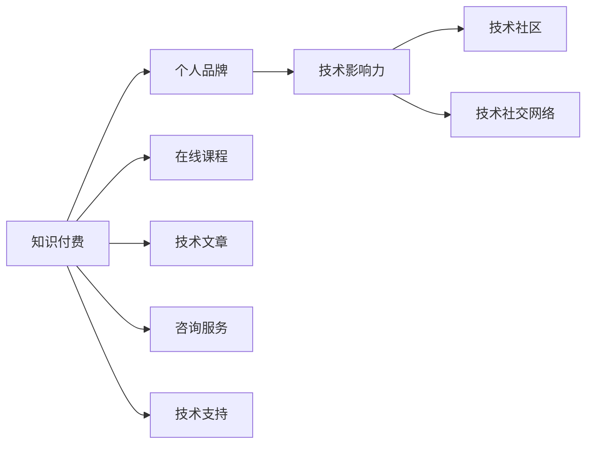

                 

# 程序员利用知识付费打造个人影响力的策略

> 关键词：知识付费, 个人品牌, 影响力, 程序员, 技术博客, 知识分享, 在线课程, 社区贡献, 技术社交网络

## 1. 背景介绍

在互联网时代，个人品牌和技术影响力成为程序员在职业生涯中不可或缺的重要资产。利用知识付费成为许多技术专家、程序员和从业者增强个人品牌和影响力的重要手段。通过提供有价值的内容、构建知识社区、参与技术讨论和交流，可以显著提升自己在技术圈中的地位，获得更多职业发展机会。本文将深入探讨程序员如何利用知识付费策略，打造个人品牌和技术影响力，促进职业生涯的持续成长。

## 2. 核心概念与联系

### 2.1 核心概念概述

为深入理解程序员如何利用知识付费打造个人影响力，本节将介绍几个核心概念：

- **知识付费**：即通过付费形式获取高质量知识和服务，涵盖线上课程、专业文章、咨询服务、技术支持等多种形式。知识付费平台如Udemy、Coursera、CSDN、知乎live等成为技术社区的常见形式。
- **个人品牌**：指个体在职业和社会中的知名度、认知度和美誉度，通过一系列专业行为和突出成果来建立。在技术领域，个人品牌通常与技术专业、创新能力、社会责任感等形象紧密相关。
- **技术影响力**：指在技术社区和行业中发挥引领和影响作用的能力，包括对技术趋势的预测、对新技术的普及、对技术问题解决的影响等。
- **技术社区**：围绕技术和知识交流而形成的线上或线下社群，如Stack Overflow、GitHub、技术论坛等，是程序员学习和分享的主要场所。
- **技术社交网络**：即通过技术和知识为核心联结的社交关系网络，如LinkedIn、GitHub等，是展示个人专业技能和影响力的重要平台。

这些核心概念之间存在紧密联系，共同构成程序员利用知识付费策略、打造个人品牌和技术影响力的基础。

### 2.2 核心概念原理和架构的 Mermaid 流程图



此图展示了知识付费与个人品牌、技术影响力之间的逻辑关系，以及它们在技术社区和技术社交网络中的应用。

## 3. 核心算法原理 & 具体操作步骤

### 3.1 算法原理概述

程序员利用知识付费打造个人影响力，本质上是一个多目标优化过程，旨在通过高质量的内容输出、社区互动和持续学习，不断提升个人品牌的知名度和美誉度，同时增强技术影响力。这一过程可以通过以下几个核心算法来实现：

1. **内容输出算法**：通过定期发布高质量的技术文章、编写开源项目、参与技术讨论，积累和展示技术知识和见解。
2. **社区互动算法**：通过在技术社区中积极回答问题、提供技术支持、参与技术讨论，增强技术影响力和社区认同感。
3. **持续学习算法**：通过参加在线课程、读书笔记、技术讲座等形式，不断学习新技术和知识，保持技术领先。
4. **影响力扩散算法**：通过技术博客、社交媒体、技术社区等渠道，将个人知识和影响力扩散至更广泛的受众。

### 3.2 算法步骤详解

**Step 1: 确定个人品牌定位**
- 明确个人技术专长和兴趣领域。
- 设定清晰的品牌定位和目标受众。
- 根据个人兴趣和专长，选择合适的知识付费形式。

**Step 2: 内容输出**
- 定期发布技术文章或博客，分享技术见解和经验。
- 编写和维护开源项目，展示技术能力和团队合作精神。
- 参与技术讨论和社区活动，提供技术解答和支持。

**Step 3: 社区互动**
- 在技术社区（如Stack Overflow、GitHub）上积极回答问题和提供帮助。
- 参与技术会议和沙龙，分享技术经验和见解。
- 加入技术社交网络（如LinkedIn、GitHub），展示个人专业技能和项目成果。

**Step 4: 持续学习**
- 报名参加线上和线下课程，掌握最新技术和知识。
- 阅读技术书籍、研究论文，深入理解技术原理和应用。
- 参与技术讲座和培训，学习行业动态和前沿技术。

**Step 5: 影响力扩散**
- 在技术博客、社交媒体上定期发布技术文章和项目进展。
- 在技术社区和社交网络上分享个人经验和成果，吸引更多关注。
- 参与技术竞赛和挑战，展示个人能力和技术实力。

### 3.3 算法优缺点

利用知识付费打造个人影响力具有以下优点：
1. 提升专业水平：通过参与线上课程和项目，不断学习和实践，提升技术能力和水平。
2. 扩大影响范围：通过在线平台和社交网络，可以将个人知识和影响力传播至更多受众。
3. 获取职业机会：高质量的内容和互动，可以吸引更多的技术合作和职业机会。
4. 增强社区认同：在技术社区中积极参与和贡献，获得更多认同感和归属感。

然而，知识付费策略也存在以下缺点：
1. 时间成本高：高质量内容产出和社区互动需要大量时间和精力。
2. 经济压力：高品质的课程和项目往往需要投入更多资金。
3. 市场竞争激烈：技术社区和社交网络中，技术专家众多，如何脱颖而出是一大挑战。
4. 持续创新难：需要不断学习新技术和知识，才能保持竞争优势。

### 3.4 算法应用领域

利用知识付费策略，程序员可以在以下领域发挥作用：
1. **技术教育**：通过在线课程和培训，传授技术知识，培养新手和同行。
2. **技术咨询**：提供专业技术建议和解决方案，帮助企业和项目解决技术难题。
3. **技术创新**：推动技术创新和应用，促进技术产业的发展。
4. **技术社群**：构建和维护技术社区和社交网络，促进技术交流和合作。
5. **技术宣传**：通过技术博客和社交媒体，宣传新技术和趋势，影响行业发展方向。

## 4. 数学模型和公式 & 详细讲解 & 举例说明

### 4.1 数学模型构建

为更好地描述知识付费策略对个人品牌和技术影响力的影响，我们可以构建如下数学模型：

假设 $X_t$ 为第 $t$ 时间点个人品牌的影响力，$C_t$ 为第 $t$ 时间点知识付费的投入，$\alpha$ 为影响力提升系数，$\beta$ 为投入回报系数。则个人品牌影响力的增长可以用如下微分方程描述：

$$
\frac{dX_t}{dt} = \alpha C_t + \sigma \epsilon_t
$$

其中 $\epsilon_t$ 为随机扰动项。

### 4.2 公式推导过程

通过对方程求解，可以得出个人品牌影响力的变化规律：

$$
X_t = X_0 e^{\alpha t} + \int_0^t \sigma e^{\alpha (t-u)} \epsilon_u du
$$

其中 $X_0$ 为初始影响力，$e^{\alpha t}$ 为投入对影响力的直接提升，$\sigma e^{\alpha (t-u)} \epsilon_u$ 为随机扰动项对影响力的影响。

### 4.3 案例分析与讲解

以某技术专家通过知识付费策略提升影响力的案例为例：
- 初始影响力 $X_0 = 100$。
- 每年投入 $C_t = 10000$。
- 影响力提升系数 $\alpha = 0.1$，投入回报系数 $\beta = 0.2$。
- 随机扰动项标准差 $\sigma = 5$。

通过计算，可以得出该技术专家10年后影响力的变化情况。

## 5. 项目实践：代码实例和详细解释说明

### 5.1 开发环境搭建

在进行知识付费策略实践前，我们需要准备好开发环境。以下是使用Python进行Jupyter Notebook开发的环境配置流程：

1. 安装Anaconda：从官网下载并安装Anaconda，用于创建独立的Python环境。
2. 创建并激活虚拟环境：
```bash
conda create -n myenv python=3.8 
conda activate myenv
```

3. 安装Jupyter Notebook：
```bash
pip install jupyter notebook
```

4. 配置Notebook服务器：
```bash
jupyter notebook --allow-root
```

完成上述步骤后，即可在`myenv`环境中开始知识付费策略的实践。

### 5.2 源代码详细实现

下面以一位技术专家通过在线课程和开源项目提升个人品牌影响力的实践为例，给出Jupyter Notebook代码实现。

首先，定义影响力提升系数、投入回报系数和随机扰动项标准差：

```python
import sympy as sp

alpha = sp.symbols('alpha')
beta = sp.symbols('beta')
sigma = sp.symbols('sigma')

# 初始影响力
X_0 = 100

# 每年投入
C_t = 10000

# 影响力提升系数
alpha_value = 0.1

# 投入回报系数
beta_value = 0.2

# 随机扰动项标准差
sigma_value = 5
```

然后，使用Sympy求解微分方程，计算10年后的影响力变化：

```python
t = sp.symbols('t')
X_t = X_0 * sp.exp(alpha_value * t) + sp.integrate(sigma_value * sp.exp(alpha_value * (t - u)), (u, 0, t))

# 计算10年后的影响力
X_10 = X_t.subs({t: 10})
X_10
```

最后，输出10年后的影响力变化：

```python
print(f"10年后影响力变化为: {X_10}")
```

### 5.3 代码解读与分析

这段代码通过Sympy求解微分方程，模拟了技术专家通过知识付费策略提升个人品牌影响力的过程。具体解读如下：

**X_0, C_t, alpha, beta, sigma**：分别表示初始影响力、每年投入、影响力提升系数、投入回报系数和随机扰动项标准差。

**X_t**：第 $t$ 时间点的影响力，通过微分方程描述影响力变化。

**X_10**：计算10年后的影响力变化，通过求解微分方程并代入具体值得到。

**代码输出**：打印输出10年后的影响力变化情况，直观展示知识付费策略的效果。

## 6. 实际应用场景

### 6.1 技术教育

许多技术专家通过在线课程和培训，传授编程、算法、数据科学等技术知识，获得了广泛的影响力。如Udemy上的“Deep Learning A-Z™: Hands-On Python & TensorFlow”课程，通过高质量内容吸引了数万学员，提升了作者在技术教育领域的地位。

### 6.2 技术咨询

技术专家利用其在特定领域的技术积累，提供专业咨询服务，帮助企业解决技术难题，提升品牌影响力。如一位数据库专家通过在线技术咨询平台，解答数百家企业的技术问题，积累了大量用户好评，逐渐在数据库领域建立了良好的声誉。

### 6.3 技术创新

许多技术专家通过参与开源项目和创新技术，展示了个人能力和技术实力，提升了在技术社区中的影响力。如在GitHub上贡献数万行代码，推动了某开源框架的快速发展和广泛应用，成为该领域的重要贡献者。

### 6.4 未来应用展望

未来，知识付费策略将更加多元化和个性化。以下几种趋势值得关注：

1. **AI与知识付费结合**：利用AI生成个性化课程和推荐，提升学习体验。
2. **多渠道分发**：通过短视频、音频、图文等多种形式，增强知识传播的广度和深度。
3. **社区互动加强**：通过社交媒体和社区平台，加强知识互动和交流，提升个人影响力和社区认同感。
4. **在线直播课程**：利用实时互动和互动直播，提升学习效果和参与感。
5. **知识付费工具**：利用智能推荐系统、虚拟助手等工具，提供更高效的知识服务。

## 7. 工具和资源推荐

### 7.1 学习资源推荐

为帮助程序员系统掌握知识付费策略的理论基础和实践技巧，这里推荐一些优质的学习资源：

1. **《知识付费：技术专家打造个人品牌的实用指南》**：该书系统介绍了知识付费的原理、策略和案例，适合技术从业者参考。
2. **Coursera《技术教育和知识传播》课程**：由斯坦福大学教授讲授，涵盖技术教育、知识传播、技术影响力等内容。
3. **LinkedIn Learning《知识付费策略》课程**：提供了关于知识付费的最新趋势、技术工具和实践技巧。
4. **知乎技术专栏**：涵盖技术教育、知识付费、技术社交网络等多个方面的文章，汇聚了大量技术专家的经验和见解。

通过对这些资源的学习实践，相信你一定能够系统掌握知识付费策略的理论和实践，提升自己的技术品牌和技术影响力。

### 7.2 开发工具推荐

高效的开发离不开优秀的工具支持。以下是几款用于知识付费策略开发的常用工具：

1. **Jupyter Notebook**：免费的开源笔记本，支持Python、R等多种语言，适合数据分析和计算。
2. **VS Code**：功能强大的轻量级代码编辑器，支持智能代码补全、调试等功能。
3. **GitHub**：全球最大的开源平台，支持版本控制和代码协作，是展示开源项目和贡献社区的重要场所。
4. **Google Colab**：免费的在线Jupyter Notebook环境，支持GPU和TPU资源，适合复杂计算和大模型实验。

合理利用这些工具，可以显著提升知识付费策略的开发效率，加快创新迭代的步伐。

### 7.3 相关论文推荐

知识付费策略的研究源于学界的持续探索。以下是几篇奠基性的相关论文，推荐阅读：

1. **《知识付费：技术教育和知识传播的变革》**：探讨知识付费在技术教育和知识传播中的应用和影响。
2. **《在线课程设计与评估》**：介绍在线课程的开发和评估方法，提升课程质量。
3. **《知识社区分析与治理》**：研究技术社区的演化和治理机制，促进社区健康发展。
4. **《技术社交网络分析与建模》**：利用社交网络分析技术，提升技术专家的可见度和影响力。
5. **《知识付费模型与算法研究》**：探讨知识付费的经济模型和算法，优化知识付费的效果。

这些论文代表了大规模知识付费策略的发展脉络。通过学习这些前沿成果，可以帮助研究者把握学科前进方向，激发更多的创新灵感。

## 8. 总结：未来发展趋势与挑战

### 8.1 总结

本文对程序员如何利用知识付费策略打造个人品牌和技术影响力进行了全面系统的介绍。首先阐述了知识付费在提升个人品牌和技术影响力方面的重要性，明确了知识付费在技术教育、技术咨询、技术创新等领域的应用价值。其次，从原理到实践，详细讲解了知识付费的数学模型和算法步骤，提供了具体案例分析。同时，本文还探讨了知识付费在未来应用场景中的发展趋势，以及面临的挑战和应对策略。

通过本文的系统梳理，可以看到，知识付费策略已成为程序员提升个人品牌和技术影响力的重要手段。通过高质量的内容输出、社区互动和持续学习，程序员可以在技术领域建立独特的技术身份和品牌，获得更多的职业机会和发展空间。未来，随着AI技术、社交媒体和开源社区的进一步发展，知识付费策略将更加多元化和个性化，为程序员提供更多的成长路径和发展机会。

### 8.2 未来发展趋势

展望未来，知识付费策略将呈现以下几个发展趋势：

1. **AI驱动的内容定制**：利用AI技术，根据用户偏好和学习习惯，生成个性化的学习内容和推荐，提升学习效果和体验。
2. **社交媒体的融合**：将知识付费与社交媒体深度结合，通过互动直播、短视频、图文等多种形式，增强知识传播的广度和深度。
3. **开源社区的增强**：通过开源项目和代码贡献，展示技术实力和创新能力，提升在技术社区中的影响力。
4. **跨平台分发**：通过多个平台（如Udemy、Coursera、知乎、B站等）分发内容，扩大受众范围。
5. **教育与培训的融合**：将知识付费与企业培训和职业发展相结合，提供系统化和持续化的技术培训。

这些趋势凸显了知识付费策略的广阔前景，为程序员提供了更多展示技术能力和品牌影响力的舞台。

### 8.3 面临的挑战

尽管知识付费策略在提升个人品牌和技术影响力方面发挥了重要作用，但在实施过程中，仍面临诸多挑战：

1. **内容质量控制**：高质量内容的产出需要大量时间和精力，如何保证内容质量和持续性是一大挑战。
2. **市场竞争激烈**：技术社区和社交媒体中，知识付费内容供给丰富，如何在激烈竞争中脱颖而出是一大难题。
3. **用户需求变化**：技术领域日新月异，用户需求不断变化，如何保持内容的相关性和前瞻性是一大挑战。
4. **用户互动不足**：知识付费平台多为单向传播，缺乏用户互动和反馈，难以形成有效的知识传播和反馈机制。
5. **经济效益评估**：知识付费的经济效益评估复杂，如何衡量和最大化收益是一大挑战。

### 8.4 研究展望

面对知识付费策略面临的种种挑战，未来的研究需要在以下几个方面寻求新的突破：

1. **内容生成技术**：利用AI技术生成高质量内容，提升内容产出效率。
2. **多平台分发策略**：通过多渠道分发，最大化用户覆盖和影响力。
3. **社区互动机制**：设计有效的社区互动机制，提升用户参与度和满意度。
4. **经济效益模型**：建立科学合理的经济效益模型，评估和优化知识付费策略。
5. **技术交流平台**：构建技术交流平台，促进知识传播和创新合作。

这些研究方向的探索，将引领知识付费策略向更高的台阶，为程序员提供更多的成长路径和发展机会。面向未来，知识付费策略需要与其他技术和平台进行更深入的融合，共同推动技术教育和知识传播的进步。总之，知识付费策略需要程序员不断创新、持续优化，方能真正实现技术品牌和技术影响力的提升。

## 9. 附录：常见问题与解答

**Q1: 知识付费策略是否适用于所有程序员？**

A: 知识付费策略在提升个人品牌和技术影响力方面具有显著效果，但并非适用于所有程序员。对内容输出能力和社交互动能力要求较高，需要投入大量时间和精力。对于技术水平较高、兴趣广泛、社交能力较强的程序员，知识付费策略将是提升个人影响力的有效手段。

**Q2: 如何平衡知识付费投入和产出？**

A: 知识付费投入和产出平衡的关键在于高质量内容产出和社区互动。建议定期更新技术文章，积极参与社区讨论，提供技术支持和解答问题，积累用户好评和影响力。同时，通过调研用户需求和反馈，不断优化和调整内容策略，提升用户满意度和忠诚度。

**Q3: 如何选择合适的知识付费平台？**

A: 选择合适的知识付费平台需考虑其用户规模、内容质量、互动机制、收益分配等因素。建议选择用户规模较大、内容质量高、互动机制完善的平台，如Coursera、Udemy、知乎、GitHub等，这些平台提供了较为完善的用户互动和反馈机制，有助于提升个人品牌和技术影响力。

**Q4: 如何提升内容输出质量和用户参与度？**

A: 提升内容输出质量和用户参与度的关键在于持续学习和创新。建议多关注技术前沿和行业动态，不断更新知识储备。同时，利用社交媒体和社区平台，积极与用户互动和交流，获取反馈和建议，不断改进和优化内容策略。

**Q5: 如何评估知识付费策略的效果？**

A: 知识付费策略的效果评估可以从多个维度进行，包括用户好评、互动次数、课程订阅量、收益回报等。建议建立科学的评估指标体系，定期评估和调整策略，确保最大化效果和收益。

---

作者：禅与计算机程序设计艺术 / Zen and the Art of Computer Programming

