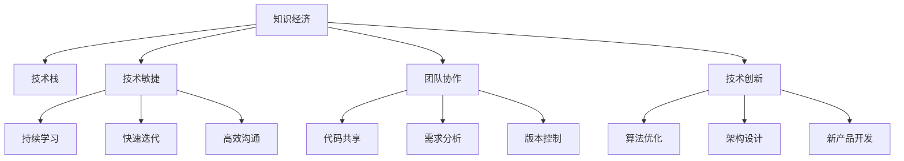

                 

# 程序员在知识经济时代的发展方向

在当今社会，知识经济时代已经到来，信息技术的快速发展、互联网的普及以及大数据、人工智能等新兴技术的崛起，对程序员的职业发展带来了前所未有的机遇与挑战。本文将从背景介绍、核心概念与联系、核心算法原理与操作步骤、数学模型与公式、项目实践、实际应用场景、工具与资源推荐、未来发展趋势与挑战以及常见问题与解答等几个方面，系统阐述程序员在知识经济时代的发展方向。

## 1. 背景介绍

### 1.1 问题由来

随着信息技术的飞速发展，程序员作为推动技术创新的核心力量，其职业角色和技能需求也在不断演变。知识经济时代，信息技术的普及应用日益广泛，各行各业对技术的需求日益增长，程序员面临着巨大的市场需求和竞争压力。同时，新技术的层出不穷，如人工智能、大数据、区块链等，也对程序员提出了更高的要求。

### 1.2 问题核心关键点

程序员在知识经济时代的核心挑战在于如何适应技术变革，提升自我能力，应对职业发展中的不确定性。如何学习新技术，如何在复杂多变的技术环境中保持竞争力和创新力，是每个程序员必须面对的问题。本文将探讨如何通过系统学习、实践探索、持续更新等途径，应对这些挑战，实现个人职业发展的目标。

## 2. 核心概念与联系

### 2.1 核心概念概述

为更好地理解程序员在知识经济时代的发展方向，本文将介绍几个关键概念：

- 知识经济（Knowledge Economy）：以知识和信息为核心的经济模式，强调知识与技术的创新、应用与传播。
- 技术栈（Technical Stack）：指开发项目或服务所需的技术工具和框架的集合，如编程语言、框架、库等。
- 技术敏捷（Technical Agility）：指技术人员快速适应新技术、新需求的能力，包括持续学习、快速迭代、高效沟通等。
- 团队协作（Team Collaboration）：指技术人员在团队中的协同工作能力，包括代码共享、需求分析、版本控制等。
- 技术创新（Technological Innovation）：指技术人员推动技术进步的能力，包括算法优化、架构设计、新产品开发等。

这些核心概念之间的逻辑关系可以通过以下Mermaid流程图来展示：



这个流程图展示了知识经济时代下，程序员所需掌握的关键能力和技术栈，以及不同能力之间的关系。

## 3. 核心算法原理 & 具体操作步骤

### 3.1 算法原理概述

知识经济时代，程序员需要掌握的核心算法原理包括但不限于以下几个方面：

- 数据结构与算法：包括数组、链表、栈、队列、树、图等数据结构，以及排序、查找、递归、回溯等经典算法。
- 设计模式：如单例模式、工厂模式、观察者模式等，帮助解决复杂的软件设计问题。
- 软件工程：包括需求分析、设计、实现、测试、部署、维护等软件开发全生命周期的管理与优化。
- 人工智能与机器学习：掌握基本的统计学知识，理解监督学习、非监督学习、强化学习等基本概念和算法，能够在实际项目中应用相关技术。
- 大数据技术：如Hadoop、Spark、Flink等，能够处理大规模数据，进行数据分析和挖掘。

### 3.2 算法步骤详解

程序员在知识经济时代的发展，主要遵循以下步骤：

**Step 1: 技能学习与实践**

- 选择学习方向：如Web开发、移动应用开发、游戏开发、大数据、人工智能等。
- 学习基础知识：掌握编程语言（如Python、Java、C++等）、数据结构与算法、设计模式等。
- 实践项目：通过实际项目进行实践，提升技术能力和问题解决能力。

**Step 2: 持续学习与更新**

- 持续学习：定期学习新技术、新框架，参加相关培训和会议。
- 参与开源项目：通过参与开源项目，了解行业最新动态，提升技术水平。
- 论文阅读与研究：阅读相关论文，跟踪领域前沿研究，积累创新思路。

**Step 3: 技术创新与应用**

- 技术创新：推动技术进步，提出新技术、新算法、新架构。
- 项目实践：将技术创新应用到实际项目中，解决实际问题，提升项目成功率。
- 技术分享：通过技术博客、开源社区等渠道，分享技术经验和成果。

### 3.3 算法优缺点

知识经济时代，程序员需要掌握的核心算法与实践操作具有以下优点：

- 提升技术竞争力：掌握多种编程语言和技术栈，能够应对各种技术挑战。
- 推动技术进步：持续学习与技术创新，推动技术进步和行业发展。
- 增强问题解决能力：通过实践项目和开源项目，积累问题解决经验。

同时，也存在一些缺点：

- 学习成本高：新技术、新框架层出不穷，学习周期较长。
- 知识更新快：技术更新速度快，需要不断跟进，否则容易落后。
- 市场竞争激烈：技术人才竞争激烈，需要不断提升自我能力。

### 3.4 算法应用领域

知识经济时代，程序员在多个领域都有广泛的应用，例如：

- 软件开发：Web开发、移动应用开发、游戏开发、桌面应用开发等。
- 大数据与人工智能：数据挖掘、机器学习、自然语言处理、图像识别等。
- 区块链与加密货币：区块链开发、智能合约开发、加密货币交易等。
- 物联网与智能硬件：智能家居、可穿戴设备、智能汽车等。
- 自动化与机器人：自动化流程、机器人技术、自动驾驶等。

这些领域都需要程序员具备广泛的技术能力，能够在多个技术栈之间进行灵活切换，以应对不同项目的需求。

## 4. 数学模型和公式 & 详细讲解 & 举例说明

### 4.1 数学模型构建

在知识经济时代，程序员需要掌握的数学模型和公式包括但不限于以下几个方面：

- 统计学：掌握概率论、统计推断、假设检验等基本概念和方法。
- 线性代数：理解向量、矩阵、线性方程组、特征值、特征向量等基本概念和运算。
- 微积分：理解导数、积分、微分方程等基本概念和方法。
- 概率图模型：如贝叶斯网络、隐马尔可夫模型、条件随机场等，用于建模和推理。

### 4.2 公式推导过程

以贝叶斯网络为例，展示其公式推导过程：

- 定义：贝叶斯网络是一种概率图模型，用于表示变量之间的依赖关系。
- 公式：$P(X_i|X_{-i},Y) = \frac{P(X_i|X_{-i})P(Y|X_{-i})}{P(Y|X_{-i})}$
- 推导：从条件概率公式和贝叶斯定理推导得到。

### 4.3 案例分析与讲解

以自然语言处理（NLP）中的情感分析为例，展示如何在实践中应用数学模型：

- 数据准备：收集电影评论数据，进行数据预处理。
- 模型构建：使用逻辑回归、朴素贝叶斯、支持向量机等算法，构建情感分析模型。
- 公式应用：使用公式$P(\text{正向情感}|文本) = \frac{P(\text{正向情感})P(文本|\text{正向情感})}{P(文本)}$，计算情感分类概率。

## 5. 项目实践：代码实例和详细解释说明

### 5.1 开发环境搭建

进行项目实践前，需要搭建好开发环境。以下是Python开发环境的配置流程：

1. 安装Anaconda：从官网下载并安装Anaconda，用于创建独立的Python环境。
2. 创建并激活虚拟环境：
```bash
conda create -n my_env python=3.8
conda activate my_env
```

3. 安装Python包：
```bash
pip install numpy pandas matplotlib scikit-learn
```

### 5.2 源代码详细实现

以下是Python代码示例，实现一个简单的Web应用：

```python
from flask import Flask, request, render_template

app = Flask(__name__)

@app.route('/')
def index():
    return render_template('index.html')

@app.route('/result', methods=['POST'])
def result():
    name = request.form.get('name')
    age = request.form.get('age')
    result = f'Hello {name}, you are {age} years old.'
    return result

if __name__ == '__main__':
    app.run(debug=True)
```

### 5.3 代码解读与分析

- 使用Flask框架：Flask是一个轻量级的Web框架，用于快速开发Web应用。
- 路由配置：`@app.route`装饰器用于定义路由，`/`表示首页，`/result`表示结果页。
- 视图函数：`index`函数处理首页请求，`result`函数处理结果页请求。
- 模板渲染：`render_template`函数用于渲染HTML模板，将数据动态插入到页面中。
- 表单处理：`request.form`获取提交的表单数据。

### 5.4 运行结果展示

运行上述代码，在浏览器中输入`localhost:5000`，即可访问Web应用。输入姓名和年龄，提交表单后，即可看到个性化的欢迎信息。

## 6. 实际应用场景

### 6.1 智能客服系统

在智能客服系统中，程序员可以应用机器学习、自然语言处理等技术，构建智能客服机器人，提升客户服务效率和满意度。具体应用包括：

- 自然语言理解：使用BERT、GPT等预训练模型，构建智能客服对话系统，理解客户意图。
- 对话管理：设计对话管理策略，实现多轮对话处理，提供个性化服务。
- 情感分析：使用情感分析模型，分析客户情感，及时调整服务策略。

### 6.2 金融科技

在金融科技领域，程序员可以应用区块链、大数据等技术，构建金融应用系统，提升金融服务的智能化水平。具体应用包括：

- 区块链应用：构建智能合约、去中心化应用（DApp），提高金融交易的安全性和透明度。
- 数据分析：使用大数据技术，分析交易数据，进行风险评估和预测。
- 个性化推荐：使用推荐算法，根据客户历史行为，推荐个性化的金融产品。

### 6.3 医疗健康

在医疗健康领域，程序员可以应用人工智能、大数据等技术，构建医疗应用系统，提升医疗服务的智能化水平。具体应用包括：

- 医学影像分析：使用深度学习模型，分析医学影像，辅助医生诊断。
- 健康管理：使用智能穿戴设备，监测健康数据，提供个性化健康管理建议。
- 药物研发：使用生成对抗网络（GAN）等技术，加速新药研发。

### 6.4 未来应用展望

未来，程序员在知识经济时代的发展将呈现以下几个趋势：

- 多领域跨界融合：程序员需要具备跨领域技术能力，能够整合不同领域的技术，构建创新性解决方案。
- 自动化与人工智能：程序员将更多地使用自动化工具和人工智能技术，提升工作效率和创新能力。
- 云计算与边缘计算：程序员需要掌握云计算和边缘计算技术，构建可扩展、高效的系统架构。
- 数据驱动决策：程序员需要具备数据处理和分析能力，能够基于数据进行决策和优化。

## 7. 工具和资源推荐

### 7.1 学习资源推荐

为了帮助程序员系统掌握相关技术，以下是一些推荐的学习资源：

- 《深度学习》（Ian Goodfellow等著）：全面介绍深度学习原理和应用。
- 《Python编程：从入门到实践》（Eric Matthes等著）：入门Python编程语言的经典教材。
- Coursera、Udacity等在线学习平台：提供丰富的编程课程和项目实践机会。
- GitHub开源社区：浏览和贡献开源项目，积累实际开发经验。

### 7.2 开发工具推荐

以下是一些推荐的开发工具：

- Python：功能强大、灵活性高的编程语言，适用于多种开发任务。
- Flask、Django等Web框架：快速构建Web应用，简化开发流程。
- Git：版本控制系统，便于团队协作和代码管理。
- Docker、Kubernetes等容器化工具：提升应用的部署和运维效率。

### 7.3 相关论文推荐

以下是几篇相关论文，推荐阅读：

- "Deep Learning"（Goodfellow等著）：深度学习领域的经典教材，涵盖深度学习的基本概念和算法。
- "Natural Language Processing with Python"（Bird等著）：使用Python实现NLP任务的经典教材。
- "Programming: Principles and Practice Using Python"（Flanagan著）：适合初学者的Python编程教材。

## 8. 总结：未来发展趋势与挑战

### 8.1 研究成果总结

本文系统阐述了程序员在知识经济时代的发展方向，介绍了知识经济时代对程序员的新要求，以及如何在技术变革中不断提升自我能力。

### 8.2 未来发展趋势

未来，程序员在知识经济时代的发展将呈现以下几个趋势：

- 技术栈多样化：程序员需要掌握多种编程语言和技术栈，提升技术竞争力。
- 持续学习与更新：新技术层出不穷，程序员需要持续学习，跟上技术发展步伐。
- 技术创新与应用：通过技术创新和项目实践，推动技术进步和行业发展。

### 8.3 面临的挑战

程序员在知识经济时代面临的挑战包括：

- 学习成本高：新技术不断涌现，学习周期较长。
- 知识更新快：技术更新速度快，需要不断跟进，否则容易落后。
- 市场竞争激烈：技术人才竞争激烈，需要不断提升自我能力。

### 8.4 研究展望

未来，程序员需要关注以下研究方向：

- 多领域跨界融合：整合不同领域的技术，构建创新性解决方案。
- 自动化与人工智能：提升工作效率和创新能力。
- 云计算与边缘计算：构建可扩展、高效的系统架构。
- 数据驱动决策：基于数据进行决策和优化。

## 9. 附录：常见问题与解答

**Q1：程序员需要具备哪些核心能力？**

A: 程序员需要具备以下核心能力：

- 编程语言：掌握Python、Java、C++等主流编程语言。
- 数据结构与算法：掌握数组、链表、栈、队列、树、图等数据结构，以及排序、查找、递归、回溯等算法。
- 设计模式：掌握单例模式、工厂模式、观察者模式等设计模式。
- 软件工程：掌握软件开发全生命周期的管理与优化。
- 人工智能与机器学习：掌握概率论、统计学、线性代数、微积分等基础知识，理解监督学习、非监督学习、强化学习等基本概念和算法。
- 大数据技术：掌握Hadoop、Spark、Flink等大数据技术。

**Q2：如何提升技术敏捷性？**

A: 提升技术敏捷性需要以下几个步骤：

- 持续学习：定期学习新技术、新框架，参加相关培训和会议。
- 参与开源项目：通过参与开源项目，了解行业最新动态，提升技术水平。
- 论文阅读与研究：阅读相关论文，跟踪领域前沿研究，积累创新思路。

**Q3：如何在团队中有效协作？**

A: 在团队中有效协作需要以下几个方面：

- 代码共享：使用版本控制系统（如Git）进行代码管理，便于团队协作。
- 需求分析：明确项目需求和目标，制定详细的需求文档。
- 版本控制：使用版本控制系统进行代码管理，记录代码变更历史。
- 沟通协作：使用即时通讯工具（如Slack）进行沟通，使用项目管理工具（如Jira）进行任务分配和进度跟踪。

**Q4：如何保持技术竞争力？**

A: 保持技术竞争力需要以下几个方面：

- 持续学习：定期学习新技术、新框架，参加相关培训和会议。
- 参与开源项目：通过参与开源项目，了解行业最新动态，提升技术水平。
- 论文阅读与研究：阅读相关论文，跟踪领域前沿研究，积累创新思路。
- 项目实践：通过实际项目进行实践，提升技术能力和问题解决能力。

---

作者：禅与计算机程序设计艺术 / Zen and the Art of Computer Programming

