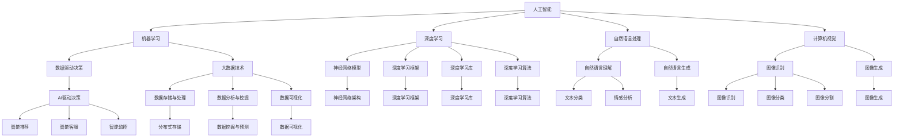

                 

# 程序员在知识经济时代的发展机会

## 1. 背景介绍

### 1.1 问题由来

随着知识经济时代的到来，人工智能（AI）、大数据、云计算等技术正在深刻改变各行各业的运作方式。在新的技术浪潮下，程序员面临前所未有的发展机会。

程序员作为技术创新的核心力量，不仅能通过编程技能解决实际问题，还能利用数据和算法驱动决策，实现业务数字化转型。特别是近些年，深度学习、自然语言处理（NLP）、计算机视觉等AI技术的快速发展，为程序员提供了更多的技术挑战和职业发展方向。

### 1.2 问题核心关键点

1. **AI与大数据技术的发展**：AI和大数据技术的普及，为程序员提供了丰富的技术栈和工具集，帮助他们构建更复杂、高效、智能的应用系统。

2. **云计算与平台技术**：云服务和微服务架构的流行，使得程序员能够更加便捷地构建、部署、运维复杂的应用系统，降低开发成本和风险。

3. **算法与数据科学的应用**：通过学习数据科学和算法知识，程序员可以提升技术深度，更好地理解和解决实际问题。

4. **开源社区的繁荣**：开源技术和框架的快速迭代和扩展，为程序员提供了更广泛的资源和工具，促进技术创新和协作。

5. **全栈与专业化的发展**：程序员可以选择专注于某一技术栈或全栈发展，适应不同规模和类型项目的需求。

### 1.3 问题研究意义

研究程序员在知识经济时代的发展机会，对于理解当前技术趋势、把握未来职业发展方向，具有重要意义：

1. **技术创新**：理解AI和大数据技术的发展，帮助程序员掌握最新技术，提升技术竞争力。
2. **职业发展**：了解不同技术栈和平台技术的应用，为程序员提供更多职业选择和发展路径。
3. **技能提升**：掌握数据科学和算法知识，提升问题解决能力和技术深度。
4. **社区参与**：参与开源社区，共享知识和资源，促进技术交流和创新。
5. **行业适应**：理解和应对行业变革，把握数字化转型的机会，实现技术与业务的深度融合。

## 2. 核心概念与联系

### 2.1 核心概念概述

在探讨程序员在知识经济时代的发展机会时，我们需要掌握几个关键概念：

- **人工智能（AI）**：涵盖机器学习、深度学习、自然语言处理等技术，利用算法和数据模型解决复杂问题。
- **大数据技术**：涉及数据收集、存储、处理和分析，利用数据驱动决策和优化。
- **云计算**：提供弹性计算资源和平台服务，支持大规模应用系统的构建和部署。
- **开源社区**：提供开放资源和技术栈，促进技术交流和协作，推动技术进步。
- **全栈与专业化**：根据项目需求选择技术栈和技能，提升技术深度和广度。

### 2.2 核心概念原理和架构的 Mermaid 流程图



## 3. 核心算法原理 & 具体操作步骤

### 3.1 算法原理概述

在知识经济时代，程序员需要掌握多种算法和数据处理技术，以构建复杂、高效的应用系统。以下是几种核心算法及其原理概述：

- **深度学习算法**：如卷积神经网络（CNN）、循环神经网络（RNN）、变压器（Transformer）等，用于图像识别、自然语言处理等任务。
- **机器学习算法**：如决策树、随机森林、支持向量机（SVM）等，用于分类、回归、聚类等任务。
- **自然语言处理技术**：如分词、命名实体识别（NER）、情感分析等，用于文本处理和分析。
- **计算机视觉技术**：如图像识别、目标检测、图像生成等，用于图像处理和理解。

### 3.2 算法步骤详解

以深度学习算法为例，常见的深度学习项目开发步骤如下：

1. **数据准备**：收集和处理训练数据，生成训练集、验证集和测试集。
2. **模型选择**：根据任务需求选择合适的深度学习模型，如CNN、RNN、Transformer等。
3. **模型训练**：使用训练集数据训练模型，调整超参数（如学习率、批大小等）。
4. **模型评估**：在验证集上评估模型性能，调整模型参数和结构。
5. **模型部署**：将训练好的模型部署到实际应用中，进行推理和预测。
6. **模型优化**：持续优化模型性能，适应数据和应用的变化。

### 3.3 算法优缺点

深度学习算法的优点包括：

- **自动化特征提取**：通过多层神经网络自动提取特征，无需手动设计特征。
- **高精度**：在处理大规模数据时，深度学习模型往往能取得较高的准确率。
- **应用广泛**：深度学习技术已经广泛应用于计算机视觉、自然语言处理、语音识别等领域。

缺点包括：

- **计算资源需求高**：深度学习模型通常需要较大的计算资源，如高性能GPU。
- **训练时间长**：深度学习模型训练时间较长，需要大量的数据和计算资源。
- **黑盒特性**：深度学习模型内部工作机制复杂，难以解释和调试。

### 3.4 算法应用领域

深度学习算法已经在许多领域得到了广泛应用，以下是几个典型应用领域：

- **计算机视觉**：如图像识别、目标检测、人脸识别等。
- **自然语言处理**：如文本分类、情感分析、机器翻译等。
- **语音识别**：如语音转文本、语音情感识别等。
- **推荐系统**：如电商推荐、音乐推荐、新闻推荐等。
- **金融分析**：如股票预测、信用评估、风险管理等。

## 4. 数学模型和公式 & 详细讲解 & 举例说明

### 4.1 数学模型构建

以卷积神经网络（CNN）为例，构建图像识别任务的数学模型。

**输入数据**：$x \in \mathbb{R}^m$，其中$m$为输入数据的维数。

**卷积层**：$y = W*x + b$，其中$W$为卷积核，$b$为偏置。

**激活函数**：$\sigma(y) = \max(0,y)$。

**池化层**：$\sigma_2(y) = \max(y)$。

**全连接层**：$z = W*h + b$，其中$h$为池化层的输出。

**输出层**：$y = W*z + b$，其中$z \in \mathbb{R}^n$，$y \in \mathbb{R}^k$。

### 4.2 公式推导过程

以卷积神经网络的前向传播为例，推导公式：

1. 卷积层前向传播：$y = W*x + b$。
2. 激活函数：$\sigma(y) = \max(0,y)$。
3. 池化层：$\sigma_2(y) = \max(y)$。
4. 全连接层前向传播：$z = W*h + b$。
5. 输出层：$y = W*z + b$。

其中，$x$为输入数据，$y$为输出数据，$W$为卷积核，$b$为偏置，$h$为卷积层的输出，$z$为全连接层的输入，$k$为输出类别数。

### 4.3 案例分析与讲解

以图像分类为例，假设输入数据为$x \in \mathbb{R}^{28 \times 28 \times 1}$，卷积核大小为$3 \times 3$，步长为$1$，激活函数为ReLU，池化窗口大小为$2 \times 2$，步长为$2$。使用4层卷积神经网络进行图像分类，计算前向传播过程。

```python
import torch
import torch.nn as nn

class CNN(nn.Module):
    def __init__(self):
        super(CNN, self).__init__()
        self.conv1 = nn.Conv2d(in_channels=1, out_channels=32, kernel_size=3, stride=1, padding=1)
        self.conv2 = nn.Conv2d(in_channels=32, out_channels=64, kernel_size=3, stride=1, padding=1)
        self.pool = nn.MaxPool2d(kernel_size=2, stride=2)
        self.fc1 = nn.Linear(in_features=64*6*6, out_features=256)
        self.fc2 = nn.Linear(in_features=256, out_features=10)
        
    def forward(self, x):
        x = torch.relu(self.conv1(x))
        x = self.pool(x)
        x = torch.relu(self.conv2(x))
        x = self.pool(x)
        x = x.view(-1, 64*6*6)
        x = torch.relu(self.fc1(x))
        x = self.fc2(x)
        return x

model = CNN()
x = torch.randn(1, 1, 28, 28)
output = model(x)
print(output.shape)
```

以上代码实现了一个4层卷积神经网络，输入数据为$x \in \mathbb{R}^{28 \times 28 \times 1}$，卷积核大小为$3 \times 3$，步长为$1$，激活函数为ReLU，池化窗口大小为$2 \times 2$，步长为$2$。前向传播过程中，首先通过两个卷积层提取特征，使用ReLU激活函数，再进行最大池化。最后，将池化层的输出展平，通过全连接层进行分类。输出结果的维度为$1 \times 10$，表示每个类别的预测概率。

## 5. 项目实践：代码实例和详细解释说明

### 5.1 开发环境搭建

在进行深度学习项目开发前，需要搭建良好的开发环境。以下是Python环境下安装和使用TensorFlow的步骤：

1. **安装Anaconda**：从官网下载并安装Anaconda，用于创建独立的Python环境。
2. **创建并激活虚拟环境**：
```bash
conda create -n tf-env python=3.8 
conda activate tf-env
```
3. **安装TensorFlow**：根据CUDA版本，从官网获取对应的安装命令。例如：
```bash
pip install tensorflow
```

### 5.2 源代码详细实现

以下是一个使用TensorFlow实现图像分类的代码实例，包含数据准备、模型定义、训练和评估等步骤。

```python
import tensorflow as tf
from tensorflow.keras import layers, models
from tensorflow.keras.datasets import mnist
from tensorflow.keras.utils import to_categorical

# 加载MNIST数据集
(x_train, y_train), (x_test, y_test) = mnist.load_data()
x_train = x_train.reshape(-1, 28, 28, 1)
x_test = x_test.reshape(-1, 28, 28, 1)
x_train, x_test = x_train / 255.0, x_test / 255.0

# 构建卷积神经网络模型
model = models.Sequential([
    layers.Conv2D(32, (3, 3), activation='relu', input_shape=(28, 28, 1)),
    layers.MaxPooling2D((2, 2)),
    layers.Conv2D(64, (3, 3), activation='relu'),
    layers.MaxPooling2D((2, 2)),
    layers.Flatten(),
    layers.Dense(64, activation='relu'),
    layers.Dense(10, activation='softmax')
])

# 编译模型
model.compile(optimizer='adam', loss='categorical_crossentropy', metrics=['accuracy'])

# 训练模型
model.fit(x_train, to_categorical(y_train), epochs=5, batch_size=64, validation_data=(x_test, to_categorical(y_test)))

# 评估模型
test_loss, test_acc = model.evaluate(x_test, to_categorical(y_test), verbose=2)
print('Test accuracy:', test_acc)
```

### 5.3 代码解读与分析

**数据准备**：首先，加载MNIST数据集，将图像数据展平为一维向量，并进行归一化处理。

**模型定义**：使用TensorFlow构建一个简单的卷积神经网络模型，包括两个卷积层和两个全连接层。

**模型编译**：编译模型，指定优化器、损失函数和评估指标。

**模型训练**：使用训练数据集训练模型，指定训练轮数和批次大小，并在验证集上评估模型性能。

**模型评估**：在测试数据集上评估模型性能，输出测试准确率。

## 6. 实际应用场景

### 6.1 智能推荐系统

智能推荐系统是知识经济时代的重要应用场景之一。通过深度学习算法和大数据技术，推荐系统能够分析用户的历史行为数据，生成个性化的推荐结果，提升用户体验和满意度。

在推荐系统开发中，程序员需要掌握以下技术：

- **数据处理与清洗**：收集和处理用户行为数据，生成训练集和测试集。
- **特征工程**：提取和构建用户行为特征，用于模型训练和预测。
- **深度学习模型**：如协同过滤、基于内容推荐、深度神经网络等，用于生成推荐结果。
- **模型评估与优化**：使用评估指标（如AUC、RMSE等）评估模型性能，进行模型调优。

### 6.2 智能客服系统

智能客服系统利用自然语言处理技术和深度学习算法，能够自动理解和回答用户问题，提升客服效率和用户体验。

在智能客服系统开发中，程序员需要掌握以下技术：

- **文本预处理**：对用户输入进行分词、去除停用词、实体识别等预处理。
- **对话模型**：使用RNN、Transformer等模型，生成对话回复。
- **情感分析**：使用深度学习模型，识别用户情感倾向，优化客服策略。
- **多轮对话管理**：设计对话管理策略，确保多轮对话连贯和上下文一致性。

### 6.3 金融风险管理

金融风险管理需要利用大数据和深度学习技术，实时监控市场动态，预测和防范金融风险。

在金融风险管理中，程序员需要掌握以下技术：

- **数据收集与处理**：收集市场数据、交易数据、财务数据等，生成训练集和测试集。
- **特征工程**：提取和构建风险相关特征，用于模型训练和预测。
- **深度学习模型**：如时间序列预测、异常检测、情感分析等，用于风险预警和防范。
- **模型评估与优化**：使用评估指标（如ROC、PR曲线）评估模型性能，进行模型调优。

### 6.4 未来应用展望

未来，随着AI和大数据技术的不断发展，程序员将面临更多的技术挑战和职业机会。以下是几个可能的应用方向：

- **自动驾驶**：利用计算机视觉和深度学习技术，实现自动驾驶。
- **医疗诊断**：利用深度学习算法，分析医学影像和电子病历，辅助医疗诊断。
- **智能家居**：利用自然语言处理和计算机视觉技术，实现智能家居控制和交互。
- **智慧城市**：利用大数据和深度学习技术，实现城市智能化管理和服务。

## 7. 工具和资源推荐

### 7.1 学习资源推荐

以下是一些推荐的深度学习和NLP学习资源：

- **深度学习入门教程**：Coursera、Udacity等在线课程，涵盖深度学习的基本概念和实践。
- **自然语言处理入门教程**：Stanford NLP课程、CS224N课程，介绍自然语言处理的基本概念和算法。
- **开源社区**：GitHub、Kaggle等平台，提供大量开源项目和数据集。
- **在线书籍**：《深度学习》、《自然语言处理综述》等书籍，深入浅出地介绍相关技术。

### 7.2 开发工具推荐

以下是一些推荐的深度学习和NLP开发工具：

- **深度学习框架**：TensorFlow、PyTorch、Keras等，提供丰富的深度学习模型和算法。
- **数据处理工具**：Pandas、NumPy、Scikit-learn等，用于数据清洗、特征工程和模型评估。
- **可视化工具**：TensorBoard、Matplotlib、Seaborn等，用于模型训练和结果展示。

### 7.3 相关论文推荐

以下是一些推荐的深度学习和NLP相关论文：

- **深度学习**：《Deep Learning》（Ian Goodfellow等著），全面介绍深度学习的基本概念和算法。
- **自然语言处理**：《Neural Network Models for Natural Language Processing》（Liu et al.），介绍自然语言处理的基本概念和算法。
- **计算机视觉**：《Convolutional Neural Networks for Visual Recognition》（Krizhevsky等著），介绍计算机视觉的基本概念和算法。

## 8. 总结：未来发展趋势与挑战

### 8.1 研究成果总结

本文介绍了程序员在知识经济时代的发展机会，探讨了AI、大数据、云计算等技术的应用。通过理论分析和项目实践，展示了深度学习、自然语言处理和计算机视觉等技术的核心算法和操作步骤。

### 8.2 未来发展趋势

未来的技术发展趋势包括：

- **AI技术的普及**：AI技术将在更多领域得到应用，如自动驾驶、医疗诊断、智能家居等。
- **大数据技术的深入应用**：大数据技术将提供更丰富的数据资源和分析工具，提升决策和优化能力。
- **云计算平台的发展**：云计算平台将提供更高效、便捷的计算资源和服务，支持大规模应用系统的构建和部署。

### 8.3 面临的挑战

程序员在知识经济时代面临的挑战包括：

- **技术变革速度快**：新技术不断涌现，程序员需要持续学习和适应。
- **项目规模复杂**：大型项目需要多技术栈和团队协作，程序员需要具备全面的技术能力。
- **数据安全和隐私**：大数据和AI技术的应用需要关注数据安全和隐私保护。

### 8.4 研究展望

未来的研究展望包括：

- **跨学科融合**：AI技术与各个学科的深度融合，推动技术和科学进步。
- **伦理和社会责任**：AI技术的伦理和社会责任问题需要引起重视，确保技术应用的正当性和安全性。
- **可持续发展**：AI技术的开发和应用需要考虑资源和环境因素，实现可持续发展。

## 9. 附录：常见问题与解答

**Q1：深度学习算法有哪些优点和缺点？**

A: 深度学习算法的优点包括：
- 自动化特征提取：通过多层神经网络自动提取特征，无需手动设计特征。
- 高精度：在处理大规模数据时，深度学习模型往往能取得较高的准确率。
- 应用广泛：深度学习技术已经广泛应用于计算机视觉、自然语言处理、语音识别等领域。

缺点包括：
- 计算资源需求高：深度学习模型通常需要较大的计算资源，如高性能GPU。
- 训练时间长：深度学习模型训练时间较长，需要大量的数据和计算资源。
- 黑盒特性：深度学习模型内部工作机制复杂，难以解释和调试。

**Q2：如何提升深度学习模型的性能？**

A: 提升深度学习模型性能的方法包括：
- 数据增强：通过数据扩充和增强，提高模型对数据变化的鲁棒性。
- 模型优化：调整模型结构和超参数，如学习率、批大小等。
- 正则化：使用L2正则、Dropout等技术，避免过拟合。
- 迁移学习：利用预训练模型，在大规模数据上进行微调，提升模型性能。
- 模型融合：将多个模型进行融合，提升模型的综合性能。

**Q3：深度学习算法在实际应用中需要注意哪些问题？**

A: 深度学习算法在实际应用中需要注意的问题包括：
- 数据质量：数据的质量和多样性直接影响模型性能，需要确保数据标注准确和完整。
- 模型复杂度：模型的复杂度需要根据任务需求和计算资源进行权衡。
- 模型部署：模型部署需要考虑硬件和软件资源，确保推理效率和稳定性。
- 模型监控：实时监控模型性能，及时发现和解决模型问题。

**Q4：如何在项目开发中高效利用开源社区资源？**

A: 高效利用开源社区资源的方法包括：
- 选择优秀开源项目：选择高质量的开源项目，避免使用陈旧或质量低劣的代码。
- 学习项目文档：详细阅读开源项目的文档，了解其使用方法和注意事项。
- 参与社区讨论：加入开源项目的社区，参与讨论和技术交流，解决项目问题。
- 贡献代码：在开源项目中贡献代码，提升自身技术能力和项目质量。

**Q5：如何应对快速发展的技术趋势？**

A: 应对快速发展的技术趋势的方法包括：
- 持续学习：通过在线课程、书籍和论文等资源，不断学习和掌握新知识。
- 技术实践：参与实际项目开发，将新知识应用于实际问题中。
- 技术交流：参加技术会议和社区活动，与同行交流技术经验和创新思路。
- 技术更新：关注技术博客和论坛，及时获取技术动态和行业趋势。

---

作者：禅与计算机程序设计艺术 / Zen and the Art of Computer Programming

