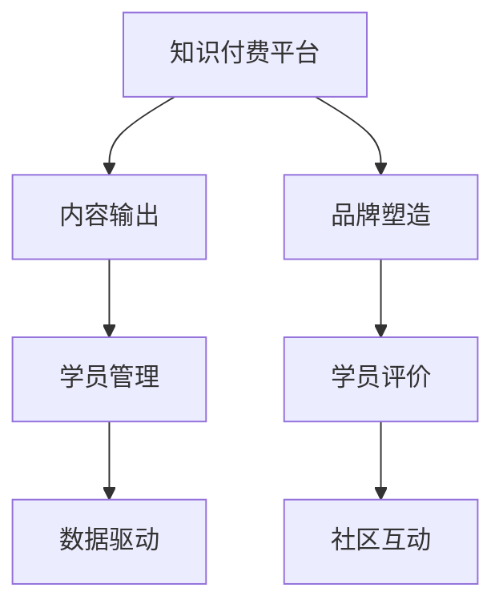

                 

# 程序员如何利用知识付费打造个人品牌

## 1. 背景介绍

### 1.1 问题由来
在数字化时代，知识付费平台如雨后春笋般涌现，为各类专业人士提供了展示自身价值的新舞台。程序员作为高素质、高需求的群体，不仅掌握了前沿的编程技术，还具备广泛的知识面和深入的行业洞察。如何将这些知识转化为个人品牌，通过知识付费实现自我增值，成为许多程序员关注的重点。

### 1.2 问题核心关键点
核心问题在于：
1. 如何高效整合编程知识和行业经验，打造系统性、结构化的课程体系？
2. 如何精准定位受众，满足不同层次学习者的需求？
3. 如何利用知识付费平台的技术和机制，实现课程的上线和推广？
4. 如何在知识付费市场竞争激烈的环境中，保持持续更新和活跃度？
5. 如何评估课程效果，提升学员满意度并增强品牌影响力？

### 1.3 问题研究意义
利用知识付费打造个人品牌，对于程序员而言，具有以下意义：
1. 价值变现：通过教学和咨询，将自身经验转换为经济收益。
2. 专业认可：通过分享和传播，提升自身在行业内的影响力和权威性。
3. 持续学习：在教授他人的过程中，进一步提升自身技能和知识体系。
4. 职业发展：积累更多人脉资源，为未来的职业转型和晋升奠定基础。

## 2. 核心概念与联系

### 2.1 核心概念概述

为更好地理解如何通过知识付费打造个人品牌，本节将介绍几个关键概念：

- **知识付费平台**：如Coursera、Udemy、Bilibili等，提供课程订阅、直播、讨论等功能，促进知识的共享和变现。
- **内容输出**：包括编程课程、技术博客、直播讲座、在线咨询等，需具备一定的专业深度和传播价值。
- **学员管理**：包含学员招募、互动反馈、作业评估、成果展示等环节，需具备高效的管理和沟通能力。
- **数据驱动**：通过分析学员反馈、观看数据、互动情况等，不断优化课程内容和教学策略，实现数据驱动的个性化教学。
- **品牌塑造**：通过课程质量、学员评价、社区互动等方式，提升个人品牌的影响力和美誉度。

这些核心概念共同构成了利用知识付费打造个人品牌的基础框架，通过整合这些元素，程序员可以系统地推进个人品牌的构建。

### 2.2 核心概念原理和架构的 Mermaid 流程图



这个流程图展示了个体通过知识付费平台打造个人品牌的关键步骤：

1. 平台选择与接入：选择合适的知识付费平台，并按照平台规范进行内容上传和课程设置。
2. 内容创作与输出：结合自身专业优势，创作高质量课程内容，并通过多种形式发布。
3. 学员管理与服务：设计课程互动环节，提供学员支持，及时回应学员反馈，持续提升学员体验。
4. 数据驱动与优化：利用平台数据分析工具，优化课程内容和教学方法，实现数据驱动的个性化教学。
5. 品牌塑造与推广：积极参与社区互动，提升个人在平台和学员中的影响力，逐步建立品牌形象。

## 3. 核心算法原理 & 具体操作步骤

### 3.1 算法原理概述

利用知识付费打造个人品牌，本质上是将自身的专业知识通过平台进行系统化输出，并不断优化提升的过程。核心算法包括：

- **内容推荐算法**：通过用户行为数据分析，推荐合适的内容给学员，提升学员课程参与度。
- **学员反馈分析**：收集学员的反馈数据，分析课程效果，及时调整教学内容和方法。
- **学员互动模型**：设计互动环节，如讨论区、问答等，提升学员的参与感和获得感。
- **数据驱动的教学优化**：利用数据分析结果，优化课程设计、教学方法，提升课程质量。

### 3.2 算法步骤详解

**Step 1: 内容规划与设计**

1. 确定课程目标与受众：明确课程所要解决的问题、达成的目标，以及期望吸引的学习者群体。
2. 设计课程大纲：根据目标和受众，设计课程模块、知识体系，确保内容的系统性和连贯性。
3. 制作课程材料：包括课程PPT、代码示例、视频讲解、习题等，需具备高水准的视觉和听觉呈现。
4. 创建平台账户：在知识付费平台注册账号，按照平台规范创建课程页面。

**Step 2: 内容发布与推广**

1. 上传课程内容：将准备好的课程材料上传到平台，填写课程简介、大纲、视频预览等。
2. 设置课程价格：根据课程价值和受众定位，设定合理的课程价格，吸引目标学员。
3. 设计推广素材：制作推广海报、视频预告、课程简介等，通过社交媒体、专业论坛、技术博客等渠道推广。

**Step 3: 学员管理与互动**

1. 学员招募与跟踪：通过邮件、社交媒体、在线广告等方式，招募学员，并进行学员信息登记。
2. 课程互动设计：设置讨论区、在线问答、作业提交等互动环节，保持与学员的持续沟通。
3. 反馈收集与分析：定期收集学员反馈，包括课程内容、授课方式、平台体验等，进行数据分析。
4. 教学改进与优化：根据反馈结果，调整课程内容和教学方法，提升课程效果。

**Step 4: 数据驱动与品牌塑造**

1. 数据分析与评估：利用平台提供的数据分析工具，监测学员学习进度、观看时间、互动情况等，评估课程效果。
2. 品牌推广与维护：积极参与平台社区活动，回答问题、分享经验，提升个人在平台和学员中的影响力。
3. 持续更新与迭代：根据学员反馈和数据分析结果，持续更新课程内容，引入新技术、新案例，保持课程新鲜感。
4. 跨平台传播与互动：利用多种平台传播课程内容，建立跨平台的品牌形象，吸引更多学员和关注者。

### 3.3 算法优缺点

利用知识付费打造个人品牌，有以下优点：
1. 高效变现：通过专业知识和技能，快速实现个人价值变现。
2. 品牌提升：通过系统性、结构化的课程输出，提升自身专业形象和影响力。
3. 持续学习：在教学和互动过程中，不断提升自身技能和知识体系。
4. 扩大影响力：通过多平台传播和互动，积累更多行业人脉和学员资源。

同时，该方法也存在以下局限性：
1. 内容质量要求高：课程内容需具备专业深度和广度，设计制作成本较高。
2. 时间精力投入大：课程制作、学员管理、数据分析等工作，需要大量时间和精力。
3. 平台依赖性强：依赖于知识付费平台的技术和用户基础，推广和运营难度较大。
4. 竞争激烈：知识付费市场竞争激烈，需不断创新和优化，才能吸引和留住学员。
5. 学员质量参差不齐：不同层次学员的需求差异大，需灵活调整课程难度和内容，满足多样化需求。

尽管存在这些局限性，但通过合理规划和高效管理，利用知识付费打造个人品牌仍能取得显著效果，成为程序员价值变现的重要手段。

### 3.4 算法应用领域

基于知识付费的个人品牌打造方法，已经在多个领域得到应用，如：

- **软件开发**：通过教程、编程挑战、技术讲座等方式，提升自身在开发社区的影响力。
- **数据科学与人工智能**：通过机器学习、深度学习、数据可视化等课程，展示自身在AI领域的深度研究。
- **教育培训**：通过教学经验分享、编程基础课程、职业技能提升等课程，吸引教育机构和学员。
- **企业咨询**：通过技术咨询服务、企业内训、管理课程等，拓展业务领域，提升企业价值。
- **区块链与加密货币**：通过技术讲解、项目实战、区块链应用案例等课程，展示自身在区块链领域的最新研究。

这些领域展示了知识付费打造个人品牌的多样性和广泛性，为程序员提供了丰富的职业发展路径。

## 4. 数学模型和公式 & 详细讲解 & 举例说明

### 4.1 数学模型构建

假设课程目标为提升学员的编程技能，受众为有一定基础的开发者。课程内容包括以下模块：

- 数据结构与算法
- 编程语言基础
- 项目实战与案例分析
- 持续学习和实践

课程效果评估指标包括：
- 课程完成率
- 学员评价
- 就业率

数学模型如下：

设 $N$ 为总学员数，$F_i$ 为第 $i$ 名学员的课程完成率，$R_i$ 为第 $i$ 名学员的课程评价，$E_i$ 为第 $i$ 名学员的就业情况。则课程效果评估模型为：

$$
E=\sum_{i=1}^{N} \left( \frac{F_i}{N} + R_i + E_i \right)
$$

### 4.2 公式推导过程

- **课程完成率**：通过平台数据分析，计算每位学员完成课程各个模块的百分比，记为 $F_i$。
- **课程评价**：收集学员对课程内容的反馈，包括满意度、实用性等，记为 $R_i$。
- **就业情况**：统计学员在课程后的就业率，记为 $E_i$。

将这些指标加权求和，得到课程效果 $E$。通过该模型，可以综合评估课程的总体效果，指导后续的优化和改进。

### 4.3 案例分析与讲解

假设某编程课程通过平台分析，发现课程平均完成率为80%，平均评价为4.5分（满分5分），50%的学员在课程后找到了更好的工作机会。根据上述模型，课程效果 $E$ 计算如下：

$$
E=\frac{80}{100}+4.5+0.5=9.0
$$

表示该课程效果为9.0分，整体表现优异，可以考虑进一步推广和优化。

## 5. 项目实践：代码实例和详细解释说明

### 5.1 开发环境搭建

为了进行课程开发和数据分析，需要搭建一定的开发环境。以下是使用Python和Jupyter Notebook的环境配置流程：

1. 安装Anaconda：从官网下载并安装Anaconda，用于创建独立的Python环境。

2. 创建并激活虚拟环境：
```bash
conda create -n course-env python=3.8 
conda activate course-env
```

3. 安装必要的Python库：
```bash
pip install pandas numpy matplotlib scikit-learn jupyter notebook
```

4. 安装课程管理平台接口：
```bash
pip install django
```

5. 安装知识付费平台SDK：
```bash
pip install course-platform-sdk
```

完成上述步骤后，即可在`course-env`环境中进行课程开发和数据分析。

### 5.2 源代码详细实现

以下是一个简化的编程课程开发流程，包括课程制作、学员管理、数据驱动优化等环节。

1. **课程制作**：

```python
from django import forms
from django.db import models

class Course(models.Model):
    title = models.CharField(max_length=100)
    description = models.TextField()
    modules = models.ManyToManyField('Module')
    duration = models.DurationField()
    price = models.DecimalField(max_digits=10, decimal_places=2)
    ...

class Module(models.Model):
    name = models.CharField(max_length=100)
    content = models.TextField()
    requirements = models.TextField()
    ...
```

2. **学员管理**：

```python
from django import forms
from django.db import models

class Student(models.Model):
    username = models.CharField(max_length=100)
    email = models.EmailField()
    course_enrollments = models.ManyToManyField('Course')
    ...
```

3. **数据驱动优化**：

```python
from django import forms
from django.db import models

class Analytics(models.Model):
    student = models.ForeignKey(Student, on_delete=models.CASCADE)
    course = models.ForeignKey(Course, on_delete=models.CASCADE)
    completion_rate = models.DecimalField(max_digits=4, decimal_places=2)
    ...
```

### 5.3 代码解读与分析

上述代码展示了课程制作、学员管理和数据驱动优化的基本实现。可以看到，利用Python和Django框架，可以快速搭建课程管理平台，并实现课程发布、学员招募、数据分析等功能。

- **课程制作**：通过模型定义，将课程信息存储到数据库中，方便后续的查询和更新。
- **学员管理**：通过模型关联，记录学员信息及其课程参与情况，便于课程的互动和评估。
- **数据驱动优化**：通过新增数据模型，记录学员的完成率和评价，为课程效果评估提供数据支持。

在实际开发中，还需要根据具体需求，进一步优化模型设计和代码实现，确保系统的稳定性和高效性。

### 5.4 运行结果展示

通过课程开发和数据分析，可以实时监测课程的各项指标，并根据结果进行优化。例如：

1. **课程完成率**：实时统计每位学员完成各个模块的百分比，发现问题及时调整课程内容。
2. **学员评价**：收集学员反馈，分析课程的受欢迎程度和改进空间。
3. **就业情况**：统计课程后的就业率，评估课程的实际效果。

通过这些数据，可以不断优化课程内容和教学方法，提升课程质量，吸引更多学员，实现品牌的持续发展和提升。

## 6. 实际应用场景

### 6.1 软件开发

利用知识付费平台，程序员可以通过编程课程、项目实战、技术讲座等方式，展示自身编程技能和实战经验，吸引更多同行和学员。例如，某知名程序员通过在知识付费平台上发布Java编程课程，迅速积累了大批忠实学员，并开设了专门的咨询业务，实现了价值变现和品牌提升。

### 6.2 数据科学与人工智能

数据科学家和人工智能专家可以利用知识付费平台，分享最新的研究成果和技术进展，吸引业内同行和高校学生的关注。例如，某知名数据科学家通过在平台上发布深度学习课程和机器学习实战案例，迅速成为业内知名的课程导师，并在多所高校担任客座教授，进一步提升了自身的影响力和学术地位。

### 6.3 企业咨询

技术专家和资深IT管理人员可以利用知识付费平台，为企业提供技术咨询和培训服务，帮助企业提升技术能力和管理水平。例如，某知名IT公司CTO通过在平台上发布企业内训和IT咨询课程，吸引了大量企业的技术团队和管理人员，实现了知识和经验的变现和推广。

### 6.4 区块链与加密货币

区块链和加密货币领域的专家，可以利用知识付费平台，分享最新的区块链技术、项目案例和投资机会，吸引业内同行和投资者的关注。例如，某知名区块链专家通过在平台上发布区块链课程和项目实战案例，迅速成为区块链领域的知名讲师，并在多家知名投资机构担任技术顾问，实现了技术和知识的价值变现。

## 7. 工具和资源推荐

### 7.1 学习资源推荐

为了帮助开发者系统掌握利用知识付费打造个人品牌的方法，这里推荐一些优质的学习资源：

1. **Coursera**：提供全球顶级大学和机构的高质量课程，涵盖编程、数据科学、人工智能等多个领域，适合深入学习和系统掌握。
2. **Udemy**：提供丰富的实用课程，覆盖软件开发、项目管理、商业分析等多个方向，适合快速提升技能和实战经验。
3. **Bilibili**：国内知名的知识分享平台，拥有大量优质的技术课程和教学视频，适合免费学习和互动交流。
4. **博客园**：国内知名的技术社区，汇聚了大量程序员和IT专家，通过博客分享技术经验和学习心得，提升个人品牌影响力。
5. **知乎**：国内知名的问答社区，适合分享技术观点和经验，结识行业内的专家和同行，拓展人脉资源。

通过这些资源的学习实践，相信你一定能够快速掌握利用知识付费打造个人品牌的方法，并用于解决实际的职业发展问题。

### 7.2 开发工具推荐

高效的开发离不开优秀的工具支持。以下是几款用于知识付费平台和个人品牌打造的常用工具：

1. **GitHub**：全球知名的代码托管平台，支持代码版本控制和协作开发，适合开源课程和项目合作。
2. **Django**：Python的开源Web框架，支持快速开发课程管理和学员互动功能，适合企业级的Web应用开发。
3. **Jupyter Notebook**：基于IPython的开源笔记本工具，支持数据可视化、代码编写和交互式教学，适合课程开发和数据分析。
4. **Google Colab**：谷歌提供的免费在线Jupyter Notebook环境，支持GPU/TPU算力，适合实验新模型和分享课程内容。
5. **Zoom**：全球知名的视频会议和直播工具，支持高清晰度的视频通话和互动直播，适合在线教学和社区互动。
6. **Slack**：全球知名的团队协作工具，支持实时消息和频道管理，适合课程学员和专家之间的交流和协作。

合理利用这些工具，可以显著提升知识付费平台和个人品牌的开发效率，加快创新迭代的步伐。

### 7.3 相关论文推荐

知识付费和个人品牌打造的研究源于学界的持续探索。以下是几篇奠基性的相关论文，推荐阅读：

1. **Learning to Teach**：作者探讨了教师如何通过教学不断提升自己的专业知识和技能，适合课程开发者和讲师参考。
2. **The Impact of Online Learning**：作者分析了在线学习平台对学员学习效果和品牌影响力的影响，适合课程平台建设和运营参考。
3. **Brand Equity in the Digital Age**：作者研究了数字时代品牌塑造和传播的策略，适合个人品牌打造和市场推广参考。
4. **Data-Driven Teaching**：作者介绍了利用数据分析优化教学方法和提升课程质量的方法，适合课程开发者和数据分析师参考。

这些论文代表了知识付费和个人品牌打造的最新研究成果，通过学习这些前沿成果，可以帮助研究者把握学科前进方向，激发更多的创新灵感。

## 8. 总结：未来发展趋势与挑战

### 8.1 研究成果总结

本文对利用知识付费打造个人品牌的方法进行了全面系统的介绍。首先阐述了知识付费平台和个人品牌构建的背景和意义，明确了利用知识付费实现自我价值和职业发展的独特价值。其次，从原理到实践，详细讲解了知识付费范式的核心算法和操作步骤，给出了知识付费平台和个人品牌打造的系统实现方案。同时，本文还广泛探讨了知识付费和个人品牌在多个行业领域的应用前景，展示了知识付费范式的广泛应用和巨大潜力。

通过本文的系统梳理，可以看到，利用知识付费打造个人品牌，对于程序员而言，具有重要的应用价值。未来，伴随知识付费平台的持续发展和课程内容的不断优化，通过知识付费打造个人品牌必将成为程序员职业发展的关键路径。

### 8.2 未来发展趋势

展望未来，利用知识付费打造个人品牌将呈现以下几个发展趋势：

1. **内容生态多样化**：随着知识付费平台的不断丰富和完善，课程形式将更加多样化，包括编程课程、项目实战、技术讲座、直播互动等，满足不同层次学员的需求。
2. **数据驱动的个性化教学**：通过大数据和人工智能技术，实现个性化推荐和动态优化，提升学员学习体验和课程效果。
3. **品牌效应放大**：借助知识付费平台的高曝光率和强传播力，个人品牌将更具影响力和吸引力，实现更广泛的行业认可和职业发展。
4. **跨领域融合**：知识付费和个人品牌将与其他领域的知识体系和技术手段进行深度融合，如区块链、人工智能、数据科学等，实现跨领域的价值变现和品牌推广。
5. **全球化扩展**：利用互联网平台和国际化思维，将个人品牌推向全球市场，拓展更广阔的学员群体和商业机会。

这些趋势展示了知识付费和个人品牌打造的广阔前景。通过不断创新和优化，利用知识付费将能够实现更大的社会和经济价值。

### 8.3 面临的挑战

尽管利用知识付费打造个人品牌具有显著的优势，但在迈向更加智能化、普适化应用的过程中，仍面临诸多挑战：

1. **课程质量保障**：如何保证课程内容的高质量和高实用性，满足不同层次学员的需求，是知识付费平台和个人品牌建设的关键。
2. **学员管理复杂性**：学员人数的快速增长，如何提供高效的服务和互动支持，是知识付费平台运营的重要挑战。
3. **内容更新难度**：保持课程内容的实时更新和迭代，是知识付费平台和个人品牌持续发展的关键。
4. **平台竞争激烈**：知识付费平台众多，如何在激烈的市场竞争中脱颖而出，是个人品牌建设的重要课题。
5. **品牌推广成本高**：个人品牌的推广需要大量的时间和资源，如何高效利用这些资源，是知识付费平台和个人品牌建设的难点。

尽管存在这些挑战，但通过合理规划和高效管理，利用知识付费打造个人品牌仍能取得显著效果，成为程序员价值变现的重要手段。

### 8.4 研究展望

面对知识付费和个人品牌打造的挑战，未来的研究需要在以下几个方面寻求新的突破：

1. **个性化推荐系统**：开发更加智能的个性化推荐算法，提升课程的匹配度和学员的参与感，实现数据驱动的个性化教学。
2. **内容生产自动化**：利用AI技术和自动化工具，减少内容生产和管理的成本，提升内容更新的效率和质量。
3. **多平台协作**：构建跨平台的品牌生态系统，实现知识付费平台和个人品牌的协同发展，提升品牌影响力和市场竞争力。
4. **课程质量评估**：开发更加全面和客观的课程质量评估方法，确保课程的高水准和实用性，提升学员的满意度和品牌声誉。
5. **跨领域融合**：探索跨领域知识的整合和应用，如结合区块链、人工智能、数据科学等技术，提升课程的深度和广度。

这些研究方向将引领知识付费和个人品牌打造的持续创新和优化，推动自然语言理解和智能交互系统的进步，为程序员和其他专业人士提供更广阔的职业发展空间。总之，利用知识付费打造个人品牌，需要多方面的协同努力，才能实现更大的社会和经济价值。

## 9. 附录：常见问题与解答

**Q1：利用知识付费平台进行个人品牌打造有哪些优势？**

A: 利用知识付费平台进行个人品牌打造，具有以下优势：
1. 高效变现：通过教学和咨询，将自身经验转换为经济收益。
2. 品牌提升：通过系统性、结构化的课程输出，提升自身专业形象和影响力。
3. 持续学习：在教学和互动过程中，不断提升自身技能和知识体系。
4. 扩大影响力：通过多平台传播和互动，积累更多行业人脉和学员资源。

**Q2：如何选择合适的知识付费平台？**

A: 选择知识付费平台时，需考虑以下因素：
1. 平台覆盖范围：选择覆盖广泛、用户基数大的平台，提升课程的曝光率。
2. 技术支持：选择技术成熟、易用性高的平台，便于课程制作和学员管理。
3. 用户评价：参考用户评价和课程反馈，选择口碑良好的平台，提升课程效果。
4. 收益分成：了解平台的分成政策和收益模式，选择适合自己的平台，实现最大化的收益。

**Q3：如何进行课程设计和管理？**

A: 进行课程设计和管理时，需考虑以下步骤：
1. 确定课程目标和受众：明确课程所要解决的问题、达成的目标，以及期望吸引的学习者群体。
2. 设计课程大纲：根据目标和受众，设计课程模块、知识体系，确保内容的系统性和连贯性。
3. 制作课程材料：包括课程PPT、代码示例、视频讲解、习题等，需具备高水准的视觉和听觉呈现。
4. 发布课程内容：将准备好的课程材料上传到平台，填写课程简介、大纲、视频预览等，设置课程价格，推广课程。
5. 学员招募与跟踪：通过邮件、社交媒体、在线广告等方式，招募学员，并进行学员信息登记。
6. 课程互动设计：设置讨论区、在线问答、作业提交等互动环节，保持与学员的持续沟通。
7. 反馈收集与分析：定期收集学员反馈，包括课程内容、授课方式、平台体验等，进行数据分析。
8. 教学改进与优化：根据反馈结果，调整课程内容和教学方法，提升课程效果。

**Q4：如何提升课程质量和学员满意度？**

A: 提升课程质量和学员满意度，需从以下方面入手：
1. 课程内容精炼：确保课程内容的高质量和高实用性，满足不同层次学员的需求。
2. 互动环节丰富：设计多样化的互动环节，提升学员的参与感和获得感。
3. 学员管理高效：提供高效的学员支持和服务，及时回应学员反馈，持续提升学员体验。
4. 数据分析驱动：利用数据分析工具，监测学员学习进度、观看时间、互动情况等，评估课程效果，优化课程内容。
5. 持续更新迭代：根据学员反馈和数据分析结果，持续更新课程内容，引入新技术、新案例，保持课程新鲜感。

**Q5：如何利用知识付费平台实现个人品牌推广？**

A: 利用知识付费平台实现个人品牌推广，需从以下方面入手：
1. 平台选择与接入：选择合适的知识付费平台，并按照平台规范进行内容上传和课程设置。
2. 内容创作与输出：结合自身专业优势，创作高质量课程内容，并通过多种形式发布，提高平台曝光率。
3. 学员管理与服务：设计课程互动环节，提供学员支持，及时回应学员反馈，持续提升学员体验。
4. 品牌推广与维护：积极参与平台社区活动，回答问题、分享经验，提升个人在平台和学员中的影响力。
5. 持续更新与迭代：根据学员反馈和数据分析结果，持续更新课程内容，引入新技术、新案例，保持课程新鲜感。
6. 跨平台传播与互动：利用多种平台传播课程内容，建立跨平台的品牌形象，吸引更多学员和关注者。

通过上述方法的实施，相信你一定能够快速掌握利用知识付费打造个人品牌的方法，并用于解决实际的职业发展问题。

