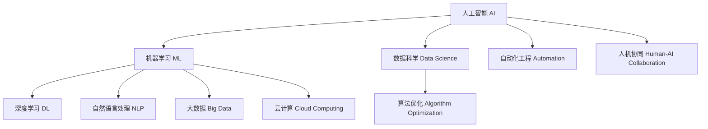

                 

## 1. 背景介绍

随着人工智能技术的迅猛发展，越来越多的行业和企业开始将AI应用纳入核心业务流程，以实现自动化、智能化和高效化。然而，在享受人工智能带来的便捷和效率提升的同时，程序员也面临着前所未有的技术挑战和行业变革。本文将从技术和管理两个层面，详细剖析程序员在应对人工智能挑战时需要掌握的关键知识和技能，并提供实用的解决方案，帮助程序员顺利适应和利用AI技术。

## 2. 核心概念与联系

### 2.1 核心概念概述

为更好地理解程序员如何应对人工智能挑战，本节将介绍几个关键概念：

- **人工智能(AI)**：利用计算机算法和数据处理技术，实现模拟人类智能行为的自动化系统。
- **机器学习(ML)**：通过数据训练，让计算机能够自主学习和改进其算法，以执行特定任务的技术。
- **深度学习(Deep Learning, DL)**：一种机器学习算法，通过构建多层次神经网络，实现对大规模数据进行复杂模式识别的能力。
- **自然语言处理(NLP)**：让计算机能够理解和处理人类语言的技术，广泛应用于聊天机器人、文本分类、情感分析等场景。
- **大数据(大数据)**：涉及数据的采集、存储、处理和分析，是支持人工智能技术发展的核心基础设施。
- **云计算(Cloud Computing)**：通过互联网提供计算资源和服务的模式，支持人工智能大规模应用。

这些概念之间的逻辑关系可以通过以下Mermaid流程图来展示：



这个流程图展示了人工智能技术的核心组件及其相互关系：

1. 人工智能是统领概念，涵盖了机器学习、深度学习、自然语言处理、大数据和云计算等技术。
2. 机器学习和深度学习是实现人工智能的关键技术手段。
3. 自然语言处理和大数据是人工智能在具体应用中的典型场景。
4. 云计算为人工智能提供了强有力的计算资源支持。
5. 数据科学和自动化工程是支撑人工智能技术发展的基础。

通过理解这些核心概念，程序员可以更好地把握人工智能技术的发展脉络，提升自身技术能力和行业竞争力。

## 3. 核心算法原理 & 具体操作步骤

### 3.1 算法原理概述

人工智能技术的核心算法原理主要集中在以下几个方面：

- **监督学习**：通过有标注的数据集，训练模型进行预测和分类。
- **无监督学习**：利用未标注的数据集，让模型自主发现数据的内在结构和规律。
- **强化学习**：通过与环境的互动，让模型学习最优策略以实现特定目标。
- **生成对抗网络(GANs)**：通过生成器和判别器的对抗训练，生成高质量的数据和图像。

这些算法原理是构建人工智能系统的基础，程序员需要理解和掌握其基本原理和应用场景。

### 3.2 算法步骤详解

以下是构建和训练人工智能模型的典型步骤：

1. **数据收集和预处理**：收集和清洗数据，包括数据采样、特征提取、数据增强等。
2. **模型选择和设计**：根据具体任务选择合适的算法和模型结构，如卷积神经网络(CNN)、循环神经网络(RNN)、Transformer等。
3. **模型训练和优化**：使用优化算法(如SGD、Adam)调整模型参数，最小化损失函数，提高模型性能。
4. **模型评估和验证**：在独立数据集上评估模型性能，选择最优模型进行部署。
5. **模型部署和应用**：将模型集成到应用系统中，实现自动化和智能化功能。

这些步骤需要通过编程语言和工具库(如TensorFlow、PyTorch、Keras等)实现，程序员需要掌握相关技术。

### 3.3 算法优缺点

人工智能算法的优缺点如下：

**优点**：
- **高效性**：能够自动处理大规模数据和复杂任务，提高工作效率。
- **准确性**：通过学习训练数据，可以实现较高的预测准确率和分类精确度。
- **灵活性**：适用于多种场景和任务，能够根据不同需求进行定制化开发。

**缺点**：
- **数据依赖**：需要大量的标注数据进行训练，数据质量对模型性能影响较大。
- **计算资源需求高**：训练和推理需要高性能计算资源，成本较高。
- **模型解释性不足**：许多算法模型难以解释其内部决策过程，缺乏透明度和可解释性。
- **偏差和偏见**：模型可能学习到数据中的偏差和偏见，导致不公正或不公平的结果。

程序员需要了解这些优缺点，合理选择算法和模型，并采取相应措施进行优化和改进。

### 3.4 算法应用领域

人工智能算法广泛应用于各个行业和领域，包括但不限于：

- **金融科技(Fintech)**：用于风险评估、信用评分、欺诈检测等。
- **医疗健康**：用于疾病诊断、药物研发、智能推荐等。
- **制造业**：用于质量控制、生产调度、设备维护等。
- **零售电商**：用于用户推荐、价格优化、库存管理等。
- **智能家居**：用于环境监测、智能控制、安防监控等。
- **智能客服**：用于对话生成、意图识别、用户分类等。

程序员需要了解这些应用领域的需求和技术特点，选择适合的算法和工具进行开发。

## 4. 数学模型和公式 & 详细讲解 & 举例说明

### 4.1 数学模型构建

人工智能模型的数学模型通常包括以下几类：

- **线性回归模型**：用于预测连续值，表达式为 $y = w^Tx + b$，其中 $w$ 为权重向量，$b$ 为偏置项。
- **逻辑回归模型**：用于二分类任务，表达式为 $P(y|x) = \frac{1}{1+\exp(-z)}$，其中 $z = wx+b$。
- **卷积神经网络(CNN)**：用于图像处理和计算机视觉任务，通过卷积和池化操作提取特征。
- **循环神经网络(RNN)**：用于序列数据处理，通过循环结构捕捉时间依赖关系。
- **Transformer模型**：用于自然语言处理任务，通过自注意力机制实现高效的序列建模。

### 4.2 公式推导过程

以线性回归模型为例，其优化目标为最小化均方误差损失函数：

$$
J(w,b) = \frac{1}{2m} \sum_{i=1}^m (h_{\theta}(x^{(i)}) - y^{(i)})^2
$$

其中 $m$ 为样本数，$x^{(i)}$ 和 $y^{(i)}$ 分别为第 $i$ 个样本的输入和标签。

使用梯度下降算法优化目标函数，得到权重的更新公式：

$$
w^{(k+1)} = w^{(k)} - \frac{\eta}{m} \sum_{i=1}^m \frac{\partial J(w,b)}{\partial w} x^{(i)}
$$

其中 $\eta$ 为学习率。

### 4.3 案例分析与讲解

假设有一个简单的房价预测模型，已知特征向量 $x = (area, rooms, location)$，标签 $y = price$，使用线性回归模型进行训练。具体步骤如下：

1. **数据准备**：收集历史房价数据，将其划分为训练集和测试集。
2. **模型构建**：定义线性回归模型，设定学习率和迭代次数。
3. **模型训练**：使用梯度下降算法最小化损失函数。
4. **模型评估**：在测试集上评估模型性能，如均方误差(MSE)。

## 5. 项目实践：代码实例和详细解释说明

### 5.1 开发环境搭建

以下是使用Python进行TensorFlow开发的环境配置流程：

1. 安装Anaconda：从官网下载并安装Anaconda，用于创建独立的Python环境。

2. 创建并激活虚拟环境：
```bash
conda create -n tf-env python=3.8 
conda activate tf-env
```

3. 安装TensorFlow：根据CUDA版本，从官网获取对应的安装命令。例如：
```bash
conda install tensorflow tensorflow-gpu=2.7 -c conda-forge
```

4. 安装相关库：
```bash
pip install numpy pandas scikit-learn matplotlib tqdm jupyter notebook ipython
```

完成上述步骤后，即可在`tf-env`环境中开始TensorFlow开发。

### 5.2 源代码详细实现

以下是使用TensorFlow构建一个简单的房价预测模型的代码实现：

```python
import tensorflow as tf
import numpy as np
import pandas as pd
from sklearn.model_selection import train_test_split

# 读取数据
data = pd.read_csv('house_prices.csv')

# 特征选择和标准化
X = data[['area', 'rooms', 'location']]
y = data['price']
X_train, X_test, y_train, y_test = train_test_split(X, y, test_size=0.2)

# 定义模型
X = tf.keras.layers.Input(shape=(3,))
x = tf.keras.layers.Dense(64, activation='relu')(X)
x = tf.keras.layers.Dense(32, activation='relu')(x)
x = tf.keras.layers.Dense(1)
model = tf.keras.Model(X, x)

# 定义损失函数和优化器
model.compile(optimizer=tf.keras.optimizers.Adam(), loss='mse')

# 训练模型
model.fit(X_train, y_train, epochs=50, batch_size=32, validation_data=(X_test, y_test))

# 评估模型
mse = model.evaluate(X_test, y_test)
print('均方误差：', mse)
```

### 5.3 代码解读与分析

让我们再详细解读一下关键代码的实现细节：

**数据准备**：
- 使用Pandas库读取CSV格式的数据集，并进行特征选择和标准化。
- 使用`train_test_split`函数将数据集划分为训练集和测试集。

**模型构建**：
- 使用`tf.keras.layers`定义模型结构，包括输入层、隐藏层和输出层。
- 定义优化器和损失函数，使用Adam优化器和均方误差损失。

**模型训练**：
- 使用`fit`函数训练模型，指定训练轮数和批次大小。
- 在验证集上评估模型性能，使用均方误差作为评估指标。

**模型评估**：
- 使用`evaluate`函数评估模型在测试集上的性能，输出均方误差。

以上代码展示了TensorFlow实现一个简单的房价预测模型的完整流程，程序员需要掌握这一流程的基本步骤和参数调整技巧。

### 5.4 运行结果展示

训练模型后，可以输出均方误差作为模型性能的评估指标。如果模型性能较好，均方误差将会较小。

## 6. 实际应用场景

### 6.1 智能客服系统

基于人工智能的智能客服系统能够自动处理大量客户咨询，提高响应速度和服务质量。系统可以集成自然语言处理、情感分析和对话生成等技术，实现自动理解客户意图并生成合理回复。

### 6.2 金融风险管理

金融行业可以利用人工智能模型进行信用评分、欺诈检测和风险评估等任务，通过分析客户数据和交易记录，预测潜在风险，降低金融损失。

### 6.3 医疗影像分析

人工智能模型可以用于医疗影像的自动分析，如病灶检测、手术规划等，提高医生的诊断效率和准确性，助力医疗事业的数字化转型。

### 6.4 未来应用展望

人工智能技术将在更多领域得到广泛应用，带来深刻变革。程序员需要不断学习新技术和新方法，提升自身能力，适应行业变化。

## 7. 工具和资源推荐

### 7.1 学习资源推荐

为帮助程序员全面掌握人工智能技术，推荐以下学习资源：

1. **TensorFlow官方文档**：提供详细的TensorFlow使用指南和教程，适合初学者和进阶开发者。
2. **PyTorch官方文档**：提供详细的PyTorch使用指南和教程，适合深度学习和自然语言处理开发者。
3. **Deep Learning Specialization课程**：由Andrew Ng教授开设的Coursera课程，涵盖深度学习基础和高级内容。
4. **深度学习入门与实践书籍**：由李沐等人编写的深度学习入门教材，包含丰富的代码示例和项目实践。
5. **AI Challenger平台**：提供各类AI竞赛和挑战，提升实战能力和解决问题的能力。

### 7.2 开发工具推荐

以下是几款用于人工智能开发的工具：

1. **Jupyter Notebook**：支持Python、R等多种编程语言，提供交互式编程和数据可视化环境，适合开发者快速实验和探索。
2. **GitHub**：提供代码托管和版本控制服务，方便开发者协作和分享代码。
3. **Google Colab**：提供免费的GPU/TPU算力，支持Python和TensorFlow，适合快速上手和实验最新模型。
4. **TensorBoard**：TensorFlow配套的可视化工具，可实时监测模型训练状态，并提供丰富的图表呈现方式。
5. **Weights & Biases**：提供实验跟踪和评估工具，记录和分析模型训练和评估结果。

### 7.3 相关论文推荐

以下是几篇代表性的人工智能相关论文，推荐阅读：

1. **Deep Learning**：Yann LeCun等人的经典论文，阐述了深度学习的基本原理和应用。
2. **ImageNet Classification with Deep Convolutional Neural Networks**：Alex Krizhevsky等人的论文，提出了卷积神经网络在图像分类中的强大能力。
3. **Attention is All You Need**：Ashish Vaswani等人的论文，提出Transformer模型在自然语言处理中的应用。
4. **Generative Adversarial Nets**：Ian Goodfellow等人的论文，阐述了生成对抗网络的基本原理和应用。
5. **Learning from Data: A New Approach to Recommendation and Discovery**：Daniel D. Lee等人的论文，提出基于协同过滤的推荐系统。

这些论文代表了大数据和人工智能技术的发展脉络，程序员需要掌握这些基本原理和算法，才能进行深入开发和应用。

## 8. 总结：未来发展趋势与挑战

### 8.1 总结

本文对程序员如何应对人工智能带来的挑战进行了全面系统的介绍。首先介绍了人工智能技术的基本概念和核心算法，强调了程序员需要掌握的数据科学、机器学习、深度学习等基础技术。其次，通过项目实践展示了TensorFlow实现房价预测模型的完整流程，帮助程序员理解实际应用中的开发步骤和技术要点。最后，从实际应用场景和未来展望出发，提供了丰富的学习资源和开发工具推荐。

通过本文的系统梳理，程序员可以更好地掌握人工智能技术的核心原理和应用方法，适应不断变化的行业需求和技术趋势，提升自身的技术能力和行业竞争力。

### 8.2 未来发展趋势

展望未来，人工智能技术将呈现以下几个发展趋势：

1. **自动化和智能化**：随着技术的进步，人工智能系统将具备更强的自主决策和问题解决能力，实现高度的自动化和智能化。
2. **多模态融合**：人工智能将更多地结合视觉、听觉、触觉等多模态信息，提升系统对复杂环境的理解和适应能力。
3. **实时计算和推理**：人工智能系统将具备更快的推理速度和更低的延迟，支持实时计算和交互。
4. **边缘计算和雾计算**：人工智能技术将更多地应用于边缘计算和雾计算场景，提升计算效率和数据处理能力。
5. **联邦学习**：通过分布式计算和协同优化，实现数据隐私保护和模型效率提升。

这些趋势将深刻影响人工智能技术的应用和发展，程序员需要不断学习新技术和新方法，适应行业变化。

### 8.3 面临的挑战

尽管人工智能技术在各行各业中取得了显著进展，但在实际应用中仍然面临诸多挑战：

1. **数据质量和获取**：数据质量和数据的获取仍是人工智能技术应用的主要瓶颈，高质量数据的获取成本较高。
2. **模型可解释性**：许多人工智能模型缺乏可解释性，难以解释其决策过程和推理逻辑，影响应用的可信度和可靠性。
3. **算法偏见和公平性**：人工智能模型可能学习到数据中的偏见，导致不公正或不公平的结果，引发伦理和社会问题。
4. **资源消耗和计算成本**：大规模人工智能系统的训练和推理需要高性能计算资源，成本较高。
5. **安全和隐私**：人工智能系统的数据安全和用户隐私保护问题亟待解决，需建立健全的法规和技术体系。

程序员需要了解这些挑战，并采取相应的技术和方法进行优化和改进，提升人工智能系统的性能和可靠性。

### 8.4 研究展望

未来的研究需要从以下几个方面进行深入探索：

1. **数据增强和合成**：通过数据增强和合成技术，提高数据多样性和数量，提升模型的泛化能力。
2. **多任务学习和联邦学习**：通过多任务学习和联邦学习，实现模型间的协同优化和分布式计算。
3. **对抗攻击和鲁棒性**：通过对抗攻击和鲁棒性研究，提升模型的稳定性和安全性。
4. **模型压缩和优化**：通过模型压缩和优化技术，降低模型大小和计算成本，提升推理效率。
5. **伦理和社会影响研究**：通过伦理和社会影响研究，提升人工智能系统的公平性和可信度，确保其应用符合伦理和社会价值。

这些研究方向将引领人工智能技术的发展，程序员需要不断学习和探索，推动技术进步和应用创新。

## 9. 附录：常见问题与解答

**Q1：什么是人工智能？**

A: 人工智能是指利用计算机算法和数据处理技术，实现模拟人类智能行为的自动化系统，涵盖机器学习、深度学习、自然语言处理等多个子领域。

**Q2：机器学习和深度学习的区别是什么？**

A: 机器学习是让计算机通过数据训练，自主学习和改进其算法，以执行特定任务的技术。深度学习是机器学习的一种特殊形式，通过构建多层次神经网络，实现对大规模数据进行复杂模式识别的能力。

**Q3：如何训练和优化深度学习模型？**

A: 深度学习模型的训练和优化通常包括以下步骤：数据准备、模型构建、模型训练和模型评估。使用梯度下降算法调整模型参数，最小化损失函数。常用的优化算法包括SGD、Adam等。

**Q4：人工智能在医疗领域有哪些应用？**

A: 人工智能在医疗领域的应用包括疾病诊断、药物研发、智能推荐等。通过分析患者数据和医学影像，实现精准医疗和个性化治疗。

**Q5：程序员需要掌握哪些人工智能技术？**

A: 程序员需要掌握机器学习、深度学习、自然语言处理、数据科学等基础技术，并了解人工智能技术的应用场景和实现方法。

**Q6：人工智能技术在金融行业有哪些应用？**

A: 人工智能技术在金融行业的应用包括信用评分、欺诈检测、风险评估等。通过分析客户数据和交易记录，预测潜在风险，提升金融服务的质量和效率。

以上是关于程序员如何应对人工智能带来的挑战的全面介绍，希望能为程序员提供有价值的参考和指导。在未来的人工智能发展过程中，程序员需要不断学习和探索，掌握新技术和新方法，推动人工智能技术的广泛应用和深远发展。

