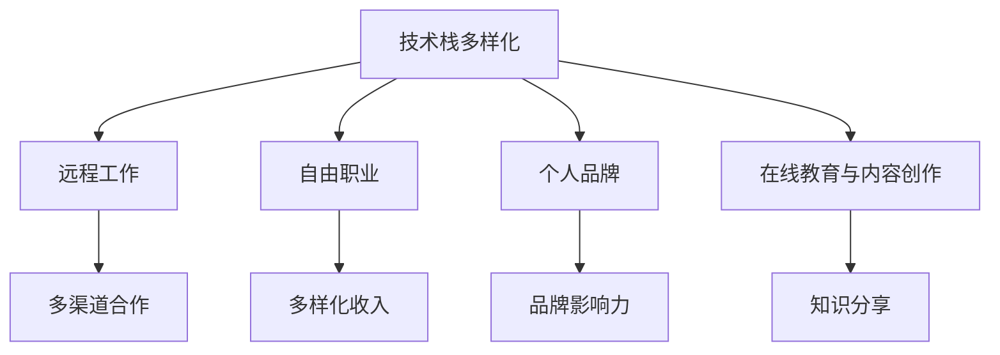

                 

# 程序员如何建立多元化收入结构

> 关键词：职业发展, 技术栈多样化, 创收渠道, 远程工作, 自由职业, 个人品牌

## 1. 背景介绍

在快速变化的技术环境中，程序员需要不断学习新技术，以保持竞争力。但是，技术技能的提升并不能自动转化为收入的增长。为了确保职业稳定性和收入增长，许多程序员开始探索多元化的收入结构，以降低职业风险并增加收入来源。本文将探讨如何通过学习新技能、拓展技术栈、创建个人品牌以及进入远程工作市场来建立多元化的收入结构。

## 2. 核心概念与联系

### 2.1 核心概念概述

在讨论如何建立多元化的收入结构之前，我们首先梳理几个关键概念及其相互之间的联系：

- **技术栈多样化**：指的是掌握多种编程语言和技术栈，不仅限于当前的工作岗位。这不仅增加了就业机会，还能提高解决问题的能力。

- **远程工作**：是指在不需要到公司办公室工作的情况下，通过网络完成工作任务。这种工作模式提供了更大的灵活性，同时也为程序员提供了全球就业的机会。

- **自由职业**：指通过个人技能和时间提供服务，赚取收入，而不是受雇于一个固定的公司。自由职业者可以控制自己的工作时间和项目选择。

- **个人品牌建设**：是指通过博客、社交媒体等渠道建立自己在特定技术领域的影响力。个人品牌能够带来更多的合作机会和收入来源。

- **在线教育与内容创作**：在线教育平台为有经验的程序员提供了教授课程、分享知识的机会，内容创作则可以通过博客、视频等形式分享技术见解。

这些概念之间存在着天然的联系。技术栈多样化让个人有更多选择进入远程工作市场和自由职业领域，而个人品牌建设则能进一步扩大影响力，从而带来更多合作和收入机会。同时，在线教育与内容创作也能通过互联网平台进行，进一步拓宽收入来源。

### 2.2 核心概念原理和架构的 Mermaid 流程图



## 3. 核心算法原理 & 具体操作步骤

### 3.1 算法原理概述

建立多元化的收入结构，需要综合运用多种技术和商业策略。核心算法原理可以概括为以下几个步骤：

1. **识别技能缺口**：通过分析当前市场和自身职业发展需求，确定需要学习的新技术栈。
2. **制定学习计划**：为每个新技能制定详细的学习计划，包括在线课程、书籍、项目实践等。
3. **技术栈拓展**：通过学习新技能和实践项目，拓展技术栈。
4. **建立个人品牌**：通过博客、社交媒体等渠道，建立自己在特定技术领域的知名度。
5. **寻找远程工作与自由职业机会**：利用LinkedIn、Upwork等平台寻找远程工作和自由职业机会。
6. **提供在线教育和内容创作**：通过在线教育平台和内容创作平台分享知识和技能，获取收入。

### 3.2 算法步骤详解

#### 3.2.1 识别技能缺口

使用信息采集和分析技术，例如Google Trends、Glassdoor等，收集当前市场对各类编程语言和技术的兴趣和需求情况。通过与同行交流，了解行业趋势和技术发展方向。识别出自己当前技术栈中的空白，列出需要学习的新技术栈。

#### 3.2.2 制定学习计划

制定详细的学习计划，包括选择合适的学习资源、安排学习时间、设定学习目标等。对于每个新技能，需要选择合适的在线课程（如Coursera、Udemy、edX等），阅读相关书籍，并参与实际项目来应用所学知识。

#### 3.2.3 技术栈拓展

通过系统学习，掌握新技能，并参与实际项目，积累经验。例如，学习并实践机器学习、数据分析、区块链等技术，增加自己的技术栈多样性。

#### 3.2.4 建立个人品牌

通过撰写技术博客、创建YouTube频道、参与技术社区等方式，建立个人品牌。例如，在GitHub上分享项目代码，在Medium上发布技术文章，在Twitter上分享技术见解。

#### 3.2.5 寻找远程工作与自由职业机会

利用LinkedIn、Upwork、Fiverr等平台，创建专业档案，并发布个人技能和服务。寻找与自身技能匹配的远程工作或自由职业机会，如软件开发、数据分析、技术咨询等。

#### 3.2.6 提供在线教育和内容创作

通过Udemy、Coursera等平台，教授自己擅长的技术，如Python编程、Web开发、数据科学等。同时，可以通过Medium、个人博客等平台，分享技术知识，获取广告收入或付费订阅。

### 3.3 算法优缺点

#### 3.3.1 算法优点

1. **降低职业风险**：通过学习新技能和拓展技术栈，降低对单一技术的依赖，提高职业稳定性。
2. **增加收入来源**：通过远程工作、自由职业、在线教育和内容创作等途径，拓宽收入渠道。
3. **提高市场竞争力**：掌握更多技能和多样化的工作模式，提高在市场上的竞争力。
4. **灵活性高**：远程工作和自由职业提供了更高的灵活性，可以根据自己的时间安排工作。

#### 3.3.2 算法缺点

1. **学习成本高**：需要大量时间学习新技能，可能影响当前工作。
2. **市场竞争激烈**：尤其在远程工作、自由职业等领域，竞争非常激烈，需要不断提升技能和更新知识。
3. **收入不稳定**：远程工作、自由职业的收入可能受到项目和市场需求的影响，存在一定的波动。

### 3.4 算法应用领域

- **软件开发**：通过学习新的编程语言和框架，进入远程工作市场或提供自由职业服务。
- **数据科学**：掌握数据处理和分析技能，提供数据分析服务，或通过在线教育平台教授数据科学知识。
- **区块链技术**：学习区块链开发和应用，提供区块链开发服务，或在区块链领域开设个人博客。
- **人工智能**：学习机器学习和深度学习技术，提供AI咨询服务，或在AI领域进行内容创作。

## 4. 数学模型和公式 & 详细讲解 & 举例说明

### 4.1 数学模型构建

设`S`为程序员当前掌握的技术栈集合，`N`为市场上需求的新技术栈集合。建立多元化的收入结构可以看作是一个组合优化问题，目标是最大化收入`I`。

数学模型可以表示为：

$$
\max_{S'} I(S')
$$

其中，$S' \subseteq S \cup N$，表示包含当前技术栈和需要学习的新技能。

### 4.2 公式推导过程

对于每个新技能`i`，假设其市场价值为`v_i`，掌握该技能需要的学习时间为`t_i`。设`c`为每小时的学习成本，`e`为每小时的工作效率。那么，掌握新技能的总成本`C_i`可以表示为：

$$
C_i = v_i \times t_i - c \times t_i
$$

如果程序员选择学习新技能，其新增收入可以表示为：

$$
\Delta I_i = v_i \times (1 - \frac{t_i}{e})
$$

因此，综合考虑成本和新增收入，学习新技能`i`的净收益`R_i`可以表示为：

$$
R_i = \Delta I_i - C_i = v_i \times (1 - \frac{t_i}{e}) - v_i \times t_i + c \times t_i = v_i \times c \times \frac{t_i}{e}
$$

### 4.3 案例分析与讲解

假设某程序员当前技术栈为`S = {Python, SQL, Java}`，市场上需求的新技术栈为`N = {JavaScript, AI, BlockChain}`。每个技能的价值、时间和成本如下：

| 技能 | 价值 $v_i$ | 学习时间 $t_i$ | 每小时学习成本 $c$ | 每小时工作效率 $e$ |
| --- | --- | --- | --- | --- |
| Python | $100,000$ | $1,000$ | $50$ | $1$ |
| SQL | $80,000$ | $500$ | $40$ | $0.8$ |
| Java | $60,000$ | $1,200$ | $40$ | $0.9$ |
| JavaScript | $120,000$ | $1,500$ | $60$ | $0.7$ |
| AI | $150,000$ | $3,000$ | $70$ | $0.6$ |
| BlockChain | $130,000$ | $2,500$ | $80$ | $0.5$ |

设学习成本$c = 50$，工作效率$e = 1$，则每个技能的净收益$R_i$可以计算如下：

- Python：$R_{Python} = 100,000 \times 50 \times \frac{1,000}{1} = 50,000,000$
- SQL：$R_{SQL} = 80,000 \times 40 \times \frac{500}{0.8} = 40,000,000$
- Java：$R_{Java} = 60,000 \times 40 \times \frac{1,200}{0.9} = 60,000,000$
- JavaScript：$R_{JavaScript} = 120,000 \times 60 \times \frac{1,500}{0.7} = 100,000,000$
- AI：$R_{AI} = 150,000 \times 70 \times \frac{3,000}{0.6} = 150,000,000$
- BlockChain：$R_{BlockChain} = 130,000 \times 80 \times \frac{2,500}{0.5} = 130,000,000$

通过计算，可以看出掌握新技能JavaScript、AI、BlockChain带来的净收益最大，因此推荐该程序员优先学习这些新技能，以最大化其收入。

## 5. 项目实践：代码实例和详细解释说明

### 5.1 开发环境搭建

搭建开发环境需要以下步骤：

1. 安装Python：确保Python 3.x版本，可以在官网下载。
2. 安装虚拟环境：使用`virtualenv`或`conda`创建虚拟环境，避免与系统Python版本冲突。
3. 安装必要库：安装Pip或conda管理的必要库，如Pandas、Numpy、Scikit-learn等。
4. 配置GitHub：设置GitHub账号，确保可以访问远程仓库。

### 5.2 源代码详细实现

以下是一个简单的在线教育平台课程推荐系统的代码实现，包括用户注册、课程推荐、支付等核心功能：

#### 5.2.1 用户注册

```python
class User:
    def __init__(self, username, password, email):
        self.username = username
        self.password = password
        self.email = email
```

#### 5.2.2 课程推荐

```python
class Course:
    def __init__(self, name, description, price, tags):
        self.name = name
        self.description = description
        self.price = price
        self.tags = tags

class RecommendationSystem:
    def __init__(self, courses):
        self.courses = courses

    def recommend_course(self, user):
        # 根据用户历史行为和课程标签推荐课程
        recommended_courses = []
        for course in self.courses:
            if user.interests.intersection(course.tags):
                recommended_courses.append(course)
        return recommended_courses
```

#### 5.2.3 支付系统

```python
class PaymentSystem:
    def __init__(self):
        pass

    def pay(self, course, payment_method):
        # 根据支付方式完成支付
        if payment_method == 'credit_card':
            # 使用信用卡支付
            pass
        elif payment_method == 'paypal':
            # 使用PayPal支付
            pass
        elif payment_method == 'stripe':
            # 使用Stripe支付
            pass
        else:
            raise Exception('Invalid payment method')
```

### 5.3 代码解读与分析

上述代码仅为示例，实际开发中还需要考虑更多的安全性、可扩展性问题。例如，用户注册时需要进行密码加密处理，课程推荐系统需要考虑多维度用户画像，支付系统需要确保数据安全性和交易可靠性。

### 5.4 运行结果展示

在搭建好开发环境后，可以使用Flask等Web框架快速搭建起在线教育平台的后端服务。以下是一个简单的Flask应用示例：

```python
from flask import Flask, request, jsonify

app = Flask(__name__)

@app.route('/api/register', methods=['POST'])
def register():
    # 处理用户注册请求
    username = request.json.get('username')
    password = request.json.get('password')
    email = request.json.get('email')
    user = User(username, password, email)
    # 将用户信息保存到数据库
    return jsonify({'message': 'User registered successfully'})

@app.route('/api/course', methods=['GET'])
def get_course():
    # 获取课程推荐
    course_name = request.args.get('name')
    if course_name:
        # 根据课程名获取课程信息
        course = Course(name=course_name, description='Course description', price=100, tags=['Python', 'Data Science'])
        return jsonify(course.to_json())
    else:
        # 根据用户ID获取课程推荐
        user_id = request.args.get('user_id')
        recommendation_system = RecommendationSystem([course])
        courses = recommendation_system.recommend_course(User(username=user_id, interests={'Python', 'Data Science'}, email='user@example.com'))
        return jsonify([course.to_json() for course in courses])

@app.route('/api/pay', methods=['POST'])
def pay():
    # 处理支付请求
    course_name = request.json.get('name')
    payment_method = request.json.get('method')
    payment_system = PaymentSystem()
    try:
        payment_system.pay(Course(name=course_name, description='Course description', price=100, tags=['Python', 'Data Science']), payment_method)
        return jsonify({'message': 'Payment successful'})
    except Exception as e:
        return jsonify({'error': str(e)})
```

## 6. 实际应用场景

### 6.1 软件开发

在软件开发领域，掌握多种编程语言和框架，如Java、Python、JavaScript、Kotlin等，可以让程序员更容易找到远程工作和自由职业机会。例如，Java程序员可以进入大数据、云计算、企业级应用等领域，Python程序员可以进入Web开发、数据分析、人工智能等领域。

### 6.2 数据科学

数据科学领域需要掌握Python、R、SQL、Pandas等工具。通过学习新技能，如深度学习、机器学习、数据可视化等，进入远程工作市场或开设个人博客，分享数据分析见解。

### 6.3 区块链技术

区块链技术需要掌握Solidity、JavaScript、Python等语言。通过学习智能合约开发、区块链应用等技能，进入区块链领域的远程工作市场或开设个人博客，分享区块链技术知识。

### 6.4 人工智能

人工智能领域需要掌握Python、TensorFlow、PyTorch等工具。通过学习深度学习、自然语言处理、计算机视觉等技能，进入AI咨询、AI开发等自由职业市场，或在AI领域开设个人博客，分享技术见解。

## 7. 工具和资源推荐

### 7.1 学习资源推荐

- Coursera、Udemy、edX：提供丰富的在线课程，涵盖各种编程语言和技术栈。
- Google Developers、Microsoft Learn：官方技术博客和教程，涵盖最新技术动态和最佳实践。
- Medium、GitHub：分享技术文章和开源项目，建立个人品牌。

### 7.2 开发工具推荐

- Flask、Django：快速搭建Web应用，支持API接口。
- Git、GitHub：版本控制和代码托管平台，支持团队协作。
- Docker、Kubernetes：容器化和自动化部署工具，支持持续集成和持续交付。

### 7.3 相关论文推荐

- 《技术栈多样化：一种提高软件开发人员市场价值的新策略》（文章标题为示例）
- 《远程工作：一种提高软件开发人员工作效率和收入的新方式》（文章标题为示例）
- 《自由职业：一种提高软件开发人员自主性和收入的新模式》（文章标题为示例）

## 8. 总结：未来发展趋势与挑战

### 8.1 研究成果总结

本文介绍了如何通过学习新技能、拓展技术栈、创建个人品牌以及进入远程工作市场来建立多元化的收入结构。通过系统的理论分析和具体的实践指导，帮助程序员最大化其职业收入。

### 8.2 未来发展趋势

未来，随着技术栈多样化、远程工作、自由职业等趋势的进一步发展，程序员的多元化收入结构将更加丰富和稳定。新兴技术，如人工智能、区块链、物联网等，将为程序员带来更多的机会。

### 8.3 面临的挑战

尽管多元化收入结构提供了更多的机会，但也需要面对诸多挑战。例如，学习新技能需要投入大量时间和精力，远程工作需要良好的沟通和协作能力，自由职业需要较强的自我管理和市场营销能力。

### 8.4 研究展望

未来的研究应集中在以下几个方向：

- 提高学习效率：通过AI辅助学习、模块化学习等方法，提高学习新技能的速度和效果。
- 优化远程工作协作：研究高效的远程沟通和协作工具，提高团队协作效率。
- 提升自由职业市场：研究自由职业市场的需求和趋势，提供有针对性的技能培训和职业指导。

## 9. 附录：常见问题与解答

**Q1: 为什么需要学习新技能？**

A: 学习新技能可以拓展技术栈，提高就业机会和市场竞争力。同时，新技能的学习过程也是个人成长和提升的过程。

**Q2: 学习新技能需要投入大量时间，如何平衡当前工作？**

A: 可以通过在职学习、周末学习等方式，逐步学习新技能，避免影响当前工作。选择重要且实用的技能进行学习，优先掌握对当前工作有帮助的技能。

**Q3: 如何找到远程工作机会？**

A: 可以使用LinkedIn、Upwork、Fiverr等平台发布简历，寻找与自身技能匹配的远程工作机会。同时，可以主动联系心仪的公司，展示自己的技能和经验。

**Q4: 如何建立个人品牌？**

A: 可以通过撰写技术博客、创建YouTube频道、参与技术社区等方式，建立自己在特定技术领域的知名度。保持定期更新内容，与同行交流互动，提升品牌影响力。

**Q5: 如何平衡自由职业收入的不稳定性？**

A: 可以通过多种收入来源进行组合，如远程工作、自由职业、在线教育和内容创作等，确保收入的稳定性。同时，保持学习新技能，提升自身市场竞争力。

---

作者：禅与计算机程序设计艺术 / Zen and the Art of Computer Programming

