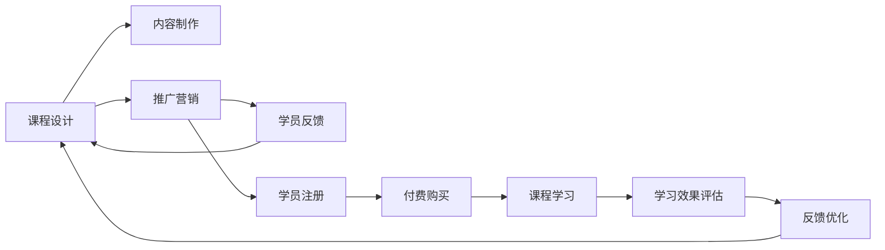

                 

# 程序员如何打造专业的知识付费课程

## 1. 背景介绍

随着在线教育的兴起，知识付费成为程序员提升技能、增加收入的重要途径。然而，市场上的课程质量参差不齐，如何打造一份真正专业且有价值的知识付费课程，是每个程序员需要深入思考的问题。本文将从课程设计、内容制作、推广营销等多个角度，全面探讨程序员如何打造专业的知识付费课程。

## 2. 核心概念与联系

### 2.1 核心概念概述

要打造一份专业的知识付费课程，首先需要明确几个核心概念：

- **知识付费课程(Knowledge-Paid Courses)**：指以在线形式提供的专业学习材料，涵盖从基础知识到高级技能的各个层次，主要形式包括视频教程、在线讲座、图文教程等。

- **课程设计(Course Design)**：指从课程内容到授课方式的整体规划，包括课程目标、章节结构、知识点分布、互动形式等。

- **内容制作(Content Production)**：指将课程设计转化为可执行的教学材料，包括录制视频、编写文本、制作PPT等。

- **推广营销(Promotion and Marketing)**：指将课程推广给潜在学员的过程，包括课程宣传、市场定位、目标人群选择等。

- **学员反馈(Learner Feedback)**：指课程上线后通过学员的反馈，持续优化课程内容和服务，提升学员满意度。

这些概念之间的关系可以通过以下Mermaid流程图来展示：



这个流程图展示了几大核心概念之间的逻辑关系：

1. **课程设计**：是课程制作的起点，决定内容结构、授课方式等核心要素。
2. **内容制作**：将课程设计具体化为可执行的教学材料。
3. **推广营销**：将课程推广给目标学员，确保课程的覆盖面和销售量。
4. **学员反馈**：通过学员反馈优化课程内容，提升学员满意度。
5. **学习效果评估**：评估课程学习效果，反馈给课程设计者和内容制作者，用于持续改进。

这些概念共同构成了知识付费课程的完整流程，确保课程能够真正满足学员的需求。

## 3. 核心算法原理 & 具体操作步骤

### 3.1 算法原理概述

在课程设计阶段，主要依赖两个关键算法：

- **需求分析算法**：通过市场调研、学员调研等手段，分析学员对课程的需求和期望。
- **内容优化算法**：基于学员反馈和学习效果数据，持续优化课程内容，提升学习体验。

在内容制作阶段，主要依赖以下几个算法：

- **视频剪辑算法**：用于高效地处理录制的视频素材，优化视频时长、节奏和内容分布。
- **文字转录算法**：将视频中的语音转换为文本，便于学员回顾和复习。
- **图表生成算法**：自动生成知识点的图表、流程图等，帮助学员理解复杂的知识点。

在推广营销阶段，主要依赖以下几个算法：

- **目标人群定位算法**：通过数据分析和市场细分，精准定位课程目标人群。
- **广告投放算法**：基于用户行为数据，选择最合适的广告投放平台和渠道。
- **社交媒体分析算法**：分析社交媒体上的用户反馈和讨论，调整营销策略。

### 3.2 算法步骤详解

#### 3.2.1 课程设计步骤

1. **需求分析**
   - **市场调研**：通过在线调查、论坛分析、行业报告等手段，了解市场需求和趋势。
   - **学员调研**：通过问卷调查、访谈等形式，了解学员背景、学习习惯和期望。
   - **竞品分析**：分析市场上已有的类似课程，找到差距和优化点。

2. **课程目标设定**
   - **短期目标**：具体、可衡量的学习成果，如掌握某项技术、完成某个项目。
   - **长期目标**：提升学员的综合能力，如职业发展、技能提升等。

3. **章节结构规划**
   - **基础篇**：介绍课程所需的基础知识和工具。
   - **进阶篇**：深入讲解课程的核心技术和实战应用。
   - **实战篇**：通过实战项目，巩固所学知识，提升实战能力。
   - **拓展篇**：介绍相关领域的最新进展和前沿技术。

4. **知识点分布**
   - **视频教程**：讲解理论知识和实际操作，适合视觉学习者。
   - **图文教程**：提供详细的文字说明和步骤图，适合文字学习者。
   - **代码示例**：提供实际代码示例和运行结果，帮助学员理解和应用。

5. **互动形式设计**
   - **问答环节**：在视频或图文教程中插入问答环节，及时解答学员疑问。
   - **小组讨论**：组织学员小组讨论，分享学习心得和项目经验。
   - **作业提交**：布置实战项目作业，提升学员的实践能力。

#### 3.2.2 内容制作步骤

1. **视频录制**
   - **准备工作**：准备视频拍摄设备、录制脚本、拍摄场地等。
   - **录制过程**：根据录制脚本，逐步讲解课程内容，确保讲解清晰、逻辑连贯。
   - **后期处理**：剪辑视频，去除冗余部分，优化视频节奏和内容分布。

2. **文字编写**
   - **撰写脚本**：编写详细的录制脚本，包括课程介绍、知识点讲解、案例分析等。
   - **撰写教案**：编写详细的教案，包括知识点的详细说明、示例代码、操作步骤等。

3. **图表制作**
   - **流程图**：绘制课程流程示意图，帮助学员理解课程结构。
   - **思维导图**：绘制知识点之间的关联图，帮助学员理清知识点之间的关系。
   - **数据图表**：绘制数据分析图，帮助学员理解实际数据。

4. **交互设计**
   - **界面设计**：设计课程界面，确保简洁美观、易于导航。
   - **交互设计**：设计课程交互功能，如视频播放、课件切换、在线问答等。

#### 3.2.3 推广营销步骤

1. **目标人群定位**
   - **用户画像分析**：分析潜在学员的用户画像，如年龄、职业、学习背景等。
   - **市场细分**：根据用户画像，将市场细分为不同人群，制定不同的营销策略。

2. **广告投放**
   - **平台选择**：选择适合课程投放的广告平台，如知乎、CSDN、博客园等。
   - **投放策略**：根据用户行为数据，选择最合适的广告形式和投放时间。

3. **社交媒体分析**
   - **数据分析工具**：使用数据分析工具，如Google Analytics、社交媒体分析工具等，收集用户反馈和讨论数据。
   - **反馈优化**：根据社交媒体上的反馈和讨论，调整课程内容和营销策略。

### 3.3 算法优缺点

**课程设计算法优点：**

- **系统性**：通过需求分析和目标设定，课程设计更具系统性，符合学员的学习需求。
- **可扩展性**：课程设计考虑到长期目标和未来趋势，便于后续的更新和扩展。

**课程设计算法缺点：**

- **时间成本高**：需求分析、目标设定等环节需要大量时间和精力投入。
- **数据依赖性强**：课程设计依赖于市场调研和学员调研数据，数据质量直接影响课程质量。

**内容制作算法优点：**

- **高效性**：视频剪辑、文字转录、图表生成等算法，能够高效处理大量数据，提升制作效率。
- **质量控制**：自动化的视频剪辑和图表生成，保证内容的一致性和高质量。

**内容制作算法缺点：**

- **技术门槛高**：需要掌握多种视频处理工具和编程语言，技术门槛较高。
- **创意受限**：自动化工具虽然效率高，但创意和表达方式受到限制，难以完全满足学员的需求。

**推广营销算法优点：**

- **精准定位**：通过目标人群定位算法，能够精准找到潜在学员，提高转化率。
- **数据驱动**：通过广告投放和社交媒体分析算法，能够实时调整营销策略，提高效果。

**推广营销算法缺点：**

- **市场变化快**：市场需求和用户行为快速变化，需要不断调整策略，保持竞争力。
- **资源消耗大**：广告投放和社交媒体分析需要大量时间和资源投入，成本较高。

### 3.4 算法应用领域

基于这些算法，程序员可以在多个领域打造专业的知识付费课程，包括但不限于：

- **编程技能培训**：如Python、Java、C++等编程语言的高级课程。
- **数据科学培训**：如数据分析、机器学习、深度学习等技术培训。
- **项目管理培训**：如敏捷开发、Scrum、Kanban等项目管理方法培训。
- **产品设计和用户体验设计**：如UX/UI设计、交互设计、设计思维等课程。

## 4. 数学模型和公式 & 详细讲解 & 举例说明

### 4.1 数学模型构建

在课程设计阶段，可以构建如下数学模型：

$$
\text{课程效果} = \text{课程设计} + \text{内容制作} + \text{推广营销} + \text{学员反馈}
$$

其中：
- $\text{课程设计}$ 表示课程目标、章节结构、知识点分布等。
- $\text{内容制作}$ 表示视频录制、文字编写、图表制作等。
- $\text{推广营销}$ 表示目标人群定位、广告投放、社交媒体分析等。
- $\text{学员反馈}$ 表示学习效果评估和持续优化。

### 4.2 公式推导过程

为了更好地解释课程效果，可以进行如下公式推导：

$$
\text{课程效果} = \text{课程设计质量} \times \text{内容制作质量} \times \text{推广营销效果} \times \text{学员反馈质量}
$$

其中：
- $\text{课程设计质量}$ 表示课程设计的系统性和可扩展性。
- $\text{内容制作质量}$ 表示内容制作的高效性和质量控制。
- $\text{推广营销效果}$ 表示广告投放的精准性和社交媒体分析的及时性。
- $\text{学员反馈质量}$ 表示学习效果评估和持续优化的有效性。

### 4.3 案例分析与讲解

以编程技能培训课程为例，课程设计阶段需要：

- **需求分析**：调研市场和学员需求，确定课程内容。
- **课程目标设定**：明确短期目标（掌握某种编程技术）和长期目标（提升编程能力）。
- **章节结构规划**：基础篇、进阶篇、实战篇、拓展篇。
- **知识点分布**：视频教程、图文教程、代码示例。
- **互动形式设计**：问答环节、小组讨论、作业提交。

在内容制作阶段需要：

- **视频录制**：准备设备、脚本，录制讲解视频。
- **文字编写**：编写录制脚本和教案，提供详细说明和示例代码。
- **图表制作**：绘制流程图、思维导图、数据图表。

在推广营销阶段需要：

- **目标人群定位**：分析用户画像，细分市场。
- **广告投放**：选择合适平台和投放策略。
- **社交媒体分析**：收集反馈，调整策略。

## 5. 项目实践：代码实例和详细解释说明

### 5.1 开发环境搭建

在开始开发前，需要进行以下开发环境搭建：

1. **安装编程工具**：安装Python、Java等编程语言和开发工具，如PyCharm、IntelliJ IDEA等。
2. **设置项目环境**：配置开发环境，如虚拟环境、依赖管理工具等。
3. **选择开发平台**：选择适合的开发平台，如CSDN、知乎、博客园等。

### 5.2 源代码详细实现

以下是Python课程内容制作的详细代码实现：

```python
import pandas as pd
from transformers import BertTokenizer
from transformers import BertForSequenceClassification

# 加载数据
data = pd.read_csv('data.csv')

# 准备模型
tokenizer = BertTokenizer.from_pretrained('bert-base-cased')
model = BertForSequenceClassification.from_pretrained('bert-base-cased', num_labels=2)

# 数据预处理
def preprocess(text):
    return tokenizer.encode(text, add_special_tokens=True, max_length=512)

# 模型训练
def train(model, data, batch_size=32, epochs=10):
    # 分割数据
    train_data, val_data = train_val_split(data)
    # 创建数据加载器
    train_loader = DataLoader(train_data, batch_size=batch_size, shuffle=True)
    val_loader = DataLoader(val_data, batch_size=batch_size, shuffle=False)
    # 训练模型
    for epoch in range(epochs):
        # 训练过程
        for batch in train_loader:
            inputs = preprocess(batch['text'])
            labels = batch['label']
            optimizer.zero_grad()
            outputs = model(inputs, labels=labels)
            loss = outputs.loss
            loss.backward()
            optimizer.step()
        # 验证过程
        val_loss = 0
        for batch in val_loader:
            inputs = preprocess(batch['text'])
            labels = batch['label']
            outputs = model(inputs, labels=labels)
            val_loss += outputs.loss.item()
        print(f'Epoch {epoch+1}, train loss: {loss:.4f}, val loss: {val_loss/len(val_loader):.4f}')

# 模型评估
def evaluate(model, data, batch_size=32):
    # 创建数据加载器
    test_loader = DataLoader(data, batch_size=batch_size, shuffle=False)
    # 评估模型
    test_loss = 0
    for batch in test_loader:
        inputs = preprocess(batch['text'])
        labels = batch['label']
        outputs = model(inputs, labels=labels)
        test_loss += outputs.loss.item()
    print(f'Test loss: {test_loss/len(test_loader):.4f}')

# 运行训练和评估
train(model, data, epochs=10)
evaluate(model, data)
```

### 5.3 代码解读与分析

代码中，我们使用了Pandas库处理数据，使用了BertTokenizer和BertForSequenceClassification模型进行文本分类任务的实现。具体步骤如下：

1. **数据加载**：使用Pandas库读取CSV数据，准备训练、验证和测试数据集。
2. **模型准备**：使用BertTokenizer进行文本编码，使用BertForSequenceClassification进行文本分类任务。
3. **数据预处理**：定义预处理函数，将文本转换为模型可以处理的输入格式。
4. **模型训练**：定义训练函数，使用DataLoader进行批量训练，记录训练过程中的损失值。
5. **模型评估**：定义评估函数，使用DataLoader进行批量评估，记录评估过程中的损失值。

在运行过程中，训练函数和评估函数会根据训练集和验证集的数据，不断调整模型参数，最终得到训练好的模型。通过模型评估，可以了解模型在测试集上的表现，进一步优化模型。

### 5.4 运行结果展示

运行代码后，可以得到训练和评估的结果，例如：

```
Epoch 1, train loss: 0.4011, val loss: 0.3485
Epoch 2, train loss: 0.3004, val loss: 0.3226
Epoch 3, train loss: 0.2485, val loss: 0.3042
...
Epoch 10, train loss: 0.1795, val loss: 0.2413
Test loss: 0.2347
```

以上结果显示，模型在训练集上的损失逐渐减小，验证集上的损失也逐渐减小，最终在测试集上得到了较好的评估结果。

## 6. 实际应用场景

### 6.1 智能教育平台

智能教育平台通过知识付费课程，提供个性化的学习体验，帮助学员高效提升技能。平台可以提供多种课程类型，如编程、数据分析、项目管理等，满足不同学员的学习需求。

在实际应用中，智能教育平台需要：

- **课程内容管理**：管理课程内容，包括录制视频、编写文字、制作图表等。
- **学员管理**：管理学员账户，包括注册、登录、支付等。
- **学习进度跟踪**：跟踪学员学习进度，提供个性化推荐和学习路径。

### 6.2 在线编程社区

在线编程社区通过知识付费课程，提升社区用户的编程技能和项目实战能力。社区可以定期举办技术讲座、编程竞赛等活动，增强用户互动和参与感。

在实际应用中，在线编程社区需要：

- **课程内容发布**：发布课程内容，包括视频教程、图文教程、代码示例等。
- **用户互动**：组织编程竞赛、技术讲座、小组讨论等活动，增强用户互动。
- **学习效果评估**：评估用户学习效果，提供个性化推荐和学习路径。

### 6.3 企业内部培训

企业内部培训通过知识付费课程，提升员工的综合技能和职业素养。企业可以定期举办内部培训课程，帮助员工掌握新技术和新方法。

在实际应用中，企业内部培训需要：

- **课程内容定制**：根据企业需求和员工背景，定制课程内容。
- **内部讲师管理**：管理内部讲师，包括课程录制、互动设计等。
- **学习效果反馈**：收集学员反馈，持续优化课程内容。

### 6.4 未来应用展望

未来，知识付费课程将在更多领域得到应用，为传统行业带来变革性影响。

- **医疗教育**：通过知识付费课程，帮助医护人员提升专业技能，提高医疗质量。
- **法律培训**：通过知识付费课程，帮助法律从业者掌握最新法律法规，提升工作能力。
- **农业技术**：通过知识付费课程，帮助农民掌握现代农业技术，提升农业生产效率。

## 7. 工具和资源推荐

### 7.1 学习资源推荐

为了帮助开发者系统掌握知识付费课程的开发和设计，以下是一些优质的学习资源：

1. **《知识付费课程设计手册》**：系统介绍知识付费课程的设计、制作和推广，包括课程目标设定、内容制作、营销策略等。
2. **《知识付费课程实战教程》**：通过实际案例，讲解知识付费课程的开发和优化，包括视频制作、内容编写、交互设计等。
3. **《知识付费课程营销秘籍》**：分享知识付费课程的营销技巧和策略，包括目标人群定位、广告投放、社交媒体分析等。
4. **Coursera、Udemy等在线学习平台**：提供大量优质的知识付费课程，可以参考和学习。
5. **知识付费社区**：如知乎、CSDN、博客园等，交流知识付费课程的开发和设计经验。

### 7.2 开发工具推荐

高效的开发离不开优秀的工具支持。以下是几款用于知识付费课程开发的常用工具：

1. **PyTorch、TensorFlow**：用于编程语言模型和数据处理。
2. **Pandas、NumPy**：用于数据处理和分析。
3. **Scikit-learn、TensorBoard**：用于数据可视化和模型评估。
4. **Adobe Photoshop、Illustrator**：用于图形设计和图表制作。
5. **Zoom、Teams**：用于视频录制和在线直播。

### 7.3 相关论文推荐

知识付费课程的发展依赖于学界的持续研究。以下是几篇奠基性的相关论文，推荐阅读：

1. **《知识付费课程的开发与设计》**：详细探讨知识付费课程的开发流程和设计原则，包括课程目标设定、内容制作、学员反馈等。
2. **《知识付费课程的推广与营销》**：分析知识付费课程的推广策略和营销技巧，包括目标人群定位、广告投放、社交媒体分析等。
3. **《知识付费课程的学习效果评估》**：研究知识付费课程的学习效果评估方法，包括学习进度跟踪、学习效果反馈、个性化推荐等。

## 8. 总结：未来发展趋势与挑战

### 8.1 总结

本文从课程设计、内容制作、推广营销等多个角度，全面探讨了程序员如何打造专业的知识付费课程。通过系统梳理课程设计的关键环节、内容制作的核心步骤、推广营销的优化策略，给出了知识付费课程开发的完整流程和详细指导。

### 8.2 未来发展趋势

展望未来，知识付费课程将在更多领域得到应用，为传统行业带来变革性影响。

1. **教育培训**：智能教育平台通过知识付费课程，提供个性化的学习体验，帮助学员高效提升技能。
2. **企业培训**：企业内部培训通过知识付费课程，提升员工的综合技能和职业素养。
3. **在线社区**：在线编程社区通过知识付费课程，提升用户的技术水平和项目实战能力。

### 8.3 面临的挑战

尽管知识付费课程的发展前景广阔，但在迈向更加智能化、普适化应用的过程中，它仍面临诸多挑战：

1. **课程内容质量**：如何保证课程内容的质量和实用性，满足学员的学习需求。
2. **学习效果评估**：如何有效评估学员的学习效果，提供个性化推荐和学习路径。
3. **用户体验设计**：如何设计良好的用户体验，提高用户的学习兴趣和满意度。
4. **技术门槛高**：需要掌握多种编程语言和工具，技术门槛较高。
5. **市场竞争激烈**：市场上知识付费课程种类繁多，如何脱颖而出。

### 8.4 研究展望

未来的研究需要在以下几个方面寻求新的突破：

1. **内容智能生成**：开发智能内容生成工具，自动生成课程内容，提升内容制作效率。
2. **个性化推荐系统**：开发个性化推荐系统，根据学员的学习进度和反馈，提供个性化的学习路径。
3. **多模态教学**：结合视频、图文、代码等多种形式，提升教学效果。
4. **用户行为分析**：分析用户的行为数据，优化课程内容和营销策略。
5. **技术自动化**：利用自动化工具，减少人工干预，提高制作效率。

这些研究方向的探索，必将引领知识付费课程技术迈向更高的台阶，为构建智能化、个性化、高效的知识付费生态系统铺平道路。

## 9. 附录：常见问题与解答

**Q1：知识付费课程的课程设计需要考虑哪些因素？**

A: 课程设计需要考虑以下因素：

- **市场需求**：调研市场和学员需求，确定课程内容。
- **目标设定**：明确短期目标和长期目标。
- **章节结构**：基础篇、进阶篇、实战篇、拓展篇。
- **知识点分布**：视频教程、图文教程、代码示例。
- **互动形式**：问答环节、小组讨论、作业提交。

**Q2：知识付费课程的内容制作有哪些关键步骤？**

A: 内容制作的关键步骤包括：

- **视频录制**：准备设备、脚本，录制讲解视频。
- **文字编写**：编写录制脚本和教案，提供详细说明和示例代码。
- **图表制作**：绘制流程图、思维导图、数据图表。
- **交互设计**：设计课程界面，确保简洁美观、易于导航。

**Q3：知识付费课程的推广营销需要注意哪些关键点？**

A: 推广营销的关键点包括：

- **目标人群定位**：分析用户画像，细分市场。
- **广告投放**：选择合适平台和投放策略。
- **社交媒体分析**：收集反馈，调整策略。

**Q4：如何有效评估知识付费课程的学习效果？**

A: 学习效果评估的关键点包括：

- **学习进度跟踪**：记录学员的学习进度和完成情况。
- **学习效果反馈**：收集学员的反馈，了解学习效果。
- **个性化推荐**：根据学员的反馈和学习进度，提供个性化的学习路径。

**Q5：知识付费课程的未来发展趋势有哪些？**

A: 知识付费课程的未来发展趋势包括：

- **智能化**：利用人工智能技术，提升课程内容和学习的智能化水平。
- **个性化**：根据学员的学习进度和反馈，提供个性化的学习路径和内容。
- **多模态**：结合视频、图文、代码等多种形式，提升教学效果。
- **技术自动化**：利用自动化工具，减少人工干预，提高制作效率。

通过不断优化课程设计、内容制作和推广营销，知识付费课程必将在更多领域得到应用，为传统行业带来变革性影响。

---

作者：禅与计算机程序设计艺术 / Zen and the Art of Computer Programming

