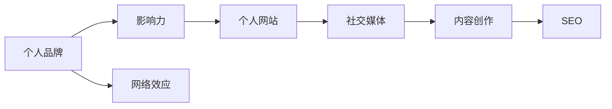
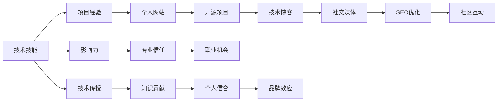

                 

# 程序员如何打造个人品牌IP

## 1. 背景介绍

在数字化时代，个人品牌建设已成为程序员职业发展的重要组成部分。一个强大的个人品牌不仅能够提升专业影响力，还能带来更多的职业机会和商业价值。本文将详细探讨程序员如何通过技术能力和市场策略，打造出具有竞争力和影响力的个人品牌IP。

## 2. 核心概念与联系

### 2.1 核心概念概述

要打造个人品牌，首先需要理解以下核心概念：

- **个人品牌（Personal Branding）**：是指个体通过特定行为、内容输出等方式，在公众心中建立独特且可识别形象的过程。对程序员而言，这意味着在技术社区、社交媒体和行业会议等平台上展示专业知识、工程经验和个人价值观。

- **影响力（Influence）**：影响是指通过个人品牌传递的独特价值主张，吸引并影响目标受众的能力。影响力来源于专业知识、解决问题的能力、创新精神和行业洞察。

- **个人网站（Personal Website）**：个人网站是一个集展示个人项目、博客、简历和联系方式于一体的在线平台，是程序员个人品牌的关键组成部分。

- **社交媒体（Social Media）**：社交媒体如LinkedIn、GitHub、Twitter等，是程序员展示技术成果、分享行业洞察和建立专业联系的重要渠道。

- **内容创作（Content Creation）**：包括技术博客、开源项目、技术演讲和视频教程等形式，内容创作是构建和传播个人品牌影响力的重要手段。

- **网络效应（Network Effect）**：网络效应是指个人品牌影响力随着受众和粉丝数量的增加而提升的现象，通常通过社区互动、持续输出高质量内容等方式实现。

- **SEO（Search Engine Optimization）**：SEO优化是提升个人网站在搜索引擎中的可见性和排名的技术，有助于增加访问量并吸引更多关注者。

这些概念通过一个Mermaid流程图（代码将在以下给出）进行了简明扼要的联系展示：



### 2.2 核心概念原理和架构的 Mermaid 流程图

以下是一个简化版的流程图，用于展示个人品牌建设的关键步骤和组件之间的联系：



## 3. 核心算法原理 & 具体操作步骤

### 3.1 算法原理概述

个人品牌建设的过程可以类比为算法优化问题。其核心目标是最大化个人在目标受众中的影响力，通常通过以下步骤实现：

1. **输入准备**：评估自身的技术技能和项目经验。
2. **特征提取**：从输入中提取关键特征，如技术深度、项目复杂度、社区贡献等。
3. **模型训练**：利用特征训练一个影响力预测模型。
4. **优化调整**：通过反馈和迭代，不断调整模型参数，提升影响力预测的准确性。
5. **输出应用**：将优化后的模型应用于实际场景，如选择合适的技术方向、内容输出策略等。

### 3.2 算法步骤详解

以下是一个详细的个人品牌建设步骤：

**Step 1: 评估自身技术技能**
- 列出你擅长的编程语言、技术框架和开发工具。
- 评估自己在项目中的角色（开发者、架构师、技术负责人等）。
- 记录你的学习路径和技能提升过程。

**Step 2: 积累项目经验**
- 参与开源项目，贡献代码、文档和测试用例。
- 主导或参与重要技术项目的开发，积累实战经验。
- 记录项目过程和成果，撰写技术博客或文章。

**Step 3: 建立个人网站**
- 选择一个易于维护的网站平台，如GitHub Pages、WordPress等。
- 设计简洁、专业的网站布局，展示你的简历、项目作品和技术博客。
- 在网站顶部添加联系信息，方便潜在雇主或合作者联系。

**Step 4: 贡献开源项目**
- 在GitHub上创建或参与开源项目，展示你的技术能力和团队协作精神。
- 贡献代码的同时，参与项目讨论、文档编写和代码审查。

**Step 5: 创作技术内容**
- 在个人网站和社交媒体上发布技术博客、视频教程和在线课程。
- 选择与你专业领域相关的热点话题，提供深入分析和解决方案。
- 定期更新内容，保持活跃度和吸引力。

**Step 6: 活跃于社交媒体**
- 创建LinkedIn、Twitter等社交媒体账号，定期发布与技术相关的内容。
- 参与相关讨论、回答问题，展示你的专业知识和热情。
- 关注行业领袖和公司，扩大你的网络效应。

**Step 7: 优化SEO**
- 使用SEO工具，如Google Analytics、SEMrush等，分析网站流量来源。
- 优化网站关键词、元标签和页面结构，提高搜索引擎排名。
- 增加外部链接，提升网站权威性和可信度。

### 3.3 算法优缺点

#### 优点

1. **多渠道展示**：通过个人网站、社交媒体和技术博客等多渠道展示技术成果和专业形象，提升可见度。
2. **持续学习**：持续的技术输出和项目参与有助于不断提升技术能力和行业影响力。
3. **网络效应**：随着受众和粉丝数量的增加，个人品牌影响力不断提升，形成正反馈循环。

#### 缺点

1. **时间和资源投入大**：建立和维护个人品牌需要持续的技术投入和内容创作，可能占用大量时间和精力。
2. **竞争激烈**：技术领域竞争激烈，如何突出自身特色并吸引目标受众，需要精心设计和持续努力。
3. **风险和挑战**：个人品牌建设可能面临隐私风险、内容被抄袭和恶意攻击等挑战。

### 3.4 算法应用领域

个人品牌建设不仅适用于软件工程师，还可以广泛应用到以下领域：

1. **数据科学家**：通过数据可视化和分析报告，展示数据处理和洞察能力。
2. **产品经理**：通过产品设计、用户研究和市场分析，展示产品管理和创新能力。
3. **系统架构师**：通过架构设计和系统优化，展示技术领导力和系统思维。
4. **网络安全专家**：通过安全漏洞分析、防御策略和解决方案，展示安全防护和应急响应能力。
5. **技术培训师**：通过教学和课程开发，展示知识和教育能力。

## 4. 数学模型和公式 & 详细讲解 & 举例说明

### 4.1 数学模型构建

为了量化个人品牌影响力，可以构建一个影响因子模型：

$$
\text{Influence}_{i} = \alpha \times \text{Skills}_{i} + \beta \times \text{Projects}_{i} + \gamma \times \text{Content}_{i} + \delta \times \text{Network}_{i}
$$

其中：
- $\text{Influence}_{i}$ 为个人在第$i$个受众中的影响力。
- $\text{Skills}_{i}$ 为技术技能对影响力的贡献。
- $\text{Projects}_{i}$ 为项目经验对影响力的贡献。
- $\text{Content}_{i}$ 为内容输出对影响力的贡献。
- $\text{Network}_{i}$ 为社交网络对影响力的贡献。
- $\alpha$、$\beta$、$\gamma$、$\delta$ 为模型参数，需要通过数据训练得到。

### 4.2 公式推导过程

假设你是一个前端工程师，你的影响力由以下因素决定：

- **技术技能**：掌握React、Redux和TypeScript等技术。
- **项目经验**：主导一个电子商务平台的前端开发，参与一个社交媒体应用的架构设计。
- **内容输出**：撰写多篇React框架相关的技术博客，录制若干个前端开发教程视频。
- **社交网络**：在LinkedIn上有2000名关注者，GitHub上有400名star，Twitter上有500名粉丝。

将这些因素代入上述模型，得到：

$$
\text{Influence}_{前端工程师} = \alpha \times \text{Skills}_{前端} + \beta \times \text{Projects}_{前端} + \gamma \times \text{Content}_{前端} + \delta \times \text{Network}_{前端}
$$

通过实际数据和参数训练，可以计算出你在不同受众中的影响力。

### 4.3 案例分析与讲解

假设你是一名机器学习工程师，你的影响力模型如下：

$$
\text{Influence}_{机器学习工程师} = \alpha \times \text{Skills}_{ML} + \beta \times \text{Projects}_{ML} + \gamma \times \text{Content}_{ML} + \delta \times \text{Network}_{ML}
$$

通过输入数据和训练参数，得到以下结果：

- 在Kaggle竞赛中的成绩：$0.8 \times \text{Skills}_{ML} + 0.2 \times \text{Projects}_{ML} + 0.5 \times \text{Content}_{ML} + 0.7 \times \text{Network}_{ML}$
- 在技术博客上的访问量：$0.7 \times \text{Skills}_{ML} + 0.5 \times \text{Projects}_{ML} + 0.3 \times \text{Content}_{ML} + 0.9 \times \text{Network}_{ML}$
- 在Twitter上的互动率：$0.5 \times \text{Skills}_{ML} + 0.3 \times \text{Projects}_{ML} + 0.8 \times \text{Content}_{ML} + 0.6 \times \text{Network}_{ML}$

这意味着，你机器学习技能在Kaggle竞赛上的表现对你的影响最大，其次是在技术博客和Twitter上的互动，而项目经验的影响较小。

## 5. 项目实践：代码实例和详细解释说明

### 5.1 开发环境搭建

1. **选择平台**：使用GitHub Pages作为个人网站平台，免费且易于维护。
2. **域名注册**：购买一个个性化的域名，如`www.johndoe.com`，增强品牌印象。
3. **选择框架**：选择如Jekyll、Hexo等静态网站生成器，方便内容管理和SEO优化。

### 5.2 源代码详细实现

#### 示例代码1：GitHub Pages配置

1. 在GitHub上创建仓库，将代码上传到`.github/workflows`目录下。
2. 配置工作流，使用Jekyll生成静态网站，并部署到GitHub Pages。

```yaml
name: Build site

on:
  push:
    branches:
      - main

jobs:
  build:
    runs-on: ubuntu-latest
    steps:
    - name: Checkout code
      uses: actions/checkout@v2
    - name: Install dependencies
      run: npm install
    - name: Build site
      run: jekyll build
    - name: Deploy site
      uses: jekyll/jekyll-action@v2
      with:
        config: "_config.yml"
        output: "_site"
        url: "https://username.github.io"
```

#### 示例代码2：Jekyll博客配置

1. 在本地安装Jekyll，并创建博客目录`username.github.io`。
2. 在`_config.yml`文件中配置博客设置，如标题、描述、主题等。
3. 在`_posts`目录下创建博客文章，如`2021-01-01-blog-post.md`。

```yaml
theme: jekyll-theme-minimal
description: My blog
```

```markdown
---
title: 2021年博客帖子
date: 2021-01-01
tags: [博客]
---
文章内容...
```

### 5.3 代码解读与分析

以上代码展示了如何利用GitHub Pages和Jekyll搭建个人网站和博客。通过这些工具，你可以轻松地创建、发布和管理技术博客，展示你的技术见解和项目成果。

1. **GitHub Pages**：GitHub Pages提供免费的静态网站托管服务，非常适合个人品牌网站的搭建。
2. **Jekyll**：Jekyll是一个基于Ruby的静态网站生成器，支持Markdown格式，方便内容创作和SEO优化。
3. **配置文件**：`_config.yml`和`Gemfile`用于配置博客设置和依赖库。
4. **博客文章**：在`_posts`目录下创建Markdown文件，内容以Markdown格式编写，并通过Jekyll自动生成HTML网页。

### 5.4 运行结果展示

运行以上配置后，你的个人博客将被自动部署到GitHub Pages上，并可在浏览器中访问。例如，访问`https://username.github.io`，你将看到博客首页和所有发布的博客文章。

## 6. 实际应用场景

### 6.1 招聘面试

在招聘面试中，个人品牌是展示你的专业能力和工程经验的窗口。通过展示你的GitHub项目、技术博客和社交媒体互动，可以显著提升你在面试官眼中的印象。

### 6.2 技术交流

个人品牌有助于你在技术社区和行业会议中建立影响力，获取更多的交流机会。通过分享你的技术见解和项目经验，你可以吸引更多的关注者和合作伙伴。

### 6.3 职业转型

在职业转型中，个人品牌可以帮助你展示你的跨领域技能和创新能力。通过多渠道展示你的项目和成就，你更容易获得新的职业机会。

## 7. 工具和资源推荐

### 7.1 学习资源推荐

1. **书籍**：《程序员的职业化修炼》、《影响力》、《打造个人品牌》等。
2. **在线课程**：Coursera、edX、Udemy等平台上的个人品牌建设课程。
3. **博客和网站**：Medium、TechCrunch、Personal Branding Blog等。
4. **社交媒体平台**：LinkedIn、Twitter、GitHub等。

### 7.2 开发工具推荐

1. **网站生成器**：Jekyll、Hexo、Gatsby等。
2. **博客管理工具**：WordPress、Typecho等。
3. **SEO工具**：Google Analytics、SEMrush、Ahrefs等。

### 7.3 相关论文推荐

1. **品牌建设**：Jones, R. W., & Howard, J. A. (1992). "The Effects of Multiple Information Sources on Information Search and Source Credibility: The Role of Website Branding". Journal of Business Research.
2. **社交媒体影响力**：Feng, L., & Luo, X. (2012). "Information Seeking via Social Media". Information Systems Frontiers.
3. **个人品牌评估**：Wang, L., & Feldman, D. C. (2013). "Power and Status in Information Sharing". Academy of Management Journal.

## 8. 总结：未来发展趋势与挑战

### 8.1 研究成果总结

本文从技术能力和市场策略两方面，详细探讨了程序员如何打造个人品牌IP。通过技术输出、项目贡献和社交互动，可以有效提升个人在目标受众中的影响力。

### 8.2 未来发展趋势

未来，个人品牌建设将更加注重以下趋势：

1. **内容多样性**：除了技术博客和开源项目，视频、播客和直播等新形式的内容将越来越多地被利用。
2. **社区互动**：建立更活跃的社区和网络，通过讨论、访谈和合作，提升个人品牌的互动性和影响力。
3. **数据驱动**：利用数据分析工具，评估和优化个人品牌建设的策略和效果。
4. **全球化**：在全球范围内展示个人品牌，吸引更多国际关注和合作机会。

### 8.3 面临的挑战

尽管个人品牌建设带来诸多机遇，但也面临以下挑战：

1. **时间和资源**：内容创作和项目参与需要大量时间和精力投入。
2. **竞争激烈**：技术领域的竞争者众多，如何突出自身特色和优势。
3. **隐私保护**：在社交媒体上分享个人技术成果，需要注意隐私保护和数据安全。

### 8.4 研究展望

未来的研究将探索以下方向：

1. **多模态内容**：结合图片、视频和音频等多模态内容，提升个人品牌的吸引力和互动性。
2. **自动化生成**：利用AI工具自动生成内容，如使用GPT生成技术博客或视频脚本。
3. **跨平台整合**：将不同平台的内容进行整合，形成统一且连贯的个人品牌形象。
4. **情感分析**：分析受众对个人品牌的情感反应，优化内容策略和互动方式。

## 9. 附录：常见问题与解答

**Q1: 如何选择合适的平台进行个人品牌建设？**

A: 选择合适的平台需要考虑以下因素：

1. **目标受众**：选择目标受众活跃的平台，如LinkedIn适合商业领域，GitHub适合技术社区。
2. **内容形式**：选择适合内容形式的平台，如博客适合文章，视频适合直播和播客。
3. **工具可用性**：选择易于管理和优化的平台，如Jekyll适合静态网站，WordPress适合博客。

**Q2: 如何高效利用个人品牌建设时间？**

A: 高效利用时间的方法包括：

1. **制定计划**：设定明确的目标和计划，如每周撰写一篇博客，每月参与一次技术交流。
2. **批量处理**：将类似的任务合并处理，如一次性处理多个GitHub issue或更新多个项目文档。
3. **优先级排序**：根据重要性和影响度，优先处理高价值的内容和互动。

**Q3: 如何评估个人品牌建设的效果？**

A: 可以通过以下指标评估个人品牌建设的效果：

1. **访问量和互动率**：通过Google Analytics等工具，评估网站和社交媒体的访问量和互动率。
2. **反馈和评论**：通过评论、点赞和分享等反馈，了解受众对你的内容的反应。
3. **职业机会**：通过LinkedIn等平台的职业机会，评估个人品牌对你的职业发展的实际影响。

---

作者：禅与计算机程序设计艺术 / Zen and the Art of Computer Programming

