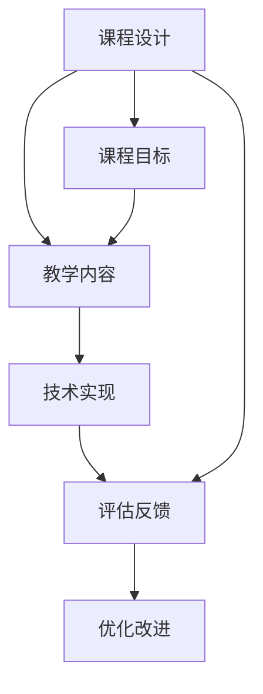

                 

# 程序员如何打造高质量的在线编程课程

## 1. 背景介绍

在数字化快速发展的今天，编程技能已成为个人职业发展的重要组成部分。越来越多的人希望能够通过在线编程课程掌握编程技能，但如何打造高质量的在线编程课程是一个值得深入探讨的问题。高质量的在线编程课程能够帮助学习者高效、系统地掌握编程技能，从而在职场中脱颖而出。本文将探讨如何打造高质量的在线编程课程，涵盖课程设计、教学内容、技术实现、评估反馈等多个方面，为程序员提供实用的指导。

## 2. 核心概念与联系

### 2.1 核心概念概述

在线编程课程是指通过互联网平台，借助视频、文本、代码等形式向学习者传递编程知识和技能的教育形式。其核心概念包括课程设计、教学内容、技术实现、评估反馈等。这些概念之间的关系可以通过以下Mermaid流程图来展示：



**课程设计**：基于学习者的需求和目标，设计课程内容、结构、节奏等。

**教学内容**：课程内容的组织、安排，包括但不限于编程基础、项目实践、技术案例等。

**技术实现**：课程平台的技术支持，如视频录制、互动设计、代码提交等。

**评估反馈**：通过作业、测试、讨论等形式评估学习者掌握程度，并提供改进建议。

这些核心概念之间的逻辑关系是通过流程图来呈现的，每个环节相互关联，共同构成高质量在线编程课程的基石。

## 3. 核心算法原理 & 具体操作步骤

### 3.1 算法原理概述

在线编程课程的设计和实施涉及多个技术环节，核心算法原理包括课程设计算法、教学内容组织算法、技术实现算法和评估反馈算法等。

- **课程设计算法**：通过分析学习者的背景、需求、目标，设计出符合学习者需求的课程内容，包括课程结构、难度分布、进度安排等。
- **教学内容组织算法**：将课程内容系统地组织起来，通过模块化设计，使学习者能够循序渐进地掌握编程技能。
- **技术实现算法**：包括视频录制、互动设计、代码提交等技术环节，通过算法设计实现高效、互动的学习环境。
- **评估反馈算法**：通过评估算法判断学习者的掌握程度，通过反馈算法提供个性化的改进建议，促进学习者进步。

### 3.2 算法步骤详解

1. **课程设计步骤**：
   - **需求调研**：通过问卷、访谈等方式了解学习者的背景、需求和目标。
   - **课程规划**：根据需求调研结果，设计课程内容、结构、难度分布、进度安排等。
   - **内容制作**：制作课程视频、讲义、作业、项目等教学材料。

2. **教学内容组织步骤**：
   - **模块化设计**：将课程内容划分为多个模块，每个模块包含特定的知识点和技能。
   - **逻辑层次**：从基础概念到高级应用，逐步推进学习内容。
   - **项目实践**：通过项目实践，使学习者能够将理论知识应用于实际问题。

3. **技术实现步骤**：
   - **平台搭建**：选择适合的在线编程平台，搭建课程管理系统。
   - **视频录制**：使用专业设备录制课程视频，确保音视频质量。
   - **互动设计**：设计互动环节，如在线问答、代码评审、讨论区等，增加互动性。
   - **代码提交**：实现代码提交功能，允许学习者在线提交代码，并自动评测。

4. **评估反馈步骤**：
   - **评估设计**：设计评估任务，包括作业、测试、项目等，确保全面覆盖课程内容。
   - **评估实施**：通过在线平台自动批改作业、测试，及时反馈学习者表现。
   - **反馈机制**：根据评估结果，提供个性化的改进建议，促进学习者进步。

### 3.3 算法优缺点

在线编程课程的算法设计有其独特的优势和挑战：

**优势**：
- **灵活性**：能够根据学习者的需求和进度灵活调整课程内容。
- **互动性**：通过在线平台设计互动环节，增加学习者的参与度。
- **可扩展性**：易于扩展，适应不同规模的学习群体。

**挑战**：
- **技术实现复杂**：涉及视频录制、互动设计、代码提交等多个技术环节，需要较高的技术水平。
- **内容质量控制**：需要确保课程内容的准确性、时效性和实用性。
- **学习者自我管理**：需要学习者具备较高的自我管理能力，才能高效完成课程学习。

### 3.4 算法应用领域

在线编程课程可以广泛应用于多种场景，如编程入门、技术升级、职业转型等。其应用领域包括但不限于：

- **编程入门**：适合初学者，帮助学习者掌握编程基础，为后续学习奠定基础。
- **技术升级**：适合有一定基础的程序员，帮助学习者掌握新技术、新工具。
- **职业转型**：适合希望转型的职场人士，帮助学习者掌握新领域的技术和技能。
- **企业培训**：适合企业内部培训，提高员工编程能力和技术水平。

## 4. 数学模型和公式 & 详细讲解 & 举例说明

### 4.1 数学模型构建

在线编程课程的数学模型包括课程设计、教学内容、技术实现和评估反馈等。

**课程设计模型**：
- 输入：学习者的背景、需求、目标
- 输出：课程内容、结构、进度安排

**教学内容模型**：
- 输入：课程设计结果
- 输出：模块化内容、逻辑层次、项目实践

**技术实现模型**：
- 输入：课程内容、互动需求、评估要求
- 输出：在线平台、视频录制、互动设计、代码提交功能

**评估反馈模型**：
- 输入：学习者提交的作业、测试结果
- 输出：评估分数、反馈建议

### 4.2 公式推导过程

以课程设计模型为例，其数学公式可以表示为：
$$
C = f(D,N,G)
$$
其中 $C$ 为课程内容，$D$ 为学习者的背景和需求，$N$ 为课程目标，$G$ 为教学资源的可用性。

公式推导过程如下：
1. 分析学习者的背景和需求，获取 $D$。
2. 确定课程目标 $N$，如掌握编程基础、掌握新技术等。
3. 根据学习者的需求和目标，设计课程内容 $C$。
4. 结合教学资源的可用性 $G$，进行课程规划。

### 4.3 案例分析与讲解

**案例分析**：某在线编程课程，旨在帮助初学者掌握Python编程基础。

1. **需求调研**：通过问卷和访谈了解学习者的背景和需求，发现大多数学习者没有编程基础，希望通过课程掌握Python基础。
2. **课程规划**：设计课程内容，包括变量、数据类型、函数、模块等基础知识，以及简单的项目实践，如编写计算器、统计分析等。
3. **内容制作**：制作课程视频、讲义、作业等教学材料，确保内容的准确性和实用性。
4. **平台搭建**：选择适合的在线编程平台，搭建课程管理系统，实现视频录制、互动设计、代码提交等功能。
5. **评估反馈**：设计作业、测试等评估任务，自动批改并及时反馈学习者表现，提供个性化的改进建议。

## 5. 项目实践：代码实例和详细解释说明

### 5.1 开发环境搭建

在线编程课程的开发环境搭建包括课程平台搭建和课程内容制作。

**课程平台搭建**：
1. 选择合适的在线编程平台，如Coursera、Udemy等。
2. 搭建课程管理系统，实现视频录制、互动设计、代码提交等功能。
3. 配置评估系统，设计评估任务，自动批改作业和测试。

**课程内容制作**：
1. 确定课程目标和内容，设计课程结构、难度分布、进度安排。
2. 制作课程视频、讲义、作业、项目等教学材料。
3. 测试和优化教学材料，确保内容的准确性和实用性。

### 5.2 源代码详细实现

以下是一个简单的在线编程课程平台搭建的Python代码实现：

```python
class OnlineCoursePlatform:
    def __init__(self):
        self.video_recorder = VideoRecorder()
        self.interactive_designer = InteractiveDesigner()
        self.code_submission = CodeSubmission()
        self.assessment_system = AssessmentSystem()
    
    def build_course(self, course_name, course_content):
        # 实现平台搭建
        self.video_recorder.start_recording()
        self.interactive_designer.add_interactions(course_content)
        self.code_submission.add_code_submission(course_content)
        self.assessment_system.setup_assessment(course_content)
    
    def deploy_course(self, course_name, course_content):
        # 实现课程部署
        self.video_recorder.stop_recording()
        self.interactive_designer.save_designs()
        self.code_submission.save_submission()
        self.assessment_system.save_assessment(course_content)
```

### 5.3 代码解读与分析

**视频录制**：使用专业设备录制课程视频，确保音视频质量。

**互动设计**：设计互动环节，如在线问答、代码评审、讨论区等，增加学习者的参与度。

**代码提交**：实现代码提交功能，允许学习者在线提交代码，并自动评测。

**评估系统**：设计评估任务，包括作业、测试、项目等，确保全面覆盖课程内容，自动批改并及时反馈学习者表现，提供个性化的改进建议。

### 5.4 运行结果展示

在线编程课程的运行结果展示包括课程视频的展示、互动环节的反馈、作业和测试的结果展示等。

- **课程视频展示**：通过平台展示录制的视频，学习者可随时观看。
- **互动环节反馈**：学习者在互动环节中的表现，如回答问题的正确率、代码评审的反馈等。
- **作业和测试结果**：学习者提交作业和测试后，系统自动批改并展示结果，并提供改进建议。

## 6. 实际应用场景

### 6.1 编程入门

在线编程课程在编程入门方面具有显著优势。通过系统的课程设计，学习者可以逐步掌握编程基础，为后续学习奠定坚实的基础。

**实际应用**：某在线编程入门课程，旨在帮助初学者掌握Python基础。课程内容包括变量、数据类型、函数、模块等基础知识，通过项目实践，使学习者能够编写简单的程序。

### 6.2 技术升级

在线编程课程可以帮助有一定基础的程序员掌握新技术、新工具，提高工作效率。

**实际应用**：某在线编程课程，旨在帮助Java程序员掌握JavaScript框架React。课程内容包括React基础、组件、状态管理等，通过项目实践，使学习者能够开发React应用。

### 6.3 职业转型

在线编程课程适合希望转型的职场人士，帮助学习者掌握新领域的技术和技能，顺利实现职业转型。

**实际应用**：某在线编程课程，旨在帮助金融行业从业者掌握Python编程技能，进一步拓展职业发展路径。课程内容包括Python基础、金融数据分析、金融算法等，通过项目实践，使学习者能够处理金融数据、开发金融算法。

### 6.4 企业培训

在线编程课程适合企业内部培训，提高员工编程能力和技术水平。

**实际应用**：某在线编程课程，旨在提高公司程序员的编程能力。课程内容包括最新的编程技术、最佳实践等，通过项目实践，使学习者能够应对实际工作中的技术挑战。

## 7. 工具和资源推荐

### 7.1 学习资源推荐

- **Coursera**：提供大量高质量的在线课程，涵盖编程基础、项目实践、技术升级等多个方面。
- **Udemy**：提供灵活的在线编程课程，适合自定进度的学习者。
- **Codecademy**：提供互动式编程学习体验，适合初学者和进阶者。
- **Kaggle**：提供数据科学竞赛，通过实践项目提升编程技能和数据分析能力。

### 7.2 开发工具推荐

- **Zoom**：用于在线课程视频录制和互动设计。
- **Slido**：用于在线互动问答环节。
- **GitHub**：用于代码提交和版本控制。
- **Jupyter Notebook**：用于编写和展示代码，支持动态展示和代码执行。

### 7.3 相关论文推荐

- **Designing Effective Online Learning Communities**：探讨在线学习社区的设计和管理，提升学习者互动和参与度。
- **Bridging the Gap: Making Online Programming Courses Effective**：研究如何提高在线编程课程的有效性，包括课程设计、教学内容、技术实现等方面。
- **Using Peer Assessments to Enhance Student Learning**：探讨通过同行评审提升学习者编程技能的方法。

## 8. 总结：未来发展趋势与挑战

### 8.1 总结

本文系统探讨了如何打造高质量的在线编程课程，涵盖课程设计、教学内容、技术实现、评估反馈等多个方面。通过理论分析和案例分析，提供了实用的指导和建议。

高质量的在线编程课程能够帮助学习者高效、系统地掌握编程技能，从而在职场中脱颖而出。通过系统的课程设计、丰富的教学内容、先进的技术实现和个性化的评估反馈，学习者能够在课程中取得理想的进步。

### 8.2 未来发展趋势

在线编程课程的未来发展趋势主要包括以下几个方面：

- **个性化学习**：通过数据分析和学习者行为跟踪，提供个性化的学习建议和路径。
- **虚拟现实**：结合虚拟现实技术，提供沉浸式的学习体验。
- **社区互动**：建立在线学习社区，促进学习者之间的交流和合作。
- **移动化**：开发移动应用，使学习者可以随时随地学习。

### 8.3 面临的挑战

在线编程课程面临的挑战主要包括以下几个方面：

- **技术实现复杂**：涉及视频录制、互动设计、代码提交等多个技术环节，需要较高的技术水平。
- **内容质量控制**：需要确保课程内容的准确性、时效性和实用性。
- **学习者自我管理**：需要学习者具备较高的自我管理能力，才能高效完成课程学习。

### 8.4 研究展望

未来在线编程课程的研究方向主要包括以下几个方面：

- **自适应学习**：通过自适应学习技术，根据学习者的学习进度和表现，动态调整课程内容和难度。
- **多模态学习**：结合视频、文本、代码等多种形式的学习材料，提升学习效果。
- **知识图谱**：将知识图谱技术引入课程设计，构建知识网络和关联关系，帮助学习者系统掌握知识点。

总之，在线编程课程作为现代教育的重要组成部分，具有广阔的发展前景。通过不断优化课程设计、提高技术实现、加强内容质量控制，在线编程课程必将在教育领域发挥更大的作用。

## 9. 附录：常见问题与解答

**Q1：如何设计高质量的课程内容？**

A: 设计高质量的课程内容需要考虑以下几个方面：
- 需求调研：了解学习者的背景和需求。
- 目标明确：确定课程目标和内容。
- 模块化设计：将课程内容划分为多个模块，每个模块包含特定的知识点和技能。
- 项目实践：通过项目实践，使学习者能够将理论知识应用于实际问题。

**Q2：如何选择适合的在线编程平台？**

A: 选择适合的在线编程平台需要考虑以下几个方面：
- 功能和特性：平台是否支持视频录制、互动设计、代码提交等功能。
- 用户体验：平台的界面设计是否友好，使用是否便捷。
- 技术支持：平台的技术支持是否及时可靠。
- 成本和定价：平台的收费标准和使用成本是否合理。

**Q3：如何提高在线编程课程的互动性？**

A: 提高在线编程课程的互动性可以通过以下方法：
- 在线问答：设计互动问答环节，促进学习者之间的交流和讨论。
- 代码评审：通过同行评审，增加学习者的参与度。
- 讨论区：建立讨论区，学习者可以自由讨论课程内容和问题。

**Q4：如何评估学习者的掌握程度？**

A: 评估学习者的掌握程度可以通过以下方法：
- 作业和测试：设计作业和测试，全面覆盖课程内容。
- 自动批改：使用自动批改系统，及时反馈学习者表现。
- 个性化建议：根据评估结果，提供个性化的改进建议，促进学习者进步。

**Q5：如何优化在线编程课程的用户体验？**

A: 优化在线编程课程的用户体验可以通过以下方法：
- 界面设计：优化平台界面设计，使用户界面友好、操作便捷。
- 功能优化：不断优化平台功能，提升用户体验。
- 技术支持：提供及时可靠的技术支持，帮助用户解决技术问题。

通过不断优化课程设计、提高技术实现、加强内容质量控制，在线编程课程必将在教育领域发挥更大的作用。相信随着技术的不断进步和应用的不断深入，在线编程课程必将成为现代教育的重要组成部分。

