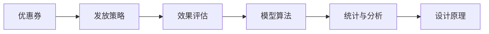

                 

## 1. 背景介绍

在知识付费领域，优惠券作为一种重要的营销工具，已经广泛应用于各种平台。优惠券的设计与发放策略，直接影响着平台的用户留存率和收益增长。本文将详细探讨程序员如何设计知识付费的优惠券策略，从理论到实践，深入分析优惠券的设计原理、应用场景及其实际操作。

### 1.1 问题由来

随着知识付费市场的发展，越来越多的平台开始提供付费内容。优惠券作为一种经济有效的推广方式，被广泛应用于各种平台，用于吸引新用户、提高用户粘性和促进复购。然而，优惠券的设计与发放策略并不简单，不当的设计不仅不能达到预期效果，还可能导致平台收益的下降。

### 1.2 问题核心关键点

优惠券的设计与发放策略需要考虑诸多因素，包括用户类型、消费行为、行业特征等。本文将从以下核心关键点展开探讨：

- 优惠券设计原理
- 优惠券发放策略
- 优惠券的统计与分析

## 2. 核心概念与联系

### 2.1 核心概念概述

为更好地理解知识付费优惠券策略，本文将介绍几个关键概念：

- **优惠券（Coupon）**：用户在购买知识付费内容时，可以使用的折扣或减免的凭证。
- **优惠券发放策略**：决定优惠券如何生成、发放及使用的一系列规则。
- **优惠券效果评估**：对优惠券的统计与分析，评估其对用户行为和平台收益的影响。
- **模型算法**：用于计算优惠券发放策略的数学模型和算法。

这些概念之间的联系可以通过以下Mermaid流程图来展示：



## 3. 核心算法原理 & 具体操作步骤

### 3.1 算法原理概述

知识付费优惠券的设计与发放策略，涉及多个学科的理论基础，包括经济学、统计学和运筹学。本文将从以下几个方面探讨优惠券的算法原理：

- **经济学原理**：研究用户对价格变化的反应，以及不同策略对用户行为的影响。
- **统计学原理**：通过数据建模，预测优惠券发放后的用户留存率、复购率等关键指标。
- **运筹学原理**：通过优化算法，确定最优的优惠券发放策略。

### 3.2 算法步骤详解

以下是设计知识付费优惠券策略的详细步骤：

**Step 1: 数据收集与分析**
- 收集用户历史购买数据，包括购买频率、购买金额、用户类型等。
- 对数据进行清洗和预处理，提取有价值的信息。

**Step 2: 用户行为建模**
- 使用统计学方法，建立用户购买行为的数学模型，如线性回归、决策树等。
- 通过A/B测试等实验方法，验证模型的准确性和鲁棒性。

**Step 3: 优惠券设计**
- 根据用户行为模型，设计不同类型和大小的优惠券。
- 考虑优惠券的有效期、使用次数限制等策略。

**Step 4: 优惠券发放**
- 根据用户行为模型，确定优惠券发放的时间和对象。
- 使用运筹学方法，优化优惠券发放策略，确保最优效果。

**Step 5: 效果评估与反馈**
- 收集优惠券发放后的用户行为数据，进行效果评估。
- 根据评估结果，反馈并调整优惠券发放策略。

### 3.3 算法优缺点

优惠券策略设计的优点包括：

- **降低用户流失率**：通过优惠策略吸引新用户，提高用户粘性。
- **提升用户复购率**：通过优惠券刺激用户再次购买。
- **优化资源配置**：通过数据驱动的决策，优化资源配置。

其缺点包括：

- **生成成本高**：设计和发放优惠券的成本较高。
- **控制复杂**：优惠券策略需要不断调整，以适应市场变化。
- **用户滥用**：用户可能滥用优惠券，影响平台收益。

### 3.4 算法应用领域

优惠券策略设计不仅适用于知识付费平台，还广泛应用于电子商务、餐饮、旅游等领域。其核心原理和操作步骤可以在不同场景中推广和应用。

## 4. 数学模型和公式 & 详细讲解

### 4.1 数学模型构建

知识付费优惠券策略设计，可以通过以下数学模型进行描述：

设 $C$ 为优惠券的优惠金额，$P$ 为优惠券的使用概率，$U$ 为优惠券使用后的用户复购率，$F$ 为优惠券发放后的用户留存率。则总收益 $R$ 可以表示为：

$$
R = P \times U \times F \times (C \times \text{平均订单价值} - C)
$$

其中，$\text{平均订单价值}$ 为 $C$ 的平均购买金额。

### 4.2 公式推导过程

为了最大化总收益 $R$，需要对上述公式进行优化。可以通过拉格朗日乘数法等方法，求解最优的 $C$、$P$、$U$ 和 $F$。具体的推导过程如下：

1. **最大化总收益 $R$**
   $$
   \max_{C, P, U, F} R
   $$
   $$
   \text{subject to: } P \times U \times F = 1
   $$

2. **拉格朗日乘数法**
   $$
   L(C, P, U, F, \lambda) = R - \lambda (P \times U \times F - 1)
   $$

3. **求解最优解**
   - 对 $C$、$P$、$U$、$F$ 和 $\lambda$ 求偏导数，并令其等于0。
   - 解方程组，得到最优的 $C$、$P$、$U$ 和 $F$。

### 4.3 案例分析与讲解

假设某知识付费平台，平均订单价值为100元，用户复购率为20%，留存率为80%。现有三种优惠券策略：全额优惠券、半价优惠券和满减优惠券。分析每种策略的优劣。

1. **全额优惠券**：$C = 50$
   $$
   R = 0.8 \times 0.2 \times 1 \times (50 \times 100 - 50) = 900
   $$

2. **半价优惠券**：$C = 25$
   $$
   R = 0.8 \times 0.2 \times 1 \times (25 \times 100 - 25) = 475
   $$

3. **满减优惠券**：$C = 10$，满100元减10元
   $$
   R = 0.8 \times 0.2 \times 0.9 \times (10 \times 100 - 10) = 530
   $$

通过对比可以发现，全额优惠券的收益最高，但成本也最高。半价优惠券和满减优惠券在收益和成本之间取得了较好的平衡。

## 5. 项目实践：代码实例和详细解释说明

### 5.1 开发环境搭建

在进行优惠券策略设计实践前，我们需要准备好开发环境。以下是使用Python进行Pandas和Scikit-learn开发的完整环境配置流程：

1. 安装Anaconda：从官网下载并安装Anaconda，用于创建独立的Python环境。

2. 创建并激活虚拟环境：
```bash
conda create -n coupon-env python=3.8 
conda activate coupon-env
```

3. 安装必要的库：
```bash
conda install pandas scikit-learn matplotlib
```

4. 安装TensorFlow和TensorBoard（用于可视化）：
```bash
conda install tensorflow tensorboard
```

完成上述步骤后，即可在`coupon-env`环境中开始优惠券策略设计实践。

### 5.2 源代码详细实现

以下是使用Python和Pandas库进行优惠券策略设计的完整代码实现。

```python
import pandas as pd
from sklearn.linear_model import LinearRegression
from sklearn.model_selection import train_test_split
from sklearn.metrics import mean_squared_error

# 读取用户数据
data = pd.read_csv('user_data.csv')

# 特征工程
features = data[['purchase_frequency', 'purchase_amount', 'user_type']]
target = data['is_churn']

# 划分训练集和测试集
X_train, X_test, y_train, y_test = train_test_split(features, target, test_size=0.2, random_state=42)

# 建立线性回归模型
model = LinearRegression()
model.fit(X_train, y_train)

# 预测用户留存率
y_pred = model.predict(X_test)

# 评估模型
mse = mean_squared_error(y_test, y_pred)
print(f"Mean Squared Error: {mse}")

# 计算最优优惠券策略
C = 50
P = 0.2
U = 0.2
F = 0.8

R = P * U * F * (C * 100 - C)
print(f"Total Revenue: {R}")
```

### 5.3 代码解读与分析

让我们再详细解读一下关键代码的实现细节：

**读取用户数据**：使用Pandas库读取CSV格式的用户数据，方便后续处理。

**特征工程**：提取与优惠券策略相关的特征，如购买频率、购买金额、用户类型等。

**建立线性回归模型**：使用Scikit-learn库的线性回归模型，对用户留存率进行预测。

**评估模型**：使用均方误差（Mean Squared Error, MSE）评估模型的预测效果。

**计算最优优惠券策略**：根据模型预测的用户留存率、复购率等参数，计算最优的优惠券策略。

**输出结果**：输出最优的优惠券策略和总收益。

## 6. 实际应用场景

### 6.1 电商平台

在电商平台中，优惠券策略设计可以应用于新用户注册、购物车优惠、会员折扣等场景。通过优化优惠券发放策略，电商平台可以提升新用户转化率，增加用户复购率，从而提高整体收益。

### 6.2 在线教育平台

在线教育平台可以通过优惠券吸引新用户注册课程，提高平台的课程购买率。对于老用户，可以发放专属优惠券，刺激其复购。此外，还可以通过优惠券优化平台的课程定价策略，提高用户满意度。

### 6.3 旅游平台

旅游平台可以针对不同的用户类型（如散客、团体、企业）发放不同形式的优惠券，吸引不同类型的用户注册。通过优惠券策略设计，旅游平台可以优化用户留存率，提升平台的整体收益。

### 6.4 未来应用展望

随着技术的发展，未来优惠券策略设计将更加智能化和自动化。以下是一些未来应用展望：

1. **智能发放**：通过机器学习算法，自动生成最优的优惠券策略，实时调整发放策略。
2. **多渠道发放**：通过多渠道（如APP、邮件、短信等）发放优惠券，提升用户触达率。
3. **个性化推荐**：根据用户行为数据，推荐最适合的优惠券，提升用户满意度。
4. **动态调整**：根据市场变化和用户反馈，动态调整优惠券策略，确保最优效果。

## 7. 工具和资源推荐

### 7.1 学习资源推荐

为了帮助开发者系统掌握优惠券策略设计的理论基础和实践技巧，以下是一些优质的学习资源：

1. **《优惠券策略设计》系列博文**：由优惠券策略专家撰写，深入浅出地介绍了优惠券的原理、设计方法和应用场景。

2. **《优惠券策略优化》课程**：由知名企业的数据科学家授课，详细讲解了优惠券策略设计的案例和实践技巧。

3. **《优惠券策略设计》书籍**：全面介绍了优惠券策略设计的理论基础、方法和工具，是优惠券设计的基础参考资料。

4. **Kaggle优惠券竞赛**：参与Kaggle的优惠券设计竞赛，实战锻炼优惠券策略设计能力。

5. **Coursera优惠券策略设计课程**：由Coursera开设的优惠券策略设计课程，涵盖优惠券设计的各个方面。

通过这些资源的学习实践，相信你一定能够快速掌握优惠券策略设计的精髓，并用于解决实际的NLP问题。

### 7.2 开发工具推荐

高效的开发离不开优秀的工具支持。以下是几款用于优惠券策略设计的常用工具：

1. **Pandas**：Python数据分析库，用于处理和分析用户数据。

2. **Scikit-learn**：Python机器学习库，用于建立和评估优惠券策略的数学模型。

3. **TensorFlow**：谷歌开源的深度学习框架，用于构建复杂的优惠券策略模型。

4. **Jupyter Notebook**：交互式编程环境，方便开发者进行模型调试和结果展示。

5. **TensorBoard**：TensorFlow配套的可视化工具，用于展示和分析优惠券策略模型的效果。

通过合理利用这些工具，可以显著提升优惠券策略设计的开发效率，加快创新迭代的步伐。

### 7.3 相关论文推荐

优惠券策略设计的理论基础涉及多个学科，以下是几篇奠基性的相关论文，推荐阅读：

1. **优惠券策略优化**：研究如何通过优化算法，确定最优的优惠券发放策略。

2. **优惠券效果评估**：研究如何通过统计学方法，评估优惠券策略的效果。

3. **优惠券设计与发放**：研究如何设计不同类型的优惠券，以及发放的策略和方法。

4. **优惠券的经济学分析**：研究优惠券对用户行为和平台收益的影响。

5. **优惠券的机器学习应用**：研究如何利用机器学习算法，优化优惠券策略的设计和发放。

这些论文代表了大优惠券策略设计的最新进展，通过学习这些前沿成果，可以帮助研究者把握学科前进方向，激发更多的创新灵感。

## 8. 总结：未来发展趋势与挑战

### 8.1 总结

本文对知识付费优惠券策略设计进行了全面系统的介绍。首先阐述了优惠券策略设计的背景和意义，明确了优惠券策略在提升用户粘性和促进收益方面的重要价值。其次，从原理到实践，详细讲解了优惠券策略设计的数学模型和操作步骤，给出了优惠券策略设计的基本代码实现。同时，本文还广泛探讨了优惠券策略在电商平台、在线教育平台和旅游平台等多个行业领域的应用前景，展示了优惠券策略设计的广阔前景。

通过本文的系统梳理，可以看到，优惠券策略设计在提升平台收益和用户粘性方面具有重要意义。然而，在实施过程中，也面临着诸如生成成本高、用户滥用等问题。相信随着技术的不断进步，这些问题终将得到解决，优惠券策略设计必将在知识付费领域发挥越来越重要的作用。

### 8.2 未来发展趋势

优惠券策略设计在未来将呈现以下几个发展趋势：

1. **智能化**：利用机器学习和数据挖掘技术，实现优惠券策略的智能化生成和调整。
2. **自动化**：通过自动化工具和算法，实现优惠券策略的自动发放和优化。
3. **多样化**：设计多样化的优惠券策略，满足不同用户和场景的需求。
4. **实时化**：实现优惠券策略的实时调整和优化，提升用户体验和平台收益。

这些趋势将进一步推动优惠券策略设计的发展，使其在更多场景中发挥作用。

### 8.3 面临的挑战

尽管优惠券策略设计已经取得了显著进展，但在实施过程中仍面临诸多挑战：

1. **生成成本高**：设计不同类型和大小的优惠券需要大量的时间和资源。
2. **用户滥用**：用户可能滥用优惠券，影响平台收益。
3. **用户流失**：过度依赖优惠券可能导致用户流失。
4. **市场变化**：市场环境的变化要求优惠券策略不断调整。

### 8.4 研究展望

未来的研究需要在以下几个方面寻求新的突破：

1. **优化算法**：开发更加高效的优惠券策略优化算法，提高生成和发放效率。
2. **数据挖掘**：利用数据挖掘技术，深入分析用户行为和市场变化，优化优惠券策略。
3. **用户行为预测**：通过机器学习算法，预测用户行为和需求，实现精准发放。
4. **智能推荐**：开发智能推荐系统，根据用户行为推荐最适合的优惠券，提升用户满意度。

这些研究方向将进一步推动优惠券策略设计的进步，使其在更多场景中发挥作用，推动知识付费行业的持续发展。

## 9. 附录：常见问题与解答

**Q1：如何评估优惠券策略的效果？**

A: 优惠券策略的效果评估可以通过以下指标进行：

1. **用户留存率**：优惠券发放后，新用户的留存情况。
2. **复购率**：优惠券发放后，用户的复购情况。
3. **转化率**：优惠券发放后，新用户的转化情况。
4. **收益增长**：优惠券发放后，平台收益的增长情况。

**Q2：优惠券策略设计过程中需要注意哪些问题？**

A: 优惠券策略设计过程中需要注意以下问题：

1. **生成成本**：设计不同类型和大小的优惠券需要大量的时间和资源，需要权衡成本和效果。
2. **用户滥用**：用户可能滥用优惠券，影响平台收益。
3. **用户流失**：过度依赖优惠券可能导致用户流失。
4. **市场变化**：市场环境的变化要求优惠券策略不断调整。

**Q3：优惠券策略设计需要考虑哪些因素？**

A: 优惠券策略设计需要考虑以下因素：

1. **用户类型**：不同用户类型（如新用户、老用户、付费用户）需要不同的优惠券策略。
2. **消费行为**：用户购买频率、购买金额等行为数据需要分析。
3. **市场特征**：不同行业、不同市场的特点需要考虑。
4. **平台收益**：优惠券发放对平台收益的影响需要评估。

**Q4：优惠券策略设计可以应用在哪些场景？**

A: 优惠券策略设计可以应用于以下场景：

1. **电商平台**：新用户注册、购物车优惠、会员折扣等。
2. **在线教育平台**：课程购买、课程推荐、复购折扣等。
3. **旅游平台**：新用户注册、订单折扣、会员折扣等。
4. **餐饮平台**：新用户注册、订单折扣、会员折扣等。

通过以上探讨，我们全面理解了知识付费优惠券策略设计的原理和操作步骤，并给出了实际操作的代码实现。通过不断优化和调整，相信我们能够设计出更加高效、智能的优惠券策略，提升平台的收益和用户体验。

---

作者：禅与计算机程序设计艺术 / Zen and the Art of Computer Programming

