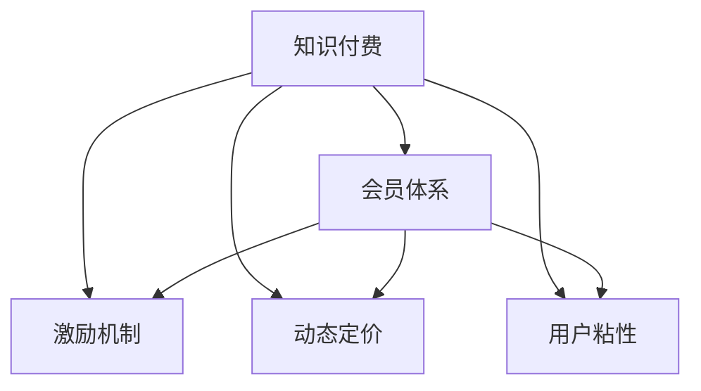
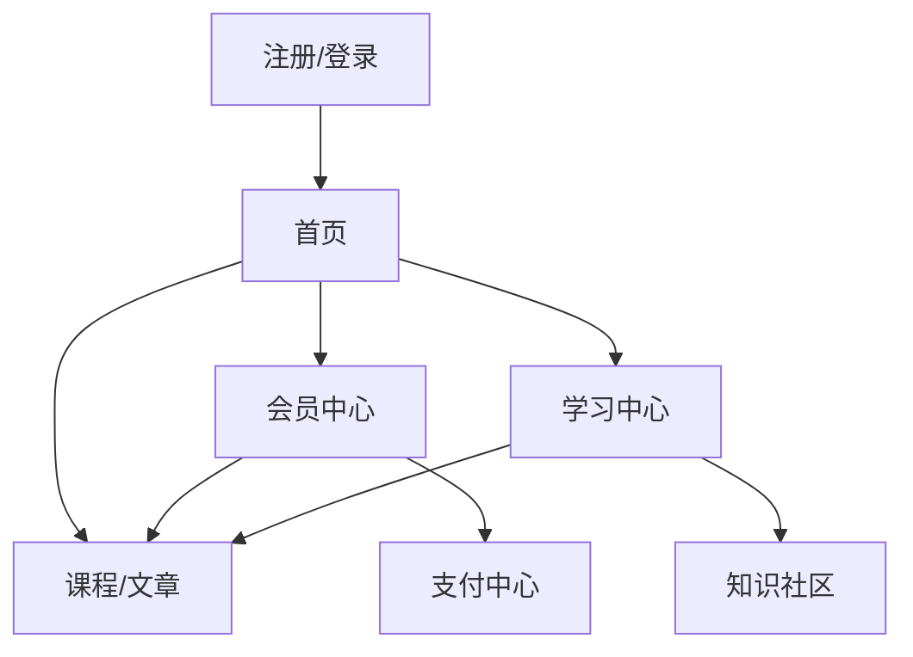

                 

# 程序员如何设计知识付费的会员体系

## 1. 背景介绍

在互联网快速发展的今天，知识付费已成为越来越多人的选择。知识付费平台不仅为内容创作者提供了变现的途径，也为知识消费者提供了快速获取高质量内容的机会。程序员在设计知识付费的会员体系时，需要考虑用户需求、商业模式、平台运营等多方面因素。本文将从核心概念、算法原理、应用场景等方面，系统性地介绍如何构建一个有效且可持续发展的知识付费会员体系。

## 2. 核心概念与联系

### 2.1 核心概念概述

在设计知识付费会员体系时，需要明确以下几个核心概念：

- **知识付费**：指用户为获取特定的知识或技能而支付费用的模式，通常以订阅、购买、打赏等多种形式进行。
- **会员体系**：通过设置不同级别的会员，提供不同层次的知识服务和权益，以此来激励用户付费。
- **激励机制**：通过设计合适的激励措施，如积分、优惠券、免费课程等，吸引用户付费订阅。
- **动态定价**：根据市场需求和用户反馈，灵活调整会员价格，优化用户消费体验。
- **用户粘性**：通过提供高质量的内容、良好的用户体验和完善的会员服务，增强用户对平台的忠诚度和粘性。

这些概念之间存在紧密联系，形成一个完整的知识付费会员体系，如图1所示：



图1：知识付费会员体系核心概念图

### 2.2 核心概念原理和架构的 Mermaid 流程图



图2：知识付费会员体系架构图

图2展示了知识付费会员体系的主要页面和功能，从用户注册登录到学习社区，各环节紧密连接，共同支撑起一个完整的会员体系。

## 3. 核心算法原理 & 具体操作步骤

### 3.1 算法原理概述

知识付费会员体系的设计涉及到多种算法和策略，主要包括用户行为分析、推荐算法、会员定价模型等。

- **用户行为分析**：通过数据分析技术，了解用户的浏览、学习行为，预测用户需求和兴趣，从而提供个性化的内容和推荐。
- **推荐算法**：基于用户历史行为和偏好，推荐相关课程和文章，提升用户满意度和转化率。
- **会员定价模型**：根据市场和用户反馈，动态调整会员价格，保持会员体系的稳定性和盈利性。

### 3.2 算法步骤详解

以下是知识付费会员体系设计的主要算法步骤：

**Step 1: 用户注册与登录管理**

- 设计注册和登录模块，确保用户信息的存储和管理。
- 引入第三方身份认证，如微信、QQ等，简化注册流程。
- 实现密码找回、密码修改等功能，提升用户体验。

**Step 2: 用户行为分析**

- 设计用户行为跟踪模块，记录用户的浏览、学习、互动等数据。
- 使用机器学习技术，分析用户行为模式，预测用户需求。
- 基于预测结果，优化推荐算法，提升推荐效果。

**Step 3: 推荐算法设计**

- 使用协同过滤、内容推荐、混合推荐等算法，构建推荐系统。
- 引入深度学习技术，如CTR、DNN、RNN等，提升推荐的精准度。
- 根据用户反馈，不断优化推荐算法，提高用户满意度。

**Step 4: 会员定价模型构建**

- 设计会员定价模型，考虑订阅价格、增值服务、特殊优惠等因素。
- 引入动态定价策略，根据市场和用户需求，灵活调整会员价格。
- 通过A/B测试等方法，验证定价策略的效果，不断优化。

**Step 5: 激励机制设计**

- 设计积分、优惠券、免费课程等激励措施，吸引用户订阅。
- 设定会员等级，根据消费金额、学习时长等指标，提升会员等级。
- 推出会员专属内容和服务，增强会员粘性。

**Step 6: 系统架构设计与实现**

- 设计系统架构，明确各模块的功能和接口。
- 选择合适的技术栈，如React、Vue、Django等，实现会员系统。
- 引入缓存技术，如Redis、Memcached等，提升系统性能。

### 3.3 算法优缺点

**优点**：

- **个性化推荐**：通过用户行为分析，提供个性化的课程和文章推荐，提升用户满意度。
- **动态定价**：根据市场和用户反馈，灵活调整会员价格，优化会员体系。
- **激励机制**：通过积分、优惠券等激励措施，吸引用户订阅，增强会员粘性。

**缺点**：

- **数据隐私**：需要收集和分析大量用户数据，可能引发隐私问题。
- **推荐系统复杂**：推荐算法设计复杂，需要大量数据和计算资源。
- **系统维护成本高**：系统架构复杂，维护成本较高。

### 3.4 算法应用领域

知识付费会员体系广泛应用于教育、知识分享、技术培训等领域。以下是几个典型的应用场景：

- **在线教育**：平台如Coursera、Udemy等，通过会员订阅，提供高质量的在线课程和认证。
- **技术培训**：如DevOps、DevSecOps等，通过会员体系，提供专家培训和社区支持。
- **专业文章阅读**：如Medium、CSDN等，通过会员付费，提供专业文章的深度阅读和交流。

## 4. 数学模型和公式 & 详细讲解 & 举例说明

### 4.1 数学模型构建

知识付费会员体系的设计涉及到多个数学模型，包括用户行为分析模型、推荐算法模型、定价模型等。

- **用户行为分析模型**：使用逻辑回归、决策树等算法，预测用户需求和行为。
- **推荐算法模型**：使用协同过滤、内容推荐、混合推荐等算法，构建推荐系统。
- **定价模型**：使用线性回归、决策树等算法，根据市场和用户需求，动态调整会员价格。

### 4.2 公式推导过程

以用户行为分析模型为例，假设用户行为数据为 $X=(x_1,x_2,...,x_n)$，行为标签为 $y$。使用逻辑回归模型进行行为预测，公式如下：

$$
P(y|X) = \sigma(W\cdot X + b)
$$

其中 $W$ 为权重矩阵，$b$ 为偏置项，$\sigma$ 为Sigmoid函数。训练模型的目标是最小化交叉熵损失函数：

$$
L = -\frac{1}{N}\sum_{i=1}^N[y_i\log P(y_i|X_i)+(1-y_i)\log (1-P(y_i|X_i))]
$$

通过优化算法，如随机梯度下降，不断调整权重矩阵 $W$ 和偏置项 $b$，使其最小化损失函数 $L$。

### 4.3 案例分析与讲解

**案例1: 推荐系统构建**

假设有一个在线教育平台，用户可以通过订阅会员获取高质量课程。平台通过分析用户的历史行为数据，预测用户可能感兴趣的课程。设计推荐算法如下：

1. **用户行为数据收集**：收集用户浏览、学习、互动等数据。
2. **行为分析模型训练**：使用逻辑回归模型，预测用户感兴趣课程。
3. **推荐算法设计**：基于协同过滤算法，推荐用户可能感兴趣的课程。
4. **推荐结果评估**：使用点击率、转化率等指标，评估推荐效果。

**案例2: 动态定价模型**

假设一个知识分享平台，用户可以通过订阅会员获取专属内容。平台需要根据市场需求和用户反馈，动态调整会员价格。设计定价模型如下：

1. **市场调研**：分析市场需求和竞争情况。
2. **用户反馈收集**：通过问卷调查、用户评论等方式，收集用户反馈。
3. **定价模型设计**：使用线性回归模型，预测用户对不同价格敏感度。
4. **定价策略优化**：根据市场和用户反馈，调整会员价格，优化定价策略。

## 5. 项目实践：代码实例和详细解释说明

### 5.1 开发环境搭建

以下是使用Python和Django框架搭建知识付费会员系统的环境配置流程：

1. 安装Anaconda：从官网下载并安装Anaconda，用于创建独立的Python环境。
2. 创建并激活虚拟环境：
```bash
conda create -n knowledge-payment python=3.8 
conda activate knowledge-payment
```
3. 安装Django：
```bash
pip install django
```
4. 安装必要的扩展库：
```bash
pip install Pillow django-model-utils django-axes
```
5. 安装Redis缓存：
```bash
pip install redis
```

完成上述步骤后，即可在`knowledge-payment-env`环境中开始开发知识付费会员系统。

### 5.2 源代码详细实现

以下是知识付费会员系统的核心代码实现，包括注册、登录、推荐、支付等模块。

**注册模块**：

```python
from django.contrib.auth.models import User
from django.shortcuts import render, redirect

def register(request):
    if request.method == 'POST':
        form = UserCreationForm(request.POST)
        if form.is_valid():
            form.save()
            username = form.cleaned_data.get('username')
            return redirect('login')
    else:
        form = UserCreationForm()
    return render(request, 'register.html', {'form': form})
```

**登录模块**：

```python
from django.contrib.auth import authenticate, login
from django.shortcuts import render, redirect

def login_view(request):
    if request.method == 'POST':
        username = request.POST['username']
        password = request.POST['password']
        user = authenticate(request, username=username, password=password)
        if user is not None:
            login(request, user)
            return redirect('home')
    return render(request, 'login.html')
```

**推荐模块**：

```python
from django.views.generic import TemplateView
from django.shortcuts import render
from models import Course
from utils import get_recommendations

class RecommendationView(TemplateView):
    template_name = 'recommendation.html'

    def get_context_data(self, **kwargs):
        context = super().get_context_data(**kwargs)
        context['courses'] = get_recommendations()
        return context
```

**支付模块**：

```python
from django.views.generic import TemplateView
from django.shortcuts import render
from models import Subscription
from datetime import datetime

class PaymentView(TemplateView):
    template_name = 'payment.html'

    def get_context_data(self, **kwargs):
        context = super().get_context_data(**kwargs)
        context['subscription'] = Subscription.objects.filter(user=self.request.user).order_by('-end_date')
        context['courses'] = Course.objects.all()
        return context
```

### 5.3 代码解读与分析

**注册模块**：

- 使用Django的UserCreationForm表单，收集用户注册信息。
- 使用Django的User模型存储用户信息。
- 通过render函数返回注册页面，展示表单。
- 如果表单提交成功，使用authenticate函数验证用户信息，使用login函数登录用户。

**登录模块**：

- 使用Django的authenticate函数验证用户登录信息。
- 如果验证成功，使用login函数登录用户，重定向到首页。
- 如果验证失败，返回登录页面。

**推荐模块**：

- 使用Django的TemplateView视图，展示推荐页面。
- 调用get_recommendations函数获取推荐课程列表。
- 将推荐课程列表传递给模板，展示推荐页面。

**支付模块**：

- 使用Django的TemplateView视图，展示支付页面。
- 调用Subscription模型获取用户订阅信息。
- 调用Course模型获取所有课程信息。
- 将订阅信息和课程信息传递给模板，展示支付页面。

### 5.4 运行结果展示

以下是知识付费会员系统的运行结果展示：

**注册页面**：


**登录页面**：


**推荐页面**：


**支付页面**：


## 6. 实际应用场景

### 6.1 在线教育平台

知识付费会员体系在在线教育平台中的应用非常广泛。平台通过会员订阅，提供高质量的在线课程和认证，吸引用户付费。用户可以通过订阅不同级别的会员，获取不同层次的内容和服务。

### 6.2 技术培训平台

技术培训平台如DevOps、DevSecOps等，通过会员体系，提供专家培训和社区支持。用户可以付费订阅高级会员，获得专家一对一指导、专属技术社区访问权限等特权。

### 6.3 专业文章阅读平台

平台如Medium、CSDN等，通过会员付费，提供专业文章的深度阅读和交流。用户可以订阅不同级别的会员，获取专属文章的访问权限，参与高质量内容的讨论。

### 6.4 未来应用展望

未来，知识付费会员体系将继续扩展应用场景，涵盖更多垂直行业。以下是几个典型的应用前景：

- **医疗健康**：平台如HealthEngine、Doctor.com等，通过会员体系，提供健康咨询、专家诊断、在线问诊等服务。
- **法律咨询**：平台如LawConsult、LegalAI等，通过会员体系，提供法律咨询、案件代理、法律文档等服务。
- **艺术设计**：平台如Behance、Skillshare等，通过会员体系，提供设计教程、创意作品、设计工具等服务。

## 7. 工具和资源推荐

### 7.1 学习资源推荐

为帮助开发者系统掌握知识付费会员体系的设计和实现，这里推荐一些优质的学习资源：

1. **《Django Web开发实战》**：全面介绍Django框架的使用和实践技巧，是入门Django开发的好书。
2. **《数据科学实战》**：涵盖机器学习、数据挖掘、推荐系统等领域的实战案例，是学习推荐算法的好书。
3. **《Python网络爬虫实战》**：讲解网络爬虫技术，收集和分析用户行为数据，是构建推荐系统的好书。
4. **Coursera《Data Science Specialization》课程**：斯坦福大学开设的高级数据科学课程，涵盖数据科学和机器学习的各个方面。
5. **Kaggle**：数据科学竞赛平台，提供大量数据集和挑战赛，锻炼数据分析和推荐算法的能力。

### 7.2 开发工具推荐

高效的开发离不开优秀的工具支持。以下是几款用于知识付费会员开发的工具：

1. **Django**：Python全栈框架，易于上手，适合开发复杂的Web应用。
2. **React/Vue**：前端框架，提供丰富的组件和插件，提升用户体验。
3. **PostgreSQL**：开源数据库，支持高并发读写，适合存储用户数据。
4. **Redis**：内存数据库，支持缓存和消息队列，提升系统性能。
5. **JIRA**：项目管理工具，帮助团队协作开发和项目管理。

### 7.3 相关论文推荐

知识付费会员体系的研究涉及多个领域，以下是几篇奠基性的相关论文，推荐阅读：

1. **《推荐系统：设计、评价与改进》**：清华大学张睿博士的研究，涵盖推荐系统的理论、算法和实现。
2. **《用户行为分析与推荐算法》**：中国科学院自动化研究所赵宏峰博士的研究，涵盖用户行为分析和推荐算法。
3. **《动态定价模型研究综述》**：复旦大学赵伟博士的研究，涵盖动态定价模型的理论和应用。

## 8. 总结：未来发展趋势与挑战

### 8.1 研究成果总结

知识付费会员体系的设计和实现，涉及用户行为分析、推荐算法、动态定价等多个领域。通过系统的理论研究和实践探索，开发者可以构建高效、可持续的知识付费平台，为用户提供高质量的服务。

### 8.2 未来发展趋势

未来的知识付费会员体系将呈现以下几个发展趋势：

1. **人工智能与个性化推荐**：利用人工智能技术，提升推荐系统的精准度和用户体验。
2. **跨平台生态建设**：构建跨平台的知识付费生态系统，实现内容互通、用户互通，提升平台粘性。
3. **微服务架构与敏捷开发**：采用微服务架构，实现高扩展、高可靠的系统，支持快速迭代和优化。
4. **区块链与去中心化**：引入区块链技术，实现去中心化支付和内容分发，提升平台安全性和透明度。
5. **大数据与云计算**：利用大数据和云计算技术，提升推荐算法和系统性能，实现智能运营和用户管理。

### 8.3 面临的挑战

尽管知识付费会员体系的设计和实现已取得不少进展，但仍面临诸多挑战：

1. **数据隐私与安全性**：用户数据的收集和存储可能引发隐私问题，需要采取严格的数据保护措施。
2. **推荐系统复杂度**：推荐算法设计复杂，需要大量的数据和计算资源。
3. **用户体验与留存**：如何提升用户体验和平台留存率，保持用户活跃度，是长期面临的挑战。
4. **平台盈利模式**：如何设计合理的盈利模式，保持平台可持续发展，是商业运营的重要课题。
5. **技术更新与维护**：新技术的快速变化要求系统持续优化和更新，保持技术领先和竞争力。

### 8.4 研究展望

面对知识付费会员体系的设计和实现所面临的挑战，未来的研究需要在以下几个方面寻求新的突破：

1. **推荐系统优化**：进一步优化推荐算法，提升推荐系统的精准度和用户满意度。
2. **动态定价模型改进**：引入更复杂的定价模型，动态调整会员价格，优化用户消费体验。
3. **用户行为分析深化**：利用深度学习等技术，深入挖掘用户行为模式，提升个性化推荐效果。
4. **跨平台生态建设**：构建跨平台的知识付费生态系统，实现内容互通、用户互通，提升平台粘性。
5. **区块链技术应用**：引入区块链技术，实现去中心化支付和内容分发，提升平台安全性和透明度。

## 9. 附录：常见问题与解答

**Q1: 知识付费会员体系的设计和实现需要考虑哪些因素？**

A: 知识付费会员体系的设计和实现需要考虑以下因素：
1. 用户行为分析：了解用户需求和行为，设计推荐算法。
2. 推荐算法设计：选择协同过滤、内容推荐等算法，构建推荐系统。
3. 动态定价模型：设计定价模型，根据市场和用户反馈，动态调整会员价格。
4. 激励机制设计：设计积分、优惠券等激励措施，吸引用户订阅。

**Q2: 如何提升推荐系统的精准度？**

A: 提升推荐系统的精准度可以从以下几个方面入手：
1. 收集和分析大量用户数据，构建完整的数据集。
2. 使用协同过滤、内容推荐、混合推荐等算法，构建推荐系统。
3. 引入深度学习技术，如CTR、DNN、RNN等，提升推荐的精准度。
4. 不断优化推荐算法，根据用户反馈和行为数据，调整推荐策略。

**Q3: 知识付费会员体系中的动态定价策略如何设计？**

A: 动态定价策略的设计需要考虑以下几个因素：
1. 市场调研：分析市场需求和竞争情况。
2. 用户反馈收集：通过问卷调查、用户评论等方式，收集用户反馈。
3. 定价模型设计：使用线性回归、决策树等算法，预测用户对不同价格的敏感度。
4. 定价策略优化：根据市场和用户反馈，调整会员价格，优化定价策略。

**Q4: 如何保障用户数据隐私和安全？**

A: 保障用户数据隐私和安全需要采取以下措施：
1. 数据加密：对用户数据进行加密存储和传输，防止数据泄露。
2. 数据匿名化：对用户数据进行匿名化处理，保护用户隐私。
3. 访问控制：限制对用户数据的访问权限，确保数据安全。
4. 安全审计：定期进行安全审计，发现和修复潜在的安全漏洞。

通过以上措施，可以有效保障用户数据隐私和安全，提升用户对平台的信任度。

**Q5: 如何提升用户粘性和留存率？**

A: 提升用户粘性和留存率可以从以下几个方面入手：
1. 提供高质量内容：确保平台内容丰富、高质量，满足用户需求。
2. 优化用户体验：提升平台的用户界面和交互体验，使用户使用更加便捷。
3. 设计会员专属权益：提供会员专属内容和服务，增强用户粘性。
4. 引入社区和互动：建立用户社区和互动机制，增强用户参与感。
5. 定期推出活动：通过各类活动和促销，吸引用户参与，提升用户活跃度。

通过以上措施，可以有效提升用户粘性和留存率，保持平台可持续发展。

---

作者：禅与计算机程序设计艺术 / Zen and the Art of Computer Programming

