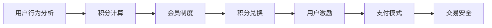

                 

# 程序员如何设计知识付费的积分体系

> 关键词：知识付费, 积分体系, 会员制度, 用户激励, 支付模式, 交易安全

## 1. 背景介绍

随着互联网的普及和信息爆炸，知识付费平台逐渐成为知识获取的重要渠道。用户不再满足于免费的互联网内容，愿意付费获取深度和定制化的知识。针对这一趋势，各大知识付费平台纷纷推出积分体系，旨在通过积分激励和会员机制，增加用户粘性，提升平台的用户价值和商业化收入。但积分体系的设计涉及众多复杂因素，如用户行为分析、积分计算逻辑、支付模式、会员特权等，需要综合多学科知识进行系统设计。

本文将从技术、业务和产品三个维度，深入探讨知识付费积分体系的设计思路和实现方法，提供全面、详细的指导方案。期望能够帮助广大程序员和产品开发者，深入理解知识付费积分体系的核心原理，掌握关键技术和业务流程，设计出既科学又实用的积分体系，从而为用户、平台和自身带来长远的价值。

## 2. 核心概念与联系

### 2.1 核心概念概述

- **知识付费**：用户为获取特定知识、技能、信息等支付费用的行为。平台通过销售课程、文章、问答等形式提供知识内容。
- **积分体系**：基于用户在平台上的行为（如浏览、购买、分享等），给予积分奖励，积分可以用于兑换奖品、特权等。
- **会员制度**：设定不同会员等级，不同等级会员享受不同的特权和优惠。
- **用户激励**：通过积分、特权等手段，激励用户增加在平台上的活跃度和消费频率。
- **支付模式**：用户购买知识付费产品的方式，包括预付费、后付费、订阅制等。
- **交易安全**：保障知识付费交易过程中用户的账户安全、支付安全等。

这些概念共同构成知识付费积分体系的核心框架，设计过程中需要充分考虑各概念间的联系和互动，才能构建出既科学又实用的积分体系。

### 2.2 核心概念原理和架构的 Mermaid 流程图



以上 Mermaid 图展示了知识付费积分体系的主要流程：用户行为分析（A）是积分计算（B）的基础，会员制度（C）为积分兑换（D）提供层次，用户激励（E）作用于用户行为分析（A）和积分兑换（D），支付模式（F）保障交易安全（G）。这些环节环环相扣，共同支撑着积分体系的整体运作。

## 3. 核心算法原理 & 具体操作步骤

### 3.1 算法原理概述

知识付费积分体系的设计主要围绕以下几个算法原理展开：

- **行为积分计算**：根据用户在平台上的行为（如浏览时长、购买次数、分享文章等），计算积分数量。行为积分的计算需要考虑用户行为的价值和频率，设定合理的积分权重。
- **会员等级晋升**：设定多个会员等级，根据用户积分达到一定的累积值时，晋升至更高等级，享受更多特权。会员等级的晋升需要考虑积分的累积和消耗，以及平台的激励策略。
- **积分兑换特权**：设定可兑换的积分特权，如课程打折、免费体验、专属咨询等。积分兑换需要考虑特权的实际价值和市场接受度。
- **积分有效期**：设定积分的有效期限，避免长时间不使用的积分失去价值，同时激励用户活跃使用。
- **支付安全保障**：设计安全的支付流程，保护用户和平台的资金安全。

这些算法原理共同构成了积分体系的技术核心，设计过程中需要根据平台特性和用户需求进行适配。

### 3.2 算法步骤详解

以下是知识付费积分体系设计的详细步骤：

**Step 1: 需求分析**

1. **平台定位与用户画像**：明确平台的定位和目标用户群体，分析用户行为特征和需求。
2. **积分设计目标**：确定积分体系的设计目标，如用户留存、活跃度提升、消费转化率等。
3. **积分类型和价值**：设定不同类型的积分，如行为积分、购买积分、分享积分等，并明确每种积分的计算逻辑和价值。

**Step 2: 积分规则制定**

1. **积分计算公式**：根据用户行为设定积分计算公式，如浏览时长积分、购买课程积分、分享文章积分等。
2. **积分权重设置**：根据行为的价值和频率，设定积分的权重，如每分钟浏览积分、每次购买积分、每次分享积分等。
3. **积分上限与有效期**：设定积分的上限和有效期，避免积分无限累积，激励用户及时使用。

**Step 3: 会员等级设计**

1. **会员等级划分**：根据积分累积值划分会员等级，如普通会员、高级会员、VIP会员等。
2. **会员特权设计**：为每个会员等级设定特权，如免费课程、专属咨询、专属课程折扣等。
3. **会员等级晋升规则**：设定会员等级晋升的条件和规则，如积分达到一定值、累计消费一定金额等。

**Step 4: 积分兑换机制**

1. **可兑换特权清单**：设定可兑换的特权，如课程折扣、免费体验、专属咨询等。
2. **兑换流程设计**：设计积分兑换的流程，包括兑换路径、支付流程、订单生成等。
3. **积分兑换限制**：设定积分兑换的限制条件，如单次兑换上限、每月兑换次数等。

**Step 5: 交易安全保障**

1. **支付流程设计**：设计安全的支付流程，确保用户和平台资金安全。
2. **支付安全保障**：引入第三方支付平台、加密技术等手段，保障交易安全。
3. **交易纠纷处理**：设计交易纠纷的解决机制，如退款、投诉处理等。

通过以上步骤，可以构建出一个科学、合理、易于使用的知识付费积分体系。

### 3.3 算法优缺点

知识付费积分体系的设计有以下优点：

1. **增加用户粘性**：通过积分和会员特权，激励用户增加在平台上的活跃度和消费频率。
2. **提升平台收入**：积分兑换和会员特权等可以带来二次消费和额外收入。
3. **优化用户体验**：积分和会员机制可以增加用户的满足感和忠诚度，提升平台的用户体验。

但同时，该体系也存在一些缺点：

1. **积分计算复杂**：积分的计算逻辑较为复杂，需要考虑多种因素，且可能需要定期更新。
2. **会员等级设计困难**：会员等级的设计需要平衡积分累积和会员特权的价值，难度较大。
3. **交易安全风险**：支付安全是积分体系的重要组成部分，需要设计严密的安全机制。
4. **激励效果有限**：积分体系需要设计合理的激励机制，否则可能会产生激励不足的问题。

### 3.4 算法应用领域

知识付费积分体系在教育、培训、科技、文艺等多个领域都有广泛的应用。以下是一些具体的应用场景：

- **在线教育平台**：通过积分和会员机制，激励学生完成课程、参与讨论，提升学习效果。
- **编程培训平台**：设定行为积分、项目完成积分等，激励开发者完成更多项目，提升编程水平。
- **科技资讯平台**：通过积分和会员特权，激励用户订阅专栏、参与技术交流，增加平台的用户粘性。
- **文艺创作平台**：设定行为积分、作品评价积分等，激励创作者发布更多优质内容，提升平台内容质量。

以上应用场景展示了积分体系在不同领域的广泛适用性，设计过程中需要根据具体平台特性进行适配。

## 4. 数学模型和公式 & 详细讲解 & 举例说明

### 4.1 数学模型构建

知识付费积分体系的设计需要构建多个数学模型，以下是其中几个关键模型：

- **行为积分计算模型**：用于计算用户在不同行为下的积分数量，公式为：
  $$
  积分 = 行为值 \times 权重 + 固定积分
  $$
  其中行为值表示用户在该行为上的得分，权重表示该行为对积分的贡献，固定积分表示基础积分。

- **会员等级晋升模型**：用于判断用户积分是否达到某个等级，公式为：
  $$
  等级 = \lceil \frac{积分}{阈值} \rceil
  $$
  其中阈值表示每个等级的积分累积值，$\lceil x \rceil$表示向上取整。

- **积分兑换模型**：用于计算用户积分兑换某特权所需的积分数量，公式为：
  $$
  兑换积分 = 特权价值 \times 兑换比例
  $$
  其中特权价值表示该特权的价值，兑换比例表示每次兑换所需积分的比例。

### 4.2 公式推导过程

**行为积分计算模型推导**：

积分计算公式的基本思想是根据用户行为的价值和频率，设定积分的计算方式。用户在不同行为上的得分（行为值）需要根据具体平台和用户画像进行设定。例如，每分钟浏览文章的积分值为1，每次购买课程的积分值为10，每次分享文章的积分值为5等。积分权重根据行为的价值和频率进行设定，如每分钟浏览的积分权重为0.01，每次购买的积分权重为1，每次分享的积分权重为0.5等。积分计算公式可以表示为：

$$
积分 = 行为值 \times 权重 + 固定积分
$$

其中，行为值表示用户在该行为上的得分，权重表示该行为对积分的贡献，固定积分表示用户在不同行为下获取的初始积分。

**会员等级晋升模型推导**：

会员等级的设计需要设定每个等级的积分累积值和晋升规则。例如，用户每次完成某个行为都会获得积分，当积分累积达到某个阈值时，用户会晋升到下一个会员等级。设用户当前积分为$C$，每个等级的积分累积值为$T_1, T_2, T_3, \dots$，会员等级为$L_1, L_2, L_3, \dots$，则用户晋升的公式可以表示为：

$$
等级 = \lceil \frac{C}{T_i} \rceil
$$

其中$\lceil x \rceil$表示向上取整，$T_i$表示用户达到第$i$个等级的积分累积值，$L_i$表示第$i$个会员等级。

**积分兑换模型推导**：

积分兑换需要设定特权的价值和兑换比例。设用户需要兑换的特权价值为$V$，每次兑换所需的积分数量为$R$，则用户兑换所需的积分数量为：

$$
兑换积分 = V \times R
$$

其中$V$表示用户需要兑换的特权价值，$R$表示每次兑换所需积分的比例。

### 4.3 案例分析与讲解

**案例1：在线教育平台的积分体系**

某在线教育平台设计了积分体系，用于激励学生完成课程学习、参与讨论等。学生每次完成课程学习获得10积分，每次参与讨论获得5积分，每次分享课程获得2积分。积分每60天失效。

设学生完成某课程所需学习时长为$L$（分钟），参与讨论次数为$D$，分享次数为$S$，则学生当前积分为：

$$
积分 = 10L \times 0.01 + 5D \times 0.1 + 2S \times 0.05
$$

当学生积分累积达到500分时，可以晋升为高级会员，享受免费课程、专属咨询等特权。设会员等级1的积分累积阈值为100分，会员等级2的积分累积阈值为300分，则学生当前的会员等级为：

$$
等级 = \lceil \frac{积分}{100} \rceil
$$

当学生积分累积达到500分时，可以晋升为高级会员，享受免费课程、专属咨询等特权。

**案例2：编程培训平台的积分体系**

某编程培训平台设计了积分体系，用于激励开发者完成项目、参与社区讨论等。开发者每完成一个项目获得50积分，每参与一次社区讨论获得10积分，每次分享代码获得5积分。积分每90天失效。

设开发者完成某项目所需时长为$T$（小时），参与社区讨论次数为$C$，分享代码次数为$S$，则开发者当前积分为：

$$
积分 = 50T \times 0.05 + 10C \times 0.2 + 5S \times 0.1
$$

当开发者积分累积达到200分时，可以晋升为中级会员，享受课程折扣、免费资源等特权。设会员等级1的积分累积阈值为100分，会员等级2的积分累积阈值为300分，则开发者当前的会员等级为：

$$
等级 = \lceil \frac{积分}{100} \rceil
$$

当开发者积分累积达到200分时，可以晋升为中级会员，享受课程折扣、免费资源等特权。

## 5. 项目实践：代码实例和详细解释说明

### 5.1 开发环境搭建

在进行积分体系开发前，我们需要准备好开发环境。以下是使用Python进行Flask框架开发的环境配置流程：

1. 安装Anaconda：从官网下载并安装Anaconda，用于创建独立的Python环境。

2. 创建并激活虚拟环境：
```bash
conda create -n pyproject python=3.8 
conda activate pyproject
```

3. 安装Flask：
```bash
pip install flask
```

4. 安装相关依赖：
```bash
pip install flask-migrate Flask-SQLAlchemy
```

5. 安装SQLite数据库：
```bash
pip install pysqlite3
```

完成上述步骤后，即可在`pyproject`环境中开始开发。

### 5.2 源代码详细实现

这里我们以一个简单的积分系统为例，给出使用Flask框架实现积分计算和会员等级管理的代码实现。

首先，定义积分模型和用户模型：

```python
from flask_sqlalchemy import SQLAlchemy
from flask_login import UserMixin, login_user

db = SQLAlchemy()

class User(UserMixin, db.Model):
    id = db.Column(db.Integer, primary_key=True)
    username = db.Column(db.String(50), unique=True, nullable=False)
    password_hash = db.Column(db.String(60), nullable=False)

class Integral(db.Model):
    id = db.Column(db.Integer, primary_key=True)
    user_id = db.Column(db.Integer, db.ForeignKey('user.id', ondelete='CASCADE'), nullable=False)
    integral = db.Column(db.Integer, nullable=False)
    created_at = db.Column(db.DateTime, nullable=False, default=db.func.current_timestamp())
    updated_at = db.Column(db.DateTime, nullable=False, default=db.func.current_timestamp(), onupdate=db.func.current_timestamp())
```

然后，定义积分计算和会员等级管理的路由：

```python
from flask import Flask, render_template, request

app = Flask(__name__)
app.config['SQLALCHEMY_DATABASE_URI'] = 'sqlite:////tmp/test.db'
db.init_app(app)

@app.route('/')
def index():
    return render_template('index.html')

@app.route('/integral', methods=['POST'])
def integral():
    username = request.form.get('username')
    integral = calculate_integral(username)
    user = User.query.filter_by(username=username).first_or_404()
    integral_obj = Integral(user=user, integral=integral)
    db.session.add(integral_obj)
    db.session.commit()
    return render_template('integral.html', integral=integral)

@app.route('/rank')
def rank():
    users = User.query.all()
    integrals = []
    for user in users:
        integral = Integral.query.filter_by(user_id=user.id).first().integral if Integral.query.filter_by(user_id=user.id).first() else 0
        integrals.append((user.username, integral))
    sorted_integrals = sorted(integrals, key=lambda x: x[1], reverse=True)
    return render_template('rank.html', integrals=sorted_integrals)

if __name__ == '__main__':
    app.run(debug=True)
```

接着，定义积分计算和会员等级管理的辅助函数：

```python
def calculate_integral(username):
    # 计算积分逻辑
    # 这里可以根据具体业务逻辑进行实现，例如每次浏览、购买等行为都会增加积分
    # 最终返回计算出的积分
    return 100  # 返回固定的100积分作为示例

def rank_users():
    # 获取所有用户及其积分，按积分降序排序，返回排序后的用户列表
    users = User.query.all()
    integrals = []
    for user in users:
        integral = Integral.query.filter_by(user_id=user.id).first().integral if Integral.query.filter_by(user_id=user.id).first() else 0
        integrals.append((user.username, integral))
    sorted_integrals = sorted(integrals, key=lambda x: x[1], reverse=True)
    return sorted_integrals
```

最后，创建HTML模板，用于展示积分和排名：

```html
<!DOCTYPE html>
<html lang="en">
<head>
    <meta charset="UTF-8">
    <title>Integral System</title>
</head>
<body>
    <h1>Integral System</h1>
    <form method="POST">
        <label for="username">Username:</label>
        <input type="text" id="username" name="username">
        <input type="submit" value="Calculate Integral">
    </form>
    
        <p>{{ username }}: {{ integral }} Integral</p>
    
</body>
</html>
```

### 5.3 代码解读与分析

让我们再详细解读一下关键代码的实现细节：

**User和Integral模型**：
- `User`模型表示用户信息，包括用户名和密码等基本属性。
- `Integral`模型表示用户的积分信息，包括用户ID、积分数量、创建和更新时间等属性。

**路由定义**：
- `/`路由返回主页，展示积分计算表单。
- `/integral`路由计算用户积分，并将其保存到数据库中。
- `/rank`路由展示用户排名，按积分降序排序。

**积分计算和用户排名**：
- `calculate_integral`函数根据用户行为计算积分，这里给出一个简单的固定积分逻辑。
- `rank_users`函数获取所有用户及其积分，并按积分降序排序，返回排序后的用户列表。

通过以上代码实现，我们可以构建一个简单的积分体系。在实际开发中，需要根据具体业务需求进一步扩展和优化。

### 5.4 运行结果展示

在运行以上代码后，访问`http://localhost:5000/`页面，可以看到积分计算表单。输入用户名并提交，页面会展示该用户的积分数量。同时，`/rank`页面展示了所有用户的排名，按积分降序排序。

## 6. 实际应用场景

### 6.1 在线教育平台

在线教育平台可以通过积分和会员机制，激励学生完成课程学习、参与讨论等，提升学习效果。积分体系可以设计成以下几种方式：

- **课程完成积分**：学生每完成某门课程获得一定积分，鼓励学生多参与课程学习。
- **讨论参与积分**：学生每参与一次讨论获得一定积分，鼓励学生积极参与课程讨论。
- **分享文章积分**：学生每分享一篇课程文章获得一定积分，鼓励学生分享更多知识。

积分可以用于兑换课程折扣、专属咨询等特权，激励学生不断学习、提升自我。

### 6.2 编程培训平台

编程培训平台可以通过积分和会员机制，激励开发者完成项目、参与社区讨论等，提升编程水平。积分体系可以设计成以下几种方式：

- **项目完成积分**：开发者每完成一个项目获得一定积分，鼓励开发者多完成项目。
- **社区讨论积分**：开发者每参与一次社区讨论获得一定积分，鼓励开发者积极参与社区交流。
- **分享代码积分**：开发者每分享一次代码获得一定积分，鼓励开发者分享更多代码。

积分可以用于兑换课程折扣、免费资源等特权，激励开发者不断学习、提升技能。

### 6.3 科技资讯平台

科技资讯平台可以通过积分和会员机制，激励用户订阅专栏、参与技术交流等，提升平台用户粘性。积分体系可以设计成以下几种方式：

- **订阅专栏积分**：用户每订阅一个月专栏获得一定积分，鼓励用户长期订阅。
- **参与讨论积分**：用户每参与一次技术讨论获得一定积分，鼓励用户积极参与技术交流。
- **分享文章积分**：用户每分享一次技术文章获得一定积分，鼓励用户分享更多技术知识。

积分可以用于兑换免费专栏、专属咨询等特权，激励用户不断学习、提升技术水平。

### 6.4 未来应用展望

未来，随着技术的发展和应用的深入，知识付费积分体系也将不断进化，带来更多的应用场景和价值。

- **个性化推荐**：通过积分和会员机制，平台可以更好地了解用户兴趣和行为，提供更加个性化的知识推荐。
- **内容创作激励**：通过积分和会员特权，激励创作者发布更多优质内容，提升平台内容质量。
- **多平台整合**：将积分体系与社交平台、支付平台等整合，实现多平台数据互通和激励联动。
- **实时互动**：通过实时互动功能，如直播、讨论等，进一步提升用户粘性和平台活跃度。

总之，知识付费积分体系是一个动态、开放的体系，需要根据平台特性和用户需求不断优化和改进，才能充分发挥其价值。

## 7. 工具和资源推荐

### 7.1 学习资源推荐

为了帮助开发者系统掌握知识付费积分体系的设计思路和实现方法，这里推荐一些优质的学习资源：

1. **《软件架构设计与优化》系列博文**：涵盖系统设计、架构优化、业务建模等多个主题，适合程序员和架构师深入学习。
2. **《深度学习与NLP》课程**：北京大学计算机科学与技术系开设的深度学习与自然语言处理课程，全面介绍深度学习和NLP的基本概念和技术。
3. **《Flask Web开发实战》书籍**：详细介绍使用Flask框架进行Web开发的技术和实践，适合Flask框架入门和进阶。
4. **《用户行为分析与用户画像》书籍**：深入讲解用户行为分析和用户画像的技术和方法，适合产品经理和数据分析师学习。
5. **《知识付费平台设计与开发》项目**：开源的知识付费平台项目，涵盖知识付费平台的设计和开发技术，适合开发者参考和学习。

通过对这些资源的学习实践，相信你一定能够快速掌握知识付费积分体系的设计原理和实现方法，设计出既科学又实用的积分体系。

### 7.2 开发工具推荐

高效的开发离不开优秀的工具支持。以下是几款用于知识付费积分体系开发的常用工具：

1. **Flask框架**：轻量级Web框架，易于上手和扩展。
2. **SQLAlchemy**：Python ORM框架，方便进行数据库操作。
3. **Flask-Login**：Flask插件，提供用户认证和授权功能。
4. **SQLite数据库**：轻量级关系型数据库，适合小型应用和开发测试。
5. **Jinja2模板引擎**：Python模板引擎，方便生成HTML页面。

合理利用这些工具，可以显著提升知识付费积分体系开发的速度和质量。

### 7.3 相关论文推荐

知识付费积分体系的研究涉及多个学科，以下是几篇相关领域的经典论文，推荐阅读：

1. **《User Behavior Modeling and Prediction in Online Platforms》**：介绍用户行为建模和预测的方法和技术，适合产品经理和数据分析师阅读。
2. **《Designing Effective Integrity Systems for Online Platforms》**：探讨在线平台诚信系统的设计方法和实际案例，适合开发者和业务分析师阅读。
3. **《Personalized Recommendation Systems in Knowledge Payoff Platforms》**：介绍个性化推荐系统在知识付费平台中的应用，适合数据科学家和推荐系统工程师阅读。
4. **《Adaptive Behavior Modeling for Integrative Service Platforms》**：介绍适应性行为建模在服务平台中的应用，适合开发人员和架构师阅读。

这些论文代表了大数据和人工智能技术在知识付费平台上的应用前沿，阅读这些论文可以加深对知识付费积分体系的理解和应用。

## 8. 总结：未来发展趋势与挑战

### 8.1 总结

本文对知识付费积分体系的设计思路和实现方法进行了全面系统的介绍。首先明确了知识付费积分体系的设计目标和核心概念，通过数学模型和公式，详细讲解了积分计算、会员等级晋升、积分兑换等关键算法原理和具体操作步骤。通过项目实践，展示了积分体系在在线教育、编程培训、科技资讯等多个领域的实际应用，并推荐了相关学习资源和开发工具。

通过本文的系统梳理，可以看到，知识付费积分体系是一个复杂但极具价值的技术体系，设计过程中需要综合考虑用户行为、积分计算、会员特权等多个因素，才能构建出既科学又实用的积分体系。未来，伴随技术的不断发展，积分体系将迎来更多的应用场景和改进方向，为知识付费平台带来更大的商业价值和用户粘性。

### 8.2 未来发展趋势

未来，知识付费积分体系将呈现以下几个发展趋势：

1. **自动化积分计算**：随着机器学习和数据挖掘技术的进步，积分计算将更加自动化和智能化，减少人工干预。
2. **个性化推荐**：通过用户行为分析和积分数据，实现更加精准的个性化推荐，提升用户体验和平台价值。
3. **多平台整合**：将积分体系与社交平台、支付平台等整合，实现多平台数据互通和激励联动。
4. **实时互动**：通过实时互动功能，如直播、讨论等，进一步提升用户粘性和平台活跃度。
5. **数据驱动决策**：通过大数据分析和人工智能技术，优化积分计算和会员等级设计，提升积分体系的有效性和用户满意度。

这些趋势将推动知识付费积分体系向更加智能化、个性化和动态化的方向发展，为用户和平台带来更大的价值和体验提升。

### 8.3 面临的挑战

尽管知识付费积分体系在实际应用中已经取得了很多成功案例，但仍然面临一些挑战：

1. **数据隐私和安全**：积分体系涉及大量用户行为数据，需要确保数据安全和用户隐私。
2. **积分计算复杂**：积分计算逻辑复杂，需要定期更新和维护，增加开发和运维成本。
3. **会员等级设计困难**：会员等级设计需要平衡积分累积和会员特权的价值，难度较大。
4. **用户激励不足**：积分体系设计不合理，可能导致用户激励不足，影响用户粘性和平台活跃度。
5. **支付安全风险**：支付安全是积分体系的重要组成部分，需要设计严密的安全机制。

面对这些挑战，未来的研究需要在技术、业务和产品等多个方面进行深入探索，才能构建出更加科学、合理、安全、高效的知识付费积分体系。

### 8.4 研究展望

面对知识付费积分体系所面临的挑战，未来的研究需要在以下几个方面寻求新的突破：

1. **数据隐私保护**：引入数据加密、差分隐私等技术，保障用户数据的隐私和安全。
2. **积分计算自动化**：通过机器学习和数据挖掘技术，实现积分计算的自动化和智能化，减少人工干预。
3. **会员等级设计优化**：通过数据驱动的方法，优化会员等级设计，平衡积分累积和会员特权的价值。
4. **用户激励机制创新**：设计更加灵活和多样化的用户激励机制，提升用户粘性和平台活跃度。
5. **支付安全保障**：引入第三方支付平台、加密技术等手段，保障支付安全。

这些研究方向将推动知识付费积分体系向更加科学、合理、安全、高效的方向发展，为用户和平台带来更大的价值和体验提升。

## 9. 附录：常见问题与解答

**Q1：积分体系的设计需要考虑哪些因素？**

A: 积分体系的设计需要考虑以下因素：

1. **用户行为分析**：分析用户在平台上的行为，设定积分计算规则。
2. **积分计算公式**：设定积分计算公式，根据用户行为的价值和频率计算积分数量。
3. **会员等级设计**：设定会员等级，设定积分累积阈值和特权。
4. **积分有效期**：设定积分的有效期限，避免积分无限累积，激励用户及时使用。
5. **支付安全保障**：设计安全的支付流程，保护用户和平台资金安全。

这些因素需要根据具体平台和用户需求进行综合考虑，才能构建出既科学又实用的积分体系。

**Q2：积分计算的难点在哪里？**

A: 积分计算的难点在于：

1. **行为价值评估**：不同行为的价值不同，需要根据具体业务设定行为价值。
2. **积分权重设定**：行为价值的权重需要根据行为的频率和重要性进行设定。
3. **数据复杂性**：积分计算涉及大量用户行为数据，需要设计高效的算法进行计算。

这些问题需要综合考虑用户行为、业务场景和数据特性，才能设计出合理有效的积分计算逻辑。

**Q3：积分体系的激励效果如何保证？**

A: 积分体系的激励效果可以通过以下方式保证：

1. **积分兑换机制**：设定可兑换的特权，激励用户使用积分。
2. **会员特权设计**：设计不同会员等级的特权，激励用户达到更高等级。
3. **积分上限限制**：设定积分上限，避免积分无限累积，激励用户及时使用。

通过这些机制，可以确保积分体系具有足够的激励效果，提升用户粘性和平台活跃度。

**Q4：如何应对积分体系的挑战？**

A: 应对积分体系挑战的方法如下：

1. **数据隐私保护**：引入数据加密、差分隐私等技术，保障用户数据隐私和安全。
2. **积分计算自动化**：通过机器学习和数据挖掘技术，实现积分计算的自动化和智能化。
3. **会员等级设计优化**：通过数据驱动的方法，优化会员等级设计，平衡积分累积和会员特权的价值。
4. **用户激励机制创新**：设计更加灵活和多样化的用户激励机制，提升用户粘性和平台活跃度。
5. **支付安全保障**：引入第三方支付平台、加密技术等手段，保障支付安全。

通过这些方法，可以有效应对积分体系面临的挑战，构建出更加科学、合理、安全、高效的知识付费积分体系。

**Q5：积分体系的开发需要注意哪些问题？**

A: 积分体系的开发需要注意以下问题：

1. **系统架构设计**：设计合理的数据库和系统架构，确保系统的可扩展性和可维护性。
2. **积分计算性能**：优化积分计算逻辑，减少计算量和资源消耗。
3. **会员等级管理**：设计合理的会员等级管理机制，确保会员特权的公平性和激励效果。
4. **支付安全保障**：设计安全的支付流程，保障用户和平台资金安全。
5. **用户体验优化**：优化积分展示和会员特权展示，提升用户体验。

通过这些注意事项，可以构建出高质量的知识付费积分体系，为用户和平台带来更大的价值。

---

作者：禅与计算机程序设计艺术 / Zen and the Art of Computer Programming

