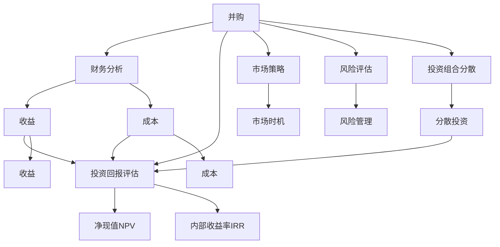

                 

# 程序员如何评估并购机会与公司出售时机

> 关键词：并购，公司出售，评估方法，财务分析，市场策略，投资回报

## 1. 背景介绍

### 1.1 问题由来
在当今商业环境下，企业并购和出售已成为企业成长和价值最大化的一种重要手段。通过并购，企业可以迅速扩大市场份额、获取关键技术或人才、提升市场竞争力。同时，面对业绩下滑、战略调整等风险时，出售公司也是一种常见的风险转移和资产保值的方式。然而，并购和出售的风险巨大，涉及财务、法律、技术、市场等多方面的复杂因素，需要缜密评估和策略规划。

### 1.2 问题核心关键点
本博文聚焦于如何从程序员的角度出发，评估并购机会和公司出售时机。对于程序员而言，理解和掌握基本的财务分析、市场策略和投资回报评估方法至关重要。以下核心关键点将贯穿全文：

- 财务分析：评估并购和出售的财务效益，识别成本和风险。
- 市场策略：识别并购和出售的市场时机，优化投资回报。
- 投资回报评估：通过财务模型计算并购和出售的净现值、内部收益率等指标，辅助决策。
- 风险评估：识别并购和出售过程中可能面临的各类风险，制定应对策略。

## 2. 核心概念与联系

### 2.1 核心概念概述

为更好地理解并购和出售的评估方法，本节将介绍几个密切相关的核心概念：

- 并购(Mergers and Acquisitions, M&A)：指一家公司通过支付现金、股票或两者结合的方式，获得另一家公司的全部或部分所有权。并购可以提升企业规模、市场竞争力和创新能力，但也伴随着财务风险、运营整合等挑战。

- 公司出售(Company Divestment)：指企业将其业务部门或子公司通过出售、分拆或上市等形式，将其部分或全部资产从母公司中剥离。公司出售可以优化企业结构、降低运营成本，但也可能导致市场份额下降、战略目标偏离。

- 投资回报率(ROI)：衡量并购或出售活动对企业价值的影响，公式为：投资回报率 = (收益 - 成本) / 成本。

- 财务杠杆(Financial Leverage)：通过债务融资等方式提高企业的财务杠杆，增加投资回报。但过高的财务杠杆可能导致债务风险增加、财务成本上升。

- 市场时机(Market Timing)：选择合适的时机进行并购或出售，最大化投资回报。市场时机受宏观经济环境、行业周期、公司战略等因素影响。

- 投资组合分散(Diversification)：通过分散投资降低并购或出售风险，优化企业资产结构。

这些核心概念之间的逻辑关系可以通过以下Mermaid流程图来展示：



这个流程图展示了并购和出售的关键环节及其相互联系：

1. 并购涉及财务分析、投资回报评估、市场策略、风险评估和投资组合分散。
2. 投资回报评估需要计算净现值和内部收益率等指标。
3. 市场策略关注选择合适的市场时机进行并购或出售。
4. 风险评估和风险管理是并购和出售过程中不可或缺的一环。

## 3. 核心算法原理 & 具体操作步骤
### 3.1 算法原理概述

并购和出售的评估主要依赖于财务分析和投资回报率计算。核心思想是：通过定量分析并购或出售的财务效益，结合市场策略，识别最佳投资时机，并在此基础上计算投资回报率，评估活动的经济价值。

具体来说，评估过程分为以下几步：

1. 财务分析：计算并购或出售的收益和成本。
2. 投资回报评估：计算净现值(NPV)和内部收益率(IRR)。
3. 市场策略：识别并购和出售的市场时机。
4. 风险评估：识别并购和出售中的风险因素，制定应对策略。
5. 投资组合分散：优化资产配置，降低风险。

### 3.2 算法步骤详解

#### 3.2.1 财务分析

财务分析是并购和出售评估的基础。主要包括以下步骤：

1. 识别并购或出售的收益和成本：
   - 收益：包括收购价格、协同效应、市场扩张等。
   - 成本：包括收购价格、融资成本、运营整合成本等。

2. 计算净收益：
   $$
   \text{净收益} = \text{收益} - \text{成本}
   $$

#### 3.2.2 投资回报评估

投资回报评估主要通过计算净现值(NPV)和内部收益率(IRR)来进行。

- 净现值(NPV)：表示未来现金流折现后的净收益，公式为：
  $$
  \text{NPV} = \sum_{t=1}^T \frac{\text{现金流}_t}{(1 + r)^t} - \text{初始投资}
  $$
  其中，$r$为贴现率，$T$为时间步数。

- 内部收益率(IRR)：表示使净现值等于零的贴现率，即项目净收益的平均收益率，公式为：
  $$
  \text{IRR} = \text{使} \sum_{t=1}^T \frac{\text{现金流}_t}{(1 + \text{IRR})^t} = \text{初始投资}
  $$

#### 3.2.3 市场策略

市场策略关注选择并购和出售的最佳时机，确保最大化投资回报。

- 市场时机识别：分析宏观经济环境、行业周期、市场竞争等因素，确定并购和出售的最佳时机。
- 动态调整：根据市场变化，动态调整并购和出售策略。

#### 3.2.4 风险评估

并购和出售过程中面临的风险因素较多，需要系统评估和应对。

- 财务风险：评估融资成本、债务风险等财务风险。
- 运营风险：评估整合难度、运营中断等风险。
- 市场风险：评估市场竞争、政策变化等风险。

#### 3.2.5 投资组合分散

投资组合分散通过优化资产配置，降低并购和出售的风险。

- 分散投资：将资金分配到多个并购或出售项目中，分散风险。
- 资产配置：优化不同投资标的的比例，平衡收益和风险。

### 3.3 算法优缺点

#### 3.3.1 优点

1. 量化评估：通过财务分析和投资回报评估，提供量化数据支持决策。
2. 系统全面：财务分析、投资回报评估、市场策略、风险评估和投资组合分散各个环节相互关联，系统全面。
3. 灵活调整：可根据市场变化动态调整策略，灵活应对。

#### 3.3.2 缺点

1. 复杂度高：涉及多个环节，计算复杂，需要较强的财务和市场分析能力。
2. 数据需求：需要大量财务、市场、运营等数据支持。
3. 不确定性：市场环境、行业周期等外部因素难以完全预测，存在不确定性。

### 3.4 算法应用领域

并购和出售评估方法在企业并购、投资基金、金融投资等领域广泛应用。具体包括：

- 企业并购：如阿里巴巴收购优酷、百度收购人工智能初创公司等。
- 金融投资：如收购上市公司、私募股权投资等。
- 战略合作：如亚马逊收购全食超市、华为与高通签署战略合作协议等。

## 4. 数学模型和公式 & 详细讲解 & 举例说明
### 4.1 数学模型构建

为了更好地理解并购和出售的财务评估方法，本节将介绍几个核心数学模型：

- 净现值模型(NPV)
- 内部收益率模型(IRR)

#### 4.2 公式推导过程

##### 4.2.1 净现值模型(NPV)

净现值模型通过折现未来现金流计算净收益，公式为：
$$
\text{NPV} = \sum_{t=1}^T \frac{\text{现金流}_t}{(1 + r)^t} - \text{初始投资}
$$
其中，$\text{现金流}_t$表示第$t$期的现金流入，$r$为贴现率，$T$为时间步数。

##### 4.2.2 内部收益率模型(IRR)

内部收益率模型通过求解使净现值等于零的贴现率，计算项目的平均收益率，公式为：
$$
\text{IRR} = \text{使} \sum_{t=1}^T \frac{\text{现金流}_t}{(1 + \text{IRR})^t} = \text{初始投资}
$$
其中，$\text{现金流}_t$表示第$t$期的现金流入，$\text{IRR}$为内部收益率，$T$为时间步数。

#### 4.3 案例分析与讲解

假设某公司计划收购另一家公司，已知以下数据：

- 收购价格为1000万美元
- 并购后预计每年增加现金流500万美元，连续5年
- 收购所需融资成本为200万美元
- 贴现率为10%

计算NPV和IRR，进行并购决策评估。

##### 计算过程

1. 计算现金流：
   - 第一年现金流：500万美元
   - 第二年现金流：500万美元
   - 第三年现金流：500万美元
   - 第四年现金流：500万美元
   - 第五年现金流：500万美元

2. 计算NPV：
   $$
   \text{NPV} = \frac{500}{(1+10\%)^1} + \frac{500}{(1+10\%)^2} + \frac{500}{(1+10\%)^3} + \frac{500}{(1+10\%)^4} + \frac{500}{(1+10\%)^5} - 1000 - 200
   $$
   $$
   \text{NPV} = \frac{500}{1.1} + \frac{500}{1.1^2} + \frac{500}{1.1^3} + \frac{500}{1.1^4} + \frac{500}{1.1^5} - 1200
   $$
   $$
   \text{NPV} = 455.46 - 1200 = -744.54万美元
   $$

3. 计算IRR：
   $$
   \text{IRR} = \text{使} \frac{500}{(1+\text{IRR})^1} + \frac{500}{(1+\text{IRR})^2} + \frac{500}{(1+\text{IRR})^3} + \frac{500}{(1+\text{IRR})^4} + \frac{500}{(1+\text{IRR})^5} = 1200
   $$
   $$
   \text{IRR} = 30.76\%
   $$

从计算结果来看，该并购活动的NPV为负，IRR为30.76%。根据NPV和IRR的评估，该并购活动财务上可能不划算，但IRR较高，说明长期收益较好。具体决策需结合市场策略、风险评估等其他因素综合判断。

## 5. 项目实践：代码实例和详细解释说明
### 5.1 开发环境搭建

在进行并购和出售的评估分析前，我们需要准备好开发环境。以下是使用Python进行财务分析的环境配置流程：

1. 安装Anaconda：从官网下载并安装Anaconda，用于创建独立的Python环境。

2. 创建并激活虚拟环境：
```bash
conda create -n finance-env python=3.8 
conda activate finance-env
```

3. 安装必要的Python库：
```bash
pip install numpy pandas sympy scipy
```

4. 安装PyTorch：
```bash
pip install torch
```

5. 安装Transformers库：
```bash
pip install transformers
```

完成上述步骤后，即可在`finance-env`环境中开始并购和出售评估的实践。

### 5.2 源代码详细实现

下面是使用Python实现并购和出售财务评估的代码实现。

```python
import numpy as np
import pandas as pd

def calculate_npv(cash_flows, initial_investment, discount_rate):
    """
    计算净现值
    :param cash_flows: 现金流列表
    :param initial_investment: 初始投资
    :param discount_rate: 折现率
    :return: 净现值
    """
    n = len(cash_flows)
    npv = 0
    for i in range(n):
        npv += cash_flows[i] / (1 + discount_rate)**(i+1)
    return npv - initial_investment

def calculate_irr(cash_flows, initial_investment):
    """
    计算内部收益率
    :param cash_flows: 现金流列表
    :param initial_investment: 初始投资
    :return: 内部收益率
    """
    guess_rate = 0.1  # 初始猜测利率为10%
    tolerance = 1e-6  # 精度
    for i in range(100):  # 最多迭代100次
        f = sum(cash_flows[j] / (1 + guess_rate)**(j+1) for j in range(len(cash_flows))) - initial_investment
        if abs(f) < tolerance:
            return guess_rate
        elif f < 0:
            guess_rate = (guess_rate + 1) / 2
        else:
            guess_rate = (guess_rate + 0) / 2
    return None

# 假设数据
cash_flows = [500, 500, 500, 500, 500]  # 每年现金流500万
initial_investment = 1200  # 初始投资1200万
discount_rate = 0.1  # 折现率10%

# 计算NPV和IRR
npv = calculate_npv(cash_flows, initial_investment, discount_rate)
irr = calculate_irr(cash_flows, initial_investment)

print(f"NPV: {npv}")
print(f"IRR: {irr}")
```

这段代码定义了两个函数`calculate_npv`和`calculate_irr`，分别用于计算净现值和内部收益率。通过调用这两个函数，可以得出并购活动的财务评估结果。

### 5.3 代码解读与分析

让我们再详细解读一下关键代码的实现细节：

**calculate_npv函数**：
- `cash_flows`：现金流列表，即各期现金流入。
- `initial_investment`：初始投资成本。
- `discount_rate`：折现率。
- 函数内部使用循环遍历计算净现值。

**calculate_irr函数**：
- `guess_rate`：初始猜测利率。
- `tolerance`：计算精度。
- 函数内部使用迭代方法逼近内部收益率。

**运行结果展示**：
通过调用上述函数，可以得到并购活动的净现值和内部收益率。根据评估结果，结合其他因素进行综合决策。

## 6. 实际应用场景
### 6.1 投资基金并购

投资基金在进行并购时，主要考虑并购后收益和成本的净现值。通过分析并购后企业的盈利能力、市场地位、运营整合难度等因素，评估并购活动的投资回报。同时，基金经理还需关注投资组合分散，避免过度集中风险。

### 6.2 上市公司的收购

上市公司在收购时，需考虑收购价格的合理性、市场时机、财务杠杆等因素。通过并购，上市公司可以扩大市场份额、提升盈利能力、实现战略转型。但收购过程中需注意整合难度、市场波动等风险，合理评估内部收益率和财务风险。

### 6.3 金融投资

金融投资主要关注投资回报率和风险。通过财务模型评估投资项目的净现值和内部收益率，合理选择投资时机，分散投资标的，降低风险。同时，还需关注市场环境、政策变化等外部因素，动态调整投资策略。

## 7. 工具和资源推荐
### 7.1 学习资源推荐

为了帮助开发者系统掌握并购和出售的评估方法，这里推荐一些优质的学习资源：

1. 《公司财务》系列书籍：清华大学出版社，涵盖公司财务分析、投资决策、资本结构等内容，系统全面。
2. Coursera《金融市场》课程：由耶鲁大学开设，介绍金融市场、投资组合管理等知识，适合入门学习。
3. 《金融工程》课程：由MIT开设，系统讲解金融工程和投资组合管理，深入浅出。
4. Bloomberg Market Concepts(BMC)：金融市场分析工具，提供丰富的市场数据和分析功能。

通过对这些资源的学习实践，相信你一定能够快速掌握并购和出售的评估方法，并用于解决实际的财务问题。
### 7.2 开发工具推荐

高效的开发离不开优秀的工具支持。以下是几款用于并购和出售评估开发的常用工具：

1. Python：基于Python的财务分析工具，开源灵活，适合数据处理和模型计算。
2. Excel：企业常用的财务分析工具，功能强大，适合进行手工计算和报表生成。
3. Tableau：数据可视化工具，提供丰富的图表和报表功能，适合进行数据分析和展示。
4. Microsoft Access：数据库管理工具，适合进行数据存储和查询。

合理利用这些工具，可以显著提升并购和出售评估的开发效率，加快创新迭代的步伐。

### 7.3 相关论文推荐

并购和出售评估技术的发展源于学界的持续研究。以下是几篇奠基性的相关论文，推荐阅读：

1. Michael J. Brennan and Stanley M. Brown(2015)：《Financing and Investment Decisions: The Capital Asset Pricing Model: Theory and Evidence》，探讨资本结构对企业价值的影响，是财务分析的重要参考资料。
2. Richard Grinblatt and Ronald Kahn(2000)：《A Profile of Small Cap Equity REITs》，研究小型资本市场和并购决策，对并购评估具有重要参考价值。
3. Robert C. Merton(1974)：《The Theory of Rational Option Pricing》，提出期权定价模型，为金融投资提供理论基础。
4. Ross, Shleifer, and Vishny(1988)：《Agency Costs of Production and Corporate Control》，研究公司治理和并购动机，对并购评估具有重要意义。
5. David J.Handler and Keith E. Shaw(2018)：《The Theory of the Multinational Firm and the Stock Market: The Impact of Local Market Development》，研究跨国并购和市场发展，对并购评估具有重要参考价值。

这些论文代表了大并购和出售评估技术的发展脉络。通过学习这些前沿成果，可以帮助研究者把握学科前进方向，激发更多的创新灵感。

## 8. 总结：未来发展趋势与挑战
### 8.1 总结

本文对并购和出售的评估方法进行了全面系统的介绍。首先阐述了并购和出售的财务评估方法和投资回报率计算，明确了财务分析和市场策略在并购和出售决策中的关键作用。其次，从程序员的角度，详细讲解了并购和出售的数学模型和具体计算步骤，给出了代码实例和详细解释。同时，本文还探讨了并购和出售在各个行业的应用场景，展示了其广泛的适用性。最后，本文推荐了相关学习资源和工具，力求为读者提供全方位的技术指引。

通过本文的系统梳理，可以看到，并购和出售的评估方法对于企业成长和投资决策具有重要意义。这些方法不仅适用于投资基金和上市公司，还可应用于各类企业并购和金融投资。未来，伴随大数据、人工智能等技术的持续进步，并购和出售评估将更加精准和高效。

### 8.2 未来发展趋势

展望未来，并购和出售评估方法将呈现以下几个发展趋势：

1. 数据驱动：大数据和人工智能技术的应用，使得并购和出售评估可以更加精准，动态调整策略。
2. 自动化评估：通过AI模型进行并购和出售评估，自动化处理大量数据，提升评估效率。
3. 跨界融合：并购和出售评估将与金融科技、区块链等新兴技术融合，形成新的业务模式。
4. 风险管理：并购和出售评估将更加注重风险管理，识别和应对各类风险因素。
5. 环境可持续：并购和出售评估将考虑环境、社会、治理(ESG)等因素，实现可持续并购和出售。

以上趋势凸显了并购和出售评估技术的广阔前景。这些方向的探索发展，必将进一步提升并购和出售评估的准确性和效率，为经济社会发展带来更多创新和机遇。

### 8.3 面临的挑战

尽管并购和出售评估技术已经取得了显著进展，但在迈向更加智能化、普适化应用的过程中，它仍面临着诸多挑战：

1. 数据稀缺：并购和出售评估需大量财务、市场、运营等数据，但获取这些数据往往需要较长周期和较高成本。
2. 模型复杂：并购和出售评估涉及多因素、多环节，模型复杂，需要较高的技术门槛。
3. 政策风险：并购和出售过程中涉及各类政策法规，需不断调整和适应。
4. 市场波动：并购和出售决策需考虑市场环境变化，存在较大的不确定性。
5. 伦理问题：并购和出售过程中需考虑伦理和合规问题，需加强监管和审核。

这些挑战需要在未来并购和出售评估技术的发展中持续克服，才能更好地实现其价值。

### 8.4 研究展望

面对并购和出售评估所面临的挑战，未来的研究需要在以下几个方面寻求新的突破：

1. 大数据挖掘：通过大数据和AI技术，挖掘更多高质量的数据，提高并购和出售评估的准确性。
2. 模型优化：开发更加高效、稳健的评估模型，提高评估的自动化和可解释性。
3. 跨领域研究：将并购和出售评估与金融科技、区块链等新兴技术融合，拓展应用范围。
4. 风险管理：研究并购和出售过程中的风险识别和应对策略，提高系统的鲁棒性。
5. 伦理合规：研究并购和出售过程中的伦理和合规问题，确保系统的合法合规性。

这些研究方向的探索，必将引领并购和出售评估技术迈向更高的台阶，为构建安全、可靠、高效的智能系统铺平道路。面向未来，并购和出售评估技术还需要与其他人工智能技术进行更深入的融合，如知识表示、因果推理、强化学习等，多路径协同发力，共同推动自然语言理解和智能交互系统的进步。只有勇于创新、敢于突破，才能不断拓展并购和出售评估的边界，让智能技术更好地造福人类社会。

## 9. 附录：常见问题与解答

**Q1：如何评估并购活动的财务效益？**

A: 评估并购活动的财务效益主要通过计算净现值(NPV)和内部收益率(IRR)来进行。具体步骤如下：
1. 识别并购的收益和成本，如收购价格、协同效应、市场扩张等。
2. 计算净现值和内部收益率，评估并购活动的财务效益。

**Q2：如何进行市场时机识别？**

A: 市场时机识别需考虑宏观经济环境、行业周期、市场竞争等因素。具体步骤如下：
1. 分析宏观经济环境，如经济增长、通货膨胀等。
2. 分析行业周期，如行业发展阶段、市场饱和程度等。
3. 分析市场竞争，如市场份额、竞争对手策略等。
4. 综合分析，选择最佳并购时机。

**Q3：并购过程中如何识别和管理风险？**

A: 并购过程中需识别和管理各类风险，具体步骤如下：
1. 财务风险：评估融资成本、债务风险等财务风险。
2. 运营风险：评估整合难度、运营中断等风险。
3. 市场风险：评估市场竞争、政策变化等风险。
4. 制定应对策略，如制定风险管理计划、进行风险转移等。

**Q4：并购和出售过程中需考虑哪些伦理和合规问题？**

A: 并购和出售过程中需考虑以下伦理和合规问题：
1. 反垄断法规：确保并购不会导致市场垄断。
2. 劳动法规：确保并购不会损害员工权益。
3. 数据隐私：确保并购过程中保护数据隐私和安全。
4. 合规审计：定期进行合规审计，确保并购过程符合法律法规。

这些问题的处理需结合具体法律和行业规范进行，确保并购和出售过程的合法合规性。

**Q5：如何进行投资组合分散？**

A: 投资组合分散通过优化资产配置，降低并购和出售的风险。具体步骤如下：
1. 识别并购和出售项目的风险和收益特征。
2. 选择多个并购或出售项目，进行分散投资。
3. 优化不同投资标的的比例，平衡收益和风险。
4. 定期重新评估和调整投资组合，确保分散效果。

这些步骤需结合具体的市场环境、风险偏好和投资目标进行，实现风险与收益的最优平衡。

---

作者：禅与计算机程序设计艺术 / Zen and the Art of Computer Programming

