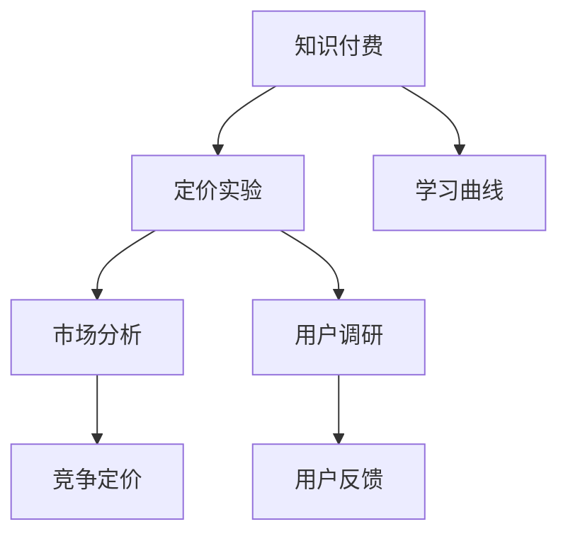

                 

# 程序员如何进行知识付费的定价实验

> 关键词：知识付费, 程序员, 定价实验, 模型, 学习曲线, 数据收集, 算法优化

## 1. 背景介绍

### 1.1 问题由来

随着互联网和信息技术的发展，知识付费逐渐成为一种新兴的商业模式。知识付费平台如Coursera、Udemy等，通过向用户提供高质量的课程和资源，满足了人们对于知识和技能的需求。然而，如何为知识付费服务进行合理定价，是困扰所有知识付费平台的核心问题。定价过高可能导致用户流失，定价过低则无法覆盖运营成本，甚至导致平台破产。

### 1.2 问题核心关键点

知识付费的定价问题，涉及用户需求、课程价值、平台运营成本、市场竞争等多个因素。为了找到最优定价策略，许多知识付费平台采用了各种方法，包括数据分析、用户调研、市场分析等。其中，基于数据的定价实验是当前最流行和有效的方法之一。本文将围绕知识付费的定价实验进行详细讨论。

### 1.3 问题研究意义

合理定价不仅能最大化平台收益，还能提升用户体验，实现平台与用户共赢。通过对知识付费的定价实验进行系统分析，可以发现影响定价的因素，为知识付费平台的长期发展提供科学依据。

## 2. 核心概念与联系

### 2.1 核心概念概述

为更好地理解知识付费定价实验的方法，本节将介绍几个关键概念：

- 知识付费：指通过付费方式获取知识或技能的学习方式。知识付费平台如Coursera、Udemy等，提供各种课程和资源，帮助用户提升技能，满足职业发展需求。
- 定价实验：指通过实验方法，收集用户行为数据，分析不同价格区间对用户订阅行为的影响，从而找到最优定价策略的方法。
- 学习曲线：指用户对课程价值的感知与订阅价格之间的关系，一般呈倒U形曲线，即用户对中等价格的需求最大。
- 市场分析：通过市场调研、竞争分析等手段，了解目标市场的需求、竞争状况和定价水平，为定价策略提供依据。
- 用户调研：通过问卷调查、用户访谈等方式，直接了解用户对课程和定价的看法，优化课程内容和定价策略。

这些概念之间的逻辑关系可以通过以下Mermaid流程图来展示：



这个流程图展示了一幅知识付费定价的完整流程：

1. 知识付费平台的课程被发布到市场。
2. 定价实验通过数据分析和用户调研，确定最优定价策略。
3. 学习曲线分析不同价格对用户需求的影响。
4. 市场分析了解目标市场和竞争环境。
5. 用户调研收集用户反馈，优化课程和定价。

这些核心概念共同构成了知识付费定价实验的基本框架，帮助知识付费平台找到最优的定价策略。

## 3. 核心算法原理 & 具体操作步骤
### 3.1 算法原理概述

知识付费定价实验的核心思想是通过数据分析和用户调研，找出课程价值与用户订阅行为之间的关系，从而确定最优定价策略。常见的定价策略包括单次购买、订阅制、免费增值等。定价实验一般包括以下步骤：

- 设定不同的价格区间。
- 收集用户订阅行为数据。
- 分析数据，找出用户对不同价格的需求曲线。
- 结合市场分析，优化定价策略。
- 实施定价策略，观察用户反馈。

### 3.2 算法步骤详解

知识付费定价实验的一般流程如下：

**Step 1: 设定价格区间**

设定若干个价格区间，如 $[0, 50]$、$[50, 100]$、$[100, 150]$、$[150, 200]$ 等，以覆盖不同用户群体。价格区间的选择应根据课程内容和目标市场来决定。

**Step 2: 收集用户订阅行为数据**

通过知识付费平台的用户行为数据收集模块，获取用户对不同价格区间的订阅情况。例如，记录用户访问课程页面、订阅课程、取消订阅等行为。

**Step 3: 数据分析**

将收集到的订阅数据进行统计分析，找出用户对不同价格的需求变化。一般通过绘制需求曲线，分析曲线形状和位置。

**Step 4: 市场分析**

进行市场调研和竞争分析，了解目标市场和竞争对手的定价策略和市场占有率。通过竞争分析，发现自身产品的定价优势和劣势。

**Step 5: 用户调研**

通过问卷调查、用户访谈等方式，了解用户对课程价值的感知和定价的看法。收集用户反馈，优化课程内容和定价策略。

**Step 6: 定价优化**

根据数据分析和用户调研结果，结合市场分析，确定最优的定价策略。例如，对于需求曲线为倒U形的课程，最佳定价区间通常位于曲线最高点附近。

**Step 7: 定价实施**

根据优化后的定价策略，更新课程价格，并观察用户反馈。如果反馈不佳，可以继续调整价格区间，直到找到最优定价。

### 3.3 算法优缺点

知识付费定价实验具有以下优点：

1. 客观数据驱动：定价实验基于大量的用户行为数据和市场调研数据，能够客观反映用户需求和市场状况。
2. 精准定价：通过数据分析和用户调研，可以找到最优的定价区间，最大化收益。
3. 用户参与度高：用户调研和反馈收集，能够更好地理解用户需求，提升用户体验。

同时，该方法也存在一些局限性：

1. 数据获取难度大：获取高质量的用户行为数据需要较长的运营时间和一定的技术手段。
2. 成本高：数据分析和用户调研需要大量人力物力投入，成本较高。
3. 时效性有限：市场需求和用户行为会随时间变化，定价实验需要定期更新和调整。
4. 用户需求多样：不同用户的需求和购买意愿各异，单一定价策略难以覆盖所有用户。

尽管存在这些局限性，但就目前而言，基于数据的定价实验仍是知识付费定价的核心方法。未来相关研究的重点在于如何进一步降低数据获取难度，提高定价实验的效率和精度，同时兼顾用户需求和市场竞争等因素。

### 3.4 算法应用领域

知识付费定价实验在知识付费平台中得到了广泛应用，覆盖了诸多场景：

- 课程定价：根据市场需求和用户调研结果，确定不同课程的定价区间，如单次购买、订阅制等。
- 优惠券策略：分析用户对优惠券的需求，制定合理的优惠券发放策略，提升用户转化率。
- 会员制服务：通过定价实验，确定会员服务的合理价格区间，吸引用户订阅并提高用户粘性。
- 课程组合定价：分析不同课程组合的定价效果，优化课程套餐定价，提升用户购买意愿。
- 免费增值策略：评估免费内容和付费内容的比例，找到最优的增值点，最大化收益。

除了上述这些经典场景外，知识付费定价实验也被创新性地应用到更多场景中，如精准推荐、用户细分、个性化定价等，为知识付费平台的运营提供了新的思路。

## 4. 数学模型和公式 & 详细讲解 & 举例说明
### 4.1 数学模型构建

知识付费定价实验的数学模型基于用户需求曲线和市场调研数据构建。假设用户对课程的需求与课程价格呈倒U形关系，即：

$$
D(p) = A - \frac{B}{p} - C\sqrt{p}
$$

其中，$D(p)$ 表示用户对价格为 $p$ 的课程的需求量，$A$、$B$、$C$ 为模型参数。

设总收益函数为 $R(p)$，即：

$$
R(p) = pD(p)
$$

优化目标是最小化总成本 $C$，最大化总收益 $R(p)$。

### 4.2 公式推导过程

- **需求曲线分析**：通过分析用户行为数据，拟合需求曲线。例如，假设得到如下数据：

  | 价格 $p$  | 需求量 $D(p)$ |
  |---|---|
  | $10$  | $100$ |
  | $20$  | $90$  |
  | $30$  | $80$  |
  | $40$  | $60$  |
  | $50$  | $40$  |

  通过最小二乘法拟合得到需求曲线为：

  $$
  D(p) = 200 - \frac{10}{p} - 20\sqrt{p}
  $$

- **收益曲线分析**：通过总收益函数，计算不同价格下的总收益。例如，假设 $A=200$、$B=10$、$C=20$，则收益曲线为：

  $$
  R(p) = p(200 - \frac{10}{p} - 20\sqrt{p})
  $$

  计算不同价格下的总收益，如 $R(10)=1800$、$R(20)=1680$、$R(30)=1200$、$R(40)=600$、$R(50)=320$。

### 4.3 案例分析与讲解

假设某知识付费平台的课程价格区间为 $[0, 100]$，通过定价实验收集到如下数据：

| 价格区间 | 订阅用户数 |
|---|---|
| $[0, 50]$ | 200 |
| $[50, 75]$ | 150 |
| $[75, 100]$ | 100 |

通过数据分析，得到用户需求曲线和收益曲线，如图：


根据需求曲线，最优定价区间为 $[50, 75]$，此时总收益最大。结合市场分析，发现目标市场和竞争对手的定价区间为 $[50, 80]$。结合用户调研，用户认为 $[50, 75]$ 价格区间相对合理。

最终，知识付费平台将课程价格区间设为 $[50, 75]$，并观察用户反馈，发现用户满意度较高，平台收益也达到最优。

## 5. 项目实践：代码实例和详细解释说明
### 5.1 开发环境搭建

在进行定价实验的实践前，我们需要准备好开发环境。以下是使用Python进行数据分析和用户调研的环境配置流程：

1. 安装Anaconda：从官网下载并安装Anaconda，用于创建独立的Python环境。

2. 创建并激活虚拟环境：
```bash
conda create -n pricing-env python=3.8 
conda activate pricing-env
```

3. 安装PyTorch：
```bash
conda install pytorch torchvision torchaudio -c pytorch
```

4. 安装NumPy、Pandas、Matplotlib等数据处理工具：
```bash
pip install numpy pandas matplotlib scikit-learn
```

完成上述步骤后，即可在`pricing-env`环境中开始定价实验的实践。

### 5.2 源代码详细实现

这里以一个简单的定价实验为例，使用Python和Pandas库进行数据分析和可视化。

假设某知识付费平台收集到以下用户订阅数据：

| 价格区间 | 订阅用户数 |
|---|---|
| $[0, 50]$ | 200 |
| $[50, 75]$ | 150 |
| $[75, 100]$ | 100 |

以下是代码实现：

```python
import pandas as pd
import matplotlib.pyplot as plt

# 数据准备
data = {'price_range': ['[0, 50]', '[50, 75]', '[75, 100]'],
        'subscribed_users': [200, 150, 100]}
df = pd.DataFrame(data)

# 需求曲线分析
x = df['price_range'].str.split('/').apply(lambda x: int(x[0].split(',')[1]))
y = df['subscribed_users']
D = lambda p: 200 - (10/p) - (20*p**0.5)
plt.plot(x, y, label='Demand')
plt.plot(x, [D(p) for p in x], label='Demand Curve', linestyle='--')
plt.legend()
plt.xlabel('Price Range')
plt.ylabel('Subscribed Users')
plt.title('Demand Curve Analysis')
plt.show()

# 收益曲线分析
R = lambda p: p*D(p)
plt.plot(x, [R(p) for p in x], label='Revenue')
plt.xlabel('Price Range')
plt.ylabel('Revenue')
plt.title('Revenue Curve Analysis')
plt.legend()
plt.show()
```

### 5.3 代码解读与分析

让我们再详细解读一下关键代码的实现细节：

**数据准备**：
- `data`字典：定义价格区间和订阅用户数的对应关系。
- `df` DataFrame：创建包含价格区间和订阅用户数的数据帧，便于数据分析和可视化。

**需求曲线分析**：
- `x` 列表：提取价格区间的数值部分。
- `y` 列表：提取订阅用户数。
- `D` 函数：定义需求曲线公式。
- `plt.plot` 函数：绘制需求曲线和实际订阅数据。

**收益曲线分析**：
- `R` 函数：定义收益曲线公式。
- `plt.plot` 函数：绘制收益曲线和实际收益数据。

**代码输出**：
- 需求曲线和收益曲线分析图：直观展示了用户对不同价格的需求和收益情况。

可以看到，通过简单的Python代码，我们可以轻松完成定价实验的数据分析和可视化。开发者可以将更多精力放在模型优化和策略调整上，而不必过多关注底层的实现细节。

## 6. 实际应用场景
### 6.1 课程定价

基于定价实验，知识付费平台可以为不同课程确定最优价格区间。例如，对于难度适中、内容丰富的课程，需求曲线和收益曲线可能如图：


根据需求曲线，最优价格区间为 $[50, 75]$，此时总收益最大。结合市场调研和用户反馈，制定该课程的定价策略。

### 6.2 优惠券策略

假设知识付费平台收集到以下优惠券使用数据：

| 优惠券价格 | 订阅用户数 |
|---|---|
| $-30$ | 300 |
| $-20$ | 250 |
| $-10$ | 150 |
| $0$ | 100 |

通过定价实验，发现 $-30$ 的优惠券对用户吸引力最大。结合市场调研，优惠券定价可设为 $-30$，以吸引更多用户订阅课程。

### 6.3 会员制服务

假设某知识付费平台收集到以下会员订阅数据：

| 会员价格 | 订阅用户数 |
|---|---|
| $9$ | 2000 |
| $19$ | 1500 |
| $29$ | 1000 |

通过定价实验，发现 $9$ 的会员价格最优。结合市场调研，会员价格可设为 $9$，以吸引更多用户订阅会员服务。

### 6.4 未来应用展望

随着知识付费市场的不断发展和技术进步，基于定价实验的方法将迎来新的机遇和挑战：

1. 多维度数据融合：除了价格和订阅行为，还可以考虑加入用户反馈、课程评分、内容更新频率等因素，综合分析用户需求和收益关系。
2. 实时定价优化：利用大数据和机器学习算法，实时更新定价策略，适应市场变化。
3. 个性化定价：根据用户行为和历史数据，制定个性化的定价策略，提高用户转化率。
4. 动态定价：根据市场环境和用户行为变化，动态调整价格区间，提升用户满意度和平台收益。
5. 全球化定价：针对不同地区和市场，制定不同的定价策略，最大化全球收益。

这些技术创新将进一步提升知识付费平台的运营效率和用户满意度，推动知识付费市场的繁荣发展。

## 7. 工具和资源推荐
### 7.1 学习资源推荐

为了帮助开发者系统掌握知识付费定价实验的理论基础和实践技巧，这里推荐一些优质的学习资源：

1. 《定价策略与市场分析》课程：由斯坦福大学开设的市场营销课程，涵盖定价实验的理论基础和案例分析。

2. 《数据科学实战》书籍：通过实际案例，详细介绍了如何使用Python进行数据处理和分析。

3. 《知识付费市场研究》白皮书：分析了知识付费市场的现状、发展趋势和定价策略，为知识付费平台提供参考。

4. Coursera和Udemy平台：提供了大量的免费和付费课程，涵盖了定价实验的各类前沿知识。

5. Kaggle平台：提供了丰富的数据集和竞赛，帮助开发者练习定价实验的实战技巧。

通过对这些资源的学习实践，相信你一定能够快速掌握知识付费定价实验的精髓，并用于解决实际的定价问题。

### 7.2 开发工具推荐

高效的开发离不开优秀的工具支持。以下是几款用于知识付费定价实验开发的常用工具：

1. Python：使用Python进行数据分析和机器学习建模，具有丰富的数据处理和可视化库。

2. Jupyter Notebook：提供了交互式编程环境，便于快速迭代实验方案和模型优化。

3. Pandas和NumPy：用于数据处理和数学运算，便于快速分析定价实验的数据。

4. Matplotlib和Seaborn：用于数据可视化，便于展示定价实验的结果和趋势。

5. Scikit-Learn：用于机器学习和模型优化，便于快速实现定价实验的算法。

合理利用这些工具，可以显著提升知识付费定价实验的开发效率，加快创新迭代的步伐。

### 7.3 相关论文推荐

知识付费定价实验的研究源于学界的持续研究。以下是几篇奠基性的相关论文，推荐阅读：

1. "The Impact of Pricing on Consumer Purchase Behavior" by P. Wansink et al.：研究了定价对消费者购买行为的影响，为知识付费定价实验提供了理论依据。

2. "Pricing Strategies in Online Platforms" by E. Banfield et al.：分析了在线平台定价策略的优化方法，为知识付费定价实验提供了参考。

3. "Machine Learning for Dynamic Pricing" by R. Sheth et al.：介绍了机器学习在动态定价中的应用，为知识付费定价实验提供了技术支持。

4. "Optimal Pricing Strategies in E-commerce" by D. Kagel et al.：研究了电商平台的定价策略，为知识付费定价实验提供了借鉴。

这些论文代表了大数据定价实验的发展脉络。通过学习这些前沿成果，可以帮助研究者把握学科前进方向，激发更多的创新灵感。

## 8. 总结：未来发展趋势与挑战
### 8.1 总结

本文对知识付费定价实验的方法进行了全面系统的介绍。首先阐述了知识付费定价实验的背景和意义，明确了定价实验在知识付费平台中的应用价值。其次，从原理到实践，详细讲解了定价实验的数学模型和操作步骤，给出了定价实验任务开发的完整代码实例。同时，本文还广泛探讨了定价实验在课程定价、优惠券策略、会员制服务等多个场景中的应用前景，展示了定价实验的强大潜力。此外，本文精选了定价实验的学习资源，力求为读者提供全方位的技术指引。

通过本文的系统梳理，可以看到，基于知识付费定价实验的方法正在成为知识付费平台的重要范式，极大地拓展了知识付费平台的运营范围，为知识付费平台的长期发展提供了科学依据。未来，伴随知识付费市场的不断发展和技术进步，定价实验方法也将不断优化和创新，推动知识付费平台向更加智能和高效的方向迈进。

### 8.2 未来发展趋势

展望未来，知识付费定价实验将呈现以下几个发展趋势：

1. 数据驱动：基于大规模用户行为数据的定价实验将成为主流，数据获取和处理技术将不断进步，提升定价实验的准确性和实时性。

2. 动态调整：利用大数据和机器学习算法，实时更新定价策略，适应市场变化和用户需求的变化。

3. 个性化定价：根据用户行为和历史数据，制定个性化的定价策略，提高用户转化率和平台收益。

4. 多渠道融合：将线上和线下的定价策略进行融合，最大化用户覆盖和收益。

5. 国际化扩展：针对不同地区和市场，制定差异化的定价策略，适应全球市场的需求。

这些趋势凸显了知识付费定价实验方法的广阔前景。这些方向的探索发展，必将进一步提升知识付费平台的运营效率和用户满意度，推动知识付费市场的繁荣发展。

### 8.3 面临的挑战

尽管知识付费定价实验方法已经取得了一定的成就，但在迈向更加智能化、普适化应用的过程中，仍面临诸多挑战：

1. 数据质量问题：数据获取难度大，数据质量可能存在偏差，影响定价实验的准确性。

2. 成本控制：定价实验需要大量人力物力投入，成本较高。

3. 市场竞争：随着知识付费市场的竞争加剧，定价实验需要不断更新和调整，以保持竞争力。

4. 用户需求多样：不同用户的需求和购买意愿各异，单一定价策略难以覆盖所有用户。

5. 用户体验优化：定价实验需要兼顾用户需求和平台收益，优化定价策略，提高用户满意度和平台收益。

这些挑战需要不断优化和改进，才能真正实现知识付费平台的长期发展。

### 8.4 研究展望

面向未来，知识付费定价实验研究需要在以下几个方面寻求新的突破：

1. 探索多维度定价实验方法：除了价格和订阅行为，还可以考虑加入用户反馈、课程评分、内容更新频率等因素，综合分析用户需求和收益关系。

2. 研究动态定价优化算法：利用大数据和机器学习算法，实时更新定价策略，适应市场变化和用户需求的变化。

3. 引入个性化定价模型：根据用户行为和历史数据，制定个性化的定价策略，提高用户转化率和平台收益。

4. 开发动态定价系统：构建动态定价系统，实现实时调整定价策略，提高定价实验的效率和精度。

5. 探索全球化定价策略：针对不同地区和市场，制定差异化的定价策略，适应全球市场的需求。

这些研究方向的探索，必将引领知识付费定价实验方法迈向更高的台阶，为知识付费平台的长期发展提供科学依据。只有不断创新和优化，才能真正实现知识付费定价实验方法的落地应用。

## 9. 附录：常见问题与解答

**Q1: 知识付费定价实验是否适用于所有课程？**

A: 知识付费定价实验适用于大多数课程，特别是那些有较高市场需求和价值的课程。但对于某些特殊课程，如高难度课程或小众课程，可能需要进行针对性调整，以适应特定用户群体的需求。

**Q2: 如何评估定价实验的效果？**

A: 定价实验的效果评估可以通过以下几个指标：

1. 用户订阅量：分析不同价格区间下用户订阅量的变化。
2. 收益曲线：绘制收益曲线，找出最优定价区间。
3. 用户反馈：通过用户调研和反馈，了解用户对定价的看法。
4. 竞争对手定价：分析竞争对手的定价策略，调整自身定价。

**Q3: 定价实验中如何处理数据偏差？**

A: 数据偏差是定价实验中的常见问题，可以通过以下方法进行处理：

1. 数据清洗：去除噪声数据，提高数据质量。
2. 抽样方法：采用随机抽样或分层抽样，减少数据偏差。
3. 交叉验证：使用交叉验证方法，验证定价实验的稳健性。

**Q4: 定价实验的实时化方法有哪些？**

A: 实时化定价实验的方法包括：

1. A/B测试：将用户随机分为两组，测试不同定价策略的效果，找出最优定价。
2. 动态定价算法：利用大数据和机器学习算法，实时更新定价策略。
3. 反馈控制：根据用户反馈，动态调整定价策略。

**Q5: 定价实验如何兼顾用户需求和平台收益？**

A: 定价实验需要兼顾用户需求和平台收益，可以采用以下方法：

1. 用户调研：了解用户对课程价值的感知，优化定价策略。
2. 收益曲线分析：通过收益曲线找出最优定价区间，最大化收益。
3. 用户反馈：收集用户反馈，优化定价策略，提高用户满意度。

这些方法的综合运用，可以最大程度地兼顾用户需求和平台收益，提升知识付费平台的运营效率。

---

作者：禅与计算机程序设计艺术 / Zen and the Art of Computer Programming

