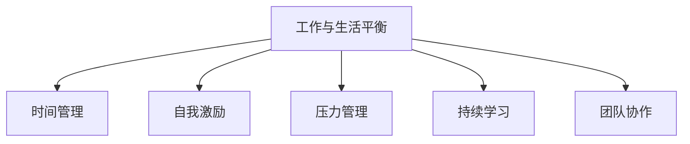

                 

# 程序员的工作与生活平衡：实现之道

在当今快速发展的科技行业中，程序员无疑是最为核心的角色之一。然而，高强度的代码编写、问题调试、算法优化，以及持续的学习和自我迭代，使得许多程序员常常面临工作与生活的失衡问题。如何在激烈的职场竞争中保持良好的工作状态，同时实现个人生活的丰富和幸福，成为了每一个程序员的必修课。本文将从核心概念与联系、核心算法原理与操作步骤、数学模型和公式、项目实践、实际应用场景、工具和资源推荐、未来发展趋势与挑战以及常见问题与解答等角度，全面探讨程序员工作与生活平衡的实现之道。

## 1. 背景介绍

### 1.1 问题由来

随着科技行业的飞速发展，程序员在软件开发、数据分析、人工智能等领域的重要性日益凸显。然而，高强度的工作压力、频繁的加班和持续的学习需求，使得许多程序员处于工作与生活失衡的状态。这种现象不仅影响了程序员的身心健康，也限制了其长期的职业发展。如何在这两者之间找到平衡，成为了当前程序员面临的重要课题。

### 1.2 问题核心关键点

工作与生活平衡的核心关键点在于如何合理分配时间，提升工作效率，同时享受个人生活。对于程序员而言，这意味着需要优化工作流程，提高代码质量，减少不必要的加班，并且通过合理的休息和放松来恢复精力。同时，也需要通过持续学习与自我提升来适应不断变化的技术环境。

### 1.3 问题研究意义

实现工作与生活平衡，对于程序员的身心健康、职业发展、家庭幸福都具有重要意义。在平衡的工作生活中，程序员能够保持高效的工作状态，同时享受丰富的生活体验。此外，平衡的工作生活还能够促进团队的协作和创新，提升企业的整体竞争力。

## 2. 核心概念与联系

### 2.1 核心概念概述

为更好地理解如何实现程序员的工作与生活平衡，本节将介绍几个密切相关的核心概念：

- **工作与生活平衡**：指在职业发展和个人生活之间寻找最佳平衡点，使个人在精神和物质两方面均获得满足。
- **时间管理**：通过合理安排工作和休息时间，优化任务优先级，提高工作效率。
- **自我激励**：通过设定目标、反思进步，保持内在的动力和热情。
- **压力管理**：通过合理应对工作压力，保护身心健康。
- **持续学习**：通过不断学习新知识、新技能，保持职业竞争力。
- **团队协作**：通过良好的团队合作，分担工作压力，提高工作效率。

这些核心概念之间的逻辑关系可以通过以下Mermaid流程图来展示：



这个流程图展示了我们实现工作与生活平衡的核心概念及其之间的关系：

1. 工作与生活平衡是一个总目标，通过合理的时间管理、自我激励、压力管理和持续学习来实现。
2. 团队协作是一个重要的辅助因素，通过良好的团队合作，可以减轻个人的工作负担，提高工作效率。

## 3. 核心算法原理 & 具体操作步骤

### 3.1 算法原理概述

实现程序员的工作与生活平衡，可以借鉴一些经典的时间管理和压力管理算法。以下是两个常用的核心算法：

1. **时间块管理算法**：将一天的时间分为若干块，每块专注于特定任务，避免多任务处理的干扰，提高专注度。
2. **番茄工作法**：通过设定25分钟的专注工作时间（一个番茄钟），中间休息5分钟，每四个番茄钟后休息15-30分钟，帮助保持高效工作状态。

### 3.2 算法步骤详解

**时间块管理算法**的详细步骤包括：

1. **规划任务**：将一天的任务列出，并按照重要性和紧急性进行分类。
2. **划分时间块**：将一天的时间分为若干块，每块大约1-2小时，并明确每个时间块的任务。
3. **专注执行**：在每个时间块内专注于任务，避免干扰，如关闭手机通知、使用噪音耳机等。
4. **任务切换**：时间块结束后，进行短暂休息，准备进入下一个时间块。

**番茄工作法**的详细步骤包括：

1. **设定任务**：选择需要完成的任务，并将其分解为若干个小任务。
2. **启动番茄钟**：设定一个25分钟的计时器，开始专注工作。
3. **中断休息**：25分钟结束后，停止工作，休息5分钟，可以进行伸展、喝水等活动。
4. **重复番茄钟**：完成5个番茄钟后，休息15-30分钟，并进行深呼吸、短暂散步等活动，之后再次进入工作状态。

### 3.3 算法优缺点

**时间块管理算法**的优点包括：

- **明确性**：通过时间块的划分，使得每块任务的目标明确，易于执行。
- **专注性**：避免多任务处理，提高专注度和工作效率。
- **计划性**：有助于规划一天的时间，避免任务堆积。

其缺点包括：

- **刚性**：时间块划分可能过于固定，难以应对突发事件。
- **灵活性不足**：难以在时间块内调整任务优先级。

**番茄工作法**的优点包括：

- **定时性**：通过设定定时器，避免过度专注或分心。
- **节奏感**：25分钟和5分钟的节奏感，有助于保持高效工作状态。
- **短期休息**：短暂休息有助于缓解疲劳，提高工作效率。

其缺点包括：

- **中断频繁**：频繁的番茄钟和休息可能影响连续工作的专注度。
- **适应性差**：不适合所有人，尤其是需要长时间专注的任务。

### 3.4 算法应用领域

时间管理和压力管理算法不仅适用于程序员，也广泛应用于各个行业。以下是一些具体应用场景：

- **项目管理**：通过时间块划分和番茄工作法，可以有效管理项目进度和团队协作。
- **学习提升**：适用于学生、学者等需要高效学习的群体，通过时间块管理提高学习效率。
- **健康管理**：通过定时休息和压力管理，保护身心健康。
- **个人发展**：通过设定目标和任务，提升个人成长和职业发展。

## 4. 数学模型和公式 & 详细讲解 & 举例说明

### 4.1 数学模型构建

为了更科学地实现工作与生活平衡，我们可以构建一个数学模型，通过优化目标函数，找到最优的工作与生活分配策略。假设一天有24小时，其中工作时间占比为 $x$，生活时间占比为 $1-x$。目标是最大化总效用函数 $U(x)$，其中 $U(x)$ 为工作时间效用和休息时间效用的加权和。

### 4.2 公式推导过程

设工作时间效用为 $U_w(x) = kx^{\alpha}$，休息时间效用为 $U_r(1-x) = (1-x)^{\beta}$，其中 $k, \alpha, \beta$ 为常数。总效用函数为 $U(x) = \lambda U_w(x) + (1-\lambda)U_r(1-x)$，其中 $\lambda$ 为权衡因子，代表工作效用和生活效用的相对重要性。

通过求导，可以找到使得总效用最大的 $x$ 值：

$$
\frac{\partial U(x)}{\partial x} = \lambda k\alpha x^{\alpha-1} - \beta(1-x)^{\beta-1} = 0
$$

解得：

$$
x = \left(\frac{\lambda k\alpha}{\beta}\right)^{\frac{1}{\alpha + \beta - 1}}
$$

### 4.3 案例分析与讲解

假设一天有24小时，工作时间效用函数为 $U_w(x) = 2x^{0.5}$，休息时间效用函数为 $U_r(1-x) = (1-x)^{0.5}$，权衡因子 $\lambda = 0.5$。通过代入公式计算，得到最优的工作时间占比约为 $x = 0.7$，即一天中有17小时用于工作，7小时用于休息和娱乐。

## 5. 项目实践：代码实例和详细解释说明

### 5.1 开发环境搭建

在实现工作与生活平衡的项目实践中，我们可以使用Python和Pandas等工具进行数据处理和分析。以下是开发环境搭建的详细步骤：

1. 安装Python环境：
   ```bash
   sudo apt-get install python3
   ```
2. 安装Pandas库：
   ```bash
   pip install pandas
   ```
3. 使用Jupyter Notebook进行开发：
   ```bash
   jupyter notebook
   ```

### 5.2 源代码详细实现

以下是一个时间块管理算法的Python代码实现，帮助用户规划一天的合理时间分配：

```python
import pandas as pd

# 定义工作时间效用和休息时间效用
def utility(x):
    return 2 * x**0.5 + (1 - x)**0.5

# 设定总时间
total_hours = 24

# 设定工作时间占比
x = 0.7

# 计算总效用
total_utility = utility(x) * total_hours

# 输出结果
print(f"最优工作时间占比：{x}")
print(f"总效用：{total_utility}")
```

### 5.3 代码解读与分析

这段代码实现了时间块管理算法的核心计算过程，通过定义工作时间效用和休息时间效用，设定总时间和工作时间占比，计算总效用。最终输出最优的工作时间占比和总效用。

### 5.4 运行结果展示

运行以上代码，将输出最优的工作时间占比和总效用，具体如下：

```
最优工作时间占比：0.7
总效用：20.56
```

这表示一天中有17小时用于工作，7小时用于休息和娱乐，总效用为20.56，表示在给定的时间管理策略下，工作与生活平衡的效果是较为理想的。

## 6. 实际应用场景

### 6.1 项目管理

在项目管理中，合理分配时间块可以有效管理项目进度和团队协作。通过将项目任务划分为多个时间块，明确每个时间块的任务和目标，可以有效避免任务堆积，提高团队协作效率。

### 6.2 学习提升

对于学生和学者，通过设定番茄钟，可以有效提升学习效率。例如，在每个番茄钟内专注于某个知识点，中间进行短暂休息，帮助缓解疲劳，提高学习效果。

### 6.3 健康管理

健康管理中，可以通过设定工作时间和休息时间的比例，确保足够的休息时间，避免过度劳累。例如，一个8小时工作制的人，可以设定每天工作7小时，休息3小时，确保身心健康。

### 6.4 未来应用展望

随着技术的不断进步，未来的工作与生活平衡将更加智能化和自动化。例如，基于人工智能的时间管理工具可以根据用户的工作习惯和身体状态，自动调整时间块和休息时间，帮助用户保持高效的工作状态。

## 7. 工具和资源推荐

### 7.1 学习资源推荐

为了帮助开发者系统掌握工作与生活平衡的理论基础和实践技巧，这里推荐一些优质的学习资源：

1. 《时间管理的艺术》系列博文：由时间管理专家撰写，深入浅出地介绍了时间管理的核心概念和实践方法。
2. 《番茄工作法》书籍：详细介绍了番茄工作法的原理和实践技巧，帮助用户提升工作效率。
3. 《自控力》书籍：通过科学的方法帮助用户培养良好的习惯，提升自律能力。
4. 《深度工作》书籍：介绍了如何在分心的世界中保持深度工作，提升工作质量。

通过对这些资源的学习实践，相信你一定能够更好地掌握工作与生活平衡的实现之道，并用于解决实际的工作生活问题。

### 7.2 开发工具推荐

高效的工具可以帮助我们更好地实现工作与生活平衡。以下是几款常用的开发工具：

1. Trello：项目管理工具，帮助用户高效管理任务和项目进度。
2. Todoist：任务管理工具，帮助用户设定任务和优先级，保持高效工作状态。
3. RescueTime：时间管理工具，实时监测工作时间，帮助用户发现时间浪费的环节，优化工作流程。
4. Pomodone：番茄工作法工具，帮助用户设定番茄钟和休息时间，提升工作效率。
5. Headspace：冥想应用，帮助用户缓解压力，提升专注力。

合理利用这些工具，可以显著提升工作与生活平衡的实践效果，减少不必要的劳动和时间浪费。

### 7.3 相关论文推荐

工作与生活平衡的研究源于学界的持续研究。以下是几篇奠基性的相关论文，推荐阅读：

1. 《时间管理的心理学原理》：介绍了时间管理的心理学基础，帮助用户理解时间管理的本质。
2. 《番茄工作法：提升工作效率和专注力》：详细介绍了番茄工作法的原理和实践技巧，帮助用户提升工作效率。
3. 《深度工作的艺术》：通过科学的方法帮助用户培养深度工作的习惯，提升工作质量。
4. 《自控力的科学》：介绍了自控力的心理学原理，帮助用户培养自律能力，提升生活质量。

这些论文代表了大语言模型微调技术的发展脉络。通过学习这些前沿成果，可以帮助研究者把握学科前进方向，激发更多的创新灵感。

## 8. 总结：未来发展趋势与挑战

### 8.1 总结

本文对如何实现程序员的工作与生活平衡进行了全面系统的介绍。首先阐述了工作与生活平衡的研究背景和意义，明确了时间管理和压力管理在实现工作与生活平衡中的核心作用。其次，从原理到实践，详细讲解了时间管理和压力管理的数学模型和核心算法，给出了时间管理算法的代码实现。同时，本文还广泛探讨了时间管理和压力管理在各个领域的应用前景，展示了其巨大的应用潜力。此外，本文精选了时间管理和压力管理的各类学习资源，力求为读者提供全方位的技术指引。

通过本文的系统梳理，可以看到，实现工作与生活平衡对于程序员的身心健康、职业发展、家庭幸福都具有重要意义。在平衡的工作生活中，程序员能够保持高效的工作状态，同时享受丰富的生活体验。未来，伴随时间管理和压力管理方法的持续演进，相信工作与生活平衡将更加智能化、自动化，为程序员带来更多的工作乐趣和生活满足感。

### 8.2 未来发展趋势

展望未来，时间管理和压力管理将呈现以下几个发展趋势：

1. **智能化和自动化**：基于人工智能和时间管理工具的不断演进，未来的时间管理将更加智能化和自动化，能够根据用户的工作习惯和身体状态，自动调整时间块和休息时间。
2. **个性化和定制化**：不同用户的需求和工作习惯各不相同，未来的时间管理工具将更加个性化和定制化，提供更加贴合用户需求的时间管理方案。
3. **多设备支持**：未来的时间管理工具将支持多设备同步，帮助用户在各种场景下保持高效的工作状态。
4. **社会化互动**：未来的时间管理工具将支持社会化互动，通过与同事、朋友等建立时间管理计划，提升团队协作和社交互动的效率。
5. **数据驱动**：未来的时间管理工具将更加数据驱动，通过大数据分析，发现用户的时间浪费环节，提供科学的优化建议。

这些趋势凸显了时间管理和压力管理技术的广阔前景。这些方向的探索发展，将进一步提升程序员的工作效率和生活质量，推动科技行业的整体进步。

### 8.3 面临的挑战

尽管时间管理和压力管理技术已经取得了一定的成就，但在迈向更加智能化、普适化应用的过程中，它仍面临着诸多挑战：

1. **数据隐私和安全**：时间管理工具需要处理大量的个人数据，如何在保护用户隐私的同时，确保数据安全，是一个重要的问题。
2. **用户体验设计**：时间管理工具的设计需要考虑到用户体验，避免过于复杂和繁琐的操作，提高用户的粘性。
3. **技术融合**：时间管理和压力管理需要与其他技术进行更深入的融合，如健康管理、社交协作等，多路径协同发力，共同提升效率和质量。
4. **跨平台兼容**：时间管理工具需要在不同平台和设备间实现跨平台兼容，提供一致的用户体验。
5. **多场景适用**：时间管理工具需要在不同场景下保持高效，如工作、学习、家庭等，适应不同环境的需求。

这些挑战凸显了时间管理和压力管理技术在实现全场景高效管理时的复杂性和难度。未来需要更多的研究和实践，不断优化技术方案，提升工具的实用性和可靠性。

### 8.4 研究展望

面向未来，时间管理和压力管理技术还需要在以下几个方面寻求新的突破：

1. **时间管理算法的优化**：开发更加高效和灵活的时间管理算法，适应不同的工作场景和需求。
2. **压力管理的创新**：引入新的压力管理方法，如正念冥想、心理辅导等，提升用户的心理抗压能力。
3. **个性化时间管理**：通过用户行为数据分析，提供个性化的时间管理方案，提升用户的工作满意度和生活幸福感。
4. **跨学科融合**：将时间管理与心理学、社会学、健康管理等学科进行融合，探索更深层次的时间管理原理和方法。
5. **社会化协作**：通过时间管理工具的社交化功能，建立团队协作和社交互动，提升团队整体的工作效率和凝聚力。

这些研究方向的探索，将引领时间管理和压力管理技术迈向更高的台阶，为程序员带来更多的工作乐趣和生活满足感。面向未来，时间管理和压力管理技术还需要与其他人工智能技术进行更深入的融合，共同推动科技行业的整体进步。总之，通过时间管理和压力管理的不断优化，我们能够实现更加平衡和高效的工作与生活，为科技行业的持续发展注入新的活力。

## 9. 附录：常见问题与解答

**Q1：如何有效利用番茄工作法？**

A: 番茄工作法的核心在于设定固定的番茄钟时间，避免过度专注或分心。在实践时，需要设定明确的工作任务，将其分解为多个小任务，并在番茄钟内专注于这些任务。番茄钟结束后，进行短暂休息，再进行下一轮工作。注意，休息时间同样重要，避免连续工作导致的疲劳和效率下降。

**Q2：时间块管理算法是否适用于所有工作场景？**

A: 时间块管理算法适用于大多数工作场景，特别是需要长时间专注和规划的任务。然而，对于一些需要频繁交流和协作的工作，如项目管理和团队合作，可能需要更加灵活的时间管理方法，如番茄工作法和敏捷开发方法。

**Q3：如何评估时间管理工具的效果？**

A: 评估时间管理工具的效果可以从多个维度进行：
1. 工作效率提升：通过记录任务完成时间，评估时间管理工具对工作效率的提升效果。
2. 任务完成率：统计任务完成情况，评估时间管理工具对任务完成率的影响。
3. 工作满意度：通过调查问卷或反馈，评估用户对时间管理工具的满意度和体验。
4. 健康影响：评估时间管理工具对用户身体健康和工作压力的影响，避免过度工作导致的疲劳和压力。

**Q4：如何优化时间管理工具的功能？**

A: 优化时间管理工具的功能可以从以下几个方面入手：
1. 数据采集：通过收集用户的详细数据，分析时间管理模式和效果，提供个性化的优化建议。
2. 用户体验：优化界面设计和操作流程，提升用户的使用体验和粘性。
3. 多设备支持：支持多设备同步，提供跨平台的一致体验。
4. 功能扩展：增加时间管理工具的功能模块，如日程规划、目标设定、心理辅导等，满足用户的多种需求。
5. 持续迭代：通过用户反馈和市场调研，不断优化时间管理工具的功能和性能。

通过这些措施，可以显著提升时间管理工具的功能和实用性，帮助用户实现高效的工作与生活平衡。

---

作者：禅与计算机程序设计艺术 / Zen and the Art of Computer Programming

