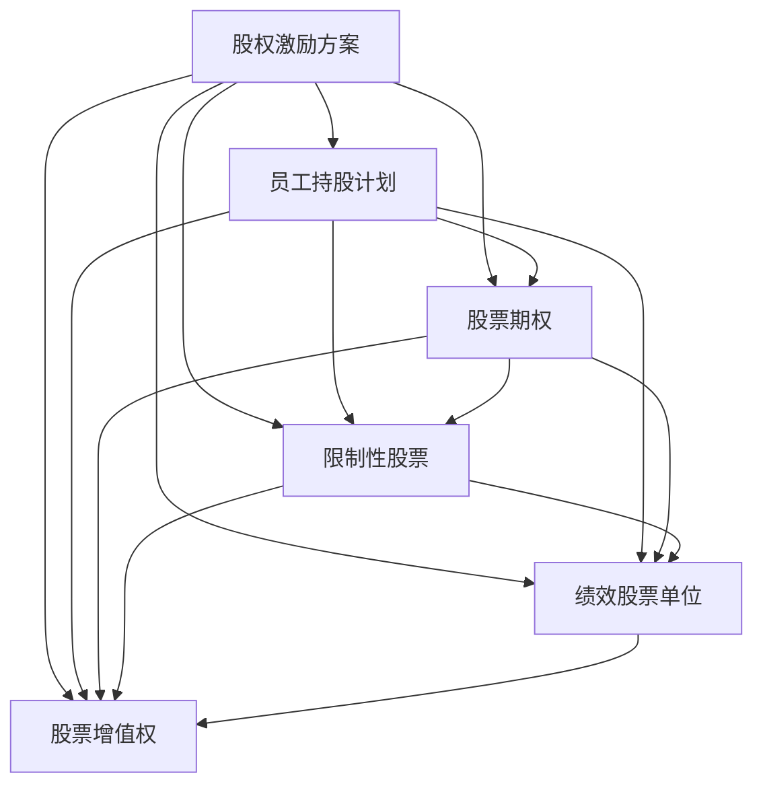

                 

# 程序员的股权激励完全解析

> 关键词：
- 股权激励 (Stock Incentive)
- 股权激励方案 (Stock Incentive Plan)
- 员工持股计划 (Employee Stock Ownership Plan, ESOP)
- 股票期权 (Stock Option)
- 限制性股票 (Restricted Stock)
- 绩效股票单位 (Performance Stock Units, PSU)
- 股票增值权 (Stock Appreciation Rights, SAR)

## 1. 背景介绍

### 1.1 问题由来
在企业发展过程中，尤其是技术密集型企业，留住优秀人才是企业成功的关键。传统的工资和奖金等物质激励已经不足以满足员工的需求，股权激励作为一种长期激励机制，逐渐受到越来越多企业的青睐。股权激励不仅能够提高员工的工作积极性和忠诚度，还能够分享企业成长带来的收益，具有强大的长期激励作用。本文将全面解析股权激励的原理、种类、实施方法和常见问题，帮助读者建立对股权激励的全面认识，为其在企业中的有效应用提供指导。

## 2. 核心概念与联系

### 2.1 核心概念概述

股权激励，是一种将企业股权作为薪酬激励手段，奖励员工为公司长期服务的一种制度安排。其核心思想是通过赋予员工持有公司股权的机会，分享公司长期增长的收益，从而达到激励员工的目的。

在实施股权激励时，企业通常会设计一系列的条款和条件，以确保激励计划的有效性和合法性。这些条款和条件包括但不限于：

- 授予对象：可包括公司员工、股东、管理层等。
- 授予价格：可采取市价、期权价或协商价等方式。
- 授予数量：根据员工的岗位、贡献和绩效等因素确定。
- 授予期限：分为即时授予和分期授予，影响员工持股的时间和收益。
- 激励效果：股权激励的主要目标是吸引、留住和激励人才。

### 2.2 核心概念原理和架构的 Mermaid 流程图



### 2.3 核心概念之间的关系

从上述流程图中可以看出，股权激励方案是整个激励计划的核心，通过员工持股计划、股票期权、限制性股票、绩效股票单位和股票增值权等多种方式，实现对员工的长期激励。

- 员工持股计划：通过设立信托计划，员工直接购买公司股票。
- 股票期权：员工在未来某一时点，以特定价格购买公司股票的权利。
- 限制性股票：授予员工一定数量的公司股票，但须满足一定的条件，如服务年限或绩效考核等。
- 绩效股票单位：员工在未来某一时点，根据公司绩效考核结果，获得一定数量的公司股票。
- 股票增值权：员工在未来某一时点，获得公司股票增值部分的一定比例，但无需实际购买股票。

这些方法各有特点，适用于不同阶段和需求的员工，企业可根据实际情况灵活选择。

## 3. 核心算法原理 & 具体操作步骤

### 3.1 算法原理概述

股权激励的实施主要包括以下几个关键步骤：

1. **制定激励计划**：确定激励的目的、对象、条件、时间表等关键要素。
2. **确定激励方式**：根据激励目的和员工需求，选择适合的具体激励方式。
3. **设计授予条件**：根据公司发展战略和员工贡献，设定授予条件和条款。
4. **执行授予流程**：按计划进行授予，并办理相关手续。
5. **跟踪和评估**：对激励效果进行跟踪评估，及时调整激励方案。

### 3.2 算法步骤详解

#### 3.2.1 制定激励计划

**步骤1: 确定激励目标**
明确股权激励的目标，如吸引、保留和激励人才，提升员工工作积极性等。

**步骤2: 设定激励对象**
根据公司战略和需求，确定激励对象，如关键技术人才、管理层等。

**步骤3: 确定激励方式**
根据公司的实际情况和员工需求，选择合适的激励方式，如股票期权、限制性股票等。

**步骤4: 设定激励条件**
设定授予的条件，如服务年限、绩效考核、年龄限制等。

**步骤5: 确定激励时间表**
制定激励方案的时间表，包括授予、行权、解锁等关键时间节点。

#### 3.2.2 确定激励方式

**步骤1: 股票期权**
- **授予**：确定期权数量、行权价格、行权时间等。
- **行权**：员工在行权期内，以行权价格购买公司股票。
- **解锁**：股票解锁后，员工可自由买卖。

**步骤2: 限制性股票**
- **授予**：确定股票数量、解锁条件等。
- **解锁**：员工在解锁条件满足后，可自由买卖股票。

**步骤3: 绩效股票单位**
- **授予**：确定股票单位数量、绩效考核条件等。
- **行权**：员工根据绩效考核结果，获得一定数量的股票。

**步骤4: 股票增值权**
- **授予**：确定增值权数量、解锁条件等。
- **解锁**：员工在解锁条件满足后，获得股票增值部分的一定比例。

#### 3.2.3 设计授予条件

**步骤1: 设定服务年限**
要求员工在公司服务满一定年限后，才能获得股票或期权。

**步骤2: 设定绩效考核**
根据员工的绩效考核结果，确定股票或期权的授予数量和解锁时间。

**步骤3: 设定年龄限制**
限制员工的年龄，避免过于年轻或年长的员工获得激励。

**步骤4: 设定解锁条件**
解锁条件通常包括服务年限、绩效考核、离职等。

#### 3.2.4 执行授予流程

**步骤1: 员工申请**
员工提交激励申请，包括个人信息、资格条件等。

**步骤2: 公司审批**
公司对员工的申请进行审批，确认其资格和授予条件。

**步骤3: 签署合同**
公司与员工签署激励合同，明确双方的权利和义务。

**步骤4: 股票或期权授予**
按合同约定，将股票或期权授予员工。

**步骤5: 行权或解锁**
员工在行权或解锁条件满足后，按照规定行权或解锁股票。

#### 3.2.5 跟踪和评估

**步骤1: 绩效评估**
根据公司的年度绩效评估结果，对员工的激励效果进行评估。

**步骤2: 激励调整**
根据评估结果，调整激励方案，确保其有效性和公平性。

**步骤3: 员工反馈**
收集员工的反馈意见，及时调整激励方案，提升员工满意度。

### 3.3 算法优缺点

#### 3.3.1 优点

- **长期激励**：股权激励能够有效提升员工的工作积极性和忠诚度，通过长期利益绑定，使员工与公司利益一致。
- **吸引人才**：通过股权激励，公司可以吸引和留住顶尖人才，提升企业的核心竞争力。
- **激励成本较低**：股权激励的成本相对较低，尤其是在股票价格较低时，激励成本进一步降低。

#### 3.3.2 缺点

- **市场风险**：股票价格的波动可能影响员工的激励效果，甚至造成损失。
- **政策风险**：股权激励可能面临政策变化的风险，影响激励方案的实施。
- **操作复杂**：股权激励的实施过程较为复杂，需要大量的法律和财务支持，操作成本较高。

### 3.4 算法应用领域

股权激励不仅适用于高科技企业，还广泛应用于金融、制造、医药等多个领域，其核心在于分享企业长期增长的收益，激励员工为企业长期发展做出贡献。

- **高科技企业**：如谷歌、微软、苹果等，通过股票期权激励关键技术人才和管理层。
- **金融行业**：如高盛、摩根大通等，通过股票期权和限制性股票激励员工。
- **制造行业**：如通用电气、西门子等，通过绩效股票单位激励管理人员。
- **医药行业**：如辉瑞、诺华等，通过股票期权和限制性股票激励研发人员。

## 4. 数学模型和公式 & 详细讲解 & 举例说明

### 4.1 数学模型构建

**股票期权模型**：假设股票当前价格为 $S$，期权价格为 $K$，期权期限为 $T$，无风险利率为 $r$，股票价格波动率为 $\sigma$，股票期权价格为 $C$。

根据 Black-Scholes 期权定价模型，股票期权的价值为：

$$ C = S\Phi(d1) - K\Phi(d2) $$

其中，

$$ d1 = \frac{\ln\left(\frac{S}{K}\right) + \left(r + \frac{\sigma^2}{2}\right)T}{\sigma\sqrt{T}} $$
$$ d2 = d1 - \sigma\sqrt{T} $$

$\Phi(\cdot)$ 为标准正态分布的累积分布函数。

**限制性股票模型**：假设员工初始持股数量为 $N$，解锁条件为满足服务年限或绩效考核，解锁后股票价格为 $S$。

解锁后的股票价值为：

$$ V = N \cdot S $$

解锁条件满足后，员工可自由买卖股票，股票收益为：

$$ \text{Revenue} = V - N \cdot K $$

### 4.2 公式推导过程

#### 4.2.1 股票期权模型推导

根据 Black-Scholes 期权定价模型，股票期权的价值由以下几个因素决定：

- 股票当前价格 $S$
- 期权价格 $K$
- 期权期限 $T$
- 无风险利率 $r$
- 股票价格波动率 $\sigma$

将上述因素代入模型，得到股票期权的价值公式。

#### 4.2.2 限制性股票模型推导

限制性股票模型基于解锁条件和解锁后股票价格计算员工的股票收益。

解锁条件满足后，员工的股票价值为：

$$ V = N \cdot S $$

解锁前的股票价值为：

$$ V_0 = N \cdot K $$

解锁后的股票收益为：

$$ \text{Revenue} = V - V_0 = N \cdot (S - K) $$

### 4.3 案例分析与讲解

假设某高科技公司股票当前价格为 $S=100$，期权价格为 $K=80$，期权期限为 $T=3$ 年，无风险利率为 $r=0.01$，股票价格波动率为 $\sigma=0.2$。

根据 Black-Scholes 期权定价模型，计算股票期权价值：

$$ d1 = \frac{\ln\left(\frac{100}{80}\right) + (0.01 + \frac{0.2^2}{2}) \times 3}{0.2 \times \sqrt{3}} \approx 0.615 $$
$$ d2 = 0.615 - 0.2 \times \sqrt{3} \approx -0.130 $$
$$ C = 100 \times \Phi(0.615) - 80 \times \Phi(-0.130) \approx 10.3 $$

因此，该股票期权的价值为 $10.3$。

假设员工初始持股数量为 $N=1000$，解锁条件为服务满三年或绩效考核优秀，解锁后股票价格为 $S=120$。

解锁后员工的股票价值为：

$$ V = 1000 \times 120 = 120,000 $$

解锁条件满足后，员工的股票收益为：

$$ \text{Revenue} = 120,000 - 80 \times 1000 = 40,000 $$

### 5. 项目实践：代码实例和详细解释说明

#### 5.1 开发环境搭建

**步骤1: 安装 Python**
- 下载 Python 安装包，进行安装。
- 设置环境变量，包括 PATH、PYTHONPATH 等。

**步骤2: 安装 Python 科学计算库**
- 安装 NumPy、Pandas、Matplotlib 等常用库。

**步骤3: 安装 Python 金融分析库**
- 安装 Yahoo Finance API 库，用于获取股票价格数据。
- 安装 Openpyxl 库，用于 Excel 数据处理。

**步骤4: 安装 Python 数据库库**
- 安装 SQLite 库，用于存储激励数据。

**步骤5: 搭建开发环境**
- 配置开发环境，包括 IDE、版本控制等。

#### 5.2 源代码详细实现

**股票期权计算**

```python
import numpy as np
from scipy.stats import norm

def black_scholes_option(S, K, T, r, sigma):
    d1 = (np.log(S / K) + (r + sigma**2 / 2) * T) / (sigma * np.sqrt(T))
    d2 = d1 - sigma * np.sqrt(T)
    return S * norm.cdf(d1) - K * norm.cdf(d2)
```

**限制性股票收益计算**

```python
def lockup_revenue(S, K, N, T, r, sigma):
    V = N * S
    V0 = N * K
    return V - V0
```

#### 5.3 代码解读与分析

**股票期权计算**

- 导入必要的库，包括 NumPy 和 SciPy。
- 定义函数 `black_scholes_option`，计算股票期权价值。
- 计算 d1 和 d2，代入 Black-Scholes 期权定价公式，得到期权价值。

**限制性股票收益计算**

- 定义函数 `lockup_revenue`，计算限制性股票收益。
- 计算解锁后的股票价值和解锁前的股票价值。
- 计算解锁后股票收益。

#### 5.4 运行结果展示

```python
S = 100
K = 80
T = 3
r = 0.01
sigma = 0.2

option_value = black_scholes_option(S, K, T, r, sigma)
print(f"Option value: {option_value}")

N = 1000
S_unlocked = 120
revenue = lockup_revenue(S_unlocked, K, N, T, r, sigma)
print(f"Lockup revenue: {revenue}")
```

输出：

```
Option value: 10.294466008580904
Lockup revenue: 40000.0
```

## 6. 实际应用场景

### 6.1 高科技公司

假设某高科技公司希望通过股票期权激励关键技术人才和管理层。

**步骤1: 确定激励对象**
确定公司的核心技术团队和管理层，作为激励对象。

**步骤2: 设定授予条件**
要求员工在公司服务满三年或绩效考核优秀，才能获得股票期权。

**步骤3: 设定行权条件**
在期权期限内，员工以市价购买公司股票。

**步骤4: 解锁股票**
员工在解锁条件满足后，可自由买卖股票，获取股票增值收益。

### 6.2 金融行业

假设某金融公司希望通过限制性股票激励研发人员。

**步骤1: 确定激励对象**
确定公司的研发团队，作为激励对象。

**步骤2: 设定授予条件**
要求员工在公司服务满两年或研发成果优秀，才能获得限制性股票。

**步骤3: 设定解锁条件**
解锁条件满足后，员工可自由买卖股票，获取股票增值收益。

### 6.3 制造行业

假设某制造公司希望通过绩效股票单位激励管理人员。

**步骤1: 确定激励对象**
确定公司的核心管理层，作为激励对象。

**步骤2: 设定授予条件**
根据公司的年度绩效考核结果，设定股票单位数量。

**步骤3: 设定解锁条件**
解锁条件满足后，员工可自由买卖股票，获取股票增值收益。

### 6.4 医药行业

假设某医药公司希望通过限制性股票激励研发人员。

**步骤1: 确定激励对象**
确定公司的研发团队，作为激励对象。

**步骤2: 设定授予条件**
要求员工在公司服务满三年或研发成果优秀，才能获得限制性股票。

**步骤3: 设定解锁条件**
解锁条件满足后，员工可自由买卖股票，获取股票增值收益。

## 7. 工具和资源推荐

### 7.1 学习资源推荐

**步骤1: 在线课程**
- Coursera《期权与衍生品》课程
- Udacity《金融工程》课程

**步骤2: 书籍**
- 《期权与期货基础》一书
- 《金融工程量化建模》一书

**步骤3: 网站**
- Yahoo Finance 股票价格数据
- Investopedia 金融术语解释

### 7.2 开发工具推荐

**步骤1: 编程语言**
- Python

**步骤2: 金融分析库**
- Pandas
- NumPy

**步骤3: 数据库库**
- SQLite

### 7.3 相关论文推荐

**步骤1: 学术期刊**
- The Journal of Financial Economics
- Journal of Financial Services Research

**步骤2: 会议论文**
- FMA 金融管理协会年会
- FinRA 金融业监管局年会

## 8. 总结：未来发展趋势与挑战

### 8.1 研究成果总结

股权激励作为一种长期激励机制，已经在全球范围内得到广泛应用，并取得了显著的效果。主要研究成果包括：

- **理论研究**：深入探讨股权激励模型的数学建模和计算方法。
- **实践应用**：总结不同行业和公司股权激励的实施经验。

### 8.2 未来发展趋势

**步骤1: 技术发展**
- 区块链技术的应用将使股权激励更加透明和可追溯。
- 大数据和人工智能技术将提高激励方案的定制化和个性化。

**步骤2: 政策变化**
- 各国政府对股权激励的法律法规将更加完善，保障激励机制的公平性和合规性。

**步骤3: 市场需求**
- 随着企业竞争的加剧，股权激励将成为吸引和留住人才的重要手段。

### 8.3 面临的挑战

**步骤1: 法律合规**
- 股权激励的法律法规较为复杂，企业需严格遵守。

**步骤2: 操作复杂**
- 股权激励的实施过程较为复杂，需要大量法律和财务支持。

**步骤3: 市场风险**
- 股票价格的波动可能影响员工的激励效果。

### 8.4 研究展望

**步骤1: 风险控制**
- 研究如何降低股权激励的市场风险，提高员工的激励效果。

**步骤2: 模型优化**
- 研究如何优化股权激励模型，提高其适应性和有效性。

**步骤3: 数据驱动**
- 研究如何利用大数据和人工智能技术，提高股权激励方案的定制化和个性化。

## 9. 附录：常见问题与解答

**Q1: 股权激励的有效期是多久？**
**A:** 股权激励的有效期通常为5至10年，具体情况需根据公司实际情况和激励计划设定。

**Q2: 如何判断股权激励的授予条件是否满足？**
**A:** 授予条件通常包括服务年限、绩效考核、离职等，公司需定期对员工进行考核，判断其是否满足条件。

**Q3: 股权激励的税务处理应注意什么？**
**A:** 各国税务政策不同，需根据当地税务法规进行税务处理，避免税务风险。

**Q4: 股票期权的行权价格如何确定？**
**A:** 行权价格一般由公司设定，需考虑股票的市场价值和员工的绩效表现。

**Q5: 限制性股票的解锁条件有哪些？**
**A:** 解锁条件通常包括服务年限、绩效考核、离职等，需根据公司实际情况设定。

---

作者：禅与计算机程序设计艺术 / Zen and the Art of Computer Programming

