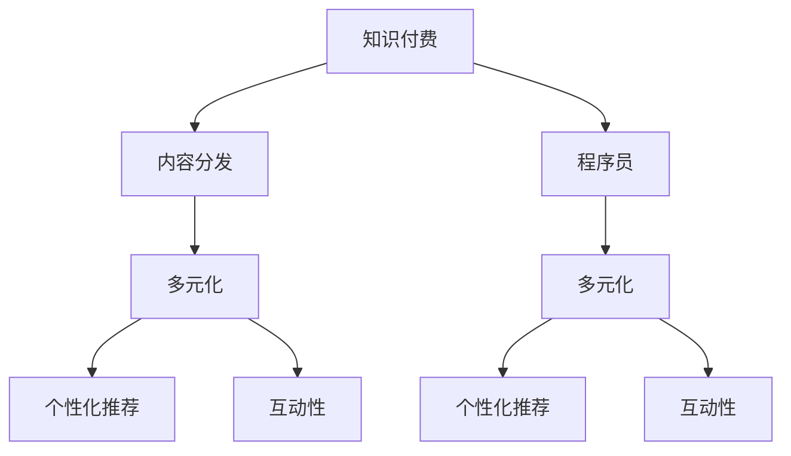

                 

# 程序员知识付费的内容分发渠道多元化

> 关键词：知识付费, 内容分发, 程序员, 多元化, 平台, 策略

## 1. 背景介绍

### 1.1 问题由来

随着互联网和数字化时代的到来，知识付费逐渐成为人们获取专业知识的重要方式。尤其是在IT技术领域，随着技术的不断进步和复杂性的增加，程序员需要不断学习和更新知识，才能跟上技术发展潮流。然而，传统的单一内容分发渠道，如论坛、博客、书籍等，已无法满足程序员日益增长的学习需求。

为了更高效地获取知识，程序员开始追求更精细化、定制化、多元化的内容分发渠道。这一趋势不仅满足了程序员的专业需求，也促进了知识付费市场的繁荣。

### 1.2 问题核心关键点

当前程序员知识付费的主要问题在于内容分发渠道单一、缺乏交互性和个性化推荐，以及市场竞争激烈等。为解决这些问题，本文提出从内容分发渠道多元化的角度出发，构建一个多渠道、多维度的知识付费生态系统，提升内容分发效率和用户满意度。

### 1.3 问题研究意义

研究内容分发渠道多元化，对于程序员知识付费具有重要意义：

1. **提升学习效率**：多元化的内容分发渠道可以提供更丰富、更个性化的学习资源，帮助程序员更高效地获取所需知识。
2. **增强用户黏性**：个性化的内容推荐，可以提高用户的学习体验和满意度，增强用户黏性。
3. **优化市场竞争**：多元化的渠道策略可以帮助平台在激烈的市场竞争中脱颖而出，吸引更多用户。
4. **推动行业发展**：通过技术创新，促进知识付费市场的发展，为技术领域带来更多的创新和突破。

## 2. 核心概念与联系

### 2.1 核心概念概述

本节将介绍几个核心概念及其关联，以帮助理解内容分发渠道多元化的实现框架。

- **知识付费**：指用户为获取专业知识或技能而支付费用的行为。
- **内容分发渠道**：指用于分发和传递知识内容的技术手段，如在线课程、电子书、论坛、社交媒体等。
- **程序员**：指从事计算机程序编写、维护和系统架构设计等工作的专业技术人员。
- **多元化**：指内容分发渠道的多样性和丰富性，包括不同平台、技术手段和内容形式等。
- **个性化推荐**：根据用户行为和偏好，推荐符合其需求的内容，提升用户体验。
- **互动性**：指内容分发平台与用户之间的互动交流，包括提问、讨论、反馈等。

这些概念之间的逻辑关系可以通过以下Mermaid流程图来展示：



这个流程图展示了一系列的关联关系：知识付费通过内容分发渠道实现，而程序员则是知识付费的主要用户群体。内容分发渠道的多元化和个性化推荐、互动性，共同构成了一个完整的内容分发生态系统。

## 3. 核心算法原理 & 具体操作步骤

### 3.1 算法原理概述

基于内容分发渠道多元化的知识付费系统，核心算法原理主要包括以下几个方面：

- **推荐算法**：利用协同过滤、内容协同、上下文感知的推荐算法，为用户提供个性化的内容推荐。
- **互动算法**：设计互动算法，提升用户和内容之间的互动率，增强用户黏性。
- **分流策略**：基于用户行为和偏好，设计内容分流策略，将用户引向最适合的渠道和内容。

这些算法共同构成了一个高效、个性化的内容分发系统，旨在提升用户的学习体验和满意度。

### 3.2 算法步骤详解

以下是具体的内容分发算法步骤：

1. **数据收集与分析**：收集用户的行为数据（如浏览、购买、评分等），分析用户需求和兴趣点。

2. **个性化模型训练**：使用协同过滤、基于内容的推荐等算法，训练个性化推荐模型。

3. **内容分流与推荐**：根据用户行为和偏好，设计内容分流策略，引导用户进入最适合其需求的内容渠道。

4. **互动算法设计**：设计互动算法，如提问、讨论、反馈等，增强用户与内容之间的互动。

5. **效果评估与优化**：对推荐和互动效果进行评估，不断优化算法和策略。

### 3.3 算法优缺点

基于内容分发渠道多元化的知识付费系统，有以下优点：

- **提高学习效率**：通过个性化推荐，用户可以快速获取所需知识，提升学习效率。
- **增强用户黏性**：通过互动性设计，提升用户参与度和满意度，增强用户黏性。
- **优化市场竞争**：通过多元化渠道策略，在激烈的市场竞争中脱颖而出，吸引更多用户。

同时，也存在一些局限性：

- **数据隐私**：个性化推荐和互动算法需要收集大量用户数据，可能涉及隐私问题。
- **技术复杂性**：多元化内容分发系统涉及多种技术和平台，技术复杂性较高。
- **用户适应性**：用户需要适应不同的内容分发渠道和交互方式，可能导致一定的使用门槛。

### 3.4 算法应用领域

基于内容分发渠道多元化的知识付费系统，可应用于以下几个领域：

- **在线教育**：为程序员提供线上课程、编程实战、技术博客等内容，提升其专业技能。
- **技术社区**：通过论坛、博客、问答等形式，构建程序员的知识交流平台，增强互动性。
- **知识库与文档**：提供文档、教程、代码库等资源，帮助程序员快速查找和应用知识。
- **在线研讨会和培训**：通过视频会议、在线培训等形式，提供实时互动的学习体验。
- **行业资讯与趋势分析**：提供行业资讯、技术趋势分析等内容，帮助程序员了解最新动态。

## 4. 数学模型和公式 & 详细讲解

### 4.1 数学模型构建

本节将使用数学语言对内容分发渠道多元化的推荐算法进行更严格的刻画。

假设有一批用户 $U$，每个用户 $u \in U$ 对知识内容 $C$ 的评分 $r_{uc}$ 为 1-5 分。使用协同过滤算法对用户和内容进行相似度计算，得到用户-内容相似度矩阵 $\boldsymbol{A}$。

设用户 $u$ 对内容 $c$ 的评分向量为 $\boldsymbol{r}_u$，内容 $c$ 的评分向量为 $\boldsymbol{r}_c$。则协同过滤算法中用户对内容 $c$ 的预测评分 $\hat{r}_{uc}$ 为：

$$
\hat{r}_{uc} = \frac{(\boldsymbol{A}_{uc} \boldsymbol{r}_u)^T \boldsymbol{r}_c}{\sqrt{\boldsymbol{r}_u^T \boldsymbol{r}_u \boldsymbol{r}_c^T \boldsymbol{r}_c}
$$

其中 $\boldsymbol{A}_{uc}$ 为相似度矩阵 $\boldsymbol{A}$ 中的 $u$ 和 $c$ 之间的相似度。

### 4.2 公式推导过程

以上公式为协同过滤算法的基本推导过程。协同过滤算法通过计算用户和内容之间的相似度，进行个性化推荐。

### 4.3 案例分析与讲解

假设某在线教育平台有1000名用户，每名用户对10门课程进行了评分。使用协同过滤算法，对用户进行个性化推荐。具体步骤如下：

1. 收集用户对每门课程的评分，构建用户评分矩阵。
2. 使用余弦相似度计算用户-内容相似度矩阵 $\boldsymbol{A}$。
3. 对每个用户计算其对课程的预测评分 $\hat{r}_{uc}$。
4. 将预测评分映射为1-5分，推荐课程给用户。

## 5. 项目实践：代码实例和详细解释说明

### 5.1 开发环境搭建

进行内容分发渠道多元化的开发实践，需要以下开发环境：

1. **Python**：Python 是常用的数据分析和机器学习语言，适合开发个性化推荐算法。
2. **TensorFlow/PyTorch**：用于搭建深度学习模型，实现个性化推荐和互动算法。
3. **Flask/Django**：用于构建 Web 应用，实现内容分发和用户交互。
4. **MySQL/PostgreSQL**：用于存储用户数据和推荐数据，支持数据查询和分析。
5. **Redis/Memcached**：用于缓存数据，提高系统响应速度。

### 5.2 源代码详细实现

以下是一个简单的推荐系统代码实现：

```python
import numpy as np
from scipy.sparse import csr_matrix

# 用户评分矩阵
user_matrix = np.array([[3, 4, 2, 5, 0, 0, 0, 0, 0, 0],
                       [0, 0, 0, 0, 5, 4, 0, 2, 0, 1],
                       [0, 0, 0, 4, 5, 3, 1, 0, 0, 0],
                       [0, 0, 0, 0, 0, 0, 3, 2, 0, 1],
                       [0, 0, 0, 0, 0, 0, 4, 3, 2, 0],
                       [0, 0, 0, 0, 0, 0, 0, 0, 0, 4],
                       [0, 0, 0, 0, 0, 0, 0, 0, 0, 2],
                       [0, 0, 0, 0, 0, 0, 0, 0, 0, 3],
                       [0, 0, 0, 0, 0, 0, 0, 0, 0, 1],
                       [0, 0, 0, 0, 0, 0, 0, 0, 0, 0]])

# 计算相似度矩阵
similarity_matrix = csr_matrix(np.dot(user_matrix, user_matrix.T))

# 计算预测评分
predictions = np.dot(similarity_matrix.toarray(), user_matrix.T).dot(user_matrix.T)

# 输出预测评分
print(predictions)
```

### 5.3 代码解读与分析

以上代码实现了简单的协同过滤算法。具体分析如下：

- **用户评分矩阵**：收集用户对每门课程的评分，构建用户评分矩阵。
- **相似度矩阵**：使用余弦相似度计算用户-内容相似度矩阵。
- **预测评分**：根据相似度矩阵和用户评分，计算用户对内容的预测评分。
- **输出结果**：打印预测评分矩阵。

## 6. 实际应用场景

### 6.1 智能教育平台

基于内容分发渠道多元化的知识付费系统，可以应用于智能教育平台。智能教育平台通过在线课程、编程实战、技术博客等多种内容形式，提供丰富的学习资源。利用个性化推荐算法，可以根据用户的学习历史和兴趣，推荐最适合的内容，提升学习效率。

### 6.2 技术社区

技术社区是程序员知识付费的重要平台。通过论坛、博客、问答等形式，构建程序员的知识交流平台，增强互动性。利用互动算法，提升用户参与度和满意度，增强社区黏性。

### 6.3 在线培训与研讨会

在线培训和研讨会通过视频会议、在线培训等形式，提供实时互动的学习体验。利用互动算法和个性化推荐，增强用户的学习体验和满意度，提升培训效果。

### 6.4 行业资讯与趋势分析

行业资讯与趋势分析提供行业资讯、技术趋势分析等内容，帮助程序员了解最新动态。利用个性化推荐，根据用户兴趣推荐相关内容，提升信息获取效率。

## 7. 工具和资源推荐

### 7.1 学习资源推荐

为了帮助开发者掌握内容分发渠道多元化的实现方法，推荐以下学习资源：

1. **《推荐系统实战》**：介绍推荐算法和实现的经典书籍，涵盖协同过滤、内容协同等多种推荐方法。
2. **《Python 数据分析实战》**：介绍数据分析和机器学习实战的书籍，适合开发个性化推荐算法。
3. **《TensorFlow 实战》**：介绍 TensorFlow 实战的书籍，适合搭建深度学习模型。
4. **《Flask Web 开发》**：介绍 Flask Web 开发实战的书籍，适合构建 Web 应用。
5. **《MySQL 实战》**：介绍 MySQL 数据库实战的书籍，适合存储和查询用户数据。

### 7.2 开发工具推荐

为了高效开发内容分发渠道多元化的系统，推荐以下开发工具：

1. **Python**：Python 是常用的数据分析和机器学习语言，适合开发个性化推荐算法。
2. **TensorFlow/PyTorch**：用于搭建深度学习模型，实现个性化推荐和互动算法。
3. **Flask/Django**：用于构建 Web 应用，实现内容分发和用户交互。
4. **MySQL/PostgreSQL**：用于存储用户数据和推荐数据，支持数据查询和分析。
5. **Redis/Memcached**：用于缓存数据，提高系统响应速度。

### 7.3 相关论文推荐

为了深入理解内容分发渠道多元化的实现方法，推荐以下相关论文：

1. **《协同过滤算法及其应用》**：介绍协同过滤算法和实现的经典论文。
2. **《深度学习在推荐系统中的应用》**：介绍深度学习在推荐系统中的应用，涵盖深度学习模型和算法。
3. **《个性化推荐系统设计与实现》**：介绍个性化推荐系统设计的经典论文。

## 8. 总结：未来发展趋势与挑战

### 8.1 总结

本文对内容分发渠道多元化的知识付费系统进行了全面系统的介绍。首先阐述了内容分发渠道多元化的研究背景和意义，明确了内容分发渠道多元化在提升学习效率、增强用户黏性、优化市场竞争等方面的重要作用。其次，从原理到实践，详细讲解了个性化推荐算法的数学原理和实现步骤，给出了推荐系统开发的完整代码实例。同时，本文还探讨了内容分发渠道多元化的应用场景，展示了其广泛的应用前景。最后，精选了内容分发渠道多元化的学习资源和开发工具，力求为读者提供全方位的技术指引。

通过本文的系统梳理，可以看到，内容分发渠道多元化在程序员知识付费领域具有重要意义。这一方向的研究将推动知识付费市场的发展，提升程序员的学习效率和满意度，促进技术领域的创新和突破。

### 8.2 未来发展趋势

展望未来，内容分发渠道多元化将呈现以下几个发展趋势：

1. **多模态内容融合**：未来的内容分发系统将融合文本、图像、视频、音频等多种模态，提供更丰富的学习资源。
2. **实时推荐与互动**：利用实时数据流和实时算法，提供实时个性化的推荐和互动，增强用户体验。
3. **隐私保护与数据安全**：随着数据隐私和安全性的重视，未来的内容分发系统将更加注重隐私保护和数据安全。
4. **跨平台与跨设备协同**：未来的内容分发系统将支持跨平台和跨设备协同，提供无缝的学习体验。
5. **AI与ML技术的深入融合**：未来将更多引入AI和ML技术，提升推荐算法的准确性和实时性。

### 8.3 面临的挑战

尽管内容分发渠道多元化在程序员知识付费领域具有广阔前景，但仍面临诸多挑战：

1. **数据隐私**：个性化推荐和互动算法需要收集大量用户数据，可能涉及隐私问题。如何保护用户隐私，增强数据安全，是重要的研究方向。
2. **技术复杂性**：多元化内容分发系统涉及多种技术和平台，技术复杂性较高。如何降低技术门槛，提升开发效率，是重要的技术挑战。
3. **用户适应性**：用户需要适应不同的内容分发渠道和交互方式，可能导致一定的使用门槛。如何提升用户体验，降低使用门槛，是重要的研究方向。

### 8.4 研究展望

未来的研究需要在以下几个方面寻求新的突破：

1. **数据隐私保护**：开发隐私保护算法，保护用户隐私，增强数据安全。
2. **技术平台协同**：实现跨平台、跨设备的内容分发和互动，提升用户体验。
3. **AI与ML技术融合**：利用AI和ML技术，提升推荐算法的准确性和实时性，优化推荐效果。
4. **跨领域知识融合**：将不同领域的内容和技术融合，提升内容的多样性和深度。
5. **个性化与普遍化结合**：平衡个性化推荐与普遍性推荐，提供更灵活和全面的推荐服务。

## 9. 附录：常见问题与解答

**Q1：内容分发渠道多元化如何提升学习效率？**

A: 内容分发渠道多元化通过个性化推荐和实时互动，帮助用户快速获取所需知识，提升学习效率。

**Q2：如何选择适合的推荐算法？**

A: 根据任务需求和数据特点，选择合适的推荐算法，如协同过滤、基于内容的推荐等。

**Q3：如何提升推荐算法的准确性？**

A: 引入更多特征和数据，优化算法模型，进行模型调参和优化。

**Q4：如何提升用户互动性？**

A: 设计互动算法，如提问、讨论、反馈等，增强用户与内容之间的互动。

**Q5：如何优化内容分发策略？**

A: 根据用户行为和偏好，设计内容分流策略，将用户引向最适合的渠道和内容。

---

作者：禅与计算机程序设计艺术 / Zen and the Art of Computer Programming

