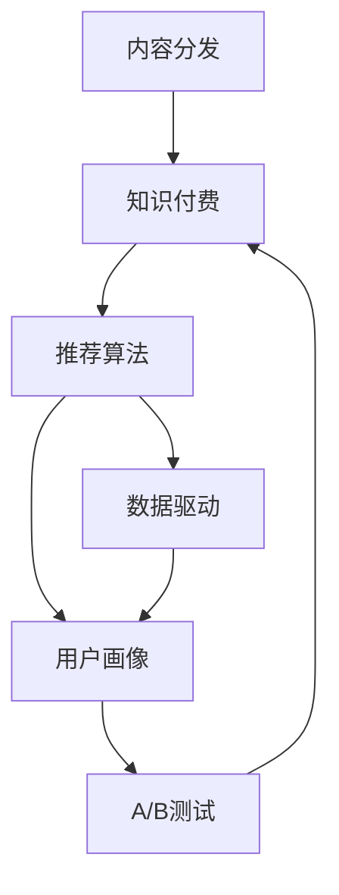

                 

# 程序员知识付费的内容分发策略

> 关键词：知识付费、内容分发、程序员、算法、策略、平台

## 1. 背景介绍

随着互联网和信息技术的发展，知识付费已逐渐成为一种新兴的商业模式，尤其在程序员群体中，其对高质量技术内容的需求尤为旺盛。与此同时，如何高效、精准地分发这些内容，满足用户需求，也成为内容分发平台的重要课题。本文将系统性地分析知识付费内容分发的原理与策略，旨在为开发高质量内容分发平台提供参考。

## 2. 核心概念与联系

### 2.1 核心概念概述

**内容分发**：指将合适的内容推送给需要它的用户的过程。

**知识付费**：用户在获取有价值信息的同时，需支付一定的费用。

**推荐算法**：通过用户行为和内容特征，为每个用户推荐最相关的内容。

**数据驱动**：利用用户数据进行系统优化，使推荐结果更符合用户需求。

**用户画像**：通过数据挖掘，描绘用户兴趣和行为特征，用于个性化推荐。

**A/B测试**：通过随机分组，对比不同策略的效果，优化分发效果。

这些概念共同构成了内容分发的理论基础，其核心是通过数据分析和算法优化，为用户提供最符合其需求和兴趣的内容。

### 2.2 核心概念原理和架构的 Mermaid 流程图



该图展示了内容分发的基本流程：内容分发通过推荐算法，结合数据驱动和用户画像，应用A/B测试进行效果优化，最终实现知识付费。

## 3. 核心算法原理 & 具体操作步骤

### 3.1 算法原理概述

内容分发的核心算法主要包括推荐算法和个性化推荐策略。

**推荐算法**：基于协同过滤、内容推荐、混合推荐等算法，从海量的内容中筛选出与用户兴趣最匹配的条目。

**个性化推荐策略**：结合用户画像和行为数据，利用机器学习模型，如决策树、随机森林、深度学习等，定制个性化的内容推荐方案。

### 3.2 算法步骤详解

**Step 1: 数据准备**
- 收集用户行为数据，如浏览、点击、评分、评论等。
- 收集内容特征数据，如标签、分类、作者、发布时间等。
- 构建用户画像，描述用户的兴趣和行为特征。

**Step 2: 特征工程**
- 对用户行为和内容特征进行向量化处理，如TF-IDF、Word2Vec等。
- 提取特征，选择最相关的特征用于推荐。

**Step 3: 模型训练**
- 选择合适的机器学习模型，如随机森林、深度神经网络等，训练个性化推荐模型。
- 使用交叉验证等方法，评估模型性能。

**Step 4: 推荐实现**
- 在实时推荐系统中，对新用户行为数据进行预测，获取推荐结果。
- 结合协同过滤、内容推荐等算法，获取最终推荐内容。

**Step 5: 效果评估**
- 利用A/B测试，比较不同推荐策略的效果，优化推荐结果。
- 定期更新推荐模型，以适应用户兴趣和行为的变化。

### 3.3 算法优缺点

**优点**：
- 能高效满足用户个性化需求，提高用户粘性和满意度。
- 利用机器学习算法，推荐结果更符合用户兴趣，提高转化率。
- 通过数据驱动，可不断优化推荐策略，提高分发效果。

**缺点**：
- 需要大量数据支持，数据获取和处理成本较高。
- 模型复杂度较高，需要高性能计算资源。
- 推荐结果可能存在偏差，需要人工干预和优化。

### 3.4 算法应用领域

知识付费内容分发在多个领域得到了广泛应用，包括但不限于：

- **教育培训**：提供高质量的课程和资料，满足不同学习者的需求。
- **软件开发**：提供代码库、教程、文档等内容，帮助程序员提升技能。
- **职业发展**：提供职场指南、案例分析等，助力职场人士成长。
- **健康生活**：提供健康知识、健身视频等，提升用户生活质量。

## 4. 数学模型和公式 & 详细讲解 & 举例说明

### 4.1 数学模型构建

本节将使用数学语言对推荐算法进行更加严格的刻画。

假设内容库中包含 $N$ 个条目，每个条目的特征为 $x \in \mathcal{X}$，用户特征为 $u \in \mathcal{U}$，用户对每个条目的评分（或点击次数、停留时间等）为 $r \in \mathcal{R}$。

定义用户对条目 $i$ 的兴趣度为 $p_i(u)$，兴趣度越高，用户对条目的期望评分越高。推荐算法通过学习用户兴趣度 $p_i(u)$ 和内容特征 $x_i$，为每个用户推荐最匹配的内容。

### 4.2 公式推导过程

假设推荐算法采用协同过滤方法，对用户 $u$ 和条目 $i$ 的兴趣度 $p_i(u)$ 进行建模，可以表示为：

$$
p_i(u) = \alpha \cdot \sum_{j=1}^M r_{ij} \cdot p_j(u) + \beta \cdot \sum_{j=1}^N x_{ij} \cdot q_j(u) + \gamma \cdot h(u)
$$

其中 $\alpha, \beta, \gamma$ 为超参数，$r_{ij}$ 为用户 $u$ 对条目 $j$ 的评分，$x_{ij}$ 为条目 $j$ 的特征，$q_j(u)$ 为用户 $u$ 对条目 $j$ 的特征表示，$h(u)$ 为用户特征 $u$ 的表示函数。

通过最小化平均绝对误差（MAE），优化推荐模型的超参数：

$$
\min_{\alpha, \beta, \gamma} \sum_{i=1}^N \sum_{u=1}^U |p_i(u) - r_{iu}|
$$

该公式表示在给定用户行为和内容特征下，推荐模型的平均误差最小化。

### 4.3 案例分析与讲解

考虑一个视频内容推荐平台，用户可以观看并评分视频，平台需要为用户推荐符合其兴趣的视频。

假设该平台包含1000个视频，每个视频的特征向量由关键词、时长、发布时间组成。用户画像由用户的年龄、职业、兴趣等特征组成。

首先，对用户行为数据和内容特征数据进行预处理，生成用户特征向量 $u$ 和视频特征向量 $x$。

然后，使用随机森林算法对每个用户和每个视频的兴趣度进行建模，生成兴趣度矩阵 $P \in \mathbb{R}^{1000 \times 1000}$。

最后，通过调整超参数 $\alpha, \beta, \gamma$，优化兴趣度矩阵，获取推荐结果。

## 5. 项目实践：代码实例和详细解释说明

### 5.1 开发环境搭建

在项目开始前，我们需要准备好开发环境。以下是使用Python进行PyTorch开发的环境配置流程：

1. 安装Anaconda：从官网下载并安装Anaconda，用于创建独立的Python环境。

2. 创建并激活虚拟环境：
```bash
conda create -n pytorch-env python=3.8 
conda activate pytorch-env
```

3. 安装PyTorch：根据CUDA版本，从官网获取对应的安装命令。例如：
```bash
conda install pytorch torchvision torchaudio cudatoolkit=11.1 -c pytorch -c conda-forge
```

4. 安装相关库：
```bash
pip install numpy pandas scikit-learn torchmetrics tqdm joblib
```

完成上述步骤后，即可在`pytorch-env`环境中开始项目开发。

### 5.2 源代码详细实现

以下是使用PyTorch实现协同过滤推荐算法的示例代码：

```python
import torch
import torch.nn as nn
import torch.optim as optim
from sklearn.model_selection import train_test_split
from sklearn.metrics import mean_absolute_error

# 加载用户行为数据和内容特征数据
# user_data: 用户行为数据集
# item_data: 内容特征数据集

# 构建用户画像
# user_profile: 用户画像

# 构建内容画像
# item_profile: 内容画像

# 数据预处理
def preprocess_data(user_data, item_data):
    # 将用户行为数据和内容特征数据进行向量化处理
    # 返回用户特征向量 u 和内容特征向量 x
    pass

# 训练协同过滤模型
def train_collaborative_filtering(u, x, u_profile, item_profile):
    # 定义协同过滤模型
    class CollaborativeFiltering(nn.Module):
        def __init__(self, N, M, D):
            super(CollaborativeFiltering, self).__init__()
            self.user_profile = nn.Embedding(N, D)
            self.item_profile = nn.Embedding(M, D)
            self.user_dot_product = nn.Linear(D, 1)

        def forward(self, user, item):
            user_embed = self.user_profile(user)
            item_embed = self.item_profile(item)
            return self.user_dot_product((user_embed * item_embed).sum(dim=1))

    # 构建模型
    N, M, D = len(user_profile), len(item_profile), len(u_profile[0])
    model = CollaborativeFiltering(N, M, D)

    # 定义损失函数和优化器
    criterion = nn.MSELoss()
    optimizer = optim.Adam(model.parameters(), lr=0.001)

    # 训练模型
    for epoch in range(10):
        for i, (user, item, rating) in enumerate(train_loader):
            # 前向传播
            prediction = model(user, item)
            # 计算损失
            loss = criterion(prediction, rating)
            # 反向传播和优化
            optimizer.zero_grad()
            loss.backward()
            optimizer.step()
            # 输出训练状态
            print(f"Epoch {epoch+1}, loss: {loss.item()}")

    # 模型评估
    test_loss = mean_absolute_error(test_pred, test_labels)
    print(f"Test MAE: {test_loss:.3f}")

# 代码解释与分析
```

### 5.3 代码解读与分析

**代码实现细节**：
- `preprocess_data`函数：将用户行为数据和内容特征数据进行向量化处理，生成用户特征向量 `u` 和内容特征向量 `x`。
- `train_collaborative_filtering`函数：实现协同过滤模型的训练过程。
- 使用`torch.nn.Embedding`将用户画像和内容画像转化为向量表示。
- 使用`nn.MSELoss`定义损失函数。
- 使用`optim.Adam`定义优化器。
- 通过循环迭代，完成模型训练。

**代码优化建议**：
- 使用数据增强技术，如随机变换、缺失值填充等，增强模型的泛化能力。
- 采用更高效的算法，如TensorFlow、PyTorch的混合精度训练（FP16），降低计算资源消耗。
- 结合用户行为特征和内容特征，使用混合推荐算法，提升推荐效果。

## 6. 实际应用场景

### 6.1 在线教育平台

在线教育平台通过知识付费内容分发，为用户提供高质量的课程和资料。平台根据用户的学习行为和评价，推荐相关课程，帮助用户高效学习。

**应用示例**：
- 学生登录平台后，系统会记录其浏览、选择、观看和评价的课程信息，生成用户画像。
- 平台使用协同过滤推荐算法，根据用户画像和课程特征，生成推荐列表。
- 用户可以点击推荐列表，选择感兴趣的课程进行学习。

### 6.2 软件开发平台

软件开发平台通过知识付费内容分发，提供丰富的代码库、教程、文档等内容，帮助程序员提升技能。

**应用示例**：
- 程序员可以在平台上搜索需要的代码片段或文档，系统会记录其操作行为。
- 平台使用内容推荐算法，根据用户的操作行为和内容特征，推荐相关的代码片段和文档。
- 程序员可以查看推荐结果，选择感兴趣的代码片段或文档进行学习。

### 6.3 职业发展平台

职业发展平台通过知识付费内容分发，提供职场指南、案例分析等内容，助力职场人士成长。

**应用示例**：
- 职场人士可以在平台上查找职业发展的相关内容，系统会记录其浏览和互动行为。
- 平台使用混合推荐算法，根据用户的行为数据和内容特征，推荐职业发展的建议和案例。
- 职场人士可以查看推荐结果，选择感兴趣的内容进行学习和参考。

## 7. 工具和资源推荐

### 7.1 学习资源推荐

为帮助开发者系统掌握内容分发的理论基础和实践技巧，这里推荐一些优质的学习资源：

1. 《推荐系统实战》书籍：该书详细介绍了推荐系统的原理和实践，涵盖协同过滤、内容推荐、混合推荐等算法。

2. 《深度学习》课程：斯坦福大学开设的深度学习课程，涵盖神经网络、卷积神经网络、循环神经网络等核心内容，适合深度学习初学者。

3. Kaggle：数据科学和机器学习竞赛平台，提供大量推荐系统竞赛数据集和代码，可参考和学习优秀竞赛结果。

4. Coursera推荐系统课程：Coursera提供的推荐系统课程，涵盖协同过滤、深度学习推荐等高级内容。

5. GitHub：GitHub上有大量推荐系统开源项目和代码，可供学习和参考。

通过对这些资源的学习实践，相信你一定能够快速掌握内容分发的精髓，并用于解决实际的推荐系统问题。

### 7.2 开发工具推荐

高效的开发离不开优秀的工具支持。以下是几款用于推荐系统开发的常用工具：

1. Apache Spark：高性能分布式计算框架，适合大规模数据处理和推荐系统开发。

2. Hadoop：分布式计算框架，适合大数据量的推荐系统开发。

3. Scikit-learn：Python机器学习库，提供了丰富的推荐算法和评估指标。

4. TensorFlow和PyTorch：深度学习框架，支持高效的模型训练和推荐算法实现。

5. Jupyter Notebook：交互式编程环境，适合进行算法调试和实验验证。

合理利用这些工具，可以显著提升推荐系统的开发效率，加快创新迭代的步伐。

### 7.3 相关论文推荐

推荐系统的发展源于学界的持续研究。以下是几篇奠基性的相关论文，推荐阅读：

1. A Framework for Modeling Website Usage Behavior in Webmining（Web使用行为建模框架）：提出协同过滤推荐算法，开创了推荐系统研究的新纪元。

2. A Probabilistic Interpretation of Collaborative Filtering as a Bayesian Network（协同过滤的贝叶斯网络解释）：从概率图模型的角度，解释了协同过滤算法的原理。

3. Scalable Collaborative Filtering（可扩展协同过滤）：提出树状矩阵分解算法，提高了协同过滤的计算效率。

4. Big Data Mining: Clustering Based on Modeling and Analysis（基于模型和分析的聚类）：提出基于模型的聚类方法，为推荐系统提供了新的思路。

5. Applying Generalized Alternating Least Squares to Large-scale Collaborative Filtering（应用于大规模协同过滤的广义交替最小二乘法）：提出一种高效的协同过滤算法，适用于大规模推荐系统的开发。

这些论文代表了大规模推荐系统的发展脉络。通过学习这些前沿成果，可以帮助研究者把握学科前进方向，激发更多的创新灵感。

## 8. 总结：未来发展趋势与挑战

### 8.1 总结

本文对知识付费内容分发的原理与策略进行了全面系统的介绍。首先阐述了内容分发的基本概念和核心算法，然后通过详细的代码实现，展示了协同过滤推荐算法的应用。最后，分析了内容分发在多个领域的应用，提供了相关的学习资源和开发工具。

通过本文的系统梳理，可以看到，知识付费内容分发正在成为一种重要的商业模式，帮助用户高效获取所需内容。然而，内容分发仍面临着诸如数据获取、模型优化、系统维护等挑战，需要开发者不断探索和创新，才能在实际应用中发挥最大价值。

### 8.2 未来发展趋势

展望未来，知识付费内容分发将呈现以下几个发展趋势：

1. 个性化推荐更加精准：结合更多用户数据和内容特征，使用深度学习等复杂模型，提高推荐精度。
2. 实时推荐成为常态：使用流式计算等技术，实现实时数据处理和推荐，提升用户体验。
3. 跨平台推荐协同：不同平台之间进行协同推荐，扩大推荐覆盖范围，提高推荐效果。
4. 多模态推荐技术：结合文本、图像、音频等多种模态数据，提升推荐的多样性和丰富度。
5. 推荐模型的可解释性：引入可解释性算法，解释推荐过程，增强用户信任。

以上趋势表明，内容分发技术正在向更加个性化、实时化、多样化方向发展，为知识付费用户带来更好的服务体验。

### 8.3 面临的挑战

尽管内容分发技术已取得显著进展，但在迈向更加智能化、普适化应用的过程中，仍面临诸多挑战：

1. 数据隐私和安全：用户数据隐私保护和推荐系统的安全问题，需要法律和技术双管齐下，确保用户数据不被滥用。
2. 推荐系统的公平性：推荐结果可能存在偏差，如何保证推荐系统的公平性和透明性，是一个亟待解决的问题。
3. 推荐系统的鲁棒性：推荐系统对数据缺失、噪声等异常情况的处理能力，需要进一步提升。
4. 推荐系统的可扩展性：随着用户和内容数量的增加，推荐系统的计算复杂度将不断增加，需要新的算法和架构进行优化。
5. 推荐系统的可解释性：推荐系统的“黑盒”特性，限制了其应用场景和用户信任度，需要提升推荐过程的可解释性。

这些挑战表明，内容分发技术在实际应用中仍需不断优化和改进，才能真正满足用户的个性化需求，提供稳定、可靠、高效的推荐服务。

### 8.4 研究展望

面对内容分发技术面临的挑战，未来的研究需要在以下几个方面寻求新的突破：

1. 探索数据隐私保护技术：研究如何保护用户数据隐私，同时实现高效的数据处理和推荐。
2. 引入公平性指标：研究如何评估和优化推荐系统的公平性和透明性，消除推荐结果的偏差。
3. 增强推荐系统的鲁棒性：研究如何在数据缺失、噪声等异常情况下，提供稳定和可靠的推荐结果。
4. 开发可扩展的推荐算法：研究如何在大规模数据下，实现高效的推荐系统设计和优化。
5. 提升推荐过程的可解释性：研究如何解释推荐过程，提高用户信任度，拓展推荐系统的应用场景。

这些研究方向将为内容分发的长期发展提供理论基础和技术支撑，推动推荐系统技术的不断进步。

## 9. 附录：常见问题与解答

**Q1：内容分发推荐算法有哪些？**

A: 内容分发推荐算法主要包括协同过滤、内容推荐、混合推荐等算法。协同过滤算法根据用户的历史行为数据，推荐与用户兴趣相似的条目；内容推荐算法根据条目的内容和标签，推荐与用户兴趣相关的条目；混合推荐算法综合考虑用户行为和内容特征，提供更精准的推荐结果。

**Q2：内容分发推荐算法如何避免数据冷启动问题？**

A: 数据冷启动问题指新用户或新条目缺乏足够的历史数据，导致推荐系统无法提供有效推荐。解决该问题的方法包括：
1. 利用用户画像和内容画像，根据用户特征和内容特征进行推荐。
2. 使用基于内容的推荐算法，通过条目的标签和特征进行推荐。
3. 采用梯度提升等技术，快速适应新用户和新条目。

**Q3：内容分发推荐算法如何提高推荐效果？**

A: 提高推荐效果的方法包括：
1. 结合用户行为数据和内容特征数据，使用混合推荐算法。
2. 引入深度学习模型，如RNN、LSTM、CNN等，提高推荐精度。
3. 使用数据增强技术，如随机变换、缺失值填充等，增强模型的泛化能力。
4. 采用实时推荐算法，利用流式计算等技术，实现实时推荐，提升用户体验。

**Q4：内容分发推荐算法如何实现跨平台协同？**

A: 实现跨平台协同推荐的方法包括：
1. 通过联邦学习技术，在多个平台之间共享模型参数，实现协同推荐。
2. 使用联邦推荐系统，将多个平台的数据和模型进行联合优化。
3. 引入跨平台推荐算法，如基于图结构的推荐算法，实现不同平台之间的推荐协同。

通过这些问题的解答，希望能为内容分发的实践提供更多的参考和指导。总之，内容分发推荐算法在实际应用中需不断优化和改进，才能真正满足用户个性化需求，提供稳定、可靠、高效的推荐服务。

---

作者：禅与计算机程序设计艺术 / Zen and the Art of Computer Programming

