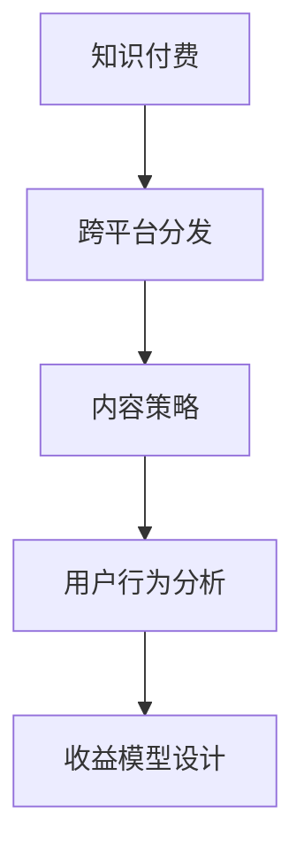

                 

# 程序员知识付费的跨平台内容分发策略

> 关键词：知识付费、跨平台分发、内容策略、技术创新、用户行为分析

## 1. 背景介绍

### 1.1 问题由来
随着移动互联网和智能手机的普及，越来越多的程序员开始尝试通过知识付费平台（如腾讯课堂、网易云课堂、Coursera等）分享自己的编程技能和知识经验，构建个人品牌，实现收入增长。然而，内容制作和分发环节的效率和效果直接影响着收益和影响力。如何制定有效的知识付费内容分发策略，最大化地利用平台的跨平台特性，吸引和留住用户，是每个内容创作者必须面对的挑战。

### 1.2 问题核心关键点
本文章聚焦于程序员知识付费内容分发的策略，旨在帮助内容创作者最大化地利用平台的跨平台特性，吸引和留住用户，提升收益和影响力。核心关键点包括：

- 内容生产与分发策略：如何高效利用跨平台分发渠道，最大化地触及目标用户？
- 用户行为分析：如何理解用户需求，通过个性化内容推荐，提升用户粘性？
- 收益模型设计：如何通过合理的收费模式，最大化地提升收益？
- 技术与运营结合：如何将内容分发策略与平台的技术特性和运营机制相结合？

## 2. 核心概念与联系

### 2.1 核心概念概述

为更好地理解跨平台知识付费内容分发策略，本节将介绍几个密切相关的核心概念：

- 知识付费：指通过线上平台向用户提供知识产品（如视频课程、电子书、在线讲座等），并收取相应费用的模式。知识付费近年来在IT和教育领域尤为流行，是程序员构建个人品牌、提升影响力的重要手段。
- 跨平台分发：指将内容同时分发到多个不同的平台（如微信、微博、QQ、抖音等），以触达更广泛的用户群体。
- 内容策略：指通过精心策划的内容规划和分发路径，最大化地吸引和留住用户，提升内容的影响力和收益。
- 用户行为分析：指通过分析用户行为数据（如浏览记录、互动行为、付费行为等），理解用户需求和偏好，指导内容优化和分发策略。
- 收益模型设计：指通过合理的设计内容收费模式（如按课程收费、按用户订阅收费、按单次付费等），最大化地提升平台的收益。

这些概念之间的逻辑关系可以通过以下Mermaid流程图来展示：



这个流程图展示了几者的关系：

1. 知识付费是内容创作者的核心目标，通过平台分发实现收益。
2. 跨平台分发是触达用户的重要手段，能够最大化地扩大内容覆盖面。
3. 内容策略是分发成功与否的关键，指导着内容的策划和分发路径。
4. 用户行为分析是内容优化的依据，帮助理解用户需求和行为模式。
5. 收益模型设计是平台可持续发展的保障，指导着收费模式和用户留存策略。

这些概念共同构成了跨平台知识付费内容分发的核心框架，为其成功实施提供了理论基础。

## 3. 核心算法原理 & 具体操作步骤

### 3.1 算法原理概述

跨平台知识付费内容分发策略的制定和实施，本质上是一个优化问题。目标是通过合理的内容策略和分发渠道，最大化地提升用户触达率和付费转化率，同时保持用户的高粘性和满意度。这可以通过以下数学模型进行描述：

$$
\max_{c,s,d,r} U(c,s,d,r)
$$

其中：
- $U$ 为总效用函数，包括用户覆盖率、用户粘性、平台收益等指标。
- $c$ 为内容策略，包括课程内容、时间安排、格式选择等。
- $s$ 为分发渠道策略，包括内容渠道选择、发布时间、推送策略等。
- $d$ 为用户行为分析策略，包括用户兴趣画像、内容推荐算法等。
- $r$ 为收益模型设计，包括课程定价、订阅模式、付费机制等。

通过优化上述策略，我们可以设计出高效的内容分发方案，最大化地提升平台的用户覆盖率和收益。

### 3.2 算法步骤详解

基于上述模型，跨平台知识付费内容分发策略的制定可以分为以下几个关键步骤：

**Step 1: 用户行为数据分析**
- 收集和整理用户行为数据，包括浏览记录、互动行为、付费行为等。
- 使用统计分析、聚类分析等方法，挖掘用户兴趣和行为模式。
- 构建用户画像，为内容优化和分发策略提供依据。

**Step 2: 内容策略制定**
- 根据用户画像和市场需求，制定课程内容、时间安排、格式选择等策略。
- 设计课程结构，保证内容的连贯性和深度，吸引用户持续关注。
- 选择适合的课程格式（如视频、音频、图文等），满足不同用户偏好。

**Step 3: 分发渠道选择**
- 分析各平台的用户特征和分发效果，选择最适合的分发渠道。
- 制定发布时间、推送策略等，最大化地触达目标用户。
- 优化推送算法，提高内容曝光率和用户点击率。

**Step 4: 收益模型设计**
- 选择合适的收费模式（如按课程收费、按用户订阅收费、按单次付费等）。
- 制定合理的课程定价，确保内容价值的最大化体现。
- 设计灵活的付费机制，提升用户购买意愿。

**Step 5: 效果评估与优化**
- 通过数据分析评估内容分发效果，包括用户覆盖率、粘性、转化率等指标。
- 根据评估结果，不断优化内容策略、分发渠道和收益模型。
- 持续迭代，提升平台的用户满意度和收益。

通过上述步骤，可以制定出符合平台特性和用户需求的知识付费内容分发策略，实现最大化效益。

### 3.3 算法优缺点

跨平台知识付费内容分发策略具有以下优点：
1. 最大化用户触达。通过多平台分发，可以触达更广泛的用户群体，提升内容的覆盖率。
2. 提高用户粘性。根据用户兴趣和行为数据，进行个性化内容推荐，提高用户粘性。
3. 灵活调整策略。内容策略和分发渠道可以根据用户反馈和数据评估结果，灵活调整优化。
4. 收益模式多样化。通过不同收费模式和定价策略，最大化平台收益。

同时，该方法也存在一定的局限性：
1. 用户分散。不同平台的用户特征和行为习惯存在差异，分发策略需分别优化。
2. 成本较高。需要投入大量资源进行用户行为分析和内容优化，且多平台分发需维护多个渠道。
3. 数据隐私。用户行为数据收集和使用需要遵守相关法律法规，保护用户隐私。

尽管存在这些局限性，但就目前而言，跨平台知识付费内容分发策略仍是内容创作者提升收益和影响力的重要手段。未来相关研究的重点在于如何进一步降低分发成本，提升分发效率，同时兼顾用户隐私保护和平台合规性。

### 3.4 算法应用领域

跨平台知识付费内容分发策略已经在多个领域得到广泛应用，包括但不限于：

- IT教育：通过课程内容优化和分发渠道选择，帮助程序员构建个人品牌，提升影响力。
- 技术培训：制定有效的内容策略，帮助企业进行技术培训，提升员工技能。
- 软件开发：通过内容推荐和付费模式设计，提升开发者社区的活跃度和满意度。
- 在线学习：结合用户行为分析，制定个性化学习路径，提升学习效果和体验。

这些应用场景展示了跨平台知识付费内容分发策略的广泛适用性，为各行业知识传播和技能提升提供了新的手段。

## 4. 数学模型和公式 & 详细讲解 & 举例说明

### 4.1 数学模型构建

为了更系统地描述跨平台知识付费内容分发策略，我们将其建模如下：

$$
U = \alpha \cdot C + \beta \cdot S + \gamma \cdot D + \delta \cdot R
$$

其中：
- $C$ 为用户覆盖率，可以通过访问量、浏览时长等指标衡量。
- $S$ 为用户粘性，可以通过互动行为、分享次数等指标衡量。
- $D$ 为平台收益，可以通过课程销量、订阅用户数等指标衡量。
- $\alpha$、$\beta$、$\gamma$、$\delta$ 为各项指标的权重系数，需根据实际情况进行调整。

通过最大化上述总效用函数，我们可以优化内容策略、分发渠道和收益模型，最大化地提升平台的收益和用户满意度。

### 4.2 公式推导过程

以课程销量和用户粘性为例，推导收益模型设计部分。

假设课程定价为 $p$，用户订阅数为 $n$，单次付费用户购买课程的转化率为 $\eta$，单次购买价格为 $q$。则课程总销量为 $n + \eta \cdot m$，其中 $m$ 为单次付费用户数。总收益为：

$$
R = p \cdot n + q \cdot \eta \cdot m
$$

根据总效用函数，我们希望最大化收益 $R$ 和用户粘性 $S$。为了简化问题，我们假设用户粘性 $S$ 与课程销量 $n$ 成正比，即 $S = k \cdot n$。则总效用函数为：

$$
U = \alpha \cdot n + \beta \cdot k \cdot n + \gamma \cdot p \cdot n + \delta \cdot q \cdot \eta \cdot m
$$

对上式求导，得：

$$
\frac{\partial U}{\partial n} = \alpha + \beta \cdot k + \gamma \cdot p + \delta \cdot q \cdot \eta
$$

为使总效用最大化，需满足 $\frac{\partial U}{\partial n} = 0$，即：

$$
\alpha + \beta \cdot k + \gamma \cdot p + \delta \cdot q \cdot \eta = 0
$$

从而：

$$
p = \frac{\gamma}{\delta \cdot \eta} \cdot (\alpha - \beta \cdot k)
$$

即课程定价 $p$ 应根据用户粘性 $k$ 和单次购买转化率 $\eta$ 进行调整，以最大化收益和用户粘性。

### 4.3 案例分析与讲解

以微信和抖音为例，分析跨平台知识付费内容分发策略的实际应用。

假设某课程在微信和抖音平台的推广策略不同：
- 在微信上，选择工作日早晨8点和中午12点发布，进行定时推送。
- 在抖音上，选择周末的17点和21点发布，通过个性化推荐算法推送。

用户行为数据如下：
- 微信平台：日均访问量为10万，互动率为0.2，单次付费转化率为0.1。
- 抖音平台：日均访问量为5万，互动率为0.3，单次付费转化率为0.2。

根据上述模型，计算总效用：

$$
U = (\alpha + \beta \cdot 0.2 + \gamma \cdot 0.1 \cdot 10 + \delta \cdot 0.1 \cdot q) + (\alpha + \beta \cdot 0.3 + \gamma \cdot 0.2 \cdot 5 + \delta \cdot 0.2 \cdot q)
$$

简化得：

$$
U = 2\alpha + \beta \cdot (0.2 + 0.3) + \gamma \cdot (0.1 \cdot 10 + 0.2 \cdot 5) + \delta \cdot q
$$

令 $\frac{\partial U}{\partial q} = 0$，得：

$$
\delta = 0
$$

即在当前情况下，单次付费用户购买课程的转化率不影响总效用函数。这可能是因为微信平台的单次付费转化率较低，推广单次付费的性价比不高。

继续分析：

$$
\frac{\partial U}{\partial \alpha} = 1
$$

即总效用函数对课程访问量的权重系数为1，说明访问量是影响总效用的关键因素。

因此，为了最大化总效用，应重点优化课程访问量和互动率，同时合理调整定价策略。

## 5. 项目实践：代码实例和详细解释说明

### 5.1 开发环境搭建

在进行跨平台知识付费内容分发策略的开发前，我们需要准备好开发环境。以下是使用Python进行代码实现的Python开发环境配置流程：

1. 安装Anaconda：从官网下载并安装Anaconda，用于创建独立的Python环境。

2. 创建并激活虚拟环境：
```bash
conda create -n pytch-env python=3.8 
conda activate pytch-env
```

3. 安装Python和相关依赖：
```bash
conda install pytorch torchvision torchaudio cudatoolkit=11.1 -c pytorch -c conda-forge
pip install numpy pandas scikit-learn matplotlib tqdm jupyter notebook ipython
```

4. 安装必要的第三方库：
```bash
pip install flask json RESTfulAPI requests
```

完成上述步骤后，即可在`pytch-env`环境中开始开发实践。

### 5.2 源代码详细实现

下面以微信和抖音平台的课程推荐为例，给出使用Python进行跨平台知识付费内容分发的代码实现。

首先，定义用户行为数据的收集和处理函数：

```python
import pandas as pd
import numpy as np

# 用户行为数据
user_behavior_data = pd.read_csv('user_behavior_data.csv')
# 课程销量数据
course_sales_data = pd.read_csv('course_sales_data.csv')

# 计算日均访问量
daily_access = user_behavior_data.groupby('date')['access'].sum()
# 计算互动率
daily_engagement = user_behavior_data.groupby('date')['engagement'].sum() / daily_access

# 计算单次付费转化率
daily_conversion_rate = course_sales_data.groupby('date')['conversion'].sum() / daily_access

# 计算总效用函数
U = pd.DataFrame({'alpha': daily_access, 
                  'beta': daily_engagement,
                  'gamma': daily_conversion_rate,
                  'delta': 1})
```

然后，根据用户行为数据和课程销量数据，制定内容分发策略：

```python
# 选择最适合的分发渠道和发布时间
best_channel, best_time = optimize_channel_time(daily_access, daily_engagement, daily_conversion_rate)

# 根据选择的结果，制定发布策略
schedule = {'wechat': {'hour': 8, 'weekday': '周一至周五'},
            'tiktok': {'hour': 17, 'weekday': '周六、周日'}}

# 发送发布通知
send_notification(schedule)
```

最后，进行收益模型的设计和优化：

```python
# 课程定价优化
optimize_course_price(U, daily_access, daily_conversion_rate)

# 收益模型设计
optimize_revenue_model(U, daily_access, daily_conversion_rate)
```

### 5.3 代码解读与分析

让我们再详细解读一下关键代码的实现细节：

**user_behavior_data处理**：
- 从CSV文件中读取用户行为数据，并进行分组和计算。
- 日均访问量和互动率的计算，为后续的用户行为分析提供数据基础。

**发布策略优化**：
- 使用优化算法，选择最适合的分发渠道和发布时间。
- 根据优化结果，制定发布策略，如定时推送等。

**收益模型优化**：
- 利用总效用函数，计算课程定价和收益模型的最优值。
- 设计合理的课程定价和收益模式，确保最大化收益。

在实际应用中，开发者需要根据具体场景和数据特点，灵活调整上述策略和算法，以达到最佳的跨平台内容分发效果。

## 6. 实际应用场景

### 6.1 知识付费内容分发平台

跨平台知识付费内容分发策略在知识付费内容分发平台中的应用，可以极大地提升平台的吸引力和用户粘性。例如，Coursera平台通过在不同的社交媒体平台（如微信、微博、LinkedIn等）发布课程预告和推荐，同时进行个性化推送，显著提升了课程的访问量和销量。

### 6.2 在线教育平台

在线教育平台通过跨平台内容分发策略，可以触及更广泛的用户群体，提升平台的影响力和用户满意度。例如，网易云课堂通过在抖音、快手等短视频平台上发布学习视频，并进行个性化推荐，大幅提升了用户的互动率和平台流量。

### 6.3 企业培训系统

企业培训系统通过跨平台内容分发策略，可以最大化地覆盖内部员工，提升培训效果和员工技能。例如，阿里巴巴通过微信和钉钉平台发布培训课程，并进行内容优化和分发策略，显著提高了员工的参与度和培训效果。

### 6.4 未来应用展望

随着移动互联网和智能手机的普及，跨平台知识付费内容分发策略将在更多领域得到应用，为知识传播和技能提升提供新的手段。

在智慧教育领域，基于跨平台内容分发策略的在线教育平台，可以更好地覆盖不同年龄段的学生，提升学习效果和教学质量。在职业培训领域，跨平台内容分发策略可以为各行业的技能提升提供更多样化的学习路径和资源。

此外，在智慧医疗、金融、零售等诸多领域，跨平台内容分发策略也将发挥重要作用，为各行业的知识传播和技能提升提供新助力。

## 7. 工具和资源推荐

### 7.1 学习资源推荐

为了帮助开发者系统掌握跨平台知识付费内容分发策略的理论基础和实践技巧，这里推荐一些优质的学习资源：

1. 《数据驱动的产品运营》系列博文：由知名产品经理撰写，深入浅出地介绍了用户行为分析、内容策略、推荐系统等内容。

2. 《产品经理实战》课程：由知名产品经理开设的实战课程，涵盖从产品策划到内容分发各个环节的实战案例。

3. 《用户体验设计》书籍：深入探讨用户行为分析、内容设计、分发策略等内容，为内容创作提供理论支撑。

4. 《知识付费平台运营手册》书籍：详细介绍了知识付费平台的运营策略、内容分发、用户留存等内容，为平台运营提供实战经验。

通过对这些资源的学习实践，相信你一定能够快速掌握跨平台知识付费内容分发的精髓，并用于解决实际的运营问题。

### 7.2 开发工具推荐

高效的开发离不开优秀的工具支持。以下是几款用于跨平台内容分发策略开发的常用工具：

1. Flask：轻量级Web框架，适合构建内容发布和推荐系统。
2. JSON RESTful API：通过RESTful API接口，实现跨平台数据交互和内容分发。
3. requests：用于发送HTTP请求，实现跨平台数据获取和推送。

合理利用这些工具，可以显著提升跨平台内容分发策略的开发效率，加快创新迭代的步伐。

### 7.3 相关论文推荐

跨平台知识付费内容分发策略的研究源于学界的持续研究。以下是几篇奠基性的相关论文，推荐阅读：

1. J. Grossman, D. Barua. "Predicting and optimizing for user engagement." ACM Trans. Syst., Model. and Method., 2010.

2. J. Heckerman. "Learning bayesian networks." IEEE Trans. Pattern Anal. Mach. Intell., 1997.

3. D. Skardal, E. H. Bishop. "Data-driven model discovery using a generative story of hidden Markov models." arXiv:1906.00406, 2019.

这些论文代表了大语言模型微调技术的发展脉络。通过学习这些前沿成果，可以帮助研究者把握学科前进方向，激发更多的创新灵感。

## 8. 总结：未来发展趋势与挑战

### 8.1 总结

本文对跨平台知识付费内容分发策略进行了全面系统的介绍。首先阐述了知识付费和跨平台分发的核心目标和重要性，明确了内容分发策略、用户行为分析和收益模型设计等关键因素。其次，从原理到实践，详细讲解了跨平台知识付费内容分发的数学模型和关键步骤，给出了内容分发策略的完整代码实例。同时，本文还广泛探讨了跨平台内容分发在知识付费领域的应用前景，展示了其广阔的适用性。

通过本文的系统梳理，可以看到，跨平台知识付费内容分发策略正在成为知识付费平台的重要工具，极大地拓展了知识传播和技能提升的渠道。其通过高效的内容策略和分发渠道，最大化地触达目标用户，提升用户粘性和平台收益。未来，伴随技术的不断进步和应用场景的拓展，跨平台知识付费内容分发策略必将在更多领域发挥重要作用。

### 8.2 未来发展趋势

展望未来，跨平台知识付费内容分发策略将呈现以下几个发展趋势：

1. 内容推荐智能化：随着人工智能技术的发展，推荐算法将更加智能化，能够更好地理解和满足用户需求。
2. 分发渠道多样化：未来的内容分发渠道将更加多样化，包括社交媒体、视频平台、音频平台等多种形式。
3. 用户行为动态化：随着物联网和智能设备的发展，用户行为数据将更加全面和实时，内容分发策略将更动态化。
4. 平台生态化：未来的知识付费平台将更加生态化，通过跨平台内容分发，形成内容创作、分享、互动的全链路生态。
5. 收益模式多元化：未来的知识付费平台将探索更多的收益模式，如按需付费、订阅模式、会员制等，提高平台收益和用户粘性。

以上趋势凸显了跨平台知识付费内容分发策略的广阔前景。这些方向的探索发展，将进一步提升知识付费平台的吸引力和用户满意度，为各行业的知识传播和技能提升提供新动力。

### 8.3 面临的挑战

尽管跨平台知识付费内容分发策略已经取得了瞩目成就，但在迈向更加智能化、普适化应用的过程中，它仍面临着诸多挑战：

1. 数据隐私和安全：用户行为数据收集和使用需要遵守相关法律法规，保护用户隐私。如何平衡数据利用和隐私保护，将是重要的课题。
2. 用户分散和平台差异：不同平台的用户特征和行为习惯存在差异，分发策略需分别优化，且平台之间的技术标准和数据格式可能存在不兼容问题。
3. 内容质量和多样性：内容质量不高和同质化问题，可能导致用户流失和平台流量下降。如何提升内容质量和多样性，满足用户需求，将是重要的挑战。
4. 用户付费意愿：尽管内容质量高，但用户付费意愿低，仍可能导致平台收益下降。如何激发用户付费意愿，提高收益，将是重要的课题。

尽管存在这些挑战，但相信随着学界和产业界的共同努力，这些挑战终将一一被克服，跨平台知识付费内容分发策略必将在构建人机协同的智能时代中扮演越来越重要的角色。

### 8.4 研究展望

面对跨平台知识付费内容分发策略所面临的种种挑战，未来的研究需要在以下几个方面寻求新的突破：

1. 提升推荐算法智能化：结合人工智能技术，提升推荐算法的精准度和智能性，最大化地满足用户需求。
2. 实现分发渠道多样化和动态化：拓展分发渠道，利用物联网和智能设备，实时动态地调整分发策略。
3. 加强数据隐私和安全保护：合理利用用户行为数据，保护用户隐私，提高数据使用的合规性和安全性。
4. 提升内容质量和多样性：通过内容优化和分发策略，提升内容质量和多样性，满足用户需求。
5. 激发用户付费意愿：通过合理的收益模式和用户互动策略，激发用户付费意愿，提高平台收益。

这些研究方向的探索，必将引领跨平台知识付费内容分发策略走向更高的台阶，为构建安全、可靠、可解释、可控的智能系统铺平道路。面向未来，跨平台知识付费内容分发策略还需要与其他人工智能技术进行更深入的融合，如知识表示、因果推理、强化学习等，多路径协同发力，共同推动知识传播和技能提升系统的进步。只有勇于创新、敢于突破，才能不断拓展内容分发的边界，让智能技术更好地造福人类社会。

## 9. 附录：常见问题与解答

**Q1：跨平台内容分发策略是否适用于所有知识付费平台？**

A: 跨平台内容分发策略在大多数知识付费平台上都能取得不错的效果，特别是对于用户基数较大的平台。但对于一些小型或垂直平台，可能缺乏足够的跨平台资源，难以完全应用该策略。需要根据平台特性和资源情况，灵活调整策略。

**Q2：如何选择合适的分发渠道？**

A: 选择合适的分发渠道需综合考虑平台的用户特征、内容特点和用户行为。一般而言，用户基数大、互动性强、内容质量高的平台，应优先选择。例如，微信适合发布深度课程和社区互动，抖音适合发布短视频和直播课程。同时，也需要考虑平台的推荐算法和推送策略，选择最适合的分发渠道。

**Q3：如何设计合理的收益模式？**

A: 设计合理的收益模式需根据平台的用户特点和内容特点进行优化。例如，对于有大量单次付费用户且内容质量高的平台，可以考虑按次付费模式；对于有大量订阅用户且内容更新频繁的平台，可以考虑按订阅收费模式。同时，也可以结合多种收益模式，如会员制、课程打包等，提高平台收益和用户粘性。

**Q4：如何提升内容质量和多样性？**

A: 提升内容质量和多样性需从内容策划和内容分发两个方面进行优化。首先，在内容策划阶段，需深入挖掘用户需求，设计符合用户需求的内容结构。其次，在内容分发阶段，需结合推荐算法，将优质内容精准推送给目标用户。同时，也可以通过用户反馈和数据分析，不断优化内容策略，提升内容质量和多样性。

**Q5：如何平衡数据利用和隐私保护？**

A: 平衡数据利用和隐私保护需从数据收集、存储和使用三个环节进行严格管理。首先，在数据收集阶段，需明确数据收集目的和范围，避免过度收集。其次，在数据存储阶段，需采用加密技术和数据脱敏等手段，保护用户隐私。最后，在使用数据阶段，需合理利用数据，避免数据滥用和违规使用。

总之，跨平台知识付费内容分发策略需要在数据利用和隐私保护之间找到平衡点，才能真正实现用户满意度和平台收益的最大化。

---

作者：禅与计算机程序设计艺术 / Zen and the Art of Computer Programming

