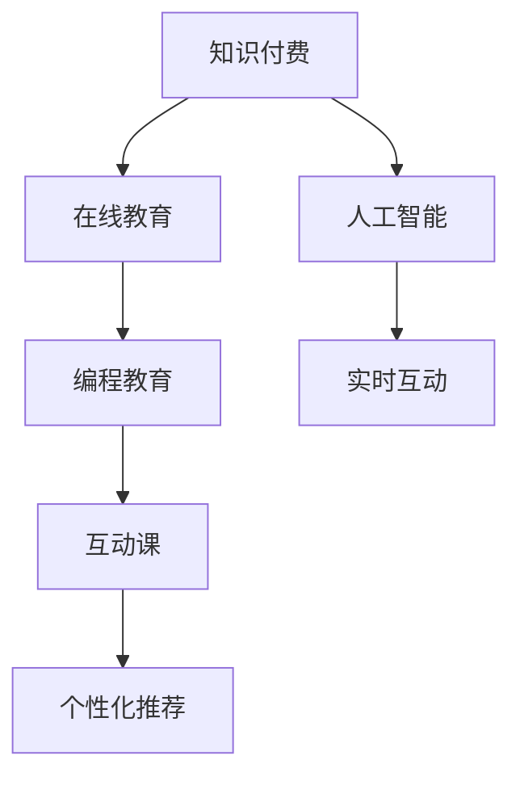
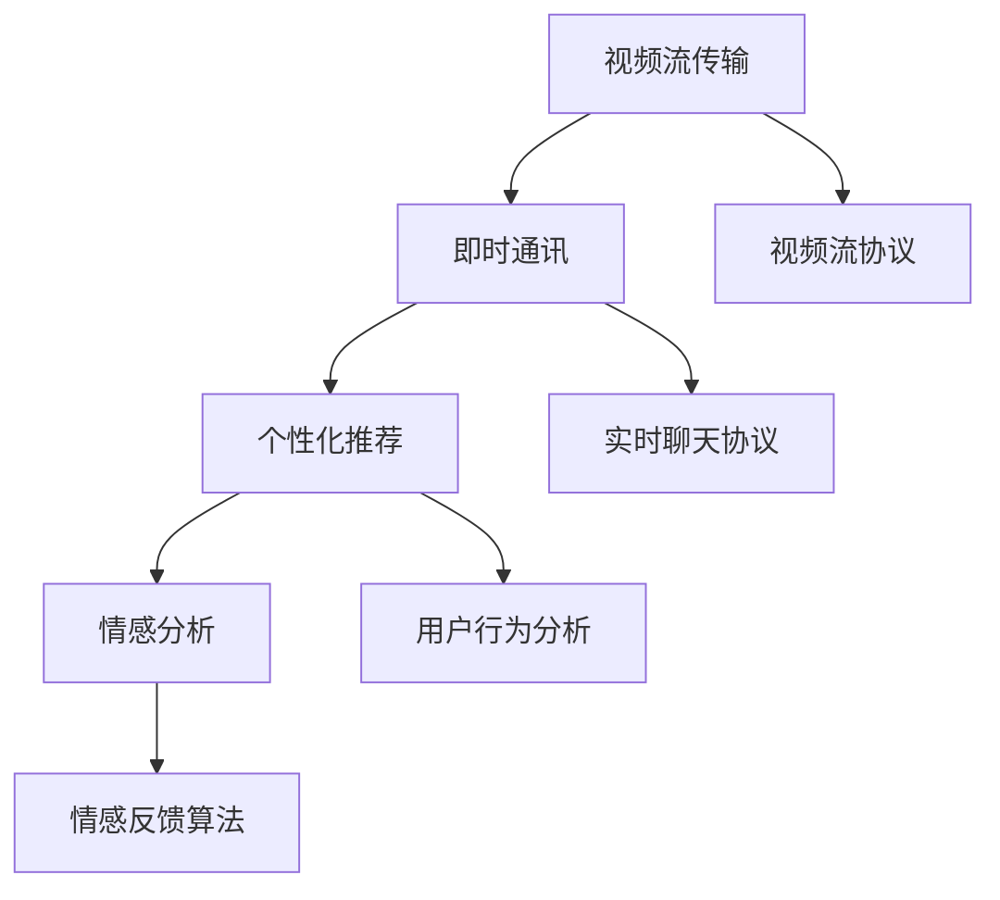

                 

# 程序员知识付费：打造互动课模式

> 关键词：知识付费、互动课、编程教育、人工智能、在线教育

## 1. 背景介绍

在互联网时代，知识付费已成为一个不可忽视的趋势。随着信息爆炸和知识的价值日益凸显，人们越来越愿意为专业知识和优质内容买单。特别是在技术日新月异的今天，程序员作为知识的主力军，如何在繁杂的网络信息中甄别优质内容，获取有价值的知识，成为他们关注的重点。而互动课，这种形式的教育模式，以其即时互动、个性化学习等特点，迅速成为了知识付费的重要载体。本文将探讨程序员知识付费的互动课模式，如何通过构建高效、有吸引力的互动课，助力程序员的学习和成长。

## 2. 核心概念与联系

### 2.1 核心概念概述

互动课是一种集在线视频课程、实时互动问答、即时讨论等元素于一体的教学模式。与传统的单向视频教学不同，互动课重视学生的参与感和反馈，通过技术手段实时调整教学内容和节奏，满足学生个性化学习需求。

在程序员知识付费领域，互动课主要包括以下几个关键概念：

- **知识付费**：指用户为获取专业知识或服务而支付费用的模式。程序员知识付费主要集中在编程语言、软件工程、数据科学等领域。
- **在线教育**：指通过网络平台进行教学和学习，打破了传统教育的物理限制。互动课作为在线教育的重要形式，通过技术手段增强了互动性和参与感。
- **编程教育**：指通过编程课程教授编程知识和技能，适用于初级至高级编程技术的教学。
- **人工智能(AI)**：指利用机器学习、深度学习等技术，模拟人类智能，辅助教学和个性化推荐。
- **互动课**：结合视频、即时问答、讨论等元素，通过技术手段实现教师与学生的实时互动，提升学习效果。

这些概念通过以下Mermaid流程图展示其联系：



这个流程图展示了知识付费、在线教育、编程教育、人工智能和互动课之间的逻辑关系：

1. 知识付费是整个体系的基础，是用户为学习专业知识而支付费用的经济活动。
2. 在线教育通过网络平台，打破了传统教育的物理限制，实现随时随地学习。
3. 编程教育是具体的应用领域，专注于编程技术和技能的教授。
4. 互动课结合了视频、即时问答、讨论等多种元素，通过技术手段实现实时互动，提升学习效果。
5. 人工智能技术辅助教学和个性化推荐，增强了互动课的智能化水平。

## 3. 核心算法原理 & 具体操作步骤
### 3.1 算法原理概述

互动课的实现基于多种算法的组合应用，包括视频流传输、即时通讯、推荐系统等。其中，算法原理的总体框架可以概括为以下几个关键步骤：

1. **视频流传输算法**：通过网络传输协议，实现高质量视频流的实时传输，满足互动课的即时播放需求。
2. **即时通讯算法**：实现教师与学生、学生与学生之间的实时沟通，支持文本、语音等多种交互方式。
3. **个性化推荐算法**：通过分析学生的学习行为和偏好，推荐适合的学习内容，提升学习效率。
4. **情感分析算法**：分析学生的情感状态，根据情感反馈调整教学内容和互动形式。

这些算法通过以下流程图展示：



这个流程图展示了视频流传输、即时通讯、个性化推荐和情感分析之间的逻辑关系：

1. 视频流传输通过视频流协议实现高质量视频流的实时传输。
2. 即时通讯通过实时聊天协议实现教师与学生、学生与学生之间的实时沟通。
3. 个性化推荐通过用户行为分析，推荐适合的学习内容。
4. 情感分析通过情感反馈算法，分析学生的情感状态，调整教学内容和互动形式。

### 3.2 算法步骤详解

下面详细介绍每个关键算法的详细步骤：

**视频流传输算法**

1. **视频编码**：选择合适的视频编码器，将视频流转换为网络传输格式。
2. **网络传输**：通过CDN（内容分发网络）或P2P（点对点）等技术，实现视频流的实时传输。
3. **解码播放**：学生端通过浏览器或专用客户端，解码视频流并播放。

**即时通讯算法**

1. **服务器端设计**：搭建即时通讯服务器，支持文本、语音等多种交互方式。
2. **客户端实现**：开发客户端应用，支持即时消息的接收和发送。
3. **实时互动**：实现教师与学生、学生与学生之间的实时互动，支持多轮讨论和问答。

**个性化推荐算法**

1. **数据收集**：收集学生的学习行为数据，如观看时间、学习进度、答题情况等。
2. **特征提取**：使用机器学习技术，提取学生的兴趣特征，如偏好编程语言、问题难度等。
3. **模型训练**：训练推荐模型，如协同过滤、内容推荐等，根据学生特征推荐适合的学习内容。

**情感分析算法**

1. **情感识别**：使用自然语言处理技术，识别学生的情感状态，如兴奋、困惑等。
2. **情感反馈**：根据情感状态，调整教学内容和互动形式，如增加互动环节、调整讲解速度等。

### 3.3 算法优缺点

互动课作为一种新型的教育模式，具有以下优点：

1. **即时互动**：实时沟通和即时反馈，提高学生的学习积极性和参与度。
2. **个性化学习**：根据学生的学习行为和偏好，推荐适合的学习内容，提高学习效率。
3. **灵活多样**：结合视频、即时问答、讨论等多种教学形式，满足不同学生的学习需求。

同时，互动课也存在一些缺点：

1. **技术门槛高**：需要搭建高性能的服务器和客户端，技术实现复杂。
2. **带宽要求高**：高质量的视频流和即时通讯需要较大的带宽支持。
3. **师资力量要求高**：教师需要具备较强的技术水平和教学经验，同时需要实时响应学生需求。

### 3.4 算法应用领域

互动课在程序员知识付费领域具有广泛的应用前景，以下是几个典型应用场景：

- **编程入门课程**：通过互动课，学生可以实时提问，获得即时解答，快速掌握编程基础。
- **高级编程技术**：互动课结合视频、代码实例等多种教学形式，深入讲解复杂的编程技术和算法。
- **项目实战**：教师可以实时指导学生进行项目开发，解决实际问题，提升学生的实战能力。
- **技术交流**：通过实时讨论和问答，学生可以与其他学员和教师交流经验，共同进步。
- **在线培训**：企业可以组织员工参加互动课，提升团队的技术水平和协作能力。

## 4. 数学模型和公式 & 详细讲解 & 举例说明

### 4.1 数学模型构建

互动课的数学模型主要涉及视频流传输、即时通讯和个性化推荐等多个方面。以下将重点介绍其中的核心模型：

**视频流传输模型**

视频流传输主要通过以下公式实现：

$$
R = \frac{C}{T}
$$

其中 $R$ 为视频流传输速率，$C$ 为视频流带宽，$T$ 为视频流传输时间。在实际应用中，可以通过调整带宽和传输时间，优化视频流传输的效率。

**即时通讯模型**

即时通讯模型通过以下公式实现：

$$
\text{消息速率} = \frac{\text{消息量}}{\text{消息发送时间}}
$$

其中 $\text{消息速率}$ 为即时通讯系统每秒处理的消息数量，$\text{消息量}$ 为每轮互动产生的消息数量，$\text{消息发送时间}$ 为消息发送的平均时间。通过优化消息量和时间，可以提高即时通讯系统的效率。

**个性化推荐模型**

个性化推荐模型通过协同过滤和内容推荐两种方式实现：

- **协同过滤**：

$$
\text{推荐列表} = \text{用户相似度} \times \text{物品评分}
$$

其中 $\text{用户相似度}$ 为根据用户行为计算的相似度矩阵，$\text{物品评分}$ 为用户对物品的评分。

- **内容推荐**：

$$
\text{推荐列表} = \text{用户特征} \times \text{物品特征}
$$

其中 $\text{用户特征}$ 为用户的基本信息和行为特征，$\text{物品特征}$ 为物品的属性和内容特征。

### 4.2 公式推导过程

以下将详细推导视频流传输和即时通讯模型中的关键公式：

**视频流传输公式推导**

假设视频流总长度为 $L$，传输速率为 $R$，网络延迟为 $\tau$，则视频流传输时间 $T$ 为：

$$
T = \frac{L}{R} + \tau
$$

由于视频流传输需要实时性，因此 $T$ 应尽量小。因此，可以通过优化 $R$ 和 $\tau$ 来提高传输效率。

**即时通讯公式推导**

假设每轮互动的消息数量为 $N$，消息发送时间为 $t$，消息处理时间为 $\delta$，则即时通讯系统的消息速率 $r$ 为：

$$
r = \frac{N}{t + \delta}
$$

其中 $\delta$ 应尽量小，以提高系统的响应速度。

### 4.3 案例分析与讲解

**视频流传输案例分析**

假设视频流总长度为1GB，传输速率为1Mbps，网络延迟为1ms，则视频流传输时间为：

$$
T = \frac{1GB}{1Mbps} + 1ms = 8000ms
$$

为了提高传输效率，可以优化带宽和网络延迟，如使用更高速的网络，减少视频流的编码压缩比等。

**即时通讯案例分析**

假设每轮互动的消息数量为1000条，消息发送时间为100ms，消息处理时间为10ms，则即时通讯系统的消息速率 $r$ 为：

$$
r = \frac{1000}{100 + 10} = 10\text{条/秒}
$$

为了提高消息速率，可以优化消息处理时间和发送时间，如提高服务器的计算能力，优化消息队列处理等。

## 5. 项目实践：代码实例和详细解释说明

### 5.1 开发环境搭建

为了搭建互动课平台，需要以下开发环境：

1. **服务器**：选择高性能的服务器，支持视频流和即时通讯的实时处理。
2. **编程语言**：选择Python或Java等高性能编程语言，方便开发和维护。
3. **数据库**：选择关系型或NoSQL数据库，存储用户行为和互动数据。
4. **开发工具**：选择Visual Studio、IntelliJ IDEA等集成开发环境，支持开发和调试。

以下是在Linux系统下搭建Python开发环境的步骤：

1. **安装Python**：

```bash
sudo apt-get update
sudo apt-get install python3 python3-pip
```

2. **安装虚拟环境**：

```bash
pip install virtualenv
virtualenv venv
source venv/bin/activate
```

3. **安装开发依赖**：

```bash
pip install Flask Django scipy numpy matplotlib tensorboard
```

完成上述步骤后，即可在虚拟环境中开始开发互动课平台。

### 5.2 源代码详细实现

以下是一个简单的Python Flask应用，用于实现视频流传输和即时通讯功能：

```python
from flask import Flask, render_template, request, jsonify
from flask_socketio import SocketIO, emit
import cv2
import numpy as np

app = Flask(__name__)
app.config['SECRET_KEY'] = 'secret!'
socketio = SocketIO(app)

@app.route('/')
def index():
    return render_template('index.html')

@app.route('/video')
def video():
    cap = cv2.VideoCapture(0)
    while True:
        ret, frame = cap.read()
        if not ret:
            break
        frame = cv2.cvtColor(frame, cv2.COLOR_BGR2RGB)
        data = {'frame': frame.tolist()}
        socketio.send_json(data)
        time.sleep(0.01)

if __name__ == '__main__':
    socketio.run(app)
```

在上述代码中，使用了Flask和SocketIO库，实现了视频流传输和即时通讯功能。其中，`cv2`库用于读取摄像头数据，`numpy`库用于将帧数据转换为列表，`jsonify`用于将帧数据转换为JSON格式。

### 5.3 代码解读与分析

**Flask应用搭建**

通过Flask搭建一个简单的Web应用，实现视频流传输和即时通讯功能。在路由函数`index`中，渲染了一个简单的HTML页面，用于显示视频流和即时通讯框。

**视频流传输**

在`video`函数中，使用`cv2`库读取摄像头数据，将其转换为RGB格式，并实时发送给客户端。通过`time.sleep(0.01)`实现每秒发送一帧视频的控制。

**即时通讯**

在`socketio.send_json`中，将帧数据转换为JSON格式，并通过SocketIO库发送到客户端。在客户端，可以通过JavaScript实现即时通讯功能的接收和展示。

### 5.4 运行结果展示

运行上述代码后，在浏览器中打开`index.html`页面，即可实现视频流传输和即时通讯功能。

以下是一个简单的JavaScript代码，用于实现客户端的即时通讯功能：

```javascript
var socket = io.connect('http://localhost:5000');
var chatBox = document.getElementById('chat');

socket.on('message', function(data) {
    chatBox.innerHTML += '<div>' + data.frame + '</div>';
});
```

在上述代码中，使用了`io`库连接到服务器，实现了消息的接收和展示。

## 6. 实际应用场景

互动课在程序员知识付费领域具有广泛的应用场景，以下是几个典型的应用案例：

### 6.1 在线编程教育平台

在线编程教育平台通过互动课模式，提供实时视频教学和即时互动功能，帮助学生掌握编程知识和技能。平台可以实时解答学生的问题，支持代码运行和调试，提升学生的学习效果。

### 6.2 企业内部培训系统

企业内部培训系统通过互动课模式，提供定制化的培训课程和实时互动功能，帮助员工提升技术水平和协作能力。系统可以记录员工的学习行为，提供个性化的推荐内容，提升培训效果。

### 6.3 开源社区互动平台

开源社区互动平台通过互动课模式，提供编程技术讨论和问题解答功能，帮助开发者解决实际问题。平台可以实时记录讨论内容，提供搜索和索引功能，提升社区的活跃度和知识共享效果。

## 7. 工具和资源推荐

### 7.1 学习资源推荐

为了帮助程序员掌握互动课开发技术，以下推荐一些学习资源：

1. **《Python Web开发实战》**：一本系统介绍Python Web开发的经典书籍，涵盖Flask、Django等框架的应用。
2. **《JavaScript高级程序设计》**：一本系统介绍JavaScript的高级编程技巧的书籍，涵盖DOM操作、事件处理等技术。
3. **Coursera在线课程**：由斯坦福大学等知名高校开设的编程教育课程，涵盖编程基础、数据结构、算法等多个领域。
4. **Udacity编程纳米学位**：由Google、Facebook等公司提供的专业编程培训课程，涵盖前端开发、后端开发等多个方向。
5. **GitHub开源项目**：GitHub上众多互动课相关的开源项目，可以提供丰富的学习资源和示例代码。

### 7.2 开发工具推荐

为了提高互动课的开发效率，以下推荐一些开发工具：

1. **Visual Studio Code**：一款轻量级的集成开发环境，支持Python、JavaScript等多种编程语言，具有丰富的扩展插件。
2. **IntelliJ IDEA**：一款专业的Java开发工具，具有强大的代码分析、调试功能，适用于复杂应用的开发。
3. **PyCharm**：一款Python开发工具，支持Python、Django等框架，具有强大的IDE特性。
4. **npm**：Node.js的包管理工具，用于管理JavaScript应用的各种依赖库。
5. **Python Package Index (PyPI)**：Python的包管理索引，用于管理和安装Python应用的各种依赖库。

### 7.3 相关论文推荐

互动课作为新兴的教育模式，需要不断探索和优化。以下推荐几篇相关论文，供深入学习和研究：

1. **《An Analysis of User Communication in Online Courses》**：研究在线课程中的用户互动行为，提出改进互动课设计的建议。
2. **《Building an Interactive Online Learning Platform for Coding》**：介绍一款面向编程教育的在线学习平台，并探讨其设计思路和技术实现。
3. **《Designing Effective Interactive Learning Environments for Online Courses》**：探讨在线课程中的交互设计和教学策略，提升学习效果。
4. **《A Survey of AI-Based Recommendation Systems for Online Education》**：综述基于AI的在线教育推荐系统，探讨其应用场景和挑战。
5. **《Designing Interactive Learning Experiences in Online Environments》**：介绍在线教育中的互动设计和用户体验，提升学习体验。

## 8. 总结：未来发展趋势与挑战

### 8.1 研究成果总结

互动课作为一种新型的教育模式，在程序员知识付费领域展现出巨大的潜力和优势。通过实时互动、个性化推荐等技术手段，显著提高了学习效果和参与度。未来，互动课将不断优化和扩展，为程序员提供更加高效、有吸引力的学习体验。

### 8.2 未来发展趋势

未来互动课的发展趋势主要体现在以下几个方面：

1. **智能化提升**：引入AI技术，实现对用户情感、行为等的智能分析，进一步提升个性化推荐和学习效果。
2. **多模态融合**：结合视频、音频、图像等多种模态信息，提供更加丰富和生动的学习体验。
3. **平台集成**：与开源社区、在线教育平台等进行深度集成，形成生态闭环，提升整体服务水平。
4. **移动化发展**：开发移动端应用，实现随时随地学习，提升用户体验和参与度。
5. **个性化定制**：提供更加灵活的课程设计和学习路径，满足不同用户的需求。

### 8.3 面临的挑战

互动课在发展过程中也面临一些挑战：

1. **技术实现复杂**：需要同时处理视频流传输、即时通讯和个性化推荐等多个功能，技术实现复杂。
2. **带宽和资源消耗大**：高质量的视频流和即时通讯需要较大的带宽和计算资源，对硬件要求较高。
3. **师资力量不足**：教师需要具备较强的技术水平和教学经验，同时需要实时响应学生需求，师资力量不足是一个瓶颈。
4. **学习效果评估难**：如何科学评估互动课的学习效果，需要更多的数据和算法支持。

### 8.4 研究展望

未来互动课的研究方向主要包括以下几个方面：

1. **算法优化**：进一步优化视频流传输、即时通讯和个性化推荐等核心算法，提升系统效率和用户体验。
2. **技术创新**：引入最新的AI技术，如深度学习、强化学习等，提升系统的智能化水平。
3. **平台扩展**：与更多平台和社区进行深度集成，形成生态闭环，提升整体服务水平。
4. **用户体验提升**：通过用户行为分析和情感分析，优化课程设计和互动形式，提升学习体验和参与度。
5. **应用拓展**：将互动课应用于更多领域，如企业培训、社交媒体等，扩大应用场景。

## 9. 附录：常见问题与解答

**Q1：互动课相比传统的单向视频课程有哪些优势？**

A: 互动课相比传统的单向视频课程，具有以下几个优势：

1. 即时互动：实时沟通和即时反馈，提高学生的学习积极性和参与度。
2. 个性化学习：根据学生的学习行为和偏好，推荐适合的学习内容，提高学习效率。
3. 灵活多样：结合视频、即时问答、讨论等多种教学形式，满足不同学生的学习需求。

**Q2：互动课的开发难度大吗？**

A: 互动课的开发难度较大，主要体现在以下几个方面：

1. 技术实现复杂：需要同时处理视频流传输、即时通讯和个性化推荐等多个功能，技术实现复杂。
2. 带宽和资源消耗大：高质量的视频流和即时通讯需要较大的带宽和计算资源，对硬件要求较高。
3. 师资力量不足：教师需要具备较强的技术水平和教学经验，同时需要实时响应学生需求，师资力量不足是一个瓶颈。

**Q3：如何优化互动课的性能？**

A: 互动课的性能优化可以从以下几个方面入手：

1. 视频流传输优化：通过压缩算法、CDN加速等方式，优化视频流传输的带宽和延迟。
2. 即时通讯优化：通过优化消息处理时间和发送时间，提高系统的响应速度。
3. 个性化推荐优化：通过改进推荐算法，提升推荐的准确性和效率。

**Q4：互动课在实际应用中需要注意哪些问题？**

A: 互动课在实际应用中需要注意以下几个问题：

1. 用户行为数据隐私：需要保护用户行为数据的隐私，防止数据泄露和滥用。
2. 学习效果评估：需要科学评估互动课的学习效果，提供客观的评价指标。
3. 用户体验提升：通过用户行为分析和情感分析，优化课程设计和互动形式，提升学习体验和参与度。
4. 师资力量培养：需要培养高水平的教师团队，确保教学质量。

**Q5：互动课在程序员知识付费中的应用前景如何？**

A: 互动课在程序员知识付费领域具有广泛的应用前景，主要体现在以下几个方面：

1. 编程入门课程：通过互动课，学生可以实时提问，获得即时解答，快速掌握编程基础。
2. 高级编程技术：互动课结合视频、代码实例等多种教学形式，深入讲解复杂的编程技术和算法。
3. 项目实战：教师可以实时指导学生进行项目开发，解决实际问题，提升学生的实战能力。
4. 技术交流：通过实时讨论和问答，学生可以与其他学员和教师交流经验，共同进步。
5. 在线培训：企业可以组织员工参加互动课，提升团队的技术水平和协作能力。

通过本文的系统梳理，可以看到，互动课作为一种新型的教育模式，在程序员知识付费领域展现出巨大的潜力和优势。未来，互动课将不断优化和扩展，为程序员提供更加高效、有吸引力的学习体验。

---

作者：禅与计算机程序设计艺术 / Zen and the Art of Computer Programming

