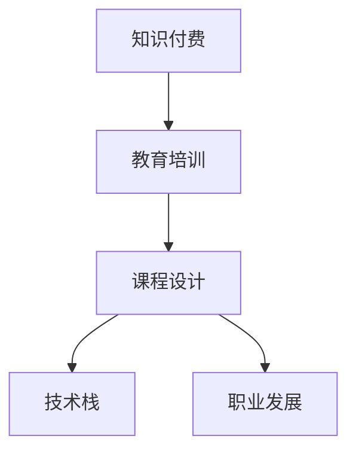

                 

# 程序员知识付费：打造升级版课程

> 关键词：程序员,知识付费,教育培训,课程设计,技术栈,职业发展

## 1. 背景介绍

### 1.1 问题由来
近年来，随着互联网技术的迅猛发展和在线教育的崛起，程序员作为技术型人才，其学习需求与日俱增。传统的以学校教育为主的教学模式已无法满足当下程序员的知识更新与技能提升需求。知识付费平台的兴起，为程序员提供了一种高效便捷的学习途径。程序员知识付费课程因其小班授课、项目驱动、实战导向等特点，受到广泛欢迎。然而，当前的程序员知识付费课程也面临着内容同质化严重、师资力量不足、学习成果难以量化等问题。面对这些挑战，如何打造升级版的程序员知识付费课程，提升学习效果，已成为一个亟待解决的问题。

### 1.2 问题核心关键点
打造升级版程序员知识付费课程的核心关键点包括：
- **多样化内容**：涵盖技术栈广泛，包括前端、后端、移动开发、数据科学、人工智能等。
- **实战导向**：课程内容紧密结合企业实际需求，强调项目实践，避免理论空谈。
- **优质师资**：引入行业大咖、项目导师等优质师资力量，提升教学质量。
- **持续更新**：课程内容需随技术发展不断迭代，保持时效性。
- **学习效果**：通过设立阶段性考核、项目提交、学员反馈等方式，保证学习效果。

## 2. 核心概念与联系

### 2.1 核心概念概述

为更好地理解如何打造升级版程序员知识付费课程，本节将介绍几个密切相关的核心概念：

- **知识付费**：指通过付费形式获取专业知识和技能的学习方式。对于程序员而言，时间成本较高，知识付费能够提供更为高效和专业的学习资源。
- **教育培训**：旨在通过系统化的知识和技能培训，帮助学员实现职业成长和技能提升。
- **课程设计**：根据学习目标和学员需求，设计课程大纲、教学内容、评估方式等。
- **技术栈**：指实现特定功能所需的技术工具和框架的集合，如前端常用的React、Vue，后端常用的Node.js、Spring等。
- **职业发展**：指通过学习提升个人竞争力，实现职业晋升和职业转换。

这些核心概念之间的逻辑关系可以通过以下Mermaid流程图来展示：



这个流程图展示了一门程序员知识付费课程的构建过程：

1. 知识付费为教育培训提供资金支持，保障课程的可持续运营。
2. 课程设计是教育培训的核心，决定着课程的内容和形式。
3. 技术栈是课程设计的基础，影响着课程的技术深度和广度。
4. 职业发展是教育培训的最终目标，指引课程设计的方向和效果评估。

这些核心概念共同构成了程序员知识付费课程的基础框架，为其高质量实施提供了基本保障。

## 3. 核心算法原理 & 具体操作步骤
### 3.1 算法原理概述

打造升级版程序员知识付费课程，本质上是一个系统化的教育工程项目。其核心思想是：通过精心设计课程内容，引入优质师资，结合实战项目，持续更新课程体系，以培养高素质的技术型人才。

形式化地，假设目标课程为 $C_{target}$，其中包含多个模块 $M=\{M_1, M_2, ..., M_n\}$，每个模块 $M_i$ 对应一种技术栈 $T_i$，设计一套完整的课程体系 $C_{design}$，则课程设计的优化目标是最小化与目标课程的差距：

$$
\text{minimize} \, D(C_{design}, C_{target})
$$

其中 $D$ 为差距函数，可以表示为学习成果与实际需求之间的差异。

### 3.2 算法步骤详解

打造升级版程序员知识付费课程一般包括以下几个关键步骤：

**Step 1: 确定课程目标与内容**
- 明确课程的目标和预期成果，如掌握XX技术栈、实现XX项目等。
- 收集行业内外的最新技术动态和需求变化，结合学员反馈，确定课程内容。

**Step 2: 引入优质师资**
- 招聘或邀请行业大咖、项目经验丰富的导师作为课程讲师。
- 建立师资团队，通过定期培训和考核，提升教学质量。

**Step 3: 设计课程大纲**
- 根据技术栈和职业发展的需要，设计合理的课程模块和课程顺序。
- 引入项目导向教学法，结合实战案例，进行项目驱动教学。

**Step 4: 开发教学资源**
- 制作丰富的课程讲义、视频教程、代码示例等教学资源。
- 采用互动式教学工具，如在线讨论区、代码调试工具等，提升学习体验。

**Step 5: 实施评估与反馈**
- 设立阶段性考核、项目提交等评估方式，检查学习效果。
- 收集学员反馈，定期优化课程内容和教学方式。

**Step 6: 持续更新与迭代**
- 定期更新课程内容，添加新技术和实战案例。
- 引入更多实践项目，保持课程的时效性和实战性。

以上是打造升级版程序员知识付费课程的一般流程。在实际应用中，还需要针对具体学员的需求和反馈，对各个环节进行优化设计，以进一步提升课程效果。

### 3.3 算法优缺点

打造升级版程序员知识付费课程方法具有以下优点：
1. **针对性强**：课程设计紧密结合实际需求，能够显著提升学员的职业技能。
2. **师资力量强**：引入行业大咖和经验丰富的导师，提升教学质量。
3. **实战导向**：通过项目导向教学法，增强学员的实战能力。
4. **持续改进**：定期更新课程内容，保持学习效果和课程时效性。

同时，该方法也存在一定的局限性：
1. **资源投入高**：优质的师资和持续更新课程内容需要较高的成本投入。
2. **个性化不足**：课程内容相对固定，难以适应每位学员的具体需求。
3. **市场竞争激烈**：知识付费市场竞争激烈，课程的差异化需要不断创新。
4. **学员自律性要求高**：知识付费课程需要学员主动投入学习，自律性较低可能影响效果。

尽管存在这些局限性，但就目前而言，打造升级版程序员知识付费课程仍然是一种高效的教育方式。未来相关研究的重点在于如何进一步降低课程成本，提高课程的个性化和智能化，同时兼顾学员的自律性和学习效果。

### 3.4 算法应用领域

打造升级版程序员知识付费课程的技术范式，在教育培训领域已经得到了广泛的应用，覆盖了前端开发、后端开发、移动开发、数据科学、人工智能等众多方向，例如：

- **前端开发**：提供React、Vue等前端技术的课程，结合实战项目，提升学员的前端开发能力。
- **后端开发**：涵盖Node.js、Spring等后端技术的课程，结合企业级项目，帮助学员快速掌握后端开发技能。
- **移动开发**：提供iOS、Android等移动开发的课程，结合原生开发和跨平台开发技术，提升学员的移动开发水平。
- **数据科学**：涵盖数据采集、数据清洗、数据分析等数据的课程，结合实战项目，提升学员的数据处理和分析能力。
- **人工智能**：涵盖机器学习、深度学习、自然语言处理等人工智能技术的课程，结合项目实践，提升学员的AI应用能力。

除了上述这些经典方向外，知识付费课程还不断拓展到更多新兴技术领域，如区块链、量子计算、物联网等，为程序员提供了更多学习和发展的机会。

## 4. 数学模型和公式 & 详细讲解
### 4.1 数学模型构建

本节将使用数学语言对打造升级版程序员知识付费课程的原理进行更加严格的刻画。

记目标课程为 $C_{target}$，其中包含多个模块 $M=\{M_1, M_2, ..., M_n\}$，每个模块 $M_i$ 对应一种技术栈 $T_i$。课程设计的优化目标是最小化与目标课程的差距 $D(C_{design}, C_{target})$。

假设课程内容 $C_{design}$ 通过技术栈 $T=\{T_1, T_2, ..., T_n\}$ 和职业发展目标 $D_{goal}$ 描述，则课程设计的数学模型可以表示为：

$$
\min_{C_{design}} \, D(C_{design}, C_{target}) = \min_{T, D_{goal}} \, \left( \sum_{i=1}^n \alpha_i \, d(T_i, C_{target}) + \beta \, d(D_{goal}, C_{target}) \right)
$$

其中 $\alpha_i$ 为技术栈 $T_i$ 的权重，$\beta$ 为职业发展目标 $D_{goal}$ 的权重，$d$ 为距离度量函数。

### 4.2 公式推导过程

以下我们以一个简单的案例来说明如何通过数学模型构建和推导，找到合适的课程设计方案。

假设某目标课程 $C_{target}$ 包含前端、后端、移动开发三个技术栈 $T_1$、$T_2$、$T_3$，以及全栈开发的目标 $D_{goal}$。课程设计者希望设计一门涵盖这些技术栈和目标的课程 $C_{design}$。

假设每个技术栈与目标课程之间的差距为 $d_i = \|C_{target_i} - C_{target}\|$，其中 $C_{target_i}$ 为技术栈 $T_i$ 的目标。

则课程设计的差距函数可以表示为：

$$
D(C_{design}, C_{target}) = \alpha_1 \, d(T_1, C_{target}) + \alpha_2 \, d(T_2, C_{target}) + \alpha_3 \, d(T_3, C_{target}) + \beta \, d(D_{goal}, C_{target})
$$

假设设计者希望技术栈 $T_1$ 和 $T_3$ 的重要性高于 $T_2$，且全栈开发的目标 $D_{goal}$ 与 $C_{target}$ 的差距较小，即 $\alpha_1 = \alpha_3 = 2, \alpha_2 = 1, \beta = 0.5$。

则课程设计的差距函数为：

$$
D(C_{design}, C_{target}) = 2d(T_1, C_{target}) + 2d(T_3, C_{target}) + 0.5d(D_{goal}, C_{target})
$$

接下来，我们需要通过最小化上述差距函数，找到最优的课程设计方案。

### 4.3 案例分析与讲解

假设课程设计者希望通过实战项目来提升学员的实战能力，因此希望引入两个具体的项目 $P_1$ 和 $P_2$，其中 $P_1$ 为全栈开发项目，$P_2$ 为基于前端技术栈的项目。

假设 $P_1$ 和 $P_2$ 与目标课程之间的差距为 $d_1$ 和 $d_2$。

则课程设计的差距函数可以进一步表示为：

$$
D(C_{design}, C_{target}) = 2d(T_1, C_{target}) + 2d(T_3, C_{target}) + 0.5d(D_{goal}, C_{target}) + \delta_1 d(P_1, C_{target}) + \delta_2 d(P_2, C_{target})
$$

其中 $\delta_1$ 和 $\delta_2$ 为 $P_1$ 和 $P_2$ 的权重。

通过最小化上述差距函数，课程设计者可以找到最优的项目组合，以达到最优的课程设计效果。

## 5. 项目实践：代码实例和详细解释说明
### 5.1 开发环境搭建

在进行知识付费课程的开发实践前，我们需要准备好开发环境。以下是使用Python进行Django开发的环境配置流程：

1. 安装Anaconda：从官网下载并安装Anaconda，用于创建独立的Python环境。

2. 创建并激活虚拟环境：
```bash
conda create -n course-env python=3.8 
conda activate course-env
```

3. 安装Django：根据Django版本，从官网获取对应的安装命令。例如：
```bash
pip install django==3.2
```

4. 安装必要的第三方库：
```bash
pip install django-crispy-forms markdown django-filter django-cors-headers
```

5. 创建Django项目：
```bash
django-admin startproject course management
```

6. 进入项目目录并配置数据库：
```bash
cd management
python manage.py migrate
```

7. 启动开发服务器：
```bash
python manage.py runserver 0.0.0.0:8000
```

完成上述步骤后，即可在`course-env`环境中开始知识付费课程的开发实践。

### 5.2 源代码详细实现

这里我们以一个简单的知识付费课程项目为例子，给出使用Django框架进行知识付费课程开发的核心代码实现。

首先，定义一个用户模型，用于记录学员的个人信息：

```python
from django.db import models

class User(models.Model):
    name = models.CharField(max_length=100)
    email = models.EmailField(unique=True)
    course_enrollments = models.ManyToManyField('Course', through='Enrollment')
```

接着，定义一个课程模型，用于记录课程的基本信息：

```python
from django.db import models
from django.urls import reverse

class Course(models.Model):
    name = models.CharField(max_length=100)
    description = models.TextField()
    target = models.CharField(max_length=100)
    modules = models.ManyToManyField('Module')
    enrollments = models.ManyToManyField('User', through='Enrollment')

    def __str__(self):
        return self.name

    def get_absolute_url(self):
        return reverse('course_detail', kwargs={'pk': self.pk})
```

然后，定义一个模块模型，用于记录课程的各个模块信息：

```python
from django.db import models
from django.urls import reverse

class Module(models.Model):
    name = models.CharField(max_length=100)
    description = models.TextField()
    technology = models.CharField(max_length=100)
    project = models.ForeignKey('Project', null=True, blank=True)
    course = models.ForeignKey('Course', on_delete=models.CASCADE)

    def __str__(self):
        return self.name

    def get_absolute_url(self):
        return reverse('module_detail', kwargs={'pk': self.pk})
```

再定义一个项目模型，用于记录课程的实战项目：

```python
from django.db import models

class Project(models.Model):
    name = models.CharField(max_length=100)
    description = models.TextField()
    technology = models.CharField(max_length=100)
    source_code = models.FileField()

    def __str__(self):
        return self.name
```

接下来，定义一个学员注册页面：

```html
<!-- templates/signup.html -->
<form method="post">
    
    <label>Name:</label>
    <input type="text" name="name">
    <br>
    <label>Email:</label>
    <input type="email" name="email">
    <br>
    <input type="submit" value="Sign Up">
</form>
```

最后，定义一个课程详情页面：

```html
<!-- templates/course_detail.html -->
<h1>{{ course.name }}</h1>
<p>{{ course.description }}</p>
<h2>Modules:</h2>
<ul>
    
    <li><a href="">{{ module.name }}</a></li>
    
</ul>
```

### 5.3 代码解读与分析

让我们再详细解读一下关键代码的实现细节：

**User模型**：
- 定义了学员的基本信息，包括姓名、邮箱和已报名课程。

**Course模型**：
- 定义了课程的基本信息，包括名称、描述、目标、模块和学员。
- 实现了模型对象的字符串表示和URL重定向，方便在页面中展示课程详情。

**Module模型**：
- 定义了课程模块的基本信息，包括名称、描述、技术栈和项目。
- 实现了模型对象的字符串表示和URL重定向，方便在页面中展示模块详情。

**Project模型**：
- 定义了课程的实战项目，包括名称、描述、技术栈和源代码。
- 实现了模型对象的字符串表示，方便在页面中展示项目详情。

** signup.html页面**：
- 使用HTML和Django模板语言，实现了学员的注册页面。
- 通过表单提交，将学员信息保存到数据库。

** course_detail.html页面**：
- 使用HTML和Django模板语言，实现了课程的详情页面。
- 通过循环遍历课程模块，生成模块列表，方便学员选择。

通过上述代码的实现，我们展示了使用Django框架开发知识付费课程项目的核心功能，包括学员注册、课程详情展示等。

### 5.4 运行结果展示

启动开发服务器后，我们可以通过浏览器访问`http://localhost:8000/`，完成学员的注册。然后，通过访问`http://localhost:8000/course/1/`（假设课程ID为1），可以查看课程详情，包括课程模块和实战项目。

## 6. 实际应用场景
### 6.1 智能培训平台

基于知识付费课程的智能培训平台，可以为企业和机构提供定制化的教育解决方案。企业可以针对自身需求，定制化的设计课程内容，引入行业专家作为讲师，通过实战项目提升学员的实战能力。智能平台可以自动收集学员的学习数据，生成学习报告和进度跟踪，帮助学员及时调整学习策略，提升学习效果。

### 6.2 在线教育机构

在线教育机构可以利用知识付费课程平台，吸引更多的学员加入在线学习。通过引入优质课程和师资力量，机构可以实现课程差异化，满足不同学员的需求。通过平台提供的教学资源和学习工具，学员可以自主安排学习进度，提升学习效率。

### 6.3 教育技术公司

教育技术公司可以通过知识付费课程平台，提供技术培训和知识分享服务。通过平台化的教学和管理，公司可以高效地组织和传播知识，提升教学效果。通过平台收集的数据，公司可以分析学员的学习行为和需求，不断优化课程内容和教学方式，提升用户体验。

### 6.4 未来应用展望

随着知识付费课程的不断发展，其在教育培训领域的应用将更加广泛。未来，基于知识付费课程的智能培训平台和在线教育机构将不断涌现，为技术型人才提供更加优质和高效的教育服务。同时，知识付费课程也将与AI技术深度融合，实现个性化推荐、智能答疑、情感分析等智能功能，提升学习体验和效果。

## 7. 工具和资源推荐
### 7.1 学习资源推荐

为了帮助开发者系统掌握知识付费课程的开发流程，这里推荐一些优质的学习资源：

1. **Django官方文档**：Django作为Web开发框架，其官方文档详细介绍了Django的使用方法和最佳实践，是学习Django的最佳资料。

2. **Coursera《Python for Everybody》课程**：由Coursera提供的Python入门课程，涵盖Python基础知识和Django框架的使用，适合初学者学习。

3. **《Django Web Development with Python》书籍**：该书详细介绍了Django框架的使用方法，从基础到高级，适合有一定编程基础的读者。

4. **Coursera《Python and the Web》课程**：由Coursera提供的Python和Web开发课程，涵盖Web开发的前端和后端技术，适合有一定编程基础的读者。

5. **《Django for Beginners》书籍**：该书面向初学者，详细介绍了Django框架的入门知识和实践项目，适合完全的初学者。

通过对这些资源的学习实践，相信你一定能够快速掌握Django框架，开发出高质量的知识付费课程。

### 7.2 开发工具推荐

高效的开发离不开优秀的工具支持。以下是几款用于知识付费课程开发的常用工具：

1. **Visual Studio Code**：微软开发的代码编辑器，支持多种编程语言和插件，功能强大且易用。

2. **Git**：版本控制系统，适合多人协作开发，版本管理高效便捷。

3. **Django**：Django作为Web开发框架，适合快速开发Web应用，支持RESTful API设计和多种模板引擎。

4. **Jupyter Notebook**：交互式编程环境，支持Python和多种语言，适合数据科学和机器学习应用。

5. **Anaconda**：Python环境管理工具，支持Python和多种依赖库的安装和更新，适合科学计算和数据分析。

合理利用这些工具，可以显著提升知识付费课程的开发效率，加快创新迭代的步伐。

### 7.3 相关论文推荐

知识付费课程的发展得益于学界的持续研究。以下是几篇奠基性的相关论文，推荐阅读：

1. **《Kaggle and the Rise of Crowdsourcing Data Science Education》**：研究了Kaggle平台对数据科学教育的影响，展示了在线教育平台在数据科学领域的作用。

2. **《Teaching Data Science with Jupyter Notebooks》**：探讨了如何使用Jupyter Notebook进行数据科学教学，展示了Jupyter Notebook在教学中的优势。

3. **《Designing Effective Online Learning Communities》**：研究了如何设计有效的在线学习社区，通过社区互动提升学习效果。

4. **《Scalable Courses: A Design and Development Approach》**：介绍了可扩展课程的设计和开发方法，通过课程分解提升学习效率。

5. **《Designing Effective E-Learning Applications》**：探讨了如何设计有效的在线学习应用，通过交互式教学提升学习效果。

这些论文代表了大语言模型微调技术的发展脉络。通过学习这些前沿成果，可以帮助研究者把握学科前进方向，激发更多的创新灵感。

## 8. 总结：未来发展趋势与挑战
### 8.1 研究成果总结

本文对打造升级版程序员知识付费课程进行了全面系统的介绍。首先阐述了知识付费课程的发展背景和意义，明确了课程设计在知识付费中的核心地位。其次，从原理到实践，详细讲解了课程设计的数学模型和实现方法，给出了知识付费课程的完整代码实例。同时，本文还广泛探讨了知识付费课程在智能培训平台、在线教育机构、教育技术公司等不同领域的应用前景，展示了知识付费课程的广阔前景。最后，本文精选了知识付费课程的学习资源，力求为读者提供全方位的技术指引。

通过本文的系统梳理，可以看到，知识付费课程在教育培训领域已经成为一种重要的教育模式，为技术型人才提供了一种高效便捷的学习途径。课程设计的好坏直接决定了学习效果和学员满意度，打造升级版知识付费课程，需要不断优化课程内容、师资力量、学习体验等各个环节。未来，随着AI技术的不断进步，知识付费课程将与AI技术深度融合，实现更加个性化、智能化的教育培训模式。

### 8.2 未来发展趋势

展望未来，知识付费课程的发展趋势将呈现以下几个方向：

1. **个性化教育**：利用AI技术，根据学员的学习行为和偏好，提供个性化的课程推荐和内容推送，提升学习效率和效果。

2. **虚拟现实教学**：结合虚拟现实技术，构建沉浸式学习环境，提升学员的沉浸感和体验感。

3. **实时互动教学**：通过实时视频会议和即时消息功能，实现教师和学员之间的实时互动，提升教学效果。

4. **模块化课程设计**：将课程内容模块化，通过微课和微任务的形式，提升学习灵活性和实用性。

5. **社区化学习**：构建在线学习社区，促进学员之间的交流与合作，通过社区互动提升学习效果。

6. **数据驱动教学**：通过大数据分析，优化课程设计，提升教学效果和用户体验。

以上趋势凸显了知识付费课程的巨大潜力。这些方向的探索发展，必将进一步提升知识付费课程的教学效果和用户满意度。

### 8.3 面临的挑战

尽管知识付费课程已经取得了显著的成就，但在迈向更加智能化、普适化应用的过程中，仍然面临诸多挑战：

1. **师资质量参差不齐**：优质师资的获取和培养需要较高成本，如何在保证师资质量的同时，降低成本，是一个重要问题。

2. **学习效果评估困难**：课程内容和学习效果难以量化，如何设计有效的评估方式，保证学习效果的提升，是一个重要问题。

3. **学员自律性不足**：知识付费课程需要学员主动投入学习，自律性较低可能影响效果，如何提升学员的自律性和学习积极性，是一个重要问题。

4. **课程内容更新慢**：课程内容需要不断更新，以保持时效性和实战性，如何高效更新课程内容，是一个重要问题。

5. **学习体验不佳**：知识付费课程需要良好的学习体验，如何提升用户体验，是一个重要问题。

6. **数据隐私保护**：课程平台需要收集大量用户数据，如何保护用户数据隐私，是一个重要问题。

正视知识付费课程面临的这些挑战，积极应对并寻求突破，将是大语言模型微调走向成熟的必由之路。相信随着学界和产业界的共同努力，这些挑战终将一一被克服，知识付费课程必将在构建人机协同的智能时代中扮演越来越重要的角色。

### 8.4 研究展望

面对知识付费课程所面临的种种挑战，未来的研究需要在以下几个方面寻求新的突破：

1. **引入AI技术**：利用AI技术，如自然语言处理、计算机视觉等，提升课程内容和教学方式的智能化水平。

2. **设计个性化推荐系统**：通过数据分析和机器学习算法，设计个性化推荐系统，提升学习效率和用户体验。

3. **引入实时反馈机制**：利用AI技术，实时分析学员的学习数据，及时调整课程内容和教学策略。

4. **引入社区互动功能**：通过在线社区和讨论平台，促进学员之间的交流与合作，提升学习效果和社区活跃度。

5. **引入自适应学习算法**：通过自适应学习算法，根据学员的学习进度和效果，动态调整学习内容和教学策略。

6. **引入数据隐私保护技术**：通过数据加密和隐私保护技术，保障用户数据的安全和隐私。

这些研究方向的探索，必将引领知识付费课程技术迈向更高的台阶，为构建安全、可靠、可解释、可控的智能系统铺平道路。面向未来，知识付费课程还需要与其他人工智能技术进行更深入的融合，如知识表示、因果推理、强化学习等，多路径协同发力，共同推动自然语言理解和智能交互系统的进步。只有勇于创新、敢于突破，才能不断拓展语言模型的边界，让智能技术更好地造福人类社会。

## 9. 附录：常见问题与解答

**Q1：知识付费课程的优势是什么？**

A: 知识付费课程的优势在于其高度灵活性和实用性，能够快速响应市场需求，满足学员的学习需求。通过小班授课、项目驱动、实战导向等教学方式，能够显著提升学员的实战能力和学习效果。同时，知识付费课程也能够满足学员的个性化学习需求，提升学员的学习体验和满意度。

**Q2：如何选择合适的课程内容？**

A: 选择合适的课程内容需要结合学员的实际需求和职业发展目标。可以通过市场调研、学员反馈等方式，了解学员的学习需求。同时，引入行业专家和项目导师，帮助设计课程内容。课程内容应涵盖基础技术、实战项目和职业发展目标，保证课程的实用性和时效性。

**Q3：如何设计有效的课程评估方式？**

A: 设计有效的课程评估方式需要综合考虑学员的学习行为、项目提交、阶段性考核等多种因素。可以通过学习报告、学员自评、导师评价等方式，全面评估学员的学习效果。同时，引入数据驱动的评估方法，利用数据分析和机器学习算法，优化评估方式，提升评估效果。

**Q4：如何提升学员的自律性和学习积极性？**

A: 提升学员的自律性和学习积极性需要从多个方面入手。可以通过在线学习社区和互动平台，促进学员之间的交流与合作。同时，引入实时反馈机制，及时调整课程内容和教学策略，提升学员的学习体验和满意度。此外，可以设立奖励机制，激励学员积极参与学习，提升学习效果。

**Q5：如何保护学员的数据隐私？**

A: 保护学员的数据隐私需要从多个方面入手。可以通过数据加密和隐私保护技术，保障用户数据的安全和隐私。同时，设计合理的权限控制和访问机制，限制数据的访问和使用范围。定期进行数据安全审计和风险评估，及时发现和解决数据隐私问题。

---

作者：禅与计算机程序设计艺术 / Zen and the Art of Computer Programming

