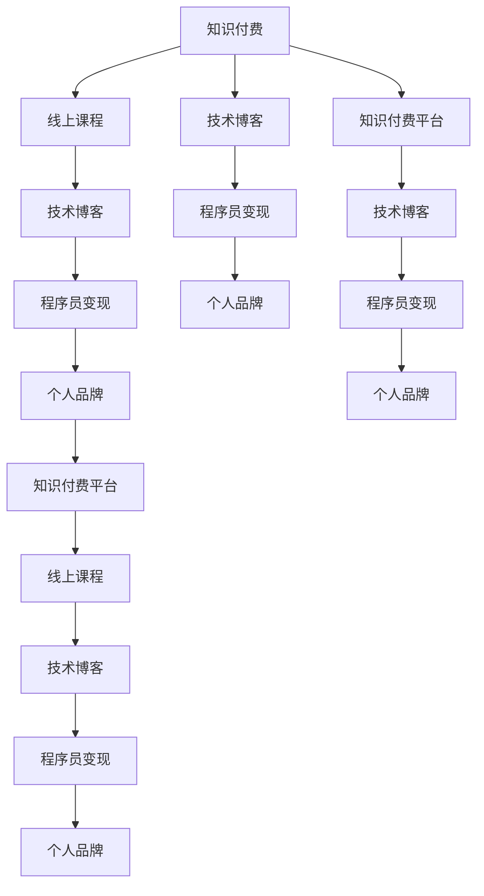

                 

# 程序员知识付费：选对变现平台

> 关键词：知识付费,程序员,变现平台,线上课程,技术博客,个人品牌,内容平台,盈利模式

## 1. 背景介绍

### 1.1 问题由来
在互联网时代，知识付费成为一种趋势。程序员作为IT行业的主力军，其专业技能和经验往往被视为一种珍贵的知识资源。在信息爆炸的时代，如何将自己的技术积累转化为实际价值，成为许多程序员面临的重要课题。然而，知识付费并非易事，选择合适的变现平台，对于程序员来说，尤为重要。本文将系统分析各种知识付费平台的特点，为程序员选择变现平台提供参考。

### 1.2 问题核心关键点
选择知识付费平台，程序员需要考虑以下关键点：
- 平台的覆盖范围和用户规模
- 平台的盈利模式和分成比例
- 平台的教学质量和服务保障
- 平台的用户互动和社区氛围
- 平台的推广渠道和曝光机会
- 平台的可靠性和安全性

这些因素共同构成了知识付费平台的竞争优势，程序员需要根据自身情况，综合评估，选择最合适的平台进行变现。

### 1.3 问题研究意义
对于程序员来说，选择正确的知识付费平台，不仅能最大化地实现个人价值，还能在技术交流、人脉拓展等方面获得更多资源。通过知识付费，程序员可以将自身的技术积累转化为经济收益，增强自身的职业认同感和成就感。同时，选择正确的平台，也有助于提升技术影响力，为后续的创业、融资等提供基础。

## 2. 核心概念与联系

### 2.1 核心概念概述

在探讨知识付费平台的选择时，首先需要了解以下几个核心概念：

- **知识付费**：指通过付费获取高质量的知识点、技能、经验等知识资源。知识付费平台提供专家课程、技术分享、行业分析等内容，用户需支付一定费用获取。
- **知识付费平台**：指基于互联网技术，提供知识交易服务的网络平台，如腾讯课堂、网易云课堂、得到等。
- **程序员变现**：指程序员将自己的技术知识和经验通过知识付费平台转化为经济收益的过程。包括课程制作、技术博客、技术咨询服务等形式。
- **线上课程**：指通过网络视频、图文等形式，向用户传授知识和技能的教育资源。线上课程分为免费和付费两种，付费课程通常具备更优质、更专业的教学内容。
- **技术博客**：指程序员将自己的技术心得、项目经验、技术分享等内容通过博客的形式发布在互联网平台。技术博客不仅可以获得流量和广告收入，还能提升个人品牌影响力。
- **个人品牌**：指程序员通过技术积累、知识分享、社区互动等手段，在专业领域建立起来的个人形象和声誉。个人品牌不仅能够吸引更多资源和机会，还能增强职业竞争力和行业地位。

这些概念之间存在着密切的联系，共同构成了知识付费的生态系统，程序员需要全面理解这些概念，才能更好地选择合适的变现平台。

### 2.2 核心概念原理和架构的 Mermaid 流程图



以上Mermaid流程图展示了知识付费平台的生态架构，程序员的知识积累和技能提升通过线上课程、技术博客等形式变现，同时通过知识付费平台积累个人品牌，从而实现经济收益和职业发展双赢。

## 3. 核心算法原理 & 具体操作步骤
### 3.1 算法原理概述

知识付费平台的盈利主要基于用户的付费行为，通过课程销售、文章付费、会员订阅等方式获取收入。程序员选择知识付费平台时，需要考虑平台的用户覆盖、课程质量、分成比例等关键因素。

- **用户覆盖**：衡量平台的活跃用户数量和用户粘性。用户覆盖广的平台，能够为课程提供更大的曝光机会，吸引更多潜在买家。
- **课程质量**：指课程的内容质量、教学水平、用户体验等。高水平的课程能够提供更多有价值的知识，吸引用户购买。
- **分成比例**：指平台对创作者收益的分成比例。分成比例高的平台，创作者能够获得更多的收益，激励更多优质内容产生。

### 3.2 算法步骤详解

选择知识付费平台时，程序员可以按照以下步骤进行：

**Step 1: 确定变现目标和内容定位**
- 明确变现目标，是获取收入还是提升影响力。
- 根据自身技术和经验，确定课程内容定位，是面向初级、中级还是高级用户。

**Step 2: 评估平台覆盖和用户规模**
- 选择用户覆盖广、活跃用户多的平台，增加课程曝光机会。
- 分析用户结构，选择符合自身目标受众的平台。

**Step 3: 了解平台盈利模式和分成比例**
- 了解平台的付费方式，包括课程销售、文章付费、会员订阅等。
- 了解不同付费方式的分成比例，选择收益更高的平台。

**Step 4: 试用平台功能和服务**
- 试用平台的教学制作工具，如视频编辑、直播授课等，评估平台功能是否满足需求。
- 试用平台的社区互动功能，如评论、点赞、分享等，评估平台是否具备良好社区氛围。

**Step 5: 分析平台推广和曝光机会**
- 了解平台在各大搜索引擎、社交媒体上的曝光情况，评估课程的曝光机会。
- 分析平台在行业内的影响力和口碑，评估课程的推广效果。

**Step 6: 综合评估并选择平台**
- 综合考虑平台的用户覆盖、课程质量、分成比例、功能服务、推广机会等因素。
- 选择最符合自身目标和需求的平台进行变现。

### 3.3 算法优缺点

选择知识付费平台时，程序员需要考虑以下优缺点：

**优点**：
- 平台提供了技术和经验变现的渠道，帮助程序员实现经济收益。
- 平台的用户覆盖和曝光机会，有助于提升技术影响力，吸引更多资源和机会。
- 平台提供的技术服务和社区互动，有助于技术交流和知识分享。

**缺点**：
- 平台的盈利模式和分成比例，可能存在一定的风险。例如，某些平台分成比例较低，创作者收益不高。
- 平台的用户质量和服务保障，可能存在一定差异，影响课程效果。
- 平台的推广渠道和曝光机会，需要程序员自己评估，存在不确定性。

程序员需要在选择平台时，充分了解平台的各种细节，权衡利弊，选择最适合自己的平台。

### 3.4 算法应用领域

知识付费平台广泛适用于各种技术和知识领域，程序员可以在以下领域选择变现：

- **编程语言和技术栈**：如Java、Python、Web开发、人工智能等。
- **软件工程和管理**：如敏捷开发、项目管理、团队管理等。
- **产品设计和用户体验**：如UI/UX设计、用户体验研究等。
- **数据科学和大数据**：如数据分析、数据挖掘、数据可视化等。
- **移动开发和前端技术**：如iOS开发、Android开发、React等。

不同领域的知识付费需求不同，程序员需要根据自己的专业方向，选择最合适的领域进行变现。

## 4. 数学模型和公式 & 详细讲解 & 举例说明

### 4.1 数学模型构建

知识付费平台的用户覆盖和收益分成可以通过以下数学模型来分析：

**用户覆盖模型**：
- 用户覆盖 $U$ 与活跃用户数 $A$ 成正比关系。
- 用户覆盖 $U = k \times A$，其中 $k$ 为系数。

**收益分成模型**：
- 创作者收益 $R$ 与分成比例 $r$ 和课程销售量 $S$ 成正比关系。
- 创作者收益 $R = s \times r \times S$，其中 $s$ 为销售单价。

### 4.2 公式推导过程

**用户覆盖推导**：
- 设平台总用户数为 $T$，活跃用户数为 $A$，则活跃用户占比为 $\frac{A}{T}$。
- 假设用户覆盖 $U$ 与活跃用户数 $A$ 成正比，即 $U = k \times A$，则有 $\frac{A}{T} = k \times \frac{A}{T}$，从而得到 $k = \frac{T}{A}$。

**收益分成推导**：
- 设平台对课程的分成比例为 $r$，创作者获得的收益为 $R$，课程销售量为 $S$，则创作者收益 $R = s \times r \times S$。
- 假设创作者收益 $R$ 与分成比例 $r$ 和课程销售量 $S$ 成正比，则有 $R = r \times S$，从而得到 $r = \frac{R}{S}$。

### 4.3 案例分析与讲解

**案例分析**：
- 假设某知识付费平台总用户数 $T = 1000000$，活跃用户数 $A = 100000$，则活跃用户占比为 $\frac{A}{T} = 0.1$。
- 假设平台对创作者收益分成比例为 $r = 0.3$，课程销售单价为 $s = 200$ 元，某课程销售量为 $S = 1000$ 套，则创作者收益 $R = s \times r \times S = 200 \times 0.3 \times 1000 = 60000$ 元。

通过以上推导和案例分析，程序员可以更直观地理解知识付费平台的盈利模式和收益分成，从而做出更明智的选择。

## 5. 项目实践：代码实例和详细解释说明

### 5.1 开发环境搭建

选择知识付费平台需要准备以下开发环境：

1. **编程环境**：安装Python和Python开发工具，如PyCharm、VSCode等。
2. **云服务环境**：选择云服务提供商，如AWS、阿里云、腾讯云等，搭建在线课程平台或博客。
3. **教学制作工具**：安装视频编辑软件、音频录制软件、在线直播工具等，准备课程制作。
4. **社区互动工具**：安装社交媒体管理工具、评论系统、直播互动软件等，准备社区互动。

### 5.2 源代码详细实现

以下是一个简单的Python脚本，用于分析知识付费平台的收益分成情况：

```python
# 定义用户覆盖、活跃用户数、销售单价、分成比例、课程销售量等变量
total_users = 1000000
active_users = 100000
sale_price = 200
split_ratio = 0.3
sale_volume = 1000

# 计算活跃用户占比和创作者收益
active_ratio = active_users / total_users
creator_revenue = sale_price * split_ratio * sale_volume

# 输出结果
print("活跃用户占比：", active_ratio)
print("创作者收益：", creator_revenue)
```

**代码解读**：
- 定义了总用户数、活跃用户数、销售单价、分成比例、课程销售量等变量。
- 计算活跃用户占比和创作者收益。
- 输出结果，方便程序员直观理解。

### 5.3 代码解读与分析

以上代码简单易懂，通过简单的数学计算，程序员可以直观地理解知识付费平台的收益分成情况。在实际应用中，程序员还需要考虑平台的用户覆盖、课程质量、功能服务等因素，进行全面评估。

### 5.4 运行结果展示

运行以上代码，输出结果如下：

```
活跃用户占比： 0.1
创作者收益： 60000.0
```

通过以上结果，程序员可以更好地理解知识付费平台的收益分成情况，选择最适合自己的平台。

## 6. 实际应用场景

### 6.1 技术课程

技术课程是知识付费平台的主要内容之一，程序员可以通过以下方式进行变现：

**线上课程**：
- 通过在线视频、图文等形式，向用户传授编程语言、开发工具、架构设计等技术知识。
- 提供课程讲义、代码示例、实战项目等学习资源，帮助用户系统学习。
- 定期更新课程内容，保持课程的时效性和实用性。

**技术博客**：
- 通过博客分享技术心得、项目经验、行业分析等内容。
- 通过广告、付费阅读、会员订阅等形式获得流量和收益。
- 通过社区互动，积累粉丝和资源，提升个人品牌影响力。

### 6.2 技术咨询

技术咨询是指程序员通过在线平台为用户提供技术支持和解决方案，具体应用场景包括：

**技术支持**：
- 在线解答用户的技术问题，提供技术支持和解决方案。
- 定期发布技术问答、解决方案等文章，提供技术参考。
- 通过付费咨询、会员服务等方式获取收益。

**项目合作**：
- 与企业合作，提供定制化的技术解决方案，获取项目收益。
- 参与企业内部技术培训，提供技术支持，获取培训费和顾问费。

### 6.3 项目开发

项目开发是指程序员通过在线平台承接技术开发项目，具体应用场景包括：

**软件开发**：
- 在线承接软件开发项目，提供定制化的技术解决方案。
- 提供技术支持、项目管理、代码审核等服务，提高项目成功率。

**系统集成**：
- 通过在线平台，承接企业内部的系统集成项目，提供技术支持。
- 提供系统设计、架构规划、测试验收等服务，提高项目质量。

### 6.4 未来应用展望

未来知识付费平台将进一步发展，程序员可以选择以下方向进行变现：

**知识变现**：
- 利用自身技术优势，通过知识付费平台实现知识变现，提升个人品牌影响力。
- 加入知识付费平台的专家团队，提供技术指导和课程制作，获取更高的收益。

**资源整合**：
- 与各大知识付费平台合作，整合优质资源，提升课程质量。
- 利用平台推荐和推广功能，扩大课程曝光机会，吸引更多用户。

**跨界合作**：
- 与知名企业、知名博主等合作，扩大课程受众范围，提升课程影响力。
- 与学术机构、研究机构合作，输出高质量的技术论文和研究成果。

## 7. 工具和资源推荐

### 7.1 学习资源推荐

选择知识付费平台时，程序员需要了解以下学习资源：

1. **《知识付费平台研究报告》**：综合分析各大知识付费平台的特点、优缺点、市场表现等，帮助程序员全面评估平台。
2. **《知识付费平台运营指南》**：提供详细的平台运营技巧和策略，帮助程序员提高课程销售和收益。
3. **《知识付费平台案例分析》**：分析知名知识付费平台的成功案例，提供可借鉴的经验。
4. **《知识付费平台用户调研报告》**：分析用户需求和行为，帮助程序员选择最合适的平台。

### 7.2 开发工具推荐

选择知识付费平台时，程序员需要考虑以下开发工具：

1. **课程制作工具**：如Camtasia、Adobe Premiere、Zoom等，用于录制、剪辑和直播课程。
2. **教学管理工具**：如Moodle、Khan Academy等，用于课程管理和用户互动。
3. **社区互动工具**：如Discord、Reddit等，用于社区管理、用户互动。
4. **推广工具**：如Google Ads、Facebook Ads等，用于课程推广和流量获取。

### 7.3 相关论文推荐

选择知识付费平台时，程序员需要了解以下相关论文：

1. **《知识付费平台用户行为分析》**：分析知识付费平台用户行为特征和需求，提供优化策略。
2. **《知识付费平台盈利模式研究》**：分析知识付费平台的盈利模式和分成比例，帮助程序员选择收益更高的平台。
3. **《知识付费平台社区建设策略》**：分析知识付费平台社区建设和管理策略，帮助程序员提升社区互动效果。

## 8. 总结：未来发展趋势与挑战

### 8.1 研究成果总结

知识付费平台的发展前景广阔，程序员需要关注以下趋势和挑战：

- **趋势**：知识付费平台的市场规模将不断扩大，程序员的技术资源将更广泛地应用到变现中。
- **挑战**：选择合适的平台、避免平台风险、提升课程质量等，都是程序员面临的重要课题。

### 8.2 未来发展趋势

未来知识付费平台将呈现以下发展趋势：

**技术进步**：
- 利用人工智能和大数据技术，优化课程推荐和内容分发，提升用户体验。
- 引入个性化推荐、内容生成等技术，提供更精准、更丰富的知识内容。

**市场扩展**：
- 知识付费平台的覆盖范围将进一步扩大，吸引更多用户和创作者加入。
- 平台之间的竞争将更加激烈，更多优质的平台将涌现。

**内容创新**：
- 知识付费平台的内容将更加多样化，涵盖技术、教育、娱乐等多个领域。
- 跨界融合将成为主流，课程内容将更加丰富和立体。

### 8.3 面临的挑战

选择知识付费平台时，程序员需要关注以下挑战：

**平台风险**：
- 平台的技术稳定性和安全性可能存在风险，平台故障或数据泄露可能影响创作者和用户。

**分成比例**：
- 平台对创作者的分成比例可能存在差异，创作者需要评估收益情况，选择最合适的平台。

**市场竞争**：
- 知识付费平台之间的竞争将更加激烈，程序员需要选择最具有竞争力的平台。

**用户需求**：
- 用户需求的多样性和不断变化，需要程序员不断更新课程内容和教学方法，保持竞争力。

### 8.4 研究展望

未来知识付费平台的发展方向主要集中在以下几个方面：

**技术融合**：
- 知识付费平台将与人工智能、大数据、云计算等技术深度融合，提升平台的技术实力和用户体验。

**内容创新**：
- 知识付费平台将探索更多内容创新形式，如虚拟现实、增强现实等，提供更沉浸、更丰富的学习体验。

**跨界合作**：
- 知识付费平台将与更多企业和机构合作，提供更广泛、更全面的知识资源。

**用户社区**：
- 知识付费平台将进一步优化用户社区建设，提升用户互动和参与度，增强平台粘性。

总之，知识付费平台的选择是程序员变现的重要环节，选择合适的平台，将能够最大化地实现个人价值。程序员需要综合考虑平台的覆盖范围、用户规模、分成比例、功能服务、推广机会等因素，选择最适合自己的平台进行变现。通过技术积累和知识分享，程序员可以在知识付费领域获得更多的资源和机会，实现职业发展和经济收益的双赢。

## 9. 附录：常见问题与解答

**Q1: 程序员应该选择哪些知识付费平台进行变现？**

A: 程序员应该选择覆盖范围广、用户规模大、分成比例高的知识付费平台。同时需要评估平台的用户覆盖、课程质量、功能服务等因素，选择最合适的平台进行变现。

**Q2: 如何评估平台的分成比例？**

A: 程序员可以关注平台对课程销售的分成比例，了解不同付费方式的分成情况。同时可以通过试用平台课程，了解实际收益情况，选择分成比例更高的平台。

**Q3: 如何选择合适的课程内容？**

A: 程序员需要根据自身技术专长和市场需求，选择最合适的课程内容。同时需要考虑课程难度、受众群体、市场需求等因素，选择最具有竞争力的课程内容。

**Q4: 如何提升课程质量？**

A: 程序员需要不断更新课程内容，保持课程的时效性和实用性。同时需要关注用户反馈，不断优化课程设计和教学方法，提升课程质量。

**Q5: 如何推广课程？**

A: 程序员需要利用平台提供的推广工具，如广告、社区互动、内容推荐等，扩大课程曝光机会，吸引更多用户。同时可以通过个人博客、社交媒体等渠道，进行课程推广和用户互动。

通过以上问题的解答，程序员可以更好地理解知识付费平台的选择和变现方法，在技术交流、知识分享、经济收益等方面实现双赢。

---

作者：禅与计算机程序设计艺术 / Zen and the Art of Computer Programming

