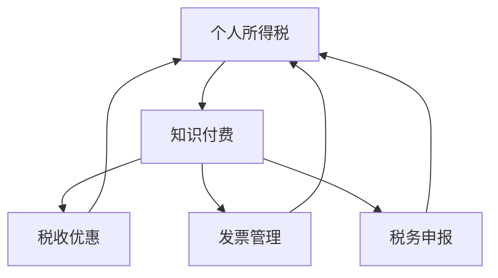

                 

# 税务规划：程序员的知识付费财税指南

> 关键词：税务规划,程序员,知识付费,财税指导,合理避税

## 1. 背景介绍

在知识付费日益兴盛的今天，程序员作为技术含量高、收入潜力大的群体，面临着如何合法合理地处理个人所得税的挑战。正确理解税务规划的基本原则和方法，对于提升个人财务状况、减轻税务负担具有重要意义。

### 1.1 问题由来
随着互联网和信息技术的发展，程序员群体在社会中的地位日益提升，其收入也呈现出快速增长趋势。然而，高收入同时伴随着高税负，许多程序员对此感到困惑和不安。此外，由于缺少专业的财务知识，不少程序员在税务处理上存在错误，甚至存在税务风险。

### 1.2 问题核心关键点
税务规划的核心在于通过合法手段合理分配收入，减少不必要的税务负担。具体到程序员知识付费领域，主要涉及个人所得税的计算、减免和申报等。

- 个人所得税：程序员通过知识付费平台获得的收入需缴纳个人所得税。
- 税收优惠：国家和地方政府对知识付费领域有相应的税收优惠政策。
- 发票管理：知识付费交易需要开具发票，需妥善管理发票。
- 税务申报：正确理解个人所得税的申报要求，及时申报。

## 2. 核心概念与联系

### 2.1 核心概念概述

税务规划涉及到多个核心概念，包括个人所得税、知识付费、税收优惠、发票管理、税务申报等。这些概念之间相互关联，共同构成了程序员税务规划的完整框架。

- **个人所得税**：针对个人取得的应税所得征收的一种直接税，是税务规划的主要对象。
- **知识付费**：指程序员通过互联网平台提供技术咨询、编程指导等服务，获得相应报酬的过程。
- **税收优惠**：政府为了鼓励特定行业或行为，在税收方面给予的减免政策。
- **发票管理**：知识付费交易需要开具发票，需妥善管理和保存。
- **税务申报**：根据个人所得税法规定，定期向税务机关申报个人所得和缴纳税款的过程。

这些核心概念之间的逻辑关系可以通过以下Mermaid流程图来展示：



这个流程图展示了个税处理、知识付费、税收优惠、发票管理、税务申报之间的逻辑关系：

1. 个人所得税作为核心，关联其他各个环节。
2. 知识付费作为主要收入来源，需缴纳个人所得税，同时涉及发票管理。
3. 税收优惠可在一定程度上减轻税负，适用于知识付费领域。
4. 税务申报是个人所得税处理的重要环节，需按照规定进行。

## 3. 核心算法原理 & 具体操作步骤
### 3.1 算法原理概述

税务规划的基本原则是通过合理分配收入，合法享受税收优惠，规避税务风险。具体到程序员知识付费领域，算法原理主要包括以下几个方面：

- 识别和理解各类收入来源。
- 计算应税所得，合理进行收入分配。
- 利用税收优惠，减少应纳税额。
- 管理发票，确保合规性。
- 掌握税务申报规则，按时申报。

### 3.2 算法步骤详解

基于上述算法原理，程序员知识付费的税务规划可以分为以下步骤：

**Step 1: 收入识别与分类**
- 识别各类收入来源，如平台佣金、咨询服务费、技术支持费等。
- 区分不同性质的收入，如主营业务收入、其他收入等。

**Step 2: 收入申报与计算**
- 根据个人所得税法，计算应税所得，包括收入总额、减除费用、专项扣除等。
- 使用相应税率进行计算，确定应缴税额。

**Step 3: 享受税收优惠**
- 根据当地税务政策，判断是否满足税收优惠条件，如高新技术企业、创业企业等。
- 申请相应的税收减免，如企业所得税税率减按15%、个人所得税税率减半等。

**Step 4: 发票管理**
- 使用正规发票进行交易，妥善保存发票。
- 定期进行发票查验，确保发票真实、合法、有效。

**Step 5: 税务申报**
- 根据个人所得税法规定，定期向税务机关申报个人所得税。
- 填写个人所得税申报表，确保申报信息的准确性和完整性。

**Step 6: 税务审计与调整**
- 定期进行税务审计，检查申报信息的准确性。
- 根据税务审计结果，进行相应的税务调整。

### 3.3 算法优缺点

税务规划的优点包括：
1. 合法合规：通过合理规划，减轻税务负担，避免税务风险。
2. 提高效率：合理分配收入，减少不必要的税务处理，提高效率。
3. 享受优惠：利用税收优惠，提高净收入。

税务规划的缺点包括：
1. 复杂性：涉及多个环节，需仔细规划和执行。
2. 政策变动：税务政策可能随时间变化，需持续关注和调整。
3. 专业性强：需具备一定的财务知识，建议咨询专业人士。

### 3.4 算法应用领域

税务规划的算法原理和操作步骤可以应用于多个领域，不仅限于程序员知识付费：

- **企业税务规划**：企业可通过合理分配收入、享受税收优惠、管理发票等，减轻税务负担。
- **个人财富管理**：个人可利用税收优惠、合理规划资产配置，提高财富增值能力。
- **房地产税务规划**：房地产投资需考虑土地增值税、房产税等，税务规划不可或缺。
- **企业重组与并购**：企业重组或并购过程中需合理分配资产、享受税收优惠，税务规划起到重要作用。

## 4. 数学模型和公式 & 详细讲解 & 举例说明

### 4.1 数学模型构建

个人所得税的计算模型为：

$$
应纳税额 = 应纳税所得额 \times 适用税率 - 速算扣除数
$$

其中，应纳税所得额为税前收入减去速算扣除数和各项税前扣除项后的余额。适用税率根据应纳税所得额的大小分段计算。速算扣除数用于简化计算，确保计算结果的准确性。

### 4.2 公式推导过程

个人所得税的计算公式推导过程如下：

设税前收入为 $I$，速算扣除数为 $C$，各项税前扣除项为 $D$，适用税率为 $r$，应纳税额为 $T$。则有：

$$
T = (I - C - D) \times r - (C \times r' - r'')
$$

其中 $r'$ 为速算扣除数对应的税率，$r''$ 为速算扣除数。

### 4.3 案例分析与讲解

假设某程序员通过知识付费平台获得年收入50万元，扣除必要费用后应纳税所得额为40万元，适用税率为20%，速算扣除数为0。则应纳税额计算如下：

$$
应纳税额 = 40 \times 0.2 - 0 = 8（万元）
$$

如果该程序员属于高新技术企业，根据政策可以享受15%的税率优惠，则计算如下：

$$
应纳税额 = 40 \times 0.15 - 0 = 6（万元）
$$

通过税务规划，该程序员有效减少了税务负担，同时享受了税收优惠。

## 5. 项目实践：代码实例和详细解释说明
### 5.1 开发环境搭建

在进行税务规划的开发实践前，我们需要准备好开发环境。以下是使用Python进行税务规划计算的开发环境配置流程：

1. 安装Anaconda：从官网下载并安装Anaconda，用于创建独立的Python环境。

2. 创建并激活虚拟环境：
```bash
conda create -n tax-env python=3.8 
conda activate tax-env
```

3. 安装必要的Python库：
```bash
pip install pandas numpy matplotlib
```

4. 安装税务规划所需的Python库：
```bash
pip install pycpa
```

完成上述步骤后，即可在`tax-env`环境中开始税务规划的计算和模拟。

### 5.2 源代码详细实现

以下是一个简化的税务规划Python代码实现：

```python
from pycpa import TaxCalculation

def calculate_tax(income, deductions, tax_rate):
    tax_calculator = TaxCalculation()
    tax = tax_calculator.calculate_tax(income, deductions, tax_rate)
    return tax

# 设定税前收入、扣除项、税率等参数
income = 500000
deductions = 200000
tax_rate = 0.2

# 计算应纳税额
tax = calculate_tax(income, deductions, tax_rate)
print("应纳税额为：", tax)
```

这个代码实现使用了Python的`pycpa`库，通过简单的函数调用即可计算个人所得税。`pycpa`库支持多种税率和扣除项的计算，是税务规划计算的便捷工具。

### 5.3 代码解读与分析

让我们再详细解读一下关键代码的实现细节：

**TaxCalculation类**：
- 定义了`calculate_tax`方法，用于计算个人所得税。

**incaome, deductions, tax_rate变量**：
- 设定了税前收入、扣除项、税率等关键参数。

**calculate_tax方法**：
- 将参数传递给`TaxCalculation`对象，调用`calculate_tax`方法进行计算。
- 返回计算结果。

可以看到，利用Python的第三方库，税务规划计算变得非常简单。开发者可以将更多精力放在模型参数的设定和结果分析上，而不必过多关注底层实现细节。

## 6. 实际应用场景
### 6.1 程序员知识付费平台

知识付费平台通常会与税务机关合作，帮助程序员进行个人所得税申报和处理。平台提供了便捷的税务申报工具，程序员只需在平台内进行税务申报和支付，平台会自动进行税务计算和申报。

### 6.2 自由职业者

自由职业者通过接单平台获得收入，需自行进行个人所得税申报。利用税务规划工具，自由职业者可合理分配收入，减少税务负担，提高净收入。

### 6.3 企业员工

企业员工可通过企业代扣代缴个人所得税，利用企业福利享受税收优惠。合理规划收入，可进一步提升员工福利和满意度。

### 6.4 未来应用展望

未来，随着区块链和智能合约技术的普及，税务规划将更加智能和高效。区块链技术可实现透明、不可篡改的税务数据记录，智能合约可自动进行税务计算和申报。这将大幅提升税务规划的准确性和效率，降低税务处理成本。

## 7. 工具和资源推荐
### 7.1 学习资源推荐

为了帮助程序员系统掌握税务规划的理论基础和实践技巧，这里推荐一些优质的学习资源：

1. 《个人所得税计算与申报》：权威税务书籍，详细介绍了个人所得税的计算方法、申报流程和税收优惠政策。
2. 《税务规划与金融管理》：全面讲解了税务规划的基本原则和实际案例，适合初学者学习。
3. 《区块链技术在税务中的应用》：介绍了区块链技术在税务数据记录和智能合约中的应用，具有前瞻性。
4. 《税务规划课程》：各大在线教育平台提供的税务规划课程，包括视频、讲义和练习。

通过对这些资源的学习实践，相信你一定能够快速掌握税务规划的精髓，并用于解决实际的税务问题。

### 7.2 开发工具推荐

高效的开发离不开优秀的工具支持。以下是几款用于税务规划计算的常用工具：

1. Python：灵活的编程语言，支持多种第三方库，适合进行复杂计算和数据分析。
2. Excel：功能强大的电子表格工具，支持复杂的财务和税务计算。
3. Pycpa：Python税务计算库，提供了丰富的计算函数和API。
4. TaxCalc：商业税务计算软件，支持多种税种和地区，方便计算和申报。

合理利用这些工具，可以显著提升税务规划的计算效率，简化税务处理流程。

### 7.3 相关论文推荐

税务规划的研究源于学界的持续研究。以下是几篇奠基性的相关论文，推荐阅读：

1. "Optimal Tax Planning Strategies for High-Income Earners"：研究高收入群体税务规划策略，提供了详细的计算模型和案例分析。
2. "Taxation of Knowledge Economy in China"：讨论了知识经济领域税收政策，对程序员税务规划具有重要参考价值。
3. "Blockchain Technology for Taxation: Opportunities and Challenges"：探讨了区块链技术在税务中的应用，具有前瞻性。

这些论文代表了大语言模型微调技术的发展脉络。通过学习这些前沿成果，可以帮助研究者把握学科前进方向，激发更多的创新灵感。

## 8. 总结：未来发展趋势与挑战
### 8.1 总结

本文对程序员知识付费领域的税务规划方法进行了全面系统的介绍。首先阐述了税务规划的基本原则和方法，明确了个人所得税的计算和申报流程。其次，从原理到实践，详细讲解了税务规划的数学模型和操作步骤，给出了税务规划计算的完整代码实例。同时，本文还广泛探讨了税务规划在知识付费平台、自由职业者、企业员工等多个场景中的应用前景，展示了税务规划的巨大潜力。此外，本文精选了税务规划技术的各类学习资源，力求为读者提供全方位的技术指引。

通过本文的系统梳理，可以看到，税务规划技术在程序员知识付费领域具有重要意义。它不仅能减轻税务负担，还能帮助程序员合法合规地享受税收优惠。未来，随着区块链和智能合约技术的普及，税务规划将变得更加智能和高效，进一步提升程序员的财务状况和满意度。

### 8.2 未来发展趋势

展望未来，税务规划技术将呈现以下几个发展趋势：

1. 智能化：利用区块链和智能合约技术，实现税务数据的透明和智能计算。
2. 自动化：通过自动化工具，简化税务申报和计算流程，提高效率。
3. 精准化：利用大数据和人工智能技术，进行精准的税务分析和规划。
4. 国际化：适应全球化发展趋势，了解不同国家和地区的税务政策和规划方法。

这些趋势展示了税务规划技术的广阔前景。这些方向的探索发展，必将进一步提升税务规划的准确性和效率，为程序员的财务自由和职业发展提供有力保障。

### 8.3 面临的挑战

尽管税务规划技术已经取得了显著成果，但在迈向更加智能化、普适化应用的过程中，它仍面临诸多挑战：

1. 政策变动：税务政策可能随时间变化，需持续关注和调整。
2. 技术复杂性：智能化和自动化需依赖技术进步，需不断学习和更新。
3. 数据安全：税务数据涉及个人隐私，需妥善保护。
4. 法律法规：税务规划需符合法律法规，避免法律风险。

这些挑战需要程序员和税务专家共同努力，不断优化和完善税务规划技术。只有在技术、政策、法律等各个环节协同发力，才能真正实现税务规划的目标。

### 8.4 研究展望

未来的税务规划研究需要在以下几个方面寻求新的突破：

1. 结合区块链和智能合约技术，实现税务数据的透明和智能计算。
2. 利用大数据和人工智能技术，进行精准的税务分析和规划。
3. 开发更加智能和自动化的税务处理工具，简化税务申报和计算流程。
4. 结合法律法规，制定更加规范和透明的税务规划指南。

这些研究方向将引领税务规划技术迈向更高的台阶，为程序员的财务自由和职业发展提供有力保障。相信随着学界和产业界的共同努力，税务规划技术必将更加智能、高效、普适，帮助程序员在知识付费领域实现更好的财务表现。

## 9. 附录：常见问题与解答

**Q1：税务规划是否适用于所有个人？**

A: 税务规划适用于大部分个人，特别是高收入群体和自由职业者。但需要注意的是，税务规划需根据具体情况进行，不同地区和不同行业可能适用不同的税务政策。

**Q2：如何进行税务规划？**

A: 税务规划需要详细了解个人所得税法、税收优惠政策、税务申报流程等。建议咨询税务专家或使用税务规划软件进行计算和规划。

**Q3：税务规划的收益如何？**

A: 税务规划的主要收益在于减少不必要的税务负担，合法合规地享受税收优惠。对于程序员知识付费领域，税务规划可显著提升净收入和财务自由度。

**Q4：税务规划需要注意哪些风险？**

A: 税务规划需要合法合规，避免税务风险。建议在规划前咨询税务专家，确保税务合规性。

**Q5：如何提高税务规划的效率？**

A: 利用税务规划工具和软件，自动化计算和申报。合理分配收入，减少不必要的税务处理。

---

作者：禅与计算机程序设计艺术 / Zen and the Art of Computer Programming

