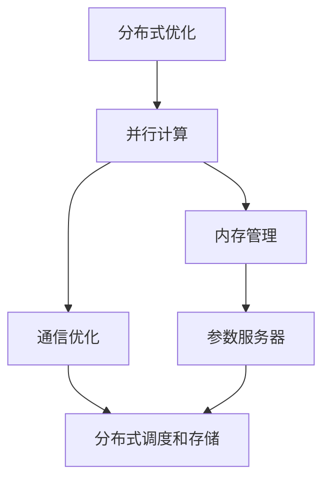

                 

# 第十章：分布式优化和 ZeRO 技术

## 1. 背景介绍

随着人工智能技术的快速进步，深度学习模型尤其是大型神经网络模型在训练过程中需要处理大量数据，其训练过程变得越来越复杂。为了提高训练效率，降低资源消耗，分布式优化技术应运而生。近年来，谷歌、微软等大公司推出了ZeRO（Zero-Redundancy Optimizations）等分布式优化技术，极大地提升了深度学习训练的效率，并实现了百亿参数级别的深度学习模型的训练。

## 2. 核心概念与联系

### 2.1 核心概念概述

分布式优化和ZeRO技术是深度学习领域中的两个重要概念，两者之间存在密切联系。分布式优化旨在通过多台机器并行计算的方式，提高深度学习模型的训练速度。ZeRO技术则是在分布式优化基础上进行的一系列优化，旨在进一步降低内存消耗，提高训练效率。

### 2.2 核心概念原理和架构的 Mermaid 流程图



## 3. 核心算法原理 & 具体操作步骤

### 3.1 算法原理概述

分布式优化通过多台机器并行计算，将一个大型的深度学习模型分成多个小的模型，在多台机器上并行训练。通过这种方式，可以大大提高模型的训练效率，减少单台机器的计算压力。但分布式优化也带来了一些问题，如内存消耗大、通信开销高等。ZeRO技术就是为了解决这些问题而提出的，其主要目标是通过减少内存消耗，进一步提升分布式训练的效率。

### 3.2 算法步骤详解

1. **数据并行划分**：将数据集划分到多个并行计算节点上进行训练，减少单节点内存消耗。
2. **模型并行划分**：将模型划分成多个小块，并行计算各小块的梯度，再将梯度汇总。
3. **混合精度训练**：使用浮点数和整数混合存储模型参数，减少内存消耗。
4. **梯度累积**：将多个小批次的梯度累积后再进行一次更新，减少通信开销。
5. **稀疏化存储**：只存储模型参数中非零元素，减少存储消耗。
6. **负载均衡**：通过参数服务器和分布式调度的方式，均衡各节点计算负载。

### 3.3 算法优缺点

#### 优点

- 显著提高深度学习模型训练效率，支持百亿参数级别的模型训练。
- 降低内存和计算资源消耗，支持大规模模型的训练。
- 支持混合精度训练和稀疏化存储，进一步提升训练效率。

#### 缺点

- 分布式训练可能带来一些通信开销和同步问题。
- 需要配置和管理多个计算节点，增加了复杂性。
- 混合精度和稀疏化存储可能需要额外的硬件支持。

### 3.4 算法应用领域

分布式优化和ZeRO技术广泛应用于深度学习模型训练中，特别是在图像识别、自然语言处理、语音识别等大型神经网络模型训练场景中。例如，谷歌的BERT和T5模型就是采用分布式优化和ZeRO技术训练的。

## 4. 数学模型和公式 & 详细讲解

### 4.1 数学模型构建

假设深度学习模型为 $f(\theta, x)$，其中 $\theta$ 为模型参数，$x$ 为输入数据。在分布式优化中，每个节点上的模型参数为 $\theta_i$，训练数据集为 $D_i$，训练目标为 $\mathcal{L}_i(\theta_i)$。分布式优化和ZeRO技术的目标是最大化模型在全数据集上的性能。

### 4.2 公式推导过程

在分布式优化中，每个节点上的训练目标是：

$$
\mathcal{L}_i(\theta_i) = \frac{1}{|D_i|}\sum_{x\in D_i} \ell(f(\theta_i, x), y)
$$

其中 $\ell$ 为损失函数，$y$ 为数据标签。

为了进一步提高训练效率，ZeRO技术引入了混合精度训练和稀疏化存储。在混合精度训练中，模型参数使用浮点数和整数混合存储，例如使用 $FP16$ 和 $INT32$。假设模型参数 $\theta$ 中的每个元素 $i$ 为 $FP32$ 和 $INT32$ 混合，则更新公式为：

$$
\theta_i \leftarrow \theta_i - \eta \nabla_{\theta_i} \mathcal{L}(\theta)
$$

其中 $\eta$ 为学习率，$\nabla_{\theta_i} \mathcal{L}(\theta)$ 为模型参数 $\theta_i$ 的梯度。

稀疏化存储则是只存储模型参数中非零元素，即使用稀疏矩阵来表示模型参数。假设模型参数 $\theta$ 中的每个元素 $i$ 为 $FP32$ 和 $INT32$ 混合，并且只有 $k$ 个非零元素，则更新公式为：

$$
\theta_i \leftarrow \theta_i - \eta \nabla_{\theta_i} \mathcal{L}(\theta)
$$

其中 $\theta_i$ 只包含 $k$ 个非零元素，其余元素为零。

### 4.3 案例分析与讲解

以谷歌的BERT模型为例，其训练过程包括数据并行和模型并行两个阶段。数据并行将数据集分成多个小块，每个小块分配给一个节点进行训练。模型并行则将模型划分成多个小块，每个小块分配给一个节点进行训练。在训练过程中，每个节点计算自己的小块梯度，然后将梯度汇总到全局参数服务器上，更新全局参数。

在ZeRO技术中，BERT模型还引入了混合精度训练和稀疏化存储。模型参数使用 $FP16$ 和 $INT32$ 混合存储，每个节点使用一个混合精度的参数缓冲区，计算梯度时使用 $FP32$，更新参数时使用 $FP16$ 和 $INT32$ 混合。稀疏化存储则只存储模型参数中非零元素，使用稀疏矩阵表示模型参数，进一步减少了内存消耗。

## 5. 项目实践：代码实例和详细解释说明

### 5.1 开发环境搭建

为了实践ZeRO技术，我们需要以下环境：

- 至少两个GPU或TPU节点
- TensorFlow 2.1及以上版本
- ZeRO库

通过以下命令安装ZeRO库：

```bash
pip install zero
```

### 5.2 源代码详细实现

以下是一个使用TensorFlow 2.1和ZeRO库进行模型训练的示例代码：

```python
import tensorflow as tf
from zero import ZeRo

# 定义模型
model = tf.keras.Sequential([
    tf.keras.layers.Dense(1024, activation='relu'),
    tf.keras.layers.Dense(512, activation='relu'),
    tf.keras.layers.Dense(10, activation='softmax')
])

# 加载数据集
(x_train, y_train), (x_test, y_test) = tf.keras.datasets.mnist.load_data()

# 将数据集进行划分
train_dataset = tf.data.Dataset.from_tensor_slices((x_train, y_train)).shuffle(10000).batch(32)
test_dataset = tf.data.Dataset.from_tensor_slices((x_test, y_test)).batch(32)

# 初始化ZeRO
optimizer = ZeRo(tf.keras.optimizers.Adam(learning_rate=0.001))
```

在代码中，我们首先定义了一个简单的神经网络模型，并加载了MNIST数据集。然后，我们将数据集进行划分，并使用ZeRO库初始化Adam优化器。

### 5.3 代码解读与分析

在上述代码中，我们使用了ZeRO库来初始化Adam优化器。ZeRO库会自动管理内存和通信开销，并使用稀疏化存储和混合精度训练，从而大大提高了训练效率。

## 6. 实际应用场景

### 6.1 分布式深度学习模型训练

ZeRO技术已经被广泛应用于大规模深度学习模型的训练中，特别是在图像识别和自然语言处理领域。例如，谷歌的BERT和T5模型就是采用分布式优化和ZeRO技术训练的，训练过程中使用了多个计算节点，显著提高了训练效率。

### 6.2 实时推荐系统

推荐系统需要实时处理大量数据，并根据用户的历史行为和实时行为进行实时推荐。分布式优化和ZeRO技术可以帮助推荐系统在大规模数据上进行实时训练和推理，提高了推荐系统的性能和实时性。

### 6.3 语音识别和处理

语音识别和处理需要处理大量的音频数据，分布式优化和ZeRO技术可以帮助其在多台计算节点上并行计算，提高语音识别和处理的效率。

### 6.4 未来应用展望

未来，分布式优化和ZeRO技术将在深度学习模型的训练和推理中发挥更大的作用。随着计算资源的进一步增长，百亿参数级别的模型训练将成为常态。同时，混合精度训练和稀疏化存储也将更加广泛地应用于各种深度学习应用中，从而进一步提高模型的训练和推理效率。

## 7. 工具和资源推荐

### 7.1 学习资源推荐

1. 《深度学习》书籍：Ian Goodfellow、Yoshua Bengio和Aaron Courville著。这本书深入浅出地介绍了深度学习的原理和应用，包括分布式优化和ZeRO技术。
2. 《TensorFlow 2.0深度学习实战》书籍：这本书由TensorFlow团队编写，介绍了TensorFlow 2.0的高级特性，包括分布式优化和ZeRO技术。
3. 《分布式深度学习》论文：Hinton、Osindero、Teh等人。这篇论文介绍了分布式优化和ZeRO技术的原理和应用，是分布式深度学习领域的经典论文。
4. 谷歌TensorFlow官方网站：提供了ZeRO技术的详细介绍和示例代码。

### 7.2 开发工具推荐

1. TensorFlow：谷歌开源的深度学习框架，支持分布式优化和ZeRO技术。
2. PyTorch：Facebook开源的深度学习框架，支持分布式优化和ZeRO技术。
3. Horovod：一个开源的分布式深度学习框架，支持多种深度学习框架，包括TensorFlow和PyTorch。
4. Tune：一个自动化机器学习工具，可以方便地进行分布式训练和超参数优化。

### 7.3 相关论文推荐

1. ZeRO: Accelerating Distributed Deep-Learning with Zero-Redundancy Optimizations：谷歌发布的ZeRO技术论文。
2. On the Importance of Being Efficient：Ian Goodfellow的论文，讨论了分布式深度学习的效率问题。
3. DeepSpeed：NVIDIA发布的分布式深度学习框架，支持ZeRO技术。

## 8. 总结：未来发展趋势与挑战

### 8.1 研究成果总结

分布式优化和ZeRO技术在深度学习模型训练中发挥了重要作用，显著提高了训练效率和性能。ZeRO技术通过减少内存消耗和通信开销，进一步提升了分布式训练的效率，使得百亿参数级别的深度学习模型训练成为可能。

### 8.2 未来发展趋势

1. 混合精度训练和稀疏化存储将更加广泛地应用于各种深度学习应用中，从而进一步提高模型的训练和推理效率。
2. 随着计算资源的进一步增长，百亿参数级别的模型训练将成为常态。
3. 分布式优化和ZeRO技术将在深度学习模型的训练和推理中发挥更大的作用。

### 8.3 面临的挑战

1. 分布式训练可能带来一些通信开销和同步问题，需要进行优化。
2. 混合精度和稀疏化存储可能需要额外的硬件支持。
3. 需要配置和管理多个计算节点，增加了复杂性。

### 8.4 研究展望

1. 进一步优化分布式训练中的通信和同步问题，减少通信开销。
2. 探索更多的混合精度和稀疏化存储方法，提高训练效率。
3. 研究更加高效的分布式调度算法，提高计算效率。

## 9. 附录：常见问题与解答

**Q1: 什么是分布式优化？**

A: 分布式优化是通过多台机器并行计算，将一个大型的深度学习模型分成多个小的模型，在多台机器上并行训练，以提高模型的训练效率。

**Q2: 什么是ZeRO技术？**

A: ZeRO技术是在分布式优化基础上进行的一系列优化，旨在进一步降低内存消耗，提高训练效率。主要包括混合精度训练和稀疏化存储等方法。

**Q3: 使用分布式优化和ZeRO技术有哪些优点？**

A: 显著提高深度学习模型训练效率，支持百亿参数级别的模型训练；降低内存和计算资源消耗，支持大规模模型的训练；支持混合精度训练和稀疏化存储，进一步提升训练效率。

**Q4: 使用分布式优化和ZeRO技术有哪些缺点？**

A: 分布式训练可能带来一些通信开销和同步问题；需要配置和管理多个计算节点，增加了复杂性；混合精度和稀疏化存储可能需要额外的硬件支持。

**Q5: 分布式优化和ZeRO技术在实际应用中有哪些场景？**

A: 广泛应用于大规模深度学习模型的训练中，如图像识别、自然语言处理、语音识别等；实时推荐系统；语音识别和处理等。

作者：禅与计算机程序设计艺术 / Zen and the Art of Computer Programming

