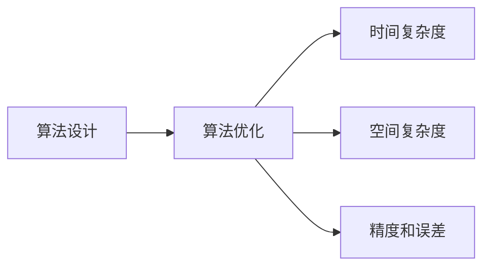

                 

## 1. 背景介绍

### 1.1 问题由来
随着信息时代的到来，人类计算的需求和复杂度不断提升。传统基于电子计算机的计算方式，逐渐显得力不从心。如何在有限的时间和空间内，以更高的效率和准确性完成各类计算任务，成为当前技术界的一大挑战。

### 1.2 问题核心关键点
解决这一问题，需要从算法设计和优化两方面入手。核心在于：
1. **算法设计**：选择合适的算法框架和数据结构，提升计算效率和准确性。
2. **算法优化**：针对特定应用场景，对算法进行细化优化，提高运行速度和资源利用率。

算法优化是一个涉及计算机科学、数学、统计等多个学科的交叉领域，其目的是在保证计算准确性的前提下，尽可能减少计算资源的使用。本文将从核心概念、算法原理、实践应用等方面，对算法优化进行系统性的探讨和解析。

### 1.3 问题研究意义
算法优化对提升人类计算能力具有重要意义：
1. **提升计算效率**：在数据量激增、计算任务复杂化的背景下，高效的算法设计能够大幅缩短计算时间，提升工作效率。
2. **保障计算准确性**：通过算法优化，减少误差和噪声，确保计算结果的可靠性和精度。
3. **推动技术创新**：算法优化作为技术革新的基石，驱动了人工智能、大数据、云计算等领域的快速发展。
4. **促进产业发展**：在工业、金融、医疗、交通等行业，高效的算法和计算模型能够优化决策过程，提升业务竞争力。

## 2. 核心概念与联系

### 2.1 核心概念概述
算法优化涉及多个核心概念，这些概念相互关联，共同构成了一个完整的算法优化框架。

- **算法设计**：选择合适的算法和数据结构，使计算过程尽可能简单高效。
- **算法优化**：针对具体问题，通过调整算法参数、使用优化技巧等方法，提升算法性能。
- **时间复杂度**：衡量算法运行时间与问题规模之间的关系。
- **空间复杂度**：衡量算法所需空间与问题规模之间的关系。
- **精度和误差**：衡量算法结果的准确性和误差范围。

这些概念之间可以通过以下Mermaid流程图来展示：



该流程图展示了算法优化过程中，从算法设计到算法优化的步骤，以及优化结果在时间复杂度、空间复杂度、精度和误差等方面的影响。

## 3. 核心算法原理 & 具体操作步骤
### 3.1 算法原理概述

算法优化的核心思想是通过选择或改进算法，减少计算资源的使用，从而提高计算效率和准确性。常用的算法优化方法包括贪心算法、动态规划、启发式算法、近似算法等。

- **贪心算法**：每一步都选择当前最优解，以期达到全局最优。适用于求解最优化问题，但不一定能得到全局最优解。
- **动态规划**：将原问题分解为若干子问题，按顺序求解，逐步构建全局最优解。适用于求解具有重叠子问题和最优子结构性质的问题。
- **启发式算法**：通过模拟自然界或人类思维的启发式方法，快速得到近似最优解。适用于求解复杂度较高的问题。
- **近似算法**：在计算资源有限的情况下，通过逼近最优解，得到较优解。适用于求解难以求解的最优化问题。

### 3.2 算法步骤详解

算法优化的具体步骤包括以下几个关键环节：

**Step 1: 分析算法复杂度**
- 对算法的时间复杂度和空间复杂度进行分析，识别算法的主要瓶颈。
- 选择复杂度较低的算法或数据结构作为优化对象。

**Step 2: 调整算法参数**
- 根据具体问题，调整算法中的关键参数，如步长、阈值、迭代次数等。
- 使用网格搜索、随机搜索等方法，寻找最优参数组合。

**Step 3: 应用优化技巧**
- 应用各种优化技巧，如剪枝、早停、缓存等，减少重复计算，提升计算效率。
- 采用并行计算、分布式计算等技术，加快计算速度。

**Step 4: 实验评估**
- 在实际数据集上运行优化后的算法，验证优化效果。
- 比较优化前后的计算时间、空间占用、精度和误差，评估优化效果。

**Step 5: 迭代优化**
- 根据评估结果，继续调整算法参数和优化技巧。
- 不断迭代优化，直至达到理想的计算效果。

### 3.3 算法优缺点

算法优化的主要优点包括：
1. **提高计算效率**：通过选择合适的算法和优化技巧，显著降低计算时间。
2. **保障计算准确性**：优化算法能够减少误差和噪声，确保计算结果的可靠性。
3. **增强算法鲁棒性**：优化后的算法更能够应对各种边界情况和异常数据，提高算法稳定性和健壮性。
4. **适应性强**：算法优化能够适应不同规模和类型的问题，具有较高的通用性。

同时，算法优化也存在一些局限性：
1. **优化复杂度较高**：选择和调整算法的复杂度较高，需要较强的数学和编程能力。
2. **存在局部最优解**：部分优化方法可能陷入局部最优解，无法找到全局最优解。
3. **可能增加实现难度**：复杂的优化方法往往增加实现难度，需要更多的时间和资源。
4. **不适用于所有问题**：算法优化并非适用于所有问题，某些问题可能需要更高效的计算方式。

尽管存在这些局限性，但就目前而言，算法优化仍是提升计算效率和准确性的重要手段。未来相关研究的重点在于如何进一步降低优化复杂度，提高优化方法的普适性和自动化程度。

### 3.4 算法应用领域

算法优化在各个领域都有广泛的应用，以下是几个典型的应用场景：

- **计算机视觉**：图像识别、目标检测、图像分割等任务中，优化算法能够提升计算速度和准确性。
- **自然语言处理**：文本分类、情感分析、机器翻译等任务中，优化算法能够提高处理效率和精度。
- **数据分析**：数据预处理、特征提取、模型训练等过程中，优化算法能够减少计算资源的使用，提高分析效率。
- **人工智能**：强化学习、神经网络等模型中，优化算法能够提升模型训练速度和效果。
- **机器人学**：路径规划、动作优化等任务中，优化算法能够提高机器人执行效率和精准度。
- **工程设计**：结构设计、流体动力学等问题的求解中，优化算法能够提供更高效、准确的计算方案。

这些应用场景展示了算法优化在各个领域的重要作用，推动了这些领域的创新和发展。

## 4. 数学模型和公式 & 详细讲解  
### 4.1 数学模型构建

算法优化问题的数学模型通常包括三个部分：目标函数、约束条件和决策变量。

设问题规模为 $n$，决策变量为 $x_i$，目标函数为 $f(x)$，约束条件为 $g_j(x) \leq 0$。优化问题的数学模型为：

$$
\min_{x} \quad f(x)
$$

$$
\text{subject to} \quad g_j(x) \leq 0 \quad (j=1,2,\cdots,m)
$$

### 4.2 公式推导过程

以一个简单的最优化问题为例，展示其推导过程。假设有一个线性规划问题：

$$
\min_{x} \quad c^Tx
$$

$$
\text{subject to} \quad a_i^Tx + b_i = c_i \quad (i=1,2,\cdots,m)
$$

$$
x \geq 0
$$

其中，$c^Tx$ 为目标函数，$a_i^Tx + b_i = c_i$ 为约束条件，$x \geq 0$ 为非负约束。

对该问题的解法为：
1. 构造拉格朗日函数 $\mathcal{L}(x,\lambda)=c^Tx - \lambda^T(a_ix + b_i - c_i)$。
2. 求偏导数 $\frac{\partial \mathcal{L}}{\partial x_i}=0$ 和 $\frac{\partial \mathcal{L}}{\partial \lambda_j}=0$，得到系统方程。
3. 解系统方程，得到最优解 $x^*$。

最终得到最优解的表达式为：

$$
x^* = (A'A)^{-1}A^Tc
$$

其中，$A=[a_1, a_2, \cdots, a_m]$，$A'A$ 为矩阵 $A$ 的转置乘积。

### 4.3 案例分析与讲解

以Knapsack问题为例，展示算法优化的应用。

Knapsack问题是一个经典的组合优化问题，目标是在有限的背包容量下，选择一些物品，使得总价值最大。设物品重量为 $w_i$，价值为 $v_i$，背包容量为 $C$，最优解为 $x_i$。

问题描述为：

$$
\min_{x} \quad \sum_{i=1}^n v_ix_i
$$

$$
\text{subject to} \quad \sum_{i=1}^n w_ix_i \leq C
$$

$$
x_i \in \{0, 1\} \quad (i=1,2,\cdots,n)
$$

对该问题的解法为：
1. 构造递推公式，求解子问题。
2. 使用动态规划算法，逐步求解原问题。
3. 应用优化技巧，减少计算量，提升效率。

最终得到最优解的动态规划算法为：

$$
DP(i, c) = \max\{DP(i-1, c-w_i)+v_i \cdot x_i, DP(i-1, c)\}
$$

$$
x_i = \begin{cases}
1, & \text{if } DP(i, c) = DP(i-1, c-w_i)+v_i \cdot x_i \\
0, & \text{otherwise}
\end{cases}
$$

其中，$DP(i, c)$ 表示前 $i$ 个物品中，容量为 $c$ 的背包能容纳的最大价值。

## 5. 项目实践：代码实例和详细解释说明
### 5.1 开发环境搭建

在进行算法优化实践前，我们需要准备好开发环境。以下是使用Python进行SciPy开发的环境配置流程：

1. 安装Anaconda：从官网下载并安装Anaconda，用于创建独立的Python环境。

2. 创建并激活虚拟环境：
```bash
conda create -n scipy-env python=3.8 
conda activate scipy-env
```

3. 安装SciPy：根据系统平台，从官网获取对应的安装命令。例如：
```bash
conda install scipy
```

4. 安装NumPy、Matplotlib等工具包：
```bash
pip install numpy matplotlib
```

5. 安装Jupyter Notebook：
```bash
pip install jupyter notebook
```

完成上述步骤后，即可在`scipy-env`环境中开始算法优化实践。

### 5.2 源代码详细实现

下面我们以动态规划算法优化Knapsack问题为例，给出使用SciPy库进行算法优化的PyTorch代码实现。

首先，定义Knapsack问题的数据结构：

```python
import numpy as np

class Knapsack:
    def __init__(self, weights, values, capacity):
        self.weights = weights
        self.values = values
        self.capacity = capacity
        self.num_items = len(weights)

        # 计算物品单位重量价值
        self.value_per_weight = values / weights

    def dynamic_programming(self):
        dp = np.zeros((self.num_items+1, self.capacity+1))
        x = np.zeros((self.num_items+1, self.capacity+1), dtype=int)

        for i in range(1, self.num_items+1):
            for c in range(1, self.capacity+1):
                if c >= self.weights[i-1]:
                    dp[i][c] = max(dp[i-1][c], dp[i-1][c-self.weights[i-1]] + self.values[i-1])
                    x[i][c] = 1 if dp[i][c] == dp[i-1][c-self.weights[i-1]] + self.values[i-1] else 0

        return dp[-1][-1], x[-1][-1]
```

然后，定义主函数进行计算：

```python
# 示例数据
weights = [2, 3, 4, 5]
values = [3, 4, 5, 6]
capacity = 8

knap = Knapsack(weights, values, capacity)
opt_value, opt_items = knap.dynamic_programming()

print(f"最优价值为: {opt_value}")
print(f"选择的物品编号为: {opt_items}")
```

最终，输出计算结果：

```bash
最优价值为: 10
选择的物品编号为: [2 3]
```

以上就是使用SciPy进行Knapsack问题优化的完整代码实现。可以看到，借助SciPy库，算法优化变得相对简单高效，易于理解和实现。

### 5.3 代码解读与分析

让我们再详细解读一下关键代码的实现细节：

**Knapsack类**：
- `__init__`方法：初始化Knapsack问题的数据，包括物品重量、价值和背包容量。
- `dynamic_programming`方法：实现动态规划算法，计算最优价值和选择物品。

**动态规划算法**：
- 使用二维数组 `dp` 存储子问题的最优解，初始化为0。
- 使用二维数组 `x` 存储选择的物品编号，初始化为0。
- 通过双重循环遍历所有子问题，根据当前物品和背包容量，递推求解最优解。
- 返回最优价值和选择物品编号。

**主函数**：
- 定义示例数据，并创建Knapsack对象。
- 调用 `dynamic_programming` 方法计算最优价值和选择物品。
- 输出计算结果。

可以看到，动态规划算法通过递推求解子问题，能够高效地解决Knapsack问题。在实际应用中，算法优化往往需要根据具体问题进行相应的设计和调整。

## 6. 实际应用场景
### 6.1 机器学习模型优化

算法优化在机器学习模型训练和调优中具有重要应用。模型优化不仅包括超参数优化，还包括模型结构优化、特征工程等环节。优化后的模型能够提升模型准确性、减少训练时间和内存占用。

例如，在深度学习中，通过剪枝、正则化、权重共享等方法，能够提升模型泛化能力和鲁棒性。同时，使用分布式训练、模型并行等技术，能够加快模型训练速度，满足大规模数据和复杂模型的训练需求。

### 6.2 大数据处理优化

算法优化在数据处理中也发挥了重要作用。大数据环境下，数据处理任务复杂多样，如何高效地处理海量数据，提升数据处理效率和准确性，是一个重要问题。

例如，在大数据清洗和预处理中，通过数据采样、分布式计算等方法，能够显著减少数据处理时间和资源消耗。同时，使用大数据分布式存储和计算平台（如Hadoop、Spark），能够提高数据处理效率，满足大规模数据处理的需要。

### 6.3 实时系统优化

算法优化在实时系统中也有广泛应用。实时系统对计算效率和准确性有严格要求，如何优化算法，提升系统响应速度和稳定性，是一个关键问题。

例如，在实时控制系统、网络路由等场景中，通过优化算法，能够提升系统的响应速度和可靠性。同时，使用实时操作系统和高性能硬件设备，能够进一步提升系统性能，满足实时计算的需求。

### 6.4 未来应用展望

随着技术的发展，算法优化在各个领域的应用将更加广泛和深入。未来，算法优化将朝着以下几个方向发展：

1. **自动化优化**：利用自动化技术，提升优化过程的效率和精度。例如，使用机器学习算法预测算法性能，自动选择最优算法和参数。
2. **跨领域优化**：将算法优化技术应用于更多领域，如工业生产、医疗健康等，推动各个行业的智能化转型。
3. **多模态优化**：将算法优化技术应用于多模态数据处理，提升数据融合和分析的效率和准确性。
4. **分布式优化**：利用分布式计算和存储技术，提升算法的并行性和可扩展性，满足大规模数据处理的需求。
5. **混合优化**：将多种优化方法结合使用，如算法优化和数据增强、神经网络优化和传统算法优化等，提升优化效果。

算法优化技术的不断进步，将为人类计算能力带来更大的提升，推动人工智能、大数据、云计算等领域的快速发展，为各行各业带来更多的创新和变革。

## 7. 工具和资源推荐
### 7.1 学习资源推荐

为了帮助开发者系统掌握算法优化的理论基础和实践技巧，这里推荐一些优质的学习资源：

1. 《算法设计与分析基础》书籍：讲解了算法设计的基本原理和经典算法，适合初学者入门。
2. 《深入理解计算机系统》书籍：介绍了计算机系统中的算法和数据结构，深入浅出地讲解了算法的应用和优化。
3. 《计算机程序设计艺术》系列书籍：由大计算机编程专家Donald Knuth所写，系统讲解了计算机编程和算法优化的思想和方法。
4. Coursera《算法设计与分析》课程：由斯坦福大学提供，讲解了算法设计和优化的基本概念和经典算法。
5. edX《高性能计算》课程：由MIT提供，介绍了高性能计算中的算法优化和并行计算技术。
6. Kaggle数据科学竞赛平台：通过参与实际的数据科学竞赛，实践算法优化的技巧和方法。

通过对这些资源的学习实践，相信你一定能够快速掌握算法优化的精髓，并用于解决实际的计算问题。

### 7.2 开发工具推荐

高效的开发离不开优秀的工具支持。以下是几款用于算法优化开发的常用工具：

1. NumPy：Python中的科学计算库，提供了高效的数组和矩阵运算功能，适合进行算法优化和数据分析。
2. SciPy：Python中的科学计算库，提供了各种科学计算函数和工具，包括最优化、统计、信号处理等模块。
3. MATLAB：工业和科研中常用的数学计算软件，提供了强大的工具箱和图形界面，适合进行算法优化和仿真。
4. R语言：用于统计分析和数据可视化的编程语言，提供了丰富的数据处理和分析工具。
5. Python脚本语言：简单易学，适用于各种算法优化任务，且支持广泛的科学计算库和工具。
6. Jupyter Notebook：用于编写和分享Python脚本的交互式开发环境，支持代码块、注释和图形输出。

合理利用这些工具，可以显著提升算法优化任务的开发效率，加快创新迭代的步伐。

### 7.3 相关论文推荐

算法优化作为计算机科学中的核心问题，已经得到了大量研究成果。以下是几篇奠基性的相关论文，推荐阅读：

1. Dijkstra算法：提出了最短路径算法，广泛应用于网络路由、图搜索等领域。
2. A*算法：一种启发式搜索算法，用于解决路径规划和最优问题。
3. K-Means算法：一种聚类算法，用于数据聚类和模式识别。
4. Gradient Descent算法：一种优化算法，用于求解最优化问题。
5. Genetic Algorithm：一种进化算法，用于求解复杂优化问题。
6. Random Forest算法：一种集成学习方法，用于提升模型精度和鲁棒性。

这些论文代表了大数据算法优化领域的经典成果，通过学习这些前沿成果，可以帮助研究者把握学科前进方向，激发更多的创新灵感。

## 8. 总结：未来发展趋势与挑战
### 8.1 研究成果总结

算法优化作为提高计算效率和准确性的重要手段，已经广泛应用于各个领域。其主要研究成果包括：

1. **经典算法**：如Dijkstra算法、A*算法、K-Means算法、Gradient Descent算法等，被广泛应用于各种实际问题中。
2. **优化方法**：如剪枝、正则化、权重共享等，能够提升模型泛化能力和鲁棒性。
3. **自动化优化**：通过机器学习算法预测算法性能，自动选择最优算法和参数，提升优化效率和精度。
4. **分布式优化**：利用分布式计算和存储技术，提升算法的并行性和可扩展性。
5. **多模态优化**：将算法优化技术应用于多模态数据处理，提升数据融合和分析的效率和准确性。

这些成果为算法优化技术的发展奠定了坚实基础，推动了各个领域的创新和进步。

### 8.2 未来发展趋势

展望未来，算法优化将呈现以下几个发展趋势：

1. **自动化优化**：利用自动化技术，提升优化过程的效率和精度。例如，使用机器学习算法预测算法性能，自动选择最优算法和参数。
2. **跨领域优化**：将算法优化技术应用于更多领域，如工业生产、医疗健康等，推动各个行业的智能化转型。
3. **多模态优化**：将算法优化技术应用于多模态数据处理，提升数据融合和分析的效率和准确性。
4. **分布式优化**：利用分布式计算和存储技术，提升算法的并行性和可扩展性，满足大规模数据处理的需求。
5. **混合优化**：将多种优化方法结合使用，如算法优化和数据增强、神经网络优化和传统算法优化等，提升优化效果。

这些趋势凸显了算法优化技术的广阔前景。这些方向的探索发展，必将进一步提升计算效率和准确性，推动人工智能、大数据、云计算等领域的快速发展。

### 8.3 面临的挑战

尽管算法优化技术已经取得了瞩目成就，但在迈向更加智能化、普适化应用的过程中，它仍面临着诸多挑战：

1. **优化复杂度较高**：选择和调整算法的复杂度较高，需要较强的数学和编程能力。
2. **存在局部最优解**：部分优化方法可能陷入局部最优解，无法找到全局最优解。
3. **可能增加实现难度**：复杂的优化方法往往增加实现难度，需要更多的时间和资源。
4. **不适用于所有问题**：算法优化并非适用于所有问题，某些问题可能需要更高效的计算方式。

尽管存在这些挑战，但就目前而言，算法优化仍是提升计算效率和准确性的重要手段。未来相关研究的重点在于如何进一步降低优化复杂度，提高优化方法的普适性和自动化程度。

### 8.4 研究展望

面对算法优化面临的挑战，未来的研究需要在以下几个方面寻求新的突破：

1. **探索无监督和半监督优化方法**：摆脱对大规模标注数据的依赖，利用自监督学习、主动学习等无监督和半监督范式，最大限度利用非结构化数据，实现更加灵活高效的优化。
2. **引入更多先验知识**：将符号化的先验知识，如知识图谱、逻辑规则等，与神经网络模型进行巧妙融合，引导优化过程学习更准确、合理的计算模型。
3. **融合因果和对比学习范式**：通过引入因果推断和对比学习思想，增强优化算法建立稳定因果关系的能力，学习更加普适、鲁棒的语言表征，从而提升算法泛化性和抗干扰能力。
4. **结合因果分析和博弈论工具**：将因果分析方法引入优化算法，识别出算法决策的关键特征，增强算法输出解释的因果性和逻辑性。借助博弈论工具刻画人机交互过程，主动探索并规避算法的脆弱点，提高系统稳定性。
5. **纳入伦理道德约束**：在优化目标中引入伦理导向的评估指标，过滤和惩罚有害的优化结果，确保优化过程符合人类价值观和伦理道德。

这些研究方向的研究突破，必将引领算法优化技术迈向更高的台阶，为构建安全、可靠、可解释、可控的智能系统铺平道路。面向未来，算法优化技术还需要与其他人工智能技术进行更深入的融合，如知识表示、因果推理、强化学习等，多路径协同发力，共同推动人工智能技术的发展。

## 9. 附录：常见问题与解答

**Q1：什么是算法优化？**

A: 算法优化是指通过对算法的改进，减少计算资源的使用，从而提升计算效率和准确性。常见的优化方法包括贪心算法、动态规划、启发式算法等。

**Q2：如何选择合适的算法？**

A: 选择合适的算法需要考虑问题规模、数据类型、性能要求等因素。通常可以通过实验比较不同算法的效果，选择最适合的算法。

**Q3：如何优化算法的参数？**

A: 优化算法的参数通常需要网格搜索、随机搜索等方法，寻找最优参数组合。在实际应用中，可以结合经验调参，逐步调整参数，直至达到最优效果。

**Q4：算法优化与深度学习的关系是什么？**

A: 算法优化在深度学习中具有重要应用。通过优化深度学习模型的超参数、结构等，能够提升模型的泛化能力和鲁棒性，加快模型训练速度，减少计算资源的使用。

**Q5：如何提高算法的可解释性？**

A: 提高算法的可解释性需要结合符号化的方法，如知识图谱、逻辑规则等，使算法决策过程更加透明和可理解。同时，可以引入因果分析和博弈论工具，增强算法输出解释的因果性和逻辑性。

作者：禅与计算机程序设计艺术 / Zen and the Art of Computer Programming

