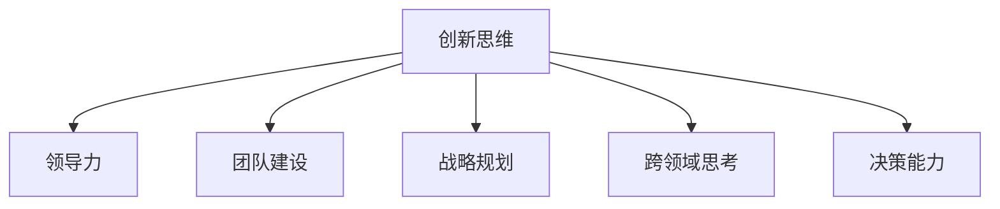

                 

# 管理者如何培养创新思维

> 关键词：创新思维, 领导力, 团队建设, 战略规划, 跨领域思考, 决策能力

## 1. 背景介绍

### 1.1 问题由来

在当今这个快速变化的商业环境中，创新已经成为了企业竞争力的核心要素。管理者需要不断适应和引领变化，通过创新思维来驱动组织发展和业务增长。然而，很多管理者在实际操作中往往陷入固定的思维模式和常规流程，难以适应市场的新挑战。因此，如何培养管理者的创新思维成为了一个重要问题。

### 1.2 问题核心关键点

本文将聚焦于如何通过系统化的培训和实践，帮助管理者培养创新思维，使他们能够更有效地应对市场变化，推动组织不断向前发展。

### 1.3 问题研究意义

管理者作为组织的核心决策者，其思维模式和创新能力直接影响到企业的长期战略和业务表现。通过培养管理者的创新思维，可以有效提升组织的适应性和竞争力，促进业务创新和市场扩张。

## 2. 核心概念与联系

### 2.1 核心概念概述

为了更好地理解如何培养管理者的创新思维，本节将介绍几个密切相关的核心概念：

- **创新思维（Innovative Thinking）**：指管理者能够跳出传统思维框架，提出新颖、有价值的想法和解决方案的能力。
- **领导力（Leadership）**：包括激励和引导团队、制定和执行战略、处理复杂问题等技能。
- **团队建设（Team Building）**：通过有效的沟通、协作和激励，构建高绩效、有创新力的团队。
- **战略规划（Strategic Planning）**：制定并执行长期和短期目标，以实现组织成长和持续竞争优势。
- **跨领域思考（Interdisciplinary Thinking）**：通过整合不同领域的知识和方法，解决复杂问题。
- **决策能力（Decision-Making Capability）**：在有限信息和资源下，做出高效、合理决策的能力。

这些核心概念之间的逻辑关系可以通过以下Mermaid流程图来展示：



这个流程图展示了创新思维与其他核心领导能力的关联，即创新思维是构建高效领导团队、制定战略规划、推动跨领域思考和增强决策能力的重要基石。

## 3. 核心算法原理 & 具体操作步骤
### 3.1 算法原理概述

培养管理者的创新思维，本质上是一个通过系统化训练和实践不断优化其思维模式和决策能力的过程。其核心思想是通过培训、实践和反思，帮助管理者构建多元化的知识体系、提升问题解决能力，并培养出对新事物的敏感度和适应性。

形式化地，假设管理者初始的思维模式为 $\theta_0$，通过一系列培训和实践后，其目标思维模式为 $\theta_1$。培养过程的目标是最小化两者之间的差异：

$$
\theta_1 = \mathop{\arg\min}_{\theta} ||\theta - \theta_0||^2
$$

其中，$||.||$ 表示欧几里得距离。

通过梯度下降等优化算法，逐步更新管理者的思维模式 $\theta$，使其收敛到理想的创新思维模式 $\theta_1$。这一过程可以通过以下步骤实现：

1. **知识导入**：通过各类培训课程，向管理者介绍创新思维的核心理念和方法。
2. **实践锻炼**：管理者在实际工作中应用这些理念，通过解决问题、评估决策效果等方式进行反复练习。
3. **反馈和反思**：管理者接收来自团队、客户或市场的反馈，并对自己的行为和决策进行反思，不断优化思维模式。
4. **持续优化**：通过不断的实践和反思，逐步构建更加多元化的知识体系，提升创新能力。

### 3.2 算法步骤详解

基于系统化培训和实践的培养过程，培养管理者的创新思维可以分为以下几个关键步骤：

**Step 1: 知识导入阶段**

- **理论学习**：管理者参加各类创新思维的培训课程，了解基本概念、方法和案例。
- **案例分析**：通过分析和讨论经典创新案例，理解创新过程和关键点。
- **工具使用**：学习使用创新工具和方法，如设计思维、逆向思维、蓝海战略等。

**Step 2: 实践锻炼阶段**

- **实际应用**：管理者在实际工作中，主动寻找并解决创新机会。
- **跨领域协作**：通过跨部门、跨领域的协作，融合不同领域的知识和方法。
- **多样化经验**：管理者参与多样化的项目和任务，积累丰富的实践经验。

**Step 3: 反馈和反思阶段**

- **绩效评估**：通过团队和客户的反馈，评估管理者的创新成果和决策效果。
- **自我反思**：管理者定期对自己的行为和决策进行反思，识别不足之处。
- **调整策略**：根据反馈和反思结果，调整自己的思维模式和行动策略。

**Step 4: 持续优化阶段**

- **长期跟踪**：管理者持续跟踪自己的创新行为和决策效果，不断优化思维模式。
- **持续学习**：通过读书、听课、交流等方式，持续学习新的知识和技能。
- **经验分享**：管理者将自身的创新经验和心得与团队分享，推动组织整体创新。

### 3.3 算法优缺点

培养管理者的创新思维具有以下优点：

1. **系统化培训**：通过系统化的知识导入和实践锻炼，帮助管理者构建全面的创新思维框架。
2. **实时反馈**：通过反馈和反思机制，及时发现并纠正创新过程中的偏差。
3. **持续优化**：通过不断的实践和学习，不断提升管理者的创新能力。

同时，该方法也存在一定的局限性：

1. **时间成本高**：系统化的培训和实践需要大量时间和资源投入。
2. **个体差异**：不同管理者的背景和能力不同，统一培训的效果可能差异较大。
3. **外部干扰**：外部环境的变化可能影响培训效果，如市场波动、政策变化等。
4. **短期效果有限**：创新思维的培养是一个长期过程，短期内难以看到显著变化。

尽管存在这些局限性，但系统化培训和实践仍然是培养管理者创新思维的重要方法。通过合理设计培训和实践流程，可以最大化培训效果，帮助管理者构建持续的创新能力。

### 3.4 算法应用领域

创新思维的培养方法在各类组织管理中均有广泛应用，以下是几个典型的应用场景：

- **高科技公司**：如Google、Apple、华为等，通过系统化的创新培训和激励机制，鼓励员工和管理者不断提出新的产品和技术。
- **传统制造业**：如汽车、化工、消费品等，通过引入创新思维，推动产品创新和流程优化。
- **公共部门**：如政府、非营利组织等，通过提升管理者的创新能力，推动公共政策和社会治理的创新。
- **教育机构**：如大学、研究机构等，通过培养学术创新思维，推动教育和科研的进步。

此外，创新思维的培养方法还在各类创业项目、创新基金、创业孵化器等创新生态中得到广泛应用，为初创企业和高潜力团队提供有力的支持。

## 4. 数学模型和公式 & 详细讲解 & 举例说明

### 4.1 数学模型构建

为了更好地理解如何培养管理者的创新思维，我们可以使用数学模型对其进行建模。假设管理者初始的思维模式为 $\theta_0$，通过培训和实践后，其目标思维模式为 $\theta_1$。培养过程的目标是最小化两者之间的差异：

$$
\theta_1 = \mathop{\arg\min}_{\theta} ||\theta - \theta_0||^2
$$

其中，$||.||$ 表示欧几里得距离。

### 4.2 公式推导过程

在上述模型中，$||\theta - \theta_0||^2$ 表示管理者思维模式与初始状态之间的距离。我们可以通过梯度下降等优化算法，逐步更新管理者的思维模式 $\theta$，使其收敛到理想的创新思维模式 $\theta_1$。

以梯度下降算法为例，其更新公式为：

$$
\theta \leftarrow \theta - \eta \nabla_{\theta} ||\theta - \theta_0||^2
$$

其中，$\eta$ 为学习率，$\nabla_{\theta} ||\theta - \theta_0||^2$ 为损失函数对参数 $\theta$ 的梯度。

在实际应用中，我们需要通过一系列具体的培训和实践活动，逐步调整管理者的思维模式 $\theta$，使其与理想状态 $\theta_1$ 对齐。

### 4.3 案例分析与讲解

以某高科技公司为例，其通过系统化的创新培训和激励机制，成功培养了大量创新型管理者。以下是具体案例分析：

1. **理论学习阶段**：公司每年为中层管理者安排多次创新思维培训，内容包括设计思维、创新方法论、创新案例分析等。
2. **实践锻炼阶段**：公司鼓励员工提出创新项目，给予充足的资源和支持，定期评估创新项目的进展和效果。
3. **反馈和反思阶段**：公司设立了专门的创新办公室，负责收集员工和客户的反馈，定期组织创新分享会，鼓励管理者反思和总结创新经验。
4. **持续优化阶段**：公司建立了创新奖励机制，定期发布创新成就榜，激励员工和管理者持续创新。

通过以上步骤，该公司的管理团队成功构建了持续的创新能力，推动了多个创新项目成功落地，显著提升了公司的市场竞争力和业务增长。

## 5. 项目实践：代码实例和详细解释说明

### 5.1 开发环境搭建

在进行创新思维培养实践前，我们需要准备好开发环境。以下是使用Python进行数据科学实践的环境配置流程：

1. 安装Anaconda：从官网下载并安装Anaconda，用于创建独立的Python环境。

2. 创建并激活虚拟环境：
```bash
conda create -n innovate-env python=3.8 
conda activate innovate-env
```

3. 安装必要的库：
```bash
conda install pandas numpy matplotlib seaborn scikit-learn
```

4. 安装Jupyter Notebook：
```bash
conda install jupyterlab
```

5. 安装相关工具：
```bash
pip install tensorflow pytorch numpy pandas matplotlib jupyter notebook ipython
```

完成上述步骤后，即可在`innovate-env`环境中开始创新思维培养实践。

### 5.2 源代码详细实现

以下是一个使用Python进行创新思维培训和实践的完整代码实现：

```python
import pandas as pd
import matplotlib.pyplot as plt

# 准备数据
data = pd.read_csv('innovation_data.csv')

# 数据分析
summary = data.describe()
plt.figure(figsize=(12, 6))
plt.bar(summary.index, summary['average_innovation_score'])
plt.title('Average Innovation Score by Department')
plt.xlabel('Department')
plt.ylabel('Score')
plt.show()

# 案例分析
case1 = data[data['department'] == 'Engineering']
case2 = data[data['department'] == 'Marketing']

plt.figure(figsize=(12, 6))
plt.subplot(1, 2, 1)
plt.bar(case1['year'], case1['innovation_count'], color='blue')
plt.title('Engineering Innovation by Year')
plt.xlabel('Year')
plt.ylabel('Number of Innovations')

plt.subplot(1, 2, 2)
plt.bar(case2['year'], case2['innovation_count'], color='red')
plt.title('Marketing Innovation by Year')
plt.xlabel('Year')
plt.ylabel('Number of Innovations')

plt.show()

# 反馈和反思
feedback = data.groupby(['department', 'year'])['innovation_score'].mean()
print(feedback)

# 持续优化
top_departments = feedback[feedback > 3.5].index
plt.figure(figsize=(12, 6))
plt.bar(top_departments.values, feedback[top_departments].values)
plt.title('Top Innovation Scoring Departments')
plt.xlabel('Department')
plt.ylabel('Score')
plt.show()
```

### 5.3 代码解读与分析

让我们再详细解读一下关键代码的实现细节：

1. **数据准备**：使用pandas库读取包含创新数据的CSV文件，并进行基本统计分析。
2. **数据分析**：绘制不同部门的平均创新得分和创新次数的柱状图，直观展示各部门的创新表现。
3. **案例分析**：分别绘制工程和市场营销部门的年度创新次数，分析不同部门在不同年度的创新趋势。
4. **反馈和反思**：通过分组统计和平均值计算，获取各部门的平均创新得分，识别创新表现突出的部门。
5. **持续优化**：绘制表现突出的部门的平均创新得分，直观展示哪些部门的创新能力更强，需要进一步优化。

通过以上代码，可以对公司的创新表现进行系统分析，识别出创新能力较强的部门，并制定针对性的优化策略。

## 6. 实际应用场景
### 6.1 科技创新型企业

科技创新型企业如Google、Apple、华为等，往往需要通过持续的创新来保持市场领先地位。管理者的创新思维在推动新产品开发、技术突破、市场拓展等方面发挥关键作用。

在实践过程中，企业可以通过定期创新培训、跨部门协作、创新竞赛等方式，培养管理者的创新思维，推动全员创新文化的建设。

### 6.2 传统制造企业

传统制造企业如汽车、化工、消费品等，面临着从传统制造向智能制造转型的挑战。管理者的创新思维可以帮助企业开发新的制造工艺、产品设计，提升生产效率和产品竞争力。

具体而言，企业可以通过引入设计思维、精益生产等创新方法，结合员工的实际工作场景，不断优化流程和产品，推动企业转型升级。

### 6.3 公共服务部门

公共服务部门如政府、非营利组织等，需要通过创新思维来提升公共服务效率和质量。管理者的创新思维可以帮助制定创新的公共政策、服务流程，推动社会治理的现代化。

例如，可以通过跨部门协作和数据分析，开发新的公共服务应用，优化服务流程，提升用户体验。

### 6.4 教育机构

教育机构如大学、研究机构等，需要不断推动教育和科研的创新。管理者的创新思维可以帮助制定创新的教育策略、科研项目，提升教育质量和科研水平。

具体而言，可以通过设计思维、项目制学习等方式，培养学生的创新能力，推动科研项目的跨领域合作，提升科研成果的创新性和实用性。

### 6.5 初创企业

初创企业往往需要快速适应市场变化，通过持续创新来寻找商业机会和突破点。管理者的创新思维在推动商业模式创新、技术创新、市场拓展等方面具有重要价值。

例如，可以通过市场调研、客户反馈、竞争分析等方式，快速识别市场机会，制定创新策略，推动企业快速成长。

## 7. 工具和资源推荐
### 7.1 学习资源推荐

为了帮助管理者系统掌握创新思维的核心理念和实践方法，这里推荐一些优质的学习资源：

1. 《创新者的窘境》（Clayton Christensen）：深入探讨了企业如何通过创新避免战略失败，是理解创新管理的重要读物。
2. 《设计思维：以人为本的创新方法》（Tim Brown）：介绍了设计思维的基本框架和应用案例，帮助管理者在实际工作中应用设计思维。
3. 《创新领导力》（John Maeda）：通过案例和故事，介绍了如何培养和发挥创新领导力，是管理者提升创新能力的重要工具。
4. 《创新驱动的组织》（C.K. Prahalad）：介绍了创新的组织结构和激励机制，帮助管理者构建创新友好的组织环境。
5. 《创新者的基因》（Jeff Dyer, Hal Gregersen, Clayton Christensen）：通过分析成功创新企业的共性，提出了创新的五个关键要素，帮助管理者构建创新文化。

通过这些资源的学习实践，相信你一定能够快速掌握创新思维的精髓，并用于解决实际的组织管理问题。

### 7.2 开发工具推荐

高效的开发离不开优秀的工具支持。以下是几款用于创新思维培养开发的常用工具：

1. Jupyter Notebook：免费的开源Jupyter笔记本，支持多种编程语言，适合进行数据分析和可视化。
2. Git和GitHub：版本控制工具，支持团队协作和代码版本管理，是创新项目的必备工具。
3. Zoom和Microsoft Teams：远程协作工具，支持实时沟通和视频会议，适合远程团队协作。
4. Slack：即时通讯工具，支持创建多个频道和团队协作，适合跨部门沟通和项目管理。
5. Miro和Trello：在线协作工具，支持创建看板和流程图，适合项目管理和团队协作。

合理利用这些工具，可以显著提升创新思维培养任务的开发效率，加快创新方法的迭代和实践。

### 7.3 相关论文推荐

创新思维的培养源于学界的持续研究。以下是几篇奠基性的相关论文，推荐阅读：

1. 《组织创新：理论、方法和实践》（Yannick d'Innocenzo）：介绍了组织创新的理论框架和方法，是理解组织创新管理的经典著作。
2. 《组织学习：认识与行动》（Edgar Schein）：介绍了组织学习的理论基础和实践方法，帮助管理者构建持续改进的组织文化。
3. 《领导力转型：从指挥式到共创式》（Jim Collins）：介绍了领导力的转型和共创式领导，帮助管理者构建支持创新的领导风格。
4. 《创新者的悖论》（J.R. Utt）：深入分析了创新过程中常见的悖论和陷阱，帮助管理者识别和避免创新过程中的问题。
5. 《组织变革：设计、执行和评估》（Robert C. Joh）：介绍了组织变革的理论和方法，帮助管理者推动组织转型和创新。

这些论文代表了大规模管理者和组织创新的研究脉络。通过学习这些前沿成果，可以帮助研究者把握学科前进方向，激发更多的创新灵感。

## 8. 总结：未来发展趋势与挑战
### 8.1 总结

本文对如何培养管理者的创新思维进行了全面系统的介绍。首先阐述了创新思维在组织管理中的重要性和培养过程的基本框架。其次，从原理到实践，详细讲解了创新思维培养的数学模型和关键步骤，给出了创新思维培养任务开发的完整代码实例。同时，本文还广泛探讨了创新思维在各类组织管理中的应用前景，展示了创新思维培养方法的巨大潜力。

通过本文的系统梳理，可以看到，创新思维的培养是大规模管理者和组织持续发展的关键。通过科学合理的培训和实践，管理者可以不断提升创新能力，推动组织的长期发展和市场竞争力的提升。

### 8.2 未来发展趋势

展望未来，创新思维的培养将呈现以下几个发展趋势：

1. **系统化培训**：未来的培训将更加系统化和模块化，帮助管理者构建全面而深入的创新思维框架。
2. **跨学科融合**：创新思维将与其他领域的知识和方法深度融合，形成跨学科的创新能力。
3. **数据驱动**：通过数据分析和人工智能技术，支持创新过程的优化和决策支持。
4. **情景模拟**：引入情景模拟和案例分析，提升管理者在复杂环境下的创新能力。
5. **虚拟现实**：利用虚拟现实技术，模拟真实的创新环境，帮助管理者进行深度体验和反思。

以上趋势凸显了大规模管理者创新思维培养方法的广阔前景。这些方向的探索发展，必将进一步提升管理者的创新能力，推动组织的持续发展。

### 8.3 面临的挑战

尽管创新思维的培养方法已经取得了显著成效，但在迈向更加智能化、普适化应用的过程中，它仍面临着诸多挑战：

1. **时间成本高**：系统化的培训和实践需要大量时间和资源投入，难以大规模推广。
2. **个体差异**：不同管理者的背景和能力不同，统一培训的效果可能差异较大。
3. **外部干扰**：外部环境的变化可能影响培训效果，如市场波动、政策变化等。
4. **短期效果有限**：创新思维的培养是一个长期过程，短期内难以看到显著变化。

尽管存在这些局限性，但系统化培训和实践仍然是培养管理者创新思维的重要方法。通过合理设计培训和实践流程，可以最大化培训效果，帮助管理者构建持续的创新能力。

### 8.4 研究展望

面对创新思维培养所面临的种种挑战，未来的研究需要在以下几个方面寻求新的突破：

1. **个性化培训**：开发更加个性化的培训课程，针对不同管理者的特点进行定制化培训。
2. **快速迭代**：引入快速迭代和敏捷方法，通过快速反馈和调整，提升培训效果。
3. **混合学习**：结合在线学习和线下培训，最大化培训资源的利用效率。
4. **跨领域合作**：推动不同领域的专业知识和方法的融合，形成更广泛的创新视野。
5. **持续优化**：通过数据分析和AI技术，持续优化培训过程和内容，提升培训效果。

这些研究方向的探索，必将引领创新思维培养方法的进一步演进，为大规模管理者提供更高效、更个性化的创新支持。

## 9. 附录：常见问题与解答

**Q1：如何衡量管理者的创新思维能力？**

A: 衡量管理者的创新思维能力可以通过多个指标进行评估，如创新项目的成功率、团队成员的创新意愿、市场竞争力的提升等。具体评估方法包括：
1. **创新项目评估**：通过创新项目的结果和过程评估管理者的创新能力和执行力。
2. **团队问卷调查**：通过团队成员的问卷调查，评估管理者的领导力和创新影响力。
3. **市场反馈**：通过市场反馈和客户满意度调查，评估管理者的创新成果和市场竞争力。

**Q2：创新思维培训如何与日常工作结合？**

A: 创新思维培训与日常工作的结合可以通过以下几个方面实现：
1. **案例分析**：在日常工作中选择具有创新价值的项目或问题，进行案例分析和讨论，引导管理者和团队成员进行创新思考。
2. **头脑风暴**：定期组织头脑风暴会议，鼓励团队成员自由表达创意，并结合实际工作场景进行创新应用。
3. **跨部门协作**：推动跨部门协作，引入不同领域的知识和经验，促进创新思维的交叉融合。
4. **创新奖励**：设立创新奖励机制，鼓励员工和管理者提出和实现创新想法。

**Q3：创新思维培训有哪些常用的方法？**

A: 创新思维培训常用的方法包括：
1. **设计思维（Design Thinking）**：通过用户研究和原型设计，帮助管理者理解用户需求，生成创新解决方案。
2. **逆向思维（Reverse Thinking）**：从问题的反面出发，寻找新的解决方案，激发创新思维。
3. **蓝海战略（Blue Ocean Strategy）**：通过创造新市场，避开竞争红海，实现创新突破。
4. **精益创业（Lean Startup）**：通过快速迭代和用户反馈，实现创新项目的快速验证和优化。
5. **六顶思考帽（Six Thinking Hats）**：通过不同的思考角度和角色，全面评估问题，激发创新思维。

**Q4：创新思维培训的长期效果如何评估？**

A: 创新思维培训的长期效果可以通过以下几个方面进行评估：
1. **创新项目成功率**：评估创新项目的成功率和市场表现，衡量管理者的创新执行力。
2. **团队创新氛围**：通过团队问卷调查和访谈，评估团队成员的创新意愿和氛围。
3. **市场竞争力**：通过市场反馈和客户满意度调查，评估创新成果对市场竞争力的提升。
4. **持续改进**：通过持续跟踪和反馈，评估创新思维培养的长期效果，不断优化培训过程和内容。

通过以上评估方法，可以全面衡量创新思维培训的长期效果，确保培训目标的实现。

---

作者：禅与计算机程序设计艺术 / Zen and the Art of Computer Programming

