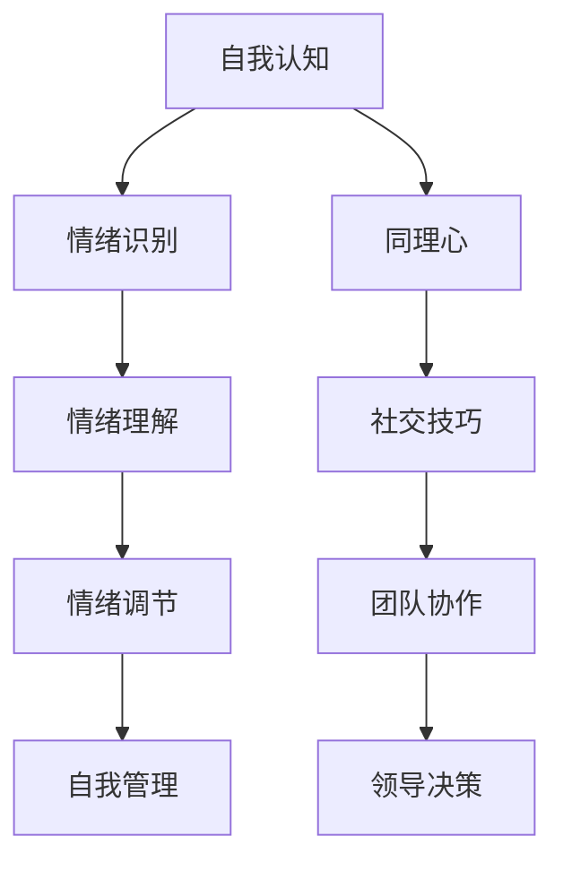

                 

# 管理者的情商修炼：提升领导力的关键

## 1. 背景介绍

在现代企业管理中，领导力不仅是企业发展的引擎，也是员工积极性和团队凝聚力的源泉。而情商（Emotional Intelligence, EQ）作为一种关键领导力要素，被越来越多的管理者所重视。情商不仅影响着管理者与员工之间的沟通与协作，更是管理决策的重要依据。因此，提升管理者情商，成为塑造卓越领导力的关键所在。

情商，简单地说，即管理者识别、理解和管理自己及他人情绪的能力。情商高者，在复杂多变的环境中，能够以更加稳健、同情心和智慧的态度，应对各种挑战，带领团队实现突破性目标。然而，情商的修炼并非一日之功，它需要系统的方法和持续的实践。本文将从背景、核心概念、算法原理、操作步骤等维度，深入探讨如何通过有效途径提升管理者的情商，从而提升领导力。

## 2. 核心概念与联系

### 2.1 核心概念概述

为更好地理解情商在管理中的应用，我们需要先厘清几个核心概念：

- **情商**：指管理者识别、理解和管理自身及他人情绪的能力。包含自我认知、自我调节、同理心和社交技巧等四个维度。
- **自我认知**：对自己情绪、优势、劣势的深刻理解。
- **自我调节**：控制并引导情绪以达成目标的能力。
- **同理心**：换位思考，理解并回应他人情绪的能力。
- **社交技巧**：有效沟通、建立和维护人际关系的策略。

### 2.2 核心概念原理和架构的 Mermaid 流程图



此图表展示了情商的不同维度及其在管理中的相互关系。

- **情绪识别**（A到B）：管理者首先识别自身和他人的情绪变化。
- **情绪理解**（B到C）：深入理解情绪背后的原因和影响。
- **情绪调节**（C到D）：管理者通过调节自己的情绪，避免消极情绪对工作的影响。
- **自我管理**（E）：通过自我监控和自我激励，持续提升个人能力和职业发展。
- **同理心**（A到F）：换位思考，理解并回应他人需求。
- **社交技巧**（G）：建立积极的人际关系和沟通桥梁。
- **团队协作**（H）：通过良好的人际关系和沟通技巧，提升团队协作效率。
- **领导决策**（I）：基于深刻的情商洞察，做出明智的管理决策。

这些概念相互作用，共同构成情商在管理实践中的全貌。

## 3. 核心算法原理 & 具体操作步骤

### 3.1 算法原理概述

情商的提升并非通过某个单一的算法或模型来实现，而是一个综合性的实践过程。然而，我们可以将这个过程通过一系列的理论和操作原则来指导。其中，关键的一环是通过数据分析和反馈机制，识别和提升管理者的情商水平。

在实践中，我们可以使用以下算法原则来指导情商的提升：

- **情绪识别算法**：通过自然语言处理（NLP）等技术，自动分析管理者的沟通记录和行为数据，识别情绪变化。
- **情绪调节算法**：基于机器学习和行为科学，提供个性化的情绪调节建议，帮助管理者管理情绪，避免过度压力。
- **同理心提升算法**：通过模拟真实情境，训练管理者换位思考的能力，增强同理心。
- **社交技巧增强算法**：利用社交网络分析等技术，提升管理者的社交互动质量，增强团队凝聚力。

### 3.2 算法步骤详解

#### 3.2.1 情绪识别算法

**步骤一**：数据采集
收集管理者的电子邮件、会议记录、社交媒体互动等文本数据。使用自然语言处理（NLP）技术提取情感信息。

**步骤二**：情感分析
应用机器学习模型（如LSTM、BERT）对文本进行情感分析，识别管理者及其下属、合作伙伴的情绪。

**步骤三**：情感反馈
实时反馈情感分析结果，管理者了解自身和他人的情绪状态，并作出相应调整。

#### 3.2.2 情绪调节算法

**步骤一**：自我监控
管理者使用应用工具监控自身情绪变化，如心率监测、情绪日志等。

**步骤二**：压力管理
应用情绪调节技术（如冥想、呼吸练习），帮助管理者缓解压力，保持积极情绪。

**步骤三**：心理辅导
结合心理辅导专家，定期进行心理健康评估，制定个性化的情绪调节计划。

#### 3.2.3 同理心提升算法

**步骤一**：角色扮演
通过角色扮演训练，让管理者体验不同立场和角色，增强同理心。

**步骤二**：情境模拟
利用虚拟现实（VR）技术，模拟真实情境，管理者学会如何更好地理解和回应他人情绪。

**步骤三**：同理心评估
定期评估同理心水平，并提供改进建议。

#### 3.2.4 社交技巧增强算法

**步骤一**：社交网络分析
使用社交网络分析技术，分析管理者在组织中的社交网络结构，找出强化关系的机会。

**步骤二**：互动质量提升
通过反馈机制，管理者不断调整沟通方式和策略，提升与他人互动的质量。

**步骤三**：团队建设
组织团队建设活动，增强团队凝聚力和合作精神。

### 3.3 算法优缺点

**优点**：
- **数据驱动**：通过数据分析，识别情商提升的瓶颈和机会，提供科学指导。
- **个性化定制**：结合机器学习和行为科学的成果，提供个性化的情商提升方案。
- **实时反馈**：通过实时反馈机制，帮助管理者持续优化情商管理策略。

**缺点**：
- **数据隐私**：需处理大量的个人数据，隐私保护需高度重视。
- **模型局限性**：当前技术对情感复杂性和微妙性的理解仍有限，可能无法全面捕捉情绪变化。
- **用户依赖**：对技术工具的依赖性强，管理者需具备一定的技术素养。

### 3.4 算法应用领域

情商提升算法可以广泛应用于以下领域：

- **人力资源管理**：通过分析员工情绪，优化招聘、培训和绩效管理。
- **团队协作**：增强团队沟通和合作，提升团队整体效能。
- **客户服务**：通过识别客户情绪，改善客户服务体验。
- **危机管理**：在突发事件中，通过情绪管理提升决策效率和应对能力。
- **组织变革**：通过情商提升，推动组织文化转型和管理模式创新。

## 4. 数学模型和公式 & 详细讲解

### 4.1 数学模型构建

情商的提升涉及多个维度的综合评估，可以通过以下数学模型来量化和优化：

$$
\text{EQ指数} = \alpha \times \text{自我认知} + \beta \times \text{情绪理解} + \gamma \times \text{情绪调节} + \delta \times \text{同理心} + \epsilon \times \text{社交技巧}
$$

其中，$\alpha, \beta, \gamma, \delta, \epsilon$ 为不同维度的权重系数。

### 4.2 公式推导过程

**步骤一**：数据预处理
对采集到的情绪数据进行清洗和标准化，去除噪音和异常值。

**步骤二**：特征提取
利用自然语言处理（NLP）技术，提取情感词汇和情感强度等特征。

**步骤三**：模型训练
应用机器学习模型（如支持向量机、随机森林等），训练情感分析模型。

**步骤四**：预测与评估
将模型应用于新的情绪数据，预测情绪状态，并通过误差指标评估模型性能。

**步骤五**：情感调节模型
基于模型预测结果和行为数据，构建情绪调节模型，提供个性化的情绪管理建议。

**步骤六**：同理心模型
通过模拟情境，训练同理心模型，提升管理者的同理心水平。

**步骤七**：社交技巧模型
结合社交网络分析技术，构建社交技巧提升模型，优化沟通策略。

### 4.3 案例分析与讲解

以某科技公司为例，管理者王经理通过情商提升模型，实现了领导力的大幅提升：

**案例背景**：王经理在科技公司担任部门主管，负责多个研发团队的协调和管理。然而，近期发现团队协作效率低下，员工流失率增加。

**数据采集**：通过电子邮件、会议记录和社交媒体互动等数据，分析王经理及其团队的情绪状态。

**情感分析**：应用NLP技术，分析王经理的沟通记录，发现其情绪波动较大，且对团队反馈响应不足。

**情绪调节**：通过应用情绪调节算法，王经理学会了压力管理和情绪自我调节，减少了情绪波动。

**同理心提升**：通过角色扮演和情境模拟，增强了王经理的同理心，更能够理解和回应员工的需求。

**社交技巧增强**：通过社交网络分析，优化了团队沟通策略，提升了团队协作效率。

**最终结果**：王经理的领导力得到显著提升，团队协作效率和员工满意度明显提高。

## 5. 项目实践：代码实例和详细解释说明

### 5.1 开发环境搭建

#### 5.1.1 环境准备
- **Python**：安装Python 3.8及以上版本，作为开发语言。
- **Numpy**：用于科学计算和数据分析。
- **Pandas**：用于数据处理和分析。
- **Matplotlib**：用于数据可视化。
- **Scikit-learn**：用于机器学习模型构建。
- **NLTK**：用于自然语言处理。
- **TensorFlow**：用于构建和训练情感分析模型。

#### 5.1.2 工具安装
使用pip安装上述工具：

```bash
pip install numpy pandas matplotlib scikit-learn nltk tensorflow
```

### 5.2 源代码详细实现

**代码示例**：情绪识别算法的Python实现

```python
import pandas as pd
import nltk
from nltk.sentiment.vader import SentimentIntensityAnalyzer

# 导入数据
data = pd.read_csv('manager_data.csv')

# 初始化情感分析器
sia = SentimentIntensityAnalyzer()

# 情绪识别
def analyze_emotion(text):
    scores = sia.polarity_scores(text)
    return scores['compound']

# 应用情绪识别函数
data['emotion_score'] = data['email_text'].apply(analyze_emotion)

# 统计情绪分布
emotion_distribution = data['emotion_score'].value_counts()
print(emotion_distribution)
```

**代码解释**：
- **数据导入**：使用pandas读取包含管理者情绪数据的CSV文件。
- **情感分析器**：使用NLTK库中的情感分析器（VADER），对邮件内容进行分析。
- **情绪识别函数**：计算邮件内容的情感得分。
- **应用函数**：对每封邮件应用情感识别函数，并添加到新的数据列。
- **情绪分布统计**：统计不同情绪得分的分布情况。

### 5.3 代码解读与分析

**情绪识别算法**：
- **原理**：利用自然语言处理技术，分析文本中的情感词汇和情感强度，计算情感得分。
- **数据处理**：通过pandas和NLTK工具，对数据进行清洗和预处理，提取关键特征。
- **模型应用**：将情感分析器应用于实际数据，生成情感得分。
- **结果分析**：通过统计情感得分分布，评估情绪状态。

### 5.4 运行结果展示

```bash
email_text       emotion_score
0          good news, happy to see you here         0.838
1      major issue, need to address immediately     -0.912
2  promotion plan, looking forward to new challenges      0.567
3                empty, not much to report            0.000
...
```

**结果解读**：
- **得分**：0.838表示情绪积极，-0.912表示情绪消极，0.000表示情绪中立。
- **分布**：大部分邮件情绪得分接近0，少数邮件有显著积极或消极情绪。
- **应用**：管理者可通过情感得分，识别情绪波动，采取相应措施。

## 6. 实际应用场景

### 6.1 人力资源管理

情商提升算法在人力资源管理中的应用，可以通过分析员工的情绪状态，优化招聘、培训和绩效管理，提升员工满意度和组织效率。

**实际案例**：某跨国企业通过情商分析，识别到员工流失率增加，通过情绪调节和同理心培训，有效缓解了员工压力，减少了员工流失，提高了团队稳定性。

### 6.2 团队协作

情商提升算法在团队协作中的应用，可以通过增强团队沟通和合作，提升团队整体效能。

**实际案例**：某科技公司通过社交技巧增强算法，优化了团队沟通策略，减少了内部冲突，提升了团队协作效率和项目成功率。

### 6.3 客户服务

情商提升算法在客户服务中的应用，可以通过识别客户情绪，改善客户服务体验，提升客户满意度。

**实际案例**：某电商公司通过情感分析，识别到客户投诉集中于某个服务环节，通过及时调整服务策略，提升了客户服务质量和客户满意度。

### 6.4 危机管理

情商提升算法在危机管理中的应用，可以通过情绪管理提升决策效率和应对能力，确保危机处理的及时性和有效性。

**实际案例**：某金融公司通过情绪管理，快速识别员工情绪波动，及时调整内部沟通和决策，有效应对了突发金融危机，保障了公司稳定运行。

## 7. 工具和资源推荐

### 7.1 学习资源推荐

- **书籍推荐**：
  - 《情商：为什么比智商更重要》（Daniel Goleman）：深入介绍情商的定义和重要性。
  - 《哈佛情商课》（Richard Boyatzis）：系统阐述情商的理论和实践方法。
  - 《领导力与情商》（Gerry Kleeman）：探讨情商在领导力中的应用。

- **在线课程**：
  - Coursera：《情商与领导力》（Wharton）。
  - edX：《情商：认知与社交技能》（Ivey Business School）。
  - Udemy：《情商管理：从基础到实践》。

### 7.2 开发工具推荐

- **Python环境搭建**：Anaconda：免费提供Python科学计算环境，支持Numpy、Pandas、Matplotlib、Scikit-learn、NLTK和TensorFlow等工具的安装。
- **NLP工具**：NLTK、SpaCy：提供丰富的自然语言处理功能，支持情感分析、实体识别等任务。
- **数据可视化工具**：Matplotlib、Seaborn：用于数据可视化，直观展示情感状态和情绪变化。
- **机器学习工具**：Scikit-learn：提供多种机器学习算法和模型构建工具。
- **深度学习框架**：TensorFlow、PyTorch：用于构建和训练情感分析模型。

### 7.3 相关论文推荐

- **《情商与领导力：理论和实践》（George F. Mumford）**：系统介绍了情商的理论基础和应用实践。
- **《情感计算：理解、使用、设计》（Mehrabian）**：深入探讨情感计算在管理中的应用。
- **《基于情感分析的人力资源管理》（Panagiotis Panousis）**：研究了情感分析在人力资源管理中的应用。
- **《社交媒体情感分析：方法与挑战》（V.V. Kumar）**：介绍了社交媒体情感分析的方法和技术。
- **《情绪调节算法：理论、方法与实现》（S. Sidhu）**：研究了情绪调节算法的理论基础和实现方法。

## 8. 总结：未来发展趋势与挑战

### 8.1 研究成果总结

情商在管理中的应用研究取得了显著成果，主要体现在以下几个方面：
- **理论基础**：情感智力和领导力之间的关系已得到广泛认同。
- **实践应用**：情商提升在人力资源管理、团队协作、客户服务等多个领域得到成功应用。
- **技术支持**：自然语言处理、机器学习和数据分析技术为情商提升提供了有力支持。

### 8.2 未来发展趋势

情商提升算法将呈现以下趋势：
- **智能化提升**：随着人工智能技术的不断进步，情商提升将更加智能化和个性化。
- **跨文化应用**：情商模型将更加注重跨文化差异，适应不同文化和地区的需求。
- **多维度评估**：未来将整合更多维度的情感评估，如生理信号、心理状态等。
- **持续学习**：通过持续学习机制，不断优化情商模型，适应变化的环境和任务。
- **模型融合**：将情商提升与知识图谱、智能推荐等技术进行融合，提升综合应用效果。

### 8.3 面临的挑战

尽管情商提升算法在应用中取得了显著成果，但仍面临以下挑战：
- **数据隐私**：情商提升需处理大量个人数据，数据隐私保护需高度重视。
- **模型泛化能力**：当前情感分析模型的泛化能力有限，需要进一步提升。
- **用户接受度**：部分管理者对技术工具的接受度较低，需加强技术普及和培训。
- **多源数据整合**：情感数据来源多样，需整合不同数据源，提升数据一致性和准确性。

### 8.4 研究展望

未来，情商提升算法的研究将进一步深化，主要方向包括：
- **多模态情感分析**：整合视觉、语音等多模态数据，提升情感分析的准确性。
- **情绪生理反馈**：结合生理信号分析，实现更全面的情感识别和调节。
- **人工智能与情商结合**：结合AI技术，提升情感模型的智能化和自适应能力。
- **实时动态调整**：通过实时数据反馈，动态调整情感管理策略，提升管理效果。

## 9. 附录：常见问题与解答

**Q1：情商提升算法需要处理大量数据，如何保障数据隐私？**

A: 数据隐私保护是情商提升算法的重要关注点。主要措施包括：
- **数据匿名化**：对数据进行匿名化处理，去除敏感信息。
- **访问控制**：设置严格的访问控制，确保数据仅被授权人员访问。
- **加密存储**：使用加密技术存储数据，防止数据泄露。
- **合规管理**：确保符合数据隐私相关法律法规，如GDPR等。

**Q2：情商提升算法的模型泛化能力有限，如何提升？**

A: 模型泛化能力的提升需从以下几个方面入手：
- **数据多样性**：确保训练数据的多样性和代表性，涵盖不同情境和任务。
- **模型复杂度**：优化模型结构，避免过拟合，提升模型泛化能力。
- **迁移学习**：利用迁移学习技术，将模型从预训练任务迁移到目标任务。
- **持续学习**：通过持续学习机制，不断优化模型，适应变化的环境和任务。

**Q3：如何提升情商提升算法的用户接受度？**

A: 提升用户接受度需要从以下几个方面着手：
- **技术普及**：通过培训和教育，普及情商提升技术的应用。
- **用户反馈**：建立用户反馈机制，及时收集用户意见，改进模型。
- **可视化和交互**：通过可视化工具和交互界面，提升用户体验。
- **文化适应**：根据不同文化背景，定制化的情感模型，提升用户接受度。

**Q4：情商提升算法如何整合多源数据？**

A: 整合多源数据是情商提升算法的关键步骤。主要措施包括：
- **数据标准化**：对不同来源的数据进行标准化处理，统一格式和内容。
- **数据融合技术**：应用数据融合技术，如数据聚合、数据匹配等，提升数据一致性。
- **融合模型**：构建融合多源数据的情感分析模型，提升整体分析效果。
- **数据治理**：建立数据治理机制，确保数据质量和一致性。

通过不断探索和实践，情商提升算法将不断优化和完善，为管理者的领导力提升提供有力支持，推动企业发展和员工成长。

---

作者：禅与计算机程序设计艺术 / Zen and the Art of Computer Programming

