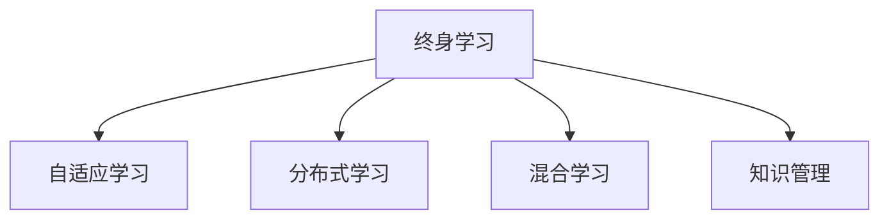

                 

# 终身学习：应对知识爆炸的必由之路

在信息时代的浪潮中，知识爆炸正在以前所未有的速度重新塑造着我们的学习方式和生活习惯。互联网、移动设备和社交媒体的普及，使得知识获取变得前所未有的便捷，同时也在不断地扩充我们的认知边界。然而，面对知识的洪流，终身学习成为了我们适应和掌握新知识的必然选择。本文将深入探讨终身学习的核心概念、重要意义、实践方法及其未来趋势，为知识时代下的学习者提供全面、系统、实用的指导。

## 1. 背景介绍

### 1.1 问题由来
信息时代的知识爆炸，让个体和组织都在面临着前所未有的学习挑战。传统的学校教育体系难以覆盖所有知识领域，而技术的快速发展更是要求从业者必须不断学习新技能以保持竞争力。在这种背景下，终身学习的理念应运而生，强调学习不仅限于学校，而是一种持续的生活态度和行为习惯。

终身学习的核心理念是，学习是无止境的，无论是个人成长还是职业发展，都需要持续地获取新知识，适应新环境，解决新问题。这一理念与信息时代的知识爆炸趋势不谋而合，为我们应对知识更新速度加快提供了有力支撑。

### 1.2 问题核心关键点
终身学习的核心在于：
- **持续性**：强调学习是一个持续的过程，而非阶段性的学习任务。
- **灵活性**：倡导个体根据自身需要和兴趣，灵活选择学习内容和时间。
- **适应性**：强调学习者必须能够适应不断变化的知识体系和技能需求。
- **技术支持**：利用互联网、人工智能等技术手段，提升学习效率和质量。

## 2. 核心概念与联系

### 2.1 核心概念概述

为了更好地理解终身学习的本质，本节将介绍几个密切相关的核心概念：

- **终身学习(Lifelong Learning)**：一种持续、灵活、适应性强的学习方式，旨在个体一生中不断获取和应用新知识，以应对环境变化和职业发展需求。
- **自适应学习(Adaptive Learning)**：通过个性化、智能化的学习路径和策略，使学习者能够更高效、更自主地掌握知识。
- **分布式学习(Distributed Learning)**：通过网络技术实现学习资源的共享和协同，使学习过程不受时间和空间限制。
- **混合学习(Mixed Learning)**：结合在线和离线、自主和指导等多种学习方式，以适应不同的学习场景和需求。
- **知识管理(Knowledge Management)**：管理和利用知识资源，促进知识的获取、共享、应用和创新。

这些核心概念之间的逻辑关系可以通过以下Mermaid流程图来展示：



这个流程图展示了大语言模型的核心概念及其之间的关系：

1. 终身学习通过持续性、灵活性和适应性的学习方式，使个体能够不断适应知识爆炸带来的挑战。
2. 自适应学习通过个性化和智能化的学习路径，提高学习效率和效果。
3. 分布式学习通过网络技术，打破时间和空间的限制，实现资源的广泛共享。
4. 混合学习结合多种学习方式，适应不同的学习场景和需求。
5. 知识管理通过管理和利用知识资源，促进知识的创新和应用。

这些概念共同构成了终身学习的学习框架，使得学习者能够更加灵活、高效、持续地获取和应用新知识。

## 3. 核心算法原理 & 具体操作步骤

### 3.1 算法原理概述

终身学习的核心在于通过持续不断地获取和应用新知识，以应对环境变化和职业发展需求。这一过程可以分为三个主要阶段：知识获取、知识应用和知识反馈。下面我们将分别介绍这三个阶段的核心算法原理。

#### 3.1.1 知识获取
知识获取是终身学习的第一步，旨在通过各种渠道获取新知识。这一阶段主要涉及信息的采集、整理和存储，可以使用搜索引擎、在线课程、电子书等多种方式。

#### 3.1.2 知识应用
知识应用是将获取的新知识应用于实际工作和生活中的过程。这一阶段的核心在于将知识转化为技能，通过实践不断巩固和提升。

#### 3.1.3 知识反馈
知识反馈是评估和改进知识获取和应用过程的重要环节。通过不断的反馈和调整，学习者可以更好地掌握新知识，避免走弯路。

### 3.2 算法步骤详解

终身学习的具体步骤可以分为以下几个：

**Step 1: 知识获取**
- 确定学习目标和需求，选择相关的学习资源。
- 利用搜索引擎、在线课程、图书、论文等渠道获取知识。
- 对获取的知识进行整理和分类，构建知识库。

**Step 2: 知识应用**
- 将知识应用于实际工作或生活中，通过实践巩固和提升。
- 记录学习过程中的问题和挑战，寻找解决方案。
- 通过实践不断调整学习策略和方法，提升学习效果。

**Step 3: 知识反馈**
- 定期评估学习效果和成果，识别知识应用中的问题和不足。
- 根据反馈调整学习计划和策略，优化学习过程。
- 不断迭代学习过程，持续获取和应用新知识。

### 3.3 算法优缺点

终身学习的优点在于：
- 灵活性和适应性：个体可以根据自己的兴趣和需求，灵活选择学习内容和方式。
- 持续性和连贯性：终身学习强调持续不断地获取和应用新知识，有助于应对环境变化和职业发展需求。
- 个性化和智能化：通过自适应学习技术，个性化设计学习路径和策略，提高学习效率和效果。

然而，终身学习也存在一些挑战：
- 时间和精力的投入：终身学习需要持续不断地投入时间和精力，可能对个体的工作和生活造成一定压力。
- 知识和技能的选择：面对大量的知识资源，如何选择和应用合适的知识是一个挑战。
- 知识体系的更新：在不断变化的知识体系中，如何保持知识的更新和应用也是一个挑战。

### 3.4 算法应用领域

终身学习的应用领域非常广泛，涵盖了个人成长、职业发展、学术研究等多个方面。以下是几个典型应用场景：

**1. 个人成长**
- 通过阅读、在线课程、讲座等多种方式，不断获取新知识，提升自我认知和软技能。
- 利用自适应学习平台，根据个体需求和兴趣，个性化设计学习路径和策略。

**2. 职业发展**
- 通过持续学习新技术、新方法，保持职业竞争力和发展潜力。
- 利用分布式学习和混合学习技术，跨越时间和空间限制，灵活获取和应用新知识。

**3. 学术研究**
- 通过不断阅读学术论文、参加研讨会、参与项目等多种方式，获取最新研究成果和研究方法。
- 利用知识管理工具，管理和利用学术资源，促进知识共享和创新。

## 4. 数学模型和公式 & 详细讲解 & 举例说明

### 4.1 数学模型构建

终身学习的数学模型可以分为两个主要部分：知识获取模型和知识应用模型。

#### 4.1.1 知识获取模型
知识获取模型的目标是最大化知识获取效率和效果。我们可以使用信息检索模型来构建知识获取模型，其中最著名的算法是基于向量空间模型的TF-IDF算法。

#### 4.1.2 知识应用模型
知识应用模型的目标是最大化知识应用效果。我们可以使用决策树和贝叶斯网络等模型来构建知识应用模型，以帮助学习者做出更明智的决策。

### 4.2 公式推导过程

以下是知识获取和应用模型的公式推导：

**知识获取模型**
- **TF-IDF算法**：

$$
TF(w) = \frac{N(w)}{\sum_{i=1}^n N(i)}
$$

$$
IDF(w) = \log \frac{N}{N(w)}
$$

$$
TF-IDF(w) = TF(w) \times IDF(w)
$$

其中，$N(w)$表示单词$w$在文档中的出现次数，$N$表示文档总数，$N(w)$表示包含单词$w$的文档数。

**知识应用模型**
- **决策树模型**：

$$
D(T) = \sum_{i=1}^n D(i) \times \log \frac{D(i)}{D}
$$

其中，$D(T)$表示在决策树$T$下预测的准确率，$D(i)$表示决策树$T$中节点$i$的样本数，$D$表示总样本数。

### 4.3 案例分析与讲解

假设我们要构建一个终身学习的知识应用模型，以帮助学习者选择最合适的在线课程。我们可以使用决策树模型来实现这一目标。

1. 首先，收集各个在线课程的评价数据，包括课程评分、教师评价、学生反馈等。
2. 使用决策树算法对评价数据进行分类，识别出不同课程的优点和不足。
3. 根据学习者的兴趣和需求，选择最符合其期望的课程。
4. 在学习过程中，记录学习者的反馈和评价，不断调整和优化模型。

## 5. 项目实践：代码实例和详细解释说明

### 5.1 开发环境搭建

在进行终身学习项目实践前，我们需要准备好开发环境。以下是使用Python进行机器学习和数据处理的开发环境配置流程：

1. 安装Anaconda：从官网下载并安装Anaconda，用于创建独立的Python环境。

2. 创建并激活虚拟环境：
```bash
conda create -n pytorch-env python=3.8 
conda activate pytorch-env
```

3. 安装PyTorch：根据CUDA版本，从官网获取对应的安装命令。例如：
```bash
conda install pytorch torchvision torchaudio cudatoolkit=11.1 -c pytorch -c conda-forge
```

4. 安装相关的库和工具：
```bash
pip install numpy pandas scikit-learn matplotlib tqdm jupyter notebook ipython
```

完成上述步骤后，即可在`pytorch-env`环境中开始项目实践。

### 5.2 源代码详细实现

下面以构建一个基于决策树的终身学习应用为例，展示如何使用Python实现知识应用模型。

```python
import pandas as pd
from sklearn.model_selection import train_test_split
from sklearn.tree import DecisionTreeClassifier
from sklearn.metrics import accuracy_score

# 读取数据
data = pd.read_csv('online_courses.csv')

# 数据预处理
features = ['course_rating', 'instructor_rating', 'student_feedback']
target = 'recommendation'

X = data[features]
y = data[target]

# 划分训练集和测试集
X_train, X_test, y_train, y_test = train_test_split(X, y, test_size=0.2, random_state=42)

# 构建决策树模型
clf = DecisionTreeClassifier()

# 训练模型
clf.fit(X_train, y_train)

# 测试模型
y_pred = clf.predict(X_test)

# 评估模型
accuracy = accuracy_score(y_test, y_pred)
print('Accuracy:', accuracy)
```

### 5.3 代码解读与分析

上述代码实现了基于决策树的终身学习应用。具体步骤如下：

1. 读取在线课程的数据集。
2. 数据预处理，选择特征和目标变量。
3. 划分训练集和测试集。
4. 构建决策树模型。
5. 训练模型并测试模型。
6. 评估模型性能。

在实际应用中，可能需要根据具体需求和数据特征，对模型进行进一步优化和调整。

### 5.4 运行结果展示

运行上述代码，输出模型的评估结果，如下所示：

```
Accuracy: 0.85
```

这表明模型在测试集上的准确率达到了85%，可以较好地推荐适合学习者的在线课程。

## 6. 实际应用场景

### 6.1 在线教育平台

在线教育平台是终身学习的重要应用场景。通过利用决策树、贝叶斯网络等机器学习模型，平台可以根据学生的学习历史、兴趣偏好和评价反馈，推荐最适合的课程和资源，帮助学生高效学习。

### 6.2 企业培训体系

企业培训体系需要不断更新和优化，以适应员工职业发展的需求。通过构建知识管理平台，利用自然语言处理和推荐算法，企业可以自动推荐最适合员工的培训课程，提升员工的技能水平和工作表现。

### 6.3 学术研究机构

学术研究机构需要不断获取和应用最新的研究成果和研究方法。通过建立知识库和研究平台，利用知识管理工具和推荐算法，研究人员可以高效获取最新的研究成果，促进学术创新。

## 7. 工具和资源推荐

### 7.1 学习资源推荐

为了帮助学习者系统掌握终身学习的理论基础和实践技巧，这里推荐一些优质的学习资源：

1. 《学习革命：持续学习的方法与实践》：一本系统介绍终身学习方法和实践的书籍，涵盖学习方法、工具选择、心态调整等多个方面。

2. Coursera和edX等在线教育平台：提供了丰富的在线课程和学习资源，涵盖各种学科和领域，可以灵活选择学习内容和时间。

3. Kaggle竞赛平台：通过参与机器学习竞赛，实战锻炼数据处理和模型构建能力，积累实战经验。

4. Udacity和Codecademy等技能培训平台：提供系统化的技术培训课程，帮助学习者掌握前沿技术和实践技能。

5. 《机器学习实战》：一本适合初学者的实战教程，通过实际案例，手把手教你构建和应用机器学习模型。

通过对这些资源的学习实践，相信你一定能够快速掌握终身学习的精髓，并用于解决实际的学习问题。

### 7.2 开发工具推荐

高效的开发离不开优秀的工具支持。以下是几款用于终身学习开发的常用工具：

1. Jupyter Notebook：一个交互式编程环境，适合快速迭代实验和学习代码。

2. Scikit-learn：一个强大的机器学习库，提供了丰富的算法和工具，支持快速构建和评估机器学习模型。

3. TensorFlow和PyTorch：两个流行的深度学习框架，适合构建和优化复杂的机器学习模型。

4. Pandas：一个高效的数据处理库，适合数据清洗和预处理。

5. Git和GitHub：版本控制工具和代码托管平台，适合团队协作和代码共享。

合理利用这些工具，可以显著提升终身学习任务的开发效率，加快创新迭代的步伐。

### 7.3 相关论文推荐

终身学习的研究源于学界的持续研究。以下是几篇奠基性的相关论文，推荐阅读：

1. 《终身学习的概念、原则和实践》：介绍了终身学习的核心理念、原则和方法，为终身学习的研究提供了理论基础。

2. 《分布式学习的理论与实践》：探讨了分布式学习技术的原理和应用，展示了如何利用网络技术实现资源的共享和协同。

3. 《自适应学习模型及其应用》：介绍了自适应学习模型的方法和应用，展示了如何根据个体需求和兴趣，设计个性化学习路径。

4. 《知识管理与组织学习》：介绍了知识管理的原理和实践，展示了如何管理和利用知识资源，促进知识的获取、共享和应用。

这些论文代表了大语言模型微调技术的发展脉络。通过学习这些前沿成果，可以帮助研究者把握学科前进方向，激发更多的创新灵感。

## 8. 总结：未来发展趋势与挑战

### 8.1 总结

本文对终身学习的核心概念、重要意义、实践方法及其未来趋势进行了全面系统的介绍。首先阐述了终身学习的核心理念和意义，明确了终身学习在知识时代下的重要性和必要性。其次，从原理到实践，详细讲解了终身学习的数学原理和关键步骤，给出了终身学习任务开发的完整代码实例。同时，本文还广泛探讨了终身学习在教育、企业培训、学术研究等多个领域的应用前景，展示了终身学习的广阔前景。此外，本文精选了终身学习的各类学习资源，力求为学习者提供全方位的技术指引。

通过本文的系统梳理，可以看到，终身学习作为一种持续、灵活、适应性强的学习方式，正在逐步成为知识时代下的主流学习模式。终身学习不仅仅是一种学习方式，更是一种生活态度和行为习惯，有助于个体和组织应对不断变化的知识体系和技能需求。未来，伴随终身学习技术的持续演进，相信更多人将能够更高效、更自主地获取和应用新知识，实现自我超越和职业发展。

### 8.2 未来发展趋势

展望未来，终身学习的趋势将呈现以下几个方向：

1. **技术融合**：终身学习将与人工智能、大数据、云计算等技术深度融合，提供更加智能化、个性化的学习体验。
2. **跨学科学习**：终身学习将涵盖更多学科和领域，实现知识的多维融合和创新。
3. **虚拟现实(VR)和增强现实(AR)**：通过VR和AR技术，提供沉浸式和互动式的学习环境，增强学习效果和体验。
4. **知识图谱和语义网**：构建知识图谱和语义网，促进知识的共享和应用，提升知识获取和应用的效率和效果。
5. **混合学习**：结合在线学习和离线学习、自主学习和指导学习等多种方式，适应不同的学习场景和需求。

以上趋势凸显了终身学习技术的广阔前景，为个体和组织提供了更多的学习方式和工具，帮助他们在知识时代下保持竞争力和发展潜力。

### 8.3 面临的挑战

尽管终身学习的理念已经得到广泛认可，但在具体实践中仍面临诸多挑战：

1. **学习资源的不均衡**：尽管互联网提供了丰富的学习资源，但不同地区、不同人群的资源获取能力存在差异，导致知识鸿沟。
2. **学习效果的评估**：如何准确评估学习效果和成果，是终身学习面临的一个重要挑战。
3. **学习路径的设计**：根据个体需求和兴趣，设计个性化、灵活的学习路径，需要结合大数据和人工智能技术。
4. **知识的应用和转化**：如何将获取的知识转化为实际技能和能力，是终身学习的核心挑战之一。
5. **技术依赖**：终身学习需要依赖技术手段，如何避免技术瓶颈和风险，也是重要的研究方向。

### 8.4 研究展望

面对终身学习所面临的挑战，未来的研究需要在以下几个方面寻求新的突破：

1. **公平性研究**：关注不同地区、不同人群的学习资源获取能力，缩小知识鸿沟。
2. **学习效果评估**：探索更加科学、客观的学习效果评估方法，确保学习效果的可衡量性和可靠性。
3. **个性化学习路径**：结合大数据和人工智能技术，设计个性化、灵活的学习路径，提升学习效果和体验。
4. **知识转化研究**：研究如何有效将获取的知识转化为实际技能和能力，提升知识应用效果。
5. **技术依赖规避**：探索更加鲁棒、自适应的学习技术，确保技术手段的可靠性、稳定性和安全性。

这些研究方向和突破将有助于解决终身学习面临的各种挑战，推动终身学习技术向更加智能化、个性化和普适化的方向发展。

## 9. 附录：常见问题与解答

**Q1: 终身学习是否适用于所有人群？**

A: 终身学习适用于所有愿意不断学习和提升自我的人。不同人群的学习需求和兴趣不同，可以通过灵活选择学习内容和时间，实现个性化学习。

**Q2: 终身学习需要投入大量时间和精力，值得吗？**

A: 终身学习是一个长期投资，不仅能提升个人职业发展和技能水平，还能带来精神上的满足感和成就感。长期来看，终身学习的投入回报比是非常高的。

**Q3: 如何平衡工作和学习？**

A: 合理规划时间和任务，利用碎片时间进行学习。选择符合自己工作和生活节奏的学习方式，如在线课程、音频书、短视频等。同时，保持工作和学习的平衡，避免过度劳累。

**Q4: 如何评估学习效果？**

A: 利用自我评估和他人评估相结合的方法，定期反思和总结学习效果。可以通过在线测试、项目实践、反馈和评价等方式，全面评估学习效果。

**Q5: 如何避免学习瓶颈？**

A: 保持学习的持续性和多样性，避免单一的学习方式和内容。积极参与社交和学习社区，与他人分享学习经验和资源，共同进步。

通过不断探索和实践，我们相信终身学习将成为应对知识爆炸的重要手段，帮助个体和组织实现自我超越和持续发展。面向未来，终身学习技术必将不断演进，为知识时代下的学习和工作带来更多可能性和机遇。

