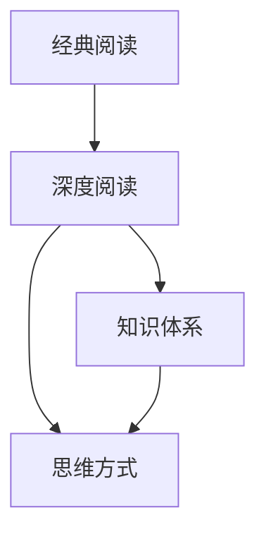

                 

# 经典阅读:夯实认知的必由之路

在当今这个信息爆炸的时代，阅读仍然是获取知识、提升认知、拓展视野的最有效手段之一。无论是科技、文学、艺术还是哲学，经典阅读都是理解人类历史和智慧的宝贵资源。本文将深入探讨经典阅读的原理与实践，帮助读者建立有效的阅读习惯，夯实认知基础，进而开启更广阔的认知世界。

## 1. 背景介绍

### 1.1 问题由来

随着互联网的普及，人们的阅读习惯发生了显著变化。一方面，信息获取的便捷性使得阅读的门槛降低，但另一方面，浅层阅读、碎片化阅读的现象日益严重。这种浅尝辄止的阅读方式，往往难以深入理解复杂内容，也不利于形成系统的知识体系。

在科技领域，信息的快速更新使得从业者必须不断学习和适应新技术，但许多人在快速获取新知的同时，忽略了基础知识的积累和扎实。经典阅读正是在这种背景下应运而生，旨在引导读者回归深度阅读，通过经典作品的洗礼，厚实认知的地基，提升综合素质。

### 1.2 问题核心关键点

经典阅读的核心理念是选择经典书籍进行深度阅读，逐步建立起系统的知识体系和思维方式。关键点在于：
- **选择经典**：精心挑选具有历史价值和学术价值的书籍，如经典哲学作品、科技巨著、文学名著等。
- **深度阅读**：采用系统性、连贯性的阅读方式，深入理解和思考内容，而不是浅尝辄止。
- **内化吸收**：将阅读的内容内化为个人的知识体系和思维方式，从而提升认知水平和实践能力。

通过经典阅读，读者不仅可以获取专业知识，还能锻炼批判性思维、提升文学修养、拓展视野，这些都是应对现代复杂社会的重要能力。

## 2. 核心概念与联系

### 2.1 核心概念概述

为更好地理解经典阅读的原理与实践，本节将介绍几个密切相关的核心概念：

- **经典阅读**：选择经典书籍进行深度阅读，逐步建立起系统的知识体系和思维方式。
- **深度阅读**：系统性地、连贯性地阅读经典书籍，深入理解和思考内容，而非浅尝辄止。
- **知识体系**：通过阅读经典书籍，构建起系统、深入的知识体系。
- **思维方式**：通过阅读经典书籍，培养起批判性思维、逻辑推理等思维方式。

这些核心概念之间存在紧密的联系，相互影响。深度阅读是建立知识体系和思维方式的基础，而知识体系和思维方式则是深度阅读的成果，两者共同构成了经典阅读的完整过程。

### 2.2 核心概念原理和架构的 Mermaid 流程图



该流程图展示了经典阅读的各个核心概念之间的联系和作用机制。

## 3. 核心算法原理 & 具体操作步骤

### 3.1 算法原理概述

经典阅读的原理可以概括为“选择-深度-吸收-应用”四个步骤。通过精心选择经典书籍，进行深度阅读，内化吸收其知识体系和思维方式，最终将所学应用到实际生活和工作中。

- **选择**：基于个人的兴趣、专业背景等因素，选择适合的经典书籍。
- **深度阅读**：采用系统性的阅读方法，如整本精读、逐章细读等，逐步深入理解书籍内容。
- **吸收**：将阅读内容内化为个人的知识体系和思维方式，通过笔记、思维导图等工具记录和巩固。
- **应用**：将所学应用于实际生活和工作中，通过实践检验和完善所学内容。

### 3.2 算法步骤详解

经典阅读的具体操作步骤如下：

**Step 1: 选择经典书籍**
- 根据自己的兴趣、专业背景、职业需求等因素，选择适合的经典书籍。可以参考经典书单、专家推荐等。
- 初步浏览书籍目录、摘要等，判断是否符合自己的阅读需求。

**Step 2: 制定阅读计划**
- 根据书籍的难度和篇幅，制定合理的阅读计划，分配每天/每周的阅读量。
- 确定阅读目标，如理解某个理论、掌握某项技术等。

**Step 3: 深度阅读**
- 采用系统性的阅读方法，如逐章细读、精读、摘记等，逐步深入理解书籍内容。
- 在阅读过程中，注重对概念、理论的思考和理解，避免浅尝辄止。
- 阅读中遇到困惑和问题，可查阅相关文献、咨询专家等，获得解答。

**Step 4: 内化吸收**
- 通过写读书笔记、绘制思维导图等方式，将阅读内容内化为个人的知识体系和思维方式。
- 记录读书过程中的思考和感悟，形成个人的见解和观点。
- 定期复习和回顾已学内容，巩固知识体系。

**Step 5: 实践应用**
- 将所学知识应用于实际生活和工作中，通过实践检验和完善所学内容。
- 在实践中不断总结和反思，形成系统性的知识和思维方式。
- 与他人分享和交流所学内容，获得反馈和启发。

### 3.3 算法优缺点

经典阅读的优点在于：
- **深度理解**：系统性、连贯性的阅读方式，有助于深入理解复杂内容。
- **知识体系**：通过经典阅读，可以构建起系统、深入的知识体系，提升认知水平。
- **思维方式**：经典作品通常蕴含深刻的思想和智慧，有助于培养批判性思维、逻辑推理等思维方式。

经典阅读的缺点在于：
- **时间投入**：深度阅读需要大量时间和精力，不如浅层阅读便捷。
- **阅读门槛**：经典书籍往往内容深奥，理解难度较大，初学者可能感到困难。
- **应用难度**：所学知识需要经过一段时间的沉淀和实践，才能真正转化为能力。

尽管如此，经典阅读仍然是提升认知、拓展视野的最有效手段之一。通过系统性的深度阅读，读者不仅能获得丰富的知识，还能培养出独立思考、批判性分析的能力，为应对现代社会复杂环境打下坚实的基础。

### 3.4 算法应用领域

经典阅读的应用领域非常广泛，几乎涵盖了所有学科和领域。以下是几个典型的应用场景：

- **学术研究**：通过阅读经典学术著作，掌握前沿理论和研究方法，提升科研能力。
- **职业发展**：通过阅读经典商业和管理书籍，掌握职业发展策略和技能，提升职业素养。
- **个人修养**：通过阅读经典文学和哲学作品，提升文学修养和思维深度，丰富精神世界。
- **科技学习**：通过阅读经典科技书籍，掌握最新技术和理论，推动科技创新。
- **教育培训**：通过阅读经典教育著作，提升教育教学方法，培养学生综合素质。

经典阅读在不同领域的应用，展示了其广泛的影响力和深远的价值。通过经典阅读，读者能够在各个领域实现自我提升和发展，为社会的进步和个人的成长做出贡献。

## 4. 数学模型和公式 & 详细讲解 & 举例说明

### 4.1 数学模型构建

经典阅读的数学模型可以从两个方面进行构建：
1. **阅读时间模型**：描述阅读过程的时间分布和进度，通过数学模型优化阅读计划。
2. **知识积累模型**：描述阅读知识的内化和应用过程，通过数学模型评估知识积累的效果。

### 4.2 公式推导过程

**阅读时间模型**：假设读者每天可投入的阅读时间为 $T$，每本书的阅读量为 $V$，则阅读时间模型为：

$$
T = \sum_{i=1}^n V_i \cdot t_i
$$

其中 $V_i$ 为第 $i$ 本书的阅读量，$t_i$ 为阅读第 $i$ 本书所需的时间。

**知识积累模型**：假设知识点的数量为 $K$，每本书的知识贡献为 $A_i$，则知识积累模型为：

$$
K = \sum_{i=1}^n A_i \cdot C_i
$$

其中 $A_i$ 为第 $i$ 本书的知识贡献，$C_i$ 为读者对第 $i$ 本书的理解程度。

### 4.3 案例分析与讲解

以《机器学习》（周志华著）为例，进行经典阅读的应用分析：

**Step 1: 选择书籍**
- 选择《机器学习》作为经典阅读的书籍。

**Step 2: 制定阅读计划**
- 根据书籍章节数量，制定每天阅读一章的计划，预计阅读周期为2个月。
- 阅读目标为掌握机器学习的基本理论、算法和应用。

**Step 3: 深度阅读**
- 逐章细读《机器学习》，注重理解和思考每个概念和定理。
- 遇到难以理解的部分，查阅相关文献、资料，进行深入研究。

**Step 4: 内化吸收**
- 通过写读书笔记、绘制思维导图等方式，记录和巩固所学内容。
- 形成自己对机器学习理论和方法的理解，形成个人见解和观点。
- 定期复习和回顾已学内容，巩固知识体系。

**Step 5: 实践应用**
- 将所学知识应用于实际机器学习项目中，通过实践检验和完善所学内容。
- 在实践中不断总结和反思，形成系统性的知识和思维方式。
- 与他人分享和交流所学内容，获得反馈和启发。

通过《机器学习》的经典阅读，读者可以系统性地掌握机器学习的基础理论和应用方法，提升在实际项目中的应用能力。

## 5. 项目实践：代码实例和详细解释说明

### 5.1 开发环境搭建

在进行经典阅读项目实践前，我们需要准备好开发环境。以下是使用Python进行经典阅读开发的环境配置流程：

1. 安装Anaconda：从官网下载并安装Anaconda，用于创建独立的Python环境。

2. 创建并激活虚拟环境：
```bash
conda create -n classical-reading python=3.8 
conda activate classical-reading
```

3. 安装PyTorch：根据CUDA版本，从官网获取对应的安装命令。例如：
```bash
conda install pytorch torchvision torchaudio cudatoolkit=11.1 -c pytorch -c conda-forge
```

4. 安装相关工具包：
```bash
pip install pandas numpy matplotlib jupyter notebook
```

完成上述步骤后，即可在`classical-reading`环境中开始经典阅读实践。

### 5.2 源代码详细实现

这里我们以《Python编程：从入门到实践》（Eric Matthes著）为例，给出使用Python进行经典阅读的代码实现。

首先，定义阅读时间模型：

```python
import pandas as pd

# 假设每天可投入的阅读时间为3小时，每本书的阅读量为2小时
T = 3
V = 2

# 定义阅读进度表
reading_schedule = pd.DataFrame({
    '书名': ['Python编程：从入门到实践', '深度学习', '数据结构与算法'],
    '阅读量': [V, V, V],
    '已读时间': [0, 0, 0]
})
```

然后，定义知识积累模型：

```python
import numpy as np

# 假设每本书的知识贡献为1，读者对每本书的理解程度为0.5
A = np.ones(3)
C = np.array([0.5, 0.5, 0.5])

# 计算已积累的知识量
K = np.dot(A, C)
```

最后，通过代码实现对阅读时间模型的优化：

```python
# 初始化已读时间为0
reading_schedule['已读时间'] = 0

# 优化阅读进度表
for i in range(3):
    reading_schedule.loc[i, '已读时间'] = T
    
# 输出优化后的阅读进度表
reading_schedule
```

以上就是使用Python对《Python编程：从入门到实践》进行经典阅读的代码实现。可以看到，通过Python的pandas和numpy库，可以轻松构建和优化阅读时间和知识积累模型。

### 5.3 代码解读与分析

让我们再详细解读一下关键代码的实现细节：

**阅读时间模型**：
- 使用pandas库定义阅读进度表，记录每本书的阅读量和已读时间。
- 根据每天可投入的阅读时间，计算出每本书的阅读进度。

**知识积累模型**：
- 使用numpy库定义知识贡献和理解程度，计算出已积累的知识量。
- 通过矩阵乘法，快速计算出每本书的知识贡献和理解程度的乘积，即已积累的知识量。

**优化阅读进度表**：
- 将已读时间设置为0，通过循环计算每本书的阅读进度。
- 最后输出优化后的阅读进度表，显示每本书的阅读量和已读时间。

通过上述代码实现，读者可以清晰地理解经典阅读的数学模型和优化过程，进一步提升经典阅读的科学性和系统性。

## 6. 实际应用场景

### 6.1 学术论文撰写

经典阅读在学术论文撰写中具有重要意义。科研人员通过阅读经典学术著作，掌握前沿理论和研究方法，提升自己的学术水平。经典阅读能够帮助科研人员构建系统的知识体系，培养深入研究的能力，进而提升论文质量和创新性。

### 6.2 职业发展规划

经典阅读在职业发展规划中也发挥着重要作用。通过阅读经典商业和管理书籍，职场人士可以学习到职业发展策略和技能，提升职业素养和竞争力。经典阅读有助于职场人士建立系统的职业知识体系，培养批判性思维和决策能力，为职业发展奠定坚实基础。

### 6.3 教育培训

经典阅读在教育培训中同样重要。通过阅读经典教育著作，教师可以掌握先进的教育教学方法，提升教学水平和效果。经典阅读有助于教师建立系统的教育知识体系，培养深入教育研究和实践的能力，为学生提供高质量的教育服务。

### 6.4 个人修养

经典阅读在个人修养中也具有重要意义。通过阅读经典文学和哲学作品，人们可以提升文学修养和思维深度，丰富精神世界。经典阅读有助于人们理解人类的历史和文化，培养批判性思维和哲学思辨能力，提升个人素质和精神境界。

## 7. 工具和资源推荐

### 7.1 学习资源推荐

为了帮助读者系统掌握经典阅读的理论与实践，这里推荐一些优质的学习资源：

1. 《阅读的力量》（Carol S. Dweck著）：深入探讨阅读对认知和人格的影响，强调深度阅读的重要性。
2. 《如何阅读一本书》（Mortimer J. Adler著）：经典阅读指南，指导读者系统性、连贯性地阅读经典书籍。
3. 《深度学习》（Ian Goodfellow, Yoshua Bengio, Aaron Courville著）：经典深度学习教材，涵盖深度学习的基础理论和应用方法。
4. 《Python编程：从入门到实践》（Eric Matthes著）：经典Python编程教材，适合初学者和进阶者。
5. 《人类简史》（尤瓦尔·赫拉利著）：经典历史哲学著作，探索人类历史和文明的演进。

通过对这些资源的学习实践，相信读者能够更好地掌握经典阅读的精髓，提升认知水平和实践能力。

### 7.2 开发工具推荐

高效的阅读离不开优秀的工具支持。以下是几款用于经典阅读开发的常用工具：

1. Anki：开源的间隔重复记忆软件，帮助读者有效复习和巩固所学内容。
2. Notion：笔记和知识管理工具，适合记录读书笔记、思维导图等。
3. Goodreads：社交书评平台，帮助读者发现和分享经典书籍。
4. Pocket：内容保存工具，帮助读者整理和回顾所读内容。
5. Evernote：笔记和知识管理工具，支持笔记、文章、图片等多种内容形式的存储。

合理利用这些工具，可以显著提升经典阅读的效率和效果，帮助读者更高效地构建知识体系和思维方式。

### 7.3 相关论文推荐

经典阅读的研究涉及多学科领域，以下几篇论文代表性地探讨了经典阅读的理论和实践：

1. "The Effect of Reading Proficiency and Reading Volume on Academic Achievement"（Edward J. forward等著）：研究阅读量和阅读理解对学术成就的影响。
2. "Reading for Meaning: One of the Most Important Skills for Success"（Bruce U. Neuman等著）：探讨深度阅读对理解力和思维能力的影响。
3. "The Reading Test: A Science of Measuring Reading Comprehension"（Anna E. Yehoshua著）：介绍阅读测试的方法和理论。
4. "Reading and Language Development in the Information Age"（Noam Chomsky著）：讨论信息时代阅读和语言发展的趋势。
5. "A Survey of Learning Theories and Their Implications for Reading Instruction"（Rebecca M.encoded等著）：综述了阅读学习的理论和实践。

这些论文代表了经典阅读研究的前沿，通过学习这些文献，可以帮助读者深入理解经典阅读的科学性和实践性，提升阅读效果。

## 8. 总结：未来发展趋势与挑战

### 8.1 总结

本文对经典阅读的原理与实践进行了全面系统的介绍。首先阐述了经典阅读的背景和意义，明确了经典阅读在提升认知、拓展视野方面的重要价值。其次，从原理到实践，详细讲解了经典阅读的数学模型和操作步骤，提供了经典阅读项目开发的完整代码实例。同时，本文还广泛探讨了经典阅读在学术论文撰写、职业发展、教育培训、个人修养等多个领域的应用前景，展示了经典阅读的广泛影响力和深远价值。此外，本文精选了经典阅读的学习资源、开发工具和相关论文，力求为读者提供全方位的技术指引。

通过本文的系统梳理，可以看到，经典阅读是提升认知、拓展视野的最有效手段之一。通过系统性的深度阅读，读者不仅能获得丰富的知识，还能培养出独立思考、批判性分析的能力，为应对现代复杂环境打下坚实的基础。经典阅读的价值不仅在于其知识积累，更在于其培养出的思维方式和思考习惯，这些都将是读者未来发展的宝贵财富。

### 8.2 未来发展趋势

展望未来，经典阅读技术将呈现以下几个发展趋势：

1. **数字化阅读**：数字化阅读将成为经典阅读的重要组成部分。电子书籍、有声书等数字化形式，将使得经典阅读更加便捷、高效。
2. **跨学科融合**：经典阅读将更多地与其他学科进行融合，如科技阅读、艺术阅读等，形成更加多元化的阅读形式。
3. **个性化推荐**：通过推荐系统，为用户提供个性化的经典阅读建议，提高阅读效果和体验。
4. **互动式阅读**：利用AI技术，实现与经典阅读内容之间的互动，增强阅读体验和理解深度。
5. **全球化阅读**：经典阅读将打破地域和语言的限制，实现全球范围内的知识共享和交流。

这些趋势展示了经典阅读技术的广阔前景，将进一步提升阅读的便捷性和丰富性，为读者带来全新的阅读体验。

### 8.3 面临的挑战

尽管经典阅读技术已经取得了瞩目成就，但在迈向更加智能化、普适化应用的过程中，仍面临诸多挑战：

1. **阅读习惯的培养**：现代社会信息爆炸，许多人难以养成良好的阅读习惯，需要更多引导和激励。
2. **数字化阅读的深度**：数字化阅读容易流于浅层阅读，如何保持阅读的深度和系统性，仍需深入探讨。
3. **跨学科的整合**：跨学科的经典阅读需要更多学科知识的融合，如何在不同领域间实现无缝对接，仍需研究。
4. **个性化推荐的准确性**：推荐系统的个性化推荐算法需要进一步优化，以提高推荐的准确性和多样性。
5. **交互式阅读的实现**：如何利用AI技术实现与经典阅读内容的互动，增强阅读体验和理解深度，仍需探索。

### 8.4 研究展望

面对经典阅读所面临的挑战，未来的研究需要在以下几个方面寻求新的突破：

1. **阅读习惯的培养**：开发更多的引导和激励工具，帮助用户养成良好的阅读习惯。
2. **深度阅读的保障**：设计更加系统化和连贯性的阅读模型，引导读者进行深度阅读。
3. **跨学科知识的融合**：构建跨学科的知识图谱，帮助读者在不同领域间实现无缝对接。
4. **个性化推荐的优化**：进一步优化推荐算法，提高推荐的准确性和多样性。
5. **交互式阅读的实现**：引入AI技术，实现与经典阅读内容的互动，增强阅读体验和理解深度。

这些研究方向的探索，将进一步提升经典阅读的科学性和系统性，为读者提供更加丰富、便捷的阅读体验。

## 9. 附录：常见问题与解答

**Q1：如何选择经典书籍进行阅读？**

A: 选择经典书籍应基于个人的兴趣、专业背景、职业需求等因素。可以参考经典书单、专家推荐、书籍评价等，初步浏览书籍目录、摘要等，判断是否符合自己的阅读需求。

**Q2：如何进行深度阅读？**

A: 深度阅读应采用系统性的阅读方法，如逐章细读、精读、摘记等，逐步深入理解书籍内容。注重对概念、理论的思考和理解，避免浅尝辄止。遇到困惑和问题，可查阅相关文献、咨询专家等，获得解答。

**Q3：如何内化吸收所学内容？**

A: 通过写读书笔记、绘制思维导图等方式，将阅读内容内化为个人的知识体系和思维方式。定期复习和回顾已学内容，巩固知识体系。

**Q4：如何应用所学知识？**

A: 将所学知识应用于实际生活和工作中，通过实践检验和完善所学内容。在实践中不断总结和反思，形成系统性的知识和思维方式。

**Q5：经典阅读的限制有哪些？**

A: 经典阅读的时间和精力投入较大，可能不适合快节奏的现代生活。此外，经典书籍的难度较大，理解难度较高，初学者可能感到困难。所学知识需要经过一段时间的沉淀和实践，才能真正转化为能力。

通过这些问题的解答，读者可以更全面地理解经典阅读的原理与实践，进一步提升经典阅读的科学性和系统性。

---

作者：禅与计算机程序设计艺术 / Zen and the Art of Computer Programming

