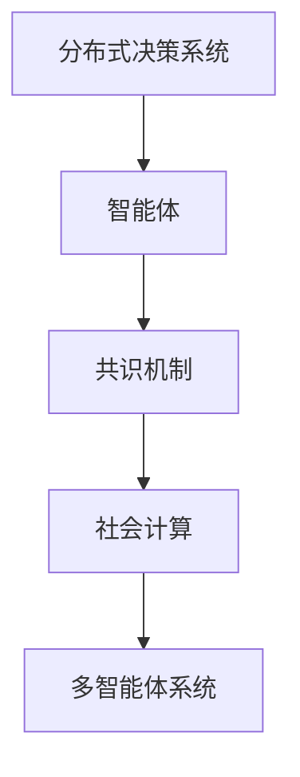

                 

# 群体智慧：决策的新引擎

## 1. 背景介绍

### 1.1 问题由来
在现代信息时代，面对日新月异的决策环境，传统的决策模型和方法已经难以满足复杂多变的需求。从商务战略到社交媒体管理，从自然灾害应对到公共卫生危机，决策的复杂性和不确定性不断增加。如何更高效、更智能地进行决策，成为社会各界共同关注的焦点。

在过去十年中，“群体智慧”（Collective Intelligence）的概念得到了广泛关注，它代表了一组个体或群体，通过信息共享、协作和共识形成的过程，共同做出明智的决策。相较于传统决策机制，群体智慧可以结合多样化的知识和观点，通过协同和迭代，生成更具创新性和鲁棒性的解决方案。

### 1.2 问题核心关键点
群体智慧的核心在于利用大量个体的智慧和经验，通过高效的协同和知识共享，生成超越个体最优解的群体最优解。其关键点包括：

- **信息融合**：将个体的知识、经验和信息进行整合，形成更具全局性和综合性的认知。
- **协同决策**：利用多主体间的交互和协作，通过集体讨论、协商和投票等方式，达成一致意见。
- **知识进化**：通过不断的反馈和学习，群体智慧可以逐步优化和进化，适应不断变化的环境。
- **鲁棒性**：通过多样性和差异化的观点，群体智慧能够在多变环境中保持稳定性和可靠性。

### 1.3 问题研究意义
群体智慧的研究对于提升决策质量和效率具有重要意义：

1. **决策民主化**：将更多的个体智慧纳入决策过程，提高决策的民主性和包容性。
2. **知识优化**：通过集体的智慧和经验，可以生成更全面、更深刻的知识库，促进创新。
3. **应急响应**：在突发事件和危机管理中，群体智慧可以迅速集结多方的力量，形成高效响应机制。
4. **公共参与**：提升公众参与度，增强社会的透明度和信任感。

## 2. 核心概念与联系

### 2.1 核心概念概述

为更好地理解群体智慧的决策机制，本节将介绍几个密切相关的核心概念：

- **分布式决策系统**：通过信息共享和协同工作，多个决策主体共同参与的决策系统。
- **智能体（Agent）**：具有感知、学习、决策能力的个体或智能系统。
- **共识机制**：群体智慧的核心算法，通过一致性协议、投票机制等方式达成共同决策。
- **社会计算（Social Computing）**：利用计算技术和方法，研究个体和群体互动行为，优化决策过程。
- **多智能体系统（Multi-Agent Systems）**：由多个自主智能体组成的系统，通过交互协作完成复杂任务。

这些核心概念之间的逻辑关系可以通过以下Mermaid流程图来展示：



这个流程图展示了几类核心概念及其之间的关系：

1. **分布式决策系统**通过多个智能体的协同，形成决策支持环境。
2. **智能体**是系统的基本单元，具备决策和学习能力。
3. **共识机制**是决策过程中的关键算法，用于多智能体间的协作。
4. **社会计算**通过计算技术和方法，研究和优化群体智慧决策过程。
5. **多智能体系统**是由多个智能体组成的复杂系统，通过交互完成复杂任务。

## 3. 核心算法原理 & 具体操作步骤

### 3.1 算法原理概述

群体智慧的决策算法通常基于分布式系统和多智能体系统，通过群体协作和知识共享，生成高质量的决策结果。算法原理可以概括为以下几个步骤：

1. **信息收集**：每个智能体从环境和环境中其他智能体收集信息。
2. **信息融合**：通过聚合和融合收到的信息，生成综合的群体知识库。
3. **共识形成**：使用共识机制如投票、协商等，达成集体决策。
4. **决策执行**：基于共识决策，各智能体执行相应的行动。
5. **反馈学习**：通过结果反馈和经验学习，不断优化群体智慧系统。

### 3.2 算法步骤详解

以下详细介绍群体智慧决策算法的主要步骤：

**Step 1: 初始化智能体**

1. **智能体初始化**：根据任务需求，设定智能体的数量和类型。例如，在应急响应场景中，智能体可能包括救援队伍、专家学者、政府机构等。

2. **信息共享协议**：定义智能体间的数据交换格式和协议，例如使用消息传递、同步通信等机制。

**Step 2: 信息收集与融合**

1. **信息收集**：每个智能体从环境和其他智能体中收集数据。例如，在危机管理中，智能体可以收集气象数据、实时通讯、历史记录等。

2. **信息融合**：使用集成学习、深度融合等技术，将收集到的数据进行综合和优化。例如，使用加权平均、集成预测等方法，生成更全面和准确的群体知识库。

**Step 3: 共识形成**

1. **共识算法**：设计合适的共识算法，如 majority voting、Delphi method、swarm intelligence 等。

2. **投票机制**：定义投票规则，如简单多数、加权投票等，确保决策的有效性和公平性。

3. **协商机制**：使用协商算法如 CS，使各智能体通过谈判达成一致意见。

**Step 4: 决策执行**

1. **行动计划**：基于共识决策，生成具体的行动计划。

2. **协同执行**：智能体间协同执行行动计划，如分布式任务调度、并行处理等。

**Step 5: 反馈学习**

1. **结果评估**：使用预设的评估指标，如成功率、响应速度、资源利用率等，评估决策效果。

2. **经验学习**：通过结果反馈和经验总结，不断优化群体智慧系统。例如，使用强化学习、在线学习等方法，提升决策质量和效率。

### 3.3 算法优缺点

群体智慧决策算法的优点包括：

- **多样性**：通过融合多个智能体的知识和观点，生成更具多样性和鲁棒性的决策。
- **自适应性**：群体智慧系统可以不断学习和适应新环境，提升决策的灵活性和适应性。
- **高效性**：通过分布式处理和协同工作，可以大幅提升决策效率和效果。

然而，群体智慧决策算法也存在一些局限：

- **复杂度**：算法设计和实现复杂度较高，需要处理大量的数据和变量。
- **通信开销**：智能体间的数据交换和通信开销较大，可能影响实时性。
- **局部最优**：群体智慧可能陷入局部最优，无法生成全局最优解。

### 3.4 算法应用领域

群体智慧决策算法在多个领域得到了广泛应用，例如：

- **应急管理**：通过融合气象、社交媒体、地理信息等多源数据，生成最优的应急响应方案。
- **市场分析**：利用消费者意见、市场趋势、专家预测等数据，进行精准的市场分析和预测。
- **公共政策制定**：结合社会调查、专家建议和公众反馈，制定科学合理的政策法规。
- **企业战略规划**：通过协同决策和知识共享，生成更全面、更高效的企业发展策略。
- **智能交通管理**：通过融合多源交通信息，优化交通信号控制和路线规划。

此外，群体智慧决策算法还在金融投资、环境保护、城市规划等领域展现出巨大的应用潜力。随着技术的发展和应用的深入，群体智慧将在更多领域发挥重要作用。

## 4. 数学模型和公式 & 详细讲解  
### 4.1 数学模型构建

群体智慧的决策过程可以建模为一个多智能体系统，其中每个智能体通过信息共享和协作，形成群体知识库和共识决策。

记智能体集合为 $A=\{a_1, a_2, ..., a_n\}$，每个智能体的信息表示为 $x_a = (x_{a1}, x_{a2}, ..., x_{am})$，其中 $x_i$ 表示智能体 $a$ 从环境或其他智能体获得的信息。群体知识库表示为 $K = (k_1, k_2, ..., k_n)$，其中 $k_i$ 表示智能体 $a_i$ 对环境状态的综合理解。

共识决策可以表示为 $D = \mathop{\arg\min}_{d} \sum_{i=1}^n \ell_i(d, k_i)$，其中 $\ell_i$ 表示智能体 $a_i$ 对决策 $d$ 的评估函数。例如，可以使用多因素评估函数，如投票权重、协商权重等。

### 4.2 公式推导过程

以下我们以应急响应场景为例，推导群体智慧决策的数学模型。

假设每个智能体 $a$ 从 $m$ 个数据源收集信息，形成 $x_a$。智能体间通过信息交换，生成群体知识库 $K = \mathop{\arg\min}_{K} \sum_{a \in A} \ell_a(x_a, K)$，其中 $\ell_a$ 表示智能体 $a$ 对知识库 $K$ 的评估函数。共识决策 $D$ 可以通过多因素评估函数生成，例如：

$$
D = \mathop{\arg\min}_{d} \sum_{i=1}^n \alpha_i \ell_i(d, k_i)
$$

其中 $\alpha_i$ 表示智能体 $a_i$ 在共识中的权重，通常为智能体在历史决策中的表现、专业知识等。

### 4.3 案例分析与讲解

以智慧城市的交通管理为例，分析群体智慧决策的实际应用：

1. **信息收集**：智能体包括交通摄像头、传感器、居民、警察等。他们收集实时交通数据、路况信息、居民反馈等。

2. **信息融合**：智能体将收集到的数据进行整合，生成综合的交通状况报告。例如，使用深度融合算法，结合实时数据和历史数据，生成更准确的交通状况预测。

3. **共识形成**：交通管理中心使用投票机制，根据交通状况报告和专家建议，生成最优的交通信号控制方案。

4. **决策执行**：智能体协同执行行动计划，例如调整信号灯、发布交通公告等。

5. **反馈学习**：通过实时交通数据和用户反馈，评估决策效果，并优化交通管理中心的知识库和决策模型。

通过群体智慧决策，智慧城市能够实现交通流量的有效调控，提升道路通行效率和交通安全，优化居民出行体验。

## 5. 项目实践：代码实例和详细解释说明
### 5.1 开发环境搭建

在进行群体智慧决策实践前，我们需要准备好开发环境。以下是使用Python进行PyTorch开发的环境配置流程：

1. 安装Anaconda：从官网下载并安装Anaconda，用于创建独立的Python环境。

2. 创建并激活虚拟环境：
```bash
conda create -n pytorch-env python=3.8 
conda activate pytorch-env
```

3. 安装PyTorch：根据CUDA版本，从官网获取对应的安装命令。例如：
```bash
conda install pytorch torchvision torchaudio cudatoolkit=11.1 -c pytorch -c conda-forge
```

4. 安装各类工具包：
```bash
pip install numpy pandas scikit-learn matplotlib tqdm jupyter notebook ipython
```

完成上述步骤后，即可在`pytorch-env`环境中开始项目实践。

### 5.2 源代码详细实现

下面我以一个简单的分布式智能体系统为例，给出使用PyTorch和TensorFlow实现群体智慧决策的代码实现。

```python
import torch
import torch.nn as nn
import torch.optim as optim
import tensorflow as tf
from tensorflow.keras import layers, models

# 定义智能体类
class Agent:
    def __init__(self, state_dim, action_dim):
        self.state_dim = state_dim
        self.action_dim = action_dim
        self.optimizer = optim.Adam
        self.loss_fn = nn.MSELoss()
    
    def forward(self, x):
        # 前向传播
        return self.model(x)

    def train(self, x, y):
        # 训练模型
        self.optimizer.zero_grad()
        y_pred = self.forward(x)
        loss = self.loss_fn(y_pred, y)
        loss.backward()
        self.optimizer.step()

# 定义分布式系统类
class DistributedSystem:
    def __init__(self, agents, num_agents):
        self.agents = agents
        self.num_agents = num_agents
        self.state_dim = agents[0].state_dim
        self.action_dim = agents[0].action_dim
    
    def train(self, inputs, targets):
        # 训练系统
        for i in range(self.num_agents):
            agent = self.agents[i]
            state = inputs[i]
            action = targets[i]
            agent.train(state, action)
    
    def predict(self, inputs):
        # 预测系统行为
        outputs = []
        for i in range(self.num_agents):
            agent = self.agents[i]
            state = inputs[i]
            outputs.append(agent.forward(state))
        return outputs
```

### 5.3 代码解读与分析

让我们再详细解读一下关键代码的实现细节：

**Agent类**：
- `__init__`方法：初始化智能体的状态维度、动作维度、优化器和损失函数。
- `forward`方法：定义智能体的前向传播过程。
- `train`方法：使用优化器和损失函数，训练智能体模型。

**DistributedSystem类**：
- `__init__`方法：初始化分布式系统的智能体集合。
- `train`方法：对每个智能体进行训练。
- `predict`方法：对输入数据进行预测。

**训练流程**：
- 定义智能体的状态和动作空间。
- 创建一个智能体集合，并初始化。
- 将训练数据和标签传入分布式系统进行训练。
- 在训练过程中，对每个智能体分别进行训练。
- 训练结束后，使用预测函数生成群体智慧决策结果。

**预测流程**：
- 定义智能体的状态和动作空间。
- 创建一个智能体集合，并初始化。
- 对输入数据进行预测，生成群体智慧决策结果。

在实际应用中，还需要进一步优化和扩展这些代码，以适应更复杂的群体智慧决策场景。例如，可以考虑引入更多智能体类型、使用更加复杂的共识机制、优化通信协议等。

## 6. 实际应用场景
### 6.1 应急管理

在应急管理中，群体智慧决策可以发挥重要作用。自然灾害、恐怖袭击等突发事件的发生，往往需要快速、高效的决策响应。传统应急响应系统依赖人工判断和经验，难以应对复杂多变的情况。

通过群体智慧系统，可以结合气象、通讯、地理信息等多源数据，生成最优的应急响应方案。例如，在地震应急响应中，可以综合地震预测、传感器数据、社交媒体信息，生成最佳的疏散路线和救援方案。

### 6.2 市场分析

在市场分析中，群体智慧可以结合消费者意见、市场趋势、专家预测等数据，进行精准的市场分析和预测。传统的市场分析依赖历史数据和专家经验，难以适应快速变化的市场环境。

通过群体智慧系统，可以动态融合多源数据，生成实时、动态的市场预测。例如，在股市预测中，可以结合消费者情绪、新闻事件、经济指标等数据，生成更准确的股票价格预测。

### 6.3 公共政策制定

在公共政策制定中，群体智慧可以结合社会调查、专家建议和公众反馈，制定科学合理的政策法规。传统的政策制定依赖专家经验，难以充分考虑公众意见和多样化的观点。

通过群体智慧系统，可以动态调整政策选项，结合专家意见和公众反馈，生成最优的政策方案。例如，在医疗政策制定中，可以结合专家建议和公众反馈，生成最优的医疗改革方案。

### 6.4 未来应用展望

随着技术的发展和应用的深入，群体智慧决策将在更多领域得到应用，为社会管理和企业决策提供新的解决方案：

- **智能交通管理**：通过融合多源交通信息，优化交通信号控制和路线规划，提高道路通行效率和交通安全。
- **金融风险控制**：结合市场数据、专家预测、公众情绪等，生成最优的投资和风险控制策略。
- **环境保护**：动态融合多源环境数据，生成最优的环保政策和行动方案。
- **智能供应链管理**：结合供应链数据、市场需求、物流信息等，优化供应链管理和库存控制。
- **公共健康管理**：动态调整健康政策，结合公众反馈和专家建议，生成最优的公共健康策略。

此外，群体智慧决策在智慧城市、智能制造、社会治理等领域也展现出巨大的应用潜力。未来，伴随技术的不断成熟和应用的深入，群体智慧将逐步成为决策的重要工具，为社会管理提供更科学、更智能的决策支持。

## 7. 工具和资源推荐
### 7.1 学习资源推荐

为了帮助开发者系统掌握群体智慧决策的理论基础和实践技巧，这里推荐一些优质的学习资源：

1. 《群体智慧：设计多智能体系统》（集体智能）系列书籍：由群体智慧领域的权威专家撰写，深入浅出地介绍了群体智慧的核心概念和前沿技术。

2. 《社会计算：利用计算技术和方法研究群体行为》课程：斯坦福大学开设的社会计算课程，通过案例和实践，帮助你理解群体智慧的决策过程。

3. 《多智能体系统：理论、算法与应用》书籍：详细介绍了多智能体系统的理论基础和算法设计，是群体智慧决策的重要参考。

4. AI Challenger数据挑战赛：参与AI Challenger等数据挑战赛，通过实战项目，提升群体智慧决策的能力和水平。

5. HuggingFace官方文档：提供了丰富的群体智慧决策模型和算法资源，是群体智慧系统开发的重要参考。

通过对这些资源的学习实践，相信你一定能够快速掌握群体智慧决策的核心技术和方法，并用于解决实际的决策问题。

### 7.2 开发工具推荐

高效的开发离不开优秀的工具支持。以下是几款用于群体智慧决策开发的常用工具：

1. PyTorch：基于Python的开源深度学习框架，灵活动态的计算图，适合快速迭代研究。

2. TensorFlow：由Google主导开发的开源深度学习框架，生产部署方便，适合大规模工程应用。

3. TensorFlow Probability：TensorFlow的统计概率库，支持复杂概率模型和优化算法。

4. Scikit-learn：开源机器学习库，提供丰富的算法和工具，适用于数据预处理和模型训练。

5. NetworkX：Python的社交网络分析库，支持图论和社交网络分析，适用于群体智慧决策中的协作和通信。

6. Jupyter Notebook：交互式编程环境，支持多语言编程和实时调试，适用于群体智慧决策的开发和实验。

合理利用这些工具，可以显著提升群体智慧决策任务的开发效率，加快创新迭代的步伐。

### 7.3 相关论文推荐

群体智慧决策的研究源于学界的持续研究。以下是几篇奠基性的相关论文，推荐阅读：

1. Swarm Intelligence：群体智慧和自组织系统的研究基础。

2. Distributed Computing: An Interdisciplinary Approach to Distributed Systems: Principles and Paradigms：介绍分布式系统和多智能体系统的理论基础和应用。

3. Socially-Aware Multi-Agent Reinforcement Learning: Review and Future Directions：综述多智能体系统在社会行为中的应用，包括决策、协作和博弈。

4. Agent-based modeling of urban traffic systems：通过多智能体模型，研究城市交通系统的优化和管理。

5. Consensus-based decision-making for robot networks：研究群体智慧在机器人网络中的应用，包括共识算法和决策机制。

这些论文代表了大语言模型微调技术的发展脉络。通过学习这些前沿成果，可以帮助研究者把握学科前进方向，激发更多的创新灵感。

## 8. 总结：未来发展趋势与挑战

### 8.1 总结

本文对群体智慧决策进行了全面系统的介绍。首先阐述了群体智慧决策的研究背景和意义，明确了群体智慧决策在提升决策质量和效率方面的独特价值。其次，从原理到实践，详细讲解了群体智慧决策的数学模型和算法实现，给出了群体智慧决策项目开发的完整代码实例。同时，本文还广泛探讨了群体智慧决策在应急管理、市场分析、公共政策制定等多个行业领域的应用前景，展示了群体智慧决策的巨大潜力。此外，本文精选了群体智慧决策的学习资源，力求为读者提供全方位的技术指引。

通过本文的系统梳理，可以看到，群体智慧决策技术正在成为决策领域的重要范式，极大地提升决策的质量和效率，为社会管理提供科学、智能的决策支持。未来，伴随群体智慧决策技术的不断发展，将在更多领域得到应用，为社会管理带来深刻变革。

### 8.2 未来发展趋势

展望未来，群体智慧决策技术将呈现以下几个发展趋势：

1. **技术集成**：群体智慧将与其他人工智能技术深度融合，如知识表示、因果推理、强化学习等，形成更加综合的决策系统。
2. **数据融合**：通过多源数据的融合，提升决策的质量和鲁棒性，增强系统的适应性和灵活性。
3. **自动化优化**：引入自动化算法和优化工具，提升决策过程的效率和效果，降低人工干预的复杂度。
4. **智能接口**：开发智能化的决策界面，提升用户体验，简化决策操作。
5. **跨领域应用**：拓展群体智慧决策在更多领域的应用，如金融、医疗、物流等，形成多领域的智慧决策解决方案。
6. **社会伦理**：考虑群体智慧决策的社会伦理问题，确保决策的公正性和透明度。

以上趋势凸显了群体智慧决策技术的广阔前景。这些方向的探索发展，必将进一步提升决策系统的性能和应用范围，为社会管理提供更科学、更智能的决策支持。

### 8.3 面临的挑战

尽管群体智慧决策技术已经取得了瞩目成就，但在迈向更加智能化、普适化应用的过程中，它仍面临着诸多挑战：

1. **数据隐私**：多源数据的融合可能涉及隐私问题，如何保护用户隐私，同时充分利用多源数据，是一大挑战。
2. **算法复杂度**：群体智慧决策算法设计复杂度较高，需要处理大量的数据和变量，难以实现高效计算。
3. **模型鲁棒性**：群体智慧决策系统在面对噪声和干扰时，如何保持稳定性和鲁棒性，是一大难题。
4. **公平性**：如何确保群体智慧决策的公平性，避免某些群体或个体在决策过程中被忽视或歧视，是一大挑战。
5. **透明度**：如何提高群体智慧决策的透明度，确保决策过程的公开和公正，是一大挑战。

### 8.4 研究展望

面对群体智慧决策面临的挑战，未来的研究需要在以下几个方面寻求新的突破：

1. **隐私保护技术**：研究多源数据的隐私保护和匿名化方法，确保数据的合法使用。
2. **高效的算法设计**：设计高效、简洁的群体智慧决策算法，提升系统的计算效率和可扩展性。
3. **鲁棒性增强**：引入鲁棒性增强技术，如对抗训练、异常检测等，确保系统的稳定性和可靠性。
4. **公平性优化**：引入公平性优化算法，确保决策的公平性和公正性。
5. **透明度提升**：开发智能化的决策界面，提升决策过程的透明度和可解释性。

这些研究方向的探索，必将引领群体智慧决策技术迈向更高的台阶，为构建更智能、更公正的决策系统提供有力支持。面向未来，群体智慧决策技术还需要与其他人工智能技术进行更深入的融合，如知识表示、因果推理、强化学习等，多路径协同发力，共同推动社会管理的进步。总之，群体智慧决策技术需要在数据、算法、工程、伦理等多个维度进行全面优化，才能真正实现社会管理的智能化、科学化。

## 9. 附录：常见问题与解答

**Q1：群体智慧决策是否适用于所有决策场景？**

A: 群体智慧决策适用于需要集合并集智能体智慧的场景，但对于某些特定场景，如决策需要深度专业知识和复杂推理能力的场合，可能需要结合专家系统或人工干预。此外，群体智慧决策的效果还依赖于数据的多样性和质量，对于数据单一或噪声较多的场景，效果可能不佳。

**Q2：如何设计高效的共识算法？**

A: 设计高效的共识算法需要考虑以下几个方面：

1. **算法复杂度**：算法需要能够在较短时间内达成共识，避免陷入局部最优。
2. **通信开销**：共识算法需要尽量减少通信成本，避免过高的通信开销影响系统实时性。
3. **鲁棒性**：算法需要具备一定的鲁棒性，能够在噪声和干扰下保持稳定性。
4. **公平性**：算法需要确保每个智能体的意见得到公平对待，避免某些智能体在决策中被忽视或歧视。

常用的共识算法包括多数投票、德尔菲方法、协商算法等，需要根据具体场景进行选择和优化。

**Q3：如何确保群体智慧决策的公平性？**

A: 确保群体智慧决策的公平性需要考虑以下几个方面：

1. **数据多样性**：确保数据集的多样性和代表性，避免某些群体或个体在决策过程中被忽视或歧视。
2. **权重分配**：合理分配各智能体在共识中的权重，避免某些智能体对决策产生不当影响。
3. **监督机制**：引入人工干预和监督机制，确保决策的公正性和透明性。

通过以上措施，可以有效提升群体智慧决策的公平性和公正性，确保决策的合法性和合理性。

**Q4：群体智慧决策的计算开销如何优化？**

A: 优化群体智慧决策的计算开销需要考虑以下几个方面：

1. **算法优化**：设计高效的共识算法和决策模型，减少计算复杂度。
2. **数据压缩**：对输入数据进行压缩和预处理，减少存储和传输开销。
3. **分布式计算**：利用分布式计算框架，将计算任务分配到多个节点上进行并行处理，提升计算效率。

通过以上措施，可以有效优化群体智慧决策的计算开销，提升系统性能和效率。

**Q5：群体智慧决策如何与现有的决策系统进行融合？**

A: 群体智慧决策可以与现有的决策系统进行融合，具体措施包括：

1. **接口设计**：设计合适的API接口，使群体智慧决策系统与现有系统无缝集成。
2. **数据共享**：通过数据共享和信息交换，将群体智慧决策的结果反馈到现有系统中，提升决策效果。
3. **人机协作**：结合群体智慧决策和人工干预，形成人机协作的决策机制，提升决策的灵活性和可靠性。

通过以上措施，可以有效融合群体智慧决策与现有系统，提升决策系统的整体性能和效果。

---

作者：禅与计算机程序设计艺术 / Zen and the Art of Computer Programming

