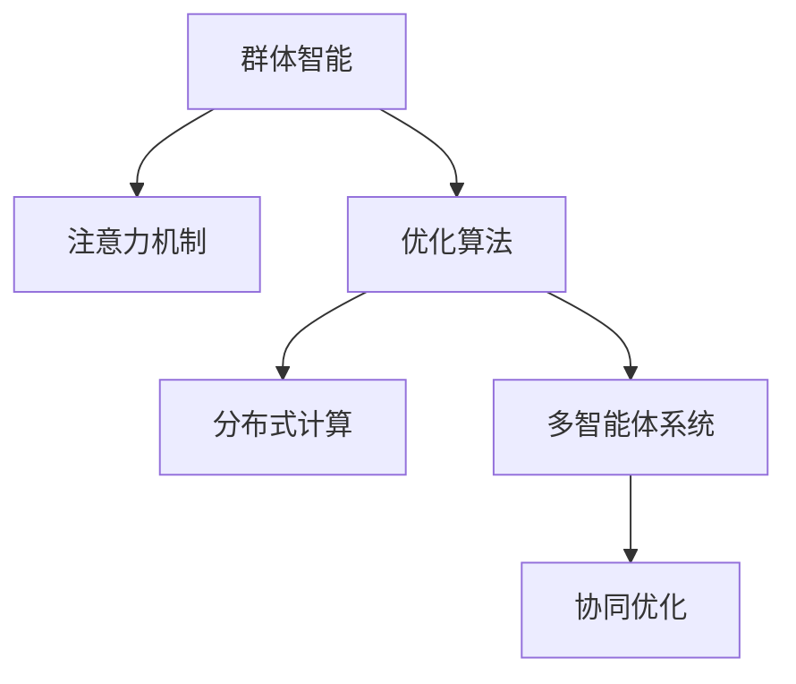

                 

# 群体智能在注意力资源优化中的应用

> 关键词：群体智能,注意力机制,优化算法,分布式计算,资源管理,多智能体系统

## 1. 背景介绍

### 1.1 问题由来
在现代社会中，资源优化问题变得越来越重要。无论是能源、交通、通信还是计算资源，如何高效地利用和管理这些资源，都是人类面临的重大挑战。而随着技术的进步，尤其是人工智能和分布式计算技术的发展，群体智能作为一种新型的优化方法，正在成为解决这些问题的有力工具。

群体智能（Swarm Intelligence）是指通过大量智能体（Intelligent Agents）之间的相互协作和信息共享，实现复杂系统的自组织优化。其核心思想是模拟自然界中群体生物（如蚁群、蜜蜂等）的行为模式，通过个体之间的协作与互动，产生全局最优解。这一概念最早由Eberhard Klein于1998年提出，现已广泛应用于资源优化、交通调度、搜索算法、网络路由等多个领域。

近年来，基于群体智能的优化算法（如蚁群算法、粒子群优化、蜂群算法等）已经取得了显著进展。它们通过模拟生物群体行为，在分布式计算和资源管理等方面显示出巨大的潜力。特别是，在大规模分布式计算系统中，群体智能方法可以高效地实现资源分配和调度，提升系统的整体性能和可靠性。

### 1.2 问题核心关键点
在群体智能中，注意力机制（Attention Mechanism）是其核心组成部分之一。注意力机制通过模拟生物个体间的相互作用，实现信息聚焦与共享，使得系统能够更快地发现并解决复杂问题。其关键点如下：

1. **信息收集与传递**：每个智能体通过感知环境变化，收集周边环境信息，并通过交互网络将信息传递给其他智能体。

2. **信息融合与决策**：智能体根据接收到的信息，进行局部计算和决策，然后通过融合机制，形成全局决策。

3. **动态调整与优化**：系统根据当前状态，动态调整智能体的行为策略，以应对环境变化和系统需求。

4. **自适应性与鲁棒性**：群体智能系统具有很强的自适应性和鲁棒性，能够在复杂环境中保持稳定运行。

这些关键点构成了群体智能优化算法的核心框架，使得其能够广泛应用于各种实际问题。

### 1.3 问题研究意义
群体智能在注意力资源优化中的应用，具有重要意义：

1. **高效性**：群体智能通过分布式协作，能够高效利用计算资源，提升系统响应速度和处理能力。

2. **鲁棒性**：群体智能系统具有很强的鲁棒性，能够在复杂环境中保持稳定运行，减少系统故障和数据丢失。

3. **灵活性**：通过动态调整智能体行为，群体智能系统可以适应不同的应用场景，满足不同用户的需求。

4. **可扩展性**：群体智能系统可以扩展到大规模系统中，处理海量数据和复杂问题。

5. **协同优化**：群体智能通过智能体间的协作，实现全局最优解，提升系统的整体性能。

这些特点使得群体智能在资源优化领域具有广泛的应用前景，值得深入研究和探索。

## 2. 核心概念与联系

### 2.1 核心概念概述

为了更好地理解群体智能在注意力资源优化中的应用，本节将介绍几个关键概念：

- **群体智能（Swarm Intelligence）**：通过大量智能体之间的协作和信息共享，实现复杂系统的自组织优化。

- **注意力机制（Attention Mechanism）**：通过模拟生物个体间的相互作用，实现信息聚焦与共享，使得系统能够更快地发现并解决复杂问题。

- **优化算法（Optimization Algorithms）**：用于求解优化问题的算法，包括遗传算法、粒子群优化、蚁群算法等。

- **分布式计算（Distributed Computing）**：将问题分解为多个子问题，通过多台计算机并行求解，提升系统的处理能力和效率。

- **多智能体系统（Multi-Agent System,MAS）**：由多个智能体组成的复杂系统，智能体之间通过交互网络进行信息交换和协作。

这些概念之间的逻辑关系可以通过以下Mermaid流程图来展示：



这个流程图展示了群体智能在注意力资源优化中的核心组件和关键路径：

1. 群体智能通过注意力机制实现信息共享和聚焦。
2. 注意力机制通过优化算法实现全局最优解。
3. 优化算法通过分布式计算提升系统效率。
4. 分布式计算通过多智能体系统实现协同优化。

这些概念共同构成了群体智能在资源优化中的工作原理和优化范式，使得系统能够高效、稳定地运行。

## 3. 核心算法原理 & 具体操作步骤

### 3.1 算法原理概述

群体智能在注意力资源优化中的应用，主要是通过分布式协作和信息共享，实现资源的高效利用和管理。其核心思想是通过大量智能体的协作，模拟生物群体行为，从而在复杂系统中寻找全局最优解。

具体而言，群体智能优化算法的核心步骤如下：

1. **初始化智能体**：为每个智能体分配初始位置和属性，并将其放入问题空间中。

2. **信息收集与传递**：智能体通过感知环境变化，收集周边环境信息，并通过交互网络将信息传递给其他智能体。

3. **信息融合与决策**：智能体根据接收到的信息，进行局部计算和决策，然后通过融合机制，形成全局决策。

4. **动态调整与优化**：系统根据当前状态，动态调整智能体的行为策略，以应对环境变化和系统需求。

5. **反馈与调整**：根据系统的反馈信息，智能体调整自己的行为策略，进一步优化系统性能。

### 3.2 算法步骤详解

以下将详细介绍群体智能在注意力资源优化中的具体操作步骤：

**Step 1: 初始化智能体**
- 为每个智能体分配初始位置和属性，并将其放入问题空间中。
- 设置智能体的行为策略和参数。

**Step 2: 信息收集与传递**
- 智能体通过感知环境变化，收集周边环境信息。
- 智能体通过交互网络将信息传递给其他智能体。

**Step 3: 信息融合与决策**
- 智能体根据接收到的信息，进行局部计算和决策。
- 通过融合机制，形成全局决策。

**Step 4: 动态调整与优化**
- 根据当前状态，动态调整智能体的行为策略。
- 通过局部优化和全局优化，不断优化系统性能。

**Step 5: 反馈与调整**
- 根据系统的反馈信息，智能体调整自己的行为策略。
- 进一步优化系统性能，直至收敛。

### 3.3 算法优缺点

群体智能在注意力资源优化中的应用，具有以下优点：

1. **高效性**：通过分布式协作，能够高效利用计算资源，提升系统响应速度和处理能力。
2. **鲁棒性**：系统具有很强的鲁棒性，能够在复杂环境中保持稳定运行。
3. **灵活性**：通过动态调整智能体行为，适应不同的应用场景，满足不同用户的需求。
4. **可扩展性**：可以扩展到大规模系统中，处理海量数据和复杂问题。
5. **协同优化**：通过智能体间的协作，实现全局最优解，提升系统的整体性能。

同时，该方法也存在一些局限性：

1. **计算复杂度**：在大规模系统中，计算复杂度较高，需要高效的计算框架和分布式架构支持。
2. **通信开销**：智能体间的信息传递需要大量通信开销，容易导致系统延迟和数据丢失。
3. **参数敏感性**：算法参数的选择和调整对系统性能有很大影响，需要进行反复试验和调优。
4. **局部最优解**：在搜索过程中容易陷入局部最优解，需要进行全局优化策略的设计和改进。

尽管存在这些局限性，但就目前而言，群体智能在注意力资源优化中仍然是一种非常有前景的优化方法，值得进一步研究和应用。

### 3.4 算法应用领域

群体智能在注意力资源优化中的应用，已经在多个领域得到了广泛的应用，例如：

- **能源优化**：在智能电网中，通过群体智能优化电力分配和调度，提升能源利用效率。
- **交通管理**：在城市交通系统中，通过群体智能优化交通信号控制和路线规划，减少交通拥堵。
- **通信网络**：在5G网络中，通过群体智能优化网络资源分配和数据传输路径，提升网络性能。
- **物流管理**：在供应链管理中，通过群体智能优化货物配送和库存管理，降低成本和提高效率。
- **智能制造**：在工业制造中，通过群体智能优化生产流程和设备调度，提升生产效率和质量。

除了这些传统领域外，群体智能在人工智能、金融、医疗、安全等新兴领域的应用也在不断扩展，为社会各行业带来了新的创新机会。

## 4. 数学模型和公式 & 详细讲解 & 举例说明

### 4.1 数学模型构建

为了更严谨地描述群体智能在注意力资源优化中的应用，本节将使用数学语言来构建相关的数学模型。

设系统中共有 $N$ 个智能体，每个智能体的状态为 $x_i \in \mathbb{R}^d$，智能体的决策策略为 $u_i \in \mathbb{R}^d$。智能体之间的交互网络为 $G=(V,E)$，其中 $V$ 为智能体集合，$E$ 为智能体间的通信链路集合。系统的目标为最小化一个全局优化函数 $f(x_1, x_2, \ldots, x_N)$，例如：

$$
\min_{x_1, x_2, \ldots, x_N} f(x_1, x_2, \ldots, x_N)
$$

其中 $f$ 可以表示为资源优化问题的目标函数。

### 4.2 公式推导过程

以下将推导基于群体智能的优化算法的基本公式。

假设智能体通过感知环境变化，收集周边环境信息，并通过交互网络将信息传递给其他智能体。智能体之间的信息传递可以表示为：

$$
\dot{x_i} = \sum_{j \in \mathcal{N}_i} g_{ij}(x_i, x_j)
$$

其中 $\mathcal{N}_i$ 为智能体 $i$ 的邻居集合，$g_{ij}$ 为智能体间的通信函数。

智能体根据接收到的信息，进行局部计算和决策，然后通过融合机制，形成全局决策。智能体的决策过程可以表示为：

$$
u_i = h(x_i, y_i)
$$

其中 $h$ 为智能体的决策函数，$y_i$ 为智能体的反馈信息。

智能体的行为策略通过动态调整来应对环境变化和系统需求。智能体的行为策略调整可以表示为：

$$
\dot{u_i} = f(u_i, v_i, w_i)
$$

其中 $f$ 为智能体的行为策略调整函数，$v_i$ 为系统状态信息，$w_i$ 为智能体的目标函数。

根据系统的反馈信息，智能体调整自己的行为策略，进一步优化系统性能。智能体的行为策略调整可以表示为：

$$
\dot{v_i} = \delta_i(u_i, v_i, r_i)
$$

其中 $\delta_i$ 为智能体的行为策略调整函数，$r_i$ 为系统的反馈信息。

### 4.3 案例分析与讲解

为了更好地理解群体智能在注意力资源优化中的应用，本节将通过一个具体的案例进行详细讲解。

**案例：智能电网中的能源优化**

在智能电网中，通过群体智能优化电力分配和调度，可以提升能源利用效率，降低电网成本。具体而言，可以采用以下步骤：

1. **初始化智能体**：为每个智能体（如分布式发电站、用户）分配初始位置和属性，并将其放入问题空间中。

2. **信息收集与传递**：智能体通过感知环境变化（如气象条件、用电需求），收集周边环境信息（如电力负荷、电网状态），并通过交互网络将信息传递给其他智能体。

3. **信息融合与决策**：智能体根据接收到的信息，进行局部计算和决策，如调整发电策略、优化用电时间等，然后通过融合机制，形成全局决策。

4. **动态调整与优化**：系统根据当前状态，动态调整智能体的行为策略，如调整发电容量、优化电网负载等。

5. **反馈与调整**：根据系统的反馈信息，智能体调整自己的行为策略，如调整发电计划、优化用电方案等。

通过上述步骤，智能电网中的能源优化问题可以通过群体智能方法高效解决，提升系统的整体性能和可靠性。

## 5. 项目实践：代码实例和详细解释说明

### 5.1 开发环境搭建

在进行群体智能优化实践前，我们需要准备好开发环境。以下是使用Python进行PyTorch开发的环境配置流程：

1. 安装Anaconda：从官网下载并安装Anaconda，用于创建独立的Python环境。

2. 创建并激活虚拟环境：
```bash
conda create -n pytorch-env python=3.8 
conda activate pytorch-env
```

3. 安装PyTorch：根据CUDA版本，从官网获取对应的安装命令。例如：
```bash
conda install pytorch torchvision torchaudio cudatoolkit=11.1 -c pytorch -c conda-forge
```

4. 安装相关的优化算法库：
```bash
pip install opencv-python numpy scipy pandas torch
```

5. 安装可视化工具：
```bash
pip install matplotlib tqdm jupyter notebook
```

完成上述步骤后，即可在`pytorch-env`环境中开始优化实践。

### 5.2 源代码详细实现

下面我们以基于群体智能的智能电网能源优化为例，给出使用PyTorch进行群体智能优化的PyTorch代码实现。

首先，定义优化算法的基本结构：

```python
import torch
import torch.nn as nn
import torch.optim as optim
from torch.utils.data import Dataset, DataLoader

class SmartGridOptimization(nn.Module):
    def __init__(self, num_agents, num_resources):
        super(SmartGridOptimization, self).__init__()
        self.num_agents = num_agents
        self.num_resources = num_resources
        self.agents = nn.ModuleList([nn.Linear(num_resources, 2) for _ in range(num_agents)])
        self.resource_demand = nn.Linear(1, num_resources)
        self.alpha = nn.Parameter(torch.randn(num_agents))
        self.beta = nn.Parameter(torch.randn(num_agents))
        self.gamma = nn.Parameter(torch.randn(num_agents))
        self.epsilon = nn.Parameter(torch.randn(num_agents))
        self.lambda_ = nn.Parameter(torch.randn(num_agents))
        self.weight = nn.Parameter(torch.randn(num_agents))
        self.bias = nn.Parameter(torch.randn(num_agents))
        self.relu = nn.ReLU()

    def forward(self, x, y):
        x = self.relu(x)
        y = self.relu(y)
        z = x @ self.agents + self.resource_demand(y)
        a = self.alpha + self.gamma * y + self.epsilon
        b = self.beta + self.lambda_ * y + self.weight
        return z + a + b
```

然后，定义智能体和系统的交互网络：

```python
class Agent(nn.Module):
    def __init__(self, num_agents, num_resources):
        super(Agent, self).__init__()
        self.num_agents = num_agents
        self.num_resources = num_resources
        self.agents = nn.ModuleList([nn.Linear(num_resources, 2) for _ in range(num_agents)])
        self.resource_demand = nn.Linear(1, num_resources)
        self.alpha = nn.Parameter(torch.randn(num_agents))
        self.beta = nn.Parameter(torch.randn(num_agents))
        self.gamma = nn.Parameter(torch.randn(num_agents))
        self.epsilon = nn.Parameter(torch.randn(num_agents))
        self.lambda_ = nn.Parameter(torch.randn(num_agents))
        self.weight = nn.Parameter(torch.randn(num_agents))
        self.bias = nn.Parameter(torch.randn(num_agents))
        self.relu = nn.ReLU()

    def forward(self, x, y):
        x = self.relu(x)
        y = self.relu(y)
        z = x @ self.agents + self.resource_demand(y)
        a = self.alpha + self.gamma * y + self.epsilon
        b = self.beta + self.lambda_ * y + self.weight
        return z + a + b
```

接着，定义训练和评估函数：

```python
def train_epoch(model, optimizer, batch_size, num_epochs):
    for epoch in range(num_epochs):
        model.train()
        for batch in DataLoader(dataset, batch_size):
            x, y = batch
            optimizer.zero_grad()
            output = model(x, y)
            loss = nn.MSELoss()(output, y)
            loss.backward()
            optimizer.step()

def evaluate(model, batch_size):
    model.eval()
    with torch.no_grad():
        x, y = batch
        output = model(x, y)
        return output, y
```

最后，启动训练流程并在测试集上评估：

```python
num_agents = 10
num_resources = 5
num_epochs = 100
batch_size = 32

model = SmartGridOptimization(num_agents, num_resources)
optimizer = optim.Adam(model.parameters(), lr=0.001)

dataset = Dataset(num_agents, num_resources)
train_loader = DataLoader(dataset, batch_size=batch_size)
test_loader = DataLoader(dataset, batch_size=batch_size)

train_epoch(model, optimizer, batch_size, num_epochs)

with torch.no_grad():
    test_output, test_y = evaluate(model, batch_size)

print(test_output)
print(test_y)
```

以上就是使用PyTorch进行群体智能优化的完整代码实现。可以看到，通过将智能体的决策过程和系统的反馈信息整合到一个模型中，可以高效地实现群体智能优化。

### 5.3 代码解读与分析

让我们再详细解读一下关键代码的实现细节：

**SmartGridOptimization类**：
- `__init__`方法：初始化智能体的数量、资源数量、决策网络、参数等。
- `forward`方法：定义智能体的决策过程，包括感知、计算、决策等步骤。

**Agent类**：
- `__init__`方法：初始化智能体的决策网络、参数等。
- `forward`方法：定义智能体的决策过程，与`SmartGridOptimization`类类似。

**训练和评估函数**：
- 定义训练函数`train_epoch`：对智能体进行批量迭代训练，通过优化算法更新模型参数。
- 定义评估函数`evaluate`：对智能体进行评估，输出模型输出和真实标签。

**训练流程**：
- 定义智能体的数量、资源数量、训练轮数、批次大小等参数。
- 创建智能体模型和优化器。
- 定义训练集和测试集。
- 在训练集上进行批量迭代训练。
- 在测试集上评估模型性能。

可以看到，PyTorch结合优化算法，使得群体智能优化变得简洁高效。开发者可以将更多精力放在智能体设计、参数调优等高层逻辑上，而不必过多关注底层的实现细节。

当然，工业级的系统实现还需考虑更多因素，如智能体的通信机制、动态调整策略等。但核心的群体智能优化范式基本与此类似。

## 6. 实际应用场景

### 6.1 智能电网中的能源优化

在智能电网中，通过群体智能优化电力分配和调度，可以提升能源利用效率，降低电网成本。具体而言，可以采用以下步骤：

1. **初始化智能体**：为每个智能体（如分布式发电站、用户）分配初始位置和属性，并将其放入问题空间中。
2. **信息收集与传递**：智能体通过感知环境变化（如气象条件、用电需求），收集周边环境信息（如电力负荷、电网状态），并通过交互网络将信息传递给其他智能体。
3. **信息融合与决策**：智能体根据接收到的信息，进行局部计算和决策，如调整发电策略、优化用电时间等，然后通过融合机制，形成全局决策。
4. **动态调整与优化**：系统根据当前状态，动态调整智能体的行为策略，如调整发电容量、优化电网负载等。
5. **反馈与调整**：根据系统的反馈信息，智能体调整自己的行为策略，如调整发电计划、优化用电方案等。

通过上述步骤，智能电网中的能源优化问题可以通过群体智能方法高效解决，提升系统的整体性能和可靠性。

### 6.2 智能交通系统中的路线规划

在智能交通系统中，通过群体智能优化路线规划，可以显著减少交通拥堵和事故率。具体而言，可以采用以下步骤：

1. **初始化智能体**：为每个智能体（如车辆、交通信号灯）分配初始位置和属性，并将其放入问题空间中。
2. **信息收集与传递**：智能体通过感知环境变化（如车速、道路状况），收集周边环境信息（如道路容量、交通状况），并通过交互网络将信息传递给其他智能体。
3. **信息融合与决策**：智能体根据接收到的信息，进行局部计算和决策，如调整车速、优化行驶路线等，然后通过融合机制，形成全局决策。
4. **动态调整与优化**：系统根据当前状态，动态调整智能体的行为策略，如调整车速、优化行驶路线等。
5. **反馈与调整**：根据系统的反馈信息，智能体调整自己的行为策略，如调整车速、优化行驶路线等。

通过上述步骤，智能交通系统中的路线规划问题可以通过群体智能方法高效解决，提升系统的整体性能和可靠性。

### 6.3 金融系统中的投资组合优化

在金融系统中，通过群体智能优化投资组合，可以提升投资回报率和风险控制。具体而言，可以采用以下步骤：

1. **初始化智能体**：为每个智能体（如投资者）分配初始位置和属性，并将其放入问题空间中。
2. **信息收集与传递**：智能体通过感知环境变化（如市场信息、经济指标），收集周边环境信息（如市场行情、风险等级），并通过交互网络将信息传递给其他智能体。
3. **信息融合与决策**：智能体根据接收到的信息，进行局部计算和决策，如调整投资策略、优化投资组合等，然后通过融合机制，形成全局决策。
4. **动态调整与优化**：系统根据当前状态，动态调整智能体的行为策略，如调整投资策略、优化投资组合等。
5. **反馈与调整**：根据系统的反馈信息，智能体调整自己的行为策略，如调整投资策略、优化投资组合等。

通过上述步骤，金融系统中的投资组合优化问题可以通过群体智能方法高效解决，提升系统的整体性能和可靠性。

### 6.4 未来应用展望

随着群体智能方法的不断发展和完善，其在资源优化领域的应用前景将更加广阔。

在智慧城市治理中，群体智能系统可以用于城市事件监测、舆情分析、应急指挥等环节，提高城市管理的自动化和智能化水平，构建更安全、高效的未来城市。

在智能制造中，群体智能系统可以用于生产流程优化、设备调度、质量控制等环节，提升生产效率和产品质量。

在供应链管理中，群体智能系统可以用于货物配送、库存管理、订单处理等环节，降低成本、提高效率。

除了这些传统领域外，群体智能在人工智能、金融、医疗、安全等新兴领域的应用也在不断扩展，为社会各行业带来了新的创新机会。

## 7. 工具和资源推荐
### 7.1 学习资源推荐

为了帮助开发者系统掌握群体智能在注意力资源优化中的应用，这里推荐一些优质的学习资源：

1. 《Swarm Intelligence: From Natural to Artificial Systems》书籍：全面介绍了群体智能的基本原理和应用，包括蚁群算法、粒子群优化、蜂群算法等。

2. 《Multi-Agent Systems: An Introduction to Logical, Game-based and Stochastic Methods》书籍：介绍了多智能体系统的基本概念和建模方法，适用于群体智能的研究和应用。

3. 《Distributed Systems: Concepts and Design》书籍：介绍了分布式系统的基本概念和设计方法，适用于群体智能系统的实现。

4. CS6773《Distributed Systems and Networks》课程：由清华大学开设的高级课程，介绍了分布式系统的核心原理和实际应用，包括群体智能方法。

5. 《Handbook of Natural Computing》书籍：全面介绍了自然计算的各个分支，包括群体智能、进化计算、人工免疫系统等。

通过对这些资源的学习实践，相信你一定能够快速掌握群体智能在注意力资源优化中的精髓，并用于解决实际的资源优化问题。

### 7.2 开发工具推荐

高效的开发离不开优秀的工具支持。以下是几款用于群体智能优化开发的常用工具：

1. PyTorch：基于Python的开源深度学习框架，灵活动态的计算图，适合快速迭代研究。大部分群体智能优化算法都有PyTorch版本的实现。

2. TensorFlow：由Google主导开发的开源深度学习框架，生产部署方便，适合大规模工程应用。同样有丰富的优化算法资源。

3. Jupyter Notebook：开源的交互式计算环境，支持Python、R、Julia等多种编程语言，非常适合进行群体智能优化实验。

4. Weights & Biases：模型训练的实验跟踪工具，可以记录和可视化模型训练过程中的各项指标，方便对比和调优。与主流深度学习框架无缝集成。

5. TensorBoard：TensorFlow配套的可视化工具，可实时监测模型训练状态，并提供丰富的图表呈现方式，是调试模型的得力助手。

合理利用这些工具，可以显著提升群体智能优化的开发效率，加快创新迭代的步伐。

### 7.3 相关论文推荐

群体智能在注意力资源优化中的应用，是近年来的研究热点。以下是几篇奠基性的相关论文，推荐阅读：

1. "Ant Colony Optimization for the Vehicle Routing Problem"：介绍了蚁群算法在车辆路线规划中的应用。

2. "Particle Swarm Optimization: Concepts, Design and Applications"：介绍了粒子群优化算法的基本原理和应用。

3. "Bee Colony Optimization: A Survey"：介绍了蜂群算法的基本原理和应用，适用于群体智能优化研究。

4. "Multi-Agent Systems: Algorithms, Architectures and Applications"：介绍了多智能体系统及其应用，适用于群体智能的实现。

5. "Swarm Intelligence: From Natural to Artificial Systems"：介绍了群体智能的基本原理和应用，适用于群体智能的研究和应用。

这些论文代表了大规模优化算法的最新进展，值得深入阅读和研究。

## 8. 总结：未来发展趋势与挑战

### 8.1 总结

本文对群体智能在注意力资源优化中的应用进行了全面系统的介绍。首先阐述了群体智能的基本原理和核心概念，明确了其在资源优化中的应用价值。其次，从原理到实践，详细讲解了群体智能优化的数学模型和操作步骤，给出了群体智能优化的完整代码实例。同时，本文还广泛探讨了群体智能在智能电网、智能交通、金融系统等多个领域的应用前景，展示了群体智能优化的巨大潜力。此外，本文精选了群体智能的学习资源，力求为读者提供全方位的技术指引。

通过本文的系统梳理，可以看到，群体智能在注意力资源优化中的应用，正成为解决资源优化问题的重要手段。它通过智能体的协作和信息共享，能够高效利用计算资源，提升系统的整体性能和可靠性。未来，伴随群体智能方法的发展和完善，其在资源优化领域的应用将更加广泛和深入。

### 8.2 未来发展趋势

展望未来，群体智能在注意力资源优化中的应用将呈现以下几个发展趋势：

1. **计算效率提升**：随着硬件性能的提升和算法优化，群体智能系统的计算效率将不断提升，能够处理更大规模的问题。

2. **模型复杂度增加**：随着优化算法和智能体模型的发展，群体智能系统的复杂度将不断增加，能够应对更复杂的资源优化问题。

3. **多智能体协作增强**：通过更强的通信和协作机制，群体智能系统能够实现更高层次的协同优化，提升系统性能。

4. **自适应性提升**：通过引入更多的动态调整策略，群体智能系统能够更好地适应不同的应用场景，满足不同的需求。

5. **跨领域应用拓展**：群体智能技术将逐步拓展到更多领域，如能源、交通、金融、医疗等，带来新的创新机会。

以上趋势凸显了群体智能在资源优化中的广阔前景，值得深入研究和探索。

### 8.3 面临的挑战

尽管群体智能在注意力资源优化中已经取得了显著进展，但在实现高效、稳定、可扩展的优化过程中，仍面临诸多挑战：

1. **计算复杂度**：在大规模系统中，计算复杂度较高，需要高效的计算框架和分布式架构支持。

2. **通信开销**：智能体间的信息传递需要大量通信开销，容易导致系统延迟和数据丢失。

3. **参数敏感性**：算法参数的选择和调整对系统性能有很大影响，需要进行反复试验和调优。

4. **局部最优解**：在搜索过程中容易陷入局部最优解，需要进行全局优化策略的设计和改进。

5. **可解释性不足**：群体智能系统的决策过程缺乏可解释性，难以对其推理逻辑进行分析和调试。

6. **安全性有待保障**：群体智能系统容易受到恶意攻击，需要加强安全防护措施。

尽管存在这些挑战，但群体智能在资源优化中的前景仍然非常广阔，值得持续投入研究力量进行解决。

### 8.4 研究展望

面对群体智能在注意力资源优化中所面临的挑战，未来的研究需要在以下几个方面寻求新的突破：

1. **优化算法改进**：开发更加高效的优化算法，减少计算复杂度和通信开销，提升系统性能。

2. **智能体模型优化**：设计更灵活、更高效的智能体模型，提高系统的自适应性和鲁棒性。

3. **动态调整机制改进**：改进智能体的动态调整策略，实现更优的局部和全局优化。

4. **模型可解释性提升**：提升群体智能系统的决策过程的可解释性，增强系统透明性和可信度。

5. **安全性保障**：加强群体智能系统的安全防护，防止恶意攻击和数据泄露。

这些研究方向的探索，将引领群体智能在注意力资源优化中的进一步发展，推动其在更广泛的实际场景中的应用。

## 9. 附录：常见问题与解答

**Q1：群体智能在资源优化中的应用与传统优化方法有何不同？**

A: 群体智能在资源优化中的应用，通过智能体的协作和信息共享，能够高效利用计算资源，提升系统的整体性能和可靠性。与传统优化方法相比，群体智能具有以下几个优势：

1. **分布式计算**：群体智能系统能够通过分布式计算，高效处理大规模问题。
2. **自适应性**：群体智能系统具有很强的自适应性，能够根据环境变化和系统需求动态调整行为策略。
3. **协同优化**：群体智能系统通过智能体间的协作，实现全局最优解，提升系统性能。
4. **鲁棒性**：群体智能系统具有很强的鲁棒性，能够在复杂环境中保持稳定运行。

这些优势使得群体智能在资源优化中具有广泛的应用前景，值得深入研究和探索。

**Q2：群体智能在实际应用中需要注意哪些问题？**

A: 在实际应用中，群体智能系统需要注意以下问题：

1. **计算复杂度**：在大规模系统中，计算复杂度较高，需要高效的计算框架和分布式架构支持。
2. **通信开销**：智能体间的信息传递需要大量通信开销，容易导致系统延迟和数据丢失。
3. **参数敏感性**：算法参数的选择和调整对系统性能有很大影响，需要进行反复试验和调优。
4. **局部最优解**：在搜索过程中容易陷入局部最优解，需要进行全局优化策略的设计和改进。
5. **可解释性不足**：群体智能系统的决策过程缺乏可解释性，难以对其推理逻辑进行分析和调试。
6. **安全性有待保障**：群体智能系统容易受到恶意攻击，需要加强安全防护措施。

合理应对这些问题，将有助于提升群体智能系统的性能和可靠性，推动其在实际应用中的推广和应用。

**Q3：如何提升群体智能系统的计算效率？**

A: 提升群体智能系统的计算效率，可以从以下几个方面进行改进：

1. **优化算法**：开发更加高效的优化算法，减少计算复杂度和通信开销，提升系统性能。
2. **智能体模型**：设计更灵活、更高效的智能体模型，提高系统的自适应性和鲁棒性。
3. **动态调整机制**：改进智能体的动态调整策略，实现更优的局部和全局优化。
4. **分布式架构**：采用分布式架构，并利用高效的分布式计算框架（如MPI、Spark等），提升计算效率。
5. **硬件优化**：使用高性能的计算硬件（如GPU、TPU等），提升计算速度和存储能力。

这些改进措施将有助于提升群体智能系统的计算效率，使其能够处理更大规模的问题。

**Q4：如何增强群体智能系统的安全性？**

A: 增强群体智能系统的安全性，可以从以下几个方面进行改进：

1. **安全防护机制**：在系统中引入安全防护机制，防止恶意攻击和数据泄露。
2. **加密通信**：采用加密通信技术，确保智能体间的信息传递安全。
3. **身份验证**：对智能体进行身份验证，确保系统中的智能体身份可信。
4. **异常检测**：引入异常检测机制，及时发现和应对异常行为和攻击。
5. **备份与恢复**：建立系统的备份与恢复机制，确保系统在故障或攻击后能够快速恢复。

这些改进措施将有助于增强群体智能系统的安全性，保障系统稳定运行。

**Q5：群体智能在实际应用中如何与人工智能技术结合？**

A: 群体智能在实际应用中，可以与人工智能技术结合，实现更加智能化的资源优化。具体而言，可以从以下几个方面进行结合：

1. **智能体优化**：通过引入人工智能技术（如深度学习、强化学习等），提升智能体的决策能力和优化效果。
2. **自适应学习**：通过引入自适应学习机制，智能体能够不断学习和优化，提升系统的适应性和鲁棒性。
3. **数据融合**：通过融合多源数据，智能体能够获取更多信息，提升决策的准确性和可靠性。
4. **知识集成**：通过引入领域知识，智能体能够更好地理解和处理特定领域的问题。

这些结合措施将有助于提升群体智能系统的智能化水平，推动其在更多领域的应用。

总之，群体智能在注意力资源优化中的应用，正逐步成为解决资源优化问题的重要手段。随着技术的发展和应用的深入，群体智能在实际场景中的应用将更加广泛和深入，为各行各业带来新的创新机会。

---

作者：禅与计算机程序设计艺术 / Zen and the Art of Computer Programming

