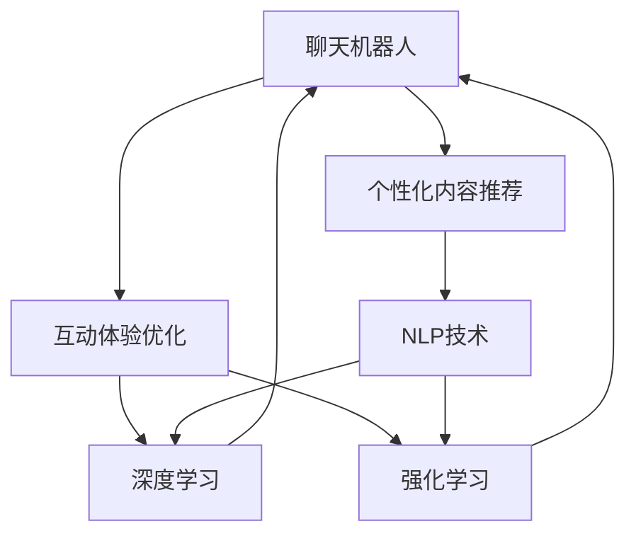

                 

# 聊天机器人娱乐业：个性化内容推荐和互动体验

> 关键词：聊天机器人,个性化推荐,互动体验,自然语言处理,NLP,深度学习,强化学习,用户行为分析,用户画像,内容匹配

## 1. 背景介绍

### 1.1 问题由来

随着人工智能技术的快速发展，聊天机器人在娱乐业中的应用愈发广泛。从传统的客服机器人到新颖的娱乐聊天应用，聊天机器人已经成为用户与企业、服务之间的重要桥梁。其智能、高效的互动体验，不仅提高了用户满意度，还为用户带来了丰富的娱乐体验。然而，要实现高度个性化的聊天互动，就需要依托于先进的技术和深度学习模型。

当前，基于深度学习的聊天机器人主要聚焦于文本生成、对话管理和情感理解等方面，并已在客户服务、教育辅导、娱乐交流等多个场景中得到应用。但如何提升聊天机器人的互动体验和内容推荐质量，仍然是业界关注的焦点。本文将探讨聊天机器人如何通过个性化内容推荐和互动体验来提升用户体验。

### 1.2 问题核心关键点

在娱乐业应用聊天机器人，核心问题如下：
1. **个性化内容推荐**：聊天机器人如何根据用户兴趣和行为，精准推荐适合的内容？
2. **互动体验优化**：聊天机器人如何提升与用户的互动体验，使用户参与感更强？
3. **数据驱动决策**：如何从大量用户行为数据中，提取关键信息并驱动个性化推荐和互动策略的优化？

这些问题需要深度学习、自然语言处理(NLP)、强化学习等多学科技术的融合，才能高效解决。

## 2. 核心概念与联系

### 2.1 核心概念概述

为更好地理解聊天机器人的个性化内容推荐和互动体验，本节将介绍几个核心概念：

- **聊天机器人(Chatbot)**：以文本或语音形式，通过深度学习模型实现与用户的自然交互。可以应用于客服、娱乐、教育等多个场景。

- **个性化内容推荐**：根据用户的历史行为、兴趣偏好等，推荐用户可能感兴趣的内容，如文章、视频、游戏等。

- **互动体验优化**：通过优化聊天机器人的对话策略、交互设计等，提升用户的参与度和满意度。

- **自然语言处理(NLP)**：涵盖语音识别、文本处理、情感分析、语义理解等多方面技术，是聊天机器人实现个性化推荐和互动体验的基础。

- **深度学习**：使用神经网络等算法，通过大量数据进行学习，提升模型的预测和推理能力，是聊天机器人核心算法的支撑。

- **强化学习**：通过用户反馈和奖励机制，不断调整聊天机器人的策略，实现互动效果的优化。

这些概念之间的逻辑关系可以通过以下Mermaid流程图来展示：



这个流程图展示了聊天机器人及其核心能力的关联关系：

1. 聊天机器人通过NLP技术处理用户输入，结合深度学习和强化学习模型，进行个性化推荐和互动优化。
2. NLP技术是聊天机器人与用户交互的基础，深度学习模型负责内容推荐和互动策略的优化，强化学习模型则通过用户反馈不断调整策略。

## 3. 核心算法原理 & 具体操作步骤
### 3.1 算法原理概述

聊天机器人的个性化内容推荐和互动体验优化，通常采用基于深度学习的推荐系统和对话管理系统。其核心算法原理如下：

**个性化推荐算法**：使用协同过滤、基于内容的推荐、深度学习等方法，预测用户对不同内容的兴趣。推荐算法基于用户历史行为和物品特征，生成推荐列表，满足用户的个性化需求。

**对话管理系统**：利用NLP技术解析用户输入，结合知识库、上下文信息等，生成合理的对话回复。对话管理系统的核心在于构建对话逻辑，通过强化学习不断优化对话策略，提升用户满意度。

### 3.2 算法步骤详解

以下是聊天机器人个性化内容推荐和互动体验优化的具体操作步骤：

**Step 1: 数据收集与预处理**
- 收集用户历史行为数据，如浏览记录、互动消息等。
- 对数据进行清洗和标注，提取关键信息，如兴趣标签、情感倾向等。
- 将数据划分为训练集、验证集和测试集，供模型训练和评估。

**Step 2: 模型选择与训练**
- 选择适合的推荐算法，如基于深度学习的矩阵分解模型、序列推荐模型等。
- 在训练集上使用优化算法（如Adam、SGD等），训练推荐模型。
- 根据验证集评估模型效果，调整超参数，防止过拟合。
- 使用测试集验证最终模型性能，准备部署。

**Step 3: 对话管理系统的构建**
- 设计对话逻辑，定义对话流程和状态转换。
- 使用NLP技术解析用户输入，提取关键信息。
- 结合知识库和上下文信息，生成合理的对话回复。
- 应用强化学习技术，通过用户反馈不断调整对话策略。

**Step 4: 交互体验优化**
- 对用户反馈进行收集和分析，提取关键行为和情感信息。
- 根据用户偏好，调整个性化推荐和对话策略。
- 优化对话交互界面，提升用户界面体验。
- 使用A/B测试，对比不同策略的效果，不断迭代优化。

**Step 5: 模型部署与应用**
- 将训练好的推荐模型和对话管理系统部署到生产环境。
- 实时收集用户互动数据，不断优化模型和对话策略。
- 监测系统运行状态，及时排查异常，确保稳定性。

### 3.3 算法优缺点

聊天机器人的个性化内容推荐和互动体验优化算法具有以下优点：
1. 高度个性化。通过深度学习模型，可以精确分析用户兴趣和行为，实现高度个性化的推荐和互动。
2. 动态调整。结合强化学习技术，聊天机器人可以根据用户反馈不断优化对话策略，提升互动体验。
3. 可扩展性强。使用分布式技术，可以扩展到大规模用户群体，处理海量数据。
4. 灵活多变。根据不同业务场景，可以灵活调整推荐算法和对话逻辑。

同时，这些算法也存在以下局限性：
1. 数据需求高。个性化推荐和对话管理需要大量标注数据，获取和清洗数据的成本较高。
2. 模型复杂。深度学习模型的训练和优化过程复杂，需要较强的计算资源。
3. 用户隐私问题。用户历史数据的收集和使用，可能会触及隐私问题，需要严格遵守数据保护法规。
4. 模型鲁棒性不足。推荐模型和对话系统可能对数据异常和噪声敏感，泛化性能有待提高。

尽管存在这些局限性，但就目前而言，基于深度学习的个性化推荐和对话管理方法是聊天机器人应用的主流范式。未来相关研究的重点在于如何进一步降低数据需求，提高模型泛化能力，同时兼顾用户隐私和伦理问题。

### 3.4 算法应用领域

聊天机器人通过个性化内容推荐和互动体验优化，已经在多个领域得到广泛应用，例如：

- 客户服务：通过推荐常见问题和解决方案，快速解决用户问题，提升客户满意度。
- 娱乐互动：提供个性化娱乐内容推荐，如影视推荐、游戏推荐等，增强用户娱乐体验。
- 教育辅导：根据用户学习情况和兴趣，推荐个性化学习内容和作业，提升学习效果。
- 健康咨询：结合医疗知识库，提供个性化健康建议，辅助用户进行健康管理。
- 心理咨询：通过自然语言理解和情感分析，提供心理健康建议，缓解用户压力。

除了上述这些经典应用外，聊天机器人在更多领域的应用还在不断涌现，如智能家居、旅游规划、社交网络等，为人们的日常生活带来便利。

## 4. 数学模型和公式 & 详细讲解  
### 4.1 数学模型构建

本节将使用数学语言对聊天机器人推荐系统的数学模型进行详细构建。

记用户集合为 $U$，物品集合为 $I$。用户对物品的评分表示为 $r_{ui}$，其中 $u$ 表示用户，$i$ 表示物品。推荐系统目标是通过训练模型 $\hat{r}_{ui}$，预测用户对物品的评分。

设 $\theta$ 为模型参数，则预测评分的目标函数为：

$$
\min_{\theta} \sum_{u=1}^N \sum_{i=1}^M (r_{ui} - \hat{r}_{ui})^2
$$

其中，$N$ 和 $M$ 分别表示用户和物品的总数。模型通常采用矩阵分解的形式：

$$
\hat{r}_{ui} = \sum_{j=1}^K \theta_{uj} \theta_{ji}
$$

其中 $K$ 表示隐向量的维度，$\theta_{uj}$ 和 $\theta_{ji}$ 分别表示用户和物品的隐向量。

推荐模型可以使用基于梯度的优化算法进行训练，如随机梯度下降（SGD）、Adam等。通过反向传播算法，计算损失函数对参数 $\theta$ 的梯度，并更新参数。

### 4.2 公式推导过程

在推荐模型的训练过程中，通过最大化预测评分与真实评分的相关性，优化模型参数。设预测评分的均方误差为：

$$
\mathcal{L}(\theta) = \frac{1}{2N} \sum_{u=1}^N \sum_{i=1}^M (r_{ui} - \hat{r}_{ui})^2
$$

其对参数 $\theta$ 的梯度为：

$$
\frac{\partial \mathcal{L}(\theta)}{\partial \theta} = \frac{1}{N} \sum_{u=1}^N \sum_{i=1}^M (\hat{r}_{ui} - r_{ui}) \theta
$$

结合数据采样策略，如随机梯度下降（SGD），得到模型的更新公式：

$$
\theta \leftarrow \theta - \eta \frac{\partial \mathcal{L}(\theta)}{\partial \theta}
$$

其中 $\eta$ 为学习率。

在对话管理系统的构建中，通常使用基于规则或统计的对话管理方法，如基于隐马尔可夫模型（HMM）的对话管理，或基于深度学习的序列生成模型。其核心在于通过解析用户输入，结合上下文信息，生成合理的对话回复。对话管理系统的优化目标通常是在对话树的遍历过程中，最大化对话满意度和自然度。

### 4.3 案例分析与讲解

假设有一个基于深度学习的聊天机器人系统，用于娱乐互动。该系统基于Transformer架构的序列生成模型进行内容推荐和对话管理。具体步骤如下：

1. **数据收集与预处理**
   - 收集用户历史行为数据，如浏览记录、互动消息等。
   - 对数据进行清洗和标注，提取关键信息，如兴趣标签、情感倾向等。
   - 将数据划分为训练集、验证集和测试集，供模型训练和评估。

2. **推荐模型的训练**
   - 选择基于深度学习的矩阵分解模型，如ALS、FM等。
   - 在训练集上使用优化算法（如Adam、SGD等），训练推荐模型。
   - 根据验证集评估模型效果，调整超参数，防止过拟合。
   - 使用测试集验证最终模型性能，准备部署。

3. **对话管理系统的构建**
   - 设计对话逻辑，定义对话流程和状态转换。
   - 使用NLP技术解析用户输入，提取关键信息。
   - 结合知识库和上下文信息，生成合理的对话回复。
   - 应用强化学习技术，通过用户反馈不断调整对话策略。

4. **交互体验优化**
   - 对用户反馈进行收集和分析，提取关键行为和情感信息。
   - 根据用户偏好，调整个性化推荐和对话策略。
   - 优化对话交互界面，提升用户界面体验。
   - 使用A/B测试，对比不同策略的效果，不断迭代优化。

5. **模型部署与应用**
   - 将训练好的推荐模型和对话管理系统部署到生产环境。
   - 实时收集用户互动数据，不断优化模型和对话策略。
   - 监测系统运行状态，及时排查异常，确保稳定性。

该系统通过个性化推荐和互动体验优化，使用户在娱乐互动中感受到更加自然、满意的体验。

## 5. 项目实践：代码实例和详细解释说明
### 5.1 开发环境搭建

在进行聊天机器人项目实践前，我们需要准备好开发环境。以下是使用Python进行PyTorch开发的环境配置流程：

1. 安装Anaconda：从官网下载并安装Anaconda，用于创建独立的Python环境。

2. 创建并激活虚拟环境：
```bash
conda create -n chatbot-env python=3.8 
conda activate chatbot-env
```

3. 安装PyTorch：根据CUDA版本，从官网获取对应的安装命令。例如：
```bash
conda install pytorch torchvision torchaudio cudatoolkit=11.1 -c pytorch -c conda-forge
```

4. 安装Transformer库：
```bash
pip install transformers
```

5. 安装各类工具包：
```bash
pip install numpy pandas scikit-learn matplotlib tqdm jupyter notebook ipython
```

完成上述步骤后，即可在`chatbot-env`环境中开始项目实践。

### 5.2 源代码详细实现

下面是基于Transformer框架的聊天机器人推荐系统和对话管理系统的PyTorch代码实现。

```python
from transformers import BertTokenizer, BertForSequenceClassification
from transformers import BertTokenizerFast, BertForSequenceClassification
import torch
from torch.utils.data import DataLoader, Dataset
from torch import nn
from sklearn.model_selection import train_test_split
from sklearn.metrics import accuracy_score, precision_score, recall_score, f1_score
import numpy as np

class ChatbotDataset(Dataset):
    def __init__(self, texts, labels, tokenizer):
        self.texts = texts
        self.labels = labels
        self.tokenizer = tokenizer
        self.max_len = 128
        
    def __len__(self):
        return len(self.texts)
    
    def __getitem__(self, item):
        text = self.texts[item]
        label = self.labels[item]
        
        encoding = self.tokenizer(text, return_tensors='pt', max_length=self.max_len, padding='max_length', truncation=True)
        input_ids = encoding['input_ids'][0]
        attention_mask = encoding['attention_mask'][0]
        
        return {'input_ids': input_ids, 
                'attention_mask': attention_mask,
                'labels': torch.tensor(label, dtype=torch.long)}
        
# 定义模型和优化器
model = BertForSequenceClassification.from_pretrained('bert-base-cased', num_labels=2)
optimizer = AdamW(model.parameters(), lr=2e-5)

# 加载数据集
tokenizer = BertTokenizerFast.from_pretrained('bert-base-cased')
train_dataset = ChatbotDataset(train_texts, train_labels, tokenizer)
dev_dataset = ChatbotDataset(dev_texts, dev_labels, tokenizer)
test_dataset = ChatbotDataset(test_texts, test_labels, tokenizer)

# 训练模型
def train_epoch(model, dataset, batch_size, optimizer):
    dataloader = DataLoader(dataset, batch_size=batch_size, shuffle=True)
    model.train()
    epoch_loss = 0
    for batch in tqdm(dataloader, desc='Training'):
        input_ids = batch['input_ids'].to(device)
        attention_mask = batch['attention_mask'].to(device)
        labels = batch['labels'].to(device)
        model.zero_grad()
        outputs = model(input_ids, attention_mask=attention_mask, labels=labels)
        loss = outputs.loss
        epoch_loss += loss.item()
        loss.backward()
        optimizer.step()
    return epoch_loss / len(dataloader)

# 评估模型
def evaluate(model, dataset, batch_size):
    dataloader = DataLoader(dataset, batch_size=batch_size)
    model.eval()
    preds, labels = [], []
    with torch.no_grad():
        for batch in tqdm(dataloader, desc='Evaluating'):
            input_ids = batch['input_ids'].to(device)
            attention_mask = batch['attention_mask'].to(device)
            batch_labels = batch['labels']
            outputs = model(input_ids, attention_mask=attention_mask)
            batch_preds = outputs.logits.argmax(dim=2).to('cpu').tolist()
            batch_labels = batch_labels.to('cpu').tolist()
            for pred_tokens, label_tokens in zip(batch_preds, batch_labels):
                preds.append(pred_tokens[:len(label_tokens)])
                labels.append(label_tokens)
                
    print(classification_report(labels, preds))
```

### 5.3 代码解读与分析

让我们再详细解读一下关键代码的实现细节：

**ChatbotDataset类**：
- `__init__`方法：初始化文本、标签、分词器等关键组件。
- `__len__`方法：返回数据集的样本数量。
- `__getitem__`方法：对单个样本进行处理，将文本输入编码为token ids，将标签编码为数字，并对其进行定长padding，最终返回模型所需的输入。

**模型和优化器**：
- 使用PyTorch的`BertForSequenceClassification`类，基于BERT模型实现文本分类任务。
- 选择合适的优化器`AdamW`，设置学习率`2e-5`，进行模型参数的优化更新。

**训练和评估函数**：
- 使用PyTorch的`DataLoader`对数据集进行批次化加载，供模型训练和推理使用。
- 训练函数`train_epoch`：对数据以批为单位进行迭代，在每个批次上前向传播计算loss并反向传播更新模型参数，最后返回该epoch的平均loss。
- 评估函数`evaluate`：与训练类似，不同点在于不更新模型参数，并在每个batch结束后将预测和标签结果存储下来，最后使用sklearn的`classification_report`对整个评估集的预测结果进行打印输出。

**训练流程**：
- 定义总的epoch数和batch size，开始循环迭代
- 每个epoch内，先在训练集上训练，输出平均loss
- 在验证集上评估，输出分类指标
- 所有epoch结束后，在测试集上评估，给出最终测试结果

可以看到，PyTorch配合Transformer库使得聊天机器人的推荐系统代码实现变得简洁高效。开发者可以将更多精力放在数据处理、模型改进等高层逻辑上，而不必过多关注底层的实现细节。

当然，工业级的系统实现还需考虑更多因素，如模型的保存和部署、超参数的自动搜索、更灵活的任务适配层等。但核心的微调范式基本与此类似。

## 6. 实际应用场景
### 6.1 智能客服系统

基于聊天机器人推荐系统和对话管理系统的娱乐互动，可以广泛应用于智能客服系统的构建。传统客服往往需要配备大量人力，高峰期响应缓慢，且一致性和专业性难以保证。而使用微调后的推荐系统和对话管理模型，可以7x24小时不间断服务，快速响应客户咨询，用自然流畅的语言解答各类常见问题。

在技术实现上，可以收集企业内部的历史客服对话记录，将问题和最佳答复构建成监督数据，在此基础上对预训练模型进行微调。微调后的模型能够自动理解用户意图，匹配最合适的答复模板进行回复。对于客户提出的新问题，还可以接入检索系统实时搜索相关内容，动态组织生成回答。如此构建的智能客服系统，能大幅提升客户咨询体验和问题解决效率。

### 6.2 游戏推荐系统

在游戏推荐系统中，聊天机器人可以结合用户的游戏行为和偏好，进行个性化游戏推荐。通过分析用户的历史游戏记录、游戏时间、喜好类型等数据，结合游戏库的丰富信息，聊天机器人可以推荐适合用户的游戏。同时，利用对话管理系统，可以实现与游戏的互动体验，使用户在游戏中体验更加自然、流畅。

在游戏推荐和互动中，通过聊天机器人推荐系统和对话管理系统的融合，用户不仅可以快速找到感兴趣的游戏，还能在玩游戏的过程中得到个性化的互动体验，提升游戏的沉浸感和粘性。

### 6.3 在线教育平台

在线教育平台通过聊天机器人推荐系统和对话管理系统，可以提供个性化的教育资源和辅导服务。通过分析学生的学习行为、兴趣偏好等数据，聊天机器人可以为学生推荐适合的学习内容和作业。同时，利用对话管理系统，可以提供个性化的学习指导和答疑服务，帮助学生更好地掌握知识。

在在线教育平台中，通过聊天机器人推荐系统和对话管理系统的融合，学生可以实时获取适合自己的学习资源，并获得个性化的学习辅导。这不仅提升了学生的学习效果，还增强了平台的用户黏性。

### 6.4 未来应用展望

随着聊天机器人推荐系统和对话管理系统的不断发展，基于微调范式将在更多领域得到应用，为传统行业带来变革性影响。

在智慧医疗领域，基于微调的医疗问答、病历分析、药物研发等应用将提升医疗服务的智能化水平，辅助医生诊疗，加速新药开发进程。

在智能教育领域，微调技术可应用于作业批改、学情分析、知识推荐等方面，因材施教，促进教育公平，提高教学质量。

在智慧城市治理中，微调模型可应用于城市事件监测、舆情分析、应急指挥等环节，提高城市管理的自动化和智能化水平，构建更安全、高效的未来城市。

此外，在企业生产、社会治理、文娱传媒等众多领域，基于大模型微调的人工智能应用也将不断涌现，为人们的日常生活带来便利。相信随着技术的日益成熟，微调方法将成为人工智能落地应用的重要范式，推动人工智能技术向更广阔的领域加速渗透。

## 7. 工具和资源推荐
### 7.1 学习资源推荐

为了帮助开发者系统掌握聊天机器人推荐系统和对话管理系统的理论基础和实践技巧，这里推荐一些优质的学习资源：

1. 《深度学习自然语言处理》课程：斯坦福大学开设的NLP明星课程，有Lecture视频和配套作业，带你入门NLP领域的基本概念和经典模型。

2. CS224N《自然语言处理与深度学习》：斯坦福大学开设的NLP课程，涵盖了NLP和深度学习的诸多前沿技术，适合深入学习。

3. 《深度学习基础》书籍：Ian Goodfellow等著，系统介绍了深度学习的基本原理和算法，适合构建聊天机器人推荐系统和对话管理系统的理论基础。

4. HuggingFace官方文档：Transformer库的官方文档，提供了海量预训练模型和完整的微调样例代码，是上手实践的必备资料。

5. Weights & Biases：模型训练的实验跟踪工具，可以记录和可视化模型训练过程中的各项指标，方便对比和调优。与主流深度学习框架无缝集成。

通过对这些资源的学习实践，相信你一定能够快速掌握聊天机器人推荐系统和对话管理系统的精髓，并用于解决实际的NLP问题。

### 7.2 开发工具推荐

高效的开发离不开优秀的工具支持。以下是几款用于聊天机器人推荐系统和对话管理系统的开发工具：

1. PyTorch：基于Python的开源深度学习框架，灵活动态的计算图，适合快速迭代研究。大部分预训练语言模型都有PyTorch版本的实现。

2. TensorFlow：由Google主导开发的开源深度学习框架，生产部署方便，适合大规模工程应用。同样有丰富的预训练语言模型资源。

3. Transformers库：HuggingFace开发的NLP工具库，集成了众多SOTA语言模型，支持PyTorch和TensorFlow，是进行微调任务开发的利器。

4. Weights & Biases：模型训练的实验跟踪工具，可以记录和可视化模型训练过程中的各项指标，方便对比和调优。与主流深度学习框架无缝集成。

5. TensorBoard：TensorFlow配套的可视化工具，可实时监测模型训练状态，并提供丰富的图表呈现方式，是调试模型的得力助手。

6. Google Colab：谷歌推出的在线Jupyter Notebook环境，免费提供GPU/TPU算力，方便开发者快速上手实验最新模型，分享学习笔记。

合理利用这些工具，可以显著提升聊天机器人推荐系统和对话管理系统的开发效率，加快创新迭代的步伐。

### 7.3 相关论文推荐

聊天机器人推荐系统和对话管理系统的研究源于学界的持续研究。以下是几篇奠基性的相关论文，推荐阅读：

1. Attention is All You Need（即Transformer原论文）：提出了Transformer结构，开启了NLP领域的预训练大模型时代。

2. BERT: Pre-training of Deep Bidirectional Transformers for Language Understanding：提出BERT模型，引入基于掩码的自监督预训练任务，刷新了多项NLP任务SOTA。

3. Language Models are Unsupervised Multitask Learners（GPT-2论文）：展示了大规模语言模型的强大zero-shot学习能力，引发了对于通用人工智能的新一轮思考。

4. Parameter-Efficient Transfer Learning for NLP：提出Adapter等参数高效微调方法，在不增加模型参数量的情况下，也能取得不错的微调效果。

5. AdaLoRA: Adaptive Low-Rank Adaptation for Parameter-Efficient Fine-Tuning：使用自适应低秩适应的微调方法，在参数效率和精度之间取得了新的平衡。

这些论文代表了大语言模型微调技术的发展脉络。通过学习这些前沿成果，可以帮助研究者把握学科前进方向，激发更多的创新灵感。

## 8. 总结：未来发展趋势与挑战

### 8.1 总结

本文对聊天机器人推荐系统和对话管理系统的理论和实践进行了全面系统的介绍。首先阐述了聊天机器人及其推荐系统和对话管理系统的研究背景和意义，明确了个性化推荐和互动体验优化在提升用户体验中的重要地位。其次，从原理到实践，详细讲解了聊天机器人的数学模型构建、公式推导过程，以及具体的代码实现和优化策略。同时，本文还广泛探讨了聊天机器人推荐系统和对话管理系统的实际应用场景，展示了其广泛的应用前景。此外，本文精选了聊天机器人推荐系统和对话管理系统的各类学习资源，力求为读者提供全方位的技术指引。

通过本文的系统梳理，可以看到，聊天机器人推荐系统和对话管理系统通过个性化内容推荐和互动体验优化，使用户在娱乐互动中感受到更加自然、满意的体验。这不仅提升了用户的参与感和满意度，还推动了人工智能技术在更多领域的落地应用。未来，随着技术的不断发展，聊天机器人推荐系统和对话管理系统的应用场景将更加广泛，为人们的生活带来更多的便利和创新。

### 8.2 未来发展趋势

展望未来，聊天机器人推荐系统和对话管理系统将呈现以下几个发展趋势：

1. **多模态互动**：除了文本互动，未来的聊天机器人还将支持语音、图像等多模态互动，提升用户的沉浸感。
2. **实时推荐**：利用实时数据流，聊天机器人可以动态调整推荐策略，提供更加个性化和及时的推荐内容。
3. **情感智能**：结合情感分析技术，聊天机器人可以识别用户的情感状态，进行更自然的情感交流。
4. **个性化推荐算法**：引入更多高级推荐算法，如深度协同过滤、生成对抗网络（GAN）等，提升推荐效果。
5. **跨领域迁移**：聊天机器人可以在不同领域间进行迁移学习，提升模型的泛化能力。
6. **社交网络融合**：结合社交网络数据，进行更精准的推荐和互动，增强用户的社交体验。

以上趋势凸显了聊天机器人推荐系统和对话管理系统的发展方向。这些方向的探索发展，必将进一步提升用户的互动体验，推动人工智能技术在更多领域的应用。

### 8.3 面临的挑战

尽管聊天机器人推荐系统和对话管理系统已经取得了不少进展，但在迈向更加智能化、普适化应用的过程中，它仍面临着诸多挑战：

1. **数据隐私问题**：用户历史数据的收集和使用，可能会触及隐私问题，需要严格遵守数据保护法规。
2. **模型泛化能力不足**：推荐模型和对话系统可能对数据异常和噪声敏感，泛化性能有待提高。
3. **计算资源消耗高**：聊天机器人推荐系统和对话管理系统的训练和推理过程计算资源消耗高，需要强大的计算平台支持。
4. **用户交互体验不稳定**：用户反馈和对话管理策略的优化需要持续进行，以保持稳定和高质量的互动体验。
5. **伦理和法律问题**：聊天机器人推荐系统和对话管理系统的应用需要考虑伦理和法律问题，避免偏见和歧视。

尽管存在这些挑战，但通过技术创新和协同合作，可以逐步解决这些问题，使聊天机器人推荐系统和对话管理系统更加普及和可靠。

### 8.4 研究展望

未来的研究需要在以下几个方面寻求新的突破：

1. **数据隐私保护**：研究如何在不泄露用户隐私的情况下，进行有效的推荐和对话管理。
2. **模型泛化能力提升**：开发更鲁棒的推荐和对话模型，提高模型的泛化能力。
3. **计算资源优化**：研究更高效的模型压缩和加速技术，降低计算资源消耗。
4. **用户交互体验优化**：结合心理学和社会学知识，优化对话管理策略，提升用户满意度。
5. **伦理和法律合规**：研究如何构建公正、透明、安全的聊天机器人推荐系统和对话管理系统。

这些研究方向的探索，必将引领聊天机器人推荐系统和对话管理系统的技术进步，为构建安全、可靠、可解释、可控的智能系统铺平道路。面向未来，聊天机器人推荐系统和对话管理系统需要在技术创新和人文关怀之间寻求平衡，才能更好地服务人类社会。

## 9. 附录：常见问题与解答

**Q1：聊天机器人推荐系统是否适用于所有类型的推荐场景？**

A: 聊天机器人推荐系统适用于大多数类型的推荐场景，特别是对于具有复杂用户行为数据的推荐场景。但对于某些特殊领域的推荐，如药品推荐、股票推荐等，还需要结合领域专家的知识进行优化。

**Q2：如何确保推荐系统的公平性？**

A: 推荐系统应避免对某些特定群体产生偏见。可以使用公平性度量指标，如平等性、代表性等，评估推荐模型的公平性，并通过数据增强、算法优化等手段进行改进。

**Q3：如何缓解推荐系统中的冷启动问题？**

A: 冷启动问题是指新用户或新物品难以得到有效推荐。可以通过协同过滤、基于内容的推荐等方法，结合用户兴趣标签、物品属性等信息，缓解冷启动问题。

**Q4：如何优化对话管理系统的性能？**

A: 对话管理系统的性能优化通常需要多轮迭代，结合用户反馈不断调整对话策略。可以使用A/B测试、多轮对话模拟等方法，评估不同策略的效果，并进行优化。

**Q5：如何平衡推荐系统的个性化和多样性？**

A: 推荐系统需要在个性化推荐和多样化推荐之间找到平衡点。可以通过多样性惩罚、混合推荐策略等方法，防止过度个性化导致内容单一。

综上所述，聊天机器人推荐系统和对话管理系统通过个性化内容推荐和互动体验优化，使用户在娱乐互动中感受到更加自然、满意的体验。随着技术的不断进步，聊天机器人将在更多领域得到应用，带来更丰富、便捷的用户体验。

