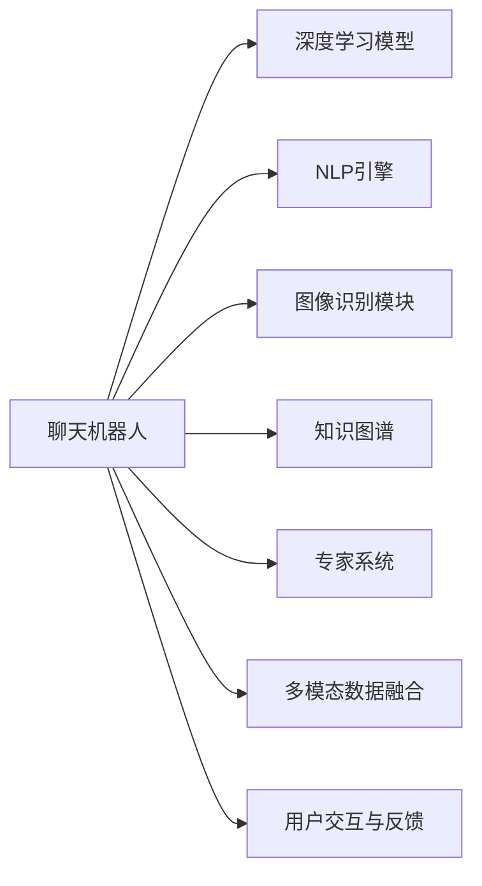

                 

# 聊天机器人收藏：稀有物品鉴定和价值评估

> 关键词：聊天机器人, 稀有物品, 价值评估, 自动鉴定, 深度学习, 自然语言处理(NLP), 图像识别

## 1. 背景介绍

### 1.1 问题由来

在数字化转型深入各行各业的背景下，越来越多的机构和企业开始重视数字化资产的管理。其中，稀有物品的鉴定和价值评估是企业、收藏家及金融机构关注的重点问题之一。传统的鉴定和评估流程依赖于专家知识，存在成本高、效率低、主观性强等问题。而利用人工智能技术，特别是聊天机器人（Chatbot）技术，可以实现对稀有物品的高效、自动化鉴定和价值评估，有效降低人力成本，提高鉴定准确性和速度，促进稀有物品交易市场的健康发展。

### 1.2 问题核心关键点

稀有物品鉴定和价值评估的聊天机器人解决方案，其核心在于：

1. **自动化鉴定与评估**：聊天机器人通过深度学习、自然语言处理(NLP)和图像识别技术，自动对稀有物品进行精准鉴定和价值评估。
2. **知识图谱与专家系统**：聊天机器人内置丰富的知识图谱和专家系统，能够整合多源数据，综合专家意见，提供权威的鉴定和评估结果。
3. **多模态数据融合**：通过融合稀有物品的图片、描述、历史交易记录等多模态数据，进一步提升鉴定的全面性和准确性。
4. **用户交互与反馈**：通过智能问答系统，用户可以与聊天机器人进行实时互动，了解鉴定和评估结果，并获得个性化的意见和建议。
5. **数据隐私与安全**：在处理稀有物品信息时，需要确保数据隐私和安全，防止信息泄露和滥用。

### 1.3 问题研究意义

利用聊天机器人技术进行稀有物品鉴定和价值评估，具有以下重要意义：

1. **降低成本与提高效率**：自动化的鉴定和评估过程显著降低了人工鉴定的成本，提高了鉴定的效率和速度。
2. **提升鉴定准确性**：深度学习、图像识别等技术的应用，使鉴定的准确性和一致性大大提高。
3. **促进市场发展**：为稀有物品交易提供可靠依据，降低交易风险，促进市场繁荣。
4. **增强用户体验**：通过智能问答系统，用户可以获取及时的鉴定和评估信息，提升用户体验。
5. **数据驱动决策**：基于大数据和知识图谱的决策支持，使得决策过程更加科学和客观。

## 2. 核心概念与联系

### 2.1 核心概念概述

在探讨聊天机器人如何进行稀有物品鉴定和价值评估时，我们需要掌握以下核心概念：

- **聊天机器人**：一种通过深度学习和自然语言处理技术，能够理解和生成自然语言，与用户进行交互的智能系统。
- **深度学习**：一种基于神经网络的机器学习方法，通过多层次的非线性映射，实现对复杂数据的学习和推理。
- **自然语言处理(NLP)**：一门研究如何让计算机理解和处理自然语言的学科，包括文本分类、命名实体识别、情感分析等任务。
- **图像识别**：利用计算机视觉技术，通过特征提取和分类，实现对图像中对象、场景等的自动识别。
- **知识图谱**：一种结构化的语义知识表示方法，通过节点和边描述实体之间的关系，构建知识网络。
- **专家系统**：通过整合专家知识，构建的模拟人类专家的决策系统，提供权威的鉴评意见。

这些核心概念通过合理的架构设计，可以有机地结合在一起，实现稀有物品的高效、自动化的鉴定和评估。

### 2.2 核心概念原理和架构的 Mermaid 流程图(Mermaid 流程节点中不要有括号、逗号等特殊字符)



该图展示了聊天机器人进行稀有物品鉴定和价值评估的核心流程架构：

1. **深度学习模型**：用于处理文本数据，实现文本分类、命名实体识别等任务。
2. **NLP引擎**：用于处理自然语言，包括文本预处理、语义理解等。
3. **图像识别模块**：用于处理图像数据，实现图像分类、对象识别等任务。
4. **知识图谱**：用于整合多源数据，构建知识网络，支持决策推理。
5. **专家系统**：用于提供权威的鉴定和评估意见，结合专家知识和机器学习模型。
6. **多模态数据融合**：将文本、图像等多模态数据融合，综合不同维度的信息进行鉴评。
7. **用户交互与反馈**：与用户进行实时互动，获取用户反馈，优化鉴评结果。

## 3. 核心算法原理 & 具体操作步骤

### 3.1 算法原理概述

聊天机器人对稀有物品进行鉴定和评估的过程，主要包括以下几个步骤：

1. **文本预处理**：对用户输入的文本进行清洗、分词、词性标注等预处理操作。
2. **语义理解**：使用NLP技术，分析文本语义，提取关键信息，如物品种类、产地、年代等。
3. **图像识别**：对物品图片进行预处理，利用深度学习模型进行对象识别、分类等任务。
4. **知识图谱查询**：根据用户输入的文本和图像信息，查询知识图谱，获取相关实体的信息。
5. **专家系统推理**：结合知识图谱和专家系统，对物品进行综合分析，生成鉴定和评估报告。
6. **用户交互与反馈**：根据用户反馈，调整算法参数，优化鉴评结果。

### 3.2 算法步骤详解

1. **文本预处理**：
   - 对用户输入的文本进行清洗，去除无关字符和噪声。
   - 使用分词工具进行分词，如jieba、spaCy等。
   - 对分词结果进行词性标注，如使用nltk、StanfordNLP等工具。
   - 利用依存句法分析，分析句子结构，提取关键信息。

2. **语义理解**：
   - 使用BERT、GPT等预训练语言模型进行文本编码，获得文本表示。
   - 通过文本分类模型，对物品类别进行识别。
   - 利用命名实体识别模型，提取物品的产地、年代等信息。

3. **图像识别**：
   - 对物品图片进行预处理，如调整大小、灰度化、标准化等。
   - 利用卷积神经网络（CNN）或迁移学习模型，如ResNet、Inception等，进行对象识别和分类。
   - 对识别结果进行后处理，如去噪、校正等。

4. **知识图谱查询**：
   - 构建知识图谱，使用节点和边描述实体和关系，如RDF、OWL等。
   - 根据用户输入的文本和图像信息，查询知识图谱，获取实体和关系信息。
   - 结合多源数据，进行数据融合和冲突处理。

5. **专家系统推理**：
   - 整合知识图谱和专家系统，构建决策规则和推理引擎。
   - 根据用户输入的文本和图像信息，进行推理和综合分析。
   - 生成鉴定和评估报告，提供权威的意见和建议。

6. **用户交互与反馈**：
   - 通过智能问答系统，与用户进行实时互动，获取用户反馈。
   - 根据用户反馈，调整算法参数，优化鉴评结果。
   - 提供个性化意见和建议，提升用户体验。

### 3.3 算法优缺点

**优点**：
- **自动化与高效性**：通过深度学习和自然语言处理技术，实现自动化鉴定和评估，显著提高效率。
- **准确性与一致性**：利用多模态数据融合和专家系统，提升鉴评的准确性和一致性。
- **个性化服务**：通过用户交互与反馈，提供个性化的鉴定和评估服务，提升用户体验。

**缺点**：
- **数据依赖**：需要大量的训练数据和知识图谱数据，获取成本较高。
- **模型复杂性**：深度学习模型和知识图谱构建较为复杂，需要专业知识和技能。
- **解释性不足**：深度学习模型的决策过程缺乏可解释性，难以进行审计和调试。

### 3.4 算法应用领域

聊天机器人技术在稀有物品鉴定和价值评估中的应用领域广泛，包括：

1. **文物鉴定**：利用图像识别和深度学习技术，对文物进行自动化鉴定和评估。
2. **艺术品评估**：结合NLP和知识图谱，对艺术品进行鉴定和价值评估。
3. **古董交易**：通过多模态数据融合和专家系统，提供可靠的鉴评报告，促进古董交易。
4. **收藏品鉴定**：对各类收藏品进行自动化鉴定和价值评估，提升收藏品的市场价值。
5. **艺术品修复**：通过图像识别技术，辅助艺术品修复专家进行修复方案的制定。

## 4. 数学模型和公式 & 详细讲解 & 举例说明

### 4.1 数学模型构建

聊天机器人对稀有物品进行鉴定和评估，涉及多个数学模型和公式。以下以文本分类和图像分类为例，介绍其中的关键数学模型：

1. **文本分类模型**：
   - 使用BERT或GPT等预训练语言模型进行文本编码，得到文本表示 $x$。
   - 定义损失函数 $L(y, \hat{y}) = -\frac{1}{N}\sum_{i=1}^N y_i \log \hat{y}_i$，其中 $y$ 为真实标签，$\hat{y}$ 为模型预测结果。
   - 使用梯度下降等优化算法，最小化损失函数。

2. **图像分类模型**：
   - 使用卷积神经网络（CNN）进行图像特征提取，得到特征表示 $x$。
   - 定义损失函数 $L(y, \hat{y}) = -\frac{1}{N}\sum_{i=1}^N y_i \log \hat{y}_i$，其中 $y$ 为真实标签，$\hat{y}$ 为模型预测结果。
   - 使用梯度下降等优化算法，最小化损失函数。

### 4.2 公式推导过程

以文本分类为例，推导其中的关键公式：

1. **文本编码**：
   - 使用BERT模型进行文本编码，得到文本表示 $x$。
   - 假设文本表示 $x$ 为 $d$ 维向量，标签 $y$ 为 $c$ 分类。
   - 定义损失函数 $L(y, \hat{y}) = -\frac{1}{N}\sum_{i=1}^N y_i \log \hat{y}_i$。

2. **梯度下降**：
   - 使用梯度下降算法更新模型参数 $\theta$，得到新的参数 $\theta'$。
   - 更新公式为 $\theta' = \theta - \eta \nabla_{\theta}L(\theta)$，其中 $\eta$ 为学习率，$\nabla_{\theta}L(\theta)$ 为损失函数对参数 $\theta$ 的梯度。

### 4.3 案例分析与讲解

以一幅名画为例，分析聊天机器人进行鉴定和评估的过程：

1. **文本输入**：用户输入“请鉴定这幅画是哪位画家的作品”。
2. **文本预处理**：对文本进行清洗、分词、词性标注等预处理操作。
3. **语义理解**：使用BERT模型对文本进行编码，提取关键信息“画家”。
4. **图像识别**：对画作进行预处理，使用ResNet模型进行对象识别，得到画作中的主要对象“人物”。
5. **知识图谱查询**：查询知识图谱，获取画家的信息。
6. **专家系统推理**：结合知识图谱和专家系统，判断画作是哪位画家的作品。
7. **生成报告**：生成鉴定和评估报告，“这幅画是XXX画家的作品”。

## 5. 项目实践：代码实例和详细解释说明

### 5.1 开发环境搭建

1. **环境准备**：
   - 安装Python 3.8及以上版本，推荐使用Anaconda环境管理。
   - 安装深度学习框架TensorFlow或PyTorch。
   - 安装自然语言处理库nltk、spaCy等。
   - 安装图像处理库Pillow、OpenCV等。

2. **项目结构**：
   - 定义项目的根目录结构，包括数据集、模型、代码等模块。
   - 创建虚拟环境，安装项目所需依赖。
   - 搭建Web服务环境，如使用Flask、Django等框架。

### 5.2 源代码详细实现

以图像分类为例，介绍聊天机器人进行图像鉴定的代码实现：

```python
import tensorflow as tf
from tensorflow.keras import layers, models
from tensorflow.keras.preprocessing.image import ImageDataGenerator

# 构建模型
model = models.Sequential([
    layers.Conv2D(32, (3, 3), activation='relu', input_shape=(224, 224, 3)),
    layers.MaxPooling2D((2, 2)),
    layers.Conv2D(64, (3, 3), activation='relu'),
    layers.MaxPooling2D((2, 2)),
    layers.Conv2D(128, (3, 3), activation='relu'),
    layers.MaxPooling2D((2, 2)),
    layers.Conv2D(128, (3, 3), activation='relu'),
    layers.MaxPooling2D((2, 2)),
    layers.Flatten(),
    layers.Dense(512, activation='relu'),
    layers.Dense(2, activation='softmax')
])

# 编译模型
model.compile(optimizer=tf.keras.optimizers.Adam(0.001),
              loss=tf.keras.losses.SparseCategoricalCrossentropy(from_logits=True),
              metrics=['accuracy'])

# 加载数据集
train_datagen = ImageDataGenerator(rescale=1./255, shear_range=0.2, zoom_range=0.2, horizontal_flip=True)
train_generator = train_datagen.flow_from_directory(
    'train',
    target_size=(224, 224),
    batch_size=32,
    class_mode='categorical')

test_datagen = ImageDataGenerator(rescale=1./255)
test_generator = test_datagen.flow_from_directory(
    'test',
    target_size=(224, 224),
    batch_size=32,
    class_mode='categorical')

# 训练模型
model.fit(
    train_generator,
    steps_per_epoch=train_generator.samples // train_generator.batch_size,
    epochs=10,
    validation_data=test_generator,
    validation_steps=test_generator.samples // test_generator.batch_size)
```

### 5.3 代码解读与分析

1. **模型构建**：
   - 使用Sequential模型定义卷积神经网络（CNN）结构。
   - 包含多个卷积层、池化层、全连接层等。
   - 输出层使用softmax激活函数，进行多分类。

2. **模型编译**：
   - 使用Adam优化器，设置学习率为0.001。
   - 定义交叉熵损失函数和准确率指标。

3. **数据加载**：
   - 使用ImageDataGenerator对图像进行预处理，包括归一化、旋转、翻转等。
   - 通过flow_from_directory加载数据集，进行批处理。

4. **模型训练**：
   - 使用fit方法训练模型，设置训练轮数和验证数据集。

## 6. 实际应用场景

### 6.1 智能文物鉴定

在文物鉴定领域，聊天机器人可以结合深度学习和图像识别技术，自动对文物进行鉴定和评估。例如，利用聊天机器人对博物馆的文物进行在线鉴定，用户上传文物图片，聊天机器人自动分析，并给出鉴定结果和评估价值。

### 6.2 艺术品交易平台

艺术品交易平台可以利用聊天机器人，对艺术品进行自动化鉴定和评估。用户输入艺术品的描述、图片等，聊天机器人自动进行鉴定，并提供详细的评估报告，帮助用户做出购买决策。

### 6.3 古董拍卖行

古董拍卖行可以通过聊天机器人，对古董进行快速鉴定和评估，提升拍卖的效率和准确性。用户上传古董图片，聊天机器人自动鉴定，并提供鉴评报告和市场价值。

### 6.4 未来应用展望

未来，聊天机器人技术在稀有物品鉴定和价值评估领域的应用将更加广泛，涵盖更多细分领域，如珠宝、古董、艺术品等。同时，结合最新的技术，如边缘计算、区块链等，可以实现更加安全和可靠的鉴评服务。

## 7. 工具和资源推荐

### 7.1 学习资源推荐

1. **深度学习**：
   - 《深度学习》（Ian Goodfellow）：介绍深度学习的基本原理和应用。
   - Coursera的深度学习课程（Andrew Ng）：由斯坦福大学教授Andrew Ng讲授的深度学习入门课程。

2. **自然语言处理**：
   - 《自然语言处理综论》（Daniel Jurafsky, James H. Martin）：全面介绍自然语言处理的技术和应用。
   - Coursera的自然语言处理课程（Christopher Manning, Daniel Jurafsky）：由斯坦福大学教授Christopher Manning讲授的NLP入门课程。

3. **图像识别**：
   - 《计算机视觉：模型、学习和推理》（Simon J.D. Prince）：介绍计算机视觉的基本理论和应用。
   - DeepLearning.AI的计算机视觉课程（Ian Goodfellow）：由Coursera联合DeepLearning.AI讲授的计算机视觉课程。

### 7.2 开发工具推荐

1. **深度学习框架**：
   - TensorFlow：由Google开发的深度学习框架，支持GPU加速。
   - PyTorch：由Facebook开发的深度学习框架，易用性强。

2. **自然语言处理工具**：
   - spaCy：基于Python的自然语言处理工具，支持文本分词、命名实体识别等任务。
   - NLTK：基于Python的自然语言处理工具，支持文本分类、情感分析等任务。

3. **图像处理工具**：
   - Pillow：Python的图像处理库，支持图像加载、处理等任务。
   - OpenCV：开源计算机视觉库，支持图像处理、特征提取等任务。

### 7.3 相关论文推荐

1. **深度学习模型**：
   - “BERT: Pre-training of Deep Bidirectional Transformers for Language Understanding”（雅虎论文）：介绍BERT模型，使用掩码语言模型进行预训练，提升文本理解能力。
   - “Attention is All You Need”（Transformer论文）：提出Transformer结构，实现自回归模型。

2. **图像识别模型**：
   - “ResNet: Deep Residual Learning for Image Recognition”（ResNet论文）：提出残差网络结构，提升图像识别的精度。
   - “Inception-v3: Towards Deep Neural Network Architectures for Computer Vision”（Inception论文）：提出Inception模块，优化深度神经网络结构。

3. **自然语言处理模型**：
   - “BERT: Pre-training of Deep Bidirectional Transformers for Language Understanding”（BERT论文）：介绍BERT模型，结合掩码语言模型和自编码任务进行预训练。
   - “GPT-3: Language Models are Unsupervised Multitask Learners”（GPT-3论文）：介绍GPT-3模型，使用语言模型的自监督学习任务进行预训练。

## 8. 总结：未来发展趋势与挑战

### 8.1 研究成果总结

聊天机器人技术在稀有物品鉴定和价值评估领域的研究和实践取得了显著进展。通过深度学习、自然语言处理和图像识别技术，聊天机器人可以实现自动化鉴定和评估，提供高效、准确的鉴评服务。

### 8.2 未来发展趋势

未来，聊天机器人技术在稀有物品鉴定和价值评估领域的发展趋势包括：

1. **深度学习模型的优化**：进一步优化深度学习模型结构，提高识别和评估的准确性和鲁棒性。
2. **多模态数据的融合**：结合文本、图像、视频等多模态数据，提升鉴评的全面性和准确性。
3. **知识图谱的构建**：构建更加全面、准确的知识图谱，提供丰富的背景信息，支持推理和决策。
4. **个性化服务的实现**：结合用户行为和偏好，提供个性化的鉴评服务，提升用户体验。
5. **智能问答系统的改进**：改进智能问答系统，提升用户交互体验，实现实时反馈和优化。

### 8.3 面临的挑战

聊天机器人技术在稀有物品鉴定和价值评估领域仍面临以下挑战：

1. **数据质量和数量**：需要大量高质量的数据进行模型训练和测试，获取成本较高。
2. **模型复杂性**：深度学习模型的构建和训练较为复杂，需要专业知识和技能。
3. **解释性和可解释性**：深度学习模型的决策过程缺乏可解释性，难以进行审计和调试。
4. **安全性和隐私保护**：需要确保数据隐私和安全，防止信息泄露和滥用。
5. **多模态数据的融合**：多模态数据的融合和处理较为复杂，需要改进算法和工具。

### 8.4 研究展望

未来，针对这些挑战，研究将从以下几个方面进行：

1. **无监督和半监督学习**：利用无监督和半监督学习技术，降低对标注数据的依赖，提升模型的泛化能力。
2. **知识图谱的优化**：构建更加全面、准确的知识图谱，优化推理引擎，提升决策支持能力。
3. **多模态数据的融合**：改进多模态数据的融合算法，提升鉴评的全面性和准确性。
4. **模型的解释性**：研究模型解释性和可解释性方法，提升鉴评的可信度和透明度。
5. **安全性和隐私保护**：设计安全和隐私保护机制，确保数据隐私和安全。

总之，聊天机器人技术在稀有物品鉴定和价值评估领域具有广阔的应用前景，未来的研究将不断优化模型性能和用户体验，推动技术进步。

