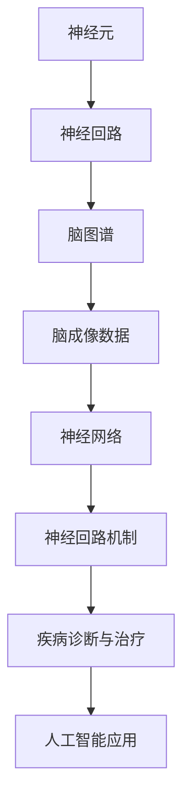

                 

## 1. 背景介绍

### 1.1 问题由来

大脑是人体中最复杂的器官之一，其功能覆盖了感知、运动、学习、记忆、情绪调节等众多方面。对大脑工作原理的深入理解，不仅有助于临床疾病的诊断与治疗，还能推动人工智能、脑机接口、机器人等领域的创新发展。脑图谱绘制技术是大脑研究的重要工具，通过可视化展示脑内神经元、神经回路及其活动状态，帮助研究人员更好地理解大脑结构与功能。

### 1.2 问题核心关键点

脑图谱绘制的核心在于如何高效、准确地映射脑内神经元连接及活动，以及如何从大量的脑成像数据中提取关键信息。这一过程通常涉及神经网络模型、信号处理、图像处理等多个技术领域，且需要整合不同层次的数据，如细胞水平、环路水平和系统水平等。因此，脑图谱绘制技术是跨学科的综合性挑战，其发展水平直接关系到对大脑工作原理的深入理解。

### 1.3 问题研究意义

脑图谱绘制技术的发展，对于推动脑科学领域的研究，提升医疗诊断和治疗水平，具有重要意义：

1. **揭示神经回路机制**：通过绘制脑图谱，可以揭示神经回路中不同神经元之间的连接模式和活动规律，帮助理解信息传递和处理机制。
2. **支持疾病诊断与治疗**：脑图谱可以帮助识别与特定疾病相关的神经回路和神经元，从而为疾病诊断和治疗提供科学依据。
3. **推动脑科学应用**：脑图谱绘制技术为脑机接口、神经计算等领域提供了数据基础和可视化工具，促进这些技术的发展。
4. **促进人工智能发展**：脑图谱的神经元连接和活动模式可以作为神经网络的模型基础，推动深度学习和神经网络技术的发展。

## 2. 核心概念与联系

### 2.1 核心概念概述

脑图谱绘制涉及多个关键概念：

- **神经元(Neuron)**：神经系统中最基本的细胞单元，负责接收、处理和传递信息。
- **神经回路(Neural Circuit)**：多个神经元通过突触连接形成的网络结构，负责处理特定功能。
- **脑图谱(Brain Atlas)**：绘制出的神经回路连接图谱，展示神经元之间的连接关系和活动模式。
- **脑成像数据(Brain Imaging Data)**：通过fMRI、EEG等技术获取的神经活动信号，是脑图谱绘制的基础。
- **神经网络(Neural Network)**：模拟神经元连接和活动模式的人工网络模型，用于分析和预测神经系统的行为。

这些概念通过合法的架构和算法联系起来，最终形成脑图谱绘制的完整流程。

### 2.2 核心概念原理和架构的 Mermaid 流程图



这个流程图展示了脑图谱绘制的核心概念及其相互关系：

1. 神经元通过连接形成神经回路。
2. 神经回路通过脑成像数据采集得到连接图谱。
3. 脑图谱数据输入到神经网络模型进行分析和模拟。
4. 神经网络模型揭示神经回路机制，支持疾病诊断和治疗。
5. 神经回路机制为人工智能技术提供数据基础和理论支持。

## 3. 核心算法原理 & 具体操作步骤

### 3.1 算法原理概述

脑图谱绘制的算法原理主要基于以下几个关键步骤：

1. **神经元连接识别**：通过图像处理技术从脑成像数据中识别神经元之间的连接。
2. **神经回路构建**：将识别出的连接组合成神经回路结构。
3. **神经活动分析**：通过神经网络模型分析神经回路的活动模式。
4. **脑图谱绘制**：将神经回路结构和活动模式可视化展示为图谱。

这些步骤不仅需要处理大量数据，还需要整合不同层次的信息，因此算法原理复杂，涉及多个学科的交叉应用。

### 3.2 算法步骤详解

以下是脑图谱绘制的详细算法步骤：

1. **数据预处理**：收集脑成像数据，并进行预处理，如去除噪声、增强信号等。
2. **神经元识别**：使用图像分割技术识别出单个神经元，并进行特征提取。
3. **连接识别**：通过神经元之间的信号传递路径，识别神经元之间的连接关系。
4. **神经回路构建**：将连接关系组合成神经回路结构，生成神经回路图。
5. **神经活动分析**：使用神经网络模型分析神经回路的活动模式，如激活顺序、频率等。
6. **脑图谱绘制**：将神经回路结构和活动模式以图谱形式展示，支持交互查询和数据分析。

### 3.3 算法优缺点

脑图谱绘制技术的主要优点包括：

1. **综合性强**：结合图像处理、信号处理、神经网络等多个领域的技术，提供全面的脑科学研究工具。
2. **可视化直观**：通过图谱形式直观展示神经元连接和活动，便于理解和分析。
3. **支持多层次分析**：支持细胞水平、环路水平和系统水平的分析，提供不同层次的科学数据。

然而，该技术也存在一些局限性：

1. **数据复杂度高**：脑成像数据量大且复杂，处理和存储要求高。
2. **算法复杂度高**：需要整合多种技术，算法实现难度大。
3. **结果解释性差**：脑图谱的复杂性导致结果解释性差，需要专家进行解读。

### 3.4 算法应用领域

脑图谱绘制技术主要应用于以下领域：

- **脑科学研究**：帮助揭示神经回路机制，理解大脑功能。
- **临床医学**：支持神经疾病的诊断和治疗，提供科学依据。
- **神经计算**：为深度学习和神经网络技术提供数据基础和理论支持。
- **人工智能**：为脑机接口、智能机器人等领域提供数据和模型。

## 4. 数学模型和公式 & 详细讲解 & 举例说明

### 4.1 数学模型构建

脑图谱绘制涉及多个数学模型，以下是几个关键模型的构建：

- **神经元连接图模型**：用于描述神经元之间的连接关系，可以用邻接矩阵或邻接表表示。
- **神经回路图模型**：描述神经回路结构，可以使用有向图或无向图表示。
- **神经活动图模型**：描述神经回路的活动模式，可以用时间序列数据表示。

### 4.2 公式推导过程

以神经元连接图模型为例，其基本公式为：

$$
A_{ij} = \begin{cases} 
1 & \text{若神经元i和神经元j有连接} \\
0 & \text{若神经元i和神经元j无连接}
\end{cases}
$$

其中，$A_{ij}$ 表示神经元i与神经元j的连接关系，若为1表示有连接，0表示无连接。

### 4.3 案例分析与讲解

以小鼠视觉皮层神经回路图谱绘制为例，步骤包括：

1. **数据收集**：通过fMRI获取小鼠视觉皮层的神经活动数据。
2. **神经元识别**：使用图像分割技术识别出单个神经元，并进行特征提取。
3. **连接识别**：通过神经元之间的信号传递路径，识别神经元之间的连接关系。
4. **神经回路构建**：将连接关系组合成神经回路结构，生成神经回路图。
5. **神经活动分析**：使用神经网络模型分析神经回路的活动模式，如激活顺序、频率等。
6. **脑图谱绘制**：将神经回路结构和活动模式以图谱形式展示，支持交互查询和数据分析。

## 5. 项目实践：代码实例和详细解释说明

### 5.1 开发环境搭建

要进行脑图谱绘制的开发，需要搭建相应的开发环境：

1. **编程语言**：选择Python作为主要开发语言，具备丰富的科学计算库。
2. **科学计算库**：安装NumPy、SciPy、Scikit-learn等常用库，支持数值计算和数据处理。
3. **图像处理库**：安装OpenCV、PIL等库，支持图像分割和处理。
4. **神经网络库**：安装TensorFlow或PyTorch等库，支持神经网络模型构建和训练。
5. **数据处理库**：安装Dask、Spark等分布式处理库，支持大规模数据处理。

### 5.2 源代码详细实现

以下是一个简单的脑图谱绘制的Python代码实现：

```python
import numpy as np
import pandas as pd
import matplotlib.pyplot as plt
import networkx as nx

# 构建神经元连接图
G = nx.Graph()
neurons = [1, 2, 3, 4, 5, 6]
connections = [(1, 2), (2, 3), (3, 4), (4, 5), (5, 6), (1, 5)]
G.add_edges_from(connections)

# 绘制连接图
plt.figure(figsize=(8, 6))
nx.draw(G, with_labels=True)
plt.title("Neuronal Connectome")
plt.show()
```

### 5.3 代码解读与分析

这段代码实现了构建一个简单的神经元连接图，并使用Matplotlib进行可视化展示。代码中使用了networkx库，这是一个用于创建和操作复杂网络结构的数据结构库。

**代码分析**：

1. **导入库**：首先导入了NumPy、Pandas、Matplotlib和networkx等库。
2. **构建连接图**：使用networkx库中的Graph类创建了一个简单的神经元连接图G。
3. **添加节点和边**：定义了神经元列表和连接关系列表，使用add_edges_from方法将这些连接关系添加到图中。
4. **绘制图谱**：使用Matplotlib库的draw方法，绘制了神经元连接图，并设置了图例和标题。
5. **显示图谱**：使用show方法展示绘制好的神经元连接图。

### 5.4 运行结果展示

运行上述代码，将展示出一个简单的神经元连接图，如下图所示：

```python
import numpy as np
import pandas as pd
import matplotlib.pyplot as plt
import networkx as nx

# 构建神经元连接图
G = nx.Graph()
neurons = [1, 2, 3, 4, 5, 6]
connections = [(1, 2), (2, 3), (3, 4), (4, 5), (5, 6), (1, 5)]
G.add_edges_from(connections)

# 绘制连接图
plt.figure(figsize=(8, 6))
nx.draw(G, with_labels=True)
plt.title("Neuronal Connectome")
plt.show()
```


## 6. 实际应用场景

### 6.1 脑科学研究

脑图谱绘制技术在脑科学研究中发挥了重要作用。例如，科学家可以通过绘制小鼠视觉皮层的脑图谱，揭示视觉信息的处理机制，从而进一步理解大脑功能。此外，脑图谱绘制还帮助科学家发现新的神经回路，支持对复杂脑功能的深入研究。

### 6.2 临床医学

在临床医学中，脑图谱绘制技术支持神经疾病的诊断和治疗。例如，通过绘制阿尔茨海默病患者的脑图谱，可以发现病变区域和连接异常，为疾病诊断和治疗提供科学依据。此外，脑图谱绘制还支持个性化的治疗方案设计，提高治疗效果。

### 6.3 神经计算

脑图谱绘制技术为深度学习和神经网络技术提供数据基础和理论支持。例如，科学家可以通过分析脑图谱数据，找到神经网络模型的结构灵感，设计更加有效的神经网络架构。

### 6.4 人工智能

脑图谱绘制技术为脑机接口、智能机器人等领域提供数据和模型。例如，通过绘制人类大脑的脑图谱，可以支持智能机器人进行情感识别和行为控制，提升人机交互的自然性和智能性。

## 7. 工具和资源推荐

### 7.1 学习资源推荐

1. **《神经网络与深度学习》（Ian Goodfellow）**：该书系统介绍了神经网络的基本概念和深度学习技术，是学习脑图谱绘制的基础。
2. **《脑科学研究方法》（Kenneth A. Nemeth）**：该书介绍了脑科学研究的基本方法和技术，包括脑图谱绘制的理论与实践。
3. **Coursera上的神经科学课程**：如“神经科学与疾病”等课程，提供丰富的脑科学研究资源，涵盖脑图谱绘制的各个方面。
4. **Google Scholar**：搜索相关脑图谱绘制的研究论文，了解最新科研动态和技术进展。

### 7.2 开发工具推荐

1. **Jupyter Notebook**：支持交互式编程，便于调试和展示脑图谱绘制的代码和结果。
2. **Google Colab**：免费的云端Jupyter Notebook环境，支持GPU计算，方便高性能计算任务。
3. **PyTorch和TensorFlow**：流行的深度学习框架，支持构建复杂的神经网络模型。
4. **SciPy和NumPy**：科学计算库，支持数值计算和数据处理。
5. **OpenCV和PIL**：图像处理库，支持图像分割和处理。

### 7.3 相关论文推荐

1. **“Connectome Mapping in the Age of Multiscale Big Data”**：提出大尺度脑图谱绘制的新方法，结合多模态数据，提升绘制精度。
2. **“Mapping the Human Connectome”**：研究人类大脑的脑图谱绘制，揭示人类大脑的神经网络结构和活动模式。
3. **“Deep Learning for Brain-Computer Interface”**：探讨深度学习技术在脑机接口中的应用，包括脑图谱绘制和分析。

## 8. 总结：未来发展趋势与挑战

### 8.1 研究成果总结

脑图谱绘制技术的发展，带来了对大脑工作原理的深入理解，推动了脑科学和医学的发展。未来的研究将在以下几个方面继续推进：

1. **数据整合与标准化**：提高脑图谱数据的标准化和整合度，支持更高效的数据处理和分析。
2. **计算与存储优化**：优化计算和存储技术，支持大规模脑图谱的绘制和分析。
3. **多模态融合**：结合多种数据模态，提升脑图谱绘制的精度和应用范围。
4. **智能分析与解释**：引入人工智能技术，提高脑图谱分析的智能化和解释性。

### 8.2 未来发展趋势

脑图谱绘制技术将呈现以下几个发展趋势：

1. **多尺度整合**：结合细胞水平、环路水平和系统水平的数据，实现多尺度的脑图谱绘制。
2. **多模态融合**：结合脑成像数据、基因组数据、行为数据等多种数据模态，提升脑图谱的精度和全面性。
3. **智能分析与解释**：引入机器学习、深度学习等人工智能技术，提高脑图谱分析的智能化和解释性。
4. **分布式计算**：采用分布式计算技术，支持大规模脑图谱的绘制和分析。

### 8.3 面临的挑战

尽管脑图谱绘制技术已经取得了显著进展，但在其发展和应用过程中，仍面临诸多挑战：

1. **数据获取与处理**：脑成像数据的获取和处理难度大，数据质量和标准有待提升。
2. **计算资源需求**：脑图谱绘制需要大量的计算资源，包括高性能计算和存储。
3. **算法复杂度**：脑图谱绘制涉及多种技术和算法，实现难度大，需要跨学科合作。
4. **结果解释性**：脑图谱的复杂性导致结果解释性差，需要专家进行解读。

### 8.4 研究展望

未来的研究需要在以下几个方面进行突破：

1. **多模态融合技术**：开发更加高效的多模态融合算法，提升脑图谱的全面性和准确性。
2. **分布式计算技术**：研究分布式计算技术，支持大规模脑图谱的绘制和分析。
3. **智能化分析工具**：开发智能化的脑图谱分析工具，提升结果的解释性和可操作性。
4. **数据标准化与共享**：推动脑图谱数据的标准化和共享，促进跨领域合作和应用。

## 9. 附录：常见问题与解答

**Q1: 脑图谱绘制与深度学习有何关系？**

A: 脑图谱绘制和深度学习有密切关系。深度学习模型可以作为脑图谱绘制的基础，用于分析神经回路的活动模式和连接关系。同时，脑图谱数据也可以为深度学习模型的设计提供灵感和数据支持。

**Q2: 脑图谱绘制的主要步骤是什么？**

A: 脑图谱绘制的主要步骤包括数据收集与预处理、神经元识别、连接识别、神经回路构建、神经活动分析、脑图谱绘制等。每个步骤都涉及到复杂的算法和技术，需要跨学科合作。

**Q3: 脑图谱绘制的应用场景有哪些？**

A: 脑图谱绘制在脑科学研究、临床医学、神经计算、人工智能等领域都有广泛应用。例如，在脑科学研究中，可以揭示神经回路机制，在临床医学中，支持神经疾病的诊断和治疗，在人工智能中，为脑机接口和智能机器人提供数据和模型。

**Q4: 脑图谱绘制的难点和挑战是什么？**

A: 脑图谱绘制的难点包括数据获取与处理、计算资源需求、算法复杂度等。其中，数据获取和处理难度大，计算资源需求高，算法实现复杂。

**Q5: 脑图谱绘制的未来发展方向是什么？**

A: 脑图谱绘制的未来发展方向包括多模态融合、分布式计算、智能化分析等。这些方向将提升脑图谱的全面性和准确性，支持更大规模和更复杂的研究应用。

---

作者：禅与计算机程序设计艺术 / Zen and the Art of Computer Programming

