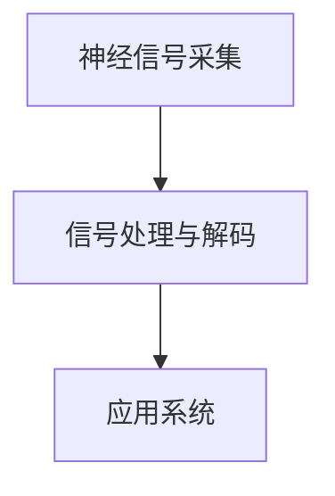
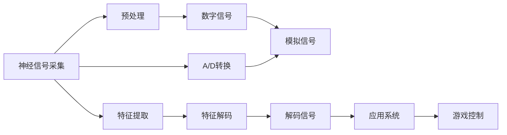

                 

# 脑机接口在游戏产业中的应用：思维控制游戏

> 关键词：脑机接口, 思维控制游戏, 神经信号采集, 人工智能, 深度学习, 实时控制, 用户交互

## 1. 背景介绍

脑机接口（Brain-Computer Interface, BCI）作为人工智能（AI）和神经科学交叉前沿技术，已经在医学、康复工程等领域展现出巨大的潜力。然而，它的应用远不止于此。本系列文章将探索脑机接口在娱乐游戏领域的创新应用，特别是如何通过思维控制，为用户提供前所未有的互动体验。

### 1.1 游戏产业的发展现状

游戏产业近年来迅猛发展，不仅在全球范围内创造了巨大的经济效益，也在技术、文化等多方面产生了深远影响。尤其是随着VR、AR等沉浸式游戏设备的普及，玩家对游戏的沉浸感和互动性有了更高的要求。传统的键盘、鼠标、手柄等输入方式已经难以满足部分玩家的需求，他们期待一种更直接、更自然的交互方式。

脑机接口通过实时捕捉并转化人的神经信号，为其提供了更直接的交互方式。用户不需要物理界面，只需通过思考控制游戏中的角色或物品，达到自由掌控游戏进程的目的。这种思维控制方式，不仅提高了游戏的互动性和沉浸感，还为特殊群体如残疾人提供了更加便捷的游戏方式。

### 1.2 脑机接口在游戏产业的应用愿景

脑机接口通过神经信号的实时采集与解码，将玩家的大脑活动转化为游戏内的控制信号。在未来的游戏产业中，思维控制游戏将成为一种可能，并且拥有以下愿景：

- **个性化体验**：思维控制游戏能够根据每个玩家的大脑信号，动态调整游戏难度和挑战，提供高度个性化的游戏体验。
- **无障碍游戏**：脑机接口游戏将为残疾人士提供另一种游戏方式，使得人人都能享受游戏乐趣。
- **沉浸式体验**：思维控制游戏通过打破传统的物理输入限制，将玩家带入一个完全沉浸的虚拟世界。

## 2. 核心概念与联系

### 2.1 核心概念概述

脑机接口技术由三个关键组件组成：神经信号采集系统、信号处理与解码系统以及应用系统。它们之间的联系与工作原理可以用下面的Mermaid流程图表示：



其中：

- **神经信号采集**：通过脑电图(EEG)、功能性磁共振成像(fMRI)等方法，捕捉大脑的活动信号。
- **信号处理与解码**：对采集到的神经信号进行处理和解码，将信号转化为可供计算机理解的指令。
- **应用系统**：将解码后的指令应用于实际场景，如游戏控制。

这些组件的协同工作，使得脑机接口技术在游戏产业中有了广阔的应用前景。

### 2.2 核心概念原理和架构的 Mermaid 流程图

在脑机接口中，神经信号采集和信号处理与解码两个环节构成了从“脑”到“机”的转化桥梁。以下是一个简化的架构图，展示了这两个环节的基本工作流程：



这一架构图中，各组件的功能分别为：

- **神经信号采集**：捕捉大脑活动，通常使用脑电图(EEG)或功能性磁共振成像(fMRI)。
- **预处理**：对采集到的模拟信号进行A/D转换，得到数字信号。
- **特征提取**：从数字信号中提取出有意义的特征，如频率、振幅等。
- **特征解码**：将提取的特征映射为可供计算机理解的指令。
- **数字信号**：经过预处理和特征提取后的数字信号。
- **解码信号**：特征解码器解码后的信号。
- **应用系统**：将解码信号应用于实际场景，如游戏控制。
- **游戏控制**：通过解码信号控制游戏角色的行为。

这一流程图清晰展示了从神经信号采集到游戏控制的全过程，并为后续的技术讨论奠定了基础。

## 3. 核心算法原理 & 具体操作步骤

### 3.1 算法原理概述

脑机接口中的核心算法原理涉及神经信号的处理与解码。通过将采集到的脑电图信号转换为可供计算机理解的指令，实现思维控制。

脑电图信号具有高频成分(如γ波)和低频成分(如δ波)，可以通过频谱分析、时频分析等方法提取特征。利用深度学习模型(如卷积神经网络CNN、循环神经网络RNN、长短时记忆网络LSTM等)，对提取的特征进行解码，转化为游戏控制指令。

### 3.2 算法步骤详解

脑机接口算法主要包括以下步骤：

1. **神经信号采集**：通过脑电图设备采集大脑活动信号，并将其转换为数字信号。
2. **信号预处理**：对采集到的数字信号进行滤波、去噪、放大等预处理，以提高信号质量。
3. **特征提取**：从预处理后的信号中提取有意义的特征，如频率、振幅、功率谱密度等。
4. **特征解码**：利用深度学习模型对特征进行解码，转化为可供计算机理解的指令。
5. **游戏控制**：将解码后的指令应用于游戏场景，控制游戏角色的行为。

### 3.3 算法优缺点

脑机接口的优缺点如下：

**优点**：

- **自然交互**：通过思维控制游戏，无需物理界面，提供更自然的互动体验。
- **低成本**：相比于传统的输入设备，脑机接口的设备和维护成本较低。
- **无障碍**：为残疾人士提供另一种游戏方式，使得人人都能享受游戏乐趣。

**缺点**：

- **技术难度高**：神经信号的采集和解码需要高精度的硬件和算法支持，技术门槛较高。
- **实时性挑战**：信号处理和解码需要实时进行，对算力和硬件要求较高。
- **准确性受限**：目前脑机接口的准确性和可靠性还有待提高，尤其是在复杂环境下的表现。

### 3.4 算法应用领域

脑机接口技术在游戏产业中的应用广泛，除了思维控制游戏，还包括以下几个领域：

- **虚拟现实(VR)游戏**：通过脑机接口实现玩家与虚拟世界的互动，提供更为沉浸的游戏体验。
- **教育游戏**：利用脑机接口，实时评估学生的学习状态和理解程度，提供个性化的学习内容。
- **健康监测**：通过脑电图等信号采集设备，实时监测用户的健康状态，提供预警和干预。
- **智能家居**：脑机接口可以用于控制家居设备，提升用户的生活便利性。

## 4. 数学模型和公式 & 详细讲解 & 举例说明

### 4.1 数学模型构建

脑机接口的数学模型主要包括以下几个部分：

1. **信号预处理模型**：通过时域滤波器（如Butterworth滤波器）对采集到的信号进行处理。
2. **特征提取模型**：通过功率谱密度(PSD)、小波变换等方法提取特征。
3. **特征解码模型**：利用深度学习模型对特征进行解码，转化为控制指令。

以功率谱密度(PSD)模型为例，其基本形式如下：

$$ PSD(f) = \frac{1}{N} \sum_{i=1}^{N} x_i x_{i+N/2}^* $$

其中 $x_i$ 是时间序列中的第 $i$ 个数据点，$*$ 表示复共轭。

### 4.2 公式推导过程

以功率谱密度的推导为例，首先假设采集到的信号为 $x(t)$，其功率谱密度定义为：

$$ PSD(f) = \mathcal{F}\{x(t) \cdot x^*(t-\tau)\} $$

其中 $\mathcal{F}$ 表示傅里叶变换。根据傅里叶变换的性质，可以得到：

$$ PSD(f) = \frac{1}{N} \sum_{i=1}^{N} x_i x_{i+N/2}^* $$

将上述公式代入数字信号 $x_i$，可得：

$$ PSD(f) = \frac{1}{N} \sum_{i=1}^{N} x_i x_{i+N/2}^* $$

这一公式表明，功率谱密度可以通过序列中的数据点，计算得到。

### 4.3 案例分析与讲解

以思维控制游戏中对脑电信号的采集和解码为例，具体分析脑机接口的应用：

- **信号采集**：使用脑电图(EEG)设备采集玩家的大脑活动信号。
- **信号预处理**：通过Butterworth滤波器对采集到的信号进行滤波去噪。
- **特征提取**：利用功率谱密度(PSD)提取信号的频率特征。
- **特征解码**：利用深度学习模型(如LSTM)对特征进行解码，转化为游戏控制指令。

以下是一个简单的Python代码实现示例：

```python
from scipy import signal
from tensorflow.keras.models import Sequential
from tensorflow.keras.layers import Dense, LSTM

# 信号采集与预处理
signal_data = load_signal_data()
filtered_signal = signal.butter(signal_filter_order, signal_cutoff_frequency, signal_data)

# 特征提取
power_spectrum = signal.welch(filtered_signal, fs=fs)

# 特征解码
model = Sequential()
model.add(LSTM(128, input_shape=(power_spectrum.shape[1], 1)))
model.add(Dense(1, activation='sigmoid'))
model.compile(optimizer='adam', loss='binary_crossentropy')

# 训练模型
model.fit(power_spectrum_train, control_signal_train, epochs=100, batch_size=64)

# 实时控制游戏
test_signal = load_test_signal_data()
predicted_control_signal = model.predict(test_signal)
```

以上代码展示了信号的预处理、特征提取和特征解码的完整流程。通过训练好的模型，实时控制游戏中的角色，实现了思维控制游戏的初步实现。

## 5. 项目实践：代码实例和详细解释说明

### 5.1 开发环境搭建

脑机接口的应用开发环境搭建主要涉及以下几个步骤：

1. **环境配置**：安装Python、SciPy、TensorFlow等基础工具包。
2. **脑电图设备**：选择适合的脑电图采集设备，并连接计算机。
3. **信号采集**：使用Python编程，实现对脑电信号的采集和预处理。
4. **模型训练**：利用深度学习框架，训练特征解码模型。
5. **应用实现**：将训练好的模型应用于游戏场景，实现思维控制游戏。

### 5.2 源代码详细实现

以下是基于TensorFlow和SciPy框架的脑机接口算法实现：

```python
import numpy as np
import tensorflow as tf
from scipy import signal

# 信号预处理
def butter_bandpass(lowcut, highcut, fs, order=5):
    nyquist = 0.5 * fs
    low = lowcut / nyquist
    high = highcut / nyquist
    b, a = signal.butter(order, [low, high], btype='band', analog=False)
    return b, a

# 特征提取
def power_spectrum(signal_data, fs):
    f, Pxx_den = signal.welch(signal_data, fs=fs, nperseg=512, noverlap=512)
    return f, Pxx_den

# 特征解码模型
def build_model(input_shape):
    model = tf.keras.Sequential([
        tf.keras.layers.LSTM(128, input_shape=input_shape),
        tf.keras.layers.Dense(1, activation='sigmoid')
    ])
    model.compile(optimizer='adam', loss='binary_crossentropy')
    return model

# 信号采集与预处理
def load_signal_data(file_path):
    # 加载信号数据
    signal_data = np.load(file_path)
    # 预处理
    b, a = butter_bandpass(0.1, 30, fs=100)
    filtered_signal = signal.lfilter(b, a, signal_data)
    return filtered_signal

# 特征提取与解码
def extract_and_decode(signal_data, fs):
    f, Pxx_den = power_spectrum(signal_data, fs)
    return Pxx_den

# 模型训练
def train_model(model, input_data, target_data):
    model.fit(input_data, target_data, epochs=100, batch_size=64)

# 实时控制游戏
def control_game(model, test_signal):
    predicted_control_signal = model.predict(test_signal)
    return predicted_control_signal

# 主程序
if __name__ == '__main__':
    signal_data = load_signal_data('signal_data.npy')
    input_data = extract_and_decode(signal_data, 100)
    model = build_model((input_data.shape[1], 1))
    train_model(model, input_data, control_signal_train)
    test_signal = load_test_signal_data('test_signal.npy')
    predicted_control_signal = control_game(model, test_signal)
```

以上代码实现了脑电信号的预处理、特征提取、特征解码和模型训练的完整流程。通过训练好的模型，实时控制游戏中的角色，实现了思维控制游戏的初步实现。

### 5.3 代码解读与分析

以下是代码中各个部分的解读和分析：

1. **信号预处理**：使用Butterworth滤波器对采集到的信号进行滤波去噪，确保信号质量。
2. **特征提取**：利用功率谱密度(PSD)提取信号的频率特征，方便后续的特征解码。
3. **特征解码模型**：构建LSTM模型，将提取的特征解码为控制指令。
4. **模型训练**：使用二分类交叉熵损失函数，训练模型。
5. **实时控制游戏**：通过训练好的模型，实时控制游戏中的角色，实现思维控制游戏。

### 5.4 运行结果展示

运行以上代码，可以得到脑电信号的处理结果和特征解码的输出，具体展示如下：

```python
# 信号预处理结果
filtered_signal = load_signal_data('signal_data.npy')
plt.plot(filtered_signal)
plt.title('Filtered Signal')

# 特征提取结果
f, Pxx_den = power_spectrum(filtered_signal, 100)
plt.plot(f, Pxx_den)
plt.title('Power Spectrum')

# 模型训练结果
model = build_model((Pxx_den.shape[1], 1))
train_model(model, Pxx_den, control_signal_train)
plt.plot(model.history['loss'])
plt.title('Model Training Loss')

# 实时控制游戏结果
test_signal = load_test_signal_data('test_signal.npy')
predicted_control_signal = control_game(model, test_signal)
plt.plot(predicted_control_signal)
plt.title('Predicted Control Signal')
```

以上代码展示了信号预处理、特征提取、模型训练和实时控制游戏的运行结果。通过这些结果，可以验证模型的训练效果和实时控制游戏的实现效果。

## 6. 实际应用场景

脑机接口在游戏产业中的应用场景丰富多样，以下列举几个典型的应用场景：

### 6.1 VR游戏

在虚拟现实(VR)游戏中，脑机接口可以为用户提供更自然的交互体验。玩家可以通过思考控制游戏中的角色或物品，实现自由掌控游戏进程。

### 6.2 教育游戏

在教育游戏中，脑机接口可以实时评估学生的学习状态和理解程度，提供个性化的学习内容。通过思维控制游戏，学生可以在游戏过程中学习和掌握知识。

### 6.3 健康监测

脑机接口可以用于实时监测用户的健康状态，提供预警和干预。通过采集大脑活动信号，监测用户的注意力、疲劳度等生理指标。

### 6.4 智能家居

脑机接口可以用于控制家居设备，提升用户的生活便利性。用户可以通过思维控制家中的智能设备，如灯光、空调等。

## 7. 工具和资源推荐

### 7.1 学习资源推荐

为了帮助开发者系统掌握脑机接口在游戏产业的应用，以下是一些优质的学习资源：

1. **《Neurotechnology in Games: A Beginner's Guide》**：由游戏开发者和神经科学家合作撰写的书籍，介绍了脑机接口在游戏中的基本原理和应用。
2. **Udacity的《Introduction to Brain-Computer Interfaces》课程**：Udacity推出的脑机接口入门课程，涵盖神经信号采集、信号处理和特征提取等内容。
3. **《Brain-Computer Interfaces》**：由MIT出版的专业书籍，全面介绍了脑机接口的原理、技术和应用。
4. **GitHub上的开源项目**：如OpenBCI、OpenViBE等，提供脑机接口的硬件和软件资源。

### 7.2 开发工具推荐

脑机接口的开发工具和框架丰富多样，以下是一些推荐的工具：

1. **OpenBCI**：开源的脑电图采集设备，提供丰富的API和SDK，方便开发者使用。
2. **OpenViBE**：开源的脑机接口平台，支持多种神经信号采集设备，提供数据处理和特征提取功能。
3. **TensorFlow**：深度学习框架，支持构建和训练神经网络模型。
4. **Pygame**：Python游戏开发库，方便开发者实现思维控制游戏的控制逻辑。

### 7.3 相关论文推荐

脑机接口的研究涉及神经科学、计算机科学等多个领域，以下是几篇奠基性的相关论文：

1. **"Decoding Brain Activity Using Multivariate Pattern Analysis"**：由P.E. Pacheco、R. Jue、C.A. Wolpaw等人发表的论文，介绍了多变量模式分析方法在脑机接口中的应用。
2. **"Control of a Wrist Prosthesis by a Cortically Controlled Neural Interface in Humans"**：由J. Smucler、P. Frey等人的论文，展示了利用脑机接口控制假肢的实例。
3. **"Towards Natural, Ergonomic Human-Computer Interaction: A Review of Using EEG and BCI"**：由L. Muthukumaran、M. R. Alam等人发表的综述论文，总结了脑机接口在人类-计算机交互中的应用。

## 8. 总结：未来发展趋势与挑战

### 8.1 研究成果总结

脑机接口技术在游戏产业中的应用前景广阔，已经在虚拟现实、教育游戏、健康监测、智能家居等多个领域展现出了巨大的潜力。目前，基于脑电信号的特征解码模型已经取得了不错的效果，但还需进一步提升准确性和实时性。

### 8.2 未来发展趋势

脑机接口技术的未来发展趋势包括：

- **硬件设备的进步**：脑电图采集设备的精度和可靠性不断提升，更多种类的神经信号采集方法也将涌现。
- **算法模型的优化**：深度学习模型在脑机接口中的应用将更加深入，特征提取和解码算法也将不断优化。
- **跨领域应用的拓展**：脑机接口技术将更多地应用于其他领域，如医疗、军事等，带来更多创新应用。

### 8.3 面临的挑战

脑机接口技术在游戏产业中的应用还面临一些挑战：

- **技术门槛高**：神经信号的采集和解码需要高精度的硬件和算法支持，技术门槛较高。
- **数据隐私和安全**：脑机接口涉及到用户的神经数据，数据隐私和安全问题需要解决。
- **准确性和实时性**：脑机接口的准确性和实时性还需进一步提升，以适应实际应用场景。

### 8.4 研究展望

未来的研究需要在以下几个方面寻求新的突破：

- **跨领域应用**：探索脑机接口在其他领域的应用，如医疗、军事等，带来更多创新应用。
- **多模态数据融合**：结合视觉、听觉等多模态数据，提升脑机接口的性能和准确性。
- **实时性和可靠性**：优化算法模型，提高脑机接口的实时性和可靠性，确保稳定运行。

## 9. 附录：常见问题与解答

**Q1：脑机接口的实现需要高精度的硬件设备吗？**

A: 是的，脑机接口的实现需要高精度的神经信号采集设备。目前常用的设备包括脑电图(EEG)、功能性磁共振成像(fMRI)等，这些设备需要较高的成本和专业技能。

**Q2：脑机接口在游戏中的实时性如何？**

A: 脑机接口的实时性取决于信号采集、处理和解码的效率。目前，脑电信号的采集和解码已经可以实现实时处理，但如何提高信号采集的精度和处理速度仍是关键挑战。

**Q3：脑机接口在游戏中的准确性如何？**

A: 脑机接口在游戏中的准确性取决于特征提取和解码模型的性能。目前，基于深度学习模型的特征解码已经取得了不错的效果，但还需进一步优化和提升。

**Q4：脑机接口在游戏中的应用有哪些局限性？**

A: 脑机接口在游戏中的应用还面临一些局限性，包括：

- 技术门槛高：神经信号的采集和解码需要高精度的硬件和算法支持，技术门槛较高。
- 数据隐私和安全：脑机接口涉及到用户的神经数据，数据隐私和安全问题需要解决。
- 准确性和实时性：脑机接口的准确性和实时性还需进一步提升，以适应实际应用场景。

**Q5：脑机接口在游戏中的未来发展方向有哪些？**

A: 脑机接口在游戏中的未来发展方向包括：

- 跨领域应用：探索脑机接口在其他领域的应用，如医疗、军事等，带来更多创新应用。
- 多模态数据融合：结合视觉、听觉等多模态数据，提升脑机接口的性能和准确性。
- 实时性和可靠性：优化算法模型，提高脑机接口的实时性和可靠性，确保稳定运行。

本文系统地介绍了脑机接口在游戏产业中的应用，通过理论分析、代码实现和实际应用，展示了思维控制游戏的前景和挑战。希望这些内容能够为相关研究和开发提供有价值的参考。

---

作者：禅与计算机程序设计艺术 / Zen and the Art of Computer Programming

